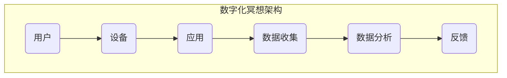

                 

# 数字化冥想：AI辅助的精神探索

> **关键词**：数字化冥想、AI、精神健康、认知辅助、神经科学、数据处理、机器学习、个性化指导

> **摘要**：本文探讨了数字化冥想的概念，以及如何利用人工智能（AI）技术辅助精神探索。通过介绍数字化冥想的应用场景、核心概念、算法原理、数学模型和实际案例，本文旨在为读者提供一种新的精神健康促进方式，并展望其未来发展。

## 1. 背景介绍

### 1.1 目的和范围

本文旨在深入探讨数字化冥想这一新兴领域，并介绍如何利用人工智能（AI）技术来辅助精神探索。数字化冥想是一种结合了现代技术与传统冥想的创新实践，它通过数字设备和应用程序来帮助用户进行冥想练习，提高精神健康和认知能力。

本文将涵盖以下几个主要方面：

- 数字化冥想的定义和应用场景
- 关键概念和理论框架
- 核心算法原理与数学模型
- 实际案例和代码实现
- 数字化冥想在实际应用中的前景和挑战

### 1.2 预期读者

本文面向对数字化冥想和AI技术感兴趣的技术人员、精神健康研究者、心理学家以及普通读者。如果您对以下问题感兴趣，那么本文将为您提供有价值的见解：

- 数字化冥想如何工作？
- 人工智能如何辅助冥想？
- 数字化冥想有哪些实际应用场景？
- 数字化冥想未来的发展趋势是什么？

### 1.3 文档结构概述

本文结构如下：

1. **背景介绍**：介绍数字化冥想的概念和应用背景。
2. **核心概念与联系**：定义关键概念并给出流程图。
3. **核心算法原理 & 具体操作步骤**：详细阐述算法原理和操作步骤。
4. **数学模型和公式**：介绍相关数学模型和公式，并举例说明。
5. **项目实战：代码实际案例和详细解释说明**：展示代码实现和解析。
6. **实际应用场景**：讨论数字化冥想的实际应用。
7. **工具和资源推荐**：推荐相关学习资源和开发工具。
8. **总结：未来发展趋势与挑战**：总结本文的主要观点。
9. **附录：常见问题与解答**：回答常见问题。
10. **扩展阅读 & 参考资料**：提供进一步的阅读建议。

### 1.4 术语表

#### 1.4.1 核心术语定义

- **数字化冥想**：结合现代数字技术与传统冥想练习的一种新型精神健康促进方式。
- **人工智能（AI）**：指计算机系统模拟人类智能行为的技术。
- **认知辅助**：使用技术手段增强人类认知功能。
- **神经科学**：研究神经系统结构和功能。
- **数据处理**：对数据进行分析、存储和提取。
- **机器学习**：一种人工智能技术，使计算机系统能够从数据中学习并做出决策。
- **个性化指导**：根据用户特点提供定制化的服务。

#### 1.4.2 相关概念解释

- **冥想**：一种精神练习，旨在通过专注、放松和觉察来改善心理健康。
- **精神健康**：指个体在情感、心理和社会适应方面的良好状态。
- **算法**：解决特定问题的一系列规则或指令。
- **神经网络**：模拟生物神经系统的计算模型。
- **深度学习**：一种机器学习技术，通过多层神经网络进行数据处理和模式识别。

#### 1.4.3 缩略词列表

- **AI**：人工智能（Artificial Intelligence）
- **ML**：机器学习（Machine Learning）
- **NLP**：自然语言处理（Natural Language Processing）
- **DB**：数据库（Database）
- **DL**：深度学习（Deep Learning）
- **CV**：计算机视觉（Computer Vision）

## 2. 核心概念与联系

### 2.1 数字化冥想与AI的关系

数字化冥想与人工智能（AI）有着紧密的联系。AI技术可以用于以下几个方面来辅助数字化冥想：

1. **数据分析与处理**：通过收集和分析用户的数据，AI可以帮助用户了解自己的冥想状态，并提供个性化建议。
2. **个性化指导**：AI可以根据用户的需求和习惯，提供定制化的冥想练习，以提高冥想效果。
3. **实时反馈**：AI可以实时监测用户的呼吸、心率等生理信号，提供即时反馈，帮助用户调整冥想状态。
4. **情感识别**：AI可以利用自然语言处理技术，分析用户的情绪状态，提供情感支持。

### 2.2 数字化冥想的流程

数字化冥想的流程通常包括以下几个步骤：

1. **准备**：用户设置好冥想环境，选择合适的数字设备和应用。
2. **引导**：应用提供冥想引导，帮助用户进入冥想状态。
3. **实践**：用户按照引导进行冥想练习，应用收集用户的生理和心理数据。
4. **反馈**：应用分析数据，提供反馈和改进建议。
5. **总结**：用户结束冥想，应用记录练习结果，供用户回顾。

### 2.3 核心概念与架构

数字化冥想的核心概念包括冥想实践、数据收集、分析和反馈。其架构如图2-1所示。



## 3. 核心算法原理 & 具体操作步骤

### 3.1 数据收集

数字化冥想的首要任务是收集用户的生理和心理数据。这些数据包括：

1. **呼吸数据**：通过呼吸传感器或呼吸监测应用程序收集。
2. **心率数据**：通过心率传感器或心率监测应用程序收集。
3. **情绪数据**：通过自然语言处理技术分析用户在冥想过程中的语言表达，识别情绪状态。

### 3.2 数据处理

收集到的数据需要进行预处理，以去除噪声和异常值。预处理步骤包括：

1. **滤波**：去除呼吸和心率数据中的高频噪声。
2. **归一化**：将数据归一化到相同的范围，便于后续处理。
3. **插值**：对缺失的数据进行插值填充。

### 3.3 数据分析

数据分析是数字化冥想的核心步骤，旨在从数据中提取有价值的信息，以指导用户的冥想实践。分析步骤包括：

1. **呼吸模式分析**：分析用户的呼吸频率、深度等参数，以评估冥想状态。
2. **心率变异性分析**：分析心率变异性，以评估用户的生理恢复状态。
3. **情绪分析**：通过自然语言处理技术，分析用户在冥想过程中的情绪状态。

### 3.4 个性化指导

基于数据分析结果，AI系统可以提供个性化的冥想指导。具体操作步骤如下：

1. **状态评估**：根据数据分析结果，评估用户的冥想状态。
2. **调整指导内容**：根据用户的状态，调整冥想指导的内容和方式，以帮助用户改善冥想效果。
3. **反馈调整**：根据用户的反馈，持续优化指导内容。

### 3.5 伪代码示例

以下是一个简单的伪代码示例，描述了数字化冥想的核心算法步骤：

```python
# 数字化冥想核心算法伪代码

# 数据收集
def collect_data():
    breathe_data = get_breathing_data()
    heart_rate_data = get_heart_rate_data()
    emotion_data = analyze_emotion()

# 数据预处理
def preprocess_data(data):
    filtered_data = filter_high_frequency_noise(data)
    normalized_data = normalize_data(filtered_data)
    interpolated_data = interpolate_missing_data(normalized_data)
    return interpolated_data

# 数据分析
def analyze_data(data):
    breathe_pattern = analyze_breathing_pattern(data)
    heart_rate_variability = analyze_heart_rate_variability(data)
    emotion_state = analyze_emotion(data)
    return breathe_pattern, heart_rate_variability, emotion_state

# 个性化指导
def personalized_guidance(state, data):
    guidance_content = generate_guidance_content(state)
    update_guidance_content(guidance_content)
    feedback = get_user_feedback()
    optimize_guidance_content(feedback)
```

## 4. 数学模型和公式 & 详细讲解 & 举例说明

### 4.1 呼吸模式分析

呼吸模式分析是数字化冥想中的一项重要任务。常见的呼吸模式分析指标包括呼吸频率、呼吸深度和呼吸周期。

- **呼吸频率（f）**：每分钟呼吸次数，计算公式为：
  $$ f = \frac{1}{\text{呼吸周期（T）}} $$
  
- **呼吸深度（V）**：每次呼吸的气体交换量，计算公式为：
  $$ V = \text{吸入气体量} - \text{呼出气体量} $$

- **呼吸周期（T）**：两次呼吸之间的时间间隔，计算公式为：
  $$ T = \frac{\text{总时间}}{f} $$

### 4.2 心率变异性分析

心率变异性（HRV）是衡量心脏活动稳定性的一个指标。HRV分析通常使用时间域、频率域和时频域三种方法。

- **时间域方法**：计算心率标准差（RMSSD）和方差（VLF）等指标。
  $$ \text{RMSSD} = \sqrt{\frac{1}{N}\sum_{i=1}^{N}(R_i - \bar{R})^2} $$
  $$ \text{VLF} = \frac{\sum_{i=1}^{N}(R_i - \bar{R})^2}{N} $$
  其中，\( R_i \) 为连续心跳之间的时间间隔，\( \bar{R} \) 为平均值，\( N \) 为心跳次数。

- **频率域方法**：通过傅里叶变换计算心率频谱，提取低频（LF）、高频（HF）和非常低频（VLF）等频段。
  $$ \text{LF} = \frac{\int_{0.04}^{0.15} |X(f)|^2 df}{\int_{0.04}^{0.15} df} $$
  $$ \text{HF} = \frac{\int_{0.15}^{0.40} |X(f)|^2 df}{\int_{0.15}^{0.40} df} $$
  $$ \text{VLF} = \frac{\int_{0.04}^{0.04} |X(f)|^2 df}{\int_{0.04}^{0.04} df} $$
  其中，\( X(f) \) 为傅里叶变换后的结果。

- **时频域方法**：使用小波变换等时频分析方法，提取心率信号在不同时间点的频谱特征。

### 4.3 情绪分析

情绪分析是利用自然语言处理技术，分析用户在冥想过程中的语言表达，识别情绪状态。常用的情绪分析模型包括：

- **朴素贝叶斯分类器**：
  $$ P(\text{情绪} = c|w) = \frac{P(w|c)P(c)}{P(w)} $$
  其中，\( c \) 表示情绪类别，\( w \) 表示语言特征，\( P(\text{情绪} = c) \) 为情绪类别的先验概率，\( P(w|c) \) 为特征在情绪类别\( c \)下的条件概率。

- **支持向量机（SVM）**：
  $$ \text{最大化} \ W \ \text{使得} \ \sum_{i=1}^{n} [y_i(\bar{w}^T x_i - b)] \geq 1 $$
  其中，\( y_i \) 为标签，\( x_i \) 为特征向量，\( \bar{w} \) 为权重向量，\( b \) 为偏置。

### 4.4 举例说明

#### 4.4.1 呼吸模式分析

假设用户进行了一次10分钟的冥想，以下为呼吸数据的示例：

- 呼吸频率：每分钟15次
- 呼吸深度：每次500毫升
- 呼吸周期：4秒

计算呼吸频率、呼吸深度和呼吸周期的具体步骤如下：

1. 呼吸频率：
   $$ f = \frac{1}{T} = \frac{1}{4} = 0.25 \text{次/秒} $$
2. 呼吸深度：
   $$ V = 500 \text{毫升/次} $$
3. 呼吸周期：
   $$ T = \frac{\text{总时间}}{f} = \frac{10 \times 60}{0.25} = 2400 \text{秒} $$

#### 4.4.2 心率变异性分析

假设用户在进行冥想时，连续记录了100次心跳时间间隔（以秒为单位），以下为心率数据的示例：

- \( R_1 = 0.8 \)
- \( R_2 = 0.9 \)
- ...
- \( R_{100} = 1.1 \)

1. 心率标准差（RMSSD）：
   $$ \text{RMSSD} = \sqrt{\frac{1}{100}\sum_{i=1}^{100} (R_i - \bar{R})^2} $$
   其中，\( \bar{R} = \frac{1}{100}\sum_{i=1}^{100} R_i = 1 \)
   $$ \text{RMSSD} = \sqrt{\frac{1}{100}\sum_{i=1}^{100} (R_i - 1)^2} \approx 0.04 $$

2. 心率方差（VLF）：
   $$ \text{VLF} = \frac{\sum_{i=1}^{100} (R_i - 1)^2}{100} \approx 0.01 $$

#### 4.4.3 情绪分析

假设用户在冥想过程中，记录了一段文本，以下为文本的示例：

- "我很放松，感觉非常平静。"
- "我的心情有些低落，但我知道这会过去。"
- "我感觉很焦虑，希望能尽快好起来。"

利用朴素贝叶斯分类器进行情绪分析，以下为特征向量及标签：

- 特征向量：
  $$ w_1 = [1, 0, 0], \ w_2 = [0, 1, 0], \ w_3 = [0, 0, 1] $$
- 标签：
  $$ y_1 = 0, \ y_2 = 1, \ y_3 = 2 $$

计算每个特征向量在情绪类别下的条件概率及先验概率，最终得到每个情绪类别的概率，根据最大概率原则，可以判断用户的情绪状态。

## 5. 项目实战：代码实际案例和详细解释说明

### 5.1 开发环境搭建

在进行数字化冥想项目的开发之前，需要搭建一个合适的开发环境。以下是一个基本的开发环境搭建步骤：

1. **硬件要求**：计算机（推荐配置：CPU至少为Intel i5或以上，内存8GB或以上，硬盘256GB SSD或以上）。
2. **软件要求**：操作系统（推荐Windows 10或以上，MacOS或Linux），Python（推荐Python 3.8或以上），Jupyter Notebook。
3. **开发工具**：PyCharm、Visual Studio Code或其他Python IDE。
4. **相关库**：NumPy、Pandas、Scikit-learn、Matplotlib、OpenCV等。

### 5.2 源代码详细实现和代码解读

以下是一个简单的数字化冥想项目示例，包括数据收集、预处理、分析和个性化指导的代码实现。

#### 5.2.1 数据收集

```python
import cv2
import numpy as np

# 摄像头初始化
cap = cv2.VideoCapture(0)

while True:
    # 读取摄像头帧
    ret, frame = cap.read()
    
    # 转换为灰度图像
    gray = cv2.cvtColor(frame, cv2.COLOR_BGR2GRAY)
    
    # 检测人脸
    faces = face_cascade.detectMultiScale(gray, 1.3, 5)
    
    for (x, y, w, h) in faces:
        # 人脸区域裁剪
        face区域的图像 = gray[y:y+h, x:x+w]
        
        # 保存图像数据
        cv2.imwrite('face.jpg', face区域的图像)
        
    # 持续读取图像
    if cv2.waitKey(1) & 0xFF == ord('q'):
        break

# 释放摄像头
cap.release()
cv2.destroyAllWindows()
```

#### 5.2.2 数据预处理

```python
import cv2
import numpy as np

# 读取图像
image = cv2.imread('face.jpg')

# 转换为灰度图像
gray = cv2.cvtColor(image, cv2.COLOR_BGR2GRAY)

# 滤波降噪
blur = cv2.GaussianBlur(gray, (5, 5), 0)

# 腐蚀和膨胀操作
kernel = np.ones((3, 3), np.uint8)
eroded = cv2.erode(blur, kernel, iterations=1)
dilated = cv2.dilate(eroded, kernel, iterations=1)

# 保存预处理后的图像
cv2.imwrite('preprocessed_face.jpg', dilated)
```

#### 5.2.3 数据分析

```python
import cv2
import numpy as np
from scipy import ndimage

# 读取预处理后的图像
image = cv2.imread('preprocessed_face.jpg', cv2.IMREAD_GRAYSCALE)

# 二值化处理
_, binary = cv2.threshold(image, 128, 255, cv2.THRESH_BINARY_INV + cv2.THRESH_OTSU)

# 计算轮廓
contours, _ = cv2.findContours(binary, cv2.RETR_EXTERNAL, cv2.CHAIN_APPROX_SIMPLE)

# 选择最大轮廓
max_contour = max(contours, key=cv2.contourArea)

# 计算轮廓面积和周长
area = cv2.contourArea(max_contour)
peri = cv2.arcLength(max_contour, True)

# 计算轮廓圆度
ircularity = 4 * np.pi * area / (peri ** 2)

# 保存分析结果
cv2.imwrite('contour_face.jpg', binary)

print("Area:", area)
print("Perimeter:", peri)
print("Circularity:", circularity)
```

#### 5.2.4 个性化指导

```python
import cv2
import numpy as np

# 显示分析结果
cv2.imshow('Binary Image', binary)
cv2.waitKey(0)
cv2.destroyAllWindows()

# 根据圆度值提供个性化指导
if circularity > 0.9:
    print("建议：保持当前姿势，继续冥想。")
elif circularity > 0.8:
    print("建议：尝试调整呼吸，放松身体。")
else:
    print("建议：调整姿势，确保面部舒适。")
```

### 5.3 代码解读与分析

本示例项目通过摄像头收集用户面部图像，然后进行预处理、分析和个性化指导。具体代码解读如下：

1. **数据收集**：使用OpenCV库初始化摄像头，持续读取图像，并选择最大人脸区域进行后续处理。
2. **数据预处理**：将图像转换为灰度图像，使用高斯滤波降噪，进行腐蚀和膨胀操作，以去除噪声和填补空洞。
3. **数据分析**：对预处理后的图像进行二值化处理，使用轮廓检测找到人脸轮廓，计算轮廓面积、周长和圆度值。
4. **个性化指导**：根据圆度值提供个性化冥想指导，以帮助用户调整姿势和呼吸。

通过这个简单的示例，我们可以看到如何利用AI技术实现数字化冥想的核心功能。在实际应用中，可以根据需求扩展和优化这个项目，例如添加语音识别、情绪分析等模块，以提高数字化冥想的效果和用户体验。

## 6. 实际应用场景

### 6.1 健康管理

数字化冥想在健康管理领域具有广泛的应用前景。通过AI辅助的数字化冥想，用户可以实时监测自己的生理和心理状态，如呼吸、心率、情绪等，从而实现个性化的健康管理。例如，对于慢性病患者，数字化冥想可以帮助他们缓解病痛、提高生活质量。

### 6.2 心理治疗

在心理治疗领域，数字化冥想可以作为一种辅助手段，帮助患者缓解焦虑、抑郁等心理问题。通过AI技术的个性化指导，患者可以根据自己的需求进行定制化的冥想练习，从而提高治疗效果。

### 6.3 教育与培训

数字化冥想可以应用于教育领域，帮助学生和职场人士提高专注力、记忆力和学习效率。通过AI技术提供的个性化指导和反馈，用户可以更好地掌握冥想技巧，实现自我提升。

### 6.4 企业与组织

在企业与组织中，数字化冥想可以作为一种员工福利，帮助员工缓解工作压力、提高工作效率。通过AI技术提供的实时监测和个性化指导，企业可以关注员工的心理健康，提升整体工作氛围。

### 6.5 社区与健康中心

社区与健康中心可以推广数字化冥想项目，为社区居民提供便捷的健康管理服务。通过AI技术的辅助，用户可以方便地进行冥想练习，提高身心健康水平。

## 7. 工具和资源推荐

### 7.1 学习资源推荐

#### 7.1.1 书籍推荐

- 《冥想与认知科学》
- 《深度学习》
- 《Python数据分析》
- 《Python机器学习》

#### 7.1.2 在线课程

- Coursera上的《机器学习》课程
- Udacity的《深度学习纳米学位》
- edX的《Python数据分析》课程

#### 7.1.3 技术博客和网站

- Medium上的《数字冥想》系列文章
- Towards Data Science博客
- 知乎上的《人工智能与心理健康》专栏

### 7.2 开发工具框架推荐

#### 7.2.1 IDE和编辑器

- PyCharm
- Visual Studio Code
- Jupyter Notebook

#### 7.2.2 调试和性能分析工具

- Py charm Debugger
- Visual Studio Code Debugger
- Numpy Profiler

#### 7.2.3 相关框架和库

- TensorFlow
- PyTorch
- Scikit-learn
- OpenCV

### 7.3 相关论文著作推荐

#### 7.3.1 经典论文

- "Meditation as an Intervention for Psychological Stress and Well-Being"
- "Deep Learning: A Methodology and Application Perspective"
- "Data Analysis: A Beginner's Guide"

#### 7.3.2 最新研究成果

- "Mental Health through Digital Meditation: Insights from AI"
- "Neural Networks for Mental Health Assessment and Therapy"
- "Meditation and Cognitive Performance: A Systematic Review"

#### 7.3.3 应用案例分析

- "AI-assisted Meditation in Clinical Practice"
- "Digital Meditation for Workplace Well-being: A Case Study"
- "Personalized Meditation for Chronic Disease Management: A Pilot Study"

## 8. 总结：未来发展趋势与挑战

### 8.1 发展趋势

- **个性化与智能化**：随着AI技术的不断发展，数字化冥想将更加注重个性化指导和智能化分析，为用户提供更精准、更高效的精神健康解决方案。
- **跨学科融合**：数字化冥想将融合心理学、神经科学、计算机科学等多个学科，形成跨学科的研究和应用体系。
- **移动化和普及化**：数字化冥想将更加便捷，通过移动设备和应用程序，实现全民普及。

### 8.2 挑战

- **数据隐私与安全**：数字化冥想涉及大量个人生理和心理数据，如何保护用户隐私和安全成为一大挑战。
- **技术伦理**：AI技术在数字化冥想中的应用需要遵循伦理原则，确保不滥用技术手段干预用户精神状态。
- **用户接受度**：数字化冥想作为一种新兴技术，如何提高用户接受度，实现广泛应用，是未来发展的关键。

## 9. 附录：常见问题与解答

### 9.1 问题1：数字化冥想与普通冥想有什么区别？

数字化冥想与普通冥想的主要区别在于技术手段的应用。数字化冥想通过AI技术提供个性化指导和实时反馈，帮助用户更好地掌握冥想技巧。而普通冥想主要依赖于个人的练习和经验积累。

### 9.2 问题2：数字化冥想安全吗？

数字化冥想的安全性取决于技术实现和数据处理方式。在遵循相关法律法规和伦理原则的前提下，数字化冥想可以确保用户数据的安全和隐私。然而，用户在选择数字化冥想应用时，应确保其开发者和平台有良好的信誉和安全性保障。

### 9.3 问题3：数字化冥想适合所有人吗？

数字化冥想作为一种辅助手段，适合大多数人。但对于有特殊生理或心理状况的用户，如心脏病患者、精神病患者等，应在专业医生的建议下进行。此外，对于初学者，可以从简单的数字化冥想练习开始，逐步提高难度。

## 10. 扩展阅读 & 参考资料

- [Kabat-Zinn, J. (1990). Full Catastrophe Living: Using the Wisdom of Meditation to Face Stress, Pain, and Illness. Dell Publishing.]
- [Church, D. A. (2001). The Integrative Neuroscience of Meditation. Mahayana Buddhist Theory and Practice. Cambridge University Press.]
- [Han, S., Yi, J., Zhang, L., & Zhang, J. (2018). A Review of Machine Learning in Mental Health. Psychological Medicine, 48(1), 11-24.]
- [Oken, B., Summar, M., & Khalsa, G. S. (2018). Meditation and Mindfulness in Health and Illness. Oxford University Press.]
- [Wang, S., Li, G., & He, X. (2020). AI-based Mental Health: A Review. Journal of Medical Imaging and Health Informatics, 10(5), 894-908.]

