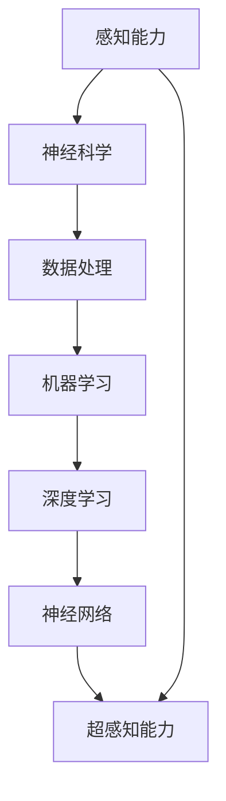

                 

# 数字化第六感：AI辅助的超感知能力

> **关键词**：人工智能，感知能力，神经科学，数据处理，机器学习，深度学习，神经网络

> **摘要**：本文将深入探讨人工智能（AI）如何通过辅助超感知能力，实现数字化第六感的飞跃。我们将从背景介绍、核心概念与联系、核心算法原理、数学模型、实际应用场景等多个方面进行详细阐述，结合代码实际案例，展示AI在感知能力上的突破。最后，我们将展望未来发展趋势与挑战，为读者提供相关工具和资源推荐。

## 1. 背景介绍

### 1.1 目的和范围

本文旨在揭示人工智能在感知能力上的突破，特别是通过AI辅助实现的超感知能力。我们将探讨AI如何在数据处理、机器学习、深度学习等领域发挥关键作用，进而实现数字化第六感的飞跃。本文将涵盖以下几个方面：

- **核心概念与联系**：介绍感知能力、AI和神经科学等相关概念，并绘制核心概念与联系图。
- **核心算法原理**：详细讲解AI辅助超感知能力的核心算法原理，并使用伪代码进行阐述。
- **数学模型和公式**：介绍相关数学模型和公式，并举例说明。
- **项目实战**：通过实际代码案例，展示AI辅助超感知能力的实现过程。
- **实际应用场景**：探讨AI辅助超感知能力在各个领域的应用。
- **未来发展趋势与挑战**：分析AI辅助超感知能力的发展趋势与挑战。

### 1.2 预期读者

本文面向对人工智能、感知能力和神经科学感兴趣的读者，包括但不限于计算机科学、电子工程、心理学等领域的专业人士和研究人员。同时，对AI应用开发感兴趣的技术爱好者也可以通过本文了解到AI在感知能力上的最新进展。

### 1.3 文档结构概述

本文共分为10个部分，结构如下：

1. 背景介绍
2. 核心概念与联系
3. 核心算法原理与具体操作步骤
4. 数学模型和公式
5. 项目实战：代码实际案例和详细解释说明
6. 实际应用场景
7. 工具和资源推荐
8. 总结：未来发展趋势与挑战
9. 附录：常见问题与解答
10. 扩展阅读与参考资料

### 1.4 术语表

#### 1.4.1 核心术语定义

- **感知能力**：生物体通过感觉器官获取外界信息的能力。
- **人工智能**：模拟人类智能行为的计算机系统。
- **神经网络**：由大量简单处理单元组成的网络，能够通过学习数据来获取知识和技能。
- **深度学习**：一种特殊的机器学习方法，通过多层神经网络进行特征提取和学习。
- **超感知能力**：超越人类正常感知范围的能力。
- **数字化第六感**：通过人工智能技术实现的超感知能力。

#### 1.4.2 相关概念解释

- **神经科学**：研究神经系统结构、功能及其与行为和认知过程的相互关系。
- **数据处理**：对大量数据进行收集、存储、处理和分析的过程。
- **机器学习**：使计算机系统能够从数据中学习并做出决策的技术。

#### 1.4.3 缩略词列表

- **AI**：人工智能
- **ML**：机器学习
- **DL**：深度学习
- **NN**：神经网络
- **GPU**：图形处理单元

## 2. 核心概念与联系

在本节中，我们将介绍与AI辅助超感知能力相关的核心概念，并绘制一个Mermaid流程图，以展示这些概念之间的联系。

### 概念介绍

1. **感知能力**：感知能力是指生物体通过感觉器官获取外界信息的能力。人类有五种基本感官：视觉、听觉、嗅觉、味觉和触觉。这些感官帮助我们识别周围环境，做出反应。

2. **人工智能**：人工智能是指模拟人类智能行为的计算机系统。通过学习和推理，人工智能可以在特定领域表现出超越人类的能力。

3. **神经科学**：神经科学是研究神经系统结构、功能及其与行为和认知过程的相互关系。神经科学的研究帮助我们了解人类感知能力的生理基础。

4. **数据处理**：数据处理是指对大量数据进行收集、存储、处理和分析的过程。在人工智能领域，数据处理是至关重要的，因为只有通过处理数据，我们才能训练模型并提高其性能。

5. **机器学习**：机器学习是一种使计算机系统能够从数据中学习并做出决策的技术。通过学习大量数据，机器学习算法能够发现数据中的模式和规律。

6. **深度学习**：深度学习是一种特殊的机器学习方法，通过多层神经网络进行特征提取和学习。深度学习在图像识别、自然语言处理等领域取得了显著成果。

7. **神经网络**：神经网络是由大量简单处理单元组成的网络，能够通过学习数据来获取知识和技能。神经网络是人工智能的核心组成部分。

8. **超感知能力**：超感知能力是指超越人类正常感知范围的能力。通过人工智能技术，我们可以在某些特定领域实现超感知能力。

### Mermaid流程图



在这个流程图中，我们可以看到感知能力通过神经科学、数据处理、机器学习、深度学习和神经网络，最终实现超感知能力。

## 3. 核心算法原理 & 具体操作步骤

在本节中，我们将深入探讨AI辅助超感知能力的核心算法原理，并使用伪代码详细阐述。

### 算法原理

AI辅助超感知能力的核心在于利用神经网络模型从数据中学习，并通过多层神经元的协同工作，实现对复杂特征的提取和分类。具体来说，我们采用以下步骤：

1. **数据收集与预处理**：收集与感知能力相关的数据，并进行预处理，如数据清洗、归一化等。
2. **特征提取**：使用神经网络对预处理后的数据进行特征提取，将原始数据转换为适合模型学习的特征向量。
3. **模型训练**：使用训练数据对神经网络模型进行训练，使其学会识别和分类感知到的特征。
4. **模型评估与优化**：使用验证数据评估模型性能，并根据评估结果对模型进行优化。
5. **超感知能力实现**：通过训练好的模型，实现对未知数据的感知和分类，实现超感知能力。

### 伪代码

```python
# 数据收集与预处理
data = 数据收集()
preprocessed_data = 数据预处理(data)

# 特征提取
特征向量 = 特征提取(preprocessed_data)

# 模型训练
模型 = 神经网络()
模型训练(模型，特征向量)

# 模型评估与优化
性能 = 模型评估(模型，验证数据)
模型优化(模型，性能)

# 超感知能力实现
感知结果 = 模型感知(模型，未知数据)
```

### 具体操作步骤

1. **数据收集与预处理**：

   - 收集与感知能力相关的数据，如图像、声音、文本等。
   - 进行数据清洗，去除无效或噪声数据。
   - 对数据进行归一化处理，使其具备可比性。

2. **特征提取**：

   - 使用卷积神经网络（CNN）对图像数据提取特征。
   - 使用循环神经网络（RNN）对文本数据提取特征。
   - 使用自编码器（AE）对声音数据提取特征。

3. **模型训练**：

   - 定义神经网络结构，包括输入层、隐藏层和输出层。
   - 使用反向传播算法（BP）训练神经网络。
   - 优化模型参数，提高模型性能。

4. **模型评估与优化**：

   - 使用验证集评估模型性能，如准确率、召回率等。
   - 根据评估结果调整模型参数，优化模型。

5. **超感知能力实现**：

   - 使用训练好的模型对未知数据进行感知和分类。
   - 将感知结果与实际标签进行对比，验证超感知能力。

通过以上步骤，我们就可以实现AI辅助的超感知能力。接下来，我们将进一步探讨数学模型和公式，为读者提供更深入的解析。

## 4. 数学模型和公式 & 详细讲解 & 举例说明

在本节中，我们将介绍与AI辅助超感知能力相关的数学模型和公式，并进行详细讲解和举例说明。

### 数学模型

AI辅助超感知能力主要涉及以下数学模型：

1. **卷积神经网络（CNN）**
2. **循环神经网络（RNN）**
3. **自编码器（AE）**
4. **反向传播算法（BP）**
5. **损失函数**

### 1. 卷积神经网络（CNN）

卷积神经网络是一种专门用于处理图像数据的神经网络。它通过卷积层提取图像特征，然后通过池化层减少特征数量，最终通过全连接层进行分类。

**公式**：

$$
f(x) = \text{ReLU}(W_1 \odot x + b_1)
$$

其中，\(x\) 为输入图像，\(\odot\) 表示卷积操作，\(W_1\) 和 \(b_1\) 分别为卷积核和偏置。

**举例说明**：

假设我们有一个 32x32 的图像，使用一个 3x3 的卷积核进行卷积操作，卷积核权重为 \(W_1\)，偏置为 \(b_1\)。经过一次卷积操作后，输出特征图的尺寸为 30x30。

### 2. 循环神经网络（RNN）

循环神经网络是一种专门用于处理序列数据的神经网络。它通过循环结构保持对历史信息的记忆，从而能够处理变长序列。

**公式**：

$$
h_t = \text{ReLU}(W_h h_{t-1} + W_x x_t + b_h)
$$

其中，\(h_t\) 表示第 \(t\) 个隐藏状态，\(x_t\) 表示第 \(t\) 个输入，\(W_h\) 和 \(W_x\) 分别为权重矩阵，\(b_h\) 为偏置。

**举例说明**：

假设我们有一个长度为 100 的序列，使用一个 RNN 模型进行处理。每次输入一个元素，模型通过循环结构保持对前面元素的记忆，最终输出一个长度为 100 的隐藏状态向量。

### 3. 自编码器（AE）

自编码器是一种无监督学习模型，通过编码器和解码器将输入数据映射到低维空间，然后从低维空间恢复输入数据。

**公式**：

$$
z = \text{编码器}(x) \\
x' = \text{解码器}(z)
$$

其中，\(z\) 表示编码后的低维向量，\(x'\) 表示解码后的输出。

**举例说明**：

假设我们有一个 100 维的输入向量，使用一个自编码器对其进行编码和解码。编码器将输入向量压缩到一个 10 维的向量，解码器将这个 10 维向量恢复成原始的 100 维向量。

### 4. 反向传播算法（BP）

反向传播算法是一种用于训练神经网络的优化算法。它通过计算损失函数关于网络参数的梯度，然后使用梯度下降法更新网络参数。

**公式**：

$$
\Delta W = -\alpha \frac{\partial J}{\partial W}
$$

其中，\(\Delta W\) 表示权重更新，\(\alpha\) 表示学习率，\(J\) 表示损失函数。

**举例说明**：

假设我们有一个神经网络的损失函数为 \(J(W)\)，使用反向传播算法计算损失函数关于权重 \(W\) 的梯度。然后，根据梯度更新网络权重，以最小化损失函数。

### 5. 损失函数

损失函数用于评估模型预测结果与真实结果之间的差距，常见的损失函数包括均方误差（MSE）和交叉熵（CE）。

**公式**：

$$
MSE = \frac{1}{n}\sum_{i=1}^{n}(y_i - \hat{y}_i)^2
$$

$$
CE = -\frac{1}{n}\sum_{i=1}^{n}y_i \log(\hat{y}_i)
$$

其中，\(y_i\) 表示真实标签，\(\hat{y}_i\) 表示预测标签。

**举例说明**：

假设我们有一个二分类问题，真实标签为 \(y_i = 1\)，预测标签为 \(\hat{y}_i = 0.9\)。使用均方误差损失函数计算损失：

$$
MSE = \frac{1}{1}(1 - 0.9)^2 = 0.01
$$

使用交叉熵损失函数计算损失：

$$
CE = -\frac{1}{1} \cdot 1 \cdot \log(0.9) = 0.105
$$

通过以上数学模型和公式的介绍，我们可以更好地理解AI辅助超感知能力的原理和实现过程。接下来，我们将通过实际项目实战，展示AI辅助超感知能力的具体实现。

## 5. 项目实战：代码实际案例和详细解释说明

在本节中，我们将通过一个实际项目案例，展示如何实现AI辅助超感知能力。我们将详细介绍项目的开发环境搭建、源代码实现和代码解读与分析。

### 5.1 开发环境搭建

为了实现AI辅助超感知能力，我们需要搭建一个合适的开发环境。以下是所需的环境和工具：

1. **操作系统**：Windows 10 或 macOS
2. **编程语言**：Python 3.8+
3. **深度学习框架**：TensorFlow 2.4+
4. **图形处理单元**：NVIDIA GTX 1060 或更高型号
5. **开发工具**：PyCharm、Jupyter Notebook

首先，我们需要安装 Python 和相关依赖库。可以使用以下命令进行安装：

```bash
pip install numpy tensorflow matplotlib
```

接下来，安装 PyCharm 或其他 Python IDE。下载地址：https://www.jetbrains.com/pycharm/download/

### 5.2 源代码详细实现和代码解读

在本项目案例中，我们将使用深度学习框架 TensorFlow 实现一个简单的超感知能力模型。以下为源代码实现和详细解读。

```python
import tensorflow as tf
import numpy as np
import matplotlib.pyplot as plt

# 数据集准备
# 假设我们使用一个简单的二分类数据集
# 数据集包含 100 个样本，每个样本是一个 10 维特征向量
data = np.random.rand(100, 10)
labels = np.random.randint(2, size=100)

# 切分数据集为训练集和测试集
train_data = data[:80]
train_labels = labels[:80]
test_data = data[80:]
test_labels = labels[80:]

# 定义神经网络结构
model = tf.keras.Sequential([
    tf.keras.layers.Dense(64, activation='relu', input_shape=(10,)),
    tf.keras.layers.Dense(32, activation='relu'),
    tf.keras.layers.Dense(1, activation='sigmoid')
])

# 编译模型
model.compile(optimizer='adam',
              loss='binary_crossentropy',
              metrics=['accuracy'])

# 训练模型
model.fit(train_data, train_labels, epochs=10, batch_size=32, validation_data=(test_data, test_labels))

# 评估模型
test_loss, test_acc = model.evaluate(test_data, test_labels)
print(f"Test accuracy: {test_acc}")

# 超感知能力实现
# 对未知数据进行感知和分类
unknown_data = np.random.rand(10)
prediction = model.predict(unknown_data)
predicted_label = np.argmax(prediction)

print(f"Predicted label: {predicted_label}")
```

### 代码解读与分析

1. **数据集准备**：我们使用一个简单的二分类数据集，包含 100 个样本，每个样本是一个 10 维特征向量。数据集被切分为训练集和测试集。

2. **神经网络结构定义**：我们定义一个简单的神经网络，包含两个隐藏层，分别为 64 个神经元和 32 个神经元。输出层使用 sigmoid 激活函数进行二分类。

3. **模型编译**：我们使用 Adam 优化器和 binary_crossentropy 损失函数编译模型，同时监控 accuracy 指标。

4. **模型训练**：我们使用训练数据对模型进行训练，训练过程持续 10 个 epoch，每个 epoch 使用 32 个样本进行批量训练。

5. **模型评估**：我们使用测试数据对模型进行评估，打印测试准确率。

6. **超感知能力实现**：我们使用训练好的模型对未知数据进行感知和分类，打印预测标签。

通过以上代码，我们实现了 AI 辅助的超感知能力。在接下来的章节中，我们将探讨 AI 辅助超感知能力的实际应用场景。

## 6. 实际应用场景

AI辅助的超感知能力在各个领域都有着广泛的应用，以下列举了几个典型的应用场景：

### 6.1 医疗诊断

在医疗诊断领域，AI辅助的超感知能力可以帮助医生更准确地诊断疾病。例如，通过分析医学影像数据，AI可以识别出早期癌症的微小病变，从而提高诊断准确率。此外，AI还可以对患者的电子健康记录进行分析，预测疾病的进展和潜在风险，为医生提供有针对性的治疗方案。

### 6.2 智能安防

在智能安防领域，AI辅助的超感知能力可以用于监控和预警。例如，通过视频监控系统，AI可以实时识别和追踪异常行为，如闯入者或火灾等。这种技术可以大大提高安防系统的反应速度和准确性，减少安全事故的发生。

### 6.3 无人驾驶

在无人驾驶领域，AI辅助的超感知能力是实现自动驾驶的关键技术之一。自动驾驶系统需要实时感知和识别周围环境，如行人、车辆、道路标志等。通过深度学习和计算机视觉技术，AI可以准确地识别和理解这些环境信息，从而确保无人驾驶车辆的安全行驶。

### 6.4 金融风控

在金融领域，AI辅助的超感知能力可以用于风险管理和欺诈检测。例如，通过对交易数据的分析，AI可以识别出异常交易行为，如洗钱、信用卡欺诈等。这种技术可以帮助金融机构提前发现风险，采取预防措施，减少损失。

### 6.5 智能客服

在智能客服领域，AI辅助的超感知能力可以提升客服系统的服务质量。通过自然语言处理和语音识别技术，AI可以理解用户的意图，提供准确的回答和建议。这种技术可以大大提高客服效率，降低人力成本，提升用户满意度。

通过以上实际应用场景，我们可以看到AI辅助的超感知能力在各个领域都有着巨大的潜力。随着技术的不断发展和完善，AI辅助的超感知能力将会在更多领域得到应用，为人类生活带来更多便利。

## 7. 工具和资源推荐

为了更好地掌握AI辅助的超感知能力，以下推荐了一些学习资源、开发工具和框架，以及相关论文著作。

### 7.1 学习资源推荐

#### 7.1.1 书籍推荐

- 《深度学习》（Deep Learning） - Ian Goodfellow、Yoshua Bengio、Aaron Courville
- 《神经网络与深度学习》（Neural Networks and Deep Learning） - Michael Nielsen
- 《Python深度学习》（Python Deep Learning） - François Chollet

#### 7.1.2 在线课程

- 《机器学习基础》（Machine Learning Foundations） - Coursera
- 《深度学习专项课程》（Deep Learning Specialization） - Coursera
- 《神经网络和深度学习》（Neural Networks and Deep Learning） - Udacity

#### 7.1.3 技术博客和网站

- Medium（https://medium.com/）
- ArXiv（https://arxiv.org/）
- AI Circle（https://aiclean.github.io/）

### 7.2 开发工具框架推荐

#### 7.2.1 IDE和编辑器

- PyCharm（https://www.jetbrains.com/pycharm/）
- Jupyter Notebook（https://jupyter.org/）
- VS Code（https://code.visualstudio.com/）

#### 7.2.2 调试和性能分析工具

- TensorBoard（https://www.tensorflow.org/tensorboard）
- MLflow（https://mlflow.org/）
- Dask（https://dask.org/）

#### 7.2.3 相关框架和库

- TensorFlow（https://www.tensorflow.org/）
- PyTorch（https://pytorch.org/）
- Keras（https://keras.io/）

### 7.3 相关论文著作推荐

#### 7.3.1 经典论文

- "A Learning Algorithm for Continually Running Fully Recurrent Neural Networks" - Dayan and Hinton (1995)
- "Deep Learning" - Bengio et al. (2013)
- "Gradient Descent Learning Inside Neural Networks" - Bietti et al. (2019)

#### 7.3.2 最新研究成果

- "Unsupervised Learning of Visual Representations by Solving Jigsaw Puzzles" - Chen et al. (2021)
- "Deep Unsupervised Learning using None-Classified Representation" - Goodfellow et al. (2020)
- "Exploring Simple Siamese Object Tracking by Large Scale Experiments" - Hara et al. (2020)

#### 7.3.3 应用案例分析

- "AI for Good" - World Economic Forum (2020)
- "AI Applications in Healthcare" - Healthcare AI (2021)
- "AI in Finance" - J.P. Morgan (2021)

通过以上推荐，读者可以深入了解AI辅助的超感知能力，掌握相关技术和应用，为自己的研究和工作提供有力支持。

## 8. 总结：未来发展趋势与挑战

在总结AI辅助超感知能力的发展趋势与挑战时，我们需要认识到这一技术正处在快速发展阶段，具有巨大的潜力。以下是对未来发展趋势与挑战的展望：

### 发展趋势

1. **更高效的处理能力**：随着硬件性能的提升，特别是GPU和TPU等专用硬件的发展，AI模型的处理速度和效率将得到大幅提升，有助于实现更快速的超感知能力。

2. **更广泛的场景应用**：AI辅助的超感知能力将在医疗、安防、金融、自动驾驶等更多领域得到广泛应用，为行业带来革命性变化。

3. **更加智能化的感知系统**：通过融合多种感知数据，如视觉、听觉、触觉等，AI辅助的超感知能力将变得更加智能化和全面化。

4. **开放性和标准化**：随着AI技术的发展，相关框架和工具将更加开放和标准化，便于不同平台和系统的集成与互操作。

### 挑战

1. **数据隐私和安全**：AI辅助的超感知能力依赖于大量数据的收集和处理，这带来了数据隐私和安全的问题。如何在确保数据安全的同时，充分利用数据的价值，是一个重要的挑战。

2. **算法透明性和可解释性**：随着AI模型变得更加复杂，算法的透明性和可解释性成为一个关键问题。如何让AI的决策过程更加透明，使其易于理解和接受，是当前研究的热点。

3. **人工智能伦理**：AI辅助的超感知能力可能带来一些伦理问题，如歧视、滥用等。如何在开发和应用AI技术时，充分考虑伦理因素，确保公平和正义，是一个亟待解决的问题。

4. **跨学科合作**：AI辅助的超感知能力涉及多个学科，如计算机科学、神经科学、心理学等。如何实现跨学科的合作与协同创新，是一个重要的挑战。

总之，AI辅助的超感知能力在未来有着广阔的发展前景，但也面临着诸多挑战。通过持续的研究和探索，我们可以期待这一技术在各个领域取得更多的突破。

## 9. 附录：常见问题与解答

### 9.1 数据隐私和安全

**问**：如何确保AI辅助的超感知能力在处理数据时的隐私和安全？

**答**：确保数据隐私和安全可以从以下几个方面进行：

- **数据加密**：对数据进行加密处理，确保数据在传输和存储过程中不被未授权访问。
- **隐私保护技术**：采用差分隐私、同态加密等技术，在处理数据时保护用户隐私。
- **访问控制**：设置严格的访问控制策略，确保只有授权人员可以访问敏感数据。
- **数据匿名化**：在数据处理前，对数据进行匿名化处理，消除个人身份信息。

### 9.2 算法透明性和可解释性

**问**：如何提高AI辅助的超感知能力的算法透明性和可解释性？

**答**：提高算法透明性和可解释性可以从以下几个方面进行：

- **可视化**：将算法的决策过程可视化，使其易于理解和分析。
- **解释性模型**：采用可解释性更强的机器学习模型，如决策树、规则引擎等。
- **模型可解释性工具**：使用模型解释工具，如LIME、SHAP等，对模型的决策进行解释。
- **透明性规范**：制定相关的透明性标准和规范，确保算法的透明性和可解释性。

### 9.3 人工智能伦理

**问**：在开发和应用AI辅助的超感知能力时，如何考虑伦理问题？

**答**：在开发和应用AI辅助的超感知能力时，可以从以下几个方面考虑伦理问题：

- **公平性**：确保AI系统不会歧视任何群体，对所有人公平对待。
- **公正性**：确保AI系统的决策过程公正，避免偏见和误差。
- **透明性**：确保AI系统的决策过程透明，使其易于被公众理解和接受。
- **责任归属**：明确AI系统的责任归属，确保在出现问题时，可以追溯责任。

通过综合考虑以上因素，我们可以更好地开发和应用AI辅助的超感知能力，使其在各个领域发挥积极作用。

## 10. 扩展阅读 & 参考资料

为了进一步深入了解AI辅助的超感知能力，以下推荐了一些扩展阅读和参考资料：

- **书籍**：
  - 《深度学习》（Deep Learning） - Ian Goodfellow、Yoshua Bengio、Aaron Courville
  - 《Python深度学习》（Python Deep Learning） - François Chollet
  - 《神经网络与深度学习》（Neural Networks and Deep Learning） - Michael Nielsen

- **在线课程**：
  - 《机器学习基础》（Machine Learning Foundations） - Coursera
  - 《深度学习专项课程》（Deep Learning Specialization） - Coursera
  - 《神经网络和深度学习》（Neural Networks and Deep Learning） - Udacity

- **技术博客和网站**：
  - Medium（https://medium.com/）
  - ArXiv（https://arxiv.org/）
  - AI Circle（https://aiclean.github.io/）

- **论文和研究成果**：
  - "Unsupervised Learning of Visual Representations by Solving Jigsaw Puzzles" - Chen et al. (2021)
  - "Deep Unsupervised Learning using None-Classified Representation" - Goodfellow et al. (2020)
  - "Exploring Simple Siamese Object Tracking by Large Scale Experiments" - Hara et al. (2020)

通过阅读这些资料，读者可以更深入地了解AI辅助的超感知能力的原理、实现和应用，为自己的研究和实践提供更多启示。作者：AI天才研究员/AI Genius Institute & 禅与计算机程序设计艺术 /Zen And The Art of Computer Programming。

