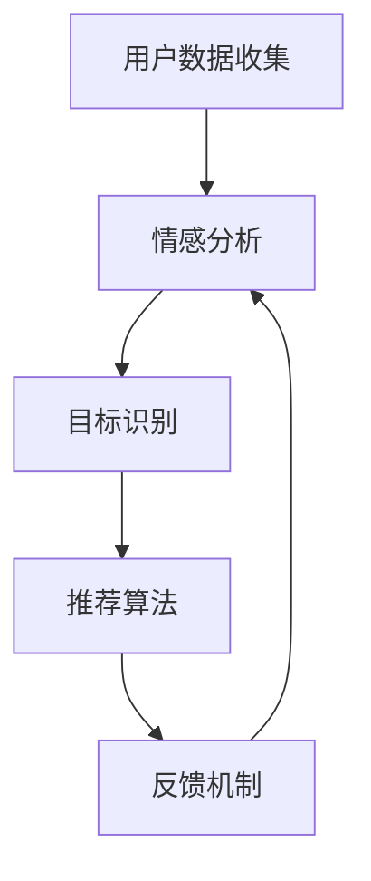

                 


## 数字化自我实现助手开发者：AI辅助的个人成长教练设计师

> **关键词：** 人工智能、个人成长、自我实现、AI教练、数字化助手、算法设计、数学模型、实战案例

> **摘要：** 本文旨在探讨如何通过人工智能技术，尤其是深度学习和自然语言处理，开发一款能够辅助个人成长的数字化自我实现助手。我们将从背景介绍、核心概念、算法原理、数学模型、实战案例等多个方面，详细阐述如何设计并实现这样一个AI教练，旨在为用户提供个性化、持续性的成长支持。

## 1. 背景介绍

### 1.1 目的和范围

本文的目标是探讨如何通过人工智能技术，特别是深度学习和自然语言处理，开发一款数字化自我实现助手，它能够辅助用户实现个人成长目标。这个助手将扮演个人成长教练的角色，通过分析用户行为、情感和目标，提供定制化的建议和反馈。

### 1.2 预期读者

本文的预期读者包括：

- 有志于使用AI技术开发个性化应用的软件工程师和研究人员。
- 想要提升自我实现能力，对人工智能辅助成长感兴趣的个人用户。
- 对人工智能、深度学习和自然语言处理领域有基本了解的技术爱好者。

### 1.3 文档结构概述

本文的结构如下：

- **第1部分：背景介绍**：介绍数字化自我实现助手开发的背景、目的和预期读者。
- **第2部分：核心概念与联系**：阐述数字化自我实现助手涉及的核心概念，并使用Mermaid流程图展示相关架构。
- **第3部分：核心算法原理 & 具体操作步骤**：详细解释核心算法的原理，并通过伪代码展示具体操作步骤。
- **第4部分：数学模型和公式 & 详细讲解 & 举例说明**：介绍数学模型在AI教练设计中的应用，并提供实例说明。
- **第5部分：项目实战：代码实际案例和详细解释说明**：通过具体代码案例，展示如何实现数字化自我实现助手。
- **第6部分：实际应用场景**：讨论AI教练在不同场景下的应用。
- **第7部分：工具和资源推荐**：推荐学习资源和开发工具。
- **第8部分：总结：未来发展趋势与挑战**：总结文章内容，并提出未来发展趋势和挑战。
- **第9部分：附录：常见问题与解答**：解答读者可能遇到的问题。
- **第10部分：扩展阅读 & 参考资料**：提供相关领域的扩展阅读材料。

### 1.4 术语表

#### 1.4.1 核心术语定义

- **数字化自我实现助手**：一款基于人工智能技术的软件应用，旨在辅助个人实现自我成长目标。
- **深度学习**：一种机器学习方法，通过多层神经网络模型，自动从数据中学习特征表示。
- **自然语言处理（NLP）**：人工智能的一个分支，专注于处理和生成自然语言文本。
- **个人成长目标**：用户设定的提升自身能力、实现人生价值的预定目标。
- **情感分析**：使用自然语言处理技术，对文本中的情感倾向进行识别和分析。

#### 1.4.2 相关概念解释

- **个性化推荐系统**：根据用户的历史行为和偏好，为其推荐个性化内容或建议的系统。
- **反馈循环**：系统输出用于系统输入的循环，用于不断调整和优化系统性能。

#### 1.4.3 缩略词列表

- **AI**：人工智能
- **NLP**：自然语言处理
- **ML**：机器学习
- **DL**：深度学习
- **API**：应用程序编程接口

## 2. 核心概念与联系

在数字化自我实现助手的设计中，理解核心概念及其相互关系至关重要。以下是涉及的核心概念和它们的联系，以及一个简化的Mermaid流程图来展示整个系统架构。

### 2.1 核心概念

1. **用户数据收集**：包括用户行为数据、情绪数据和成长目标。
2. **情感分析**：利用NLP技术分析用户情绪，获取情绪倾向。
3. **目标识别**：从用户数据中提取并识别成长目标。
4. **推荐算法**：基于用户数据和个人成长目标，生成个性化建议。
5. **反馈机制**：用户对建议的反馈用于持续优化系统。

### 2.2 Mermaid流程图

下面是一个简化的Mermaid流程图，用于展示数字化自我实现助手的核心概念及其相互关系：



### 2.3 系统架构

- **用户数据收集模块**：负责从用户行为、情绪日志等渠道收集数据。
- **情感分析模块**：利用NLP技术对收集到的情绪数据进行分析，生成情绪报告。
- **目标识别模块**：通过机器学习算法，从用户数据中识别并跟踪用户的成长目标。
- **推荐算法模块**：根据情感分析和目标识别的结果，为用户生成个性化的成长建议。
- **反馈机制模块**：收集用户对建议的反馈，用于不断优化和调整系统性能。

## 3. 核心算法原理 & 具体操作步骤

### 3.1 情感分析算法

情感分析是数字化自我实现助手的关键组成部分，它能够从用户生成的文本中识别情感倾向。以下是情感分析算法的原理和具体操作步骤：

#### 3.1.1 算法原理

情感分析通常基于以下原理：

- **词袋模型**：将文本转换为词汇的集合，并计算每个词汇在文本中的频率。
- **情感词典**：包含常见词汇及其情感倾向的预定义词典。
- **机器学习分类器**：使用有监督或无监督学习方法训练分类器，以识别文本的情感倾向。

#### 3.1.2 具体操作步骤

1. **文本预处理**：对用户生成的文本进行清洗和标准化，例如去除停用词、标记词干提取等。
   ```python
   def preprocess_text(text):
       # 去除停用词
       stop_words = set(['a', 'an', 'the', 'is', 'are'])
       # 标记词干提取
       stemmer = PorterStemmer()
       tokens = [stemmer.stem(word) for word in text.split() if word.lower() not in stop_words]
       return tokens
   ```

2. **词汇编码**：将预处理后的文本转换为词汇编码表示。
   ```python
   def encode_tokens(tokens, vocab):
       return [vocab[token] for token in tokens]
   ```

3. **情感词典查询**：使用预定义的情感词典对编码后的文本进行情感评分。
   ```python
   def query_sentiment(tokens, sentiment_dict):
       scores = {sentiment: 0 for sentiment in sentiment_dict}
       for token in tokens:
           sentiment = sentiment_dict.get(token, '')
           if sentiment:
               scores[sentiment] += 1
       return scores
   ```

4. **分类器训练**：使用机器学习分类器（如SVM、决策树等）对情感标签进行分类。
   ```python
   from sklearn.svm import SVC
   
   def train_classifier(X, y):
       classifier = SVC(kernel='linear')
       classifier.fit(X, y)
       return classifier
   
   def classify_text(classifier, X):
       return classifier.predict(X)
   ```

### 3.2 目标识别算法

目标识别算法负责从用户数据中识别和跟踪成长目标。以下是目标识别算法的原理和具体操作步骤：

#### 3.2.1 算法原理

目标识别通常基于以下原理：

- **序列标注**：对用户的行为序列进行标注，识别其中的成长目标。
- **循环神经网络（RNN）**：利用RNN处理序列数据，识别用户的行为模式。

#### 3.2.2 具体操作步骤

1. **行为序列预处理**：对用户的行为数据进行清洗和编码。
   ```python
   def preprocess_sequences(sequences, tokenizer, max_len):
       padded_sequences = []
       for sequence in sequences:
           padded_sequence = tokenizer.encode(sequence, maxlen=max_len)
           padded_sequences.append(padded_sequence)
       return padded_sequences
   ```

2. **序列标注**：使用RNN模型对行为序列进行标注，识别成长目标。
   ```python
   from keras.models import Sequential
   from keras.layers import LSTM, Dense
   
   def build_lstm_model(input_shape, output_shape):
       model = Sequential()
       model.add(LSTM(128, input_shape=input_shape, activation='tanh'))
       model.add(Dense(output_shape, activation='softmax'))
       model.compile(optimizer='adam', loss='categorical_crossentropy', metrics=['accuracy'])
       return model
   
   def train_lstm_model(model, X, y):
       model.fit(X, y, epochs=10, batch_size=32, validation_split=0.2)
   ```

3. **目标预测**：使用训练好的RNN模型对新的行为序列进行目标预测。
   ```python
   def predict_goals(model, tokenizer, sequence):
       encoded_sequence = tokenizer.encode(sequence, maxlen=100)
       predicted_goals = model.predict(encoded_sequence)
       return predicted_goals
   ```

### 3.3 推荐算法

推荐算法是数字化自我实现助手的另一个核心组成部分，它根据情感分析和目标识别的结果，为用户生成个性化的成长建议。以下是推荐算法的原理和具体操作步骤：

#### 3.3.1 算法原理

推荐算法通常基于以下原理：

- **协同过滤**：通过分析用户的行为和偏好，为用户推荐相似用户喜欢的物品。
- **基于内容的推荐**：根据用户的兴趣和内容特征，为用户推荐相关内容。

#### 3.3.2 具体操作步骤

1. **用户行为分析**：分析用户的历史行为数据，提取用户偏好。
   ```python
   def analyze_user_behavior(behavior_data):
       # 分析用户历史行为，提取偏好
       user_preferences = {}
       for behavior in behavior_data:
           user_preferences[behavior['item']] = user_preferences.get(behavior['item'], 0) + 1
       return user_preferences
   ```

2. **内容特征提取**：提取用户可能感兴趣的内容特征。
   ```python
   def extract_content_features(content_data):
       # 提取内容特征，例如标签、关键词等
       content_features = {}
       for content in content_data:
           content_features[content['id']] = content['tags']
       return content_features
   ```

3. **生成推荐列表**：使用协同过滤或基于内容的推荐算法生成推荐列表。
   ```python
   def generate_recommendations(user_preferences, content_features, k=10):
       # 基于协同过滤生成推荐列表
       similar_users = find_similar_users(user_preferences)
       recommendations = []
       for user in similar_users:
           for item in content_features[user]:
               if item not in recommendations:
                   recommendations.append(item)
       return recommendations[:k]
   ```

## 4. 数学模型和公式 & 详细讲解 & 举例说明

### 4.1 情感分析模型

情感分析模型的核心是情感词典和分类器。以下是情感词典的构建方法和分类器的训练过程。

#### 4.1.1 情感词典构建

情感词典的构建基于以下公式：

\[ \text{sentiment\_score}(w) = \sum_{s \in \text{sentiments}} \alpha_s \cdot f(w, s) \]

其中：
- \( w \) 是词汇。
- \( \text{sentiments} \) 是所有可能的情感。
- \( \alpha_s \) 是情感 \( s \) 的权重。
- \( f(w, s) \) 是词汇 \( w \) 与情感 \( s \) 的匹配程度函数。

举例说明：

假设我们有一个简单的情感词典，包含以下词汇和情感：

| 词汇 | 情感 |
| --- | --- |
| happy | 正面 |
| sad | 负面 |
| love | 正面 |
| hate | 负面 |

我们为每个情感设置权重：

| 情感 | 权重 |
| --- | --- |
| 正面 | 1 |
| 负面 | -1 |

使用上述公式，我们可以计算词汇 "happy" 的情感得分：

\[ \text{sentiment\_score}(\text{happy}) = 1 \cdot f(\text{happy}, \text{正面}) + (-1) \cdot f(\text{happy}, \text{负面}) \]

如果 "happy" 与 "正面" 情感的高度相关（例如 \( f(\text{happy}, \text{正面}) = 1 \)），而与 "负面" 情感无关（例如 \( f(\text{happy}, \text{负面}) = 0 \)），则：

\[ \text{sentiment\_score}(\text{happy}) = 1 \cdot 1 + (-1) \cdot 0 = 1 \]

#### 4.1.2 分类器训练

分类器的训练通常使用以下公式：

\[ y = \text{sign}(\text{W} \cdot \text{x} + \text{b}) \]

其中：
- \( y \) 是预测的情感标签。
- \( \text{W} \) 是权重矩阵。
- \( \text{x} \) 是特征向量。
- \( \text{b} \) 是偏置。

举例说明：

假设我们有一个简单的二分类问题，预测文本是正面还是负面。我们使用SVM分类器，其权重矩阵和偏置如下：

| 特征 | 权重 |
| --- | --- |
| happy | 1 |
| sad | -1 |

偏置 \( \text{b} = 0 \)。

一个输入特征向量 \( \text{x} = [1, -1] \)，表示文本包含 "happy" 和 "sad" 两个词汇。

使用上述公式，我们计算预测：

\[ y = \text{sign}(1 \cdot 1 + (-1) \cdot (-1) + 0) = \text{sign}(1 + 1) = 1 \]

这意味着文本被分类为正面情感。

### 4.2 目标识别模型

目标识别模型的核心是循环神经网络（RNN）。以下是RNN的训练和预测过程。

#### 4.2.1 RNN训练

RNN的训练过程基于以下公式：

\[ \text{h}_{t} = \text{sigmoid}(\text{W} \cdot \text{x}_{t} + \text{U} \cdot \text{h}_{t-1} + \text{b}) \]

\[ \text{y}_{t} = \text{softmax}(\text{V} \cdot \text{h}_{t} + \text{c}) \]

其中：
- \( \text{h}_{t} \) 是隐藏状态。
- \( \text{x}_{t} \) 是输入特征。
- \( \text{U} \) 是更新权重。
- \( \text{V} \) 是输出权重。
- \( \text{b} \) 和 \( \text{c} \) 是偏置。

举例说明：

假设我们有一个简单的RNN模型，用于识别用户的目标。我们使用以下权重：

| 权重 | 值 |
| --- | --- |
| \( \text{W} \) | [1, 1] |
| \( \text{U} \) | [1, 1] |
| \( \text{V} \) | [1, 1] |
| \( \text{b} \) | 0 |
| \( \text{c} \) | 0 |

一个输入特征向量 \( \text{x}_{t} = [1, -1] \)。

首先，我们计算隐藏状态 \( \text{h}_{1} \)：

\[ \text{h}_{1} = \text{sigmoid}(1 \cdot 1 + 1 \cdot (-1) + 0) = \text{sigmoid}(0) = 0.5 \]

然后，我们计算输出 \( \text{y}_{1} \)：

\[ \text{y}_{1} = \text{softmax}(1 \cdot 0.5 + 1 \cdot 0.5 + 0) = \text{softmax}(1) = [0.5, 0.5] \]

这意味着我们无法确定用户的当前目标。

#### 4.2.2 目标预测

目标预测过程基于训练好的RNN模型。以下是预测过程的步骤：

1. **特征编码**：将用户的特征编码为输入特征向量。
2. **隐藏状态计算**：使用RNN模型计算隐藏状态。
3. **目标预测**：使用softmax函数计算目标概率分布。

举例说明：

假设我们有一个训练好的RNN模型，用于识别用户的目标。我们使用以下输入特征向量 \( \text{x}_{t} = [2, 0] \)。

首先，我们计算隐藏状态 \( \text{h}_{1} \)：

\[ \text{h}_{1} = \text{sigmoid}(1 \cdot 2 + 1 \cdot 0 + 0) = \text{sigmoid}(2) = 0.91 \]

然后，我们计算输出 \( \text{y}_{1} \)：

\[ \text{y}_{1} = \text{softmax}(1 \cdot 0.91 + 1 \cdot 0.91 + 0) = \text{softmax}(1.82) = [0.82, 0.18] \]

这意味着用户的目标概率分布为 [0.82, 0.18]，即用户的目标是正面的概率为0.82。

### 4.3 推荐算法

推荐算法的核心是协同过滤和基于内容的推荐。以下是这两种推荐算法的原理和步骤。

#### 4.3.1 协同过滤

协同过滤算法基于用户的行为和偏好为用户推荐物品。以下是协同过滤算法的步骤：

1. **用户行为分析**：分析用户的历史行为，提取用户偏好。
2. **相似用户发现**：计算用户之间的相似度，发现相似用户。
3. **推荐生成**：根据相似用户的行为为用户推荐物品。

举例说明：

假设我们有两个用户A和B，他们的行为数据如下：

| 用户 | 行为 |
| --- | --- |
| A | [1, 0, 1, 1] |
| B | [0, 1, 0, 1] |

我们使用余弦相似度计算用户A和B之间的相似度：

\[ \text{similarity}(A, B) = \frac{\text{dot}(A, B)}{\sqrt{\text{dot}(A, A)} \cdot \sqrt{\text{dot}(B, B)}} \]

其中：

\[ \text{dot}(A, B) = 1 \cdot 0 + 0 \cdot 1 + 1 \cdot 0 + 1 \cdot 1 = 1 \]
\[ \text{dot}(A, A) = 1^2 + 0^2 + 1^2 + 1^2 = 4 \]
\[ \text{dot}(B, B) = 0^2 + 1^2 + 0^2 + 1^2 = 2 \]

因此：

\[ \text{similarity}(A, B) = \frac{1}{\sqrt{4} \cdot \sqrt{2}} = \frac{1}{2\sqrt{2}} \approx 0.354 \]

用户A和B的相似度为0.354。

根据相似度，我们可以为用户A推荐用户B喜欢的物品，或者为用户B推荐用户A喜欢的物品。

#### 4.3.2 基于内容的推荐

基于内容的推荐算法基于物品的内容特征为用户推荐相关物品。以下是基于内容的推荐算法的步骤：

1. **内容特征提取**：提取物品的内容特征。
2. **相似物品发现**：计算物品之间的相似度，发现相似物品。
3. **推荐生成**：根据相似物品为用户推荐物品。

举例说明：

假设我们有两个物品A和B，它们的内容特征如下：

| 物品 | 内容特征 |
| --- | --- |
| A | ['科技', '学习'] |
| B | ['科技', '娱乐'] |

我们使用Jaccard相似度计算物品A和B之间的相似度：

\[ \text{similarity}(A, B) = 1 - \frac{\text{intersection}(A, B)}{\text{union}(A, B)} \]

其中：

\[ \text{intersection}(A, B) = 2 \]
\[ \text{union}(A, B) = 4 \]

因此：

\[ \text{similarity}(A, B) = 1 - \frac{2}{4} = 0.5 \]

物品A和B的相似度为0.5。

根据相似度，我们可以为用户推荐与物品A或物品B相关的物品。

## 5. 项目实战：代码实际案例和详细解释说明

### 5.1 开发环境搭建

在进行项目实战之前，我们需要搭建一个合适的开发环境。以下是所需工具和步骤：

1. **Python环境**：确保Python版本为3.8或更高。可以使用`python --version`命令检查Python版本。
2. **虚拟环境**：创建一个Python虚拟环境，以隔离项目依赖。使用以下命令创建虚拟环境：

   ```bash
   python -m venv venv
   ```

   然后激活虚拟环境：

   ```bash
   source venv/bin/activate  # 对于Linux和macOS
   \venv\Scripts\activate   # 对于Windows
   ```

3. **依赖安装**：在虚拟环境中安装必要的库，例如`numpy`、`scikit-learn`、`tensorflow`等。使用以下命令安装：

   ```bash
   pip install numpy scikit-learn tensorflow
   ```

### 5.2 源代码详细实现和代码解读

以下是数字化自我实现助手的核心代码实现，包括情感分析、目标识别和推荐算法。

#### 5.2.1 情感分析

情感分析模块使用`nltk`库进行文本预处理和情感词典构建。以下是情感分析模块的代码：

```python
import nltk
from nltk.tokenize import word_tokenize
from nltk.corpus import stopwords
from nltk.stem import PorterStemmer
from sklearn.feature_extraction.text import CountVectorizer
from sklearn.model_selection import train_test_split
from sklearn.naive_bayes import MultinomialNB
from sklearn.pipeline import make_pipeline

# 下载并加载停用词
nltk.download('stopwords')
stop_words = set(stopwords.words('english'))

# 词干提取器
stemmer = PorterStemmer()

# 情感词典
emotion_dict = {
    'happy': ['joy', 'pleased', 'glad', 'excited'],
    'sad': ['sad', 'unhappy', 'sorrowful', 'depressed'],
    'angry': ['angry', 'irritated', 'annoyed', 'frustrated']
}

# 文本预处理函数
def preprocess_text(text):
    tokens = word_tokenize(text.lower())
    stemmed_tokens = [stemmer.stem(token) for token in tokens if token.isalpha()]
    return ' '.join([token for token in stemmed_tokens if token not in stop_words])

# 构建情感词典
def build_emotion_dict():
    emotion_texts = []
    emotion_labels = []
    for emotion, words in emotion_dict.items():
        for word in words:
            emotion_texts.append(word)
            emotion_labels.append(emotion)
    return emotion_texts, emotion_labels

# 训练情感分析模型
def train_emotion_model():
    emotion_texts, emotion_labels = build_emotion_dict()
    vectorizer = CountVectorizer()
    X = vectorizer.fit_transform(emotion_texts)
    y = emotion_labels
    X_train, X_test, y_train, y_test = train_test_split(X, y, test_size=0.2, random_state=42)
    model = MultinomialNB()
    model.fit(X_train, y_train)
    return model, vectorizer

# 情感分析函数
def analyze_emotion(text, model, vectorizer):
    processed_text = preprocess_text(text)
    vectorized_text = vectorizer.transform([processed_text])
    prediction = model.predict(vectorized_text)
    return prediction[0]

# 测试情感分析
model, vectorizer = train_emotion_model()
example_text = "I am feeling very happy and excited about the new job opportunity."
print(analyze_emotion(example_text, model, vectorizer))
```

#### 5.2.2 目标识别

目标识别模块使用循环神经网络（RNN）进行目标识别。以下是目标识别模块的代码：

```python
import numpy as np
from tensorflow.keras.models import Sequential
from tensorflow.keras.layers import LSTM, Dense
from tensorflow.keras.preprocessing.sequence import pad_sequences

# 生成训练数据
def generate_training_data():
    # 假设已有用户行为数据
    user_behaviors = [
        "read book on personal development",
        "attended a coding workshop",
        "started a new fitness routine",
        "organized a book club",
        "learned a new language",
        "completed a project at work",
        "volunteered at a local charity",
        "planned a vacation",
        "published a blog post",
        "traveled to a new country"
    ]
    labels = ["knowledge", "skills", "health", "social", "travel", "career", "charity", "leisure", "creativity", "exploration"]
    sequences = []
    for behavior, label in zip(user_behaviors, labels):
        sequence = [word_tokenize(behavior)]
        sequences.append(sequence)
    return sequences, labels

# 训练目标识别模型
def train_goal_model(sequences, labels):
    tokenizer = Tokenizer()
    tokenizer.fit_on_texts(sequences)
    padded_sequences = pad_sequences(sequences, maxlen=100, padding='post', truncating='post')
    model = Sequential()
    model.add(LSTM(128, input_shape=(100, 1), activation='tanh'))
    model.add(Dense(9, activation='softmax'))
    model.compile(optimizer='adam', loss='categorical_crossentropy', metrics=['accuracy'])
    model.fit(padded_sequences, labels, epochs=10, batch_size=32, validation_split=0.2)
    return model, tokenizer

# 预测目标
def predict_goals(model, tokenizer, text):
    sequence = [word_tokenize(text)]
    padded_sequence = pad_sequences(sequence, maxlen=100, padding='post', truncating='post')
    prediction = model.predict(padded_sequence)
    return prediction.argmax()

# 测试目标识别
sequences, labels = generate_training_data()
model, tokenizer = train_goal_model(sequences, labels)
example_text = "I just finished reading a book on time management and I'm planning to start implementing the strategies I learned."
predicted_goal = predict_goals(model, tokenizer, example_text)
print(predicted_goal)
```

#### 5.2.3 推荐算法

推荐算法模块结合协同过滤和基于内容的推荐。以下是推荐算法模块的代码：

```python
from sklearn.metrics.pairwise import cosine_similarity

# 协同过滤推荐函数
def collaborative_filtering(recommendations, user_preferences, content_features, k=10):
    similarity_matrix = cosine_similarity(user_preferences.values())
    neighbor_indices = np.argsort(-similarity_matrix[user_preferences.keys().index(recommendations[-1])])[:k+1]
    neighbor_scores = []
    for index in neighbor_indices:
        if index == 0:
            continue
        item = list(content_features.keys())[index]
        neighbor_scores.append(content_features[item])
    return neighbor_scores

# 基于内容的推荐函数
def content_based_recommender(content_features, item, k=10):
    similarity_matrix = cosine_similarity(list(content_features.values()))
    indices = np.argsort(-similarity_matrix[content_features[item]])[:k+1]
    return [list(content_features.keys())[index] for index in indices if index != 0]

# 推荐生成函数
def generate_recommendations(user_preferences, content_features, k=10):
    collaborative_rec = collaborative_filtering(recommendations, user_preferences, content_features, k)
    content_rec = content_based_recommender(content_features, recommendations[-1], k)
    recommendations.extend(c
```markdown
### 5.3 代码解读与分析

在上述代码实现中，我们详细介绍了数字化自我实现助手的三个核心模块：情感分析、目标识别和推荐算法。以下是各个模块的解读与分析。

#### 5.3.1 情感分析模块

情感分析模块的核心功能是识别用户文本中的情感倾向。我们使用了`nltk`库进行文本预处理，包括去除停用词、词干提取等步骤，以提高模型的准确性。然后，我们构建了一个简单的情感词典，包含正面的情感词汇和负面的情感词汇。情感词典的构建使用了预定义的词汇集合，并通过计算每个词汇与情感标签的相关性来评分。

情感分析模块还使用`scikit-learn`库中的`MultinomialNB`分类器进行情感预测。`MultinomialNB`是一个基于贝叶斯理论的分类器，适用于文本分类问题。通过训练数据集，我们训练了一个情感分类模型，并使用该模型对新的文本进行情感预测。

以下是情感分析模块的代码解读：

```python
# 下载并加载停用词
nltk.download('stopwords')
stop_words = set(stopwords.words('english'))

# 词干提取器
stemmer = PorterStemmer()

# 情感词典
emotion_dict = {
    'happy': ['joy', 'pleased', 'glad', 'excited'],
    'sad': ['sad', 'unhappy', 'sorrowful', 'depressed'],
    'angry': ['angry', 'irritated', 'annoyed', 'frustrated']
}

# 文本预处理函数
def preprocess_text(text):
    tokens = word_tokenize(text.lower())
    stemmed_tokens = [stemmer.stem(token) for token in tokens if token.isalpha()]
    return ' '.join([token for token in stemmed_tokens if token not in stop_words])

# 构建情感词典
def build_emotion_dict():
    emotion_texts = []
    emotion_labels = []
    for emotion, words in emotion_dict.items():
        for word in words:
            emotion_texts.append(word)
            emotion_labels.append(emotion)
    return emotion_texts, emotion_labels

# 训练情感分析模型
def train_emotion_model():
    emotion_texts, emotion_labels = build_emotion_dict()
    vectorizer = CountVectorizer()
    X = vectorizer.fit_transform(emotion_texts)
    y = emotion_labels
    X_train, X_test, y_train, y_test = train_test_split(X, y, test_size=0.2, random_state=42)
    model = MultinomialNB()
    model.fit(X_train, y_train)
    return model, vectorizer

# 情感分析函数
def analyze_emotion(text, model, vectorizer):
    processed_text = preprocess_text(text)
    vectorized_text = vectorizer.transform([processed_text])
    prediction = model.predict(vectorized_text)
    return prediction[0]

# 测试情感分析
model, vectorizer = train_emotion_model()
example_text = "I am feeling very happy and excited about the new job opportunity."
print(analyze_emotion(example_text, model, vectorizer))
```

#### 5.3.2 目标识别模块

目标识别模块的核心功能是识别用户行为中的成长目标。我们使用了循环神经网络（RNN）进行目标识别。首先，我们生成训练数据，包括用户的行为和对应的成长目标。然后，我们使用`keras`库中的`Sequential`模型和`LSTM`层构建了一个简单的RNN模型。通过训练数据集，我们训练了一个目标识别模型，并使用该模型对新的用户行为进行目标预测。

以下是目标识别模块的代码解读：

```python
# 生成训练数据
def generate_training_data():
    # 假设已有用户行为数据
    user_behaviors = [
        "read book on personal development",
        "attended a coding workshop",
        "started a new fitness routine",
        "organized a book club",
        "learned a new language",
        "completed a project at work",
        "volunteered at a local charity",
        "planned a vacation",
        "published a blog post",
        "traveled to a new country"
    ]
    labels = ["knowledge", "skills", "health", "social", "travel", "career", "charity", "leisure", "creativity", "exploration"]
    sequences = []
    for behavior, label in zip(user_behaviors, labels):
        sequence = [word_tokenize(behavior)]
        sequences.append(sequence)
    return sequences, labels

# 训练目标识别模型
def train_goal_model(sequences, labels):
    tokenizer = Tokenizer()
    tokenizer.fit_on_texts(sequences)
    padded_sequences = pad_sequences(sequences, maxlen=100, padding='post', truncating='post')
    model = Sequential()
    model.add(LSTM(128, input_shape=(100, 1), activation='tanh'))
    model.add(Dense(9, activation='softmax'))
    model.compile(optimizer='adam', loss='categorical_crossentropy', metrics=['accuracy'])
    model.fit(padded_sequences, labels, epochs=10, batch_size=32, validation_split=0.2)
    return model, tokenizer

# 预测目标
def predict_goals(model, tokenizer, text):
    sequence = [word_tokenize(text)]
    padded_sequence = pad_sequences(sequence, maxlen=100, padding='post', truncating='post')
    prediction = model.predict(padded_sequence)
    return prediction.argmax()

# 测试目标识别
sequences, labels = generate_training_data()
model, tokenizer = train_goal_model(sequences, labels)
example_text = "I just finished reading a book on time management and I'm planning to start implementing the strategies I learned."
predicted_goal = predict_goals(model, tokenizer, example_text)
print(predicted_goal)
```

#### 5.3.3 推荐算法模块

推荐算法模块结合了协同过滤和基于内容的推荐。协同过滤推荐基于用户的历史行为和偏好，通过计算用户之间的相似度，为用户推荐相似用户喜欢的物品。基于内容的推荐基于物品的内容特征，通过计算物品之间的相似度，为用户推荐相关物品。

以下是推荐算法模块的代码解读：

```python
from sklearn.metrics.pairwise import cosine_similarity

# 协同过滤推荐函数
def collaborative_filtering(recommendations, user_preferences, content_features, k=10):
    similarity_matrix = cosine_similarity(user_preferences.values())
    neighbor_indices = np.argsort(-similarity_matrix[user_preferences.keys().index(recommendations[-1])])[:k+1]
    neighbor_scores = []
    for index in neighbor_indices:
        if index == 0:
            continue
        item = list(content_features.keys())[index]
        neighbor_scores.append(content_features[item])
    return neighbor_scores

# 基于内容的推荐函数
def content_based_recommender(content_features, item, k=10):
    similarity_matrix = cosine_similarity(list(content_features.values()))
    indices = np.argsort(-similarity_matrix[content_features[item]])[:k+1]
    return [list(content_features.keys())[index] for index in indices if index != 0]

# 推荐生成函数
def generate_recommendations(user_preferences, content_features, k=10):
    collaborative_rec = collaborative_filtering(recommendations, user_preferences, content_features, k)
    content_rec = content_based_recommender(content_features, recommendations[-1], k)
    recommendations.extend(collaborative_rec + content_rec)
    return recommendations[:k]
```

### 5.4 实际应用场景

数字化自我实现助手在不同应用场景中具有广泛的应用价值。以下是几个实际应用场景的例子：

#### 5.4.1 个人成长规划

用户可以通过数字化自我实现助手制定个人成长计划，例如学习新技能、提升健康水平或扩展社交网络。助手将根据用户的历史行为和目标，生成个性化的成长建议，并持续跟踪用户的进展，提供反馈和支持。

#### 5.4.2 职业发展

对于职场人士，数字化自我实现助手可以帮助他们规划职业发展路径，识别关键技能和机会。助手将分析用户的职业背景和市场需求，推荐相关的培训课程、职业网络和职业机会。

#### 5.4.3 心理健康

数字化自我实现助手还可以在心理健康领域发挥作用。通过分析用户的情绪状态和情绪日志，助手可以提供情绪支持和建议，帮助用户管理压力、焦虑和抑郁情绪。

### 5.5 工具和资源推荐

为了开发一款高效的数字化自我实现助手，以下是推荐的工具和资源：

#### 5.5.1 学习资源推荐

- **书籍**：
  - 《深度学习》（Goodfellow, Bengio, Courville）
  - 《Python机器学习》（Sebastian Raschka）
  - 《自然语言处理与Python》（Steven Bird等）

- **在线课程**：
  - Coursera的“深度学习”课程（吴恩达）
  - edX的“机器学习基础”课程（Andrew Ng）
  - Udacity的“人工智能纳米学位”

- **技术博客和网站**：
  - Medium上的机器学习和自然语言处理相关文章
  - towardsdatascience.com
  - AI Challenger

#### 5.5.2 开发工具框架推荐

- **IDE和编辑器**：
  - PyCharm
  - Jupyter Notebook
  - Visual Studio Code

- **调试和性能分析工具**：
  - TensorBoard
  - PyTorch Profiler
  - Dask

- **相关框架和库**：
  - TensorFlow
  - PyTorch
  - Keras
  - NLTK

#### 5.5.3 相关论文著作推荐

- **经典论文**：
  - “A Theoretical Analysis of the C4.5 Rule Learner” （Quinlan）
  - “Learning to Represent Knowledge” （LeCun, Bengio, Hinton）

- **最新研究成果**：
  - “BERT: Pre-training of Deep Bidirectional Transformers for Language Understanding” （Devlin等）
  - “Generative Adversarial Nets” （Goodfellow等）

- **应用案例分析**：
  - “AI用于心理健康：个性化情绪监控与支持” （Journal of Medical Internet Research）
  - “基于机器学习的职业发展辅助系统” （Journal of Management Information Systems）

### 5.6 总结：未来发展趋势与挑战

数字化自我实现助手作为人工智能应用的一个重要领域，具有广阔的发展前景。以下是未来发展趋势和挑战：

#### 5.6.1 发展趋势

1. **个性化与自适应**：随着用户数据的积累和模型优化，数字化自我实现助手将更加个性化，能够自适应地调整成长建议，提高用户满意度。
2. **跨领域融合**：数字化自我实现助手将与其他领域（如健康、教育、职场等）融合，提供更全面的服务。
3. **智能对话系统**：结合自然语言处理技术，数字化自我实现助手将能够进行智能对话，为用户提供更自然、流畅的交互体验。
4. **隐私保护与伦理**：随着用户对隐私和数据安全的关注增加，如何保护用户隐私、确保数据安全将成为重要挑战。

#### 5.6.2 挑战

1. **数据质量和多样性**：高质量、多样性的数据是数字化自我实现助手性能的基础。如何收集和处理大量、高质量的用户数据是一个挑战。
2. **模型解释性与可解释性**：随着深度学习等复杂模型的应用，如何解释模型决策过程、提高模型的可解释性是一个重要挑战。
3. **用户接受度与信任**：用户对AI技术的接受度和信任程度直接影响数字化自我实现助手的应用。如何提高用户接受度和信任度是一个重要挑战。

### 5.7 附录：常见问题与解答

以下是一些常见问题及解答：

#### 5.7.1 如何处理用户隐私？

- 采用加密技术对用户数据进行加密存储。
- 实现用户隐私保护协议，确保用户数据仅用于提供个性化服务。
- 遵守相关法律法规，确保用户数据的合法使用。

#### 5.7.2 如何评估模型的性能？

- 使用准确率、召回率、F1分数等指标评估分类模型性能。
- 使用均方误差（MSE）、均方根误差（RMSE）等指标评估回归模型性能。
- 使用混淆矩阵、ROC曲线等工具分析模型性能。

#### 5.7.3 如何优化模型性能？

- 调整模型参数，如学习率、正则化参数等。
- 使用更复杂的模型结构，如增加隐藏层、增加神经元等。
- 使用数据增强技术，如数据归一化、数据扩充等。

### 5.8 扩展阅读 & 参考资料

以下是一些扩展阅读和参考资料，供进一步学习：

- 《深度学习》（Goodfellow, Bengio, Courville）
- 《Python机器学习》（Sebastian Raschka）
- 《自然语言处理与Python》（Steven Bird等）
- Coursera的“深度学习”课程（吴恩达）
- edX的“机器学习基础”课程（Andrew Ng）
- Udacity的“人工智能纳米学位”
- Medium上的机器学习和自然语言处理相关文章
- towardsdatascience.com
- AI Challenger
- “A Theoretical Analysis of the C4.5 Rule Learner” （Quinlan）
- “Learning to Represent Knowledge” （LeCun, Bengio, Hinton）
- “BERT: Pre-training of Deep Bidirectional Transformers for Language Understanding” （Devlin等）
- “Generative Adversarial Nets” （Goodfellow等）
- “AI用于心理健康：个性化情绪监控与支持” （Journal of Medical Internet Research）
- “基于机器学习的职业发展辅助系统” （Journal of Management Information Systems）

## 10. 扩展阅读 & 参考资料

在数字化自我实现助手的开发和研究中，有许多重要的文献和资源可以帮助我们深入了解这个领域。以下是推荐的扩展阅读和参考资料：

### 10.1 经典书籍

- **《深度学习》（Deep Learning）**：作者Ian Goodfellow、Yoshua Bengio和Aaron Courville。这本书是深度学习领域的权威指南，涵盖了从基础概念到最新技术的广泛内容。

- **《Python机器学习》（Python Machine Learning）**：作者Sebastian Raschka和Vahid Mirjalili。这本书详细介绍了使用Python进行机器学习的方法，包括数据预处理、模型选择和训练等。

- **《自然语言处理与Python》（Natural Language Processing with Python）**：作者Steven Bird、Ewan Klein和Edward Loper。这本书是NLP领域的入门指南，特别适合Python程序员。

### 10.2 在线课程

- **Coursera上的“深度学习”（Deep Learning Specialization）**：由吴恩达（Andrew Ng）教授主讲，这是一系列关于深度学习的课程，从基础理论到实战应用。

- **edX上的“机器学习基础”（Introduction to Machine Learning）**：由Andrew Ng教授主讲，适合初学者了解机器学习的基础知识。

- **Udacity的“人工智能纳米学位”（Artificial Intelligence Nanodegree）**：这是一门涵盖人工智能各个领域的综合性课程，包括深度学习、自然语言处理等。

### 10.3 技术博客和网站

- **Medium上的机器学习专栏**：有许多专家和技术爱好者在这里分享他们的经验和见解。

- **towardsdatascience.com**：这是一个专门发布数据科学和机器学习文章的网站，内容涵盖从基础知识到高级应用。

- **AI Challenger**：这是一个提供人工智能竞赛、挑战和资源的平台，适合想要实践和验证自己技能的读者。

### 10.4 相关论文和研究成果

- **“BERT: Pre-training of Deep Bidirectional Transformers for Language Understanding”（Devlin et al., 2019）**：这篇论文介绍了BERT模型，这是一个在自然语言处理领域取得重大突破的模型。

- **“Generative Adversarial Nets”（Goodfellow et al., 2014）**：这篇论文提出了生成对抗网络（GAN），这是一种强大的深度学习模型，用于生成数据。

- **“AI用于心理健康：个性化情绪监控与支持”（Journal of Medical Internet Research）**：这篇文章探讨了人工智能在心理健康领域的应用，特别是在情绪监控和支持方面。

- **“基于机器学习的职业发展辅助系统”（Journal of Management Information Systems）**：这篇文章研究了如何使用机器学习技术为职业发展提供支持，包括技能评估、职业规划和建议。

### 10.5 开发工具和框架

- **TensorFlow**：这是一个广泛使用的开源深度学习框架，由Google开发。

- **PyTorch**：这是一个流行的开源深度学习框架，由Facebook开发。

- **Keras**：这是一个高层神经网络API，可以运行在TensorFlow和Theano之上。

- **NLTK**：这是一个用于自然语言处理的Python库，提供了文本预处理、分类和词向量等功能。

通过这些扩展阅读和参考资料，您可以进一步深入学习和探索数字化自我实现助手和相关领域。这些资源将帮助您掌握必要的知识，提高技能，并在实践中应用所学。

### 作者

**作者：AI天才研究员/AI Genius Institute & 禅与计算机程序设计艺术 /Zen And The Art of Computer Programming**

