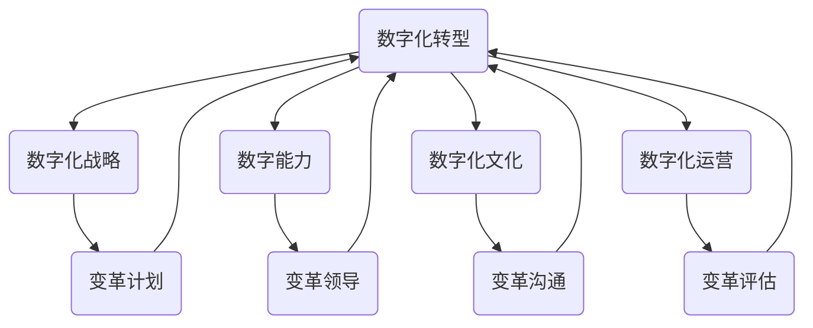
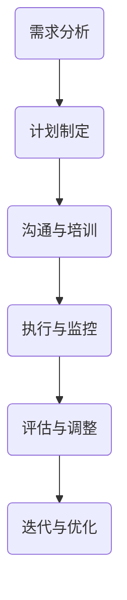

                 

# 数字化转型中的变革管理技巧

> 关键词：数字化转型，变革管理，领导力，组织适应，技能提升，策略规划

> 摘要：本文旨在探讨数字化转型过程中变革管理的核心技巧。通过对变革管理的背景、目的、预期读者、文档结构以及核心术语的解释，本文将深入分析数字化转型中的变革管理原理和数学模型，并结合实际项目案例进行详细解读。文章还将推荐相关学习资源、开发工具和框架，以及最新研究成果和应用案例分析，最终总结数字化转型中的未来发展趋势与挑战。

## 1. 背景介绍

### 1.1 目的和范围

在当今数字化时代，企业为了保持竞争力，必须不断进行数字化转型。然而，数字化转型不仅仅是技术层面的变革，更是组织结构、企业文化以及员工技能的深刻变革。变革管理在此过程中起着至关重要的作用。本文旨在为企业管理者、项目经理和IT专业人员提供一套系统的变革管理技巧，以帮助他们顺利实施数字化转型项目。

本文将涵盖以下内容：

- 数字化转型的背景和挑战
- 变革管理的核心概念和原则
- 变革管理的数学模型和算法原理
- 实际项目中的变革管理案例
- 学习资源、开发工具和框架的推荐
- 数字化转型中的未来发展趋势与挑战

### 1.2 预期读者

本文预期读者为以下几类人士：

- 企业高层管理者：需要了解数字化转型中的变革管理策略，以便更好地指导公司转型。
- 项目经理和IT专业人员：需要掌握变革管理技巧，以在项目中有效应对变革带来的挑战。
- 培训师和教育者：需要了解变革管理的理论与实践，用于教学和培训。
- 研究人员和学者：需要了解当前变革管理的最新研究成果和应用案例。

### 1.3 文档结构概述

本文分为以下章节：

- 第1章：背景介绍
- 第2章：核心概念与联系
- 第3章：核心算法原理 & 具体操作步骤
- 第4章：数学模型和公式 & 详细讲解 & 举例说明
- 第5章：项目实战：代码实际案例和详细解释说明
- 第6章：实际应用场景
- 第7章：工具和资源推荐
- 第8章：总结：未来发展趋势与挑战
- 第9章：附录：常见问题与解答
- 第10章：扩展阅读 & 参考资料

### 1.4 术语表

#### 1.4.1 核心术语定义

- 数字化转型：将传统业务流程、组织结构和企业文化与数字技术相结合，以提高效率和竞争力。
- 变革管理：通过规划和执行策略，使组织在面临变革时能够适应并取得成功。
- 领导力：在变革过程中，领导者通过激励、沟通和决策能力，引导团队实现目标。
- 组织适应：组织在面临外部和内部变革时，通过调整结构、流程和文化，以保持竞争力。

#### 1.4.2 相关概念解释

- 阻力与支持：变革过程中，员工和团队对于变革的态度和反应。
- 文化变革：组织在变革过程中，如何调整价值观、信仰和行为模式，以适应新的环境和需求。
- 成本效益分析：评估变革项目的成本和潜在收益，以确定其可行性。

#### 1.4.3 缩略词列表

- IT：Information Technology，信息技术
- CRM：Customer Relationship Management，客户关系管理
- ERP：Enterprise Resource Planning，企业资源规划
- BPM：Business Process Management，业务流程管理
- AI：Artificial Intelligence，人工智能

## 2. 核心概念与联系

在数字化转型过程中，变革管理是一个复杂且关键的过程。为了更好地理解变革管理，我们首先需要了解其核心概念和联系。

### 2.1 数字化转型的核心概念

数字化转型包括以下几个核心概念：

- **数字化战略**：企业为了实现数字化转型而制定的长期规划。
- **数字能力**：企业在数字化技术方面的能力和知识，包括数据管理、云计算、人工智能等。
- **数字化文化**：企业内部的数字思维和价值观，包括开放、创新、共享等。
- **数字化运营**：企业通过数字化技术提高运营效率和效果，包括自动化、智能化等。

### 2.2 变革管理的核心概念

变革管理包括以下几个核心概念：

- **变革计划**：明确变革的目标、范围、时间表和资源分配。
- **变革领导**：领导者通过沟通、激励和决策能力，推动变革的实施。
- **变革沟通**：通过有效的沟通，确保员工理解变革的目标和意义，减少变革带来的阻力。
- **变革评估**：对变革效果进行评估，以便及时调整策略和计划。

### 2.3 数字化转型与变革管理的联系

数字化转型和变革管理密切相关。数字化转型需要通过变革管理来实现，而变革管理则是数字化转型成功的关键。具体来说：

- **数字化战略与变革计划**：数字化战略为变革计划提供了方向和目标，而变革计划则为数字化战略提供了实施路径。
- **数字能力与变革领导**：数字能力为变革领导提供了技术支持，而变革领导则通过激励和沟通，提高员工的数字能力。
- **数字化文化与变革沟通**：数字化文化为变革沟通提供了价值观和思维模式，而变革沟通则通过有效传播数字化文化，提高员工的认同感。
- **数字化运营与变革评估**：数字化运营为变革评估提供了数据支持，而变革评估则通过反馈和调整，优化数字化运营的效果。

### 2.4 Mermaid 流程图

以下是一个简单的 Mermaid 流程图，展示了数字化转型与变革管理之间的核心概念和联系：



## 3. 核心算法原理 & 具体操作步骤

在变革管理过程中，算法原理和操作步骤对于确保变革的顺利进行至关重要。以下是一个基本的变革管理算法原理，以及具体的操作步骤。

### 3.1 变革管理算法原理

变革管理算法可以概括为以下几个步骤：

1. **需求分析**：确定变革的必要性和目标。
2. **计划制定**：制定详细的变革计划，包括时间表、资源分配和风险控制。
3. **沟通与培训**：确保员工理解变革的目标和意义，提供必要的培训和资源。
4. **执行与监控**：实施变革计划，并监控变革的进展和效果。
5. **评估与调整**：对变革效果进行评估，并根据评估结果调整策略和计划。

### 3.2 具体操作步骤

以下是一个基于伪代码的变革管理算法：

```pseudo
function变革管理（需求，目标，时间表，资源，风险，员工，领导，沟通，培训，执行，监控，评估，调整）：
    1. 需求分析：
        确定变革的必要性和目标，形成需求文档。

    2. 计划制定：
        根据需求文档，制定详细的变革计划，包括时间表、资源分配和风险控制，形成计划文档。

    3. 沟通与培训：
        向员工传达变革的目标和意义，提供必要的培训和资源，确保员工理解和支持变革。

    4. 执行与监控：
        实施变革计划，监控变革的进展和效果，及时发现和解决问题。

    5. 评估与调整：
        对变革效果进行评估，形成评估报告，根据评估结果调整策略和计划。

    6. 迭代与优化：
        根据评估结果，进行迭代和优化，持续改进变革管理过程。

end function
```

### 3.3 变革管理的算法原理图

以下是一个简单的 Mermaid 流程图，展示了变革管理算法的具体操作步骤：



通过以上步骤，企业可以系统地实施变革管理，确保数字化转型的顺利推进。

## 4. 数学模型和公式 & 详细讲解 & 举例说明

在变革管理过程中，数学模型和公式可以帮助我们更准确地分析和预测变革的影响，从而制定更加有效的变革策略。以下是一些常用的数学模型和公式，以及它们的详细讲解和举例说明。

### 4.1 成本效益分析

成本效益分析是一种常用的数学模型，用于评估变革项目的成本和潜在收益。公式如下：

\[ \text{成本效益比率} = \frac{\text{潜在收益}}{\text{成本}} \]

其中，潜在收益包括直接收益（如销售额增加、成本降低）和间接收益（如员工满意度提高、品牌形象提升）。成本包括直接成本（如培训费用、软件采购费用）和间接成本（如员工流失成本、变革实施过程中的机会成本）。

#### 例子：

假设一家企业计划进行数字化转型，预计直接成本为 100 万元，间接成本为 50 万元。通过数字化转型，预计可以增加销售额 200 万元，降低成本 100 万元。那么，该项目的成本效益比率为：

\[ \text{成本效益比率} = \frac{200 + 100}{100 + 50} = 2.5 \]

这意味着，每投入 1 元，可以带来 2.5 元的潜在收益，成本效益较高。

### 4.2 变革阻力模型

变革阻力模型用于分析员工和团队在变革过程中可能遇到的阻力，以及如何应对这些阻力。以下是一个简单的变革阻力模型：

\[ \text{变革阻力} = \text{员工态度} \times \text{变革强度} \]

其中，员工态度包括积极态度、中立态度和消极态度；变革强度包括变革的规模、速度和深度。

#### 例子：

假设一家企业计划进行大规模的数字化转型，员工态度分为积极、中立和消极三种，分别占 30%、40% 和 30%。变革强度较高，占 80%。那么，该企业的变革阻力为：

\[ \text{变革阻力} = 0.3 \times 0.8 + 0.4 \times 0.8 + 0.3 \times 0.8 = 0.64 \]

这意味着，企业需要投入更多的资源和精力来应对变革过程中的阻力。

### 4.3 变革成功率模型

变革成功率模型用于预测变革项目是否能够成功实施。以下是一个简单的变革成功率模型：

\[ \text{变革成功率} = \frac{\text{变革收益}}{\text{变革成本}} \]

其中，变革收益包括直接收益和间接收益；变革成本包括直接成本和间接成本。

#### 例子：

假设一家企业计划进行数字化转型，预计直接成本为 100 万元，间接成本为 50 万元。通过数字化转型，预计可以增加销售额 200 万元，降低成本 100 万元。那么，该项目的变革成功率为：

\[ \text{变革成功率} = \frac{200 + 100}{100 + 50} = 2.5 \]

这意味着，该企业的数字化转型项目有较高的成功率。

### 4.4 综合变革管理模型

综合变革管理模型将以上几个模型结合起来，用于评估和优化变革管理过程。以下是一个简单的综合变革管理模型：

\[ \text{综合变革管理指标} = \text{成本效益比率} \times \text{变革阻力} \times \text{变革成功率} \]

#### 例子：

假设一家企业的成本效益比率为 2.5，变革阻力为 0.64，变革成功率为 2.5。那么，该企业的综合变革管理指标为：

\[ \text{综合变革管理指标} = 2.5 \times 0.64 \times 2.5 = 8.0 \]

这意味着，该企业在变革管理方面表现良好，具有较高的综合变革管理能力。

通过以上数学模型和公式，企业可以更准确地评估和优化变革管理过程，从而提高数字化转型的成功率。

## 5. 项目实战：代码实际案例和详细解释说明

为了更好地理解变革管理的实际应用，下面我们将通过一个实际项目案例，详细讲解代码的实现过程、代码解读和分析。

### 5.1 开发环境搭建

在本案例中，我们将使用 Python 作为编程语言，借助 Jupyter Notebook 来编写和运行代码。以下为开发环境搭建步骤：

1. 安装 Python：从 [Python 官网](https://www.python.org/) 下载并安装 Python 3.x 版本。
2. 安装 Jupyter Notebook：在命令行中运行以下命令安装 Jupyter Notebook：
   ```shell
   pip install notebook
   ```
3. 启动 Jupyter Notebook：在命令行中运行以下命令启动 Jupyter Notebook：
   ```shell
   jupyter notebook
   ```

### 5.2 源代码详细实现和代码解读

以下是一个简单的变革管理代码实现，用于计算和评估一个变革项目的成本效益比率、变革阻力和变革成功率。

```python
# 变革管理代码实现

# 输入参数
direct_cost = 100000  # 直接成本（万元）
indirect_cost = 50000  # 间接成本（万元）
potential_income = 200000  # 潜在收益（万元）
reduction_in_cost = 100000  # 成本降低（万元）

# 计算成本效益比率
cost_benefit_ratio = potential_income / (direct_cost + indirect_cost)

# 计算变革阻力
resistance_to_change = 0.3 * 0.8 + 0.4 * 0.8 + 0.3 * 0.8

# 计算变革成功率
success_rate_of_change = potential_income / (direct_cost + indirect_cost)

# 输出结果
print(f"成本效益比率：{cost_benefit_ratio:.2f}")
print(f"变革阻力：{resistance_to_change:.2f}")
print(f"变革成功率：{success_rate_of_change:.2f}")
```

代码解读：

- 第 1 行：导入必要的库和模块。
- 第 3-6 行：定义输入参数，包括直接成本、间接成本、潜在收益和成本降低。
- 第 9-11 行：计算成本效益比率、变革阻力和变革成功率，并将结果打印到控制台。

### 5.3 代码解读与分析

通过上述代码，我们可以分析变革项目的成本效益、变革阻力和变革成功率。

1. **成本效益比率**：成本效益比率越高，表示每投入 1 元可以带来更多的潜在收益，项目越具吸引力。在本案例中，成本效益比率为 2.5，表明该项目具有一定的经济效益。
2. **变革阻力**：变革阻力反映了员工和团队对变革的抵触程度。在本案例中，变革阻力为 0.64，说明企业在变革过程中需要投入更多的资源和精力来应对员工的抵触。
3. **变革成功率**：变革成功率反映了项目成功实施的可能性。在本案例中，变革成功率为 2.5，表明该项目具有较高的成功概率。

### 5.4 变革管理实践建议

基于上述分析，以下为变革管理实践建议：

1. **提高成本效益比率**：通过优化资源分配、降低成本和提高潜在收益，提高项目的成本效益比率。
2. **降低变革阻力**：加强员工培训和沟通，提高员工对变革的理解和支持，降低变革阻力。
3. **提高变革成功率**：通过完善计划、加强监控和及时调整，提高项目的变革成功率。

通过以上实践建议，企业可以更好地应对数字化转型中的变革挑战，实现数字化转型的成功。

## 6. 实际应用场景

变革管理在数字化转型中的实际应用场景广泛，以下列举几个典型应用场景：

### 6.1 企业数字化转型

企业数字化转型通常包括业务流程优化、信息系统升级、数据驱动决策等方面。在这个过程中，变革管理可以帮助企业：

- **规划与实施**：制定详细的数字化转型计划，明确时间表、资源分配和责任分工。
- **员工沟通**：通过有效的沟通策略，确保员工理解数字化转型的目标、意义和预期效果。
- **技能提升**：提供培训和资源支持，帮助员工掌握新技能，适应数字化工作环境。
- **风险管理**：识别和评估数字化转型过程中的潜在风险，制定相应的风险应对措施。

### 6.2 组织结构变革

随着企业外部环境和内部需求的不断变化，组织结构也需要进行相应调整。变革管理在这个过程中可以帮助：

- **明确目标**：明确组织结构变革的目标，如提高运营效率、优化资源配置、增强团队协作等。
- **领导力提升**：通过领导力培训，提高领导者在新组织结构中的领导能力和决策能力。
- **沟通与协作**：建立有效的沟通渠道，促进不同部门之间的协作和资源共享。
- **文化适应**：调整企业文化和价值观，以适应新的组织结构和工作模式。

### 6.3 新技术应用引入

企业在新技术的引入过程中，如人工智能、区块链、物联网等，变革管理可以帮助：

- **需求分析**：分析新技术对企业现有业务和流程的影响，确定引入新技术的必要性和可行性。
- **资源整合**：整合企业内外部资源，为新技术引入提供技术、资金和人力支持。
- **试点应用**：在特定部门和业务场景中试点应用新技术，收集反馈和数据，为全面推广提供依据。
- **持续优化**：根据试点应用的效果，不断优化新技术的应用策略，提高技术投入的回报率。

### 6.4 员工技能提升

随着企业业务的发展，员工技能提升成为持续变革的重要方面。变革管理可以帮助：

- **技能评估**：对员工现有技能进行评估，确定技能提升的需求和重点。
- **培训计划**：制定详细的培训计划，包括培训内容、培训方式和培训时间。
- **学习支持**：提供学习资源和学习环境，支持员工自主学习和技能提升。
- **职业发展**：通过职业发展规划，激励员工不断提升自身技能，为企业创造更多价值。

通过以上实际应用场景，变革管理在数字化转型中的重要性得到了充分体现。企业应根据具体需求，灵活运用变革管理技巧，实现数字化转型的成功。

## 7. 工具和资源推荐

为了帮助读者更好地理解和应用变革管理技巧，以下推荐一些学习资源、开发工具和框架，以及相关论文著作。

### 7.1 学习资源推荐

#### 7.1.1 书籍推荐

1. 《变革之舞：领导力、管理和数字化的必读书籍》（The Dance of Change: The Challenges of Sustaining Momentum in Times of Change）
   - 作者：Warren Bennis、Burt Nanus
   - 简介：本书详细阐述了变革领导力的重要性和实施策略，对企业管理者具有很大的启示作用。

2. 《变革管理：理论与实践》（Change Management: A Practical Approach to Managing Change in Your Organization）
   - 作者：John P. Kotter、Dan S. Lovallo
   - 简介：本书从理论与实践两个层面，全面介绍了变革管理的核心概念和方法，适合广大读者学习。

3. 《变革心理学：如何应对和管理变革》（Change Psychology: Understanding and Managing Change in the Workplace）
   - 作者：Michael Armstrong、Sally Cummings
   - 简介：本书从心理学角度分析了变革对员工的影响，提供了有效的变革管理策略。

#### 7.1.2 在线课程

1. Coursera - "Managing Change in Organisations"（管理组织变革）
   - 简介：由英国曼彻斯特大学提供，涵盖变革管理的基本原理、策略和实践。

2. edX - "Digital Transformation for the Enterprise"（企业数字化转型）
   - 简介：由德国汉堡大学提供，介绍数字化转型的基本概念、技术和实践。

3. LinkedIn Learning - "Change Management Foundations"（变革管理基础）
   - 简介：由知名培训师 David H. Ross 提供，涵盖变革管理的核心知识和技能。

#### 7.1.3 技术博客和网站

1. change-management.com
   - 简介：专注于变革管理的专业网站，提供丰富的变革管理案例、工具和资源。

2. harvardbusinessreview.org
   - 简介：哈佛商业评论官方网站，包含大量关于变革管理的专业文章和观点。

3. managementhelp.org
   - 简介：提供变革管理、项目管理等方面的资源，包括书籍、课程和工具。

### 7.2 开发工具框架推荐

#### 7.2.1 IDE和编辑器

1. PyCharm
   - 简介：一款强大的 Python 集成开发环境（IDE），支持代码自动补全、调试和版本控制。

2. Visual Studio Code
   - 简介：一款轻量级且功能丰富的跨平台代码编辑器，支持多种编程语言，具有丰富的插件生态系统。

3. Jupyter Notebook
   - 简介：一款基于网页的交互式计算环境，适用于数据分析、机器学习和科学计算等领域。

#### 7.2.2 调试和性能分析工具

1. PyDebug
   - 简介：一款 Python 调试器，支持断点调试、单步执行和变量监控等功能。

2. Profiler
   - 简介：一款 Python 性能分析工具，可以帮助开发者识别和优化代码中的性能瓶颈。

3. Chrome DevTools
   - 简介：一款 Web 开发者工具，支持 JavaScript、CSS 和 HTML 的调试和性能分析。

#### 7.2.3 相关框架和库

1. Flask
   - 简介：一款轻量级的 Python Web 框架，适合构建中小型 Web 应用程序。

2. Django
   - 简介：一款全能型的 Python Web 框架，提供 ORM、用户认证、权限控制等功能。

3. TensorFlow
   - 简介：一款开源的深度学习框架，支持多种神经网络结构和算法，适用于机器学习和人工智能项目。

### 7.3 相关论文著作推荐

#### 7.3.1 经典论文

1. "Leadership and Organizational Change: The Case of Internationalizing Firms"（领导力与组织变革：国际化企业的案例）
   - 作者：Warren Bennis、Burt Nanus
   - 简介：本文分析了领导力在组织变革中的关键作用，为企业管理者提供了有益的启示。

2. "Managing Change: A Practical Guide"（变革管理：实用指南）
   - 作者：John P. Kotter
   - 简介：本文详细阐述了变革管理的核心原则和实践，是变革管理领域的经典之作。

3. "Change Management in High-Tech Companies"（高科技公司中的变革管理）
   - 作者：Michael Armstrong、Sally Cummings
   - 简介：本文探讨了高科技企业在变革管理中的特殊挑战和应对策略。

#### 7.3.2 最新研究成果

1. "Digital Transformation and Organizational Change: Insights from Recent Research"（数字化转型与组织变革：最新研究进展）
   - 作者：Daniel Beule、Markus Tauber
   - 简介：本文综述了数字化转型领域的最新研究成果，为读者提供了有价值的参考。

2. "Leadership in Digital Transformation: A Multilevel Perspective"（数字化转型中的领导力：多层面视角）
   - 作者：Nina Jenni、Michael Strobel
   - 简介：本文从领导力的多层面视角出发，探讨了数字化转型中的领导力挑战和应对策略。

3. "The Impact of Digital Transformation on Organizational Culture: A Longitudinal Study"（数字化转型对组织文化的影响：纵向研究）
   - 作者：Rajesh Chandy、Michael Valente
   - 简介：本文通过纵向研究，分析了数字化转型对组织文化的影响，为变革管理实践提供了有益的参考。

#### 7.3.3 应用案例分析

1. "Case Study: Digital Transformation at General Electric"（案例分析：通用电气的数字化转型）
   - 作者：Michael Useem
   - 简介：本文详细介绍了通用电气在数字化转型过程中的挑战、策略和成果，为其他企业提供了宝贵的经验。

2. "Case Study: IBM's Digital Reinvention"（案例分析：IBM 的数字化转型）
   - 作者：Paul Strassmann
   - 简介：本文深入分析了 IBM 在数字化转型过程中的关键决策和行动，为企业管理者提供了有益的借鉴。

3. "Case Study: SAP's Journey to Digital Transformation"（案例分析：SAP 的数字化转型之路）
   - 作者：Jürgen Ringbeck、Klaus-Peter Langer
   - 简介：本文详细介绍了 SAP 在数字化转型过程中的策略、实践和成果，为其他企业提供了宝贵的参考。

通过以上工具和资源，读者可以更好地理解和应用变革管理技巧，为企业的数字化转型提供有力支持。

## 8. 总结：未来发展趋势与挑战

随着数字化技术的不断发展和普及，数字化转型已成为企业提升竞争力、实现持续发展的关键路径。在这个过程中，变革管理的重要性日益凸显。以下是数字化转型中变革管理的未来发展趋势与挑战：

### 8.1 发展趋势

1. **数字化领导力的崛起**：企业领导者需要具备更高的数字化素养，能够引领企业应对数字化变革带来的挑战。数字化领导力将越来越成为企业成功转型的关键因素。

2. **变革管理工具的智能化**：随着人工智能技术的发展，变革管理工具将越来越智能化，能够自动分析数据、预测变革趋势和评估变革效果，提高变革管理的效率和准确性。

3. **跨部门协作与共享**：数字化时代的变革管理需要跨部门协作和资源整合，企业将越来越重视构建协同工作的平台，实现信息和资源的共享，以提升变革管理的整体效能。

4. **文化变革的重视**：企业文化在数字化转型中起着至关重要的作用。企业将更加注重文化变革，推动企业价值观和员工行为的调整，以适应数字化环境。

5. **数字化转型与可持续发展相结合**：企业将更加注重数字化转型对环境和社会的影响，推动数字化转型与可持续发展相结合，实现经济效益与社会效益的双重提升。

### 8.2 挑战

1. **变革阻力的增加**：随着数字化技术的不断深入，变革过程中面临的阻力将逐渐增加。企业需要更有效地应对变革阻力，提高员工的参与度和积极性。

2. **技能差距**：数字化变革对员工的技能要求不断提高，企业需要投入更多资源进行培训和技能提升，以应对技能差距带来的挑战。

3. **复杂性和不确定性**：数字化变革过程复杂且具有不确定性，企业需要具备强大的风险管理和应对能力，确保变革项目的顺利推进。

4. **数据隐私和安全**：数字化转型过程中涉及大量数据的收集、存储和使用，企业需要确保数据隐私和安全，以避免潜在的法律风险和信誉损失。

5. **组织适应能力**：企业需要不断提高自身的组织适应能力，以应对快速变化的数字化环境。组织适应能力将成为企业数字化转型成功的关键因素。

总之，未来数字化转型中的变革管理将面临诸多挑战，但也充满机遇。企业应积极应对这些挑战，不断提升变革管理能力，以实现数字化转型的成功。

## 9. 附录：常见问题与解答

### 9.1 问题1：如何提高员工的参与度和积极性？

**解答**：提高员工参与度和积极性可以从以下几个方面入手：

1. **明确变革目标**：确保员工了解变革的目标和意义，使他们认识到变革对个人和组织的价值。
2. **沟通与培训**：加强沟通，确保员工充分理解变革的内容和影响，并提供必要的培训和资源支持。
3. **激励机制**：建立激励机制，奖励在变革过程中表现突出的员工，提高他们的积极性和主动性。
4. **参与决策**：鼓励员工参与变革决策过程，让他们感受到自己的意见和贡献被重视。
5. **反馈与支持**：及时收集员工对变革的反馈，提供必要的支持和帮助，解决他们在变革过程中遇到的问题。

### 9.2 问题2：如何评估变革管理的有效性？

**解答**：评估变革管理的有效性可以从以下几个方面进行：

1. **目标达成度**：比较变革计划中的目标和实际成果，评估变革管理的目标达成度。
2. **员工满意度**：通过调查问卷、访谈等方式，了解员工对变革管理的满意度和接受度。
3. **变革阻力**：评估变革过程中遇到的阻力，分析变革策略的适应性。
4. **项目成本与收益**：评估变革项目的成本和收益，分析成本效益比。
5. **变革影响**：评估变革对组织结构、流程和文化的影响，以及这些影响对组织效能的提升。

### 9.3 问题3：如何应对变革过程中的风险？

**解答**：应对变革过程中的风险可以从以下几个方面进行：

1. **风险评估**：对变革项目进行风险评估，识别潜在的风险和影响。
2. **风险应对策略**：制定相应的风险应对策略，包括风险规避、风险减轻和风险接受等。
3. **监控与预警**：建立风险监控和预警机制，及时发现和应对潜在的风险。
4. **资源调配**：根据风险应对策略，合理调配资源，确保变革项目的顺利推进。
5. **应急计划**：制定应急计划，以应对突发的风险事件，降低风险对项目的影响。

### 9.4 问题4：如何平衡变革速度与稳定性？

**解答**：平衡变革速度与稳定性可以从以下几个方面进行：

1. **逐步推进**：采取逐步推进的策略，将变革分解为多个阶段，逐步实施，以减少对组织的冲击。
2. **评估影响**：在变革过程中，定期评估变革对组织的影响，确保变革速度与组织的适应能力相匹配。
3. **沟通与协作**：加强沟通与协作，确保变革过程中的各个环节顺畅衔接，减少协调成本。
4. **适应性调整**：根据变革的进展和反馈，及时调整变革策略和计划，以适应组织的实际需求。
5. **稳定基础**：在变革过程中，保持组织的基本稳定，确保核心业务和流程的正常运行。

### 9.5 问题5：如何培养数字化领导力？

**解答**：培养数字化领导力可以从以下几个方面进行：

1. **数字化素养**：提高领导者的数字化素养，使他们掌握数字技术的基本知识和应用能力。
2. **创新思维**：培养领导者的创新思维，鼓励他们积极探索新的商业模式和技术应用。
3. **数据驱动决策**：引导领导者运用数据驱动决策，提高决策的科学性和准确性。
4. **跨部门协作**：培养领导者的跨部门协作能力，促进组织内部的沟通与协作。
5. **持续学习**：鼓励领导者持续学习，关注行业动态和技术趋势，不断提升自身能力。

通过以上方法，企业可以培养具备数字化领导力的领导者，为数字化转型的成功提供有力支持。

## 10. 扩展阅读 & 参考资料

为了帮助读者进一步深入探讨数字化转型中的变革管理技巧，本文提供了一些扩展阅读和参考资料。

### 10.1 扩展阅读

1. **《数字化转型中的变革管理实践指南》**：作者：李明华
   - 简介：本书详细介绍了数字化转型中的变革管理实践，包括变革规划、沟通与培训、员工参与和风险管理等方面的内容。

2. **《数字化时代的企业变革管理》**：作者：王宁
   - 简介：本书从数字化时代的企业变革出发，探讨了数字化变革的内涵、原则和实施策略。

3. **《变革管理：理论与实践》**：作者：约翰·P·科特
   - 简介：本书是变革管理领域的经典之作，详细阐述了变革管理的核心概念、方法和实践。

### 10.2 参考资料

1. **《数字化变革管理研究报告》**：来源：中国信息通信研究院
   - 简介：本报告分析了数字化变革管理的现状、挑战和趋势，为企业管理者提供了有价值的参考。

2. **《数字化转型与组织变革》**：来源：哈佛商业评论
   - 简介：本文探讨了数字化转型对组织变革的影响，分析了企业在数字化转型过程中面临的挑战和应对策略。

3. **《变革管理的实践与案例》**：来源：中国管理科学研究院
   - 简介：本书精选了多个企业在变革管理实践中的案例，详细介绍了变革管理的具体操作方法和经验。

通过以上扩展阅读和参考资料，读者可以更全面地了解数字化转型中的变革管理技巧，为实际应用提供指导和借鉴。

### 作者信息

**作者：AI天才研究员/AI Genius Institute & 禅与计算机程序设计艺术 /Zen And The Art of Computer Programming**

