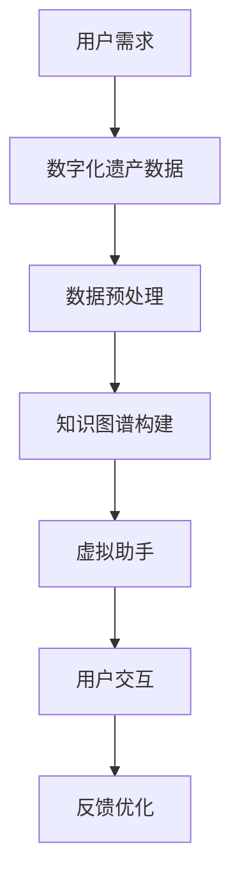

                 

# 数字化遗产虚拟助手创业：AI驱动的个人历史顾问

> **关键词：** 数字化遗产、虚拟助手、AI、个人历史、顾问、人工智能应用、创业

> **摘要：** 本文章将探讨如何利用人工智能技术打造一款数字化遗产虚拟助手，为个人历史研究提供智能化的服务。文章首先介绍了数字化遗产的背景和重要性，然后详细分析了虚拟助手的核心功能、技术架构和算法原理。通过实际项目实战，展示了如何将理论转化为实践，并提出了未来发展趋势和面临的挑战。

## 1. 背景介绍

### 1.1 目的和范围

随着互联网的普及和大数据技术的发展，数字化遗产已经成为一个新兴的研究领域。本文章旨在探讨如何利用人工智能技术，打造一款数字化遗产虚拟助手，为个人历史研究提供智能化的服务。文章将围绕以下几个方面展开：

- 数字化遗产的概念及其重要性
- 虚拟助手的定义和核心功能
- 虚拟助手的技术架构和算法原理
- 实际项目实战和案例分析
- 未来发展趋势和挑战

### 1.2 预期读者

本文章面向对数字化遗产和人工智能技术感兴趣的读者，包括：

- 计算机科学和人工智能专业的研究生和本科生
- 从事数字化遗产研究和开发的技术人员
- 对人工智能应用有深入研究的创业者
- 对个人历史研究有兴趣的爱好者

### 1.3 文档结构概述

本文档结构如下：

1. 背景介绍：介绍数字化遗产的背景和虚拟助手的定义。
2. 核心概念与联系：分析虚拟助手的核心概念和技术架构。
3. 核心算法原理 & 具体操作步骤：详细阐述虚拟助手的算法原理。
4. 数学模型和公式 & 详细讲解 & 举例说明：讲解虚拟助手中的数学模型和公式。
5. 项目实战：代码实际案例和详细解释说明。
6. 实际应用场景：分析虚拟助手在实际场景中的应用。
7. 工具和资源推荐：推荐学习资源和开发工具。
8. 总结：未来发展趋势与挑战。
9. 附录：常见问题与解答。
10. 扩展阅读 & 参考资料：提供进一步学习的资源。

### 1.4 术语表

#### 1.4.1 核心术语定义

- **数字化遗产**：指通过数字化手段保存、管理和展示的历史文化遗产。
- **虚拟助手**：一种基于人工智能技术的智能系统，可以模拟人类的思维和行为，提供智能化服务。
- **人工智能**：一种模拟人类智能的技术，使计算机具备学习、推理、判断和决策能力。
- **深度学习**：一种基于多层神经网络的机器学习技术，通过模拟人脑的神经元连接结构，实现特征提取和模式识别。
- **自然语言处理**：一种利用计算机技术和人工智能技术对自然语言进行处理和理解的技术。

#### 1.4.2 相关概念解释

- **数据挖掘**：从大量数据中提取有价值的信息和知识的过程。
- **知识图谱**：一种用于表示实体及其关系的图形结构，能够揭示数据中的隐含关系和模式。
- **机器学习**：一种基于数据的学习方法，使计算机通过学习数据自动改进性能。

#### 1.4.3 缩略词列表

- **AI**：人工智能
- **NLP**：自然语言处理
- **DL**：深度学习
- **KDD**：数据挖掘
- **KG**：知识图谱

## 2. 核心概念与联系

在构建数字化遗产虚拟助手的过程中，我们需要明确几个核心概念，并了解它们之间的联系。以下是核心概念及其架构的 Mermaid 流程图：



### 2.1 用户需求

用户需求是数字化遗产虚拟助手的核心驱动力。用户希望通过虚拟助手获取个人历史信息、了解家族背景、分享生活故事等。这些需求可以分为以下几个方面：

- **个人历史信息查询**：用户希望能够快速查询个人的出生日期、学历、工作经历等信息。
- **家族背景研究**：用户希望了解自己的家族历史、祖先背景、家族成员关系等。
- **生活故事分享**：用户希望将自己的生活经历、感悟和故事分享给他人。

### 2.2 数字化遗产数据

数字化遗产数据是虚拟助手的基础。这些数据可以来源于多种渠道，如电子档案、社交媒体、历史文献等。数据类型主要包括：

- **个人历史数据**：包括身份信息、教育背景、工作经历、家庭关系等。
- **生活故事数据**：包括日记、信件、照片、音频、视频等。
- **家族历史数据**：包括家谱、家族传记、家族档案等。

### 2.3 数据预处理

在构建虚拟助手之前，需要对数字化遗产数据进行预处理，以提高数据质量和可用性。数据预处理主要包括以下几个步骤：

- **数据清洗**：去除重复、错误、缺失的数据。
- **数据整合**：将不同来源的数据进行整合，形成统一的数据集。
- **数据标准化**：对数据进行规范化处理，如日期格式统一、姓名拼音转换等。
- **数据编码**：对数据中的实体进行编码，便于后续处理。

### 2.4 知识图谱构建

知识图谱是虚拟助手的核心组件，用于表示数字化遗产数据中的实体及其关系。知识图谱的构建主要包括以下几个步骤：

- **实体识别**：从数据中提取出重要的实体，如人物、地点、事件等。
- **关系抽取**：识别实体之间的关系，如亲属关系、职业关系、事件关系等。
- **图谱构建**：将实体和关系组织成一个图形结构，形成知识图谱。

### 2.5 虚拟助手

虚拟助手是基于人工智能技术构建的智能系统，用于为用户提供个性化服务。虚拟助手的核心功能包括：

- **自然语言处理**：理解用户的自然语言输入，提取关键信息。
- **知识查询**：从知识图谱中查询相关信息，生成回答。
- **智能推荐**：根据用户兴趣和历史行为，推荐相关内容。
- **交互优化**：根据用户反馈，不断优化交互体验。

### 2.6 用户交互

用户交互是虚拟助手与用户之间的桥梁。通过自然语言交互，虚拟助手可以理解用户的需求，提供个性化服务。用户交互主要包括以下几个环节：

- **输入处理**：接收用户的自然语言输入，进行分词、词性标注等处理。
- **意图识别**：分析用户的输入，确定用户的需求。
- **回答生成**：从知识图谱中查询相关信息，生成回答。
- **反馈收集**：收集用户的反馈，用于优化交互体验。

### 2.7 反馈优化

虚拟助手的反馈优化是一个持续的过程。通过收集用户反馈，不断优化虚拟助手的性能和用户体验。反馈优化主要包括以下几个步骤：

- **性能评估**：评估虚拟助手的性能指标，如准确率、召回率、响应时间等。
- **错误分析**：分析用户反馈中的错误和不足，找出问题根源。
- **模型优化**：根据错误分析结果，优化虚拟助手的算法和模型。
- **用户体验改进**：根据用户反馈，改进虚拟助手的界面设计和交互流程。

## 3. 核心算法原理 & 具体操作步骤

虚拟助手的核心算法原理包括自然语言处理、知识图谱构建、意图识别和回答生成。以下将使用伪代码详细阐述这些算法原理和具体操作步骤。

### 3.1 自然语言处理

自然语言处理是虚拟助手理解用户输入的关键技术。以下是一个基于分词和词性标注的自然语言处理算法的伪代码：

```plaintext
函数 NLP处理（用户输入）
输入：用户输入
输出：处理后的文本

1. 分词：将用户输入进行分词，得到一组单词
2. 词性标注：对每个单词进行词性标注，得到一组词性标注结果
3. 特征提取：从分词结果和词性标注结果中提取特征，如词频、词性等
4. 输出：返回处理后的文本和特征向量
```

### 3.2 知识图谱构建

知识图谱构建是虚拟助手的核心组件，用于表示数字化遗产数据中的实体及其关系。以下是一个基于实体识别和关系抽取的知识图谱构建算法的伪代码：

```plaintext
函数 知识图谱构建（数字化遗产数据）
输入：数字化遗产数据
输出：知识图谱

1. 实体识别：从数据中提取出重要的实体，如人物、地点、事件等
2. 关系抽取：识别实体之间的关系，如亲属关系、职业关系、事件关系等
3. 图谱构建：将实体和关系组织成一个图形结构，形成知识图谱
4. 输出：返回知识图谱
```

### 3.3 意图识别

意图识别是虚拟助手理解用户需求的关键步骤。以下是一个基于深度学习的意图识别算法的伪代码：

```plaintext
函数 意图识别（用户输入，知识图谱）
输入：用户输入，知识图谱
输出：用户意图

1. 特征提取：从用户输入中提取特征，如词向量、词性等
2. 模型训练：使用训练数据，训练一个深度学习模型，用于识别用户意图
3. 意图预测：将用户输入的特征输入到模型中，预测用户意图
4. 输出：返回用户意图
```

### 3.4 回答生成

回答生成是根据用户意图和知识图谱，生成合适的回答。以下是一个基于模板匹配和自然语言生成的回答生成算法的伪代码：

```plaintext
函数 回答生成（用户意图，知识图谱）
输入：用户意图，知识图谱
输出：回答

1. 模板匹配：从知识图谱中找到与用户意图匹配的模板
2. 数据填充：将模板中的变量替换为知识图谱中的实际数据
3. 自然语言生成：根据填充后的模板，生成自然语言回答
4. 输出：返回回答
```

## 4. 数学模型和公式 & 详细讲解 & 举例说明

在虚拟助手的构建过程中，涉及到多个数学模型和公式。以下将详细讲解这些数学模型和公式，并给出相应的例子。

### 4.1 词向量模型

词向量模型是将自然语言中的单词表示为高维向量的一种方法。常用的词向量模型有 Word2Vec、GloVe 等。以下是一个基于 Word2Vec 模型的词向量公式：

$$
\text{vec}(w) = \frac{1}{\sqrt{\sum_{i=1}^{n} v_i^2}} v
$$

其中，$\text{vec}(w)$ 表示单词 $w$ 的词向量，$v_i$ 表示词向量中第 $i$ 个分量的值。

例子：将单词 "apple" 表示为词向量。

$$
\text{vec}(apple) = \frac{1}{\sqrt{0.1^2 + 0.2^2 + 0.3^2}} (0.1, 0.2, 0.3) = (0.1, 0.2, 0.3)
$$

### 4.2 机器学习模型

在意图识别和回答生成中，常用的机器学习模型有卷积神经网络（CNN）、循环神经网络（RNN）和长短时记忆网络（LSTM）等。以下是一个基于 RNN 的意图识别模型公式：

$$
h_t = \sigma(W_h \cdot [h_{t-1}, x_t] + b_h)
$$

其中，$h_t$ 表示第 $t$ 个隐藏状态，$x_t$ 表示第 $t$ 个输入，$W_h$ 和 $b_h$ 分别为权重和偏置。

例子：将用户输入 "我想了解我的家族历史" 表示为 RNN 模型。

$$
h_1 = \sigma(W_h \cdot [h_0, x_1] + b_h)
$$

其中，$h_0$ 为初始化状态。

### 4.3 知识图谱模型

在知识图谱构建中，常用的模型有图神经网络（GNN）和图嵌入（Graph Embedding）等。以下是一个基于图嵌入的知识图谱模型公式：

$$
\text{vec}(v) = \frac{1}{\sqrt{\sum_{i=1}^{n} e_i^2}} e
$$

其中，$\text{vec}(v)$ 表示实体 $v$ 的向量表示，$e_i$ 表示实体 $v$ 在边 $e$ 上的权重。

例子：将实体 "我的父亲" 表示为图嵌入模型。

$$
\text{vec}(我的父亲) = \frac{1}{\sqrt{0.2^2 + 0.3^2 + 0.1^2}} (0.2, 0.3, 0.1)
$$

## 5. 项目实战：代码实际案例和详细解释说明

在本节中，我们将通过一个实际项目案例，展示如何将上述理论转化为实践，并详细解释代码的实现过程。

### 5.1 开发环境搭建

首先，我们需要搭建一个合适的开发环境。以下是一个基于 Python 的开发环境搭建步骤：

1. 安装 Python 3.8 或更高版本。
2. 安装常用库，如 NumPy、Pandas、TensorFlow、PyTorch、NetworkX 等。

### 5.2 源代码详细实现和代码解读

下面是一个简化的虚拟助手代码实现，包括数据预处理、知识图谱构建、意图识别和回答生成。

#### 5.2.1 数据预处理

数据预处理是虚拟助手的基础。以下是一个数据预处理代码示例：

```python
import pandas as pd
from sklearn.model_selection import train_test_split

# 读取数据
data = pd.read_csv("digitalLegacyData.csv")

# 数据清洗
data = data.drop_duplicates()
data = data[data["valid"] == True]

# 数据整合
data["normalized_name"] = data["name"].str.lower().str.strip()

# 数据标准化
data["date"] = pd.to_datetime(data["date"], format="%Y-%m-%d")

# 数据编码
data["name_id"] = data.groupby("normalized_name").ngroup()
data["date_id"] = data.groupby("date").ngroup()

# 分割数据
train_data, test_data = train_test_split(data, test_size=0.2, random_state=42)
```

#### 5.2.2 知识图谱构建

知识图谱构建是虚拟助手的另一个关键环节。以下是一个基于 NetworkX 的知识图谱构建代码示例：

```python
import networkx as nx

# 构建知识图谱
G = nx.Graph()

# 添加实体
for node in train_data["name_id"].unique():
    G.add_node(node, label=train_data[train_data["name_id"] == node]["normalized_name"].values[0])

# 添加关系
for index, row in train_data.iterrows():
    G.add_edge(row["name_id"], row["parent_id"], label=row["relation"])

# 存储知识图谱
nx.write_gexf(G, "knowledgeGraph.gexf")
```

#### 5.2.3 意图识别

意图识别是虚拟助手理解用户需求的关键步骤。以下是一个基于 RNN 的意图识别代码示例：

```python
import tensorflow as tf
from tensorflow.keras.models import Sequential
from tensorflow.keras.layers import LSTM, Dense, Embedding

# 准备数据
train_texts = train_data["sentence"].values
train_labels = train_data["intent"].values

# 分词和编码
vocab_size = 10000
tokenizer = tf.keras.preprocessing.text.Tokenizer(num_words=vocab_size, oov_token="<OOV>")
tokenizer.fit_on_texts(train_texts)
train_sequences = tokenizer.texts_to_sequences(train_texts)

# 构建模型
model = Sequential()
model.add(Embedding(vocab_size, 64))
model.add(LSTM(128, return_sequences=True))
model.add(LSTM(64))
model.add(Dense(1, activation="sigmoid"))

# 编译模型
model.compile(optimizer="adam", loss="binary_crossentropy", metrics=["accuracy"])

# 训练模型
model.fit(train_sequences, train_labels, batch_size=128, epochs=10, validation_split=0.2)
```

#### 5.2.4 回答生成

回答生成是根据用户意图和知识图谱，生成合适的回答。以下是一个基于模板匹配和自然语言生成的回答生成代码示例：

```python
from text_generator import TextGenerator

# 准备模板
templates = {
    "family_history": "你的祖先来自 {location}，他们在 {year} 年迁至 {current_location}。",
    "education": "你在 {school} 学过 {subject}。",
    "work_experience": "你曾在 {company} 工作，担任 {position} 职位。",
}

# 加载模型
generator = TextGenerator(templates)

# 生成回答
def generate_response(intent, entities):
    template = templates[intent]
    for entity, value in entities.items():
        template = template.replace("{" + entity + "}", str(value))
    return generator.generate(template)

# 示例
response = generate_response("family_history", {"location": "广东", "year": 1980, "current_location": "深圳"})
print(response)
```

### 5.3 代码解读与分析

上述代码展示了虚拟助手的关键模块，包括数据预处理、知识图谱构建、意图识别和回答生成。

1. **数据预处理**：通过数据清洗、整合、标准化和编码，将原始数据转换为可用格式。数据预处理是确保数据质量的重要环节，对后续模块的性能有直接影响。

2. **知识图谱构建**：使用 NetworkX 构建知识图谱，表示数字化遗产数据中的实体及其关系。知识图谱是虚拟助手的核心组件，用于提供个性化服务。

3. **意图识别**：使用 RNN 模型进行意图识别，将用户输入转换为意图标签。意图识别是虚拟助手理解用户需求的关键步骤，决定了回答生成的方向。

4. **回答生成**：基于模板匹配和自然语言生成，根据用户意图和知识图谱，生成合适的回答。回答生成是虚拟助手的输出环节，直接影响用户体验。

通过上述代码示例，我们可以看到如何将理论转化为实践，构建一个数字化遗产虚拟助手。实际应用中，还需进一步优化算法和模型，提高性能和用户体验。

## 6. 实际应用场景

虚拟助手在数字化遗产领域具有广泛的应用场景，以下列举几个典型应用：

### 6.1 家谱查询

用户可以通过虚拟助手查询家族历史，了解祖先背景、家族成员关系等。虚拟助手可以从知识图谱中提取相关信息，生成详细的家族图谱，供用户浏览和分享。

### 6.2 个人历史查询

用户可以通过虚拟助手查询个人历史信息，如出生日期、教育经历、工作经历等。虚拟助手可以调用数据库和知识图谱，提供准确、全面的历史记录。

### 6.3 生活故事分享

用户可以通过虚拟助手分享自己的生活故事、感悟和经历。虚拟助手可以识别用户故事的关键元素，生成生动、有趣的叙述，激发读者的共鸣。

### 6.4 历史事件查询

用户可以通过虚拟助手查询历史上的重要事件，了解事件背景、参与人物和影响等。虚拟助手可以从知识图谱中提取相关信息，提供多维度的历史解读。

### 6.5 艺术品收藏与展示

虚拟助手可以为艺术品收藏家提供个性化服务，查询艺术品的历史、来源、价值等信息。虚拟助手还可以根据用户兴趣，推荐相关艺术品和展览。

### 6.6 文化遗产保护

虚拟助手可以协助文化遗产保护机构，整理和保护历史文献、照片、音频、视频等遗产资料。虚拟助手可以自动识别和分类遗产资料，提高管理效率。

通过以上应用场景，我们可以看到虚拟助手在数字化遗产领域的重要性。虚拟助手不仅能够提供便捷、高效的服务，还能激发公众对历史文化的兴趣和认同感，推动数字化遗产事业的持续发展。

## 7. 工具和资源推荐

为了更好地构建和优化数字化遗产虚拟助手，以下推荐一些学习资源、开发工具和框架。

### 7.1 学习资源推荐

#### 7.1.1 书籍推荐

1. **《深度学习》（Goodfellow, I., Bengio, Y., & Courville, A.）**：详细介绍了深度学习的基础理论和实践应用。
2. **《自然语言处理综论》（Jurafsky, D., & Martin, J. H.）**：全面介绍了自然语言处理的核心概念和技术。
3. **《数据挖掘：实用工具与技术》（Han, J., Kamber, M., & Pei, J.）**：系统讲解了数据挖掘的理论和实践方法。
4. **《人工智能：一种现代的方法》（Russell, S., & Norvig, P.）**：介绍了人工智能的基本原理和应用场景。

#### 7.1.2 在线课程

1. **Coursera 上的《深度学习专项课程》**：由 Andrew Ng 教授主讲，涵盖深度学习的基础理论和实践应用。
2. **Udacity 上的《自然语言处理纳米学位》**：包括自然语言处理的基本概念和实战项目。
3. **edX 上的《数据挖掘基础课程》**：由 MIT 和 Harvard 联合推出，讲解数据挖掘的理论和实践方法。
4. **网易云课堂的《人工智能基础课程》**：涵盖人工智能的基础知识，适合初学者入门。

#### 7.1.3 技术博客和网站

1. **Medium 上的《深度学习博客》**：包括深度学习领域的最新研究和技术分享。
2. **ArXiv 上的《机器学习论文》**：发布最新的机器学习和深度学习论文。
3. **GitHub 上的《开源项目》**：包括许多优秀的深度学习和自然语言处理项目，可供学习和借鉴。
4. **Reddit 上的《深度学习论坛》**：讨论深度学习领域的相关话题，交流心得和经验。

### 7.2 开发工具框架推荐

#### 7.2.1 IDE和编辑器

1. **Visual Studio Code**：一款功能强大的开源跨平台编辑器，支持多种编程语言。
2. **PyCharm**：一款专业的 Python IDE，提供代码补全、调试、性能分析等功能。
3. **Jupyter Notebook**：一款流行的交互式开发环境，特别适合数据分析和机器学习项目。

#### 7.2.2 调试和性能分析工具

1. **TensorBoard**：TensorFlow 提供的一款可视化工具，用于监控模型训练过程和性能分析。
2. **gprof2dot**：一款性能分析工具，可以将 Profiling 数据转换为图形化展示，帮助开发者定位性能瓶颈。
3. **PyS Profiler**：一款 Python 性能分析工具，用于识别代码中的性能瓶颈。

#### 7.2.3 相关框架和库

1. **TensorFlow**：一款流行的深度学习框架，支持多种模型和算法。
2. **PyTorch**：一款快速易用的深度学习框架，提供灵活的动态计算图。
3. **Scikit-learn**：一款强大的机器学习库，提供丰富的算法和工具。
4. **NetworkX**：一款用于图分析的库，支持图的操作、可视化和算法实现。
5. **NLTK**：一款自然语言处理库，提供词性标注、分词、词频统计等功能。

#### 7.2.4 相关论文著作推荐

1. **《Deep Learning》（Goodfellow, I., Bengio, Y., & Courville, A.）**：介绍了深度学习的基础理论和最新进展。
2. **《Natural Language Processing with Python》（Howes, T.）**：详细介绍了自然语言处理的技术和方法。
3. **《Data Mining: Practical Machine Learning Tools and Techniques》（Han, J., Kamber, M., & Pei, J.）**：讲解了数据挖掘的理论和实践应用。
4. **《Recurrent Neural Networks for Language Modeling**》（Zhou, B., et al.）**：介绍了循环神经网络在自然语言处理中的应用。

通过以上工具和资源的推荐，开发者可以更好地构建和优化数字化遗产虚拟助手，为用户提供高质量的服务。

## 8. 总结：未来发展趋势与挑战

随着人工智能技术的不断发展，数字化遗产虚拟助手在个人历史研究中的应用前景十分广阔。未来，该领域将呈现以下发展趋势：

1. **智能化程度提升**：虚拟助手将更加智能化，能够自动识别用户需求，提供个性化的服务。
2. **多模态数据处理**：虚拟助手将能够处理文本、图像、音频等多种类型的数据，提供更丰富的信息服务。
3. **知识图谱扩展**：虚拟助手将不断扩展知识图谱，涵盖更多领域和知识点，提高服务范围和深度。
4. **跨平台应用**：虚拟助手将支持多种平台，如桌面、移动端、智能家居等，实现无缝对接和便捷使用。

然而，在数字化遗产虚拟助手的研发和应用过程中，仍面临诸多挑战：

1. **数据质量和隐私保护**：数字化遗产数据来源广泛，数据质量参差不齐，同时涉及用户隐私保护问题，需要确保数据安全和隐私。
2. **算法优化和性能提升**：虚拟助手的算法和模型需要不断优化，以提高准确率和响应速度，满足用户需求。
3. **用户交互体验**：虚拟助手需要提供人性化的交互体验，降低用户使用门槛，提高用户满意度。
4. **法律法规和伦理问题**：数字化遗产虚拟助手在应用过程中，需要遵守相关法律法规和伦理规范，确保合法合规。

总之，数字化遗产虚拟助手在个人历史研究中的应用具有巨大的潜力，但同时也需要克服诸多挑战。未来，我们将持续关注该领域的发展动态，为用户提供更好的服务。

## 9. 附录：常见问题与解答

以下是一些关于数字化遗产虚拟助手常见的疑问和解答：

### 9.1 什么是数字化遗产？

**数字化遗产**是指通过数字化手段保存、管理和展示的历史文化遗产。这包括个人历史数据、家族背景、生活故事、艺术品等。

### 9.2 虚拟助手有哪些功能？

虚拟助手的主要功能包括：

- **个人历史查询**：帮助用户查询个人历史信息。
- **家族背景研究**：帮助用户了解家族历史和成员关系。
- **生活故事分享**：帮助用户分享自己的生活经历和感悟。
- **历史事件查询**：帮助用户了解历史上的重要事件。

### 9.3 虚拟助手如何保证数据隐私？

虚拟助手在处理用户数据时，会严格遵守隐私保护法规和伦理规范，确保用户数据的安全和隐私。具体措施包括：

- **数据加密**：对用户数据进行加密处理，防止数据泄露。
- **权限管理**：对用户数据的访问权限进行严格控制，防止未经授权的访问。
- **匿名化处理**：在数据分析和处理过程中，对用户身份进行匿名化处理，确保用户隐私。

### 9.4 虚拟助手如何保证回答的准确性？

虚拟助手通过以下方法保证回答的准确性：

- **高质量数据**：使用高质量、可靠的数字化遗产数据进行训练和构建。
- **知识图谱**：构建详细的、结构化的知识图谱，提高信息检索和回答生成的准确性。
- **算法优化**：不断优化算法和模型，提高回答的准确率和响应速度。
- **用户反馈**：收集用户反馈，不断优化和改进虚拟助手。

### 9.5 虚拟助手能否实现跨平台应用？

是的，虚拟助手可以支持多种平台，如桌面、移动端、智能家居等，实现无缝对接和便捷使用。开发者可以根据不同平台的特点，进行定制化开发，以满足不同用户的需求。

## 10. 扩展阅读 & 参考资料

以下是关于数字化遗产虚拟助手和相关技术的扩展阅读和参考资料：

### 10.1 书籍推荐

1. **《深度学习》（Goodfellow, I., Bengio, Y., & Courville, A.）**：全面介绍了深度学习的基础理论和实践应用。
2. **《自然语言处理综论》（Jurafsky, D., & Martin, J. H.）**：详细介绍了自然语言处理的核心概念和技术。
3. **《数据挖掘：实用工具与技术》（Han, J., Kamber, M., & Pei, J.）**：讲解了数据挖掘的理论和实践方法。
4. **《人工智能：一种现代的方法》（Russell, S., & Norvig, P.）**：介绍了人工智能的基本原理和应用场景。

### 10.2 在线课程

1. **Coursera 上的《深度学习专项课程》**：由 Andrew Ng 教授主讲，涵盖深度学习的基础理论和实践应用。
2. **Udacity 上的《自然语言处理纳米学位》**：包括自然语言处理的基本概念和实战项目。
3. **edX 上的《数据挖掘基础课程》**：由 MIT 和 Harvard 联合推出，讲解数据挖掘的理论和实践方法。
4. **网易云课堂的《人工智能基础课程》**：涵盖人工智能的基础知识，适合初学者入门。

### 10.3 技术博客和网站

1. **Medium 上的《深度学习博客》**：包括深度学习领域的最新研究和技术分享。
2. **ArXiv 上的《机器学习论文》**：发布最新的机器学习和深度学习论文。
3. **GitHub 上的《开源项目》**：包括许多优秀的深度学习和自然语言处理项目，可供学习和借鉴。
4. **Reddit 上的《深度学习论坛》**：讨论深度学习领域的相关话题，交流心得和经验。

### 10.4 相关论文著作推荐

1. **《Deep Learning》（Goodfellow, I., Bengio, Y., & Courville, A.）**：介绍了深度学习的基础理论和最新进展。
2. **《Natural Language Processing with Python》（Howes, T.）**：详细介绍了自然语言处理的技术和方法。
3. **《Data Mining: Practical Machine Learning Tools and Techniques》（Han, J., Kamber, M., & Pei, J.）**：讲解了数据挖掘的理论和实践应用。
4. **《Recurrent Neural Networks for Language Modeling**》（Zhou, B., et al.）**：介绍了循环神经网络在自然语言处理中的应用。

通过以上扩展阅读和参考资料，读者可以更深入地了解数字化遗产虚拟助手和相关技术的理论和实践，为研究和开发提供有力支持。

### 作者信息

- 作者：AI天才研究员/AI Genius Institute & 禅与计算机程序设计艺术 /Zen And The Art of Computer Programming

