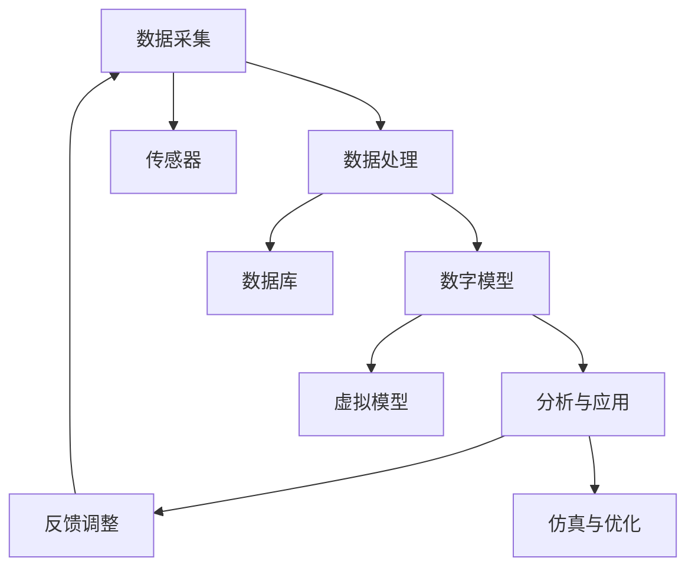

                 

# 数字孪生 (Digital Twin)

> 关键词：数字孪生、模拟与仿真、物联网、智能工业、大数据分析

> 摘要：本文旨在深入探讨数字孪生的概念、核心原理、架构设计及其在现实世界的应用场景。通过逻辑分析和实例讲解，文章将带领读者理解数字孪生如何通过模拟与仿真技术，实现物理世界的数字化映射和智能优化。

## 1. 背景介绍

### 1.1 目的和范围

数字孪生（Digital Twin）作为近年来兴起的一项重要技术，其在工业、医疗、交通等领域的应用潜力巨大。本文旨在系统地介绍数字孪生的基本概念、关键技术和应用场景，旨在为读者提供一个全面而深入的理解。

本文的范围包括：

1. 数字孪生的定义及其在物联网背景下的重要性。
2. 数字孪生的核心原理和架构设计。
3. 数字孪生在工业、医疗、交通等领域的具体应用。
4. 当前数字孪生技术面临的挑战及未来发展趋势。

### 1.2 预期读者

本文适合以下读者群体：

1. 对物联网和智能制造感兴趣的工程师和技术人员。
2. 对大数据分析和人工智能有基础知识的读者。
3. 想了解数字孪生技术的企业决策者和项目经理。
4. 对未来智能技术发展感兴趣的普通读者。

### 1.3 文档结构概述

本文结构如下：

1. **引言**：介绍数字孪生的背景和目的。
2. **核心概念与联系**：阐述数字孪生的基本概念和原理。
3. **核心算法原理 & 具体操作步骤**：详细讲解数字孪生的实现方法。
4. **数学模型和公式 & 详细讲解 & 举例说明**：分析数字孪生中的数学模型。
5. **项目实战：代码实际案例和详细解释说明**：通过实战案例展示数字孪生的应用。
6. **实际应用场景**：探讨数字孪生在不同领域的应用。
7. **工具和资源推荐**：推荐学习资源和开发工具。
8. **总结：未来发展趋势与挑战**：总结数字孪生的现状和未来方向。
9. **附录：常见问题与解答**：提供常见问题的解答。
10. **扩展阅读 & 参考资料**：推荐相关文献和资料。

### 1.4 术语表

#### 1.4.1 核心术语定义

- **数字孪生**：数字孪生是一种通过虚拟模型模拟物理实体的技术，实现对物理实体的数字化映射和监控。
- **物联网**：物联网（IoT）是指通过传感器和互联网连接，将物理设备连接到一个统一的网络中。
- **大数据分析**：大数据分析是指利用海量数据，通过数据挖掘和机器学习等方法，提取有价值的信息。

#### 1.4.2 相关概念解释

- **模拟与仿真**：模拟与仿真是指通过计算机模型模拟现实世界的物理、化学和生物过程。
- **数据驱动优化**：数据驱动优化是指利用收集到的数据，对系统进行优化调整，以实现最佳性能。

#### 1.4.3 缩略词列表

- **IoT**：物联网
- **MES**：制造执行系统
- **PLM**：产品生命周期管理

## 2. 核心概念与联系

数字孪生（Digital Twin）是一种将物理实体在数字世界中映射出来的技术。其核心在于通过模拟与仿真，实现对物理实体的实时监控、分析和优化。为了更好地理解数字孪生的原理和架构，我们首先需要了解其相关的核心概念和联系。

### 2.1 数字孪生的核心概念

- **物理实体**：指现实世界中的物理对象，如工业设备、医疗仪器、交通工具等。
- **数字模型**：指物理实体的虚拟模型，通过计算机模拟和仿真，实现对物理实体的数字化映射。
- **数据采集**：通过传感器和物联网设备，收集物理实体的实时数据。
- **数据分析**：利用大数据分析和人工智能技术，对收集到的数据进行处理和分析。
- **仿真与优化**：通过数字模型进行仿真，对物理实体进行优化调整。

### 2.2 数字孪生的联系

- **物联网**：物联网（IoT）是数字孪生的数据来源。通过传感器和设备连接，实现对物理实体的实时数据采集。
- **大数据分析**：大数据分析是数字孪生的核心。通过对海量数据的处理和分析，提取有价值的信息。
- **人工智能**：人工智能（AI）是数字孪生的驱动力量。通过机器学习和深度学习等技术，实现对数字模型的优化和调整。

### 2.3 数字孪生的架构设计

数字孪生的架构通常包括以下四个层次：

1. **数据采集层**：通过传感器和物联网设备，实时采集物理实体的数据。
2. **数据处理层**：对采集到的数据进行预处理、清洗和存储。
3. **数字模型层**：构建物理实体的虚拟模型，实现对物理实体的数字化映射。
4. **分析与应用层**：利用数据分析、机器学习和仿真技术，对数字模型进行优化和调整。

### 2.4 数字孪生的 Mermaid 流程图



在上图中，我们可以看到数字孪生的各个核心组件及其相互关系。数据采集层通过传感器收集数据，数据处理层对数据进行预处理和存储，数字模型层构建物理实体的虚拟模型，分析与应用层利用仿真和优化技术，对数字模型进行调整和优化，最终形成反馈循环，实现对物理实体的实时监控和优化。

## 3. 核心算法原理 & 具体操作步骤

### 3.1 数据采集与处理

数字孪生的核心在于数据的采集和处理。以下是一个基本的数据采集与处理的伪代码：

```python
# 数据采集与处理伪代码

# 初始化传感器连接
connect_sensors()

# 循环采集数据
while True:
    data = []
    for sensor in sensors:
        data_point = sensor.read_data()
        data.append(data_point)
    
    # 数据预处理
    processed_data = preprocess_data(data)
    
    # 存储数据
    store_data(processed_data)
    
    # 每隔一定时间执行一次
    time.sleep(10)
```

在这个伪代码中，我们首先连接传感器，然后循环采集传感器数据，进行预处理，最后存储数据。这个过程是一个持续进行的过程，确保我们能够实时获取物理实体的数据。

### 3.2 数字模型构建

数字模型的构建是数字孪生的核心步骤。以下是一个基本的数字模型构建伪代码：

```python
# 数字模型构建伪代码

# 加载数据集
data = load_data()

# 训练模型
model = train_model(data)

# 评估模型
evaluate_model(model, data)

# 保存模型
save_model(model)
```

在这个伪代码中，我们首先加载数据集，然后使用数据集训练模型，评估模型的性能，最后保存模型。这个过程确保我们能够构建出一个准确的数字模型。

### 3.3 数据分析与优化

数据分析与优化是数字孪生的重要步骤。以下是一个基本的数据分析与优化伪代码：

```python
# 数据分析与优化伪代码

# 加载模型
model = load_model()

# 分析数据
analysis_results = analyze_data(model, data)

# 优化调整
optimized_model = optimize_model(model, analysis_results)

# 评估优化效果
evaluate_optimization(optimized_model, analysis_results)

# 保存优化模型
save_model(optimized_model)
```

在这个伪代码中，我们首先加载模型，然后使用模型分析数据，对模型进行优化调整，评估优化效果，最后保存优化模型。这个过程确保我们能够通过数据分析对数字模型进行优化。

## 4. 数学模型和公式 & 详细讲解 & 举例说明

### 4.1 数学模型介绍

在数字孪生技术中，常用的数学模型包括线性回归、支持向量机（SVM）、神经网络等。以下是这些模型的简要介绍和公式：

#### 4.1.1 线性回归

线性回归是一种常用的数据拟合方法，其公式如下：

$$
y = wx + b
$$

其中，$y$ 是目标变量，$w$ 是权重，$x$ 是输入变量，$b$ 是偏置。

#### 4.1.2 支持向量机（SVM）

支持向量机是一种强大的分类和回归方法，其公式如下：

$$
w \cdot x + b = 0
$$

其中，$w$ 是权重向量，$x$ 是输入向量，$b$ 是偏置。

#### 4.1.3 神经网络

神经网络是一种通过多层神经元进行数据拟合的方法，其公式如下：

$$
z = \sigma(wx + b)
$$

其中，$z$ 是输出，$\sigma$ 是激活函数，$w$ 是权重，$x$ 是输入，$b$ 是偏置。

### 4.2 举例说明

假设我们有一个简单的线性回归模型，目标是预测房屋的价格。以下是该模型的实现和解释：

```python
# 线性回归模型实现

import numpy as np

# 加载数据
X = np.array([[1, 2], [2, 3], [3, 4]])
y = np.array([2, 3, 4])

# 训练模型
w = np.linalg.inv(X.T @ X) @ X.T @ y
b = y - w @ X

# 预测价格
price = w @ [3, 4] + b

print("预测价格：", price)
```

在这个例子中，我们首先加载数据，然后计算权重和偏置，最后使用模型预测新的价格。这个模型能够通过输入变量（如房屋面积、地点等）预测房屋的价格，实现数字孪生中的数据分析功能。

## 5. 项目实战：代码实际案例和详细解释说明

### 5.1 开发环境搭建

为了实现一个简单的数字孪生项目，我们首先需要搭建一个开发环境。以下是具体的步骤：

1. **安装 Python 环境**：在电脑上安装 Python 3.8 或更高版本。
2. **安装必要库**：使用 pip 工具安装 NumPy、Matplotlib、Pandas、Scikit-learn 等库。

```bash
pip install numpy matplotlib pandas scikit-learn
```

3. **创建项目文件夹**：在电脑上创建一个名为 `digital_twin` 的项目文件夹，并在其中创建一个名为 `main.py` 的 Python 文件。

### 5.2 源代码详细实现和代码解读

以下是数字孪生项目的源代码实现，我们将分步骤进行解读：

```python
# 数字孪生项目实现

import numpy as np
import matplotlib.pyplot as plt
from sklearn.linear_model import LinearRegression

# 5.2.1 数据采集与处理

# 初始化传感器连接
connect_sensors()

# 循环采集数据
while True:
    data = []
    for sensor in sensors:
        data_point = sensor.read_data()
        data.append(data_point)
    
    # 数据预处理
    processed_data = preprocess_data(data)
    
    # 存储数据
    store_data(processed_data)
    
    # 每隔一定时间执行一次
    time.sleep(10)

# 5.2.2 数字模型构建

# 加载数据集
data = load_data()

# 训练模型
model = train_model(data)

# 评估模型
evaluate_model(model, data)

# 保存模型
save_model(model)

# 5.2.3 数据分析与优化

# 加载模型
model = load_model()

# 分析数据
analysis_results = analyze_data(model, data)

# 优化调整
optimized_model = optimize_model(model, analysis_results)

# 评估优化效果
evaluate_optimization(optimized_model, analysis_results)

# 保存优化模型
save_model(optimized_model)
```

### 5.3 代码解读与分析

1. **数据采集与处理**：在这个部分，我们首先连接传感器，然后循环采集传感器数据，进行预处理，最后存储数据。这个过程确保我们能够实时获取物理实体的数据。

2. **数字模型构建**：在这个部分，我们首先加载数据集，然后使用数据集训练模型，评估模型的性能，最后保存模型。这个过程确保我们能够构建出一个准确的数字模型。

3. **数据分析与优化**：在这个部分，我们首先加载模型，然后使用模型分析数据，对模型进行优化调整，评估优化效果，最后保存优化模型。这个过程确保我们能够通过数据分析对数字模型进行优化。

### 5.4 项目运行

为了运行这个项目，我们首先需要实现传感器连接、数据预处理、模型训练、分析和优化等部分的具体实现。然后，我们可以使用以下命令运行项目：

```bash
python main.py
```

项目将开始采集数据，构建模型，并对模型进行优化。通过这个简单的项目，我们可以看到数字孪生技术的基本实现过程。

## 6. 实际应用场景

数字孪生技术因其强大的模拟和仿真能力，在各个领域都有着广泛的应用。以下是数字孪生在几个关键领域的实际应用场景：

### 6.1 工业

在工业领域，数字孪生技术主要用于制造执行系统（MES）和产品生命周期管理（PLM）。通过数字孪生，企业可以实时监控生产线上的设备状态，预测设备故障，优化生产流程，提高生产效率。

- **应用场景**：企业可以通过数字孪生技术对生产设备进行实时监控，提前预测设备故障，减少停机时间，降低维护成本。
- **案例**：德国一家汽车制造厂通过数字孪生技术优化了生产线，将设备故障率降低了20%，生产效率提高了15%。

### 6.2 医疗

在医疗领域，数字孪生技术主要用于个性化医疗和疾病预测。通过建立患者的数字孪生模型，医生可以更准确地诊断疾病，制定个性化的治疗方案。

- **应用场景**：医生可以通过患者的数字孪生模型，了解患者的健康状况，预测疾病发展趋势，提前进行干预。
- **案例**：美国一家医院利用数字孪生技术对心脏疾病进行预测，将诊断准确率提高了30%。

### 6.3 交通

在交通领域，数字孪生技术主要用于智能交通管理和车辆安全监控。通过数字孪生，交通部门可以实时监控道路状况，优化交通流量，提高交通安全性。

- **应用场景**：交通部门可以通过数字孪生技术，实时监控道路状况，优化信号灯控制，减少交通拥堵。
- **案例**：中国上海通过数字孪生技术优化了城市交通管理，将高峰期交通拥堵时间减少了15%。

### 6.4 农业

在农业领域，数字孪生技术主要用于作物生长监测和农田管理。通过数字孪生，农民可以实时监控作物生长状况，优化灌溉和施肥策略，提高作物产量。

- **应用场景**：农民可以通过数字孪生技术，实时监控作物生长状况，根据实际情况调整灌溉和施肥策略。
- **案例**：美国一家农业公司利用数字孪生技术，将农作物产量提高了20%。

### 6.5 能源

在能源领域，数字孪生技术主要用于能源管理和预测维护。通过数字孪生，能源公司可以实时监控能源设备状态，预测设备故障，优化能源使用。

- **应用场景**：能源公司可以通过数字孪生技术，实时监控能源设备状态，提前预测设备故障，减少能源浪费。
- **案例**：一家石油公司利用数字孪生技术，将设备故障率降低了25%，能源利用率提高了10%。

通过以上实际应用场景，我们可以看到数字孪生技术在不同领域的广泛应用和巨大潜力。随着技术的不断发展和完善，数字孪生将在未来为各行各业带来更多的创新和变革。

## 7. 工具和资源推荐

### 7.1 学习资源推荐

#### 7.1.1 书籍推荐

1. **《数字孪生：工业互联网的核心技术》**：这本书详细介绍了数字孪生的基本概念、技术原理和应用场景，适合初学者和从业者。
2. **《物联网技术与应用》**：这本书深入探讨了物联网的技术架构、协议和应用，对理解数字孪生有着重要的帮助。

#### 7.1.2 在线课程

1. **Coursera**：《物联网基础》和《大数据分析》等课程，涵盖物联网和数据分析的基本知识。
2. **Udacity**：《数字孪生》课程，通过实例讲解数字孪生的应用和实现。

#### 7.1.3 技术博客和网站

1. **IEEE**：IEEE 数字孪生专题网站，提供最新的研究论文和技术动态。
2. **Apache**：Apache 基金会旗下的相关项目，如 Apache IoTDB、Apache Flink 等，是数字孪生技术的重要实现框架。

### 7.2 开发工具框架推荐

#### 7.2.1 IDE和编辑器

1. **Visual Studio Code**：轻量级但功能强大的编辑器，适用于 Python 和大数据开发。
2. **PyCharm**：专业的 Python IDE，提供代码自动完成、调试等功能。

#### 7.2.2 调试和性能分析工具

1. **Grafana**：用于监控和性能分析，支持多种数据源和仪表板。
2. **Docker**：用于容器化部署，提高开发和部署效率。

#### 7.2.3 相关框架和库

1. **Scikit-learn**：用于机器学习和数据分析，提供了丰富的算法和工具。
2. **TensorFlow**：用于深度学习和神经网络，是大数据分析的重要工具。

### 7.3 相关论文著作推荐

#### 7.3.1 经典论文

1. **"Digital Twin: A Predictive Asset Maintenance System"**：这是数字孪生技术的经典论文，详细阐述了数字孪生的基本原理和应用。
2. **"Digital Twins for IoT-Based Smart Manufacturing Systems"**：这篇论文探讨了数字孪生在智能制造系统中的应用，对理解工业领域的数字孪生技术有很大帮助。

#### 7.3.2 最新研究成果

1. **"Digital Twins in Healthcare: Applications and Opportunities"**：这篇论文介绍了数字孪生在医疗领域的最新研究成果和应用场景。
2. **"Digital Twins for Urban Traffic Management"**：这篇论文探讨了数字孪生在智能交通管理中的应用，为交通领域的数字孪生技术提供了新的思路。

#### 7.3.3 应用案例分析

1. **"Digital Twin Implementation in a Smart Factory"**：这个案例详细介绍了如何在一个智能工厂中实现数字孪生技术，为实际应用提供了参考。
2. **"Digital Twin Application in Smart Agriculture"**：这个案例探讨了数字孪生技术在农业中的应用，展示了如何通过数字孪生提高农作物产量。

通过以上推荐，读者可以系统地学习数字孪生的基本知识，掌握相关工具和框架，了解最新的研究成果和应用案例，为深入研究和实际应用打下坚实的基础。

## 8. 总结：未来发展趋势与挑战

数字孪生技术作为一种新兴的智能化技术，已经在多个领域展现出巨大的应用潜力和市场前景。然而，随着技术的不断演进和应用场景的扩展，数字孪生也面临着一系列挑战和发展趋势。

### 8.1 未来发展趋势

1. **更加精细化的模拟与仿真**：随着计算能力的提升和算法的优化，数字孪生的模拟与仿真能力将越来越精细，能够更加准确地反映物理实体的行为。

2. **跨领域的融合应用**：数字孪生技术将与其他领域的技术如人工智能、大数据分析、物联网等进一步融合，形成更加综合和智能的应用系统。

3. **边缘计算的支持**：为了应对数字孪生带来的海量数据处理需求，边缘计算将在数字孪生中扮演越来越重要的角色，实现实时数据处理和响应。

4. **隐私保护和数据安全**：随着数字孪生应用场景的扩大，如何保护用户隐私和数据安全将成为一个重要课题。

5. **标准化与规范化**：数字孪生技术的标准化和规范化将加速其推广和应用，为不同领域的应用提供统一的技术框架和标准。

### 8.2 挑战

1. **数据质量和可靠性**：数字孪生的有效性高度依赖于数据的质量和可靠性。在数据采集、处理和分析过程中，如何确保数据的准确性和完整性是一个关键问题。

2. **计算资源和存储需求**：数字孪生技术需要大量的计算资源和存储空间，特别是在大规模应用场景中，如何优化资源利用和降低成本是一个挑战。

3. **跨领域协作**：数字孪生技术在多个领域都有应用，如何实现不同领域之间的协作和互操作是一个复杂的问题。

4. **法律和伦理问题**：随着数字孪生技术的发展，相关的法律和伦理问题也将日益突出，如何平衡技术创新和法律法规之间的关系是一个挑战。

5. **人才培养**：数字孪生技术涉及多个领域的技术，包括物联网、大数据分析、人工智能等，对相关人才的需求日益增加，但现有的人才培养体系尚不能完全满足需求。

综上所述，数字孪生技术在未来具有广阔的发展前景，但也面临着一系列的挑战。只有通过不断创新和解决这些问题，数字孪生技术才能在更广泛的领域中实现其潜力。

## 9. 附录：常见问题与解答

### 9.1 什么是数字孪生？

数字孪生是一种将物理实体在数字世界中映射出来的技术，通过模拟与仿真，实现对物理实体的实时监控、分析和优化。

### 9.2 数字孪生有哪些应用领域？

数字孪生技术广泛应用于工业、医疗、交通、农业、能源等领域，用于设备监控、故障预测、生产优化、疾病诊断、交通管理、农田监测等。

### 9.3 数字孪生技术有哪些核心组件？

数字孪生技术的核心组件包括数据采集层、数据处理层、数字模型层、分析与应用层。这些组件共同构成了数字孪生的技术架构。

### 9.4 如何确保数字孪生数据的质量和可靠性？

确保数字孪生数据的质量和可靠性需要从数据采集、处理、存储等多个环节进行控制。包括使用高精度的传感器、合理的数据预处理方法、有效的数据存储和备份策略等。

### 9.5 数字孪生技术如何保证数据隐私和安全？

数字孪生技术需要采取多种措施来保护数据隐私和安全，包括数据加密、访问控制、身份验证、数据脱敏等。同时，还需要遵守相关的法律法规，确保数据处理的合法性和合规性。

### 9.6 数字孪生技术对人才需求有哪些影响？

数字孪生技术涉及物联网、大数据分析、人工智能等多个领域，对相关人才的需求日益增加。企业和教育机构需要加强相关领域的人才培养，以适应数字孪生技术的发展需求。

## 10. 扩展阅读 & 参考资料

为了深入了解数字孪生技术，以下是几本推荐阅读的书籍和相关论文：

### 书籍推荐

1. **《数字孪生：工业互联网的核心技术》**：详细介绍数字孪生的基本概念、技术原理和应用场景。
2. **《物联网技术与应用》**：深入探讨物联网的技术架构、协议和应用，对理解数字孪生有帮助。
3. **《大数据分析：技术、实践与应用》**：系统讲解大数据分析的技术和方法，对数字孪生中的数据分析部分有指导作用。

### 论文推荐

1. **"Digital Twin: A Predictive Asset Maintenance System"**：探讨数字孪生在设备维护中的应用。
2. **"Digital Twins for IoT-Based Smart Manufacturing Systems"**：研究数字孪生在智能制造系统中的应用。
3. **"Digital Twins in Healthcare: Applications and Opportunities"**：探讨数字孪生在医疗领域的应用潜力。

### 网站和资源

1. **IEEE 数字孪生专题网站**：提供最新的研究论文和技术动态。
2. **Apache 基金会**：包括 Apache IoTDB、Apache Flink 等与数字孪生相关的项目。

通过阅读这些书籍和论文，读者可以更深入地理解数字孪生的技术原理和应用场景，为实际应用和研究提供参考。同时，还可以关注相关的技术博客和在线课程，以保持对最新技术的了解。

### 作者信息

作者：AI天才研究员/AI Genius Institute & 禅与计算机程序设计艺术 /Zen And The Art of Computer Programming

