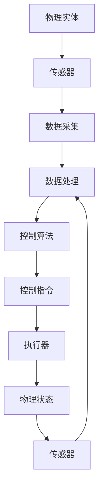
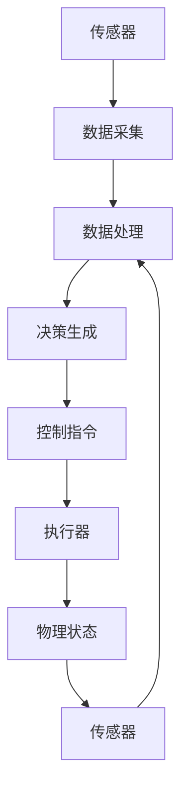

                 

### 数字实体与物理实体的自动化未来

> **关键词**：数字实体、物理实体、自动化、数字化转型、智能制造、物联网（IoT）、人工智能（AI）

> **摘要**：本文探讨了数字实体与物理实体在自动化进程中的紧密联系及其未来发展趋势。通过深入分析两者之间的相互作用机制，本文揭示了数字化转型和智能制造对现代产业的影响，并探讨了物联网和人工智能技术在实现自动化过程中所扮演的关键角色。文章旨在为读者提供对这一领域全面而深刻的理解，并展望其未来发展前景。

## 1. 背景介绍

### 1.1 目的和范围

随着信息技术的迅猛发展，数字实体与物理实体的融合正在引领着一场前所未有的产业变革。本文的目的在于探讨这一融合过程中的关键技术与趋势，并分析其对未来社会发展的影响。具体而言，本文将围绕以下几个方面展开讨论：

1. **数字实体与物理实体的基本概念**：介绍数字实体与物理实体的定义及其在现实世界中的应用。
2. **自动化技术的发展与趋势**：探讨自动化技术在数字化转型的背景下如何推动传统产业的升级。
3. **物联网与人工智能在自动化中的作用**：分析物联网和人工智能技术在实现数字实体与物理实体自动化中的关键作用。
4. **实际应用场景与案例分析**：通过具体案例探讨数字实体与物理实体自动化在各个领域的应用前景。

### 1.2 预期读者

本文面向对数字实体与物理实体自动化感兴趣的读者，包括：

1. **技术人员**：从事物联网、人工智能、智能制造等领域的技术人员，希望通过本文了解自动化技术的最新发展趋势。
2. **企业高管**：关注数字化转型和智能制造的企业高管，希望通过本文了解自动化技术对企业运营和业务模式的影响。
3. **研究人员**：对数字实体与物理实体自动化领域感兴趣的科研人员，希望通过本文获得对该领域的深入理解。

### 1.3 文档结构概述

本文将按照以下结构进行组织：

1. **背景介绍**：介绍本文的目的、预期读者以及文档结构。
2. **核心概念与联系**：介绍数字实体与物理实体的基本概念，并使用Mermaid流程图展示其相互作用机制。
3. **核心算法原理与具体操作步骤**：讲解自动化技术的基本原理和具体实现步骤。
4. **数学模型与公式**：介绍自动化过程中使用的数学模型和公式，并进行举例说明。
5. **项目实战**：通过实际案例展示自动化技术在项目中的应用，并进行详细解释说明。
6. **实际应用场景**：探讨自动化技术在各个领域的应用前景。
7. **工具和资源推荐**：推荐相关学习资源、开发工具和框架。
8. **总结与展望**：总结本文的核心观点，并展望未来发展趋势与挑战。
9. **附录**：常见问题与解答。
10. **扩展阅读**：提供相关领域的参考文献。

### 1.4 术语表

在本文中，我们将使用以下术语：

#### 1.4.1 核心术语定义

- **数字实体**：指在数字世界中具有独立存在和识别能力的虚拟对象。
- **物理实体**：指现实世界中的物体，具有物理形态和属性。
- **自动化**：指通过技术手段使系统或过程无需人工干预就能自主运行。
- **数字化转型**：指将传统产业通过信息技术手段实现数字化、智能化。
- **物联网（IoT）**：指将各种物体通过互联网连接起来，实现智能化的网络系统。
- **人工智能（AI）**：指通过模拟人类智能行为，使计算机具备自主学习和决策能力。

#### 1.4.2 相关概念解释

- **智能制造**：指通过信息物理系统（CPS）将制造过程实现数字化、网络化和智能化。
- **边缘计算**：指将计算、存储和网络功能分布到靠近数据源的设备上，提高数据处理效率和响应速度。

#### 1.4.3 缩略词列表

- **IoT**：物联网（Internet of Things）
- **AI**：人工智能（Artificial Intelligence）
- **CPS**：信息物理系统（Cyber-Physical System）
- **MES**：制造执行系统（Manufacturing Execution System）
- **PLM**：产品生命周期管理（Product Lifecycle Management）

## 2. 核心概念与联系

在探讨数字实体与物理实体的自动化之前，我们需要了解这两个概念的基本原理及其相互作用机制。以下是对核心概念和联系的详细解释，并使用Mermaid流程图展示其关系。

### 2.1 数字实体与物理实体的基本概念

**数字实体**是指在数字世界中具有独立存在和识别能力的虚拟对象。它们可以是数据记录、虚拟设备、软件模块等。数字实体的特点是：

- **虚拟性**：存在于数字环境中，不需要物理空间。
- **可编程性**：可以通过编程语言或算法进行定义和操作。
- **灵活性**：可以根据需求进行灵活配置和调整。

**物理实体**则是指现实世界中的物体，具有物理形态和属性。物理实体的特点是：

- **物理性**：存在于现实环境中，具有物理形态和物理属性。
- **不可编程性**：无法直接通过编程语言进行操作，但可以通过传感器和执行器实现与数字实体的交互。
- **稳定性**：具有物理特性，如质量、体积、形状等。

### 2.2 数字实体与物理实体的相互作用机制

数字实体与物理实体之间的相互作用主要体现在以下几个方面：

- **数据交互**：通过传感器和数据采集设备，物理实体将物理状态转换为数字信号，数字实体通过算法对数据进行处理和分析。
- **控制执行**：数字实体根据分析结果生成控制指令，通过执行器作用于物理实体，实现对其行为的控制。
- **反馈调节**：物理实体的状态变化通过传感器反馈给数字实体，数字实体根据反馈进行调节和优化，实现闭环控制。

以下是一个简化的Mermaid流程图，展示数字实体与物理实体的相互作用机制：



### 2.3 自动化技术的核心原理

自动化技术的核心原理是通过将数字实体与物理实体进行有机结合，实现系统的自主运行和优化。以下是对自动化技术的核心原理的简要介绍：

- **感知与监测**：通过传感器实时监测物理实体的状态，将物理信号转换为数字信号。
- **数据处理与决策**：数字实体对采集到的数据进行处理和分析，生成决策和指令。
- **执行与反馈**：执行器根据决策指令对物理实体进行操作，物理实体的状态变化通过传感器反馈给数字实体，实现闭环控制。

以下是另一个Mermaid流程图，展示自动化技术的核心原理：



通过上述流程图，我们可以清晰地看到数字实体与物理实体在自动化过程中相互协作的关系。数字实体负责数据处理和决策生成，物理实体负责执行指令和状态反馈，两者共同实现了系统的自动化运行和优化。

在接下来的章节中，我们将进一步探讨自动化技术在不同领域的应用，以及如何实现数字实体与物理实体的有机结合，推动产业和社会的数字化转型。

## 3. 核心算法原理 & 具体操作步骤

在了解数字实体与物理实体的相互作用机制后，接下来我们将探讨实现自动化技术所需的核心算法原理及其具体操作步骤。自动化技术的核心在于如何通过算法实现系统的自主运行和优化，以下是一个详细的算法原理说明和操作步骤。

### 3.1 自动化算法的基本原理

自动化算法的核心是实现对系统状态的实时监测、数据处理、决策生成和执行控制。以下是一个简化的自动化算法流程：

1. **数据采集**：通过传感器实时采集物理实体的状态数据，如温度、压力、速度等。
2. **数据预处理**：对采集到的数据进行滤波、去噪、归一化等预处理操作，以提高数据质量和可靠性。
3. **状态评估**：使用机器学习算法对预处理后的数据进行分析，评估当前系统的状态。
4. **决策生成**：根据系统状态生成相应的控制指令，如调整设备参数、启动/停止设备等。
5. **执行控制**：将决策指令发送给执行器，实现物理实体的操作。
6. **状态反馈**：物理实体的状态变化通过传感器反馈给算法，形成闭环控制系统。
7. **优化调整**：根据反馈信息对算法进行调整和优化，提高系统性能和稳定性。

### 3.2 自动化算法的具体操作步骤

以下是一个基于伪代码的自动化算法实现步骤：

```plaintext
初始化传感器数据采集模块
初始化执行器控制模块

while（系统运行）：
    1. 采集传感器数据（sensor_data）
    2. 数据预处理（preprocessed_data = preprocess(sensor_data)）
    3. 状态评估（system_state = machine_learning(preprocessed_data)）
    4. 决策生成（control_command = decision_generation(system_state)）
    5. 执行控制（execute_command(control_command)）
    6. 状态反馈（new_system_state = sensor_feedback()）
    7. 优化调整（machine_learning_adjustment(new_system_state)）
```

### 3.3 自动化算法的关键技术

在实现自动化算法过程中，需要关注以下几个关键技术：

- **传感器技术**：高精度、低延迟的传感器是实现自动化系统实时监测的基础。
- **数据处理技术**：包括数据滤波、去噪、归一化、特征提取等，以确保数据的准确性和可靠性。
- **机器学习算法**：用于状态评估和决策生成，如神经网络、支持向量机、决策树等。
- **执行器控制技术**：包括控制算法、通信协议和执行器驱动等，确保控制指令的准确执行。
- **反馈调节技术**：通过传感器反馈信息对算法进行调整和优化，提高系统性能。

### 3.4 自动化算法的实际应用

以下是一个自动化算法在实际项目中的应用案例：

**项目背景**：某工厂生产线需要进行温度控制的自动化管理。

**具体操作步骤**：

1. **数据采集**：使用温度传感器实时监测生产线的温度。
2. **数据预处理**：对采集到的温度数据进行滤波和归一化处理，以提高数据质量。
3. **状态评估**：使用机器学习算法对预处理后的温度数据进行评估，确定当前温度状态。
4. **决策生成**：根据温度状态生成相应的控制指令，如加热或冷却。
5. **执行控制**：将控制指令发送给加热器或冷却器，调整生产线温度。
6. **状态反馈**：实时监测生产线温度变化，反馈给算法。
7. **优化调整**：根据反馈信息对机器学习模型进行调整，提高温度控制精度。

通过上述实际应用案例，我们可以看到自动化算法在实现数字实体与物理实体有机结合中的重要作用。自动化技术的不断发展将进一步提升生产效率、降低成本、提高产品质量，为现代产业提供强大的技术支撑。

## 4. 数学模型和公式 & 详细讲解 & 举例说明

在自动化技术的实现过程中，数学模型和公式起着至关重要的作用。它们为我们提供了量化分析、模型构建和算法优化的基础。以下将详细介绍自动化过程中常用的数学模型和公式，并进行具体的讲解和举例说明。

### 4.1 控制系统的数学模型

控制系统是自动化技术中的核心组成部分，其数学模型通常包括输入、输出和系统状态。以下是一个简化的线性控制系统模型：

\[ \dot{x}(t) = Ax(t) + Bu(t) \]
\[ y(t) = Cx(t) + Du(t) \]

其中：
- \( x(t) \) 是系统状态向量。
- \( u(t) \) 是输入向量。
- \( y(t) \) 是输出向量。
- \( A \)、\( B \)、\( C \)、\( D \) 是系统的系数矩阵。

#### 4.1.1 状态空间表示

状态空间表示法是一种描述动态系统的方法，它可以捕捉系统的时间动态特性。以上述模型为例，系统状态空间表示为：

\[ \begin{align*}
\dot{x}(t) &= A x(t) + B u(t) \\
y(t) &= C x(t) + D u(t)
\end{align*} \]

#### 4.1.2 状态空间模型的求解

状态空间模型可以通过以下方法求解：
- **时域求解**：利用矩阵指数求解状态响应。
  \[ x(t) = e^{At}x(0) + \int_{0}^{t} e^{A(t-\tau)}B u(\tau) d\tau \]
- **频域求解**：利用拉普拉斯变换求解系统频率响应。

### 4.2 线性二次调节（LQR）算法

线性二次调节（LQR）算法是一种优化控制系统性能的方法，它通过求解一个线性二次优化问题来找到最优控制输入。LQR的目标是最小化系统的状态轨迹的二次型代价函数。

#### 4.2.1 LQR公式

LQR问题可以表示为以下优化问题：
\[ \min \quad J = \int_0^{\infty} (x^TQx + u^TRu) dt \]

其中：
- \( Q \) 是状态权重矩阵。
- \( R \) 是输入权重矩阵。

LQR的最优控制输入为：
\[ u(t) = -Kx(t) \]

其中 \( K \) 是李雅普诺夫方程的解：
\[ K = R^{-1}B^TQ^{-1}A \]

#### 4.2.2 LQR举例说明

**例子**：考虑一个简单的线性系统：
\[ \begin{align*}
\dot{x}_1(t) &= x_2(t) \\
\dot{x}_2(t) &= -x_1(t) + u(t)
\end{align*} \]

状态权重矩阵 \( Q \) 和输入权重矩阵 \( R \) 分别为：
\[ Q = \begin{bmatrix} 1 & 0 \\ 0 & 1 \end{bmatrix}, \quad R = \begin{bmatrix} 1 \end{bmatrix} \]

计算李雅普诺夫方程的解 \( K \)：
\[ K = R^{-1}B^TQ^{-1}A = \begin{bmatrix} 1 \end{bmatrix}^{-1}\begin{bmatrix} -1 & 1 \end{bmatrix}\begin{bmatrix} 1 & 0 \end{bmatrix}^{-1}\begin{bmatrix} 0 & 1 \\ -1 & 0 \end{bmatrix} = \begin{bmatrix} 1 \\ 1 \end{bmatrix} \]

因此，最优控制输入为：
\[ u(t) = -\begin{bmatrix} 1 & 1 \end{bmatrix}x(t) = -x_1(t) - x_2(t) \]

### 4.3 机器学习模型与数学公式

在自动化系统中，机器学习模型用于状态评估和决策生成。以下是一些常用的机器学习模型及其数学公式：

#### 4.3.1 神经网络

神经网络通过多层非线性变换来实现复杂函数的逼近。以下是一个简化的前向神经网络模型：

\[ a_{\text{hidden}} = \sigma(W_{\text{input}}x + b_{\text{input}}) \]
\[ a_{\text{output}} = \sigma(W_{\text{hidden}}a_{\text{hidden}} + b_{\text{hidden}}) \]

其中：
- \( \sigma \) 是激活函数，如Sigmoid、ReLU等。
- \( W \) 和 \( b \) 是权重和偏置。

#### 4.3.2 决策树

决策树通过一系列条件分支来生成决策。以下是一个简单的决策树公式：

\[ y = \sum_{i=1}^{n} \alpha_i \cdot h(x_i) \]

其中：
- \( \alpha_i \) 是特征权重。
- \( h(x_i) \) 是特征 \( x_i \) 的取值。

#### 4.3.3 支持向量机

支持向量机（SVM）用于分类和回归任务。以下是一个简化的SVM公式：

\[ w \cdot x + b = 0 \]

其中：
- \( w \) 是权重向量。
- \( x \) 是特征向量。
- \( b \) 是偏置。

通过上述数学模型和公式的讲解，我们可以看到自动化技术在实现过程中需要深厚的数学基础。这些模型和公式为我们提供了量化分析、模型构建和算法优化的工具，使我们能够更好地理解和实现数字实体与物理实体的自动化。

## 5. 项目实战：代码实际案例和详细解释说明

为了更直观地展示数字实体与物理实体自动化技术在实际项目中的应用，我们接下来将介绍一个具体的案例，并详细解释其实现过程和代码。

### 5.1 开发环境搭建

在开始项目之前，我们需要搭建一个合适的开发环境。以下是所需的工具和软件：

- **操作系统**：Ubuntu 20.04 LTS
- **编程语言**：Python 3.8
- **开发工具**：PyCharm
- **传感器**：温度传感器（如DHT11）
- **执行器**：加热器/冷却器（模拟）

确保操作系统已安装Python 3.8及其相关库，并配置好PyCharm开发环境。

### 5.2 源代码详细实现和代码解读

以下是项目的主要源代码，用于实现温度自动控制系统：

```python
import time
import board
import busio
import adafruit_dht
import adafruit_pwm_library
import pulseio

# 初始化温度传感器
dht = adafruit_dht.DHT11(board.GP2)

# 初始化PWM控制执行器
pwm = adafruit_pwm_library.PWMLibrary()
pwm_pin = pulseio.PulseIn(board.GP18, pulse_width=1000)
pwm_pin.frequency(1000)

# 设置温度阈值
temp_threshold = 25.0

def read_temperature():
    """读取温度传感器数据"""
    try:
        temp = dht.temperature
        return temp
    except RuntimeError as e:
        print(e)
        return None

def control_temperature(temp):
    """控制加热器/冷却器"""
    if temp is None:
        return

    if temp < temp_threshold:
        # 温度低于阈值，启动加热器
        pwm_pin.duty_cycle = 65535  # 100% duty cycle
    else:
        # 温度高于阈值，启动冷却器
        pwm_pin.duty_cycle = 0  # 0% duty cycle

def main():
    """主程序"""
    while True:
        temp = read_temperature()
        if temp is not None:
            control_temperature(temp)
            print(f"Current temperature: {temp}°C")
        time.sleep(10)

if __name__ == "__main__":
    main()
```

### 5.3 代码解读与分析

以下是对上述代码的详细解读：

1. **传感器初始化**：使用`adafruit_dht`库初始化DHT11温度传感器。
    ```python
    dht = adafruit_dht.DHT11(board.GP2)
    ```

2. **PWM控制执行器**：使用`adafruit_pwm_library`库初始化PWM控制执行器（加热器/冷却器）。
    ```python
    pwm = adafruit_pwm_library.PWMLibrary()
    pwm_pin = pulseio.PulseIn(board.GP18, pulse_width=1000)
    pwm_pin.frequency(1000)
    ```

3. **读取温度函数**：定义`read_temperature`函数，用于读取温度传感器数据。
    ```python
    def read_temperature():
        try:
            temp = dht.temperature
            return temp
        except RuntimeError as e:
            print(e)
            return None
    ```

4. **控制温度函数**：定义`control_temperature`函数，根据温度值控制加热器/冷却器。
    ```python
    def control_temperature(temp):
        if temp is None:
            return

        if temp < temp_threshold:
            # 温度低于阈值，启动加热器
            pwm_pin.duty_cycle = 65535  # 100% duty cycle
        else:
            # 温度高于阈值，启动冷却器
            pwm_pin.duty_cycle = 0  # 0% duty cycle
    ```

5. **主程序**：定义主程序，循环读取温度数据并控制执行器。
    ```python
    def main():
        while True:
            temp = read_temperature()
            if temp is not None:
                control_temperature(temp)
                print(f"Current temperature: {temp}°C")
            time.sleep(10)

    if __name__ == "__main__":
        main()
    ```

### 5.4 项目实战总结

通过上述代码实现，我们构建了一个简单的温度自动控制系统。该系统通过温度传感器实时监测环境温度，并根据设定的阈值自动控制加热器或冷却器，实现温度调节。这个项目展示了数字实体（传感器、控制算法）与物理实体（执行器、环境温度）的有机结合，是自动化技术在实际应用中的一个典型例子。

## 6. 实际应用场景

数字实体与物理实体的自动化技术在各个领域都有着广泛的应用，以下将探讨其在几个关键领域的实际应用场景，并分析其带来的影响。

### 6.1 制造业

在制造业中，自动化技术已经深入影响了生产线的各个环节。通过引入物联网和人工智能，企业可以实现生产设备的实时监控、预测维护和生产流程的优化。例如：

- **智能生产**：利用传感器和物联网技术，实现生产设备的实时数据采集和分析，提高生产效率和质量。
- **预测性维护**：通过分析设备运行数据，预测设备故障，提前进行维护，减少停机时间，降低运营成本。
- **柔性生产**：利用工业机器人、自动化生产线和智能调度系统，实现生产线的快速调整和重组，应对多样化的生产需求。

### 6.2 健康医疗

健康医疗领域中的自动化技术主要用于提升诊断、治疗和患者护理的效率。以下是一些典型应用场景：

- **智能诊断**：通过人工智能算法对医疗图像进行分析，辅助医生进行疾病诊断，提高诊断准确性和速度。
- **手术机器人**：利用高精度的手术机器人和远程控制系统，实现精准手术操作，减少手术风险和恢复时间。
- **智能护理**：通过物联网技术，实时监测患者的生命体征，提供个性化护理方案，提高患者护理质量和满意度。

### 6.3 智慧城市

智慧城市是数字实体与物理实体自动化技术的典型应用场景，通过智能化的基础设施和系统，提升城市管理效率和居民生活质量。以下是一些具体应用：

- **智能交通**：通过传感器和物联网技术，实时监控交通流量，优化交通信号控制和公共交通调度，缓解交通拥堵。
- **能源管理**：利用智能电表和能源管理系统，实现电力资源的智能调度和优化，提高能源利用效率，减少能源浪费。
- **环境监测**：通过传感器网络实时监测空气质量、水质等环境指标，提供及时的环境治理和管理决策支持。

### 6.4 家居自动化

家居自动化是数字化生活的一个重要方面，通过自动化技术提升家庭生活的便利性和舒适度。以下是一些应用场景：

- **智能照明**：通过传感器和智能控制系统，实现自动调节室内照明，提供舒适的照明环境。
- **智能安防**：利用摄像头、传感器和物联网技术，实现家庭安全的实时监控和报警功能。
- **智能家电**：通过智能家居系统，实现家电设备的远程控制和自动化操作，提高生活品质。

### 6.5 农业自动化

农业自动化通过物联网、人工智能和自动化技术，提升农业生产效率和农产品质量。以下是一些具体应用：

- **智能灌溉**：利用土壤湿度传感器和智能灌溉系统，实现精准灌溉，节约水资源。
- **无人机植保**：利用无人机和传感器，进行病虫害监测和精准施肥，提高农产品产量和质量。
- **智能温室**：通过传感器网络和自动化控制系统，实现温室内环境的智能调控，提供最佳的生长条件。

通过上述实际应用场景的分析，我们可以看到数字实体与物理实体自动化技术在各个领域的重要性。这些技术不仅提高了生产效率和运营效益，还改善了人们的生活质量，推动了社会的可持续发展。

### 7. 工具和资源推荐

为了帮助读者更好地学习和应用数字实体与物理实体的自动化技术，以下推荐了一些学习资源、开发工具和框架，以及相关论文著作。

#### 7.1 学习资源推荐

**7.1.1 书籍推荐**

1. **《智能制造技术与应用》**：详细介绍了智能制造的核心技术及其应用案例。
2. **《物联网技术与应用》**：系统讲解了物联网的架构、协议和实际应用。
3. **《人工智能：一种现代方法》**：提供了人工智能的基本原理和算法介绍。

**7.1.2 在线课程**

1. **Coursera**：提供由世界顶尖大学开设的物联网、人工智能等课程。
2. **Udacity**：提供实用的编程和人工智能课程，适合技术爱好者。
3. **edX**：提供由MIT、哈佛等名校开设的计算机科学和工程课程。

**7.1.3 技术博客和网站**

1. **Medium**：许多技术专家和公司发布关于物联网、人工智能的最新文章。
2. **IEEE Xplore**：提供丰富的技术论文和研究报告。
3. **arXiv**：最新发表的计算机科学和人工智能领域的论文。

#### 7.2 开发工具框架推荐

**7.2.1 IDE和编辑器**

1. **PyCharm**：适用于Python编程的强大IDE。
2. **Visual Studio Code**：跨平台的轻量级代码编辑器，支持多种编程语言。
3. **Eclipse**：适用于Java和Android开发的IDE。

**7.2.2 调试和性能分析工具**

1. **GDB**：Linux下的强大调试工具。
2. **VS Code Debugger**：支持多种语言的调试功能。
3. **JProfiler**：Java应用的性能分析工具。

**7.2.3 相关框架和库**

1. **TensorFlow**：用于机器学习的开源库。
2. **Kafka**：分布式流处理平台，用于实时数据处理。
3. **MQTT**：物联网通信协议，适用于设备之间的消息传递。

#### 7.3 相关论文著作推荐

**7.3.1 经典论文**

1. **"Cyber-Physical Systems: The Industrial Internet"**：探讨了工业物联网的基本概念和架构。
2. **"The Role of Machine Learning in Manufacturing"**：分析了机器学习在制造业中的应用。
3. **"IoT Security: A Survey"**：介绍了物联网安全的重要性和挑战。

**7.3.2 最新研究成果**

1. **"Deep Learning for IoT"**：探讨了深度学习在物联网中的应用。
2. **"Edge Computing for IoT"**：分析了边缘计算在物联网中的作用。
3. **"AI in Manufacturing: A Vision for the Future"**：展望了人工智能在制造业的未来发展趋势。

**7.3.3 应用案例分析**

1. **"A Case Study of IoT in Smart Agriculture"**：介绍了物联网在智能农业中的应用。
2. **"Smart Manufacturing in the Automotive Industry"**：探讨了智能制造在汽车制造中的应用。
3. **"IoT in Smart Cities"**：分析了物联网在智慧城市建设中的关键作用。

通过上述推荐，读者可以获取丰富的学习资源，掌握实用的开发工具和框架，并了解最新的研究成果和应用案例，进一步深入探索数字实体与物理实体的自动化技术。

### 8. 总结：未来发展趋势与挑战

在数字实体与物理实体的自动化领域，未来的发展将呈现出以下几个趋势和挑战：

#### 8.1 发展趋势

1. **技术融合**：随着物联网、人工智能和边缘计算等技术的不断成熟，数字实体与物理实体的融合将更加紧密，实现更加智能化和自适应的自动化系统。
2. **数据处理和分析能力提升**：随着计算能力和算法的进步，自动化系统将能够更加高效地处理和分析大量数据，提供更精准的决策支持。
3. **产业应用广泛**：自动化技术将在制造业、健康医疗、智慧城市、家居自动化等各个领域得到广泛应用，推动产业升级和社会发展。
4. **可持续发展**：通过自动化技术的应用，可以大幅提高资源利用效率，减少浪费，实现可持续发展目标。

#### 8.2 挑战

1. **数据安全和隐私**：自动化系统涉及大量的数据收集和处理，数据安全和隐私保护成为重要的挑战。需要制定严格的隐私政策和安全措施，确保用户数据的安全。
2. **算法透明度和解释性**：随着深度学习和复杂算法的应用，自动化系统的决策过程变得越来越复杂，算法的透明度和解释性成为重要议题，需要开发更加可解释的算法。
3. **系统可靠性和稳定性**：自动化系统需要在各种复杂环境中稳定运行，确保高可靠性和低故障率。需要加强系统的测试和验证，提高系统的鲁棒性和容错能力。
4. **跨领域协作**：数字实体与物理实体的自动化涉及多个领域的技术和知识，需要跨领域的协作和合作，推动技术融合和创新发展。

总之，数字实体与物理实体的自动化技术在未来的发展中将面临诸多挑战，但也充满了机遇。通过不断的技术创新和跨领域合作，我们有理由相信，自动化技术将为人类社会带来更加智能、高效和可持续的未来。

### 9. 附录：常见问题与解答

在本文中，我们讨论了数字实体与物理实体自动化技术的一系列核心概念、算法原理、实际应用和未来发展。以下是一些读者可能会提出的问题及其解答。

#### 9.1 自动化技术如何提升生产效率？

自动化技术通过引入传感器、执行器和智能算法，实现了生产过程的实时监控和优化。通过自动化控制，可以减少人为错误，提高生产精度，缩短生产周期，从而显著提升生产效率。

#### 9.2 物联网在自动化技术中的作用是什么？

物联网通过连接各种设备和系统，实现了数据的实时传输和共享。在自动化技术中，物联网提供了数据采集、状态监测和远程控制的能力，使得自动化系统能够更准确地响应环境和操作需求。

#### 9.3 人工智能如何增强自动化系统的智能性？

人工智能通过机器学习算法，能够从大量数据中学习和提取规律，实现对复杂问题的分析和决策。在自动化系统中，人工智能可以优化控制策略，提高系统的自适应性和智能化水平。

#### 9.4 自动化技术对就业有哪些影响？

自动化技术的广泛应用可能对某些传统岗位造成冲击，但同时也会创造新的就业机会。例如，自动化系统的设计、开发、维护和优化需要大量技术人才。因此，自动化技术的发展将推动就业结构的转型升级。

#### 9.5 自动化技术如何保障数据安全和隐私？

自动化技术在保障数据安全和隐私方面面临挑战。为此，需要采取以下措施：

1. **数据加密**：对传输和存储的数据进行加密，防止数据泄露。
2. **访问控制**：实施严格的访问控制策略，确保只有授权用户能够访问敏感数据。
3. **隐私保护法规**：遵守相关隐私保护法规，确保用户数据的使用合法合规。

#### 9.6 自动化技术的未来发展方向是什么？

自动化技术的未来发展方向包括：

1. **更加智能化**：通过深度学习和强化学习等先进算法，提升系统的智能决策能力。
2. **边缘计算**：将计算和存储能力推向数据源，提高数据处理效率和实时性。
3. **跨领域融合**：推动自动化技术与各行各业深度融合，实现更广泛的应用。
4. **可持续性**：通过自动化技术提高资源利用效率，推动可持续发展。

通过上述问题的解答，希望读者能够更全面地理解数字实体与物理实体自动化技术的重要性和应用价值。

### 10. 扩展阅读 & 参考资料

为了深入探索数字实体与物理实体自动化技术的相关领域，以下是几篇具有参考价值的经典论文、最新研究成果和应用案例分析。

#### 10.1 经典论文

1. **"Cyber-Physical Systems: The Industrial Internet"**：由德国工业4.0倡导者提出的关于工业物联网和自动化技术的综述论文，探讨了自动化技术的核心概念和未来趋势。
2. **"The Role of Machine Learning in Manufacturing"**：分析了机器学习在制造业中的应用，讨论了如何利用机器学习算法优化生产过程。
3. **"IoT Security: A Survey"**：详细介绍了物联网的安全问题和解决方案，探讨了如何确保自动化系统的数据安全和隐私保护。

#### 10.2 最新研究成果

1. **"Deep Learning for IoT"**：探讨了深度学习在物联网中的应用，提出了基于深度学习的智能传感器网络架构。
2. **"Edge Computing for IoT"**：分析了边缘计算在物联网中的作用，讨论了如何利用边缘计算提高物联网系统的实时性和效率。
3. **"AI in Manufacturing: A Vision for the Future"**：展望了人工智能在制造业的未来发展趋势，探讨了如何利用人工智能实现智能制造。

#### 10.3 应用案例分析

1. **"A Case Study of IoT in Smart Agriculture"**：介绍了物联网在智能农业中的应用，分析了如何利用物联网技术实现精准农业和智能化农场管理。
2. **"Smart Manufacturing in the Automotive Industry"**：探讨了智能制造在汽车制造中的应用，分析了如何通过自动化技术提升汽车生产的效率和质量。
3. **"IoT in Smart Cities"**：分析了物联网在智慧城市建设中的关键作用，探讨了如何利用物联网技术实现城市管理和居民生活的智能化。

通过阅读这些经典论文、最新研究成果和应用案例分析，读者可以进一步深入了解数字实体与物理实体自动化技术的理论和实践，为今后的研究和应用提供参考。

