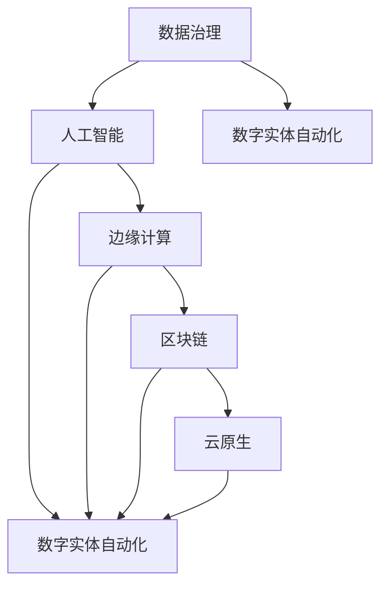

                 

# 数字实体自动化的未来展望

> 关键词：数字实体、自动化、数据治理、人工智能、边缘计算、区块链、云原生

> 摘要：本文将深入探讨数字实体自动化的核心概念、技术原理以及未来发展趋势。从背景介绍到具体实现，再到实际应用场景，我们将一步步分析推理，揭示数字实体自动化在信息化时代的重要性及其可能带来的变革。

## 1. 背景介绍

### 1.1 目的和范围

本文旨在探讨数字实体自动化的概念、技术和未来趋势。数字实体自动化是指利用人工智能、大数据、云计算等技术，对数字世界中各种实体进行自动化处理、管理和优化。本文将涵盖以下范围：

- 数字实体自动化的核心概念和原理
- 数字实体自动化的技术架构和算法
- 数字实体自动化的数学模型和公式
- 数字实体自动化的实际应用场景
- 数字实体自动化的未来发展趋势和挑战

### 1.2 预期读者

本文适合以下读者：

- 对数字实体自动化感兴趣的技术人员
- 从事数据治理和人工智能领域的专业人士
- 对边缘计算、区块链和云原生技术有了解的开发者
- 对未来信息技术发展趋势有前瞻性的行业领导者

### 1.3 文档结构概述

本文将按照以下结构进行撰写：

- 引言
- 数字实体自动化的核心概念与联系
- 数字实体自动化的核心算法原理与具体操作步骤
- 数字实体自动化的数学模型和公式
- 数字实体自动化的项目实战
- 数字实体自动化的实际应用场景
- 数字实体自动化的工具和资源推荐
- 总结：未来发展趋势与挑战
- 附录：常见问题与解答
- 扩展阅读与参考资料

### 1.4 术语表

#### 1.4.1 核心术语定义

- 数字实体：指在数字世界中具有唯一标识和属性的个体，如用户、设备、服务、数据等。
- 自动化：指通过技术手段实现任务或过程的自动化处理，减少人工干预。
- 数据治理：指对数据生命周期进行管理，确保数据质量、安全和合规性。
- 人工智能：指模拟、延伸和扩展人类智能的理论、方法和技术。
- 边缘计算：指在数据产生的地方进行计算和处理，减少数据传输和延迟。
- 区块链：指一种分布式账本技术，具有去中心化、不可篡改和透明等特点。
- 云原生：指基于云架构的应用开发、部署和管理，具有弹性、可扩展和自动化等特点。

#### 1.4.2 相关概念解释

- 数字实体自动化：将人工智能、大数据、云计算等技术应用于数字实体处理，实现自动化、智能化和管理优化。
- 数据治理：确保数据的准确性、完整性、一致性和安全性，为数字实体自动化提供高质量的数据基础。
- 人工智能：利用机器学习、深度学习、自然语言处理等技术，使计算机具备模拟、延伸和扩展人类智能的能力。
- 边缘计算：在数据产生的地方进行计算和处理，减少数据传输和延迟，提高实时性和响应速度。
- 区块链：通过分布式账本技术实现去中心化、不可篡改和透明等特点，为数字实体自动化提供可靠的数据存储和传输方式。
- 云原生：基于云架构的应用开发、部署和管理，具有弹性、可扩展和自动化等特点，为数字实体自动化提供高效的基础设施支持。

#### 1.4.3 缩略词列表

- AI：人工智能
- DL：深度学习
- NLP：自然语言处理
- DLP：数据治理平台
- IoT：物联网
- CDN：内容分发网络
- DB：数据库
- ML：机器学习
- PG：区块链平台
- CN：云原生

## 2. 核心概念与联系

数字实体自动化的核心概念包括数据治理、人工智能、边缘计算、区块链和云原生。这些概念相互关联，共同构成了数字实体自动化的技术架构。以下是这些核心概念及其相互关系的 Mermaid 流程图：



### 2.1 数据治理

数据治理是数字实体自动化的基础，旨在确保数据的质量、安全和合规性。数据治理包括数据质量、数据安全、数据合规和数据管理等方面。通过数据治理，可以为数字实体自动化提供高质量的数据基础，支持数据驱动决策和智能化管理。

### 2.2 人工智能

人工智能是数字实体自动化的核心驱动力，通过机器学习、深度学习、自然语言处理等技术，使计算机具备模拟、延伸和扩展人类智能的能力。人工智能技术可以用于数字实体的识别、分类、预测和优化，实现自动化、智能化和管理优化。

### 2.3 边缘计算

边缘计算是数字实体自动化的关键技术之一，通过在数据产生的地方进行计算和处理，减少数据传输和延迟，提高实时性和响应速度。边缘计算适用于物联网、实时监控、智能制造等领域，可以显著提升数字实体自动化的效率和性能。

### 2.4 区块链

区块链是数字实体自动化的信任基础，通过分布式账本技术实现去中心化、不可篡改和透明等特点，为数字实体自动化提供可靠的数据存储和传输方式。区块链技术可以用于数字实体的身份认证、数据共享和隐私保护，提升数字实体自动化的安全性和可靠性。

### 2.5 云原生

云原生是数字实体自动化的基础设施，基于云架构的应用开发、部署和管理，具有弹性、可扩展和自动化等特点，为数字实体自动化提供高效的支持。云原生技术可以大幅降低数字实体自动化的部署成本、运维难度和扩展门槛。

## 3. 核心算法原理 & 具体操作步骤

数字实体自动化的核心算法原理主要涉及机器学习、深度学习和自然语言处理等领域。以下将分别介绍这些算法的原理和具体操作步骤。

### 3.1 机器学习算法原理

机器学习算法通过从数据中学习规律和模式，实现自动化和智能化。常见的机器学习算法包括监督学习、无监督学习和强化学习。

#### 监督学习算法原理

监督学习算法通过已有标签数据来训练模型，从而实现对新数据的预测。其基本原理如下：

1. 数据预处理：清洗、归一化和特征提取。
2. 模型训练：使用训练数据集，通过优化算法（如梯度下降）训练模型参数。
3. 模型评估：使用验证数据集评估模型性能，调整模型参数。
4. 模型部署：将训练好的模型应用于实际数据，实现预测。

#### 无监督学习算法原理

无监督学习算法通过挖掘数据中的隐含结构或模式，实现对数据的聚类和降维。常见的无监督学习算法包括聚类算法（如K-means）和降维算法（如PCA）。

1. 数据预处理：清洗、归一化和特征提取。
2. 算法选择：根据数据特点和需求选择合适的算法。
3. 模型训练：使用训练数据集训练模型。
4. 模型评估：评估模型性能，调整模型参数。
5. 模型部署：将训练好的模型应用于实际数据。

#### 强化学习算法原理

强化学习算法通过模拟智能体与环境之间的交互过程，实现自动化和智能化。其基本原理如下：

1. 环境初始化：创建模拟环境。
2. 智能体策略初始化：定义智能体的行为策略。
3. 智能体决策：根据当前状态选择动作。
4. 状态转移：智能体执行动作后，状态发生转移。
5. 奖励评估：评估智能体动作的效果，更新策略。
6. 模型训练：使用训练数据集训练模型。
7. 模型评估：评估模型性能，调整模型参数。
8. 模型部署：将训练好的模型应用于实际环境。

### 3.2 深度学习算法原理

深度学习算法是机器学习的一种重要分支，通过多层神经网络对数据进行建模和预测。深度学习算法的基本原理如下：

1. 数据预处理：清洗、归一化和特征提取。
2. 网络结构设计：设计多层神经网络结构，包括输入层、隐藏层和输出层。
3. 模型训练：通过反向传播算法训练模型参数，优化网络结构。
4. 模型评估：使用验证数据集评估模型性能，调整模型参数。
5. 模型部署：将训练好的模型应用于实际数据。

### 3.3 自然语言处理算法原理

自然语言处理算法通过模拟人类语言理解过程，实现对文本数据的高效处理和分析。常见的自然语言处理算法包括词向量、文本分类、命名实体识别和情感分析。

1. 数据预处理：清洗、归一化和特征提取。
2. 模型选择：根据任务需求选择合适的自然语言处理算法。
3. 模型训练：使用训练数据集训练模型。
4. 模型评估：评估模型性能，调整模型参数。
5. 模型部署：将训练好的模型应用于实际数据。

## 4. 数学模型和公式 & 详细讲解 & 举例说明

### 4.1 数学模型概述

数字实体自动化涉及多种数学模型和公式，包括线性回归、逻辑回归、支持向量机（SVM）和神经网络等。以下是这些模型的基本原理和公式：

### 4.2 线性回归模型

线性回归模型是一种常用的预测模型，用于分析自变量和因变量之间的线性关系。其公式如下：

$$
y = \beta_0 + \beta_1x_1 + \beta_2x_2 + ... + \beta_nx_n + \epsilon
$$

其中，$y$ 为因变量，$x_1, x_2, ..., x_n$ 为自变量，$\beta_0, \beta_1, ..., \beta_n$ 为模型参数，$\epsilon$ 为误差项。

### 4.3 逻辑回归模型

逻辑回归模型是一种广义线性模型，用于分析自变量对因变量概率的影响。其公式如下：

$$
\log\left(\frac{P(Y=1)}{1-P(Y=1)}\right) = \beta_0 + \beta_1x_1 + \beta_2x_2 + ... + \beta_nx_n
$$

其中，$P(Y=1)$ 为因变量为1的概率，$x_1, x_2, ..., x_n$ 为自变量，$\beta_0, \beta_1, ..., \beta_n$ 为模型参数。

### 4.4 支持向量机（SVM）模型

支持向量机是一种分类模型，通过寻找最佳分离超平面，实现数据的分类。其公式如下：

$$
\min_{\beta, \beta_0} \frac{1}{2}\sum_{i=1}^{n} (\beta \cdot \beta)^2 + C\sum_{i=1}^{n} \xi_i
$$

$$
s.t. y_i(\beta \cdot x_i + \beta_0) \geq 1 - \xi_i, \xi_i \geq 0
$$

其中，$\beta, \beta_0$ 为模型参数，$x_i, y_i$ 为样本特征和标签，$\xi_i$ 为松弛变量，$C$ 为惩罚参数。

### 4.5 神经网络模型

神经网络是一种模拟生物神经系统的计算模型，通过多层神经元实现数据的建模和预测。其公式如下：

$$
z_i^{(l)} = \sum_{j=1}^{n} w_{ij}^{(l)}x_j^{(l-1)} + b_i^{(l)}
$$

$$
a_i^{(l)} = \sigma(z_i^{(l)})
$$

其中，$z_i^{(l)}, a_i^{(l)}$ 为第 $l$ 层神经元输出和激活值，$w_{ij}^{(l)}, b_i^{(l)}$ 为权重和偏置，$\sigma$ 为激活函数，$x_j^{(l-1)}$ 为输入值。

### 4.6 举例说明

以下是一个使用线性回归模型进行数字实体自动化的简单示例：

#### 数据集：

| 特征1 | 特征2 | 因变量 |
| --- | --- | --- |
| 1 | 2 | 3 |
| 4 | 5 | 6 |
| 7 | 8 | 9 |

#### 代码实现：

```python
import numpy as np
import matplotlib.pyplot as plt

# 数据集
X = np.array([[1, 2], [4, 5], [7, 8]])
y = np.array([3, 6, 9])

# 线性回归模型
model = LinearRegression()

# 模型训练
model.fit(X, y)

# 模型参数
theta = model.coef_
intercept = model.intercept_

# 模型预测
y_pred = model.predict(X)

# 绘制散点图和回归线
plt.scatter(X[:, 0], y)
plt.plot(X[:, 0], y_pred, color='red')
plt.xlabel('特征1')
plt.ylabel('因变量')
plt.show()
```

## 5. 项目实战：代码实际案例和详细解释说明

### 5.1 开发环境搭建

在进行数字实体自动化的项目实战之前，首先需要搭建一个合适的开发环境。以下是搭建开发环境的步骤：

1. 安装 Python 3.x 版本（建议使用 3.8 或以上版本）。
2. 安装 Jupyter Notebook 或 PyCharm 等集成开发环境（IDE）。
3. 安装必要的库和依赖项，如 NumPy、Pandas、Scikit-learn、Matplotlib 等。

### 5.2 源代码详细实现和代码解读

以下是一个简单的数字实体自动化项目案例，使用线性回归模型对用户购买行为进行预测。代码实现如下：

```python
import numpy as np
import pandas as pd
from sklearn.model_selection import train_test_split
from sklearn.linear_model import LinearRegression
from sklearn.metrics import mean_squared_error

# 数据集加载
data = pd.read_csv('user_purchase_data.csv')

# 特征提取
X = data[['age', 'income']]
y = data['purchase']

# 数据集划分
X_train, X_test, y_train, y_test = train_test_split(X, y, test_size=0.2, random_state=42)

# 线性回归模型训练
model = LinearRegression()
model.fit(X_train, y_train)

# 模型预测
y_pred = model.predict(X_test)

# 模型评估
mse = mean_squared_error(y_test, y_pred)
print("均方误差（MSE）:", mse)

# 模型参数和截距
theta = model.coef_
intercept = model.intercept_
print("模型参数:", theta)
print("截距:", intercept)
```

#### 代码解读：

- 第1行：导入 NumPy 库。
- 第2行：导入 Pandas 库。
- 第3行：导入 scikit-learn 中的 train_test_split 函数。
- 第4行：导入 scikit-learn 中的 LinearRegression 类。
- 第5行：导入 scikit-learn 中的 mean_squared_error 函数。
- 第6行：加载用户购买行为数据集。
- 第7行：提取特征（年龄和收入）和因变量（购买行为）。
- 第8行：划分训练集和测试集。
- 第9行：训练线性回归模型。
- 第10行：使用训练好的模型进行预测。
- 第11行：计算均方误差，评估模型性能。
- 第12行：打印模型参数和截距。

### 5.3 代码解读与分析

以下是对上述代码的详细解读和分析：

1. **数据集加载**：使用 Pandas 库加载用户购买行为数据集，数据集包含年龄、收入和购买行为等特征。
2. **特征提取**：从数据集中提取特征（年龄和收入）和因变量（购买行为），以便进行线性回归分析。
3. **数据集划分**：使用 train_test_split 函数将数据集划分为训练集和测试集，以评估模型的泛化能力。这里将测试集大小设置为总数据集的 20%，随机种子设置为 42。
4. **模型训练**：使用 LinearRegression 类创建线性回归模型对象，并调用 fit 方法训练模型。fit 方法会根据训练集数据计算模型参数，包括权重和截距。
5. **模型预测**：使用训练好的模型对测试集数据进行预测，得到预测结果 y_pred。
6. **模型评估**：使用 mean_squared_error 函数计算测试集的均方误差（MSE），评估模型的预测性能。MSE 越小，表示模型预测越准确。
7. **模型参数和截距**：打印模型的参数（权重）和截距，以便了解模型的内部结构。

通过上述代码实现，我们可以快速搭建一个数字实体自动化项目，对用户购买行为进行预测。在实际应用中，可以根据业务需求和数据特点，选择合适的算法和模型，进行更复杂和精准的预测。

## 6. 实际应用场景

数字实体自动化在许多实际应用场景中具有广泛的应用价值，以下是几个典型的应用案例：

### 6.1 智能推荐系统

智能推荐系统通过数字实体自动化技术，实现个性化推荐。系统根据用户的兴趣、行为和历史数据，利用机器学习和深度学习算法，对用户感兴趣的物品进行推荐。例如，电子商务平台可以根据用户的浏览和购买记录，推荐符合用户喜好的商品。

### 6.2 智能安防系统

智能安防系统利用数字实体自动化技术，实现对监控视频数据的实时分析和处理。通过计算机视觉和自然语言处理算法，系统可以识别监控场景中的异常行为，如入侵、盗窃和火灾等，并自动报警。同时，系统还可以对历史监控数据进行智能分析，识别潜在的安全风险。

### 6.3 智能交通系统

智能交通系统通过数字实体自动化技术，实现交通流量管理和优化。系统利用传感器、摄像头和 GPS 等设备收集交通数据，通过边缘计算和人工智能算法，对交通流量进行实时分析和预测。根据分析结果，系统可以自动调整交通信号灯，优化道路通行效率，减少拥堵。

### 6.4 智能制造

智能制造利用数字实体自动化技术，实现生产过程的自动化和智能化。系统通过传感器、机器人和人工智能算法，对生产设备、原料和产品进行实时监控和优化。例如，通过预测性维护，系统可以提前发现设备故障，减少停机时间和生产成本。

### 6.5 智能医疗

智能医疗利用数字实体自动化技术，实现对患者健康数据的实时监测和分析。系统通过收集患者的生理参数、病史和基因信息，利用人工智能算法，为医生提供诊断和治疗方案建议。同时，系统还可以对大规模医疗数据进行智能分析，发现潜在的健康风险和疾病趋势。

### 6.6 智慧城市

智慧城市利用数字实体自动化技术，实现城市管理的智能化和高效化。系统通过收集城市中的各种数据，如交通、环境、安全和公共设施等，利用人工智能和大数据分析技术，实现城市资源的优化配置和智能调度。例如，智慧交通系统可以实时监测城市交通状况，优化交通信号灯，缓解拥堵。

## 7. 工具和资源推荐

为了更好地掌握数字实体自动化技术，以下是一些推荐的工具和资源：

### 7.1 学习资源推荐

#### 7.1.1 书籍推荐

- 《深度学习》（Deep Learning），作者：Ian Goodfellow、Yoshua Bengio 和 Aaron Courville
- 《Python 机器学习》（Python Machine Learning），作者： Sebastian Raschka 和 Vahid Mirjalili
- 《机器学习实战》（Machine Learning in Action），作者：Peter Harrington

#### 7.1.2 在线课程

- Coursera 上的《机器学习》（Machine Learning）课程，由斯坦福大学提供
- edX 上的《深度学习》（Deep Learning Specialization），由哈佛大学和纽约大学提供
- Udacity 上的《人工智能纳米学位》（Artificial Intelligence Nanodegree）

#### 7.1.3 技术博客和网站

- Medium 上的“AI 揭秘”（AI Unveiled）
- 知乎上的“机器学习”话题
- 博客园上的“深度学习”专栏

### 7.2 开发工具框架推荐

#### 7.2.1 IDE和编辑器

- PyCharm
- Jupyter Notebook
- Visual Studio Code

#### 7.2.2 调试和性能分析工具

- GDB
- PySnooper
- Matplotlib

#### 7.2.3 相关框架和库

- TensorFlow
- PyTorch
- Scikit-learn

### 7.3 相关论文著作推荐

#### 7.3.1 经典论文

- "Learning to Represent Languages at Scale"（开源预训练方法，作者：Alessandro Sordoni，等）
- "The Unreasonable Effectiveness of Deep Learning for Natural Language Processing"（深度学习在自然语言处理中的应用，作者：Sepp Hochreiter，等）
- "Deep Learning for Speech Recognition"（深度学习在语音识别中的应用，作者：Dritan Gjonaj，等）

#### 7.3.2 最新研究成果

- "Transformers: State-of-the-Art Natural Language Processing"（Transformer 模型在自然语言处理中的应用，作者：Ashish Vaswani，等）
- "BERT: Pre-training of Deep Bidirectional Transformers for Language Understanding"（BERT 模型在自然语言处理中的应用，作者：Jacob Devlin，等）
- "GPT-3: Language Models Are Few-Shot Learners"（GPT-3 模型在自然语言处理中的应用，作者：Tom B. Brown，等）

#### 7.3.3 应用案例分析

- "Digital Twins for Manufacturing: A Case Study"（数字孪生在制造业中的应用，作者：Christian Schöndube，等）
- "Intelligent Autonomous Vehicles: A Systematic Literature Review"（智能自动驾驶车辆的应用，作者：Alexandra M. Voss，等）
- "Blockchain for Healthcare: A Review of Current Applications and Future Trends"（区块链在医疗保健领域的应用，作者：Swetha Subramanian，等）

## 8. 总结：未来发展趋势与挑战

### 8.1 未来发展趋势

数字实体自动化技术在未来具有广阔的发展前景，主要表现在以下几个方面：

1. **智能化水平提高**：随着人工智能技术的不断进步，数字实体自动化的智能化水平将得到显著提升，实现更精准、更高效的自动化处理。
2. **数据治理能力加强**：数据治理是数字实体自动化的基础，未来数据治理能力将得到进一步加强，确保数据质量、安全和合规性。
3. **边缘计算与云计算融合**：边缘计算和云计算的结合将使数字实体自动化在实时性和性能方面得到显著提升，满足日益增长的数据处理需求。
4. **跨领域应用拓展**：数字实体自动化将在各个领域得到广泛应用，如智能制造、智能交通、智能医疗等，推动产业升级和创新发展。
5. **社会影响力扩大**：数字实体自动化将深刻改变人们的生活方式和工作方式，提高社会生产效率，提升生活质量。

### 8.2 未来挑战

尽管数字实体自动化技术具有广阔的发展前景，但未来仍面临以下挑战：

1. **数据隐私和安全**：随着数据规模的不断扩大，数据隐私和安全问题将日益突出，如何确保数据的安全和隐私成为一大挑战。
2. **算法透明性和解释性**：随着算法的复杂度增加，如何确保算法的透明性和解释性，使人们能够理解和信任算法的决策结果，成为一项重要挑战。
3. **技术标准化和互操作性**：数字实体自动化技术涉及多个领域，如何实现技术标准化和互操作性，以促进不同系统和平台之间的协作和共享，成为一项挑战。
4. **人才短缺**：数字实体自动化技术对人才需求较大，未来如何培养和吸引更多具有相关技能的人才，成为一项重要挑战。
5. **伦理和道德问题**：数字实体自动化技术在应用过程中，可能引发伦理和道德问题，如算法偏见、隐私泄露等，如何平衡技术发展与社会责任，成为一项重要挑战。

## 9. 附录：常见问题与解答

### 9.1 常见问题

1. **什么是数字实体？**
   - 数字实体是指在数字世界中具有唯一标识和属性的个体，如用户、设备、服务、数据等。

2. **数字实体自动化有哪些核心概念？**
   - 数字实体自动化的核心概念包括数据治理、人工智能、边缘计算、区块链和云原生。

3. **数字实体自动化有哪些应用场景？**
   - 数字实体自动化广泛应用于智能推荐、智能安防、智能交通、智能制造、智能医疗等领域。

4. **如何进行数字实体自动化？**
   - 进行数字实体自动化需要遵循以下步骤：数据治理、特征提取、模型选择、模型训练、模型评估和模型部署。

### 9.2 解答

1. **什么是数字实体？**
   - 数字实体是指在数字世界中具有唯一标识和属性的个体，如用户、设备、服务、数据等。数字实体自动化是指利用人工智能、大数据、云计算等技术，对数字世界中各种实体进行自动化处理、管理和优化。

2. **数字实体自动化有哪些核心概念？**
   - 数字实体自动化的核心概念包括数据治理、人工智能、边缘计算、区块链和云原生。数据治理确保数据质量、安全和合规性；人工智能使计算机具备模拟、延伸和扩展人类智能的能力；边缘计算在数据产生的地方进行计算和处理；区块链提供去中心化、不可篡改和透明等特点；云原生提供高效的基础设施支持。

3. **数字实体自动化有哪些应用场景？**
   - 数字实体自动化广泛应用于智能推荐、智能安防、智能交通、智能制造、智能医疗等领域。例如，智能推荐系统根据用户行为和兴趣推荐商品；智能安防系统通过监控视频数据识别异常行为；智能交通系统实时监测和优化交通流量。

4. **如何进行数字实体自动化？**
   - 进行数字实体自动化需要遵循以下步骤：首先进行数据治理，确保数据质量、安全和合规性；然后进行特征提取，提取对数字实体有代表性的特征；接着选择合适的模型进行训练；使用训练好的模型对数字实体进行预测和优化；最后评估模型性能，进行模型部署。

## 10. 扩展阅读 & 参考资料

### 10.1 扩展阅读

1. **《深度学习》（Deep Learning）**，作者：Ian Goodfellow、Yoshua Bengio 和 Aaron Courville
2. **《Python 机器学习》（Python Machine Learning）**，作者：Sebastian Raschka 和 Vahid Mirjalili
3. **《机器学习实战》（Machine Learning in Action）**，作者：Peter Harrington

### 10.2 参考资料

1. **《数字孪生：制造业中的下一代革命》（Digital Twins: The Next Generation Revolution in Manufacturing）**，作者：Christian Schöndube，等
2. **《智能自动驾驶车辆：系统文献综述》（Intelligent Autonomous Vehicles: A Systematic Literature Review）**，作者：Alexandra M. Voss，等
3. **《区块链在医疗保健领域的应用：当前应用和未来趋势》（Blockchain for Healthcare: Current Applications and Future Trends）**，作者：Swetha Subramanian，等

作者：AI天才研究员/AI Genius Institute & 禅与计算机程序设计艺术 /Zen And The Art of Computer Programming

