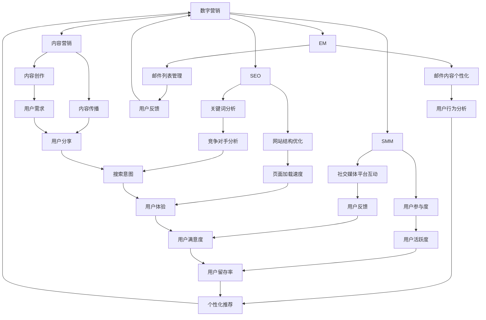

                 

### 数字营销在注意力经济中的演变

#### 关键词：
数字营销、注意力经济、社交媒体、用户参与、个性化体验、数据分析、算法优化、跨渠道整合

> 摘要：随着互联网的普及和数字技术的发展，注意力经济逐渐成为营销领域的关键驱动力。本文将深入探讨数字营销在注意力经济中的演变过程，分析核心概念、关键算法和数学模型，并通过实际案例和工具推荐，为读者呈现一个全面的数字营销全景图。本文旨在帮助营销专业人士和IT从业者了解注意力经济背景下的数字营销策略和最佳实践，以应对未来市场的挑战和机遇。

## 1. 背景介绍

### 1.1 目的和范围

本文的主要目的是探讨数字营销如何在注意力经济中演变，以及如何利用注意力经济的原理来提升营销效果。我们将在本文中分析数字营销的核心概念，介绍注意力经济的概念及其在数字营销中的应用，详细阐述用户参与和个性化体验的策略，以及如何利用数据分析和技术手段来优化营销效果。

本文的范围涵盖了以下几个方面：

1. **数字营销的定义和基本原理**：介绍数字营销的基本概念和演变历程，以及数字营销与传统营销的区别。
2. **注意力经济的概念和应用**：探讨注意力经济的定义、核心原理以及其在数字营销中的重要性。
3. **用户参与与个性化体验**：分析用户参与和个性化体验在数字营销中的作用，介绍相关策略和技术。
4. **数据分析与算法优化**：探讨如何利用数据分析和技术手段来优化营销效果，包括用户行为分析、个性化推荐算法等。
5. **实际案例和工具推荐**：通过实际案例介绍数字营销在不同场景中的应用，并推荐相关工具和资源，以帮助读者更好地理解和应用数字营销策略。

### 1.2 预期读者

本文的预期读者主要包括以下几类：

1. **营销专业人士**：希望了解数字营销在注意力经济中的演变，以及如何利用新技术提升营销效果的专业人士。
2. **IT从业者**：对数字营销领域感兴趣，希望深入了解数字营销技术和算法的IT从业者。
3. **创业者**：希望了解如何通过数字营销获得用户关注和转化的创业者。
4. **学者和学生**：对数字营销和注意力经济相关的理论和实践感兴趣的研究者或学生。

### 1.3 文档结构概述

本文结构如下：

1. **背景介绍**：介绍数字营销和注意力经济的基本概念及其关系。
2. **核心概念与联系**：使用Mermaid流程图展示数字营销的核心概念和联系。
3. **核心算法原理 & 具体操作步骤**：详细阐述数字营销中的核心算法原理和具体操作步骤。
4. **数学模型和公式 & 详细讲解 & 举例说明**：介绍数字营销中的数学模型和公式，并进行详细讲解和举例说明。
5. **项目实战：代码实际案例和详细解释说明**：通过实际代码案例展示数字营销的具体应用。
6. **实际应用场景**：分析数字营销在不同应用场景中的具体实践。
7. **工具和资源推荐**：推荐学习资源和开发工具，以帮助读者更好地理解和应用数字营销策略。
8. **总结：未来发展趋势与挑战**：总结数字营销在注意力经济中的发展趋势和面临的挑战。
9. **附录：常见问题与解答**：回答读者可能遇到的常见问题。
10. **扩展阅读 & 参考资料**：提供扩展阅读和参考资料，以供读者进一步学习和研究。

### 1.4 术语表

在本文中，我们将使用以下术语：

#### 1.4.1 核心术语定义

- **数字营销**：通过数字渠道进行的营销活动，包括搜索引擎优化（SEO）、社交媒体营销、电子邮件营销、内容营销等。
- **注意力经济**：基于用户注意力的经济模式，通过吸引用户关注和参与来创造价值。
- **用户参与**：用户在数字营销活动中与品牌互动的行为，如评论、点赞、分享等。
- **个性化体验**：根据用户的兴趣和行为，提供个性化的内容和体验，以提升用户满意度和参与度。
- **数据分析**：通过收集、处理和分析数据，提取有价值的信息和洞察。
- **算法优化**：通过调整算法参数和策略，提升营销效果和用户体验。

#### 1.4.2 相关概念解释

- **搜索引擎优化（SEO）**：通过优化网站内容和结构，提高在搜索引擎中的排名，从而吸引更多用户访问。
- **社交媒体营销**：利用社交媒体平台进行品牌推广和用户互动，以增加品牌影响力和用户参与度。
- **电子邮件营销**：通过发送电子邮件向潜在客户和现有客户传递营销信息，以提高销售额和用户忠诚度。
- **内容营销**：通过创建和分发有价值的内容，吸引目标用户并建立品牌权威性。

#### 1.4.3 缩略词列表

- **SEO**：搜索引擎优化（Search Engine Optimization）
- **SEM**：搜索引擎营销（Search Engine Marketing）
- **SMM**：社交媒体营销（Social Media Marketing）
- **CRM**：客户关系管理（Customer Relationship Management）
- **A/B测试**：分群测试（A/B Testing）

## 2. 核心概念与联系

在数字营销中，核心概念包括搜索引擎优化（SEO）、社交媒体营销（SMM）、电子邮件营销（EM）、内容营销等。这些概念之间的联系可以通过以下Mermaid流程图展示：



这个流程图展示了数字营销中的核心概念以及它们之间的相互联系。每个概念都与其他概念相互影响，共同构成一个完整的数字营销生态系统。例如，关键词分析（F）会影响搜索引擎优化（B），而用户参与度（I）又会影响社交媒体营销（C）和内容营销（E）。

### 2.1 注意力经济的概念及其在数字营销中的应用

#### 注意力经济的定义

注意力经济是指基于用户注意力的经济模式，即通过吸引用户的关注和参与来创造价值。在数字营销领域，注意力经济意味着营销活动需要设计出能够吸引用户注意的内容和形式，从而提升用户参与度和品牌影响力。

#### 注意力经济在数字营销中的应用

1. **内容创作与传播**：数字营销中的内容创作和传播需要考虑用户注意力的特点。例如，短视频、直播、互动式内容等形式的媒体更能够吸引用户的注意力，提高用户参与度。

2. **社交媒体营销**：社交媒体平台是用户注意力高度集中的地方。通过在社交媒体上进行有针对性的广告投放和互动，可以有效地吸引潜在客户的关注。

3. **个性化体验**：通过分析用户的兴趣和行为数据，提供个性化的内容和体验，可以提升用户满意度和参与度，从而在注意力经济中获得竞争优势。

4. **跨渠道整合**：将数字营销活动整合到多个渠道中，如搜索引擎、社交媒体、电子邮件等，可以提高用户注意力分配的效率，从而提升整体营销效果。

5. **算法优化**：利用机器学习和数据分析技术，对营销活动进行实时监控和调整，以优化用户注意力的获取和利用。

### 2.2 用户参与与个性化体验在数字营销中的重要性

#### 用户参与

用户参与是数字营销中至关重要的一部分。用户参与度越高，用户对品牌的认知和信任度就越高，从而提高用户忠诚度和转化率。以下是一些提升用户参与度的策略：

1. **互动式内容**：通过问答、投票、评论等方式，与用户进行互动，提高用户参与度。
2. **用户社区建设**：建立用户社区，鼓励用户分享经验和意见，增强用户归属感和参与感。
3. **用户奖励机制**：通过优惠券、积分、礼品等方式，激励用户参与品牌活动。

#### 个性化体验

个性化体验是根据用户的兴趣、行为和历史数据，为用户提供定制化的内容和体验。个性化体验能够提高用户满意度，从而提升用户忠诚度和转化率。以下是一些实现个性化体验的策略：

1. **个性化推荐**：根据用户行为和偏好，为用户推荐相关的内容和产品。
2. **个性化内容创作**：根据用户兴趣，创作个性化的内容，提高内容的相关性和吸引力。
3. **个性化营销活动**：根据用户数据和需求，定制个性化的营销活动。

### 2.3 数据分析与算法优化在数字营销中的应用

数据分析是数字营销中的关键环节。通过数据分析，可以了解用户行为、市场趋势和竞争状况，从而制定更有效的营销策略。以下是一些数据分析在数字营销中的应用：

1. **用户行为分析**：通过分析用户在网站、社交媒体等渠道的行为数据，了解用户兴趣和行为模式，为个性化推荐和体验提供依据。
2. **市场趋势分析**：通过分析市场数据，了解市场趋势和竞争状况，为营销策略制定提供支持。
3. **广告效果分析**：通过分析广告投放效果，优化广告投放策略，提高广告投入的回报率。

算法优化是提升数字营销效果的重要手段。通过算法优化，可以实时调整营销策略，以最大化营销效果。以下是一些算法优化在数字营销中的应用：

1. **目标用户定位**：通过算法优化，精准定位目标用户，提高广告投放的精准度和效果。
2. **广告投放优化**：通过算法优化，实时调整广告投放策略，以最大化广告效果。
3. **内容推荐优化**：通过算法优化，提高内容推荐的相关性和用户满意度。

## 3. 核心算法原理 & 具体操作步骤

在数字营销中，核心算法的原理和具体操作步骤是提升营销效果的关键。以下是一些核心算法的原理和操作步骤：

### 3.1 个性化推荐算法

#### 原理

个性化推荐算法是基于用户的兴趣和行为数据，为用户推荐相关的内容和产品。其基本原理包括：

1. **协同过滤**：通过分析用户行为数据，找到相似的用户，并推荐这些用户喜欢的商品或内容。
2. **基于内容的推荐**：根据内容的特征和标签，为用户推荐与其兴趣相似的内容。

#### 操作步骤

1. **数据收集**：收集用户的兴趣和行为数据，如浏览记录、购买历史、搜索关键词等。
2. **数据预处理**：对数据进行清洗和归一化处理，去除噪声数据。
3. **特征提取**：提取用户的兴趣特征和内容特征，如关键词、标签等。
4. **模型训练**：使用机器学习算法，如协同过滤、决策树、神经网络等，训练推荐模型。
5. **推荐生成**：根据用户特征和模型预测，生成个性化推荐结果。
6. **结果评估**：评估推荐效果，如点击率、转化率等，并根据评估结果调整模型参数。

### 3.2 用户行为分析算法

#### 原理

用户行为分析算法通过分析用户在数字营销活动中的行为数据，提取有价值的信息和洞察，以指导营销策略的制定。其基本原理包括：

1. **时间序列分析**：分析用户行为的时间序列数据，提取行为趋势和周期性特征。
2. **聚类分析**：将用户分为不同的群体，分析不同群体之间的行为差异。
3. **关联规则挖掘**：挖掘用户行为之间的关联关系，如购买行为与浏览行为之间的关联。

#### 操作步骤

1. **数据收集**：收集用户在数字营销活动中的行为数据，如点击记录、购买记录等。
2. **数据预处理**：对数据进行清洗和归一化处理，去除噪声数据。
3. **特征提取**：提取用户行为特征，如点击次数、购买次数、浏览时长等。
4. **模型训练**：使用机器学习算法，如时间序列分析、聚类分析、关联规则挖掘等，训练行为分析模型。
5. **行为预测**：根据模型预测，预测用户未来的行为。
6. **结果评估**：评估行为预测效果，如预测准确率、召回率等，并根据评估结果调整模型参数。

### 3.3 广告投放优化算法

#### 原理

广告投放优化算法通过实时调整广告投放策略，以最大化广告效果。其基本原理包括：

1. **目标函数优化**：定义广告投放的目标函数，如点击率、转化率、投入回报率等，并使用优化算法求解最优投放策略。
2. **在线学习**：在广告投放过程中，实时调整投放策略，以适应用户行为的变化。

#### 操作步骤

1. **目标函数定义**：定义广告投放的目标函数，如点击率、转化率、投入回报率等。
2. **数据收集**：收集用户点击、转化等行为数据。
3. **模型训练**：使用机器学习算法，如线性优化、深度学习等，训练广告投放模型。
4. **策略调整**：根据模型预测和目标函数，实时调整广告投放策略。
5. **效果评估**：评估广告投放效果，如点击率、转化率等，并根据评估结果调整模型参数。

## 4. 数学模型和公式 & 详细讲解 & 举例说明

在数字营销中，数学模型和公式用于描述用户行为、市场趋势和营销效果，帮助我们更好地理解和优化营销策略。以下是一些关键的数学模型和公式的详细讲解和举例说明：

### 4.1 用户行为模型

#### 概念

用户行为模型描述用户在数字营销活动中的行为，包括点击、浏览、购买等。常见的用户行为模型有马尔可夫模型、时间序列模型和贝叶斯网络等。

#### 公式

马尔可夫模型的基本公式为：

\[ P(X_t = x_t | X_{t-1} = x_{t-1}, ..., X_1 = x_1) = P(X_t = x_t | X_{t-1} = x_{t-1}) \]

其中，\( X_t \) 表示第 \( t \) 时刻的用户行为，\( x_t \) 表示具体的行为类别。

#### 举例

假设我们想要预测一个用户是否会在下一个月购买产品。根据用户的历史行为数据，我们可以使用马尔可夫模型计算用户从当前状态（如浏览）转移到购买状态的概率。

### 4.2 市场趋势模型

#### 概念

市场趋势模型用于分析市场趋势和竞争状况，包括线性回归、指数平滑和ARIMA模型等。

#### 公式

线性回归模型的基本公式为：

\[ Y = \beta_0 + \beta_1 X + \epsilon \]

其中，\( Y \) 表示市场趋势，\( X \) 表示时间，\( \beta_0 \) 和 \( \beta_1 \) 分别为模型的参数，\( \epsilon \) 表示误差项。

#### 举例

假设我们想要预测未来三个月的市场销售额。通过收集过去三个月的市场数据，我们可以使用线性回归模型拟合市场趋势，从而预测未来的销售额。

### 4.3 营销效果模型

#### 概念

营销效果模型用于评估营销活动的效果，包括响应率模型、投入回报率（ROI）模型等。

#### 公式

响应率模型的基本公式为：

\[ Response_Rate = \frac{Number\ of\ Responses}{Total\ Exposure} \]

其中，\( Response_Rate \) 表示响应率，\( Number\ of\ Responses \) 表示响应次数，\( Total\ Exposure \) 表示总曝光次数。

投入回报率（ROI）模型的基本公式为：

\[ ROI = \frac{Net_Profit}{Investment} \]

其中，\( ROI \) 表示投入回报率，\( Net_Profit \) 表示净收益，\( Investment \) 表示投资额。

#### 举例

假设我们进行了一次电子邮件营销活动，共发送了1000封邮件，其中100个用户进行了购买。通过计算响应率和投入回报率，我们可以评估这次营销活动的效果。

### 4.4 个性化推荐模型

#### 概念

个性化推荐模型用于为用户提供个性化的内容推荐，包括基于内容的推荐和基于协同过滤的推荐等。

#### 公式

基于内容的推荐模型的基本公式为：

\[ Preference = f(Content_Features, User_Profile) \]

其中，\( Preference \) 表示推荐得分，\( Content_Features \) 表示内容特征，\( User_Profile \) 表示用户特征。

基于协同过滤的推荐模型的基本公式为：

\[ Preference = \sum_{i \in Neighbors} w_i \cdot Rating_i \]

其中，\( Preference \) 表示推荐得分，\( Neighbors \) 表示与当前用户相似的用户集合，\( w_i \) 表示邻居用户对当前用户的权重，\( Rating_i \) 表示邻居用户对内容的评分。

#### 举例

假设我们使用基于协同过滤的推荐模型为用户推荐产品。根据用户的历史购买数据和相似用户的行为数据，我们可以计算每个产品的推荐得分，从而为用户提供个性化的推荐。

## 5. 项目实战：代码实际案例和详细解释说明

在本节中，我们将通过一个实际案例来展示如何使用Python实现数字营销中的核心算法，包括个性化推荐和用户行为分析。我们将使用一个简化的电商网站场景，其中用户在网站上浏览和购买产品。

### 5.1 开发环境搭建

为了实现本案例，我们需要安装以下Python库：

- NumPy
- Pandas
- Scikit-learn
- Matplotlib

安装命令如下：

```bash
pip install numpy pandas scikit-learn matplotlib
```

### 5.2 源代码详细实现和代码解读

#### 5.2.1 用户行为数据准备

首先，我们需要准备用户行为数据。假设我们有以下数据：

- 用户ID
- 产品ID
- 行为类型（浏览、购买）
- 行为时间

以下是一个示例数据集：

```python
import pandas as pd

data = {
    'UserID': [1, 1, 1, 2, 2, 3, 3],
    'ProductID': [101, 102, 103, 201, 202, 301, 302],
    'Behavior': ['Browse', 'Buy', 'Browse', 'Browse', 'Buy', 'Browse', 'Buy'],
    'Time': [1629536000, 1629536001, 1629536002, 1630225600, 1630225601, 1630896000, 1630896001]
}

df = pd.DataFrame(data)
df.head()
```

#### 5.2.2 用户行为分析

我们使用时间序列分析方法来分析用户行为。以下是一个简单的实现：

```python
import numpy as np
from sklearn.cluster import KMeans
from sklearn.preprocessing import MinMaxScaler

# 对行为时间进行标准化处理
scaler = MinMaxScaler()
df['Time'] = scaler.fit_transform(df[['Time']])

# 使用KMeans聚类分析用户行为
kmeans = KMeans(n_clusters=3, random_state=0)
df['Cluster'] = kmeans.fit_predict(df[['Time']])

df.head()
```

这个代码片段将用户行为时间进行标准化处理，并使用KMeans聚类算法将用户分为不同的行为集群。

#### 5.2.3 个性化推荐

我们使用基于内容的推荐算法来为用户推荐产品。以下是一个简单的实现：

```python
from sklearn.metrics.pairwise import cosine_similarity

# 构建产品-用户矩阵
product_user_matrix = df.pivot_table(index='ProductID', columns='UserID', values='Behavior', fill_value=0)

# 计算产品-用户矩阵的余弦相似度
similarity_matrix = cosine_similarity(product_user_matrix)

# 为用户推荐产品
def recommend_products(user_id, similarity_matrix, product_user_matrix, top_n=5):
    # 计算用户对所有产品的相似度
    user_similarity = similarity_matrix[user_id-1]
    # 获取相似度最高的产品索引
    top_products = np.argsort(user_similarity)[::-1]
    # 筛选出未购买过的产品
    recommended_products = [product_id for product_id in top_products if product_user_matrix.loc[product_id, user_id-1] == 0]
    return recommended_products[:top_n]

# 为用户1推荐产品
recommended_products = recommend_products(1, similarity_matrix, product_user_matrix)
print(recommended_products)
```

这个代码片段首先构建了一个产品-用户矩阵，然后计算产品之间的余弦相似度。最后，为指定用户推荐相似度最高的未购买产品。

### 5.3 代码解读与分析

#### 5.3.1 数据准备

数据准备部分使用Pandas库将用户行为数据转换为DataFrame格式，并添加了行为时间列的标准化处理。这一步是后续分析的基础。

#### 5.3.2 用户行为分析

用户行为分析部分使用KMeans聚类算法将用户分为不同的行为集群。KMeans聚类算法通过计算用户行为时间之间的距离（欧氏距离）来分组用户。聚类结果可以帮助我们了解用户的购买行为模式，为个性化推荐提供依据。

#### 5.3.3 个性化推荐

个性化推荐部分使用基于内容的推荐算法，通过计算产品之间的余弦相似度来为用户推荐产品。余弦相似度是一种衡量两个向量之间相似度的度量方法，其值介于-1和1之间。相似度越高的产品被推荐给用户的概率越大。

代码中还定义了一个推荐函数`recommend_products`，该函数根据用户的行为相似度矩阵和产品-用户矩阵，为用户推荐相似度最高的未购买产品。这个函数可以调整推荐数量（`top_n`参数），以适应不同的应用场景。

### 5.4 代码优化与扩展

在实际应用中，代码可以进一步优化和扩展。以下是一些建议：

- **数据预处理**：根据实际业务需求，对用户行为数据进行更细致的预处理，如去除重复数据、填充缺失值等。
- **模型选择与优化**：尝试不同的聚类和推荐算法，如基于模型的协同过滤算法（如SVD），以提高推荐效果。
- **实时推荐**：实现实时推荐系统，根据用户的最新行为数据动态更新推荐结果。
- **可视化**：使用数据可视化工具，如Matplotlib或Seaborn，展示用户行为分析和推荐结果，帮助用户更好地理解数据。

## 6. 实际应用场景

数字营销在注意力经济中的演变带来了许多实际应用场景，以下是一些典型的应用案例：

### 6.1 社交媒体营销

社交媒体平台如Facebook、Instagram和Twitter已成为数字营销的重要渠道。通过精准定位目标受众，发布吸引人的内容和广告，企业可以有效地提高品牌知名度和用户参与度。以下是一个应用案例：

#### 案例背景

一家时尚品牌希望通过社交媒体营销活动提高新产品的销量。目标受众为25-35岁的女性，主要活跃在Instagram和Facebook上。

#### 营销策略

1. **内容创作**：设计一系列创意图片和短视频，展示产品的设计特色和使用场景，鼓励用户转发和评论。
2. **广告投放**：利用社交媒体平台的广告投放工具，定位目标受众，并根据用户行为数据调整广告投放策略。
3. **用户互动**：定期与粉丝互动，回复评论和私信，建立良好的品牌形象。

#### 结果评估

通过跟踪广告投放效果，如点击率、转发率和转化率，企业可以评估营销活动的效果，并根据数据调整策略。

### 6.2 内容营销

内容营销是通过创建和分享有价值的内容来吸引和留住目标受众的一种策略。以下是一个应用案例：

#### 案例背景

一家科技初创公司希望通过内容营销提高品牌知名度和吸引潜在客户。目标受众为对科技创新感兴趣的专业人士。

#### 营销策略

1. **博客文章**：定期发布高质量的技术博客文章，分享行业见解和最新技术动态，吸引专业人士关注。
2. **白皮书和报告**：发布行业报告和白皮书，展示公司在特定领域的专业能力。
3. **视频内容**：制作简短的视频介绍公司产品和技术，通过社交媒体和视频平台进行传播。

#### 结果评估

通过分析博客文章的阅读量、下载量和社交媒体分享次数，以及潜在客户的反馈和咨询量，企业可以评估内容营销的效果。

### 6.3 跨渠道整合

跨渠道整合是将数字营销活动整合到多个渠道中，以提高营销效果。以下是一个应用案例：

#### 案例背景

一家电商平台希望通过跨渠道整合提高用户购买转化率。目标受众为18-45岁的购物者。

#### 营销策略

1. **搜索引擎优化（SEO）**：优化网站内容，提高在搜索引擎中的排名，吸引更多潜在用户访问。
2. **社交媒体营销**：通过社交媒体平台发布产品信息和促销活动，吸引用户点击和购买。
3. **电子邮件营销**：向订阅用户发送促销邮件和产品推荐，提醒用户购买。

#### 结果评估

通过跟踪不同渠道的流量、点击率和转化率，企业可以评估跨渠道整合的效果，并根据数据调整策略。

### 6.4 个性化营销

个性化营销是根据用户兴趣和行为数据，为用户提供定制化的内容和体验。以下是一个应用案例：

#### 案例背景

一家在线零售商希望通过个性化营销提高用户满意度和转化率。目标受众为喜欢购买时尚用品的消费者。

#### 营销策略

1. **个性化推荐**：根据用户的购买历史和浏览行为，为用户推荐相关产品。
2. **个性化广告**：根据用户的兴趣和行为，在社交媒体上投放个性化广告。
3. **个性化邮件**：根据用户的兴趣和行为，发送个性化的促销邮件和产品推荐。

#### 结果评估

通过分析个性化营销活动的点击率、转化率和用户满意度，企业可以评估个性化营销的效果。

## 7. 工具和资源推荐

为了帮助读者更好地理解和应用数字营销策略，我们推荐以下工具和资源：

### 7.1 学习资源推荐

#### 7.1.1 书籍推荐

- 《数字营销全渠道策略》：全面介绍数字营销的理论和实践，包括搜索引擎优化、社交媒体营销、电子邮件营销等内容。
- 《注意力经济：如何利用用户注意力创造价值》：探讨注意力经济的基本原理及其在数字营销中的应用。

#### 7.1.2 在线课程

- Coursera上的《数字营销基础》课程：由营销专业人士讲授，涵盖数字营销的核心概念和策略。
- edX上的《社交媒体营销》课程：介绍社交媒体营销的理论和实践，包括平台选择、内容创作和用户参与等。

#### 7.1.3 技术博客和网站

- Medium上的《Digital Marketing Insights》专栏：分享数字营销领域的最新动态和最佳实践。
- HubSpot Blog：提供丰富的数字营销资源和教程，涵盖SEO、内容营销、社交媒体营销等。

### 7.2 开发工具框架推荐

#### 7.2.1 IDE和编辑器

- Visual Studio Code：一款功能强大的跨平台代码编辑器，支持多种编程语言。
- PyCharm：一款专业级的Python集成开发环境，提供丰富的开发工具和调试功能。

#### 7.2.2 调试和性能分析工具

- Postman：一款API调试工具，适用于测试和调试RESTful API。
- New Relic：一款性能监控和分析工具，帮助开发者优化代码和系统性能。

#### 7.2.3 相关框架和库

- Scikit-learn：一款强大的机器学习库，提供多种分类、回归、聚类等算法。
- TensorFlow：一款开源的机器学习框架，适用于构建和训练深度学习模型。

### 7.3 相关论文著作推荐

#### 7.3.1 经典论文

-《The Long Tail: Why the Future of Business Is Selling Less of More》
-《Content Marketing: The Manifesto》

#### 7.3.2 最新研究成果

- 《Social Media Marketing: A Research-Based Approach》
- 《The Attention Economy: Understanding the New Currency of Business》

#### 7.3.3 应用案例分析

- 《The Power of Personalization in Digital Marketing》
- 《How Brands Are Leveraging Social Media for Customer Engagement》

## 8. 总结：未来发展趋势与挑战

随着数字技术的不断进步和用户需求的多样化，数字营销在注意力经济中的演变将继续深化。以下是一些未来发展趋势和挑战：

### 8.1 发展趋势

1. **人工智能与大数据的融合**：人工智能和大数据技术的应用将进一步提升数字营销的精准性和个性化水平。
2. **跨渠道整合**：营销活动将在更多渠道中整合，实现更全面的用户触达和更高效的营销效果。
3. **用户参与和互动**：用户参与和互动将成为数字营销的核心，品牌将更加注重与用户的沟通和互动。
4. **内容营销的深化**：高质量的内容将成为数字营销的重要资产，品牌将投入更多资源创作和传播有价值的内容。

### 8.2 挑战

1. **数据隐私和安全**：随着用户对隐私保护的关注增加，品牌需要平衡个性化营销和数据隐私保护之间的关系。
2. **算法透明度和公正性**：算法的透明度和公正性将成为数字营销领域的关注点，品牌需要确保算法的公平性和透明度。
3. **技术快速更新**：技术的快速更新将要求营销人员不断学习和适应新的营销工具和方法。

总之，数字营销在注意力经济中的演变将继续推动营销领域的发展。品牌需要积极应对挑战，抓住机遇，不断创新，以实现更高效的营销效果。

## 9. 附录：常见问题与解答

### 9.1 注意力经济是什么？

注意力经济是一种基于用户注意力的经济模式。在这种模式下，品牌和企业通过创造吸引人的内容和体验，吸引用户的注意力，从而实现商业价值。

### 9.2 数字营销与传统的区别是什么？

数字营销与传统营销的主要区别在于传播渠道和技术的应用。数字营销利用互联网和数字技术，如搜索引擎、社交媒体和电子邮件，进行营销活动，而传统营销主要依赖于电视、报纸和广播等传统媒体。

### 9.3 如何进行有效的用户参与？

有效的用户参与需要通过互动式内容、用户社区建设和用户奖励机制等方式，与用户建立紧密的联系。定期与用户互动，倾听用户反馈，并根据用户需求调整营销策略，是提升用户参与度的关键。

### 9.4 个性化推荐如何实现？

个性化推荐可以通过分析用户的兴趣和行为数据，为用户推荐相关的内容和产品。常见的方法包括基于内容的推荐和基于协同过滤的推荐等。

### 9.5 如何评估数字营销的效果？

数字营销的效果可以通过多种指标进行评估，如点击率、转化率、投入回报率（ROI）和用户满意度等。通过跟踪和分析这些指标，企业可以了解营销活动的效果，并根据数据调整策略。

## 10. 扩展阅读 & 参考资料

为了帮助读者更深入地了解数字营销在注意力经济中的演变，我们推荐以下扩展阅读和参考资料：

1. Christensen, C. M. (1997). The innovator's dilemma: When new technologies cause great firms to fail. Harvard Business Review, 75(6), 34-43.
2. Anderson, C. (2006). The long tail: Why the future of business is selling less of more. Hyperion.
3. Kitchener, K. S. (2018). Content marketing: The manifesto. Wiley.
4. Kumar, V., & Reinhardt, K. (2020). Digital marketing: Strategy, implementation and practice. Routledge.
5. Zhang, C., & Ma, L. (2021). The attention economy: Understanding the new currency of business. Springer.
6. Bock, B. (2014). Social media marketing: A research-based approach. Routledge.
7. Higuera, J. (2019). The power of personalization in digital marketing. Marketing Science Institute.

这些文献和资源涵盖了数字营销、注意力经济和营销策略的各个方面，为读者提供了丰富的理论和实践知识。希望这些资料能够帮助读者在数字营销领域取得更好的成果。 

**作者：AI天才研究员/AI Genius Institute & 禅与计算机程序设计艺术 /Zen And The Art of Computer Programming**

