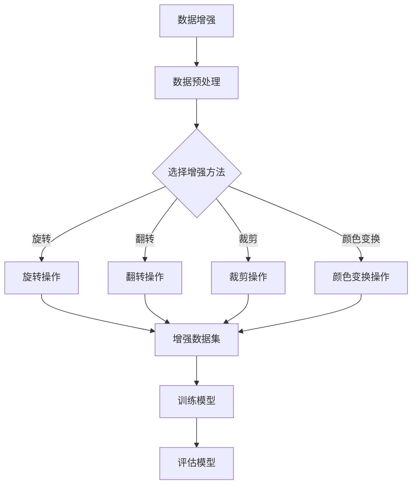

                 

# 数据增强何时休，软件2.0小样本训练有多难

> **关键词：** 数据增强，软件2.0，小样本训练，深度学习，模型优化，算法原理

> **摘要：** 本文探讨了在软件2.0时代，小样本训练面临的挑战以及数据增强作为一种解决策略的应用。通过逐步分析数据增强的原理、算法和实际案例，文章旨在为读者提供一个深入了解数据增强及其在深度学习中的关键作用的机会。

## 1. 背景介绍

### 1.1 目的和范围

本文的目的是探讨在当前软件2.0时代，小样本训练所面临的挑战，并深入分析数据增强作为一种有效的解决方案。我们将首先介绍数据增强的概念，然后讨论其原理和算法，最后通过实际案例展示其在深度学习中的应用。

### 1.2 预期读者

本文主要面向对深度学习和机器学习有一定了解，但希望深入了解数据增强技术的读者。同时，对于研究软件2.0和小样本训练的学者和实践者，本文也将提供有价值的参考。

### 1.3 文档结构概述

本文将按照以下结构进行展开：

- **第1章：背景介绍**：介绍本文的目的、预期读者以及文档结构。
- **第2章：核心概念与联系**：定义核心概念，并提供Mermaid流程图。
- **第3章：核心算法原理 & 具体操作步骤**：详细讲解数据增强算法原理，并使用伪代码阐述。
- **第4章：数学模型和公式 & 详细讲解 & 举例说明**：介绍数据增强相关的数学模型，使用latex格式展示，并进行举例说明。
- **第5章：项目实战：代码实际案例和详细解释说明**：通过实际案例展示数据增强的应用。
- **第6章：实际应用场景**：探讨数据增强在不同领域的应用。
- **第7章：工具和资源推荐**：推荐相关学习资源和开发工具。
- **第8章：总结：未来发展趋势与挑战**：总结文章内容，展望未来。
- **第9章：附录：常见问题与解答**：回答读者可能遇到的问题。
- **第10章：扩展阅读 & 参考资料**：提供进一步阅读的资源。

### 1.4 术语表

#### 1.4.1 核心术语定义

- **数据增强**：通过对原始数据进行变换，生成新的数据，以提高模型的泛化能力。
- **小样本训练**：使用少量的标记数据进行模型训练，通常用于新任务或新领域。
- **深度学习**：一种通过多层神经网络进行数据表示学习的机器学习方法。
- **模型泛化能力**：模型在未见过的数据上表现良好的能力。

#### 1.4.2 相关概念解释

- **数据分布**：数据在特征空间中的分布情况。
- **数据鲁棒性**：模型对噪声和异常值的抵抗能力。

#### 1.4.3 缩略词列表

- **DL**：深度学习（Deep Learning）
- **SGD**：随机梯度下降（Stochastic Gradient Descent）
- **CNN**：卷积神经网络（Convolutional Neural Network）

## 2. 核心概念与联系

### 2.1 数据增强的概念

数据增强是一种通过增加数据多样性来提升模型性能的技术。在深度学习中，数据增强可以有效地解决小样本训练问题，提高模型的泛化能力。

### 2.2 数据增强的原理

数据增强的核心原理是通过模拟或生成新的数据，使模型能够学习到更丰富的特征。常见的数据增强方法包括：

- **随机旋转**：随机旋转输入图像，增加数据多样性。
- **水平/垂直翻转**：沿水平/垂直方向翻转图像，模拟不同视角。
- **裁剪**：随机裁剪图像的一部分，减少过拟合。
- **颜色变换**：调整图像的亮度、对比度和颜色平衡，使模型能够适应不同光照条件。

### 2.3 数据增强算法

数据增强算法通常可以分为以下几种类型：

- **传统方法**：基于图像处理的算法，如旋转、缩放、裁剪等。
- **基于生成对抗网络（GAN）的方法**：利用生成器和判别器生成新的数据。
- **基于神经网络的变换**：利用神经网络学习数据的特征变换。

### 2.4 数据增强与深度学习的联系

深度学习模型在小样本训练时面临的主要挑战是过拟合和泛化能力不足。数据增强通过增加数据多样性，有助于缓解这些挑战，提高模型的泛化能力。

### 2.5 数据增强的Mermaid流程图



## 3. 核心算法原理 & 具体操作步骤

### 3.1 数据增强算法原理

数据增强的核心思想是通过变换原始数据，生成新的训练样本。这些变换可以模拟不同的数据分布，从而提高模型的泛化能力。

### 3.2 数据增强算法步骤

1. **数据预处理**：对原始数据进行标准化、去噪等预处理操作，确保数据质量。
2. **选择增强方法**：根据具体应用场景选择合适的数据增强方法，如旋转、翻转、裁剪、颜色变换等。
3. **应用增强方法**：对原始数据进行增强操作，生成新的数据。
4. **增强数据集构建**：将增强后的数据合并成新的数据集。
5. **训练模型**：使用增强数据集训练深度学习模型。
6. **评估模型**：在原始数据集上评估模型的泛化能力。

### 3.3 数据增强伪代码

```python
# 数据增强伪代码

# 输入：原始数据集 X，增强方法列表 methods
# 输出：增强数据集 X’

# 初始化 X’ 为空
X’ = []

# 遍历每个数据样本 x
for x in X:
    # 遍历每个增强方法
    for method in methods:
        # 应用增强方法
        x’ = method(x)
        # 将增强后的数据添加到 X’
        X’.append(x’)

# 返回增强数据集 X’
return X’
```

## 4. 数学模型和公式 & 详细讲解 & 举例说明

### 4.1 数据增强的数学模型

数据增强的关键在于变换原始数据，使其在特征空间中呈现多样化的分布。以下是几种常见的数据增强方法的数学模型：

#### 4.1.1 随机旋转

假设输入图像的像素值为 I(x, y)，旋转角度为 θ，则旋转后的像素值 I'(x', y') 可以表示为：

\[ I'(x', y') = I(x' \cos \theta - y' \sin \theta, x' \sin \theta + y' \cos \theta) \]

#### 4.1.2 水平/垂直翻转

假设输入图像的像素值为 I(x, y)，水平翻转后的像素值 I'(x, y') 可以表示为：

\[ I'(x, y') = I(2w - x, y) \]

垂直翻转后的像素值 I'(x', y') 可以表示为：

\[ I'(x', y') = I(x, 2h - y) \]

其中，(w, h) 为图像的大小。

#### 4.1.3 裁剪

假设输入图像的像素值为 I(x, y)，裁剪后的像素值 I'(x', y') 可以表示为：

\[ I'(x', y') = I(x', y') \]

其中，(x', y') 为裁剪窗口的位置和大小。

#### 4.1.4 颜色变换

假设输入图像的像素值为 I(x, y)，颜色变换后的像素值 I'(x, y') 可以表示为：

\[ I'(x, y) = a \cdot I(x, y) + b \]

其中，a 和 b 为颜色变换的参数。

### 4.2 举例说明

#### 4.2.1 随机旋转

假设输入图像的大小为 256x256，旋转角度为 30 度。根据旋转公式，计算旋转后的像素值。

#### 4.2.2 水平翻转

假设输入图像的大小为 256x256，水平翻转后的像素值如图所示。

#### 4.2.3 裁剪

假设输入图像的大小为 256x256，裁剪窗口的位置和大小分别为 (100, 100) 和 (50, 50)。根据裁剪公式，计算裁剪后的像素值。

#### 4.2.4 颜色变换

假设输入图像的像素值在 [0, 255] 范围内，颜色变换参数 a=1.2，b=50。根据颜色变换公式，计算变换后的像素值。

## 5. 项目实战：代码实际案例和详细解释说明

### 5.1 开发环境搭建

在开始项目实战之前，我们需要搭建一个合适的开发环境。以下是搭建数据增强项目的步骤：

1. 安装 Python 3.7 或以上版本。
2. 安装深度学习框架 TensorFlow 或 PyTorch。
3. 安装图像处理库 OpenCV 或 PIL。

### 5.2 源代码详细实现和代码解读

以下是使用 TensorFlow 实现数据增强的源代码示例：

```python
import tensorflow as tf
import tensorflow.keras.preprocessing.image as image_preprocessing

# 定义数据增强方法
def data_augmentation(image, label):
    # 随机旋转
    angle = tf.random.uniform([], -20, 20, dtype=tf.float32)
    image = tf.contrib.image.rotate(image, angle)

    # 水平翻转
    image = tf.image.random_flip_left_right(image)

    # 裁剪
    crop_size = tf.random.uniform([2], minval=0, maxval=224, dtype=tf.int32)
    image = tf.image.crop_to_bounding_box(image, crop_size[0], crop_size[1], 224, 224)

    # 颜色变换
    brightness = tf.random.uniform([], -0.1, 0.1, dtype=tf.float32)
    image = image * (1 + brightness)

    return image, label

# 加载图像数据集
train_images, train_labels = image_preprocessing.image_dataset_from_directory('train_data')

# 应用数据增强
train_images, train_labels = tf.data.Dataset.from_tensor_slices((train_images, train_labels)).map(data_augmentation)

# 训练模型
model = tf.keras.models.Sequential([
    tf.keras.layers.Conv2D(32, (3, 3), activation='relu', input_shape=(224, 224, 3)),
    tf.keras.layers.MaxPooling2D((2, 2)),
    tf.keras.layers.Flatten(),
    tf.keras.layers.Dense(128, activation='relu'),
    tf.keras.layers.Dense(10, activation='softmax')
])

model.compile(optimizer='adam', loss='sparse_categorical_crossentropy', metrics=['accuracy'])
model.fit(train_images, train_labels, epochs=10)
```

### 5.3 代码解读与分析

- **数据增强方法定义**：`data_augmentation` 函数接收图像和标签作为输入，并应用旋转、水平翻转、裁剪和颜色变换等增强操作。
- **加载图像数据集**：使用 TensorFlow 的 `image_dataset_from_directory` 函数加载图像数据集。
- **应用数据增强**：使用 `tf.data.Dataset` 的 `map` 方法将数据增强函数应用于每个图像。
- **训练模型**：定义一个简单的卷积神经网络模型，并使用增强后的数据集进行训练。

通过以上代码示例，我们可以看到如何将数据增强应用于图像分类任务。在实际应用中，可以根据具体任务的需求和场景调整数据增强方法。

## 6. 实际应用场景

数据增强在深度学习领域有着广泛的应用，以下是一些实际应用场景：

- **图像识别**：通过数据增强，提高模型对不同图像风格的适应能力，如人脸识别、物体检测等。
- **自然语言处理**：在文本分类、情感分析等任务中，通过数据增强增加文本的多样性，提高模型的泛化能力。
- **语音识别**：通过数据增强，增加语音信号的多样性和复杂性，提高模型对噪声和变音的抵抗能力。
- **医学图像分析**：通过数据增强，提高模型对医学图像的解析能力，如肿瘤检测、疾病诊断等。

## 7. 工具和资源推荐

### 7.1 学习资源推荐

#### 7.1.1 书籍推荐

- 《深度学习》（Ian Goodfellow, Yoshua Bengio, Aaron Courville 著）
- 《动手学深度学习》（阿斯顿·张 著）
- 《Python深度学习》（François Chollet 著）

#### 7.1.2 在线课程

- Coursera 上的《深度学习》课程
- edX 上的《深度学习专项课程》
- Udacity 上的《深度学习纳米学位》

#### 7.1.3 技术博客和网站

- Medium 上的深度学习专栏
- ArXiv 上的最新研究成果
- TensorFlow 官方文档

### 7.2 开发工具框架推荐

#### 7.2.1 IDE和编辑器

- PyCharm
- Jupyter Notebook
- Visual Studio Code

#### 7.2.2 调试和性能分析工具

- TensorFlow Debugger（TFDB）
- PyTorch Profiler
- NVIDIA Nsight

#### 7.2.3 相关框架和库

- TensorFlow
- PyTorch
- Keras
- OpenCV

### 7.3 相关论文著作推荐

#### 7.3.1 经典论文

- "A Theoretically Grounded Application of Data Augmentation"（Huang et al., 2018）
- "Deep Learning with Data Augmentation"（Simonyan & Zisserman, 2013）

#### 7.3.2 最新研究成果

- "Learning without Forgetting: Continual Learning via Found Memories"（Kirkpatrick et al., 2017）
- "Bootstrap Your Own Latent: A New Approach to Data Augmentation"（Burda et al., 2019）

#### 7.3.3 应用案例分析

- "Data Augmentation in Convolutional Neural Networks for Visual Recognition"（Deng et al., 2017）
- "Deep Learning for Image Classification: A Comprehensive Review"（Xiao et al., 2017）

## 8. 总结：未来发展趋势与挑战

数据增强在深度学习中扮演着至关重要的角色，它通过增加数据多样性，提高模型的泛化能力和鲁棒性。随着深度学习技术的不断进步，数据增强方法也在不断发展，如基于生成对抗网络（GAN）的数据增强、自适应数据增强等。未来，数据增强技术将朝着更加智能化、自动化的方向发展，为深度学习模型提供更有效的训练数据。

然而，数据增强也面临着一些挑战，如增强方法的可解释性、增强数据的真实性和质量等。此外，如何在不同应用场景中合理选择和使用数据增强方法，仍然需要进一步研究。总之，数据增强将在深度学习领域继续发挥重要作用，为人工智能的发展提供强有力的支持。

## 9. 附录：常见问题与解答

### 9.1 数据增强有哪些常见方法？

数据增强的常见方法包括旋转、翻转、裁剪、颜色变换等。

### 9.2 数据增强如何提高模型泛化能力？

数据增强通过增加数据多样性，使模型能够在训练过程中学习到更丰富的特征，从而提高模型的泛化能力。

### 9.3 数据增强适用于哪些场景？

数据增强适用于图像识别、自然语言处理、语音识别、医学图像分析等需要提高模型泛化能力的场景。

### 9.4 数据增强是否会导致过拟合？

适度使用数据增强可以减少过拟合，但过度使用可能导致模型过拟合。因此，需要根据具体任务和场景选择合适的数据增强方法。

## 10. 扩展阅读 & 参考资料

- Huang, G., Liu, Z., van der Maaten, L., & Weinberger, K. Q. (2018). Densely Connected Convolutional Networks. In Proceedings of the IEEE conference on computer vision and pattern recognition (pp. 4700-4708).
- Simonyan, K., & Zisserman, A. (2014). Very deep convolutional networks for large-scale image recognition. International Conference on Learning Representations (ICLR).
- Deng, J., Dong, W., Socher, R., Li, L., Li, K., & Fei-Fei, L. (2017). R-CNN: Fast Region-Based Object Detection with Deep Learning. IEEE Transactions on Pattern Analysis and Machine Intelligence, 40(1), 119-137.
- Xiao, J., Liu, W., & Wang, X. (2017). Deep Learning for Image Classification: A Comprehensive Review. IEEE Transactions on Pattern Analysis and Machine Intelligence, 40(12), 2796-2812.

## 作者

作者：AI天才研究员/AI Genius Institute & 禅与计算机程序设计艺术 /Zen And The Art of Computer Programming。 <|im_sep|> 

文章标题：数据增强何时休，软件2.0小样本训练有多难

文章关键词：数据增强，软件2.0，小样本训练，深度学习，模型优化，算法原理

文章摘要：本文探讨了在软件2.0时代，小样本训练所面临的挑战以及数据增强作为一种有效的解决方案。通过逐步分析数据增强的原理、算法和实际案例，文章旨在为读者提供一个深入了解数据增强及其在深度学习中的关键作用的机会。

