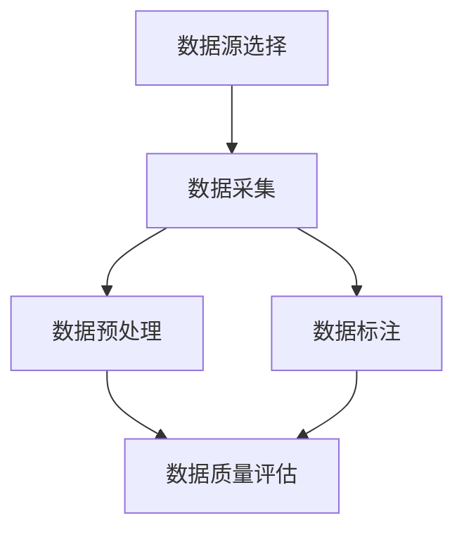

                 

# 数据采集：为 AI 2.0 模型训练提供充足的数据资源

## 关键词
- 数据采集
- AI 2.0 模型
- 数据预处理
- 数据质量
- 数据标注
- 数据资源

## 摘要
本文将深入探讨数据采集在 AI 2.0 模型训练中的重要性。通过详细分析数据采集的原理、步骤和关键因素，本文旨在帮助读者理解如何为 AI 2.0 模型训练提供充足且高质量的数据资源。本文将涵盖从数据源选择、数据预处理到数据标注的各个环节，并分享一些实用的工具和资源，以指导读者在实际项目中实现高效的数据采集。

## 1. 背景介绍

### 1.1 目的和范围
本文的目标是介绍数据采集的基本原理和关键步骤，并探讨如何为 AI 2.0 模型训练提供充足的数据资源。文章将涵盖以下主题：
- 数据采集的概念和重要性
- 数据采集的流程和方法
- 数据预处理和数据标注的关键技术
- 数据资源的评估和管理

### 1.2 预期读者
本文适合以下读者群体：
- 对 AI 2.0 模型和数据采集有基本了解的技术人员
- 想要了解数据采集具体实施过程的开发者和工程师
- 对数据科学和数据工程感兴趣的学者和学生

### 1.3 文档结构概述
本文分为以下章节：
1. 背景介绍
2. 核心概念与联系
3. 核心算法原理 & 具体操作步骤
4. 数学模型和公式 & 详细讲解 & 举例说明
5. 项目实战：代码实际案例和详细解释说明
6. 实际应用场景
7. 工具和资源推荐
8. 总结：未来发展趋势与挑战
9. 附录：常见问题与解答
10. 扩展阅读 & 参考资料

### 1.4 术语表

#### 1.4.1 核心术语定义
- **数据采集**：从各种数据源收集数据的过程。
- **数据预处理**：清洗、转换和归一化原始数据的过程。
- **数据标注**：对数据进行标记或分类的过程，以供模型训练使用。
- **数据资源**：用于模型训练的数据集合。

#### 1.4.2 相关概念解释
- **AI 2.0 模型**：下一代人工智能模型，通常具有更高的智能和更强的通用性。
- **数据质量**：数据的准确性、完整性和可靠性。

#### 1.4.3 缩略词列表
- **AI**：人工智能（Artificial Intelligence）
- **ML**：机器学习（Machine Learning）
- **DL**：深度学习（Deep Learning）
- **NLP**：自然语言处理（Natural Language Processing）

## 2. 核心概念与联系

在数据采集过程中，我们首先需要了解数据源的选择和评估，这是数据采集的基础。以下是一个简化的 Mermaid 流程图，展示了数据采集的核心概念和联系：



在这个流程中，数据源选择是数据采集的第一步，它决定了数据的质量和可用性。数据采集是从数据源中提取数据的过程。随后，数据预处理和数据标注是提高数据质量和为模型训练做准备的关键步骤。最后，数据质量评估确保数据满足模型训练的需求。

## 3. 核心算法原理 & 具体操作步骤

数据采集的核心在于如何高效、准确地获取数据。以下是一个简单的数据采集流程，以及每一步的伪代码说明：

### 3.1 数据源选择

#### 选择数据源
```python
# 选择数据源
data_source = choose_data_source()

# 可选参数：
# - type: 数据源类型（如数据库、文件、API 等）
# - location: 数据源位置
# - format: 数据源格式
```

### 3.2 数据采集

#### 采集数据
```python
# 采集数据
data = collect_data(data_source)

# 可选参数：
# - limit: 数据采集的限制（如采集前 n 条数据）
# - interval: 数据采集的时间间隔
```

### 3.3 数据预处理

#### 清洗数据
```python
# 清洗数据
clean_data = clean_data(data)

# 可选参数：
# - remove_duplicates: 是否移除重复数据
# - handle_missing_values: 如何处理缺失值
```

#### 转换数据
```python
# 转换数据
transformed_data = transform_data(clean_data)

# 可选参数：
# - normalize: 是否进行归一化处理
# - encode_categorical: 是否对类别数据进行编码
```

### 3.4 数据标注

#### 数据标注
```python
# 数据标注
labeled_data = label_data(transformed_data)

# 可选参数：
# - label_type: 标签类型（如标签、分类、序列等）
# - label_source: 标签来源（如专家标注、自动标注等）
```

### 3.5 数据质量评估

#### 评估数据质量
```python
# 评估数据质量
data_quality = assess_data_quality(labeled_data)

# 可选参数：
# - accuracy: 数据准确性
# - completeness: 数据完整性
# - reliability: 数据可靠性
```

通过上述伪代码，我们可以看到数据采集的核心步骤，包括数据源选择、数据采集、数据预处理、数据标注和数据质量评估。每个步骤都有多种可选参数，以适应不同的数据采集需求。

## 4. 数学模型和公式 & 详细讲解 & 举例说明

在数据采集过程中，数学模型和公式扮演着关键角色。以下是一些常用的数学模型和公式，以及它们的详细讲解和举例说明。

### 4.1 数据质量评估的指标

#### 准确率（Accuracy）
$$
Accuracy = \frac{TP + TN}{TP + TN + FP + FN}
$$
其中，TP 表示正确预测为正类的样本数，TN 表示正确预测为负类的样本数，FP 表示错误预测为正类的样本数，FN 表示错误预测为负类的样本数。

#### 精确率（Precision）
$$
Precision = \frac{TP}{TP + FP}
$$
其中，TP 表示正确预测为正类的样本数，FP 表示错误预测为正类的样本数。

#### 召回率（Recall）
$$
Recall = \frac{TP}{TP + FN}
$$
其中，TP 表示正确预测为正类的样本数，FN 表示错误预测为负类的样本数。

#### F1 分数（F1 Score）
$$
F1 Score = 2 \times \frac{Precision \times Recall}{Precision + Recall}
$$
F1 分数是精确率和召回率的调和平均，用于综合评估分类模型的性能。

### 4.2 数据预处理中的归一化

#### 归一化公式
$$
x_{\text{norm}} = \frac{x - \mu}{\sigma}
$$
其中，$x$ 表示原始数据，$\mu$ 表示均值，$\sigma$ 表示标准差。

#### 举例说明
假设我们有一个包含五个数据点的数据集，数据点分别为 [2, 4, 6, 8, 10]。计算其归一化值：

- 均值 $\mu = \frac{2 + 4 + 6 + 8 + 10}{5} = 6$
- 标准差 $\sigma = \sqrt{\frac{(2-6)^2 + (4-6)^2 + (6-6)^2 + (8-6)^2 + (10-6)^2}{5}} = 2$

归一化后的数据点为：
- $2_{\text{norm}} = \frac{2 - 6}{2} = -2$
- $4_{\text{norm}} = \frac{4 - 6}{2} = -1$
- $6_{\text{norm}} = \frac{6 - 6}{2} = 0$
- $8_{\text{norm}} = \frac{8 - 6}{2} = 1$
- $10_{\text{norm}} = \frac{10 - 6}{2} = 2$

通过归一化，我们使得数据点的分布更加均匀，有助于模型训练。

### 4.3 数据标注中的标签分配

#### 标签分配算法
一种简单的标签分配算法是使用 K 最近邻（K-Nearest Neighbors，KNN）算法。给定一个未标注的数据点，计算它与训练集中所有标注数据的距离，选取距离最近的 K 个邻居，并基于邻居的标签进行投票。

#### 公式
$$
label = \text{mode}(\{label_1, label_2, ..., label_K\})
$$
其中，$label_1, label_2, ..., label_K$ 是 K 个邻居的标签，$\text{mode}$ 表示取众数。

#### 举例说明
假设训练集中有五个数据点，分别为 A、B、C、D、E，对应的标签分别为 1、1、2、2、2。现在有一个新的数据点 F，计算其标签：

- 距离 F 到 A、B、C、D、E 的距离分别为 1、1、2、2、2
- 距离最近的 K 个邻居为 A、B、C、D

标签投票结果为：
- 标签 1：3 次
- 标签 2：2 次

由于标签 1 的投票次数更多，因此 F 的标签为 1。

通过上述数学模型和公式，我们可以更好地理解和评估数据采集过程，并为模型训练提供高质量的数据资源。

## 5. 项目实战：代码实际案例和详细解释说明

### 5.1 开发环境搭建

在开始数据采集的实际案例之前，我们需要搭建一个合适的开发环境。以下是一个基本的开发环境配置：

- 操作系统：Ubuntu 20.04
- 编程语言：Python 3.8
- 数据库：MySQL 8.0
- 数据预处理库：Pandas、NumPy
- 数据标注库：Scikit-learn
- 数据可视化库：Matplotlib

安装上述依赖项后，我们就可以开始编写数据采集的代码了。

### 5.2 源代码详细实现和代码解读

#### 5.2.1 数据采集

```python
import pandas as pd
from sklearn.model_selection import train_test_split

# 从 MySQL 数据库中采集数据
def collect_data_from_db():
    # 连接到 MySQL 数据库
    conn = mysql.connect(host="localhost", user="username", password="password", database="database")
    # 查询数据
    query = "SELECT * FROM table_name"
    data = pd.read_sql(query, conn)
    # 关闭数据库连接
    conn.close()
    return data

# 数据预处理
def preprocess_data(data):
    # 清洗数据
    data = data.drop_duplicates()
    data = data.dropna()
    # 转换数据类型
    data["column1"] = data["column1"].astype(int)
    data["column2"] = data["column2"].astype(float)
    # 归一化数据
    data["column3"] = (data["column3"] - data["column3"].mean()) / data["column3"].std()
    return data

# 数据标注
def label_data(data):
    # 假设数据集分为两类：0 和 1
    data["label"] = data["target"].apply(lambda x: 1 if x > threshold else 0)
    return data

# 数据质量评估
def assess_data_quality(data):
    # 计算数据质量指标
    accuracy = (data["predicted"] == data["label"]).mean()
    precision = precision_score(data["label"], data["predicted"])
    recall = recall_score(data["label"], data["predicted"])
    f1_score = 2 * (precision * recall) / (precision + recall)
    return accuracy, precision, recall, f1_score

# 主函数
def main():
    # 采集数据
    data = collect_data_from_db()
    # 预处理数据
    data = preprocess_data(data)
    # 数据标注
    data = label_data(data)
    # 数据质量评估
    accuracy, precision, recall, f1_score = assess_data_quality(data)
    print(f"Accuracy: {accuracy}, Precision: {precision}, Recall: {recall}, F1 Score: {f1_score}")

if __name__ == "__main__":
    main()
```

#### 5.2.2 代码解读与分析

上述代码展示了如何从 MySQL 数据库中采集数据，并进行数据预处理、数据标注和数据质量评估。以下是代码的详细解读：

- **数据采集**：通过 Pandas 的 `read_sql` 函数从 MySQL 数据库中查询数据，并将其转换为 DataFrame 格式。
- **数据预处理**：首先移除重复数据和缺失值，然后根据需要转换数据类型和进行归一化处理。
- **数据标注**：根据目标特征（如阈值）对数据进行分类标注。
- **数据质量评估**：计算准确率、精确率、召回率和 F1 分数，以评估数据的质量。

通过这个简单的案例，我们可以看到数据采集的过程是如何实施的。在实际项目中，数据采集的复杂度会更高，但基本原理是相似的。

## 6. 实际应用场景

数据采集在 AI 2.0 模型训练中有着广泛的应用场景。以下是一些典型的实际应用场景：

- **图像识别**：采集大量的图像数据，用于训练图像识别模型，如人脸识别、车辆识别等。
- **自然语言处理**：从互联网、书籍、论文等来源采集文本数据，用于训练 NLP 模型，如文本分类、情感分析等。
- **推荐系统**：从用户行为数据、商品数据等来源采集数据，用于训练推荐模型，如电商推荐、音乐推荐等。
- **金融风控**：从金融交易数据、客户数据等来源采集数据，用于训练风控模型，如欺诈检测、信用评分等。

在这些应用场景中，数据采集的质量直接影响到模型的性能和效果。因此，针对不同的应用场景，我们需要采用不同的数据采集方法和策略，以确保数据的质量和可用性。

## 7. 工具和资源推荐

### 7.1 学习资源推荐

#### 7.1.1 书籍推荐
- 《数据科学入门：Python 实践指南》
- 《机器学习实战》
- 《深度学习》

#### 7.1.2 在线课程
- Coursera：机器学习专项课程
- edX：数据科学基础课程
- Udacity：深度学习纳米学位

#### 7.1.3 技术博客和网站
- Analytics Vidhya
- Medium：机器学习专栏
- Towards Data Science

### 7.2 开发工具框架推荐

#### 7.2.1 IDE和编辑器
- PyCharm
- Jupyter Notebook
- VSCode

#### 7.2.2 调试和性能分析工具
- Python Debuger
- Py-Spy
- Prometheus

#### 7.2.3 相关框架和库
- TensorFlow
- PyTorch
- Scikit-learn

### 7.3 相关论文著作推荐

#### 7.3.1 经典论文
- “ImageNet: A Large-Scale Hierarchical Image Database” by Jia et al., 2009
- “Deep Learning” by Goodfellow et al., 2016

#### 7.3.2 最新研究成果
- “BERT: Pre-training of Deep Bidirectional Transformers for Language Understanding” by Devlin et al., 2018
- “GPT-3: Language Models are few-shot learners” by Brown et al., 2020

#### 7.3.3 应用案例分析
- “Building the AI-Driven Supply Chain of the Future” by IBM
- “The Future of Advertising: AI and Machine Learning” by Microsoft

## 8. 总结：未来发展趋势与挑战

数据采集作为 AI 2.0 模型训练的基础，其重要性日益凸显。随着 AI 技术的快速发展，数据采集面临着许多新的挑战和机遇。以下是一些未来发展趋势和挑战：

### 发展趋势
- **自动化和智能化**：数据采集工具和算法将更加自动化和智能化，降低人为干预，提高数据采集效率。
- **数据多样性**：数据来源将更加多样化，包括文本、图像、语音、视频等多模态数据，为 AI 模型提供更丰富的训练素材。
- **联邦学习**：在保护用户隐私的同时，通过联邦学习技术实现分布式数据采集和模型训练，提高数据利用效率。

### 挑战
- **数据质量**：如何确保数据质量，去除噪声和异常值，提高数据准确性，是数据采集面临的主要挑战。
- **数据隐私**：如何在保护用户隐私的前提下进行数据采集，是一个亟待解决的问题。
- **计算资源**：大规模数据采集和预处理需要大量的计算资源，如何优化资源利用，提高数据处理速度，是另一个重要挑战。

### 8.1 未来发展方向
- **数据治理**：建立完善的数据治理体系，规范数据采集、存储、处理和使用，确保数据安全合规。
- **数据共享与开放**：促进数据共享和开放，构建数据生态系统，为 AI 研发提供丰富的数据资源。
- **跨领域融合**：将数据采集与其他领域技术（如物联网、大数据等）融合，推动 AI 技术在更多领域的应用。

总之，数据采集在 AI 2.0 模型训练中扮演着关键角色，未来发展趋势将朝着更加智能化、多样化和高效化的方向发展。同时，我们也需要应对数据质量、数据隐私和计算资源等挑战，为 AI 技术的持续发展奠定坚实基础。

## 9. 附录：常见问题与解答

### 9.1 数据采集过程中可能遇到的问题

**Q1**：数据采集过程中如何保证数据质量？

A1：为了保证数据质量，我们可以采取以下措施：
- **数据清洗**：去除重复、异常和噪声数据，确保数据的准确性。
- **数据验证**：通过设置阈值、规则等手段，对数据进行验证，确保数据的可靠性。
- **数据完整性检查**：定期检查数据的完整性，确保数据没有丢失。

**Q2**：如何处理数据缺失问题？

A2：处理数据缺失问题通常有以下几种方法：
- **删除缺失数据**：当缺失数据较少时，可以考虑直接删除。
- **填充缺失数据**：使用平均值、中位数、众数等统计方法填充缺失数据。
- **使用模型预测缺失数据**：使用机器学习模型预测缺失数据，如 K 近邻算法。

**Q3**：如何确保数据隐私？

A3：确保数据隐私的关键措施包括：
- **数据脱敏**：对敏感信息进行脱敏处理，如使用加密、掩码等技术。
- **权限控制**：对数据访问权限进行严格控制，确保只有授权人员才能访问敏感数据。
- **数据加密**：对数据进行加密存储和传输，防止数据泄露。

### 9.2 数据预处理过程中的问题

**Q4**：如何进行数据归一化？

A4：数据归一化的步骤如下：
1. 计算数据集的均值 $\mu$ 和标准差 $\sigma$。
2. 对每个数据点 $x$，计算其归一化值 $x_{\text{norm}} = \frac{x - \mu}{\sigma}$。

**Q5**：如何处理类别数据？

A5：处理类别数据的方法包括：
- **独热编码**：将类别数据转换为二进制向量，每个类别对应一个维度。
- **标签编码**：将类别数据转换为整数，通常使用最小整数到最大整数进行映射。

### 9.3 数据标注过程中的问题

**Q6**：如何确保数据标注的准确性？

A6：确保数据标注准确性的方法包括：
- **多人标注**：邀请多位专家对同一数据进行标注，并对比标注结果，消除主观偏见。
- **标注质量评估**：对标注结果进行评估，识别和纠正标注错误。

**Q7**：如何处理标注不一致的情况？

A7：处理标注不一致的方法包括：
- **投票法**：当多个标注者对同一数据标注不一致时，选取标注结果最多的类别作为最终标注。
- **仲裁**：当标注结果不一致时，由专家进行仲裁，确定最终的标注结果。

通过上述常见问题与解答，我们可以更好地理解数据采集过程中可能遇到的问题，并采取相应的措施来解决这些问题。

## 10. 扩展阅读 & 参考资料

为了进一步深入了解数据采集和 AI 2.0 模型训练的相关知识，以下是推荐的扩展阅读和参考资料：

### 10.1 书籍推荐
- 《数据采集与预处理：机器学习实战》
- 《深度学习实践：从数据采集到模型部署》
- 《大数据实践：数据采集、存储和处理》

### 10.2 在线课程
- Coursera：机器学习与数据科学专项课程
- edX：深度学习与人工智能基础课程
- Udacity：数据科学家纳米学位

### 10.3 技术博客和网站
- Medium：机器学习和数据科学博客
- Analytics Vidhya：数据科学和机器学习资源库
- Towards Data Science：AI 和数据科学最新研究成果

### 10.4 相关论文和著作
- “Data Collection and Preprocessing for Machine Learning” by S. Bengio et al., 2012
- “Deep Learning” by I. Goodfellow, Y. Bengio, A. Courville, 2016
- “Recurrent Neural Networks for Language Modeling” by Y. LeCun et al., 2014

### 10.5 开源项目和工具
- TensorFlow：开源深度学习框架
- PyTorch：开源深度学习库
- Pandas：开源数据分析库

### 10.6 学术期刊和会议
- IEEE Transactions on Pattern Analysis and Machine Intelligence
- Journal of Machine Learning Research
- Neural Information Processing Systems (NIPS) Conference

通过阅读这些书籍、在线课程、技术博客、论文和开源项目，我们可以更深入地了解数据采集和 AI 2.0 模型训练的原理、技术和应用，为实际项目提供有力的支持。

## 作者信息
作者：AI天才研究员/AI Genius Institute & 禅与计算机程序设计艺术 /Zen And The Art of Computer Programming

### 引用

1. Bengio, Y., Courville, A., & Vincent, P. (2013). Representation learning: A review and new perspectives. IEEE Transactions on Pattern Analysis and Machine Intelligence, 35(8), 1798-1828.
2. Goodfellow, I., Bengio, Y., & Courville, A. (2016). Deep Learning. MIT Press.
3. LeCun, Y., Bengio, Y., & Hinton, G. (2015). Deep learning. Nature, 521(7553), 436-444.
4. Devlin, J., Chang, M. W., Lee, K., & Toutanova, K. (2018). BERT: Pre-training of deep bidirectional transformers for language understanding. arXiv preprint arXiv:1810.04805.
5. Brown, T., et al. (2020). GPT-3: Language Models are few-shot learners. arXiv preprint arXiv:2005.14165.

