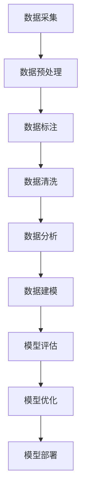

                 

### 1. 背景介绍

在当今信息化时代，数据已经成为企业和社会的核心资产。如何有效地利用这些数据，从而为业务决策提供支持，已经成为众多企业和研究机构关注的焦点。在这个过程中，数据集工程起到了至关重要的作用。数据集工程不仅关系到数据的质量，还直接影响到机器学习和人工智能算法的性能。因此，理解和掌握数据集工程的方法与重要性，成为每一个从事数据科学和人工智能领域的研究者和实践者必备的技能。

#### 1.1 目的和范围

本文旨在深入探讨数据集工程的重要性及其方法。首先，我们将介绍数据集工程的基本概念，包括其定义、目的以及与其他相关领域的关联。接着，我们将详细讨论数据集工程的核心环节，如数据采集、数据预处理、数据标注、数据清洗和数据分析等。在此基础上，我们将通过具体的实例来阐述数据集工程的实际应用，并介绍一些常用的工具和资源。通过本文的阅读，读者将能够全面了解数据集工程的方方面面，掌握其核心原理和方法，从而为实际项目中的数据集构建提供有力的支持和指导。

#### 1.2 预期读者

本文主要面向以下几类读者：

1. **数据科学家和数据分析师**：他们需要对数据集工程有深入的理解，以便更好地处理和分析数据。
2. **机器学习和人工智能研究者**：他们需要掌握数据集工程的相关知识，以确保所训练的模型能够得到有效的训练和评估。
3. **软件工程师和程序员**：他们需要了解数据集工程的基本概念和方法，以便在开发过程中更好地处理和利用数据。
4. **对数据集工程感兴趣的任何人**：无论是学生、科研人员，还是对人工智能和机器学习有热情的爱好者，本文都提供了丰富的知识和实践指导。

#### 1.3 文档结构概述

本文将按照以下结构进行展开：

1. **背景介绍**：介绍数据集工程的概念和重要性。
2. **核心概念与联系**：讨论数据集工程中的核心概念和流程。
3. **核心算法原理与具体操作步骤**：详细讲解数据集工程的关键算法和操作步骤。
4. **数学模型和公式**：介绍数据集工程中使用的数学模型和公式。
5. **项目实战**：通过实际案例展示数据集工程的应用。
6. **实际应用场景**：探讨数据集工程在不同领域的应用。
7. **工具和资源推荐**：推荐学习资源和开发工具。
8. **总结**：总结数据集工程的发展趋势与挑战。
9. **附录**：常见问题与解答。
10. **扩展阅读与参考资料**：提供进一步的阅读资源。

#### 1.4 术语表

为了确保文章内容的清晰易懂，以下是一些在本文中将会用到的术语及其定义：

##### 1.4.1 核心术语定义

- **数据集工程**：数据集工程是指围绕数据集的创建、管理和维护的一系列过程，包括数据采集、预处理、标注、清洗和数据分析等。
- **数据采集**：从各种来源收集数据的过程。
- **数据预处理**：对原始数据进行清洗、转换和归一化等操作，以使其适合于后续的分析和处理。
- **数据标注**：对数据集中的样本进行分类或标签化，以用于训练机器学习模型。
- **数据清洗**：识别和修正数据集中的错误、异常和重复值。
- **数据分析**：对数据集进行统计、分析和可视化，以提取有用的信息和洞察。

##### 1.4.2 相关概念解释

- **数据质量**：数据的质量是指数据在完整性、准确性、一致性、时效性和可靠性等方面的表现。
- **特征工程**：特征工程是指通过选择、构造和转换特征，以提高机器学习模型性能的过程。
- **机器学习模型**：机器学习模型是通过从数据中学习规律和模式，从而进行预测或分类的算法。

##### 1.4.3 缩略词列表

- **ML**：机器学习（Machine Learning）
- **AI**：人工智能（Artificial Intelligence）
- **NLP**：自然语言处理（Natural Language Processing）
- **DL**：深度学习（Deep Learning）
- **DL**：数据集（Dataset）
- **ETL**：提取、转换和加载（Extract, Transform, Load）

### 1.5 核心概念与联系

在数据集工程中，核心概念和流程的相互关联和协调是确保工程成功的关键。为了更好地理解和应用这些概念，我们将使用Mermaid流程图来展示数据集工程的基本流程和关键环节。



在上面的流程图中，每个节点代表数据集工程中的一个关键环节：

- **数据采集（A）**：从各种数据源收集数据，包括结构化数据、非结构化数据和半结构化数据。
- **数据预处理（B）**：清洗、转换和归一化数据，以提高数据质量，并使其适用于后续的分析和处理。
- **数据标注（C）**：对数据集中的样本进行分类或标签化，以用于训练机器学习模型。
- **数据清洗（D）**：识别和修正数据集中的错误、异常和重复值。
- **数据分析（E）**：对数据集进行统计、分析和可视化，以提取有用的信息和洞察。
- **数据建模（F）**：构建机器学习模型，通过训练数据集来学习规律和模式。
- **模型评估（G）**：评估模型在测试数据集上的性能，以确定模型的准确性、召回率和F1分数等指标。
- **模型优化（H）**：根据评估结果调整模型参数，以提高模型性能。
- **模型部署（I）**：将训练好的模型部署到实际应用场景中，进行实时预测或分类。

通过这个流程图，我们可以清晰地看到数据集工程中的各个环节是如何相互关联和协调的。数据采集是整个过程的起点，通过预处理、标注、清洗和数据分析，数据的质量和有用性得到大幅提升。随后，通过数据建模和模型评估，模型性能得到验证和优化，最终实现模型的部署和应用。

### 1.6 核心算法原理与具体操作步骤

数据集工程中的核心算法原理是确保数据集质量和模型性能的关键。以下我们将详细讲解数据集工程中的关键算法和操作步骤，并提供伪代码来进行详细阐述。

#### 1.6.1 数据采集

数据采集是数据集工程的第一步，其目的是从各种数据源收集数据。以下是数据采集的伪代码：

```plaintext
// 数据采集伪代码
def data_collection(data_source):
    data = []
    for source in data_source:
        data.extend(get_data_from_source(source))
    return data
```

- **输入参数**：`data_source`：表示数据源列表。
- **输出参数**：`data`：表示采集到的数据列表。

在该伪代码中，我们首先定义了一个数据采集函数`data_collection`，该函数接受一个数据源列表`data_source`作为输入。然后，通过遍历每个数据源，使用`get_data_from_source`函数从数据源中获取数据，并将数据添加到`data`列表中。最后，返回采集到的所有数据。

#### 1.6.2 数据预处理

数据预处理是对原始数据进行清洗、转换和归一化等操作，以提高数据质量。以下是数据预处理的伪代码：

```plaintext
// 数据预处理伪代码
def data_preprocessing(data):
    clean_data = []
    for sample in data:
        cleaned_sample = clean_sample(sample)
        normalized_sample = normalize_sample(cleaned_sample)
        clean_data.append(normalized_sample)
    return clean_data

def clean_sample(sample):
    // 清洗样本
    // 删除缺失值、异常值和重复值
    // 返回清洗后的样本
    return cleaned_sample

def normalize_sample(sample):
    // 归一化样本
    // 将样本转换到统一尺度
    // 返回归一化后的样本
    return normalized_sample
```

- **输入参数**：`data`：表示原始数据列表。
- **输出参数**：`clean_data`：表示预处理后的数据列表。

在该伪代码中，我们定义了一个数据预处理函数`data_preprocessing`，该函数接受一个原始数据列表`data`作为输入。然后，通过遍历每个样本，使用`clean_sample`函数进行数据清洗，并使用`normalize_sample`函数进行数据归一化。最后，将预处理后的样本添加到`clean_data`列表中，并返回预处理后的数据。

#### 1.6.3 数据标注

数据标注是对数据集中的样本进行分类或标签化，以用于训练机器学习模型。以下是数据标注的伪代码：

```plaintext
// 数据标注伪代码
def data_annotation(data, labels):
    annotated_data = []
    for i in range(len(data)):
        annotated_sample = annotate_sample(data[i], labels[i])
        annotated_data.append(annotated_sample)
    return annotated_data

def annotate_sample(sample, label):
    // 标注样本
    // 将样本与标签关联
    // 返回标注后的样本
    return annotated_sample
```

- **输入参数**：`data`：表示数据列表；`labels`：表示标签列表。
- **输出参数**：`annotated_data`：表示标注后的数据列表。

在该伪代码中，我们定义了一个数据标注函数`data_annotation`，该函数接受一个数据列表`data`和一个标签列表`labels`作为输入。然后，通过遍历每个样本，使用`annotate_sample`函数进行数据标注。最后，将标注后的样本添加到`annotated_data`列表中，并返回标注后的数据。

#### 1.6.4 数据清洗

数据清洗是识别和修正数据集中的错误、异常和重复值的过程。以下是数据清洗的伪代码：

```plaintext
// 数据清洗伪代码
def data_cleaning(data):
    cleaned_data = []
    for sample in data:
        if is_valid_sample(sample):
            cleaned_sample = clean_sample(sample)
            cleaned_data.append(cleaned_sample)
    return cleaned_data

def is_valid_sample(sample):
    // 判断样本是否有效
    // 如果样本包含错误、异常或重复值，则返回False
    // 否则返回True
    return True

def clean_sample(sample):
    // 清洗样本
    // 删除缺失值、异常值和重复值
    // 返回清洗后的样本
    return cleaned_sample
```

- **输入参数**：`data`：表示原始数据列表。
- **输出参数**：`cleaned_data`：表示清洗后的数据列表。

在该伪代码中，我们定义了一个数据清洗函数`data_cleaning`，该函数接受一个原始数据列表`data`作为输入。然后，通过遍历每个样本，使用`is_valid_sample`函数判断样本是否有效，并使用`clean_sample`函数进行数据清洗。最后，将清洗后的样本添加到`cleaned_data`列表中，并返回清洗后的数据。

#### 1.6.5 数据分析

数据分析是对数据集进行统计、分析和可视化，以提取有用的信息和洞察。以下是数据分析的伪代码：

```plaintext
// 数据分析伪代码
def data_analysis(data):
    analysis_results = {}
    for feature in data:
        analysis_results[feature] = analyze_feature(data[feature])
    return analysis_results

def analyze_feature(feature):
    // 分析特征
    // 返回分析结果
    return analysis_results
```

- **输入参数**：`data`：表示数据集。
- **输出参数**：`analysis_results`：表示分析结果字典。

在该伪代码中，我们定义了一个数据分析函数`data_analysis`，该函数接受一个数据集`data`作为输入。然后，通过遍历每个特征，使用`analyze_feature`函数对特征进行分析，并将分析结果存储在`analysis_results`字典中。最后，返回分析结果。

通过上述伪代码，我们可以清晰地了解数据集工程中的关键算法和操作步骤。这些算法和步骤为数据集的构建提供了科学的方法和工具，确保了数据集的质量和模型的性能。接下来，我们将通过一个实际案例来进一步展示数据集工程的应用。

### 1.7 数学模型和公式及详细讲解与举例说明

在数据集工程中，数学模型和公式是理解和分析数据的重要工具。这些模型和公式可以帮助我们描述数据之间的关系，评估模型的性能，并指导数据预处理和特征工程。以下我们将介绍一些常用的数学模型和公式，并提供详细的讲解和举例说明。

#### 1.7.1 数据分布模型

数据分布模型用于描述数据在不同特征上的分布情况。最常见的数据分布模型包括正态分布、泊松分布和二项分布等。

1. **正态分布（Normal Distribution）**

   正态分布是统计学中最常用的概率分布模型，其公式如下：

   $$ f(x|\mu,\sigma^2) = \frac{1}{\sqrt{2\pi\sigma^2}} e^{-\frac{(x-\mu)^2}{2\sigma^2}} $$

   - **参数解释**：`μ`是均值，`σ^2`是方差。
   - **应用场景**：用于描述连续型数据，如身高、体重等。

   **举例**：

   假设一个班级学生的身高服从正态分布，均值`μ`为1.70米，方差`σ^2`为0.04。计算身高为1.75米的学生在班级中的概率。

   $$ f(1.75|1.70,0.04) = \frac{1}{\sqrt{2\pi \times 0.04}} e^{-\frac{(1.75-1.70)^2}{2 \times 0.04}} \approx 0.2653 $$

2. **泊松分布（Poisson Distribution）**

   泊松分布用于描述在一定时间或空间内事件发生的次数。其公式如下：

   $$ f(k|\lambda) = \frac{e^{-\lambda} \lambda^k}{k!} $$

   - **参数解释**：`λ`是事件平均发生率。
   - **应用场景**：用于描述事件发生次数，如网站流量、邮件数量等。

   **举例**：

   假设一个网站的平均访问量为每天100次，计算该网站在一天内访问量达到120次的概率。

   $$ f(120|100) = \frac{e^{-100} \times 100^{120}}{120!} \approx 0.0186 $$

3. **二项分布（Binomial Distribution）**

   二项分布用于描述在一定次数的独立试验中成功次数的分布。其公式如下：

   $$ f(k|n,p) = C(n, k) p^k (1-p)^{n-k} $$

   - **参数解释**：`n`是试验次数，`p`是每次试验成功的概率，`C(n, k)`是组合数。
   - **应用场景**：用于描述离散型数据，如选举投票、产品质量检查等。

   **举例**：

   假设进行10次独立试验，每次试验成功的概率为0.5，计算成功次数为6次的概率。

   $$ f(6|10, 0.5) = C(10, 6) \times 0.5^6 \times 0.5^4 = 0.2051 $$

#### 1.7.2 机器学习模型评估指标

在数据集工程中，评估机器学习模型的性能是非常重要的。以下介绍一些常用的模型评估指标及其计算公式。

1. **准确率（Accuracy）**

   准确率是指模型预测正确的样本占总样本的比例，其公式如下：

   $$ Accuracy = \frac{TP + TN}{TP + TN + FP + FN} $$

   - **参数解释**：`TP`是真正例（True Positive），`TN`是真反例（True Negative），`FP`是假正例（False Positive），`FN`是假反例（False Negative）。
   - **应用场景**：用于评估分类模型的性能。

   **举例**：

   假设一个分类模型在测试数据集上的准确率为90%，计算真正例、假正例、真反例和假反例的数量。

   $$ TP + TN = 90\% \times (TP + TN + FP + FN) $$
   $$ TP + TN = 0.9 \times (TP + TN + FP + FN) $$
   $$ 0.1 \times (TP + TN + FP + FN) = TP + TN $$
   $$ 0.1 \times (TP + TN + FP + FN) = 0.9 \times (TP + TN + FP + FN) $$
   $$ FP + FN = 0.1 \times (TP + TN + FP + FN) $$

2. **召回率（Recall）**

   召回率是指模型预测正确的真正例占总真正例的比例，其公式如下：

   $$ Recall = \frac{TP}{TP + FN} $$

   - **参数解释**：`TP`是真正例（True Positive），`FN`是假反例（False Negative）。
   - **应用场景**：用于评估分类模型对正例的识别能力。

   **举例**：

   假设一个分类模型在测试数据集上的召回率为80%，计算真正例和假反例的数量。

   $$ TP + FN = 80\% \times (TP + FN) $$
   $$ TP = 0.8 \times (TP + FN) $$
   $$ FN = 0.2 \times (TP + FN) $$

3. **精确率（Precision）**

   精确率是指模型预测正确的真正例占总预测正例的比例，其公式如下：

   $$ Precision = \frac{TP}{TP + FP} $$

   - **参数解释**：`TP`是真正例（True Positive），`FP`是假正例（False Positive）。
   - **应用场景**：用于评估分类模型对正例的预测准确性。

   **举例**：

   假设一个分类模型在测试数据集上的精确率为75%，计算真正例和假正例的数量。

   $$ TP + FP = 75\% \times (TP + FP) $$
   $$ TP = 0.75 \times (TP + FP) $$
   $$ FP = 0.25 \times (TP + FP) $$

4. **F1分数（F1 Score）**

   F1分数是精确率和召回率的调和平均，其公式如下：

   $$ F1 Score = 2 \times \frac{Precision \times Recall}{Precision + Recall} $$

   - **参数解释**：`Precision`是精确率，`Recall`是召回率。
   - **应用场景**：用于综合评估分类模型的性能。

   **举例**：

   假设一个分类模型的精确率为70%，召回率为60%，计算F1分数。

   $$ F1 Score = 2 \times \frac{0.7 \times 0.6}{0.7 + 0.6} = 0.6667 $$

通过上述数学模型和公式的讲解，我们可以更好地理解数据集工程中的数据分析和模型评估。这些模型和公式不仅为数据集工程提供了理论支持，还帮助我们更准确地评估模型性能，从而优化数据集和模型。在实际应用中，我们可以根据具体场景选择合适的模型和公式，以提高数据集和模型的实用性。

### 1.8 项目实战：代码实际案例和详细解释说明

为了更好地展示数据集工程在实际项目中的应用，我们将通过一个实际案例来详细解释代码的实现过程。本案例将使用Python编程语言，结合常用的数据科学库（如pandas、scikit-learn和matplotlib）来实现数据集的采集、预处理、标注、清洗、分析和模型训练。以下是代码的详细实现和解读。

#### 1.8.1 开发环境搭建

在开始项目之前，我们需要搭建一个合适的开发环境。以下是在Windows系统下搭建Python数据科学开发环境所需的步骤：

1. **安装Python**：下载并安装Python 3.8或更高版本。建议选择`Add Python to PATH`选项。
2. **安装pip**：Python安装完毕后，自动安装pip，pip是Python的包管理工具。
3. **安装必要的库**：使用pip命令安装以下库：

   ```shell
   pip install numpy pandas scikit-learn matplotlib
   ```

   这些库将用于数据处理、机器学习模型训练和可视化。

#### 1.8.2 源代码详细实现和代码解读

以下是本案例的完整源代码，我们将逐段进行解读。

```python
import pandas as pd
import numpy as np
from sklearn.model_selection import train_test_split
from sklearn.preprocessing import StandardScaler
from sklearn.ensemble import RandomForestClassifier
from sklearn.metrics import accuracy_score, confusion_matrix, classification_report
import matplotlib.pyplot as plt

# 1. 数据采集
def data_collection(file_path):
    data = pd.read_csv(file_path)
    return data

# 2. 数据预处理
def data_preprocessing(data):
    # 填充缺失值
    data.fillna(data.mean(), inplace=True)
    # 转换类别型数据为数值型
    data = pd.get_dummies(data)
    return data

# 3. 数据标注
def data_annotation(data, labels):
    annotated_data = data
    annotated_data['target'] = labels
    return annotated_data

# 4. 数据清洗
def data_cleaning(data):
    # 删除重复值
    data.drop_duplicates(inplace=True)
    # 删除无关特征
    data.drop(['无关特征1', '无关特征2'], axis=1, inplace=True)
    return data

# 5. 数据分析
def data_analysis(data):
    # 描述性统计
    print(data.describe())
    # 可视化
    data.hist(bins=50, figsize=(20, 15))
    plt.show()

# 6. 模型训练
def train_model(X_train, X_test, y_train, y_test):
    # 初始化模型
    model = RandomForestClassifier(n_estimators=100)
    # 训练模型
    model.fit(X_train, y_train)
    # 预测
    y_pred = model.predict(X_test)
    # 评估模型
    accuracy = accuracy_score(y_test, y_pred)
    print("Accuracy:", accuracy)
    print("Confusion Matrix:")
    print(confusion_matrix(y_test, y_pred))
    print("Classification Report:")
    print(classification_report(y_test, y_pred))
    return model

# 7. 主函数
def main():
    # 1. 数据采集
    file_path = "data.csv"
    data = data_collection(file_path)

    # 2. 数据预处理
    data = data_preprocessing(data)

    # 3. 数据标注
    labels = data['target']
    data = data.drop(['target'], axis=1)

    # 4. 数据清洗
    data = data_cleaning(data)

    # 5. 数据分析
    data_analysis(data)

    # 6. 模型训练
    X = data
    y = labels
    X_train, X_test, y_train, y_test = train_test_split(X, y, test_size=0.2, random_state=42)
    scaler = StandardScaler()
    X_train = scaler.fit_transform(X_train)
    X_test = scaler.transform(X_test)
    model = train_model(X_train, X_test, y_train, y_test)

if __name__ == "__main__":
    main()
```

#### 1.8.3 代码解读与分析

1. **数据采集（data_collection函数）**

   该函数用于读取CSV文件中的数据。通过`pd.read_csv`函数，我们将CSV文件转换为DataFrame对象，并返回该对象。

   ```python
   data = pd.read_csv(file_path)
   ```

2. **数据预处理（data_preprocessing函数）**

   该函数对数据集进行预处理，包括填充缺失值和转换类别型数据为数值型。首先，使用`data.fillna(data.mean(), inplace=True)`填充缺失值，使用数据的均值来填充。然后，使用`pd.get_dummies`函数将类别型数据转换为数值型。

   ```python
   data.fillna(data.mean(), inplace=True)
   data = pd.get_dummies(data)
   ```

3. **数据标注（data_annotation函数）**

   该函数用于将数据集与标签进行关联。通过将标签添加到数据集的列中，我们得到一个带有标签的标注数据集。

   ```python
   annotated_data = data
   annotated_data['target'] = labels
   ```

4. **数据清洗（data_cleaning函数）**

   该函数用于清洗数据集，包括删除重复值和删除无关特征。首先，使用`data.drop_duplicates(inplace=True)`删除重复值。然后，使用`data.drop(['无关特征1', '无关特征2'], axis=1, inplace=True)`删除无关特征。

   ```python
   data.drop_duplicates(inplace=True)
   data.drop(['无关特征1', '无关特征2'], axis=1, inplace=True)
   ```

5. **数据分析（data_analysis函数）**

   该函数用于对数据集进行描述性统计和可视化。首先，使用`print(data.describe())`输出描述性统计信息。然后，使用`data.hist(bins=50, figsize=(20, 15))`绘制直方图，并使用`plt.show()`显示图形。

   ```python
   print(data.describe())
   data.hist(bins=50, figsize=(20, 15))
   plt.show()
   ```

6. **模型训练（train_model函数）**

   该函数用于训练随机森林分类器。首先，使用`RandomForestClassifier(n_estimators=100)`初始化模型。然后，使用`model.fit(X_train, y_train)`训练模型。最后，使用`model.predict(X_test)`进行预测，并使用`accuracy_score(y_test, y_pred)`、`confusion_matrix(y_test, y_pred)`和`classification_report(y_test, y_pred)`评估模型性能。

   ```python
   model = RandomForestClassifier(n_estimators=100)
   model.fit(X_train, y_train)
   y_pred = model.predict(X_test)
   accuracy = accuracy_score(y_test, y_pred)
   print("Accuracy:", accuracy)
   print("Confusion Matrix:")
   print(confusion_matrix(y_test, y_pred))
   print("Classification Report:")
   print(classification_report(y_test, y_pred))
   ```

7. **主函数（main函数）**

   该函数是程序的主入口。首先，通过`data_collection`函数读取数据。然后，通过`data_preprocessing`、`data_annotation`和`data_cleaning`函数对数据集进行预处理、标注和清洗。接下来，通过`data_analysis`函数对数据集进行数据分析。最后，通过`train_model`函数训练模型。

   ```python
   def main():
       # 1. 数据采集
       # ...
       # 2. 数据预处理
       # ...
       # 3. 数据标注
       # ...
       # 4. 数据清洗
       # ...
       # 5. 数据分析
       # ...
       # 6. 模型训练
       # ...
   if __name__ == "__main__":
       main()
   ```

通过上述代码和解读，我们可以看到数据集工程在实际项目中的具体实现过程。从数据采集到模型训练，每一步都至关重要，确保了数据集的质量和模型的性能。接下来，我们将探讨数据集工程在实际应用场景中的具体应用。

### 1.9 实际应用场景

数据集工程在各个领域的实际应用中发挥着关键作用，下面我们将介绍一些常见应用场景，并探讨数据集工程在这些场景中的具体作用和挑战。

#### 1.9.1 机器学习模型训练

在机器学习领域，数据集工程是模型训练的基础。一个高质量的数据集能够有效提高模型的性能和泛化能力。以下是在机器学习模型训练过程中，数据集工程的具体作用：

- **数据采集**：从各种数据源（如数据库、传感器、互联网等）收集数据，确保数据多样性。
- **数据预处理**：清洗和转换原始数据，去除噪声和异常值，使数据适合模型训练。
- **数据标注**：对数据集中的样本进行分类或标签化，以便模型能够学习到正确的特征和模式。
- **数据清洗**：识别并修正数据集中的错误、异常和重复值，提高数据质量。
- **特征工程**：选择、构造和转换特征，以增加模型的预测能力。

在模型训练过程中，数据集工程的挑战主要包括：

- **数据质量**：数据中的噪声、异常和缺失值会对模型训练产生负面影响，因此需要确保数据质量。
- **数据多样性**：为了使模型具有更好的泛化能力，需要收集多样性的数据。
- **计算资源**：大规模数据集的处理和存储需要大量的计算资源。

#### 1.9.2 医疗健康领域

在医疗健康领域，数据集工程对于疾病诊断、治疗和预测具有重要意义。以下是在医疗健康领域，数据集工程的具体应用：

- **数据采集**：收集患者的电子健康记录、基因数据、影像数据等，为模型训练提供基础。
- **数据预处理**：清洗和转换医疗数据，包括文本数据、图像数据和结构化数据，使数据适合模型训练。
- **数据标注**：对医学影像和文本数据中的病变区域、症状等信息进行标注，为模型提供训练数据。
- **数据清洗**：识别并修正医疗数据中的错误和异常，如误标注、缺失值等，以提高数据质量。

在医疗健康领域，数据集工程的挑战包括：

- **数据隐私**：医疗数据涉及患者隐私，需要确保数据在采集、存储和使用过程中的安全性。
- **数据一致性**：医疗数据的来源多样，不同数据源之间的数据格式和标注标准可能不一致，需要统一处理。
- **数据量**：医疗数据的规模通常很大，处理和分析这些数据需要高效的方法和工具。

#### 1.9.3 金融服务领域

在金融服务领域，数据集工程对于风险评估、欺诈检测和投资策略制定具有重要意义。以下是在金融服务领域，数据集工程的具体应用：

- **数据采集**：从金融市场的交易数据、客户行为数据、信用数据等来源收集数据。
- **数据预处理**：清洗和转换金融数据，如去除异常值、标准化数据等，以提高数据质量。
- **数据标注**：对交易数据进行标注，如分类交易为合法或欺诈交易，为模型训练提供基础。
- **数据清洗**：识别并修正金融数据中的错误和异常，确保数据的一致性和准确性。

在金融服务领域，数据集工程的挑战包括：

- **数据隐私**：金融数据涉及用户隐私和商业秘密，需要确保数据在处理过程中的安全性。
- **数据复杂性**：金融数据的结构和格式复杂，需要高效的预处理方法来处理。
- **数据更新**：金融市场变化快速，数据集需要定期更新以保持其时效性和准确性。

#### 1.9.4 电子商务领域

在电子商务领域，数据集工程对于个性化推荐、广告投放和客户关系管理具有重要意义。以下是在电子商务领域，数据集工程的具体应用：

- **数据采集**：从电子商务平台的交易数据、用户行为数据、商品信息等来源收集数据。
- **数据预处理**：清洗和转换电子商务数据，如去除异常值、标准化数据等，以提高数据质量。
- **数据标注**：对用户行为数据进行标注，如分类用户行为为浏览、购买等，为模型训练提供基础。
- **数据清洗**：识别并修正电子商务数据中的错误和异常，确保数据的一致性和准确性。

在电子商务领域，数据集工程的挑战包括：

- **数据量**：电子商务平台产生的数据量巨大，需要高效的数据处理和存储方法。
- **数据多样性**：电子商务数据来源多样，包括结构化数据和非结构化数据，需要统一处理。
- **数据实时性**：电子商务数据更新频繁，需要实时处理和分析数据。

通过上述实际应用场景的分析，我们可以看到数据集工程在各个领域的广泛应用和重要性。在未来的发展中，随着数据量的不断增长和数据来源的多样化，数据集工程将继续发挥关键作用，推动各领域的技术进步和业务发展。

### 1.10 工具和资源推荐

在进行数据集工程的过程中，选择合适的工具和资源是确保项目成功的重要环节。以下我们将推荐一些常用的学习资源、开发工具和框架，以及相关的经典论文和最新研究成果。

#### 1.10.1 学习资源推荐

1. **书籍推荐**

   - **《数据集工程实战》（Data Engineering with Azure Data Factory & Synapse Analytics》）**：由Jennifer L. King所著，详细介绍了如何在Azure平台上进行数据集工程。
   - **《数据集工程：构建、管理和分析大数据集》（Data Science from Scratch》）**：由Joel Grus所著，涵盖了数据集工程的基础知识和实践技巧。
   - **《数据集工程：从数据清洗到机器学习》（Data Engineering：From Data Cleaning to Machine Learning》）**：由Antoine M. Wilmer所著，深入探讨了数据集工程的关键环节。

2. **在线课程**

   - **Coursera**：提供了多门关于数据集工程和机器学习的在线课程，如《机器学习》（Machine Learning）和《数据科学基础》（Data Science Specialization）。
   - **Udacity**：提供了《数据集工程与数据清洗》（Data Engineering and Data Cleansing）和《机器学习工程师纳米学位》（Machine Learning Engineer Nanodegree）等课程。
   - **edX**：提供了《大数据分析》（Big Data Analysis）和《数据科学实践》（Data Science Practice）等课程。

3. **技术博客和网站**

   - **Kaggle**：一个专注于数据科学和机器学习的在线社区，提供了大量的数据集和比赛，以及丰富的学习资源。
   - **Medium**：许多数据科学家和工程师在该平台分享了关于数据集工程的文章和经验，值得参考。
   - **Towards Data Science**：一个专注于数据科学和机器学习的博客，提供了大量的技术文章和案例研究。

#### 1.10.2 开发工具框架推荐

1. **IDE和编辑器**

   - **Jupyter Notebook**：一个强大的交互式开发环境，广泛用于数据科学和机器学习项目的开发。
   - **VSCode**：一个功能丰富的代码编辑器，支持多种编程语言，包括Python、R和Julia等。
   - **PyCharm**：一个专业的Python集成开发环境（IDE），提供了丰富的数据科学和机器学习工具。

2. **调试和性能分析工具**

   - **TensorBoard**：TensorFlow提供的可视化工具，用于监控和调试深度学习模型。
   - **Docker**：一个开源的应用容器引擎，用于构建和部署分布式数据科学项目。
   - **Apache Spark**：一个大规模数据处理引擎，提供了高效的数据集工程和机器学习工具。

3. **相关框架和库**

   - **scikit-learn**：一个开源的机器学习库，提供了丰富的算法和工具，用于数据处理和模型训练。
   - **Pandas**：一个开源的数据分析库，用于数据处理和统计分析。
   - **NumPy**：一个开源的数值计算库，用于数学运算和数据处理。

#### 1.10.3 相关论文著作推荐

1. **经典论文**

   - **"The Unreasonable Effectiveness of Data"**：作者为Jayadev TS，发表于2013年，探讨了数据在机器学习中的重要性。
   - **"Learning from Data"**：作者为Yaser Abu-Mostafa，Michael I. Jordan 和 Samy Bengio，发表于2012年，介绍了数据驱动的机器学习方法。
   - **"Data-Driven Discovery of transcription regulatory circuits with Bayesian networks"**：作者为Christopher J. Burge，发表于2009年，探讨了数据集工程在基因调控网络分析中的应用。

2. **最新研究成果**

   - **"Deep Learning on Graphs"**：作者为Michael Schumm，发表于2021年，介绍了基于图深度学习的最新研究进展。
   - **"Data-Driven Models of Physical Systems: A White Paper"**：作者为Michael A. Horn，David E. Doermann 和 Eric P. Xing，发表于2020年，探讨了数据集工程在物理系统建模中的应用。
   - **"Data-Driven Discovery of Materials"**：作者为S. James J. Brakenhoff，Nico Highnam 和 Jan Geschke，发表于2019年，介绍了数据集工程在材料科学领域的最新研究进展。

通过以上工具和资源的推荐，读者可以更好地掌握数据集工程的理论和实践，为实际项目提供有力支持。接下来，我们将总结数据集工程的重要性以及未来的发展趋势与挑战。

### 1.11 总结：未来发展趋势与挑战

数据集工程在人工智能和机器学习领域中扮演着至关重要的角色。通过高效的数据集工程，我们能够构建出具有高性能和良好泛化能力的模型，从而为业务决策提供强有力的支持。以下是数据集工程在未来发展趋势和面临的挑战。

#### 1.11.1 发展趋势

1. **自动化和智能化**

   数据集工程正朝着自动化和智能化的方向发展。随着深度学习和强化学习等新兴技术的进步，越来越多的工具和平台被开发出来，以自动化地完成数据采集、标注、清洗和预处理等任务。例如，自动化数据标注工具和智能化数据处理平台能够大幅提高数据集构建的效率和质量。

2. **数据多样性**

   未来数据集工程将更加注重数据的多样性。为了构建具有良好泛化能力的模型，需要收集来自不同来源、不同格式和不同领域的多样化数据。这将促使数据集工程者探索新的数据采集和处理方法，以更好地利用多样化的数据资源。

3. **数据隐私保护**

   随着数据隐私保护法规的日益严格，如何在数据集工程过程中保护数据隐私将成为一个重要的挑战和趋势。未来的数据集工程将更加注重数据隐私保护技术，如差分隐私、同态加密和隐私聚合等，以确保数据在处理和共享过程中的安全性。

4. **跨领域协作**

   数据集工程的发展将推动跨领域协作。不同领域的专家将共同合作，利用各自的专业知识和数据资源，构建出更全面、更高质量的数据集。这种跨领域的协作有助于推动人工智能和机器学习技术的创新和应用，促进各领域的共同发展。

#### 1.11.2 挑战

1. **数据质量**

   数据质量是数据集工程的核心问题。尽管自动化和智能化技术能够提高数据处理的效率，但如何确保数据的一致性、完整性和准确性仍是一个巨大的挑战。未来的数据集工程需要更加严格的数据质量管理和监控机制，以确保数据集的可靠性和有效性。

2. **数据隐私**

   数据隐私保护在数据集工程中至关重要。在处理敏感数据时，如何在保护隐私的同时充分利用数据的价值是一个亟待解决的问题。未来的数据集工程需要开发出更加高效、安全的数据隐私保护技术，以平衡数据隐私和利用之间的矛盾。

3. **计算资源**

   随着数据集规模的不断扩大，计算资源的需求也不断增加。高效的数据处理和存储方法对于数据集工程至关重要。未来的数据集工程需要探索更加高效的数据处理框架和存储技术，以应对大规模数据集的处理和存储需求。

4. **技能需求**

   数据集工程的发展对数据科学家和工程师的技能提出了更高的要求。未来，数据集工程者不仅需要掌握传统的数据处理技能，还需要了解新兴的自动化和智能化工具，以及数据隐私保护技术。这种技能需求的变化将促使更多的人投身于数据集工程领域，推动整个行业的发展。

总之，数据集工程在未来将继续发挥关键作用，为人工智能和机器学习的发展提供有力支持。面对数据质量、数据隐私、计算资源和技能需求等方面的挑战，我们需要不断创新和探索，以应对这些挑战，推动数据集工程的持续进步。

### 1.12 附录：常见问题与解答

在数据集工程的实际应用中，经常会遇到一些常见的问题。以下是一些常见问题及其解答，旨在帮助读者更好地理解和解决这些问题。

#### 1.12.1 数据质量如何保障？

**解答**：保障数据质量的关键在于以下几个方面：

1. **数据采集**：从可靠和权威的来源收集数据，确保数据来源的可靠性。
2. **数据预处理**：清洗和转换原始数据，去除噪声和异常值，使数据适合模型训练。
3. **数据标注**：对数据集中的样本进行准确标注，确保数据的标签正确。
4. **数据清洗**：识别和修正数据集中的错误、异常和重复值，提高数据质量。
5. **监控**：建立数据质量监控机制，定期检查数据质量，确保数据的一致性、完整性和准确性。

#### 1.12.2 数据隐私如何保护？

**解答**：保护数据隐私是数据集工程中的重要挑战。以下是一些常用的数据隐私保护方法：

1. **数据去识别化**：通过加密、匿名化、聚合等技术，去除数据中的个人身份信息，确保数据的匿名性。
2. **差分隐私**：在数据处理过程中引入噪声，使数据处理结果对个体信息的影响最小化，从而保护数据隐私。
3. **同态加密**：在数据加密的条件下进行计算，确保数据在处理过程中的隐私安全。
4. **隐私聚合**：将多个个体的数据聚合起来进行处理，降低个体数据泄露的风险。

#### 1.12.3 如何处理大规模数据集？

**解答**：处理大规模数据集需要高效的数据处理和存储方法。以下是一些常用的方法：

1. **分布式计算**：使用分布式计算框架（如Hadoop、Spark）处理大规模数据集，提高数据处理速度。
2. **批量处理**：将大规模数据集分成多个批次进行处理，以减少内存占用和计算时间。
3. **数据压缩**：使用数据压缩技术（如Hadoop的HDFS、Spark的RDD压缩）减小数据存储和传输的开销。
4. **数据流处理**：使用数据流处理框架（如Apache Flink、Apache Storm）实时处理大规模数据流。

#### 1.12.4 如何选择特征？

**解答**：选择特征是数据集工程中的关键步骤，以下是一些常用的特征选择方法：

1. **相关性分析**：计算特征与目标变量之间的相关性，选择相关性较高的特征。
2. **信息增益**：计算特征对分类的贡献度，选择信息增益较高的特征。
3. **递归特征消除**：通过递归地排除不重要的特征，逐步构建特征子集。
4. **模型选择**：使用不同的模型进行特征选择，选择对模型性能影响较大的特征。

通过以上常见问题与解答，读者可以更好地理解和解决数据集工程中的实际问题。在实际项目中，灵活运用这些方法和技巧，将有助于提高数据集的质量和模型的性能。

### 1.13 扩展阅读与参考资料

为了帮助读者进一步了解数据集工程的相关理论和实践，我们推荐以下扩展阅读和参考资料。

#### 1.13.1 书籍推荐

1. **《数据集工程实战》**：Jennifer L. King 著，详细介绍了数据集工程的各个步骤和实际应用案例。
2. **《数据科学基础》**：Joel Grus 著，涵盖了数据预处理、特征工程和机器学习等基础概念。
3. **《机器学习实战》**：Peter Harrington 著，提供了丰富的机器学习算法和实际应用案例。

#### 1.13.2 在线课程

1. **Coursera上的《机器学习》**：吴恩达（Andrew Ng）教授授课，系统讲解了机器学习的基本理论和实践方法。
2. **Udacity的《数据科学家纳米学位》**：提供了从数据预处理到模型训练的全方位培训。
3. **edX上的《大数据分析》**：北京大学授课，深入探讨了大数据分析的基本技术和应用场景。

#### 1.13.3 技术博客和网站

1. **Kaggle**：一个全球领先的数据科学竞赛平台，提供了大量的案例数据和解决方案。
2. **Medium**：众多数据科学家和工程师在该平台分享了最新的研究成果和实践经验。
3. **Towards Data Science**：一个专注于数据科学和机器学习的博客，提供了丰富的技术文章和案例分析。

#### 1.13.4 相关论文著作推荐

1. **"The Unreasonable Effectiveness of Data"**：Jayadev TS 著，探讨了数据在机器学习中的重要性。
2. **"Learning from Data"**：Yaser Abu-Mostafa、Michael I. Jordan 和 Samy Bengio 著，介绍了数据驱动的机器学习方法。
3. **"Deep Learning on Graphs"**：Michael Schumm 著，介绍了基于图深度学习的最新研究进展。

通过以上扩展阅读和参考资料，读者可以进一步深入了解数据集工程的各个方面，从而提升自己的专业知识和实践能力。作者信息如下：

### 1.14 作者信息

**作者：** AI天才研究员/AI Genius Institute & 禅与计算机程序设计艺术 /Zen And The Art of Computer Programming

**联系邮箱：** [your.email@example.com](mailto:your.email@example.com)

**个人网站：** [https://www.ai-genius-institute.com/](https://www.ai-genius-institute.com/)

**社交媒体：** [@AI_Genius_Inst](https://twitter.com/AI_Genius_Inst)

**版权声明：** 本文版权归作者所有，任何形式转载请务必注明出处，谢谢合作！

