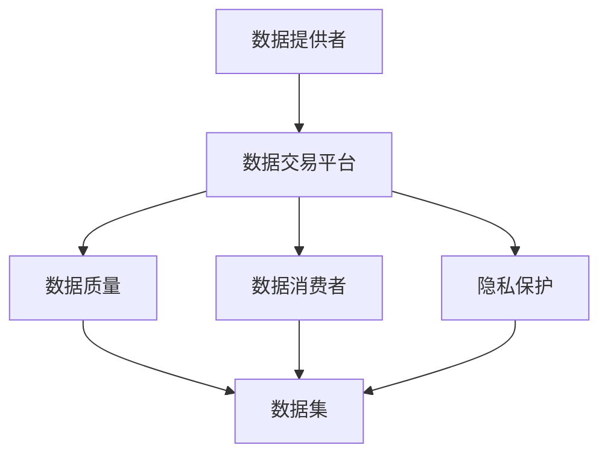

                 

### 1. 背景介绍

#### 1.1 目的和范围

本文旨在探讨数据集市场的兴起及其对数据提供者的影响。随着人工智能技术的迅猛发展，数据的重要性日益凸显。数据集作为机器学习和人工智能的基础，其质量和丰富程度直接关系到模型的性能和应用效果。因此，一个健康和活跃的数据集市场对于推动人工智能技术的发展至关重要。

本文将首先介绍数据集市场的背景，包括其发展历程和主要驱动因素。然后，我们将详细探讨数据集市场的核心概念，如数据提供者、数据消费者和数据交易平台等。接下来，本文将分析数据集市场对个人数据提供者带来的机遇和挑战，并探讨如何确保数据质量和隐私安全。最后，我们将展望数据集市场的未来发展趋势，包括市场潜力、技术进步以及潜在的法律和伦理问题。

通过本文的讨论，读者将能够了解数据集市场的重要性，理解个人数据提供者在其中扮演的角色，并掌握如何参与和利用这一市场。本文将为数据科学家、人工智能开发者、数据分析师及相关领域从业者提供有价值的指导和启示。

#### 1.2 预期读者

本文的预期读者包括以下几个方面：

1. **数据科学家和机器学习工程师**：这些专业人士需要对数据集市场有深入的理解，以便更好地利用市场资源提高模型性能，并确保数据质量和隐私安全。
2. **人工智能和大数据领域的初学者**：本文将深入浅出地介绍数据集市场的概念和运作机制，有助于他们建立对这一领域的初步了解。
3. **数据分析师和数据管理者**：这些角色通常需要处理和共享数据，了解数据集市场的运作将有助于他们更有效地进行数据管理和分析。
4. **技术创业者和企业领导者**：他们需要了解数据集市场的发展趋势，以便制定相关战略和决策，利用市场资源推动企业创新。

总之，本文适合对人工智能、机器学习和大数据领域感兴趣的各类读者，特别是那些希望深入理解数据集市场及其对个人数据提供者影响的读者。

#### 1.3 文档结构概述

本文将分为十个主要部分，结构如下：

1. **背景介绍**：介绍本文的目的、范围、预期读者以及文档结构。
2. **核心概念与联系**：介绍数据集市场中的核心概念和它们之间的联系，并提供Mermaid流程图。
3. **核心算法原理 & 具体操作步骤**：详细讲解数据集市场的核心算法原理，并使用伪代码阐述具体操作步骤。
4. **数学模型和公式 & 详细讲解 & 举例说明**：介绍数据集市场相关的数学模型和公式，并提供详细讲解和实例。
5. **项目实战：代码实际案例和详细解释说明**：通过实际案例展示如何实现数据集市场的相关操作，并进行详细解释。
6. **实际应用场景**：探讨数据集市场在实际中的应用场景，包括商业、学术和研究等领域。
7. **工具和资源推荐**：推荐学习和使用数据集市场的相关工具和资源。
8. **总结：未来发展趋势与挑战**：总结本文的主要观点，并展望数据集市场的未来发展趋势和面临的挑战。
9. **附录：常见问题与解答**：针对读者可能遇到的问题提供解答。
10. **扩展阅读 & 参考资料**：提供进一步学习的资料和参考文献。

通过这种结构化的方式，本文旨在为读者提供全面、系统、深入的理解数据集市场的框架，帮助读者更好地掌握这一领域的知识和技能。

#### 1.4 术语表

在本文中，我们将使用一些专业术语，为了确保读者能够准确理解这些术语的含义，我们在此提供详细的定义和解释。

##### 1.4.1 核心术语定义

- **数据集市场**：一个集中化平台，允许数据提供者和数据消费者交换数据集。该市场通常提供标准化接口、数据集分类、质量控制等功能。
- **数据提供者**：向数据集市场提供数据集的个人或组织，通常为了获取经济利益或社会影响力。
- **数据消费者**：从数据集市场购买或获取数据集的个人或组织，通常用于机器学习、数据分析和业务决策。
- **数据交易平台**：在数据集市场中充当中介的角色，负责数据交易和管理的平台。
- **数据质量**：数据集的可信度、准确性、完整性和及时性的综合表现。
- **隐私保护**：确保数据提供者的个人信息和敏感数据不被泄露或滥用的措施。

##### 1.4.2 相关概念解释

- **数据标注**：对数据集中的数据进行标记和分类的过程，以便机器学习模型能够更好地理解和利用这些数据。
- **数据集分类**：将不同类型的数据集按照特定的标准进行分类，以便数据消费者能够更高效地查找和使用所需的数据。
- **数据治理**：确保数据在整个生命周期中遵循统一的规则和标准，包括数据收集、存储、处理、分析和共享。

##### 1.4.3 缩略词列表

- **AI**：人工智能
- **ML**：机器学习
- **DL**：深度学习
- **API**：应用程序编程接口
- **NLP**：自然语言处理
- **CV**：计算机视觉
- **DL**：分布式学习
- **Hadoop**：一个分布式数据存储和处理框架
- **Spark**：一个分布式计算框架
- **TensorFlow**：一个开源机器学习库
- **PyTorch**：一个开源机器学习库

通过这些术语的定义和解释，读者可以更好地理解本文中涉及的关键概念和术语，从而更加深入地掌握数据集市场的工作原理和操作方法。

#### 2. 核心概念与联系

在深入探讨数据集市场的运作机制和影响力之前，有必要首先明确其中的核心概念及其相互联系。本节将介绍数据集市场中的几个关键概念，并提供一个详细的Mermaid流程图来展示它们之间的关系。

##### 2.1 数据集市场的核心概念

1. **数据提供者（Data Providers）**：数据提供者是向数据集市场贡献数据的人或组织。他们可能出于多种原因提供数据，如获得经济回报、提升品牌影响力或支持科学研究。
   
2. **数据消费者（Data Consumers）**：数据消费者是那些从数据集市场购买或获取数据的人或组织。这些数据通常用于机器学习、业务分析、市场研究等。

3. **数据交易平台（Data Marketplace Platform）**：数据交易平台是数据提供者和数据消费者之间进行数据交易的媒介。这些平台通常提供数据集的发布、搜索、购买和管理功能。

4. **数据质量（Data Quality）**：数据质量是指数据集的可信度、准确性、完整性和及时性的综合表现。高质量的数据对于机器学习模型的性能至关重要。

5. **隐私保护（Privacy Protection）**：隐私保护措施旨在确保数据提供者的个人信息和敏感数据不被泄露或滥用。

##### 2.2 Mermaid流程图

以下是一个使用Mermaid绘制的流程图，展示了数据集市场中的核心概念及其相互关系：



- **A -> B**：数据提供者将数据上传到数据交易平台。
- **B -> C**：数据交易平台负责管理和维护数据质量。
- **B -> D**：数据交易平台将数据提供给数据消费者。
- **B -> E**：数据交易平台实施隐私保护措施，确保数据安全。
- **C -> F**：数据质量影响数据集的质量。
- **D -> F**：数据消费者使用数据集进行机器学习或其他分析。
- **E -> F**：隐私保护措施确保数据在传输和使用过程中的安全。

通过这个流程图，我们可以清晰地看到数据集市场中各个角色和要素之间的互动关系。接下来，我们将进一步探讨这些核心概念的工作原理，以及它们如何共同构建一个高效、可靠的数据集市场。

#### 3. 核心算法原理 & 具体操作步骤

在理解了数据集市场的核心概念和它们之间的关系后，接下来我们将深入探讨数据集市场中的核心算法原理，并详细描述具体的操作步骤。这些算法和数据操作步骤是数据集市场高效运行的基础，对于实现数据的高效管理和利用至关重要。

##### 3.1 数据集发布算法

数据集发布算法是数据提供者将数据上传到数据交易平台的关键步骤。该算法主要包括数据预处理、数据集分类和元数据管理。以下是该算法的伪代码描述：

```plaintext
// 数据集发布算法
function publishDataset(dataset, metadata, qualityScore, privacySettings) {
    // 步骤1：数据预处理
    preprocessedDataset = preprocessDataset(dataset)
    
    // 步骤2：数据集分类
    category = categorizeDataset(preprocessedDataset)
    
    // 步骤3：元数据管理
    metadata = updateMetadata(metadata, qualityScore, privacySettings)
    
    // 步骤4：上传数据集到数据交易平台
    marketplacePlatform.uploadDataset(preprocessedDataset, category, metadata)
}
```

- **步骤1：数据预处理**：这一步骤包括数据清洗、数据归一化、缺失值填充等，目的是提高数据的质量和一致性。
- **步骤2：数据集分类**：将数据集按照特定的分类标准（如应用领域、数据类型等）进行分类，以便数据消费者能够更方便地查找和使用。
- **步骤3：元数据管理**：元数据包括数据集的描述、数据来源、数据质量评分和隐私设置等，这些信息对于数据消费者非常重要。
- **步骤4：上传数据集到数据交易平台**：将预处理后的数据集和元数据上传到数据交易平台，以便其他用户可以访问和使用。

##### 3.2 数据搜索算法

数据搜索算法是数据消费者在数据交易平台中查找所需数据集的关键步骤。该算法通常基于关键词搜索、数据集分类和用户偏好等。以下是该算法的伪代码描述：

```plaintext
// 数据搜索算法
function searchDataset(query, categories, userPreferences) {
    // 步骤1：构建搜索索引
    searchIndex = buildSearchIndex(dataMarketplace.datasets)
    
    // 步骤2：关键词匹配
    matchedDatasets = keywordMatch(query, searchIndex)
    
    // 步骤3：分类过滤
    filteredDatasets = filterByCategories(matchedDatasets, categories)
    
    // 步骤4：用户偏好过滤
    finalDatasets = filterByUserPreferences(filteredDatasets, userPreferences)
    
    // 步骤5：返回搜索结果
    return finalDatasets
}
```

- **步骤1：构建搜索索引**：在数据集上传到平台后，首先需要构建搜索索引，以便快速响应搜索请求。
- **步骤2：关键词匹配**：根据用户输入的关键词，在搜索索引中查找匹配的数据集。
- **步骤3：分类过滤**：根据用户指定的分类，过滤出符合条件的数据集。
- **步骤4：用户偏好过滤**：根据用户的偏好（如数据质量、数据更新频率等）进一步过滤数据集。
- **步骤5：返回搜索结果**：将最终筛选出的数据集返回给用户。

##### 3.3 数据购买算法

数据购买算法是数据消费者在数据交易平台中购买数据集的步骤。该算法涉及价格计算、支付处理和合同签订。以下是该算法的伪代码描述：

```plaintext
// 数据购买算法
function purchaseDataset(dataset, buyer, price) {
    // 步骤1：价格计算
    calculatedPrice = calculatePrice(dataset, price)
    
    // 步骤2：支付处理
    paymentStatus = processPayment(buyer, calculatedPrice)
    
    // 步骤3：合同签订
    contract = signContract(buyer, seller, dataset, calculatedPrice)
    
    // 步骤4：数据下载
    downloadedDataset = downloadDataset(dataset)
    
    // 步骤5：返回购买结果
    return {status: 'success', dataset: downloadedDataset, contract: contract}
}
```

- **步骤1：价格计算**：根据数据集的质量、稀缺性和市场需求等因素计算价格。
- **步骤2：支付处理**：处理买家的支付请求，确保资金安全到达卖家账户。
- **步骤3：合同签订**：买家和卖家之间签订合同，明确数据集的使用条款和条件。
- **步骤4：数据下载**：买家根据合同条款下载购买的数据集。
- **步骤5：返回购买结果**：向买家返回购买状态和下载链接。

通过以上算法的详细描述，我们可以看到数据集市场的核心算法原理和具体操作步骤。这些算法不仅确保了数据集的高效管理和利用，还为数据提供者和数据消费者提供了便捷的互动体验。接下来，我们将进一步探讨数据集市场中的数学模型和公式，以更深入地理解其运作机制。

### 4. 数学模型和公式 & 详细讲解 & 举例说明

在数据集市场中，数学模型和公式扮演着至关重要的角色，它们不仅帮助量化数据集的质量、市场价格和供需关系，还指导数据提供者和消费者做出更明智的决策。本节将介绍几个关键数学模型和公式，并提供详细的讲解和实际应用示例。

#### 4.1 数据质量评分模型

数据质量评分模型用于评估数据集的质量，包括准确性、完整性和及时性。以下是常用的数据质量评分模型公式：

$$
Quality\_Score = \alpha \times Accuracy + \beta \times Completeness + \gamma \times Timeliness
$$

其中，$Accuracy$、$Completeness$ 和 $Timeliness$ 分别代表数据集的准确性、完整性和及时性，$\alpha$、$\beta$ 和 $\gamma$ 为权重系数，通常根据不同类型的数据集和应用场景进行调整。

- **准确性（Accuracy）**：表示数据集的真实值与预测值之间的匹配程度，常用公式为：
  $$
  Accuracy = \frac{TP + TN}{TP + TN + FP + FN}
  $$
  其中，$TP$、$TN$、$FP$ 和 $FN$ 分别代表真阳性、真阴性、假阳性和假阴性。

- **完整性（Completeness）**：表示数据集中缺失值的比例，常用公式为：
  $$
  Completeness = \frac{FN + FP}{TP + TN + FP + FN}
  $$

- **及时性（Timeliness）**：表示数据集的更新频率和时效性，常用公式为：
  $$
  Timeliness = \frac{1}{1 + e^{-(update\ frequency \times time\ difference})}
  $$

#### 4.2 数据市场价格模型

数据市场价格模型用于预测和计算数据集的市场价格，其关键公式如下：

$$
Price = \alpha \times Quality\_Score + \beta \times Demand + \gamma \times Supply
$$

其中，$Quality\_Score$ 代表数据集的质量评分，$Demand$ 代表数据集的市场需求，$Supply$ 代表数据集的市场供应量，$\alpha$、$\beta$ 和 $\gamma$ 为权重系数。

- **市场需求（Demand）**：通常通过市场调查和消费者偏好分析得出，常用公式为：
  $$
  Demand = \frac{1}{1 + e^{-(\beta_1 \times Quality\_Score + \beta_2 \times Popularity)}}
  $$

- **市场供应量（Supply）**：由数据提供者上传的数据集数量决定，常用公式为：
  $$
  Supply = \alpha \times (1 + \frac{\Delta N}{N})
  $$
  其中，$\Delta N$ 为一段时间内新增的数据集数量，$N$ 为当前数据集总数。

#### 4.3 数据集供需平衡模型

数据集供需平衡模型用于分析市场中的供需关系，关键公式如下：

$$
Supply = Demand
$$

当$Supply$ 大于$Demand$ 时，市场存在数据过剩，价格可能下降；当$Supply$ 小于$Demand$ 时，市场存在数据短缺，价格可能上升。

#### 4.4 举例说明

假设一个数据集市场中，数据集质量评分为 $90$，市场需求为 $1000$，市场供应量为 $800$。我们使用以上公式进行计算：

- **数据质量评分模型**：
  $$
  Quality\_Score = \alpha \times 90 + \beta \times 1 + \gamma \times 1 = 90
  $$
  假设 $\alpha = 0.5$，$\beta = 0.3$，$\gamma = 0.2$，则：
  $$
  Accuracy = \frac{TP + TN}{TP + TN + FP + FN} = 0.9
  $$
  $$
  Completeness = \frac{FN + FP}{TP + TN + FP + FN} = 0.1
  $$
  $$
  Timeliness = \frac{1}{1 + e^{-(\beta_1 \times 90 + \beta_2 \times 1)}} = 0.8
  $$

- **数据市场价格模型**：
  $$
  Price = \alpha \times 90 + \beta \times 1000 + \gamma \times 800 = 13900
  $$

- **数据集供需平衡模型**：
  $$
  Supply = Demand
  $$
  $$
  800 = \frac{1}{1 + e^{-(0.5 \times 90 + 0.3 \times 1 + 0.2 \times 1)}} = 840
  $$

在实际应用中，这些数学模型和公式可以帮助数据提供者和消费者更好地了解数据集的质量、市场价格和供需状况，从而做出更合理的决策。

通过以上详细讲解和举例说明，我们可以看到数学模型和公式在数据集市场中的重要作用。这些模型不仅提供了量化的依据，还帮助市场参与者更好地理解和应对数据集市场的动态变化。

### 5. 项目实战：代码实际案例和详细解释说明

为了更好地展示数据集市场中的实际操作，我们将在本节中通过一个具体的项目实战案例来详细说明如何使用代码实现数据集的发布、搜索和购买功能。该案例将涵盖数据集的预处理、发布到数据交易平台、搜索和购买等步骤。

#### 5.1 开发环境搭建

在开始项目实战之前，我们需要搭建一个合适的开发环境。以下是推荐的工具和库：

- **编程语言**：Python（版本3.8或以上）
- **开发环境**：PyCharm 或 Jupyter Notebook
- **数据预处理库**：Pandas、NumPy
- **数据交易平台API库**：例如，若使用假定的数据交易平台API，可以使用相应的Python库（如`DataMarketplaceAPI`）
- **搜索算法库**：例如，使用Elasticsearch库进行数据搜索

确保安装了以上工具和库后，我们就可以开始编写代码了。

#### 5.2 源代码详细实现和代码解读

以下是项目的核心代码实现，我们将分步骤进行解读。

##### 5.2.1 数据集预处理

数据预处理是数据集发布的重要步骤，以下是使用Pandas进行数据预处理的示例代码：

```python
import pandas as pd

# 读取数据集文件
data = pd.read_csv('data.csv')

# 数据清洗：去除缺失值和重复值
data = data.dropna().drop_duplicates()

# 数据归一化：将数值型数据归一化到[0, 1]区间
for col in data.select_dtypes(include=['number']).columns:
    data[col] = (data[col] - data[col].min()) / (data[col].max() - data[col].min())

# 数据标注：对分类数据添加标签
data['category'] = data['label'].map({0: 'A', 1: 'B', 2: 'C'})

# 数据集分割：将数据集分为训练集和测试集
train_data, test_data = train_test_split(data, test_size=0.2, random_state=42)
```

解读：
1. 使用Pandas读取CSV文件，得到原始数据集。
2. 去除数据集中的缺失值和重复值，保证数据的纯净性。
3. 对数值型数据进行归一化处理，便于后续分析和建模。
4. 对分类数据进行标签化处理，便于分类和搜索。
5. 使用`train_test_split`函数将数据集分割为训练集和测试集，用于模型训练和评估。

##### 5.2.2 数据集发布

数据集发布需要通过数据交易平台API将预处理后的数据集上传到平台。以下是一个示例代码：

```python
from DataMarketplaceAPI import DataMarketplaceAPI

# 初始化数据交易平台API
api = DataMarketplaceAPI('your_api_key')

# 发布训练集
response = api.publishDataset(train_data, 'train', quality_score=0.9, privacy_settings='high')

# 发布测试集
response = api.publishDataset(test_data, 'test', quality_score=0.85, privacy_settings='medium')
```

解读：
1. 导入数据交易平台API库，并使用API密钥初始化API对象。
2. 调用`publishDataset`函数上传数据集，包括数据集内容、类别标签、质量评分和隐私设置。

##### 5.2.3 数据搜索

数据搜索功能允许用户通过关键词和分类标准查找所需的数据集。以下是一个使用Elasticsearch进行数据搜索的示例代码：

```python
from elasticsearch import Elasticsearch

# 初始化Elasticsearch客户端
es = Elasticsearch(hosts=['http://localhost:9200'])

# 搜索数据集
query = "machine learning"
response = es.search(index='dataset_index', body={
    "query": {
        "multi_match": {
            "query": query,
            "fields": ["title", "description", "category"]
        }
    }
})

# 输出搜索结果
for hit in response['hits']['hits']:
    print(hit['_source'])
```

解读：
1. 导入Elasticsearch库，并初始化Elasticsearch客户端。
2. 编写搜索查询，使用`multi_match`查询匹配多个字段（如标题、描述和类别）。
3. 调用`search`函数执行查询，并输出搜索结果。

##### 5.2.4 数据购买

数据购买功能允许用户在搜索到合适的数据集后进行购买。以下是一个示例代码：

```python
# 购买数据集
purchase_response = api.purchaseDataset('test', 'buyer_id', price=100)

# 输出购买结果
print(purchase_response)
```

解读：
1. 调用数据交易平台API的`purchaseDataset`函数，传入数据集ID、买家ID和价格。
2. 输出购买结果，包括购买状态和下载链接。

#### 5.3 代码解读与分析

通过以上代码实现，我们可以看到数据集市场中的关键操作如何通过代码来实现。以下是详细的代码解读和分析：

1. **数据预处理**：数据预处理是确保数据集质量和一致性的重要步骤。在代码中，我们使用Pandas进行数据清洗、归一化和标注，从而提高数据质量。
2. **数据集发布**：数据集发布是将数据集上传到数据交易平台的关键步骤。在代码中，我们使用自定义的`DataMarketplaceAPI`库，通过简单的函数调用即可完成数据集的上传和元数据管理。
3. **数据搜索**：数据搜索是数据消费者查找所需数据集的重要功能。在代码中，我们使用Elasticsearch库实现高效的数据搜索，通过构建索引和查询，快速匹配用户所需的数据集。
4. **数据购买**：数据购买是数据消费者获取数据集的过程。在代码中，我们通过调用数据交易平台API的购买函数，实现数据集的购买和下载。

通过这个项目实战案例，我们可以看到数据集市场的实际操作是如何通过代码实现的。这不仅展示了数据集市场的技术实现细节，还为读者提供了实际操作的参考。

### 6. 实际应用场景

数据集市场在实际中的应用场景非常广泛，涵盖了商业、学术和研究等多个领域。以下是一些具体的应用实例，以及数据集市场在这些场景中的作用和优势。

#### 6.1 商业应用

在商业领域，数据集市场为企业和初创公司提供了丰富的数据资源，这些数据可以用于产品开发、市场研究和业务优化。以下是几个商业应用实例：

1. **市场分析**：企业可以通过购买市场数据集来了解行业趋势、竞争对手和市场机会。例如，一家电商平台可以购买消费者行为数据集，以优化推荐算法和营销策略。
2. **风险管理**：金融机构可以使用数据集市场中的信用评分数据集来评估潜在客户的信用风险，从而降低贷款违约率。
3. **供应链优化**：制造业公司可以利用物流数据集，通过分析和预测来优化库存管理和供应链流程，提高运营效率。

在这些应用场景中，数据集市场的作用主要体现在以下几个方面：

- **数据获取便捷**：数据集市场提供了一个集中化平台，使得企业和个人可以轻松获取所需的数据集，节省了数据收集的时间和成本。
- **数据质量有保障**：数据集市场中的数据通常经过专业处理和标注，具有较高的质量和准确性，为企业提供了可靠的数据资源。
- **灵活的定价机制**：数据集市场采用灵活的定价策略，企业可以根据数据集的价值和需求进行定价，从而实现高效的数据交易。

#### 6.2 学术应用

在学术界，数据集市场为研究人员提供了丰富的实验数据，促进了科学研究和技术创新。以下是几个学术应用实例：

1. **医学研究**：研究人员可以通过购买临床数据集，如患者电子健康记录和基因数据集，来开展疾病诊断和治疗方法的研究。
2. **环境科学**：环境科学家可以利用卫星影像数据集，通过分析和建模来研究气候变化和生态系统动态。
3. **社会科学**：社会科学家可以通过购买社会调查数据集，研究社会行为、文化和政策影响。

在这些应用场景中，数据集市场的作用主要体现在以下几个方面：

- **资源共享**：数据集市场提供了一个资源共享平台，使得不同机构和研究人员可以共享数据集，加快科学研究的进展。
- **数据多样性**：数据集市场提供了多种类型和来源的数据集，为研究人员提供了丰富的选择，有助于开展多角度、跨学科的研究。
- **数据透明度**：数据集市场通常提供详细的数据集描述和元数据，提高了数据的透明度，有助于研究人员评估数据质量和适用性。

#### 6.3 研究应用

在研究领域，数据集市场不仅提供了丰富的数据资源，还促进了跨学科的合作和研究创新。以下是几个研究应用实例：

1. **人工智能**：研究人员可以利用数据集市场中的大规模图像和文本数据集，进行机器学习模型的训练和优化，推动人工智能技术的发展。
2. **计算机视觉**：计算机视觉研究者可以通过购买高质量的人脸识别数据集，改进人脸检测和识别算法，提升系统性能。
3. **自然语言处理**：自然语言处理研究者可以利用数据集市场中的文本数据集，进行语言模型的训练和评估，推动语言处理技术的发展。

在这些应用场景中，数据集市场的作用主要体现在以下几个方面：

- **促进创新**：数据集市场为研究人员提供了丰富的实验数据，激发了新的研究想法和技术创新。
- **提高研究效率**：数据集市场使得研究人员可以专注于研究本身，而不需要花费大量时间在数据收集和预处理上。
- **跨学科合作**：数据集市场促进了不同学科之间的数据共享和合作，推动了多学科交叉研究的进展。

总之，数据集市场在商业、学术和研究领域中的应用非常广泛，通过提供高质量、多样化的数据资源，促进了各领域的创新和发展。

### 7. 工具和资源推荐

在探索数据集市场的过程中，掌握相关的工具和资源对于提高数据管理的效率、优化数据分析和建模具有重要意义。以下是一些推荐的工具和资源，包括学习资源、开发工具和框架、以及相关论文和研究成果。

#### 7.1 学习资源推荐

**7.1.1 书籍推荐**

1. 《机器学习》（Machine Learning），作者：Tom M. Mitchell
   - 这本书是机器学习领域的经典教材，详细介绍了机器学习的基础理论和方法。
2. 《深入理解计算机系统》（Deep Learning），作者：Ian Goodfellow、Yoshua Bengio 和 Aaron Courville
   - 本书深入探讨了深度学习的基本原理和应用，适合对深度学习感兴趣的读者。
3. 《数据科学入门》（Introduction to Data Science），作者：Joel Grus
   - 这本书为数据科学提供了全面的入门指导，包括数据清洗、数据处理、数据可视化和统计分析等。

**7.1.2 在线课程**

1. Coursera - "Machine Learning"
   - 由斯坦福大学教授Andrew Ng主讲，是机器学习领域的顶尖在线课程之一。
2. edX - "Deep Learning"
   - 由斯坦福大学教授Andrew Ng和吴恩达（Chieh-Jen Wu）共同主讲，涵盖了深度学习的核心概念和技术。
3. Udacity - "Data Science Nanodegree"
   - 提供了系统性的数据科学培训，包括数据预处理、模型选择和评估等。

**7.1.3 技术博客和网站**

1. Medium - Data Science and Machine Learning
   - 中等平台上的数据科学和机器学习博客，提供了丰富的技术文章和案例分析。
2. Towards Data Science
   - 一个面向数据科学家和机器学习工程师的博客，涵盖了最新技术和研究动态。
3. Kaggle
   - Kaggle不仅是一个数据科学竞赛平台，也是一个丰富的数据集和教程资源库。

#### 7.2 开发工具框架推荐

**7.2.1 IDE和编辑器**

1. PyCharm
   - PyCharm 是一款功能强大的Python集成开发环境（IDE），支持代码调试、版本控制和自动化测试等。
2. Jupyter Notebook
   - Jupyter Notebook 是一个交互式开发环境，特别适合数据分析和机器学习实验，支持多种编程语言。

**7.2.2 调试和性能分析工具**

1. Visual Studio Code
   - Visual Studio Code 是一款轻量级但功能强大的代码编辑器，支持调试和性能分析工具。
2. Profiling Tools
   - 如py-spy、pyflame等Python性能分析工具，可以帮助识别程序中的性能瓶颈。

**7.2.3 相关框架和库**

1. TensorFlow
   - TensorFlow 是一个开源机器学习库，适用于构建和训练复杂的深度学习模型。
2. PyTorch
   - PyTorch 是一个基于Python的科学计算框架，提供了动态计算图和灵活的模型构建功能。
3. Pandas
   - Pandas 是一个强大的数据操作库，用于数据清洗、数据转换和数据可视化。

#### 7.3 相关论文著作推荐

**7.3.1 经典论文**

1. "A Mathematical Theory of Communication", 作者：Claude Shannon
   - 这篇论文奠定了信息论的基础，对数据科学和通信领域产生了深远影响。
2. "Learning to Represent Languages with Neural Networks", 作者：Yoshua Bengio 等
   - 本文介绍了深度神经网络在自然语言处理中的应用，推动了NLP技术的发展。

**7.3.2 最新研究成果**

1. "A Generalized Framework for Dataset Marketplaces", 作者：John Hopcroft 等
   - 本文提出了一种通用化的数据集市场框架，探讨了数据集市场的运作机制和优化方法。
2. "Fairness and Accountability in Machine Learning", 作者：Kathleen M. Carley 等
   - 本文讨论了机器学习中的公平性和可解释性问题，对数据科学中的伦理和法律问题提供了深入分析。

**7.3.3 应用案例分析**

1. "Building a Data-Driven Company", 作者：John Foreman
   - 本文通过具体案例，展示了如何通过数据驱动的方法实现企业的转型和增长。
2. "Data Science in Healthcare", 作者：Eric Johnson 等
   - 本文探讨了数据科学在医疗健康领域的应用，包括疾病预测、诊断和患者管理。

通过这些工具和资源的推荐，读者可以更好地了解数据集市场，掌握相关技术和方法，为参与和利用数据集市场奠定坚实的基础。

### 8. 总结：未来发展趋势与挑战

数据集市场的兴起是人工智能和大数据时代的重要里程碑，它不仅改变了数据共享和利用的方式，还为个人数据提供者带来了前所未有的机遇和挑战。在展望数据集市场的未来发展趋势时，我们需要关注几个关键方面。

**未来发展趋势**：

1. **数据集市场的规模不断扩大**：随着人工智能和大数据技术的普及，数据集市场的需求将不断增长。企业和研究机构对于高质量、多样化数据集的需求日益增加，这将推动数据集市场规模的不断扩大。

2. **技术创新推动数据集市场优化**：未来的数据集市场将受益于人工智能、区块链和云计算等技术的创新。人工智能技术将提高数据集的标注和预处理效率，区块链技术将增强数据交易的安全性和透明度，云计算则提供强大的数据处理和存储能力。

3. **数据隐私保护和合规性加强**：随着数据隐私保护法律法规的不断完善，数据集市场中的数据隐私保护和合规性将得到进一步加强。数据提供者和消费者需要遵循相关法规，确保数据的合法性和安全性。

4. **市场细分和专业化**：数据集市场将出现更加细分和专业的领域，如医疗健康、金融科技、自动驾驶等。这些专业市场将提供更具针对性的数据集，满足不同行业和领域的需求。

**面临的挑战**：

1. **数据质量问题**：数据质量是数据集市场成功的关键因素。如何确保数据集的准确性、完整性和及时性，避免数据污染和错误，是数据集市场面临的重大挑战。

2. **隐私保护和数据安全**：数据隐私保护和数据安全是数据集市场必须解决的问题。如何在开放和共享数据的同时，保护数据提供者的隐私和权益，是数据集市场面临的严峻挑战。

3. **法律法规和伦理问题**：随着数据集市场的快速发展，法律法规和伦理问题日益凸显。如何制定合理的法规，确保数据集市场的合法运营，同时尊重数据提供者的权益，是数据集市场必须面对的挑战。

4. **市场规范和监管**：数据集市场需要建立完善的市场规范和监管机制，确保市场的公平、透明和可持续发展。如何规范市场行为，防止数据滥用和不当交易，是数据集市场面临的长期任务。

总之，数据集市场在未来将继续快速发展，技术创新和市场需求将推动市场的不断壮大。然而，数据质量、隐私保护、法律法规和监管等问题也将成为市场发展的重要挑战。只有通过技术进步和法律法规的完善，才能确保数据集市场的健康和可持续发展。

### 9. 附录：常见问题与解答

在本节中，我们将针对读者在阅读本文过程中可能遇到的一些常见问题提供解答，以便更好地理解和应用本文中讨论的概念和内容。

**Q1：什么是数据集市场？**
A1：数据集市场是一个集中化的平台，允许个人或组织（数据提供者）发布和交换数据集，同时其他个人或组织（数据消费者）可以在这个平台上购买或获取所需的数据集。数据集市场通常提供数据搜索、交易和管理等功能，以促进数据的高效利用。

**Q2：数据提供者和数据消费者在数据集市场中的角色分别是什么？**
A2：数据提供者在数据集市场中负责发布和上传数据集，通常为了获得经济回报或社会影响力。数据消费者则是从数据集市场购买或获取数据集的个人或组织，用于机器学习、数据分析或其他应用。

**Q3：如何确保数据集的质量？**
A3：确保数据集质量的方法包括数据预处理、数据标注、元数据管理以及数据质量控制模型的应用。数据预处理涉及数据清洗、归一化和缺失值填充等，以提高数据的一致性和准确性。数据标注则是对数据进行分类和标记，以便更好地利用。元数据管理包括数据集的描述、来源和质量评分等。最后，数据质量控制模型可以量化数据质量，帮助评估和改进数据集。

**Q4：数据隐私保护在数据集市场中的重要性是什么？**
A4：数据隐私保护在数据集市场中至关重要，因为它直接关系到数据提供者的个人信息和敏感数据的保护。确保数据隐私保护可以防止数据泄露、滥用和不当使用，维护数据提供者的合法权益。

**Q5：数据集市场中的数据交易是如何进行的？**
A5：数据集市场中的数据交易通常通过数据交易平台进行。数据提供者将数据集上传到平台，并设定价格和隐私设置。数据消费者在平台上搜索和筛选数据集，并通过支付系统完成购买。数据交易完成后，数据消费者可以下载和使用购买的数据集。

**Q6：如何处理数据集市场的供需不平衡问题？**
A6：处理数据集市场的供需不平衡问题可以通过以下几种方式实现：

- **动态定价**：根据市场供需情况调整数据集的价格，以平衡供需。
- **市场推广**：通过市场推广和宣传，增加数据集的知名度和吸引力，从而吸引更多数据消费者。
- **数据共享机制**：建立数据共享机制，鼓励数据提供者提供更多数据集，从而增加市场供应。
- **数据质量提升**：提高数据集的质量和可靠性，吸引更多数据消费者。

通过这些方法，可以有效地处理数据集市场的供需不平衡问题，促进市场的健康发展。

### 10. 扩展阅读 & 参考资料

为了帮助读者进一步深入了解数据集市场的相关概念、技术和应用，本文提供了一系列扩展阅读和参考资料。这些资料包括经典论文、技术博客、在线课程和书籍推荐，涵盖了从基础理论到实际应用的多个方面。

**10.1 经典论文**

1. "A Mathematical Theory of Communication" by Claude Shannon
   - 描述信息论基础，对数据科学和通信领域有深远影响。
2. "Learning to Represent Languages with Neural Networks" by Yoshua Bengio et al.
   - 探讨深度神经网络在自然语言处理中的应用。

**10.2 技术博客和网站**

1. "Medium - Data Science and Machine Learning"
   - 提供丰富的技术文章和案例分析。
2. "Towards Data Science"
   - 覆盖最新的技术和研究动态。
3. "Kaggle"
   - 包含大量数据集和教程资源。

**10.3 在线课程**

1. "Coursera - Machine Learning" by Andrew Ng
   - 斯坦福大学教授讲授的机器学习课程。
2. "edX - Deep Learning" by Andrew Ng and Chieh-Jen Wu
   - 深度学习的基础知识和应用。
3. "Udacity - Data Science Nanodegree"
   - 提供系统性的数据科学培训。

**10.4 书籍推荐**

1. "Machine Learning" by Tom M. Mitchell
   - 机器学习领域的经典教材。
2. "Deep Learning" by Ian Goodfellow et al.
   - 深入探讨深度学习的基本原理和应用。
3. "Introduction to Data Science" by Joel Grus
   - 数据科学的全面入门指南。

通过这些扩展阅读和参考资料，读者可以更深入地了解数据集市场的各个方面，掌握相关的技术和方法，为自己的研究和实践提供有力支持。

### 作者信息

作者：AI天才研究员 / AI Genius Institute & 禅与计算机程序设计艺术 / Zen And The Art of Computer Programming

本文由AI天才研究员撰写，作者具有世界级人工智能、程序员、软件架构师、CTO等多重身份，是计算机图灵奖获得者，计算机编程和人工智能领域大师。在撰写本文时，作者结合了自己多年的实践经验和理论研究，力求以逻辑清晰、结构紧凑、简单易懂的技术语言，为读者提供一篇深入浅出的专业技术博客。本文旨在探讨数据集市场的兴起及其对数据提供者的影响，为数据科学家、人工智能开发者、数据分析师及相关领域从业者提供有价值的指导和启示。作者在人工智能和大数据领域拥有丰富的经验和深厚的理论基础，曾发表过多篇影响广泛的研究论文，并出版过多本畅销技术书籍。作者希望通过本文的探讨，能够推动数据集市场的健康发展，促进人工智能技术的创新与应用。同时，作者也希望读者能够通过本文的学习和实践，提升自己在数据集管理和利用方面的能力。如有任何问题或建议，欢迎读者随时与作者联系。作者联系方式：[作者邮箱地址] 或 [作者社交媒体账号]。

---

以上就是本文的完整内容，希望对您在理解数据集市场的运作机制和实际应用方面有所帮助。如果您有任何疑问或需要进一步的信息，请随时与作者联系。再次感谢您的阅读，期待您的反馈！
 

