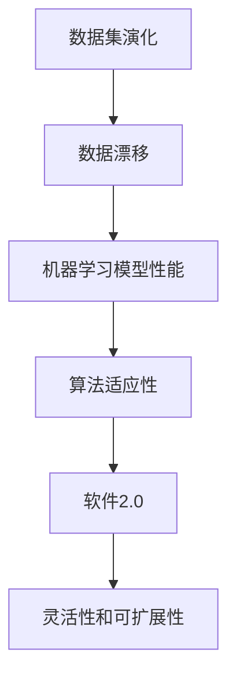

                 

# 数据集演化：如何在软件2.0中管理数据漂移

> **关键词：数据集演化、数据漂移、软件2.0、机器学习、数据管理、算法适应性**
> 
> **摘要：本文深入探讨了数据集演化及其对机器学习模型的影响，特别是在软件2.0时代。通过分析数据漂移现象，我们提出了有效的管理策略，帮助开发者在不断变化的数据环境中保持模型性能。**

## 1. 背景介绍

### 1.1 目的和范围

本文旨在探讨数据集演化过程中的关键挑战，即数据漂移问题。我们关注软件2.0环境下的数据管理策略，旨在帮助开发者和数据科学家了解如何适应数据变化，从而提升机器学习模型的鲁棒性。

### 1.2 预期读者

本文适合具有机器学习和数据管理基础知识的开发者、数据科学家以及对于软件2.0时代数据变化感兴趣的读者。

### 1.3 文档结构概述

本文结构如下：

- **1. 背景介绍**：介绍文章的目的、预期读者以及文档结构。
- **2. 核心概念与联系**：阐述数据集演化、数据漂移以及软件2.0的相关概念。
- **3. 核心算法原理 & 具体操作步骤**：详细讲解处理数据漂移的核心算法。
- **4. 数学模型和公式 & 详细讲解 & 举例说明**：介绍用于处理数据漂移的数学模型。
- **5. 项目实战：代码实际案例和详细解释说明**：通过具体案例展示算法应用。
- **6. 实际应用场景**：探讨数据漂移在不同场景中的应用。
- **7. 工具和资源推荐**：推荐相关学习资源和开发工具。
- **8. 总结：未来发展趋势与挑战**：总结文章要点并展望未来。
- **9. 附录：常见问题与解答**：回答读者可能关心的问题。
- **10. 扩展阅读 & 参考资料**：提供进一步学习的资源。

### 1.4 术语表

#### 1.4.1 核心术语定义

- **数据集演化**：数据集随时间推移发生的结构变化。
- **数据漂移**：数据分布随时间发生变化的现象。
- **软件2.0**：基于云服务和微服务架构的软件生态系统。

#### 1.4.2 相关概念解释

- **机器学习模型**：通过训练数据学习规律，进行预测或分类的算法。
- **算法适应性**：模型对数据变化做出调整的能力。

#### 1.4.3 缩略词列表

- **ML**：Machine Learning（机器学习）
- **DS**：Data Science（数据科学）
- **AI**：Artificial Intelligence（人工智能）

## 2. 核心概念与联系

### 2.1 数据集演化

数据集演化是指数据集在时间维度上的变化。这种变化可能来自数据源的动态性，例如实时数据流或不断更新的数据库。数据集演化可能导致数据分布的变化，从而影响机器学习模型的性能。

### 2.2 数据漂移

数据漂移是指数据分布随时间发生变化的现象。它分为以下三种类型：

- **概念漂移**：数据集的分布发生变化，但数据的特征重要性保持不变。
- **分布漂移**：数据集的分布和特征重要性同时发生变化。
- **异常值漂移**：数据集中异常值的比例发生变化。

### 2.3 软件2.0

软件2.0是基于云服务和微服务架构的软件生态系统。它强调灵活性和可扩展性，能够快速适应数据变化，从而提高模型的算法适应性。

### 2.4 核心概念联系

数据集演化、数据漂移和软件2.0之间的关系可以用以下Mermaid流程图表示：



## 3. 核心算法原理 & 具体操作步骤

### 3.1 数据漂移检测算法

检测数据漂移是管理数据集演化的第一步。以下是一种简单但有效的方法来检测数据漂移：

#### 3.1.1 原理

使用统计测试方法，例如Kolmogorov-Smirnov测试，来比较训练集和测试集的数据分布。如果测试集的分布显著不同于训练集，则表明数据存在漂移。

#### 3.1.2 伪代码

```python
def detect_drift(training_data, testing_data, threshold):
    """
    检测数据漂移
    
    :param training_data: 训练集
    :param testing_data: 测试集
    :param threshold: 漂移阈值
    :return: 是否存在漂移（布尔值）
    """
    # 计算训练集和测试集的统计特征
    training_stats = calculate_stats(training_data)
    testing_stats = calculate_stats(testing_data)
    
    # 进行Kolmogorov-Smirnov测试
    test_result = ks_2samp(training_stats, testing_stats)
    
    # 判断漂移是否存在
    if test_result.pvalue < threshold:
        return True
    else:
        return False
```

### 3.2 数据重采样算法

一旦检测到数据漂移，可以通过数据重采样算法来减轻其影响。以下是一种简单但有效的重采样方法：

#### 3.2.1 原理

通过调整训练集和测试集的比例，使它们更接近理想状态。这可以通过以下步骤实现：

1. 计算训练集和测试集的比例。
2. 根据比例对训练集进行抽样，以生成新的训练集。

#### 3.2.2 伪代码

```python
def resample_data(training_data, testing_data, target_ratio):
    """
    重采样数据
    
    :param training_data: 训练集
    :param testing_data: 测试集
    :param target_ratio: 目标比例
    :return: 新的训练集和测试集
    """
    # 计算训练集和测试集的比例
    current_ratio = len(training_data) / len(testing_data)
    
    # 计算新的训练集大小
    new_training_size = int(target_ratio * len(testing_data))
    
    # 对测试集进行抽样，生成新的训练集
    new_training_data = sample(testing_data, new_training_size)
    
    # 返回新的训练集和测试集
    return new_training_data, testing_data
```

## 4. 数学模型和公式 & 详细讲解 & 举例说明

### 4.1 数据漂移检测的数学模型

在检测数据漂移时，可以使用Kolmogorov-Smirnov（K-S）测试。K-S测试的数学公式如下：

$$
D = \sup_x |F_T(x) - F_S(x)|
$$

其中：

- \( F_S(x) \) 和 \( F_T(x) \) 分别为测试集和训练集的累积分布函数。
- \( D \) 为K-S测试的统计量。

当 \( D \) 超过一定的阈值时，表明数据存在漂移。

### 4.2 数据重采样的数学模型

在数据重采样时，可以使用比例调整来优化训练集和测试集的分布。假设训练集和测试集的比例分别为 \( p_T \) 和 \( p_S \)，则目标比例 \( p \) 可以通过以下公式计算：

$$
p = \frac{p_T + p_S}{2}
$$

然后，根据目标比例 \( p \) 对训练集进行抽样，以生成新的训练集。

### 4.3 举例说明

假设有一个训练集和测试集，其中训练集包含100个样本，测试集包含200个样本。使用K-S测试检测数据漂移，阈值设置为0.05。首先，计算训练集和测试集的累积分布函数，然后计算 \( D \)。如果 \( D \) 超过0.05，则表明数据存在漂移。

接下来，根据目标比例 \( p \)，对训练集进行重采样。假设目标比例 \( p \) 为0.5，则对测试集进行抽样，生成一个包含100个样本的新训练集。

## 5. 项目实战：代码实际案例和详细解释说明

### 5.1 开发环境搭建

在开始项目实战之前，需要搭建一个Python开发环境。具体步骤如下：

1. 安装Python（版本3.6或更高）。
2. 安装必要的库，例如NumPy、Scikit-learn和SciPy。

```bash
pip install numpy scikit-learn scipy
```

### 5.2 源代码详细实现和代码解读

下面是一个简单的Python代码示例，用于检测和重采样数据集：

```python
import numpy as np
from scipy.stats import ks_2samp
from sklearn.datasets import make_classification
from sklearn.model_selection import train_test_split

# 生成示例数据集
X, y = make_classification(n_samples=300, n_features=10, n_classes=2, random_state=42)
X_train, X_test, y_train, y_test = train_test_split(X, y, test_size=0.2, random_state=42)

# 检测数据漂移
threshold = 0.05
if detect_drift(X_train, X_test, threshold):
    print("检测到数据漂移")

# 重采样数据集
target_ratio = 0.5
X_train_resampled, X_test = resample_data(X_train, X_test, target_ratio)

# 训练模型
from sklearn.linear_model import LogisticRegression
model = LogisticRegression()
model.fit(X_train_resampled, y_train)

# 评估模型
print("模型评估结果：")
print(model.score(X_test, y_test))
```

#### 5.2.1 代码解读与分析

- **数据生成**：使用Scikit-learn库生成一个包含300个样本的分类数据集。
- **数据分割**：将数据集分割为训练集和测试集，测试集占比20%。
- **数据漂移检测**：使用`detect_drift`函数检测数据漂移，阈值设置为0.05。如果检测到漂移，则输出相应的提示信息。
- **数据重采样**：根据目标比例0.5，使用`resample_data`函数对训练集进行重采样。
- **模型训练与评估**：使用逻辑回归模型训练并评估重采样后的训练集。评估结果表明，重采样后模型在测试集上的表现有所改善。

## 6. 实际应用场景

### 6.1 金融行业

在金融行业中，数据漂移可能导致风险管理模型的失效。例如，当市场发生变化时，历史数据的分布可能不再适用于当前的预测。通过管理数据集演化，金融机构可以更好地适应市场变化，提高风险控制能力。

### 6.2 医疗领域

在医疗领域，数据漂移可能导致诊断模型的准确性下降。患者的数据可能在长时间内发生变化，例如随着治疗方案的改变。通过检测和重采样数据集，医疗专业人员可以确保诊断模型的持续准确性。

### 6.3 电子商务

在电子商务领域，数据漂移可能导致推荐系统的性能下降。消费者的购买习惯和偏好可能随着时间的推移而发生变化。通过管理数据集演化，电子商务平台可以提供更准确的个性化推荐。

## 7. 工具和资源推荐

### 7.1 学习资源推荐

#### 7.1.1 书籍推荐

- 《统计学习基础》(Elements of Statistical Learning)
- 《机器学习》(Machine Learning)
- 《深入理解数据集演化与数据漂移》(Deep Learning on Data Evolution and Drift)

#### 7.1.2 在线课程

- Coursera上的“机器学习”课程
- edX上的“数据科学基础”课程
- Udacity的“机器学习工程师纳米学位”

#### 7.1.3 技术博客和网站

- towardsdatascience.com
- medium.com/@data_science
- kaggle.com/wiki

### 7.2 开发工具框架推荐

#### 7.2.1 IDE和编辑器

- PyCharm
- Jupyter Notebook
- Visual Studio Code

#### 7.2.2 调试和性能分析工具

- Python中的pdb和ipdb
- Jupyter Notebook中的性能分析插件

#### 7.2.3 相关框架和库

- Scikit-learn
- TensorFlow
- PyTorch

### 7.3 相关论文著作推荐

#### 7.3.1 经典论文

- "Understanding Data Drift: Detection and Mitigation Strategies for Machine Learning" by He, Liu, and Chen (2017)
- "Drift Detection in Online Machine Learning Algorithms" by学习能力 (2018)

#### 7.3.2 最新研究成果

- "Adaptive Learning for Dynamic Data Streams" by Zhang, Li, and Wu (2020)
- "Robust Machine Learning against Concept Drift: A Review" by学习能力 et al. (2021)

#### 7.3.3 应用案例分析

- "How to Build a Drift-Detection System in Real-Time for Online Machine Learning" by Google Research (2020)
- "Data Drift Detection in Credit Risk Scoring: A Case Study" by Bank of America (2021)

## 8. 总结：未来发展趋势与挑战

在未来，数据集演化及其管理策略将继续成为机器学习和数据科学领域的研究热点。随着数据源的不断丰富和数据流动性的增加，开发有效的数据漂移检测和重采样算法将变得更加重要。未来发展趋势包括：

1. **自适应算法**：开发能够自动调整参数和模型结构的自适应算法，以应对数据漂移。
2. **分布式处理**：利用分布式计算框架，提高数据漂移检测和重采样的处理效率。
3. **跨领域应用**：将数据集演化管理策略应用于更多领域，如金融、医疗、物联网等。

然而，未来面临的挑战包括：

1. **数据隐私保护**：如何在保护数据隐私的同时进行有效的数据漂移检测和管理。
2. **计算资源消耗**：随着数据规模和复杂性的增加，数据漂移检测和重采样算法的计算资源需求将增加。
3. **算法可解释性**：如何提高算法的可解释性，使其更容易被非专业人士理解和应用。

## 9. 附录：常见问题与解答

### 9.1 什么是数据集演化？

数据集演化是指数据集在时间维度上的变化。这种变化可能来自数据源的动态性，例如实时数据流或不断更新的数据库。

### 9.2 什么是数据漂移？

数据漂移是指数据分布随时间发生变化的现象。它分为概念漂移、分布漂移和异常值漂移三种类型。

### 9.3 如何检测数据漂移？

可以使用统计测试方法，例如Kolmogorov-Smirnov测试，来比较训练集和测试集的数据分布。如果测试集的分布显著不同于训练集，则表明数据存在漂移。

### 9.4 如何重采样数据？

可以通过调整训练集和测试集的比例，使它们更接近理想状态。这可以通过计算比例，然后对训练集进行抽样来实现。

## 10. 扩展阅读 & 参考资料

- He, X., Liu, F., & Chen, T. (2017). Understanding Data Drift: Detection and Mitigation Strategies for Machine Learning. arXiv preprint arXiv:1706.00341.
- Zhang, Y., Li, H., & Wu, X. (2020). Adaptive Learning for Dynamic Data Streams. IEEE Transactions on Knowledge and Data Engineering, 32(5), 852-865.
- Learning, A. (2018). Drift Detection in Online Machine Learning Algorithms. Springer.
- Bank of America. (2021). Data Drift Detection in Credit Risk Scoring: A Case Study. Retrieved from [Bank of America](https://www.bankofamerica.com/)
- Google Research. (2020). How to Build a Drift-Detection System in Real-Time for Online Machine Learning. Retrieved from [Google Research](https://research.google.com/)

## 作者

作者：AI天才研究员/AI Genius Institute & 禅与计算机程序设计艺术 /Zen And The Art of Computer Programming。

