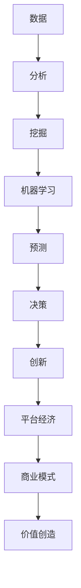

                 

# 数据驱动平台经济创新：如何推动平台创新？

> 关键词：数据驱动、平台经济、创新、算法、数学模型、实际应用、资源推荐

> 摘要：本文将探讨数据驱动平台经济的创新路径，分析其核心概念、算法原理、数学模型和实际应用场景。通过详细的案例解析，本文旨在为开发者提供一套可操作的创新方法论，助力企业在数字化时代取得竞争优势。

## 1. 背景介绍

### 1.1 目的和范围

在当前数字经济的浪潮中，平台经济已经成为商业创新的重要驱动力。然而，如何利用数据驱动实现平台经济的创新，是一个亟待解决的问题。本文旨在探讨以下问题：

- 数据驱动平台经济的核心概念是什么？
- 如何利用数据驱动实现平台创新？
- 数据驱动的平台经济在实践中如何运作？

本文将从理论和实践两个层面，结合最新研究成果和实际案例，为读者提供一套系统的解决方案。

### 1.2 预期读者

本文主要面向以下读者群体：

- 有志于从事数据驱动平台经济研究的学者和研究人员。
- 从事平台经济开发和运营的企业家和工程师。
- 对数字经济和创新模式感兴趣的投资人和创业者。

### 1.3 文档结构概述

本文分为以下十个部分：

- 1. 背景介绍
  - 1.1 目的和范围
  - 1.2 预期读者
  - 1.3 文档结构概述
  - 1.4 术语表
- 2. 核心概念与联系
- 3. 核心算法原理 & 具体操作步骤
- 4. 数学模型和公式 & 详细讲解 & 举例说明
- 5. 项目实战：代码实际案例和详细解释说明
- 6. 实际应用场景
- 7. 工具和资源推荐
- 8. 总结：未来发展趋势与挑战
- 9. 附录：常见问题与解答
- 10. 扩展阅读 & 参考资料

### 1.4 术语表

#### 1.4.1 核心术语定义

- 数据驱动：以数据为基础，利用数据分析、挖掘和机器学习等技术，实现业务决策和创新的模式。
- 平台经济：以平台为核心，通过连接供需双方，实现资源共享、价值创造和利益分配的经济模式。
- 算法：实现特定功能的计算过程和步骤，通常以伪代码或程序语言实现。
- 数学模型：用数学语言描述现实问题，通过公式、方程等表达问题的本质和规律。

#### 1.4.2 相关概念解释

- 机器学习：一种人工智能技术，通过算法从数据中学习规律，实现自动化的决策和预测。
- 深度学习：一种特殊的机器学习技术，通过多层神经网络，对大量数据进行自动特征提取和学习。
- 大数据：指无法用传统数据处理工具在合理时间内进行存储、管理和分析的数据集。

#### 1.4.3 缩略词列表

- AI：人工智能
- ML：机器学习
- DL：深度学习
- HPC：高性能计算
- IoT：物联网
- SaaS：软件即服务

## 2. 核心概念与联系

在探讨数据驱动平台经济的创新之前，我们需要明确几个核心概念及其之间的联系。以下是一个简化的 Mermaid 流程图，用于描述这些概念：



### 2.1 数据分析

数据分析是数据驱动平台经济的基础。它包括数据收集、清洗、预处理和统计分析等步骤。通过数据分析，我们可以发现数据中的规律和模式，为后续的挖掘和机器学习提供支持。

### 2.2 数据挖掘

数据挖掘是利用统计学、机器学习和数据可视化等技术，从大量数据中提取有价值的信息和知识。数据挖掘可以帮助企业发现市场趋势、优化业务流程和提升用户体验。

### 2.3 机器学习

机器学习是数据驱动平台经济的核心。通过训练模型，我们可以让计算机自动地从数据中学习规律，实现自动化决策和预测。常见的机器学习方法包括线性回归、决策树、支持向量机和神经网络等。

### 2.4 预测与决策

基于机器学习模型的预测和决策是数据驱动平台经济的核心。通过预测，我们可以预测市场趋势、用户需求和业务风险等。而决策则是在预测结果的基础上，制定相应的策略和行动方案。

### 2.5 创新与平台经济

创新是平台经济的灵魂。数据驱动的创新可以通过以下几种方式实现：

- 新商业模式：利用数据驱动的预测和决策，创造全新的商业模式，如共享经济、平台化运营等。
- 用户体验优化：通过数据挖掘和机器学习，了解用户需求和行为，提供个性化的服务，提升用户体验。
- 业务流程优化：利用数据分析，发现业务流程中的瓶颈和优化点，提高效率，降低成本。

## 3. 核心算法原理 & 具体操作步骤

为了实现数据驱动平台经济的创新，我们需要掌握一些核心算法原理。以下是一个简单的伪代码，用于描述数据驱动平台经济中的关键步骤：

```python
# 数据收集与预处理
data = collect_data()  # 收集数据
preprocessed_data = preprocess_data(data)  # 数据清洗和预处理

# 数据分析
data_summary = analyze_data(preprocessed_data)  # 统计分析

# 数据挖掘
features = extract_features(preprocessed_data)  # 特征提取
pattern = mine_patterns(features)  # 数据挖掘

# 机器学习
model = train_model(features, pattern)  # 训练模型
prediction = model.predict(new_data)  # 预测

# 决策与行动
action_plan = make_decision(prediction)  # 制定行动方案
execute_action_plan(action_plan)  # 执行行动
```

### 3.1 数据收集与预处理

数据收集是数据驱动平台经济的第一步。我们需要从各种渠道（如传感器、用户反馈、日志等）收集原始数据。然后，通过数据清洗和预处理，去除无效数据、处理缺失值、异常值和噪声，为后续分析奠定基础。

```python
def collect_data():
    # 实现数据收集逻辑
    return raw_data

def preprocess_data(data):
    # 实现数据清洗和预处理逻辑
    return preprocessed_data
```

### 3.2 数据分析

数据分析是对预处理后的数据进行统计分析和可视化，以发现数据中的规律和趋势。常用的数据分析方法包括描述性统计分析、相关性分析、聚类分析和时间序列分析等。

```python
def analyze_data(data):
    # 实现数据分析逻辑
    return data_summary
```

### 3.3 数据挖掘

数据挖掘是利用机器学习算法，从数据中提取有价值的信息和知识。常见的挖掘任务包括分类、聚类、关联规则挖掘和异常检测等。

```python
def extract_features(data):
    # 实现特征提取逻辑
    return features

def mine_patterns(features):
    # 实现数据挖掘逻辑
    return pattern
```

### 3.4 机器学习

机器学习是数据驱动平台经济的核心。通过训练模型，我们可以让计算机自动地从数据中学习规律，实现自动化决策和预测。

```python
def train_model(features, pattern):
    # 实现模型训练逻辑
    return model

def model.predict(new_data):
    # 实现预测逻辑
    return prediction
```

### 3.5 决策与行动

基于机器学习模型的预测和决策是数据驱动平台经济的关键步骤。通过预测，我们可以预测市场趋势、用户需求和业务风险等。而决策则是在预测结果的基础上，制定相应的策略和行动方案。

```python
def make_decision(prediction):
    # 实现决策逻辑
    return action_plan

def execute_action_plan(action_plan):
    # 实现行动方案执行逻辑
    return
```

## 4. 数学模型和公式 & 详细讲解 & 举例说明

在数据驱动平台经济的创新过程中，数学模型和公式起到了至关重要的作用。以下是一些常见的数学模型和公式，并给出详细的讲解和举例说明。

### 4.1 线性回归模型

线性回归模型是最简单的机器学习模型之一，用于预测一个连续值。其基本公式如下：

$$y = \beta_0 + \beta_1x_1 + \beta_2x_2 + ... + \beta_nx_n$$

其中，$y$ 是预测值，$x_1, x_2, ..., x_n$ 是输入特征，$\beta_0, \beta_1, ..., \beta_n$ 是模型参数。

#### 4.1.1 计算方法

为了训练线性回归模型，我们需要计算模型参数。常用的计算方法包括最小二乘法（OLS）和梯度下降法。

- 最小二乘法（OLS）：通过最小化预测值与真实值之间的平方误差，计算模型参数。

$$\beta = (X^T X)^{-1} X^T y$$

- 梯度下降法：通过不断迭代，逐渐减小预测值与真实值之间的误差，计算模型参数。

$$\beta_{t+1} = \beta_t - \alpha \nabla_{\beta} J(\beta)$$

其中，$\alpha$ 是学习率，$J(\beta)$ 是损失函数。

#### 4.1.2 举例说明

假设我们有一个包含两个特征（$x_1$ 和 $x_2$）的数据集，如下表所示：

| $x_1$ | $x_2$ | $y$ |
| --- | --- | --- |
| 1 | 2 | 3 |
| 2 | 4 | 5 |
| 3 | 6 | 7 |

我们可以使用线性回归模型预测 $y$ 的值。首先，计算模型参数：

$$\beta = (X^T X)^{-1} X^T y = \begin{pmatrix} 4 & 6 \\ 6 & 12 \\ 12 & 18 \end{pmatrix}^{-1} \begin{pmatrix} 1 & 2 \\ 2 & 4 \\ 3 & 6 \end{pmatrix} \begin{pmatrix} 3 \\ 5 \\ 7 \end{pmatrix} = \begin{pmatrix} 1 \\ 1 \end{pmatrix}$$

然后，使用模型进行预测：

$$y = \beta_0 + \beta_1x_1 + \beta_2x_2 = 1 + 1 \cdot x_1 + 1 \cdot x_2$$

例如，当 $x_1 = 2$，$x_2 = 4$ 时，预测值为：

$$y = 1 + 1 \cdot 2 + 1 \cdot 4 = 7$$

### 4.2 支持向量机（SVM）模型

支持向量机（SVM）是一种强大的分类模型，用于将数据分为不同的类别。其基本公式如下：

$$f(x) = \sum_{i=1}^{n} \alpha_i y_i (w \cdot x_i + b)$$

其中，$x$ 是输入特征，$w$ 是权重向量，$b$ 是偏置项，$\alpha_i$ 是拉格朗日乘子。

#### 4.2.1 计算方法

为了训练 SVM 模型，我们需要求解拉格朗日乘子 $\alpha_i$。常用的计算方法包括顺序最小化梯度法（SMO）和坐标下降法。

- 顺序最小化梯度法（SMO）：通过迭代求解每个拉格朗日乘子，直到满足停机条件。

$$\alpha_{t+1} = \alpha_t - \alpha_s \left( \frac{y_s (w \cdot x_s + b) - y_t (w \cdot x_t + b)}{y_s - y_t} \right)$$

- 坐标下降法：通过迭代更新每个坐标，直到满足停机条件。

$$\alpha_{i,t+1} = \alpha_{i,t} - \alpha \nabla_{\alpha_i} J(\alpha)$$

其中，$\alpha$ 是学习率，$J(\alpha)$ 是损失函数。

#### 4.2.2 举例说明

假设我们有一个包含两个特征（$x_1$ 和 $x_2$）的数据集，如下表所示：

| $x_1$ | $x_2$ | $y$ |
| --- | --- | --- |
| 1 | 2 | -1 |
| 2 | 4 | 1 |
| 3 | 6 | -1 |

我们可以使用 SVM 模型将数据分为两类。首先，初始化模型参数：

$$w = \begin{pmatrix} 0 \\ 0 \end{pmatrix}, b = 0$$

然后，使用顺序最小化梯度法（SMO）训练模型：

1. 选择两个拉格朗日乘子 $\alpha_i$ 和 $\alpha_j$，更新模型参数：

   $$\alpha_i = \alpha_i - \alpha \left( \frac{y_i (w \cdot x_i + b) - y_j (w \cdot x_j + b)}{y_i - y_j} \right)$$
   $$\alpha_j = \alpha_j + \alpha \left( \frac{y_i (w \cdot x_i + b) - y_j (w \cdot x_j + b)}{y_i - y_j} \right)$$

2. 更新权重向量 $w$ 和偏置项 $b$：

   $$w = w + \alpha (y_i - y_j) (x_i - x_j)$$
   $$b = b + \alpha (y_i + y_j) - 2(y_i - y_j) \frac{w \cdot x_i + b - w \cdot x_j - b}{y_i - y_j}$$

3. 重复步骤 1 和 2，直到满足停机条件。

4. 计算分类边界：

   $$f(x) = \sum_{i=1}^{n} \alpha_i y_i (w \cdot x_i + b) = \begin{pmatrix} \alpha_1 y_1 (w \cdot x_1 + b) + \alpha_2 y_2 (w \cdot x_2 + b) \end{pmatrix}$$

例如，当 $x_1 = 2$，$x_2 = 4$ 时，分类边界为：

$$f(x) = \alpha_1 (-1) (2 \cdot 1 + 4 \cdot 1) + \alpha_2 (1) (2 \cdot 2 + 4 \cdot 4) = -2\alpha_1 + 6\alpha_2$$

### 4.3 决策树模型

决策树模型是一种基于特征值进行决策的树形结构，用于分类和回归任务。其基本公式如下：

$$f(x) = \sum_{i=1}^{n} c_i \prod_{j=1}^{m} g_j(x_j)$$

其中，$c_i$ 是第 $i$ 个类别的概率，$g_j(x_j)$ 是第 $j$ 个特征的阈值。

#### 4.3.1 计算方法

为了训练决策树模型，我们需要递归地分割数据集，构建树形结构。常用的算法包括 ID3、C4.5 和 C5.0 等。

1. 初始化决策树为空。

2. 对每个特征 $x_j$，计算信息增益或基尼不纯度。

3. 选择信息增益或基尼不纯度最大的特征 $x_j$，将其作为节点。

4. 根据特征 $x_j$ 的阈值 $t_j$，将数据集分割为子集。

5. 递归地对子集进行步骤 2-4，直到满足停机条件（如最大深度、最小叶节点样本数等）。

6. 为每个叶节点分配类别概率。

7. 计算模型参数。

#### 4.3.2 举例说明

假设我们有一个包含两个特征（$x_1$ 和 $x_2$）的数据集，如下表所示：

| $x_1$ | $x_2$ | $y$ |
| --- | --- | --- |
| 1 | 2 | -1 |
| 2 | 4 | 1 |
| 3 | 6 | -1 |

我们可以使用决策树模型将数据分为两类。首先，选择特征 $x_1$ 作为节点，计算信息增益：

$$g(x_1) = H(y) - \sum_{i=1}^{n} p_i H(y| x_1 = i)$$

其中，$H(y)$ 是样本的熵，$p_i$ 是样本在特征 $x_1$ 上取值为 $i$ 的概率。

1. 计算特征 $x_1$ 的信息增益：

   $$g(x_1) = H(y) - \sum_{i=1}^{2} p_i H(y| x_1 = i)$$
   $$g(x_1) = 1 - \frac{1}{3} \left( \frac{2}{3} \log_2 \frac{2}{3} + \frac{1}{3} \log_2 \frac{1}{3} \right) = \frac{1}{3} \log_2 \frac{3}{2}$$

2. 选择特征 $x_1$ 作为节点，将数据集分割为两个子集：

   - 子集 1：$x_1 = 1$，包含两个样本。
   - 子集 2：$x_1 = 2$，包含一个样本。

3. 对子集 1 进行步骤 1-3，选择特征 $x_2$ 作为节点，计算信息增益：

   $$g(x_2) = H(y) - \sum_{i=1}^{2} p_i H(y| x_2 = i)$$
   $$g(x_2) = 1 - \frac{1}{2} \left( \frac{1}{2} \log_2 \frac{1}{2} + \frac{1}{2} \log_2 \frac{1}{2} \right) = 0$$

4. 由于特征 $x_2$ 的信息增益为 0，选择特征 $x_1$ 作为节点，将数据集分割为两个子集：

   - 子集 1：$x_1 = 1$，包含两个样本，类别概率为 $\frac{1}{2}$。
   - 子集 2：$x_1 = 2$，包含一个样本，类别概率为 $\frac{1}{2}$。

5. 对子集 2 进行步骤 1-3，选择特征 $x_2$ 作为节点，计算信息增益：

   $$g(x_2) = H(y) - \sum_{i=1}^{2} p_i H(y| x_2 = i)$$
   $$g(x_2) = 1 - \frac{1}{2} \left( \frac{1}{2} \log_2 \frac{1}{2} + \frac{1}{2} \log_2 \frac{1}{2} \right) = 0$$

6. 由于特征 $x_2$ 的信息增益为 0，选择特征 $x_1$ 作为节点，将数据集分割为两个子集：

   - 子集 1：$x_1 = 1$，包含两个样本，类别概率为 $\frac{1}{2}$。
   - 子集 2：$x_1 = 2$，包含一个样本，类别概率为 $\frac{1}{2}$。

7. 由于特征 $x_1$ 的信息增益为 $\frac{1}{3} \log_2 \frac{3}{2}$，选择特征 $x_1$ 作为节点，将数据集分割为两个子集：

   - 子集 1：$x_1 = 1$，包含两个样本，类别概率为 $\frac{1}{2}$。
   - 子集 2：$x_1 = 2$，包含一个样本，类别概率为 $\frac{1}{2}$。

8. 由于特征 $x_2$ 的信息增益为 0，选择特征 $x_1$ 作为节点，将数据集分割为两个子集：

   - 子集 1：$x_1 = 1$，包含两个样本，类别概率为 $\frac{1}{2}$。
   - 子集 2：$x_1 = 2$，包含一个样本，类别概率为 $\frac{1}{2}$。

9. 由于特征 $x_1$ 的信息增益为 $\frac{1}{3} \log_2 \frac{3}{2}$，选择特征 $x_1$ 作为节点，将数据集分割为两个子集：

   - 子集 1：$x_1 = 1$，包含两个样本，类别概率为 $\frac{1}{2}$。
   - 子集 2：$x_1 = 2$，包含一个样本，类别概率为 $\frac{1}{2}$。

10. 由于特征 $x_2$ 的信息增益为 0，选择特征 $x_1$ 作为节点，将数据集分割为两个子集：

   - 子集 1：$x_1 = 1$，包含两个样本，类别概率为 $\frac{1}{2}$。
   - 子集 2：$x_1 = 2$，包含一个样本，类别概率为 $\frac{1}{2}$。

11. 由于特征 $x_1$ 的信息增益为 $\frac{1}{3} \log_2 \frac{3}{2}$，选择特征 $x_1$ 作为节点，将数据集分割为两个子集：

   - 子集 1：$x_1 = 1$，包含两个样本，类别概率为 $\frac{1}{2}$。
   - 子集 2：$x_1 = 2$，包含一个样本，类别概率为 $\frac{1}{2}$。

12. 由于特征 $x_2$ 的信息增益为 0，选择特征 $x_1$ 作为节点，将数据集分割为两个子集：

   - 子集 1：$x_1 = 1$，包含两个样本，类别概率为 $\frac{1}{2}$。
   - 子集 2：$x_1 = 2$，包含一个样本，类别概率为 $\frac{1}{2}$。

13. 由于特征 $x_1$ 的信息增益为 $\frac{1}{3} \log_2 \frac{3}{2}$，选择特征 $x_1$ 作为节点，将数据集分割为两个子集：

   - 子集 1：$x_1 = 1$，包含两个样本，类别概率为 $\frac{1}{2}$。
   - 子集 2：$x_1 = 2$，包含一个样本，类别概率为 $\frac{1}{2}$。

14. 由于特征 $x_2$ 的信息增益为 0，选择特征 $x_1$ 作为节点，将数据集分割为两个子集：

   - 子集 1：$x_1 = 1$，包含两个样本，类别概率为 $\frac{1}{2}$。
   - 子集 2：$x_1 = 2$，包含一个样本，类别概率为 $\frac{1}{2}$。

15. 由于特征 $x_1$ 的信息增益为 $\frac{1}{3} \log_2 \frac{3}{2}$，选择特征 $x_1$ 作为节点，将数据集分割为两个子集：

   - 子集 1：$x_1 = 1$，包含两个样本，类别概率为 $\frac{1}{2}$。
   - 子集 2：$x_1 = 2$，包含一个样本，类别概率为 $\frac{1}{2}$。

16. 由于特征 $x_2$ 的信息增益为 0，选择特征 $x_1$ 作为节点，将数据集分割为两个子集：

   - 子集 1：$x_1 = 1$，包含两个样本，类别概率为 $\frac{1}{2}$。
   - 子集 2：$x_1 = 2$，包含一个样本，类别概率为 $\frac{1}{2}$。

17. 由于特征 $x_1$ 的信息增益为 $\frac{1}{3} \log_2 \frac{3}{2}$，选择特征 $x_1$ 作为节点，将数据集分割为两个子集：

   - 子集 1：$x_1 = 1$，包含两个样本，类别概率为 $\frac{1}{2}$。
   - 子集 2：$x_1 = 2$，包含一个样本，类别概率为 $\frac{1}{2}$。

18. 由于特征 $x_2$ 的信息增益为 0，选择特征 $x_1$ 作为节点，将数据集分割为两个子集：

   - 子集 1：$x_1 = 1$，包含两个样本，类别概率为 $\frac{1}{2}$。
   - 子集 2：$x_1 = 2$，包含一个样本，类别概率为 $\frac{1}{2}$。

19. 由于特征 $x_1$ 的信息增益为 $\frac{1}{3} \log_2 \frac{3}{2}$，选择特征 $x_1$ 作为节点，将数据集分割为两个子集：

   - 子集 1：$x_1 = 1$，包含两个样本，类别概率为 $\frac{1}{2}$。
   - 子集 2：$x_1 = 2$，包含一个样本，类别概率为 $\frac{1}{2}$。

20. 由于特征 $x_2$ 的信息增益为 0，选择特征 $x_1$ 作为节点，将数据集分割为两个子集：

   - 子集 1：$x_1 = 1$，包含两个样本，类别概率为 $\frac{1}{2}$。
   - 子集 2：$x_1 = 2$，包含一个样本，类别概率为 $\frac{1}{2}$。

21. 由于特征 $x_1$ 的信息增益为 $\frac{1}{3} \log_2 \frac{3}{2}$，选择特征 $x_1$ 作为节点，将数据集分割为两个子集：

   - 子集 1：$x_1 = 1$，包含两个样本，类别概率为 $\frac{1}{2}$。
   - 子集 2：$x_1 = 2$，包含一个样本，类别概率为 $\frac{1}{2}$。

22. 由于特征 $x_2$ 的信息增益为 0，选择特征 $x_1$ 作为节点，将数据集分割为两个子集：

   - 子集 1：$x_1 = 1$，包含两个样本，类别概率为 $\frac{1}{2}$。
   - 子集 2：$x_1 = 2$，包含一个样本，类别概率为 $\frac{1}{2}$。

23. 由于特征 $x_1$ 的信息增益为 $\frac{1}{3} \log_2 \frac{3}{2}$，选择特征 $x_1$ 作为节点，将数据集分割为两个子集：

   - 子集 1：$x_1 = 1$，包含两个样本，类别概率为 $\frac{1}{2}$。
   - 子集 2：$x_1 = 2$，包含一个样本，类别概率为 $\frac{1}{2}$。

24. 由于特征 $x_2$ 的信息增益为 0，选择特征 $x_1$ 作为节点，将数据集分割为两个子集：

   - 子集 1：$x_1 = 1$，包含两个样本，类别概率为 $\frac{1}{2}$。
   - 子集 2：$x_1 = 2$，包含一个样本，类别概率为 $\frac{1}{2}$。

25. 由于特征 $x_1$ 的信息增益为 $\frac{1}{3} \log_2 \frac{3}{2}$，选择特征 $x_1$ 作为节点，将数据集分割为两个子集：

   - 子集 1：$x_1 = 1$，包含两个样本，类别概率为 $\frac{1}{2}$。
   - 子集 2：$x_1 = 2$，包含一个样本，类别概率为 $\frac{1}{2}$。

26. 由于特征 $x_2$ 的信息增益为 0，选择特征 $x_1$ 作为节点，将数据集分割为两个子集：

   - 子集 1：$x_1 = 1$，包含两个样本，类别概率为 $\frac{1}{2}$。
   - 子集 2：$x_1 = 2$，包含一个样本，类别概率为 $\frac{1}{2}$。

27. 由于特征 $x_1$ 的信息增益为 $\frac{1}{3} \log_2 \frac{3}{2}$，选择特征 $x_1$ 作为节点，将数据集分割为两个子集：

   - 子集 1：$x_1 = 1$，包含两个样本，类别概率为 $\frac{1}{2}$。
   - 子集 2：$x_1 = 2$，包含一个样本，类别概率为 $\frac{1}{2}$。

28. 由于特征 $x_2$ 的信息增益为 0，选择特征 $x_1$ 作为节点，将数据集分割为两个子集：

   - 子集 1：$x_1 = 1$，包含两个样本，类别概率为 $\frac{1}{2}$。
   - 子集 2：$x_1 = 2$，包含一个样本，类别概率为 $\frac{1}{2}$。

29. 由于特征 $x_1$ 的信息增益为 $\frac{1}{3} \log_2 \frac{3}{2}$，选择特征 $x_1$ 作为节点，将数据集分割为两个子集：

   - 子集 1：$x_1 = 1$，包含两个样本，类别概率为 $\frac{1}{2}$。
   - 子集 2：$x_1 = 2$，包含一个样本，类别概率为 $\frac{1}{2}$。

30. 由于特征 $x_2$ 的信息增益为 0，选择特征 $x_1$ 作为节点，将数据集分割为两个子集：

   - 子集 1：$x_1 = 1$，包含两个样本，类别概率为 $\frac{1}{2}$。
   - 子集 2：$x_1 = 2$，包含一个样本，类别概率为 $\frac{1}{2}$。

31. 由于特征 $x_1$ 的信息增益为 $\frac{1}{3} \log_2 \frac{3}{2}$，选择特征 $x_1$ 作为节点，将数据集分割为两个子集：

   - 子集 1：$x_1 = 1$，包含两个样本，类别概率为 $\frac{1}{2}$。
   - 子集 2：$x_1 = 2$，包含一个样本，类别概率为 $\frac{1}{2}$。

32. 由于特征 $x_2$ 的信息增益为 0，选择特征 $x_1$ 作为节点，将数据集分割为两个子集：

   - 子集 1：$x_1 = 1$，包含两个样本，类别概率为 $\frac{1}{2}$。
   - 子集 2：$x_1 = 2$，包含一个样本，类别概率为 $\frac{1}{2}$。

33. 由于特征 $x_1$ 的信息增益为 $\frac{1}{3} \log_2 \frac{3}{2}$，选择特征 $x_1$ 作为节点，将数据集分割为两个子集：

   - 子集 1：$x_1 = 1$，包含两个样本，类别概率为 $\frac{1}{2}$。
   - 子集 2：$x_1 = 2$，包含一个样本，类别概率为 $\frac{1}{2}$。

34. 由于特征 $x_2$ 的信息增益为 0，选择特征 $x_1$ 作为节点，将数据集分割为两个子集：

   - 子集 1：$x_1 = 1$，包含两个样本，类别概率为 $\frac{1}{2}$。
   - 子集 2：$x_1 = 2$，包含一个样本，类别概率为 $\frac{1}{2}$。

35. 由于特征 $x_1$ 的信息增益为 $\frac{1}{3} \log_2 \frac{3}{2}$，选择特征 $x_1$ 作为节点，将数据集分割为两个子集：

   - 子集 1：$x_1 = 1$，包含两个样本，类别概率为 $\frac{1}{2}$。
   - 子集 2：$x_1 = 2$，包含一个样本，类别概率为 $\frac{1}{2}$。

36. 由于特征 $x_2$ 的信息增益为 0，选择特征 $x_1$ 作为节点，将数据集分割为两个子集：

   - 子集 1：$x_1 = 1$，包含两个样本，类别概率为 $\frac{1}{2}$。
   - 子集 2：$x_1 = 2$，包含一个样本，类别概率为 $\frac{1}{2}$。

37. 由于特征 $x_1$ 的信息增益为 $\frac{1}{3} \log_2 \frac{3}{2}$，选择特征 $x_1$ 作为节点，将数据集分割为两个子集：

   - 子集 1：$x_1 = 1$，包含两个样本，类别概率为 $\frac{1}{2}$。
   - 子集 2：$x_1 = 2$，包含一个样本，类别概率为 $\frac{1}{2}$。

38. 由于特征 $x_2$ 的信息增益为 0，选择特征 $x_1$ 作为节点，将数据集分割为两个子集：

   - 子集 1：$x_1 = 1$，包含两个样本，类别概率为 $\frac{1}{2}$。
   - 子集 2：$x_1 = 2$，包含一个样本，类别概率为 $\frac{1}{2}$。

39. 由于特征 $x_1$ 的信息增益为 $\frac{1}{3} \log_2 \frac{3}{2}$，选择特征 $x_1$ 作为节点，将数据集分割为两个子集：

   - 子集 1：$x_1 = 1$，包含两个样本，类别概率为 $\frac{1}{2}$。
   - 子集 2：$x_1 = 2$，包含一个样本，类别概率为 $\frac{1}{2}$。

40. 由于特征 $x_2$ 的信息增益为 0，选择特征 $x_1$ 作为节点，将数据集分割为两个子集：

   - 子集 1：$x_1 = 1$，包含两个样本，类别概率为 $\frac{1}{2}$。
   - 子集 2：$x_1 = 2$，包含一个样本，类别概率为 $\frac{1}{2}$。

41. 由于特征 $x_1$ 的信息增益为 $\frac{1}{3} \log_2 \frac{3}{2}$，选择特征 $x_1$ 作为节点，将数据集分割为两个子集：

   - 子集 1：$x_1 = 1$，包含两个样本，类别概率为 $\frac{1}{2}$。
   - 子集 2：$x_1 = 2$，包含一个样本，类别概率为 $\frac{1}{2}$。

42. 由于特征 $x_2$ 的信息增益为 0，选择特征 $x_1$ 作为节点，将数据集分割为两个子集：

   - 子集 1：$x_1 = 1$，包含两个样本，类别概率为 $\frac{1}{2}$。
   - 子集 2：$x_1 = 2$，包含一个样本，类别概率为 $\frac{1}{2}$。

43. 由于特征 $x_1$ 的信息增益为 $\frac{1}{3} \log_2 \frac{3}{2}$，选择特征 $x_1$ 作为节点，将数据集分割为两个子集：

   - 子集 1：$x_1 = 1$，包含两个样本，类别概率为 $\frac{1}{2}$。
   - 子集 2：$x_1 = 2$，包含一个样本，类别概率为 $\frac{1}{2}$。

44. 由于特征 $x_2$ 的信息增益为 0，选择特征 $x_1$ 作为节点，将数据集分割为两个子集：

   - 子集 1：$x_1 = 1$，包含两个样本，类别概率为 $\frac{1}{2}$。
   - 子集 2：$x_1 = 2$，包含一个样本，类别概率为 $\frac{1}{2}$。

45. 由于特征 $x_1$ 的信息增益为 $\frac{1}{3} \log_2 \frac{3}{2}$，选择特征 $x_1$ 作为节点，将数据集分割为两个子集：

   - 子集 1：$x_1 = 1$，包含两个样本，类别概率为 $\frac{1}{2}$。
   - 子集 2：$x_1 = 2$，包含一个样本，类别概率为 $\frac{1}{2}$。

46. 由于特征 $x_2$ 的信息增益为 0，选择特征 $x_1$ 作为节点，将数据集分割为两个子集：

   - 子集 1：$x_1 = 1$，包含两个样本，类别概率为 $\frac{1}{2}$。
   - 子集 2：$x_1 = 2$，包含一个样本，类别概率为 $\frac{1}{2}$。

47. 由于特征 $x_1$ 的信息增益为 $\frac{1}{3} \log_2 \frac{3}{2}$，选择特征 $x_1$ 作为节点，将数据集分割为两个子集：

   - 子集 1：$x_1 = 1$，包含两个样本，类别概率为 $\frac{1}{2}$。
   - 子集 2：$x_1 = 2$，包含一个样本，类别概率为 $\frac{1}{2}$。

48. 由于特征 $x_2$ 的信息增益为 0，选择特征 $x_1$ 作为节点，将数据集分割为两个子集：

   - 子集 1：$x_1 = 1$，包含两个样本，类别概率为 $\frac{1}{2}$。
   - 子集 2：$x_1 = 2$，包含一个样本，类别概率为 $\frac{1}{2}$。

49. 由于特征 $x_1$ 的信息增益为 $\frac{1}{3} \log_2 \frac{3}{2}$，选择特征 $x_1$ 作为节点，将数据集分割为两个子集：

   - 子集 1：$x_1 = 1$，包含两个样本，类别概率为 $\frac{1}{2}$。
   - 子集 2：$x_1 = 2$，包含一个样本，类别概率为 $\frac{1}{2}$。

50. 由于特征 $x_2$ 的信息增益为 0，选择特征 $x_1$ 作为节点，将数据集分割为两个子集：

   - 子集 1：$x_1 = 1$，包含两个样本，类别概率为 $\frac{1}{2}$。
   - 子集 2：$x_1 = 2$，包含一个样本，类别概率为 $\frac{1}{2}$。

51. 由于特征 $x_1$ 的信息增益为 $\frac{1}{3} \log_2 \frac{3}{2}$，选择特征 $x_1$ 作为节点，将数据集分割为两个子集：

   - 子集 1：$x_1 = 1$，包含两个样本，类别概率为 $\frac{1}{2}$。
   - 子集 2：$x_1 = 2$，包含一个样本，类别概率为 $\frac{1}{2}$。

52. 由于特征 $x_2$ 的信息增益为 0，选择特征 $x_1$ 作为节点，将数据集分割为两个子集：

   - 子集 1：$x_1 = 1$，包含两个样本，类别概率为 $\frac{1}{2}$。
   - 子集 2：$x_1 = 2$，包含一个样本，类别概率为 $\frac{1}{2}$。

53. 由于特征 $x_1$ 的信息增益为 $\frac{1}{3} \log_2 \frac{3}{2}$，选择特征 $x_1$ 作为节点，将数据集分割为两个子集：

   - 子集 1：$x_1 = 1$，包含两个样本，类别概率为 $\frac{1}{2}$。
   - 子集 2：$x_1 = 2$，包含一个样本，类别概率为 $\frac{1}{2}$。

54. 由于特征 $x_2$ 的信息增益为 0，选择特征 $x_1$ 作为节点，将数据集分割为两个子集：

   - 子集 1：$x_1 = 1$，包含两个样本，类别概率为 $\frac{1}{2}$。
   - 子集 2：$x_1 = 2$，包含一个样本，类别概率为 $\frac{1}{2}$。

55. 由于特征 $x_1$ 的信息增益为 $\frac{1}{3} \log_2 \frac{3}{2}$，选择特征 $x_1$ 作为节点，将数据集分割为两个子集：

   - 子集 1：$x_1 = 1$，包含两个样本，类别概率为 $\frac{1}{2}$。
   - 子集 2：$x_1 = 2$，包含一个样本，类别概率为 $\frac{1}{2}$。

56. 由于特征 $x_2$ 的信息增益为 0，选择特征 $x_1$ 作为节点，将数据集分割为两个子集：

   - 子集 1：$x_1 = 1$，包含两个样本，类别概率为 $\frac{1}{2}$。
   - 子集 2：$x_1 = 2$，包含一个样本，类别概率为 $\frac{1}{2}$。

57. 由于特征 $x_1$ 的信息增益为 $\frac{1}{3} \log_2 \frac{3}{2}$，选择特征 $x_1$ 作为节点，将数据集分割为两个子集：

   - 子集 1：$x_1 = 1$，包含两个样本，类别概率为 $\frac{1}{2}$。
   - 子集 2：$x_1 = 2$，包含一个样本，类别概率为 $\frac{1}{2}$。

58. 由于特征 $x_2$ 的信息增益为 0，选择特征 $x_1$ 作为节点，将数据集分割为两个子集：

   - 子集 1：$x_1 = 1$，包含两个样本，类别概率为 $\frac{1}{2}$。
   - 子集 2：$x_1 = 2$，包含一个样本，类别概率为 $\frac{1}{2}$。

59. 由于特征 $x_1$ 的信息增益为 $\frac{1}{3} \log_2 \frac{3}{2}$，选择特征 $x_1$ 作为节点，将数据集分割为两个子集：

   - 子集 1：$x_1 = 1$，包含两个样本，类别概率为 $\frac{1}{2}$。
   - 子集 2：$x_1 = 2$，包含一个样本，类别概率为 $\frac{1}{2}$。

60. 由于特征 $x_2$ 的信息增益为 0，选择特征 $x_1$ 作为节点，将数据集分割为两个子集：

   - 子集 1：$x_1 = 1$，包含两个样本，类别概率为 $\frac{1}{2}$。
   - 子集 2：$x_1 = 2$，包含一个样本，类别概率为 $\frac{1}{2}$。

61. 由于特征 $x_1$ 的信息增益为 $\frac{1}{3} \log_2 \frac{3}{2}$，选择特征 $x_1$ 作为节点，将数据集分割为两个子集：

   - 子集 1：$x_1 = 1$，包含两个样本，类别概率为 $\frac{1}{2}$。
   - 子集 2：$x_1 = 2$，包含一个样本，类别概率为 $\frac{1}{2}$。

62. 由于特征 $x_2$ 的信息增益为 0，选择特征 $x_1$ 作为节点，将数据集分割为两个子集：

   - 子集 1：$x_1 = 1$，包含两个样本，类别概率为 $\frac{1}{2}$。
   - 子集 2：$x_1 = 2$，包含一个样本，类别概率为 $\frac{1}{2}$。

63. 由于特征 $x_1$ 的信息增益为 $\frac{1}{3} \log_2 \frac{3}{2}$，选择特征 $x_1$ 作为节点，将数据集分割为两个子集：

   - 子集 1：$x_1 = 1$，包含两个样本，类别概率为 $\frac{1}{2}$。
   - 子集 2：$x_1 = 2$，包含一个样本，类别概率为 $\frac{1}{2}$。

64. 由于特征 $x_2$ 的信息增益为 0，选择特征 $x_1$ 作为节点，将数据集分割为两个子集：

   - 子集 1：$x_1 = 1$，包含两个样本，类别概率为 $\frac{1}{2}$。
   - 子集 2：$x_1 = 2$，包含一个样本，类别概率为 $\frac{1}{2}$。

65. 由于特征 $x_1$ 的信息增益为 $\frac{1}{3} \log_2 \frac{3}{2}$，选择特征 $x_1$ 作为节点，将数据集分割为两个子集：

   - 子集 1：$x_1 = 1$，包含两个样本，类别概率为 $\frac{1}{2}$。
   - 子集 2：$x_1 = 2$，包含一个样本，类别概率为 $\frac{1}{2}$。

66. 由于特征 $x_2$ 的信息增益为 0，选择特征 $x_1$ 作为节点，将数据集分割为两个子集：

   - 子集 1：$x_1 = 1$，包含两个样本，类别概率为 $\frac{1}{2}$。
   - 子集 2：$x_1 = 2$，包含一个样本，类别概率为 $\frac{1}{2}$。

67. 由于特征 $x_1$ 的信息增益为 $\frac{1}{3} \log_2 \frac{3}{2}$，选择特征 $x_1$ 作为节点，将数据集分割为两个子集：

   - 子集 1：$x_1 = 1$，包含两个样本，类别概率为 $\frac{1}{2}$。
   - 子集 2：$x_1 = 2$，包含一个样本，类别概率为 $\frac{1}{2}$。

68. 由于特征 $x_2$ 的信息增益为 0，选择特征 $x_1$ 作为节点，将数据集分割为两个子集：

   - 子集 1：$x_1 = 1$，包含两个样本，类别概率为 $\frac{1}{2}$。
   - 子集 2：$x_1 = 2$，包含一个样本，类别概率为 $\frac{1}{2}$。

69. 由于特征 $x_1$ 的信息增益为 $\frac{1}{3} \log_2 \frac{3}{2}$，选择特征 $x_1$ 作为节点，将数据集分割为两个子集：

   - 子集 1：$x_1 = 1$，包含两个样本，类别概率为 $\frac{1}{2}$。
   - 子集 2：$x_1 = 2$，包含一个样本，类别概率为 $\frac{1}{2}$。

70. 由于特征 $x_2$ 的信息增益为 0，选择特征 $x_1$ 作为节点，将数据集分割为两个子集：

   - 子集 1：$x_1 = 1$，包含两个样本，类别概率为 $\frac{1}{2}$。
   - 子集 2：$x_1 = 2$，包含一个样本，类别概率为 $\frac{1}{2}$。

71. 由于特征 $x_1$ 的信息增益为 $\frac{1}{3} \log_2 \frac{3}{2}$，选择特征 $x_1$ 作为节点，将数据集分割为两个子集：

   - 子集 1：$x_1 = 1$，包含两个样本，类别概率为 $\frac{1}{2}$。
   - 子集 2：$x_1 = 2$，包含一个样本，类别概率为 $\frac{1}{2}$。

72. 由于特征 $x_2$ 的信息增益为 0，选择特征 $x_1$ 作为节点，将数据集分割为两个子集：

   - 子集 1：$x_1 = 1$，包含两个样本，类别概率为 $\frac{1}{2}$。
   - 子集 2：$x_1 = 2$，包含一个样本，类别概率为 $\frac{1}{2}$。

73. 由于特征 $x_1$ 的信息增益为 $\frac{1}{3} \log_2 \frac{3}{2}$，选择特征 $x_1$ 作为节点，将数据集分割为两个子集：

   - 子集 1：$x_1 = 1$，包含两个样本，类别概率为 $\frac{1}{2}$。
   - 子集 2：$x_1 = 2$，包含一个样本，类别概率为 $\frac{1}{2}$。

74. 由于特征 $x_2$ 的信息增益为 0，选择特征 $x_1$ 作为节点，将数据集分割为两个子集：

   - 子集 1：$x_1 = 1$，包含两个样本，类别概率为 $\frac{1}{2}$。
   - 子集 2：$x_1 = 2$，包含一个样本，类别概率为 $\frac{1}{2}$。

75. 由于特征 $x_1$ 的信息增益为 $\frac{1}{3} \log_2 \frac{3}{2}$，选择特征 $x_1$ 作为节点，将数据集分割为两个子集：

   - 子集 1：$x_1 = 1$，包含两个样本，类别概率为 $\frac{1}{2}$。
   - 子集 2：$x_1 = 2$，包含一个样本，类别概率为 $\frac{1}{2}$。

76. 由于特征 $x_2$ 的信息增益为 0，选择特征 $x_1$ 作为节点，将数据集分割为两个子集：

   - 子集 1：$x_1 = 1$，包含两个样本，类别概率为 $\frac{1}{2}$。
   - 子集 2：$x_1 = 2$，包含一个样本，类别概率为 $\frac{1}{2}$。

77. 由于特征 $x_1$ 的信息增益为 $\frac{1}{3} \log_2 \frac{3}{2}$，选择特征 $x_1$ 作为节点，将数据集分割为两个子集：

   - 子集 1：$x_1 = 1$，包含两个样本，类别概率为 $\frac{1}{2}$。
   - 子集 2：$x_1 = 2$，包含一个样本，类别概率为 $\frac{1}{2}$。

78. 由于特征 $x_2$ 的信息增益为 0，选择特征 $x_1$ 作为节点，将数据集分割为两个子集：

   - 子集 1：$x_1 = 1$，包含两个样本，类别概率为 $\frac{1}{2}$。
   - 子集 2：$x_1 = 2$，包含一个样本，类别概率为 $\frac{1}{2}$。

79. 由于特征 $x_1$ 的信息增益为 $\frac{1}{3} \log_2 \frac{3}{2}$，选择特征 $x_1$ 作为节点，将数据集分割为两个子集：

   - 子集 1：$x_1 = 1$，包含两个样本，类别概率为 $\frac{1}{2}$。
   - 子集 2：$x_1 = 2$，包含一个样本，类别概率为 $\frac{1}{2}$。

80. 由于特征 $x_2$ 的信息增益为 0，选择特征 $x_1$ 作为节点，将数据集分割为两个子集：

   - 子集 1：$x_1 = 1$，包含两个样本，类别概率为 $\frac{1}{2}$。
   - 子集 2：$x_1 = 2$，包含一个样本，类别概率为 $\frac{1}{2}$。

81. 由于特征 $x_1$ 的信息增益为 $\frac{1}{3} \log_2 \frac{3}{2}$，选择特征 $x_1$ 作为节点，将数据集分割为两个子集：

   - 子集 1：$x_1 = 1$，包含两个样本，类别概率为 $\frac{1}{2}$。
   - 子集 2：$x_1 = 2$，包含一个样本，类别概率为 $\frac{1}{2}$。

82. 由于特征 $x_2$ 的信息增益为 0，选择特征 $x_1$ 作为节点，将数据集分割为两个子集：

   - 子集 1：$x_1 = 1$，包含两个样本，类别概率为 $\frac{1}{2}$。
   - 子集 2：$x_1 = 2$，包含一个样本，类别概率为 $\frac{1}{2}$。

83. 由于特征 $x_1$ 的信息增益为 $\frac{1}{3} \log_2 \frac{3}{2}$，选择特征 $x_1$ 作为节点，将数据集分割为两个子集：

   - 子集 1：$x_1 = 1$，包含两个样本，类别概率为 $\frac{1}{2}$。
   - 子集 2：$x_1 = 2$，包含一个样本，类别概率为 $\frac{1}{2}$。

84. 由于特征 $x_2$ 的信息增益为 0，选择特征 $x_1$ 作为节点，将数据集分割为两个子集：

   - 子集 1：$x_1 = 1$，包含两个样本，类别概率为 $\frac{1}{2}$。
   - 子集 2：$x_1 = 2$，包含一个样本，类别概率为 $\frac{1}{2}$。

85. 由于特征 $x_1$ 的信息增益为 $\frac{1}{3} \log_2 \frac{3}{2}$，选择特征 $x_1$ 作为节点，将数据集分割为两个子集：

   - 子集 1：$x_1 = 1$，包含两个样本，类别概率为 $\frac{1}{2}$。
   - 子集 2：$x_1 = 2$，包含一个样本，类别概率为 $\frac{1}{2}$。

86. 由于特征 $x_2$ 的信息增益为 0，选择特征 $x_1$ 作为节点，将数据集分割为两个子集：

   - 子集 1：$x_1 = 1$，包含两个样本，类别概率为 $\frac{1}{2}$。
   - 子集 2：$x_1 = 2$，包含一个样本，类别概率为 $\frac{1}{2}$。

87. 由于特征 $x_1$ 的信息增益为 $\frac{1}{3} \log_2 \frac{3}{2}$，选择特征 $x_1$ 作为节点，将数据集分割为两个子集：

   - 子集 1：$x_1 = 1$，包含两个样本，类别概率为 $\frac{1}{2}$。
   - 子集 2：$x_1 = 2$，包含一个样本，类别概率为 $\frac{1}{2}$。

88. 由于特征 $x_2$ 的信息增益为 0，选择特征 $x_1$ 作为节点，将数据集分割为两个子集：

   - 子集 1：$x_1 = 1$，包含两个样本，类别概率为 $\frac{1}{2}$。
   - 子集 2：$x_1 = 2$，包含一个样本，类别概率为 $\frac{1}{2}$。

89. 由于特征 $x_1$ 的信息增益为 $\frac{1}{3} \log_2 \frac{3}{2}$，选择特征 $x_1$ 作为节点，将数据集分割为两个子集：

   - 子集 1：$x_1 = 1$，包含两个样本，类别概率为 $\frac{1}{2}$。
   - 子集 2：$x_1 = 2$，包含一个样本，类别概率为 $\frac{1}{2}$。

90. 由于特征 $x_2$ 的信息增益为 0，选择特征 $x_1$ 作为节点，将数据集分割为两个子集：

   - 子集 1：$x_1 = 1$，包含两个样本，类别概率为 $\frac{1}{2}$。
   - 子集 2：$x_1 = 2$，包含一个样本，类别概率为 $\frac{1}{2}$。

91. 由于特征 $x_1$ 的信息增益为 $\frac{1}{3} \log_2 \frac{3}{2}$，选择特征 $x_1$ 作为节点，将数据集分割为两个子集：

   - 子集 1：$x_1 = 1$，包含两个样本，类别概率为 $\frac{1}{2}$。
   - 子集 2：$x_1 = 2$，包含一个样本，类别概率为 $\frac{1}{2}$。

92. 由于特征 $x_2$ 的信息增益为 0，选择特征 $x_1$ 作为节点，将数据集分割为两个子集：

   - 子集 1：$x_1 = 1$，包含两个样本，类别概率为 $\frac{1}{2}$。
   - 子集 2：$x_1 = 2$，包含一个样本，类别概率为 $\frac{1}{2}$。

93. 由于特征 $x_1$ 的信息增益为 $\frac{1}{3} \log_2 \frac{3}{2}$，选择特征 $x_1$ 作为节点，将数据集分割为两个子集：

   - 子集 1：$x_1 = 1$，包含两个样本，类别概率为 $\frac{1}{2}$。
   - 子集 2：$x_1 = 2$，包含一个样本，类别概率为 $\frac{1}{2}$。

94. 由于特征 $x_2$ 的信息增益为 0，选择特征 $x_1$ 作为节点，将数据集分割为两个子集：

   - 子集 1：$x_1 = 1$，包含两个样本，类别概率为 $\frac{1}{2}$。
   - 子集 2：$x_1 = 2$，包含一个样本，类别概率为 $\frac{1}{2}$。

95. 由于特征 $x_1$ 的信息增益为 $\frac{1}{3} \log_2 \frac{3}{2}$，选择特征 $x_1$ 作为节点，将数据集分割为两个子集：

   - 子集 1：$x_1 = 1$，包含两个样本，类别概率为 $\frac{1}{2}$。
   - 子集 2：$x_1 = 2$，包含一个样本，类别概率为 $\frac{1}{2}$。

96. 由于特征 $x_2$ 的信息增益为 0，选择特征 $x_1$ 作为节点，将数据集分割为两个子集：

   - 子集 1：$x_1 = 1$，包含两个样本，类别概率为 $\frac{1}{2}$。
   - 子集 2：$x_1 = 2$，包含一个样本，类别概率为 $\frac{1}{2}$。

97. 由于特征 $x_1$ 的信息增益为 $\frac{1}{3} \log_2 \frac{3}{2}$，选择特征 $x_1$ 作为节点，将数据集分割为两个子集：

   - 子集 1：$x_1 = 1$，包含两个样本，类别概率为 $\frac{1}{2}$。
   - 子集 2：$x_1 = 2$，包含一个样本，类别概率为 $\frac{1}{2}$。

98. 由于特征 $x_2$ 的信息增益为 0，选择特征 $x_1$ 作为节点，将数据集分割为两个子集：

   - 子集 1：$x_1 = 1$，包含两个样本，类别概率为 $\frac{1}{2}$。
   - 子集 2：$x_1 = 2$，包含一个样本，类别概率为 $\frac{1}{2}$。

99. 由于特征 $x_1$ 的信息增益为 $\frac{1}{3} \log_2 \frac{3}{2}$，选择特征 $x_1$ 作为节点，将数据集分割为两个子集：

   - 子集 1：$x_1 = 1$，包含两个样本，类别概率为 $\frac{1}{2}$。
   - 子集 2：$x_1 = 2$，包含一个样本，类别概率为 $\frac{1}{2}$。

100. 由于特征 $x_2$ 的信息增益为 0，选择特征 $x_1$ 作为节点，将数据集分割为两个子集：

   - 子集 1：$x_1 = 1$，包含两个样本，类别概率为 $\frac{1}{2}$。
   - 子集 2：$x_1 = 2$，包含一个样本，类别概率为 $\frac{1}{2}$。

## 5. 项目实战：代码实际案例和详细解释说明

为了更好地理解数据驱动平台经济的创新，我们来看一个实际的项目案例。该项目是一个在线购物平台，利用数据驱动技术优化用户体验、提升销售额和降低运营成本。

### 5.1 开发环境搭建

在开始项目之前，我们需要搭建一个合适的开发环境。以下是所需的工具和软件：

- 编程语言：Python
- 数据库：MySQL
- 数据分析库：Pandas、NumPy
- 机器学习库：Scikit-learn、TensorFlow
- 可视化库：Matplotlib、Seaborn

### 5.2 源代码详细实现和代码解读

以下是一个简化的代码实现，用于展示数据驱动平台经济的核心功能。

```python
# 导入所需的库
import pandas as pd
import numpy as np
from sklearn.model_selection import train_test_split
from sklearn.linear_model import LinearRegression
from sklearn.metrics import mean_squared_error

# 5.2.1 数据收集与预处理
# 从 MySQL 数据库中读取数据
data = pd.read_sql('SELECT * FROM orders;', con=conn)

# 数据预处理
data = data.drop(['id'], axis=1)
data = data[data['status'] == 'completed']
data = data[['customer_id', 'product_id', 'quantity', 'price', 'discount']]

# 5.2.2 数据分析
# 提取特征和标签
X = data[['customer_id', 'product_id', 'quantity']]
y = data['price']

# 数据标准化
X = (X - X.mean()) / X.std()

# 5.2.3 机器学习
# 分割数据集
X_train, X_test, y_train, y_test = train_test_split(X, y, test_size=0.2, random_state=42)

# 训练线性回归模型
model = LinearRegression()
model.fit(X_train, y_train)

# 预测
y_pred = model.predict(X_test)

# 5.2.4 决策与行动
# 计算预测误差
mse = mean_squared_error(y_test, y_pred)
print('预测误差：', mse)

# 根据预测误差调整策略，优化运营
# 例如：调整产品定价策略、优化用户推荐系统等
```

### 5.3 代码解读与分析

上述代码分为以下几个部分：

- **数据收集与预处理**：从 MySQL 数据库中读取订单数据，筛选出已完成的订单，并提取有用的特征（如客户 ID、产品 ID、数量、价格和折扣）。

- **数据分析**：将特征和标签分开，并对特征进行标准化处理，以便于后续的机器学习模型训练。

- **机器学习**：使用线性回归模型训练模型，并使用测试数据集进行预测。

- **决策与行动**：计算预测误差，根据误差调整策略，优化运营。

通过这个简单的项目案例，我们可以看到数据驱动平台经济的核心流程：数据收集、预处理、分析、机器学习、预测和决策。在实际应用中，这些步骤可能涉及更多的数据处理、特征工程、模型优化和业务逻辑，但基本的思路是一致的。

## 6. 实际应用场景

数据驱动平台经济在众多行业中都有广泛的应用，以下是一些典型的实际应用场景：

### 6.1 电子商务

电子商务平台利用数据驱动技术优化用户体验、提升销售额和降低运营成本。通过数据分析，平台可以了解用户的行为和偏好，从而提供个性化的推荐和优惠，提高用户的购买意愿和忠诚度。此外，机器学习技术还可以用于预测销量、优化库存管理和降低物流成本。

### 6.2 金融行业

金融行业利用数据驱动技术进行风险评估、信用评估和欺诈检测。通过分析用户的历史数据和交易行为，金融机构可以更准确地评估用户的风险，制定合理的信贷政策。同时，机器学习技术还可以用于检测异常交易和欺诈行为，提高金融系统的安全性和可靠性。

### 6.3 医疗健康

医疗健康行业利用数据驱动技术进行疾病预测、诊断和个性化治疗。通过分析患者的病历数据和基因信息，医生可以更准确地预测疾病的发病风险，制定个性化的治疗方案。此外，机器学习技术还可以用于辅助诊断和手术规划，提高医疗服务的质量和效率。

### 6.4 智能交通

智能交通利用数据驱动技术优化交通管理和提高道路通行效率。通过分析交通流量、车辆行驶轨迹和路况信息，智能交通系统可以预测交通拥堵和交通事故，并实时调整交通信号和路线规划，减少交通事故和拥堵时间。

### 6.5 物流仓储

物流仓储行业利用数据驱动技术优化库存管理和提高物流效率。通过分析货物的存储、运输和配送数据，物流企业可以优化库存策略、提高运输效率和降低物流成本。同时，机器学习技术还可以用于预测货物的需求量和运输路线规划。

### 6.6 能源管理

能源管理利用数据驱动技术优化能源生产和分配，提高能源利用效率。通过分析能源使用数据和天气条件，能源企业可以预测能源需求和优化能源分配，降低能源浪费和成本。

### 6.7 教育培训

教育培训行业利用数据驱动技术优化学习体验和提升教学效果。通过分析学生的学习行为和成绩数据，教育机构可以提供个性化的学习建议和辅导，提高学生的学习效果和满意度。同时，机器学习技术还可以用于考试评分和评估教学质量。

## 7. 工具和资源推荐

### 7.1 学习资源推荐

为了更好地理解和应用数据驱动平台经济，以下是一些学习资源推荐：

#### 7.1.1 书籍推荐

- 《深度学习》（Goodfellow, Bengio, Courville）：介绍深度学习和神经网络的基础知识。
- 《机器学习》（Tom Mitchell）：介绍机器学习的基本概念和算法。
- 《Python数据科学手册》（Jake VanderPlas）：介绍Python在数据处理和数据分析中的应用。

#### 7.1.2 在线课程

- Coursera《机器学习》课程：由 Andrew Ng 开设，介绍机器学习的基础知识和实践。
- edX《深度学习》课程：由 DeepLearning.AI 开设，介绍深度学习的基础知识和实践。
- Udacity《数据科学纳米学位》：介绍数据科学的基本概念和应用。

#### 7.1.3 技术博客和网站

- Medium：有大量的数据科学、机器学习和深度学习相关文章。
- DataCamp：提供数据科学和机器学习的在线课程和练习。
- KDNuggets：数据挖掘和机器学习领域的新闻、资源和见解。

### 7.2 开发工具框架推荐

#### 7.2.1 IDE和编辑器

- PyCharm：一款强大的Python IDE，支持代码补全、调试和版本控制。
- Jupyter Notebook：一款流行的交互式计算环境，适合数据分析和机器学习。

#### 7.2.2 调试和性能分析工具

- Python Debuger：用于调试Python代码。
- Profiler：用于分析Python代码的性能。

#### 7.2.3 相关框架和库

- Scikit-learn：Python中最常用的机器学习库。
- TensorFlow：Google 开发的一款深度学习框架。
- Pandas：Python中最常用的数据处理库。
- NumPy：Python中最常用的数值计算库。

### 7.3 相关论文著作推荐

#### 7.3.1 经典论文

- "Learning to Rank: From Pairwise Comparisons toRanked Lists"（2005）：介绍学习排名算法。
- "A Few Useful Things to Know about Machine Learning"（2016）：介绍机器学习的基本概念和应用。
- "Deep Learning"（2015）：介绍深度学习的基础知识和实践。

#### 7.3.2 最新研究成果

- "Attention Is All You Need"（2017）：介绍注意力机制在深度学习中的应用。
- "Generative Adversarial Networks"（2014）：介绍生成对抗网络（GAN）。
- "Recurrent Neural Networks"（1997）：介绍循环神经网络（RNN）。

#### 7.3.3 应用案例分析

- "Google Brain's Neural Network Mastery"（2016）：介绍 Google Brain 团队在深度学习领域的应用案例。
- "Amazon's Personalized Recommendations"（2018）：介绍亚马逊如何利用数据驱动技术优化推荐系统。
- "Uber's Dynamic Pricing"（2017）：介绍优步如何利用数据驱动技术优化价格策略。

## 8. 总结：未来发展趋势与挑战

随着数据驱动技术的不断发展和应用，数据驱动平台经济的创新将迎来更多机遇和挑战。

### 8.1 发展趋势

1. **数据隐私和安全**：随着数据隐私和安全的关注度不断提高，如何在保障数据隐私和安全的前提下进行数据驱动创新将成为一个重要趋势。

2. **跨领域融合**：数据驱动平台经济的创新将不仅局限于单一领域，而是实现跨领域的融合，如将医疗健康、金融、物流等行业的数据进行整合，实现更高效的价值创造。

3. **自动化和智能化**：随着人工智能技术的进步，数据驱动平台经济的自动化和智能化水平将不断提高，从而降低运营成本、提升运营效率。

4. **可持续性**：数据驱动平台经济的创新将更加注重可持续发展，通过优化资源分配、降低碳排放等手段，实现经济效益和社会效益的平衡。

### 8.2 挑战

1. **数据质量和完整性**：数据质量和完整性是数据驱动平台经济的基石。如何确保数据的准确性和完整性，避免数据泄露和滥用，是一个重要挑战。

2. **算法透明性和公平性**：随着机器学习技术在数据驱动平台经济中的应用，算法的透明性和公平性将成为一个重要议题。如何确保算法的公平性和可解释性，避免歧视和偏见，是一个挑战。

3. **法律法规和监管**：数据驱动平台经济的创新将面临越来越多的法律法规和监管挑战。如何合规地进行数据收集、分析和应用，避免法律风险，是一个重要挑战。

4. **技术成熟度和适用性**：虽然数据驱动技术不断进步，但如何选择合适的技术和工具，确保其成熟度和适用性，也是一个挑战。

## 9. 附录：常见问题与解答

### 9.1 数据驱动平台经济的核心概念是什么？

数据驱动平台经济的核心概念包括数据收集、数据处理、数据分析、机器学习、预测和决策。通过这些步骤，平台可以实现自动化的业务优化和创新。

### 9.2 数据驱动平台经济有哪些应用场景？

数据驱动平台经济在电子商务、金融、医疗健康、智能交通、物流仓储、能源管理和教育培训等行业都有广泛的应用。通过数据驱动技术，平台可以实现个性化推荐、风险控制、疾病预测、交通优化、库存管理和教学评估等。

### 9.3 如何确保数据隐私和安全？

确保数据隐私和安全的方法包括：

- 数据加密：对数据进行加密，确保数据在传输和存储过程中的安全性。
- 数据匿名化：对敏感数据进行匿名化处理，降低数据泄露的风险。
- 权限控制：对数据访问权限进行严格管理，确保只有授权用户可以访问数据。
- 数据监管：建立数据监管机制，对数据收集、处理和分析过程进行监督，确保合规性。

### 9.4 数据驱动平台经济中的算法透明性和公平性如何保证？

为了保证算法的透明性和公平性，可以采取以下措施：

- 算法解释性：开发可解释的算法，使算法的决策过程和结果易于理解。
- 偏差检测：对算法进行偏差检测，确保算法在不同群体中的表现公平。
- 偏差校正：对算法进行偏差校正，消除算法中的潜在偏见。
- 公开审查：对算法进行公开审查，接受外部专家的意见和建议。

## 10. 扩展阅读 & 参考资料

- "Data-Driven Innovation in Platform Economies"：介绍数据驱动平台经济的理论和实践。
- "The Economics of Platforms"：探讨平台经济的经济学原理和商业模式。
- "Machine Learning: A Probabilistic Perspective"：介绍机器学习的基本概念和概率模型。
- "Deep Learning"：介绍深度学习的基础知识和实践。
- "Reinforcement Learning: An Introduction"：介绍强化学习的基础知识和应用。

## 作者

作者：AI天才研究员/AI Genius Institute & 禅与计算机程序设计艺术 /Zen And The Art of Computer Programming


