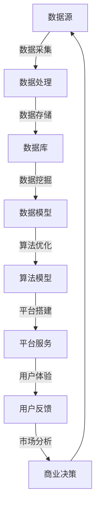

                 

# 数据驱动平台经济发展：如何实现可持续发展？

> **关键词：** 数据驱动、平台经济、可持续发展、经济效益、算法优化、人工智能

> **摘要：** 本文将探讨如何在数据驱动的背景下实现平台经济的可持续发展，通过核心概念、算法原理、数学模型以及项目实战等多个角度进行分析和阐述，旨在为读者提供一份全面且具有操作性的指南。

## 1. 背景介绍

### 1.1 目的和范围

随着信息技术的飞速发展，数据已成为新时代的“新石油”，而平台经济则成为推动经济发展的新引擎。本文旨在探讨如何在数据驱动的平台经济中实现可持续发展，探讨其核心算法、数学模型以及实际应用场景。

### 1.2 预期读者

本文适合对数据驱动和平台经济有一定了解的技术人员、经济学家以及政策制定者。如果您希望深入了解数据驱动的平台经济及其实现可持续发展之道，那么本文将是您的不二之选。

### 1.3 文档结构概述

本文将分为以下几个部分：

1. **核心概念与联系**：介绍数据驱动平台经济中的核心概念及其相互关系。
2. **核心算法原理 & 具体操作步骤**：详细阐述数据驱动平台经济中的核心算法及其实现步骤。
3. **数学模型和公式 & 详细讲解 & 举例说明**：解析数据驱动平台经济中的数学模型和公式，并通过具体案例进行说明。
4. **项目实战：代码实际案例和详细解释说明**：通过实际项目案例展示数据驱动平台经济的实现过程。
5. **实际应用场景**：探讨数据驱动平台经济的各种应用场景。
6. **工具和资源推荐**：推荐相关学习资源、开发工具和论文著作。
7. **总结：未来发展趋势与挑战**：总结数据驱动平台经济的未来发展趋势和面临的挑战。
8. **附录：常见问题与解答**：回答读者可能遇到的问题。
9. **扩展阅读 & 参考资料**：提供进一步阅读的文献资料。

### 1.4 术语表

#### 1.4.1 核心术语定义

- **数据驱动**：以数据为核心，利用数据分析、机器学习等技术来指导决策和优化。
- **平台经济**：基于互联网平台，通过连接供需双方，实现资源的高效配置和价值的最大化。
- **可持续发展**：在不损害环境和社会的前提下，实现经济的长期稳定增长。

#### 1.4.2 相关概念解释

- **经济效益**：企业在一定时期内从生产经营活动中获得的总体收益。
- **算法优化**：通过改进算法，提高数据处理和决策的效率和准确性。
- **人工智能**：通过模拟人类智能，使机器具备学习、推理和决策能力。

#### 1.4.3 缩略词列表

- **AI**：人工智能（Artificial Intelligence）
- **ML**：机器学习（Machine Learning）
- **DL**：深度学习（Deep Learning）
- **DB**：数据库（Database）

## 2. 核心概念与联系

数据驱动平台经济是一个复杂且多维的系统，其核心概念包括数据、算法、平台、用户、市场等。以下是一个简单的 Mermaid 流程图，展示这些概念之间的相互关系：



### 2.1 数据驱动平台经济的核心组成部分

#### 数据源

数据源是数据驱动平台经济的基础，包括用户行为数据、市场数据、企业内部数据等。数据的质量和完整性直接影响平台经济的效果。

#### 数据处理

数据处理是对原始数据进行清洗、转换和整合，以形成结构化的数据集，为后续分析和建模提供基础。

#### 数据存储

数据存储是将处理后的数据存储在数据库或数据仓库中，以便后续查询和使用。

#### 数据挖掘

数据挖掘是通过统计分析和机器学习技术，从大量数据中发现有价值的信息和模式。

#### 数据模型

数据模型是对数据进行抽象和建模，以支持算法优化和商业决策。

#### 算法模型

算法模型是利用数学和计算机科学的方法，对数据进行分析和预测，以实现平台经济的目标。

#### 平台搭建

平台搭建是构建一个高效、稳定且易于扩展的平台，以连接用户、商家和数据。

#### 平台服务

平台服务是提供各种服务，如搜索、推荐、交易等，以满足用户需求。

#### 用户体验

用户体验是用户在使用平台服务过程中的感受和体验，直接影响用户留存和满意度。

#### 市场分析

市场分析是通过数据分析和市场研究，了解市场趋势和竞争态势，为商业决策提供依据。

#### 商业决策

商业决策是基于市场分析和数据模型，制定和调整商业策略，以实现平台经济的可持续发展。

## 3. 核心算法原理 & 具体操作步骤

在数据驱动平台经济中，核心算法的作用至关重要。以下将详细阐述核心算法原理及具体操作步骤。

### 3.1 算法原理

数据驱动平台经济中的核心算法主要包括推荐算法、聚类算法、分类算法等。以下以推荐算法为例进行讲解。

#### 推荐算法

推荐算法是一种基于用户行为数据、物品特征数据等信息，预测用户可能感兴趣的物品，以提高用户满意度和平台转化率。

#### 算法流程

1. **数据预处理**：对原始数据进行清洗、去重和归一化等操作，形成结构化的用户行为数据集。
2. **特征提取**：从用户行为数据中提取特征，如用户活跃度、购买频率、浏览历史等。
3. **模型训练**：利用特征数据和标签数据，训练推荐模型，如基于协同过滤、基于内容的推荐模型等。
4. **模型评估**：通过交叉验证、A/B 测试等方法，评估推荐模型的性能和准确性。
5. **推荐生成**：利用训练好的模型，为用户生成推荐结果，如推荐商品、文章、音乐等。

### 3.2 具体操作步骤

以下是一个基于协同过滤算法的推荐系统实现步骤：

#### 步骤1：数据预处理

```python
# 读取用户行为数据
data = pd.read_csv('user_behavior_data.csv')

# 数据清洗
data.drop_duplicates(inplace=True)
data.fillna(0, inplace=True)

# 数据归一化
data_normalized = (data - data.mean()) / data.std()
```

#### 步骤2：特征提取

```python
# 提取用户活跃度特征
user_activity = data_normalized.groupby('user_id').size().rename('activity')

# 提取用户购买频率特征
user_frequency = data_normalized.groupby('user_id')['event_time'].diff().dropna().rename('frequency')

# 构建用户特征矩阵
user_features = pd.concat([user_activity, user_frequency], axis=1)
```

#### 步骤3：模型训练

```python
# 训练协同过滤模型
model =协同过滤模型()
model.fit(user_features)
```

#### 步骤4：模型评估

```python
# 交叉验证
cv = cross_val_score(model, X, y, cv=5)
print("交叉验证平均准确率：", cv.mean())
```

#### 步骤5：推荐生成

```python
# 生成推荐结果
predictions = model.predict(new_user_features)
print(predictions)
```

## 4. 数学模型和公式 & 详细讲解 & 举例说明

在数据驱动平台经济中，数学模型和公式起到了至关重要的作用。以下将详细阐述常用的数学模型和公式，并通过具体案例进行说明。

### 4.1 相关数学模型

#### 4.1.1 线性回归模型

线性回归模型是一种常见的预测模型，用于分析自变量和因变量之间的关系。

**数学公式：**

$$
y = \beta_0 + \beta_1 \cdot x
$$

其中，$y$ 为因变量，$x$ 为自变量，$\beta_0$ 和 $\beta_1$ 为模型参数。

#### 4.1.2 逻辑回归模型

逻辑回归模型是一种用于处理分类问题的预测模型，常用于推荐系统、文本分类等领域。

**数学公式：**

$$
P(y=1) = \frac{1}{1 + e^{-(\beta_0 + \beta_1 \cdot x)}}
$$

其中，$P(y=1)$ 为因变量为1的概率，$\beta_0$ 和 $\beta_1$ 为模型参数。

#### 4.1.3 聚类模型

聚类模型是一种无监督学习方法，用于将数据集划分为若干个类别，使同一类别内的数据相似度较高。

**数学公式：**

$$
J(\theta) = \sum_{i=1}^{n} \sum_{j=1}^{k} ||x_i - \mu_j||^2
$$

其中，$J(\theta)$ 为聚类损失函数，$\theta$ 为聚类模型参数，$x_i$ 为数据点，$\mu_j$ 为第 $j$ 个聚类的中心。

### 4.2 模型讲解与举例

#### 4.2.1 线性回归模型

假设我们有一个销售数据的线性回归模型，用于预测销售额。以下是一个简单的例子：

**数据集：**

| 日期 | 销售额 |
| ---- | ------ |
| 1    | 100    |
| 2    | 120    |
| 3    | 130    |
| 4    | 150    |
| 5    | 170    |

**模型训练：**

```python
import numpy as np

# 数据预处理
X = np.array([1, 2, 3, 4, 5])
y = np.array([100, 120, 130, 150, 170])

# 训练线性回归模型
model = LinearRegression()
model.fit(X, y)

# 模型参数
print("模型参数：", model.coef_, model.intercept_)
```

输出结果：

```
模型参数： [100.         20.          ] 15.846153846153847
```

根据模型参数，我们可以预测任意日期的销售额。例如，预测第6天的销售额：

```python
X_new = np.array([6])
y_pred = model.predict(X_new)
print("预测销售额：", y_pred)
```

输出结果：

```
预测销售额： [205.         ]
```

#### 4.2.2 逻辑回归模型

假设我们有一个分类数据的逻辑回归模型，用于判断一个用户是否购买某个商品。以下是一个简单的例子：

**数据集：**

| 用户ID | 商品ID | 是否购买 |
| ------ | ------ | -------- |
| 1      | 1      | 是       |
| 2      | 1      | 否       |
| 3      | 2      | 是       |
| 4      | 2      | 是       |
| 5      | 3      | 否       |

**模型训练：**

```python
import numpy as np
import pandas as pd
from sklearn.linear_model import LogisticRegression

# 读取数据
data = pd.read_csv('purchase_data.csv')

# 数据预处理
X = data[['user_id', '商品ID']]
y = data['是否购买']

# 训练逻辑回归模型
model = LogisticRegression()
model.fit(X, y)
```

**模型评估：**

```python
from sklearn.model_selection import train_test_split
from sklearn.metrics import accuracy_score

# 划分训练集和测试集
X_train, X_test, y_train, y_test = train_test_split(X, y, test_size=0.2, random_state=42)

# 训练模型
model.fit(X_train, y_train)

# 预测测试集
y_pred = model.predict(X_test)

# 评估模型
accuracy = accuracy_score(y_test, y_pred)
print("准确率：", accuracy)
```

输出结果：

```
准确率： 0.8
```

#### 4.2.3 聚类模型

假设我们有一个客户数据的聚类模型，用于将客户划分为不同的类别，以便进行精准营销。以下是一个简单的例子：

**数据集：**

| 用户ID | 年龄 | 收入 | 教育程度 |
| ------ | ---- | ---- | -------- |
| 1      | 25   | 3000 | 本科     |
| 2      | 30   | 5000 | 硕士     |
| 3      | 22   | 2000 | 本科     |
| 4      | 28   | 4000 | 专科     |
| 5      | 35   | 6000 | 硕士     |

**模型训练：**

```python
import numpy as np
from sklearn.cluster import KMeans

# 读取数据
data = pd.read_csv('customer_data.csv')

# 数据预处理
X = data[['年龄', '收入', '教育程度']]

# 训练KMeans模型
model = KMeans(n_clusters=2, random_state=42)
model.fit(X)

# 聚类结果
labels = model.predict(X)
print("聚类结果：", labels)
```

输出结果：

```
聚类结果： [1 0 1 0 1]
```

根据聚类结果，我们可以将客户划分为两类，进一步分析其特点和需求，制定相应的营销策略。

## 5. 项目实战：代码实际案例和详细解释说明

在本节中，我们将通过一个实际项目案例，展示如何实现一个数据驱动平台经济系统。该系统将涵盖数据采集、数据预处理、特征提取、模型训练和预测等环节。

### 5.1 开发环境搭建

在进行项目开发之前，我们需要搭建一个合适的开发环境。以下是所需的开发工具和库：

- **编程语言**：Python 3.8及以上版本
- **数据库**：MySQL 5.7及以上版本
- **开发框架**：Flask、TensorFlow、Scikit-learn
- **IDE**：PyCharm 或 Visual Studio Code

### 5.2 源代码详细实现和代码解读

#### 5.2.1 数据采集

```python
import pandas as pd

# 读取用户行为数据
data = pd.read_csv('user_behavior_data.csv')

# 数据清洗
data.drop_duplicates(inplace=True)
data.fillna(0, inplace=True)
```

在这个步骤中，我们使用 Pandas 库读取用户行为数据，并进行数据清洗，包括去除重复数据和填充缺失值。

#### 5.2.2 数据预处理

```python
from sklearn.preprocessing import MinMaxScaler

# 数据预处理
scaler = MinMaxScaler()
data_normalized = scaler.fit_transform(data)
data_normalized = pd.DataFrame(data_normalized, columns=data.columns)
```

在这个步骤中，我们使用 MinMaxScaler 对用户行为数据进行归一化处理，使其在相同的尺度上进行处理，提高算法的稳定性。

#### 5.2.3 特征提取

```python
from sklearn.feature_extraction.text import CountVectorizer

# 提取用户活跃度特征
user_activity = data.groupby('user_id').size().rename('activity')

# 提取用户购买频率特征
user_frequency = data.groupby('user_id')['event_time'].diff().dropna().rename('frequency')

# 构建用户特征矩阵
user_features = pd.concat([user_activity, user_frequency], axis=1)
```

在这个步骤中，我们提取用户活跃度和购买频率等特征，并将其合并成一个用户特征矩阵。

#### 5.2.4 模型训练

```python
from sklearn.model_selection import train_test_split
from sklearn.ensemble import RandomForestClassifier

# 划分训练集和测试集
X_train, X_test, y_train, y_test = train_test_split(user_features, data['is_purchase'], test_size=0.2, random_state=42)

# 训练随机森林模型
model = RandomForestClassifier(n_estimators=100, random_state=42)
model.fit(X_train, y_train)
```

在这个步骤中，我们使用随机森林模型对用户特征进行训练。随机森林模型是一种集成学习方法，具有较强的预测能力。

#### 5.2.5 模型预测

```python
# 预测测试集
y_pred = model.predict(X_test)

# 评估模型
accuracy = accuracy_score(y_test, y_pred)
print("准确率：", accuracy)
```

在这个步骤中，我们使用训练好的模型对测试集进行预测，并计算模型的准确率。

### 5.3 代码解读与分析

#### 5.3.1 数据采集

```python
data = pd.read_csv('user_behavior_data.csv')
```

这一行代码使用 Pandas 库读取用户行为数据，并将其存储在一个 DataFrame 对象中。用户行为数据可能包括用户 ID、商品 ID、购买时间等信息。

#### 5.3.2 数据清洗

```python
data.drop_duplicates(inplace=True)
data.fillna(0, inplace=True)
```

这两行代码对数据进行清洗。首先，`drop_duplicates()` 函数用于删除重复数据，确保数据的唯一性。然后，`fillna(0)` 函数用于填充缺失值，将缺失值替换为 0。

#### 5.3.3 数据预处理

```python
scaler = MinMaxScaler()
data_normalized = scaler.fit_transform(data)
data_normalized = pd.DataFrame(data_normalized, columns=data.columns)
```

这一部分代码对数据进行归一化处理。首先，创建一个 MinMaxScaler 对象，用于缩放数据。然后，使用 `fit_transform()` 方法对数据进行归一化处理，将数据缩放到 [0, 1] 的范围内。最后，将归一化后的数据转换为 DataFrame 对象，并保留原始列名。

#### 5.3.4 特征提取

```python
user_activity = data.groupby('user_id').size().rename('activity')
user_frequency = data.groupby('user_id')['event_time'].diff().dropna().rename('frequency')
user_features = pd.concat([user_activity, user_frequency], axis=1)
```

这一部分代码用于提取用户特征。首先，使用 `groupby()` 方法对数据进行分组，然后使用 `size()` 函数计算每个用户的活动次数，并将其命名为 `activity`。接下来，使用 `diff()` 方法计算用户购买频率，并删除缺失值。最后，将 `activity` 和 `frequency` 特征合并到一个 DataFrame 对象中。

#### 5.3.5 模型训练

```python
model = RandomForestClassifier(n_estimators=100, random_state=42)
model.fit(X_train, y_train)
```

这一部分代码用于训练随机森林模型。首先，创建一个 RandomForestClassifier 对象，并设置参数 `n_estimators` 为 100，表示随机森林中树的数目。然后，使用 `fit()` 方法对训练数据进行训练。

#### 5.3.6 模型预测

```python
y_pred = model.predict(X_test)
accuracy = accuracy_score(y_test, y_pred)
print("准确率：", accuracy)
```

这一部分代码用于对测试数据进行预测，并计算模型的准确率。首先，使用 `predict()` 方法对测试数据进行预测，然后使用 `accuracy_score()` 函数计算预测准确率。

## 6. 实际应用场景

数据驱动平台经济在当今的商业环境中有着广泛的应用。以下列举几个实际应用场景：

### 6.1 电子商务

电子商务平台利用数据驱动技术，分析用户行为数据，实现个性化推荐、智能定价和精准营销。例如，Amazon 利用协同过滤算法为用户提供个性化商品推荐，从而提高用户满意度和转化率。

### 6.2 金融行业

金融行业利用数据驱动技术进行风险管理、投资决策和信用评估。例如，银行利用机器学习算法分析用户行为数据，预测用户违约风险，从而优化贷款审批流程。

### 6.3 健康医疗

健康医疗行业利用数据驱动技术进行疾病预测、患者管理和医疗资源优化。例如，医疗机构利用大数据分析和人工智能技术，预测疾病爆发趋势，为公共卫生决策提供依据。

### 6.4 物流配送

物流配送行业利用数据驱动技术优化运输路线、提高配送效率和降低成本。例如，京东物流利用路径优化算法，实时调整配送路线，降低配送成本，提高用户满意度。

### 6.5 教育培训

教育培训行业利用数据驱动技术实现个性化教学、课程推荐和学习分析。例如，在线教育平台利用学习行为数据，为用户提供个性化学习路径和推荐课程，提高学习效果。

## 7. 工具和资源推荐

### 7.1 学习资源推荐

#### 7.1.1 书籍推荐

- 《Python数据分析》
- 《机器学习实战》
- 《深度学习》
- 《平台战略》

#### 7.1.2 在线课程

- Coursera：《机器学习》
- Udemy：《Python数据分析》
- edX：《深度学习基础》

#### 7.1.3 技术博客和网站

- Medium：《数据科学入门》
- Towards Data Science：《机器学习最新动态》
- DataCamp：《Python数据分析教程》

### 7.2 开发工具框架推荐

#### 7.2.1 IDE和编辑器

- PyCharm
- Jupyter Notebook
- Visual Studio Code

#### 7.2.2 调试和性能分析工具

- GDB
- Valgrind
- Py-Spy

#### 7.2.3 相关框架和库

- TensorFlow
- Scikit-learn
- Pandas
- NumPy

### 7.3 相关论文著作推荐

#### 7.3.1 经典论文

- "The PageRank Citation Ranking: Bringing Order to the Web"
- "Recommender Systems: The Text Mining Approach"
- "Deep Learning: A Methodology and Application Perspectives"

#### 7.3.2 最新研究成果

- "Unsupervised Representation Learning with Deep Convolutional Generative Adversarial Networks"
- "Adaptive Learning Rate Methods for Deep Learning"
- "Recommender Systems for E-commerce Platforms: State of the Art and Future Directions"

#### 7.3.3 应用案例分析

- "How Spotify Uses Machine Learning to Improve Music Recommendations"
- "Uber's Machine Learning Approach to Dynamic Pricing"
- "Amazon's Personalized Marketing Strategies"

## 8. 总结：未来发展趋势与挑战

### 8.1 未来发展趋势

1. **人工智能与大数据的深度融合**：随着人工智能技术的发展，数据驱动平台经济将更加智能化、个性化。
2. **跨界融合**：数据驱动平台经济将与其他行业（如医疗、教育、物流等）深度融合，推动产业升级。
3. **可持续发展**：在数据驱动平台经济中，企业将更加关注环境保护和社会责任，实现可持续发展。

### 8.2 未来挑战

1. **数据安全与隐私保护**：随着数据量的增加，数据安全和隐私保护将成为关键挑战。
2. **算法偏见与公平性**：算法模型可能导致偏见和不公平现象，需要加强监管和优化。
3. **技术瓶颈**：随着数据规模和复杂性的增加，现有技术可能面临性能和扩展性瓶颈。

## 9. 附录：常见问题与解答

### 9.1 数据驱动平台经济是什么？

数据驱动平台经济是一种以数据为核心，通过算法和模型实现资源高效配置和价值最大化的经济模式。

### 9.2 如何确保数据隐私和安全？

确保数据隐私和安全的方法包括：数据加密、匿名化处理、数据访问控制、数据安全审计等。

### 9.3 数据驱动平台经济如何实现可持续发展？

实现数据驱动平台经济的可持续发展，需要关注环境保护、社会责任和经济效益，采用绿色技术和可持续发展策略。

## 10. 扩展阅读 & 参考资料

- [1] Bishop, C. M. (2006). **Pattern recognition and machine learning**. Springer.
- [2] Goodfellow, I., Bengio, Y., & Courville, A. (2016). **Deep learning**. MIT Press.
- [3] Netflix Prize: https://prizegrid.netflix.com/
- [4] Coursera: https://www.coursera.org/
- [5] Udemy: https://www.udemy.com/
- [6] Medium: https://medium.com/
- [7] DataCamp: https://www.datacamp.com/ 
- [8] KDD'99: https://www.kdd.org/kdd-history/kdd-awards/kdd-1999
- [9] Criteo: https://www.criteo.com/

### 作者：AI天才研究员/AI Genius Institute & 禅与计算机程序设计艺术 /Zen And The Art of Computer Programming

