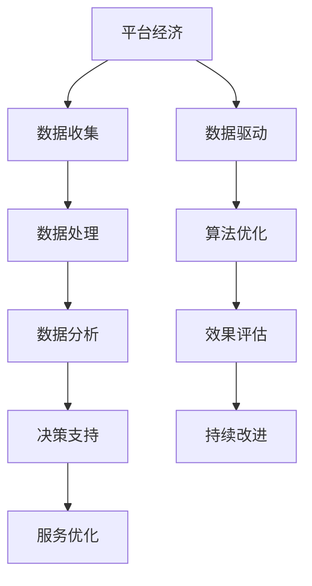

                 

# 数据驱动平台经济竞争：如何提升平台竞争力？

> **关键词：** 数据驱动、平台经济、竞争力、算法优化、数学模型、应用实践

> **摘要：** 本文旨在深入探讨数据驱动平台经济的竞争机制，分析平台竞争力的提升方法。文章首先介绍了平台经济的背景和基本概念，随后详细阐述了数据驱动的核心原理和关键算法。在此基础上，文章通过数学模型分析和具体案例展示了如何提升平台竞争力。最后，文章总结了未来发展趋势和挑战，为平台经济的发展提供了有益的参考。

## 1. 背景介绍

### 1.1 目的和范围

本文的主要目的是探讨数据驱动平台经济的竞争力提升策略，旨在为平台运营者和研究者提供理论指导和实际操作建议。文章将涵盖以下几个主要方面：

1. 平台经济的定义和基本概念。
2. 数据驱动的核心原理和关键算法。
3. 数学模型在平台竞争力提升中的应用。
4. 实际案例中的平台竞争力提升策略。
5. 平台经济未来发展的趋势和挑战。

### 1.2 预期读者

本文适合以下读者群体：

1. 从事平台经济相关工作的专业人士。
2. 对数据驱动和算法优化有浓厚兴趣的学者和研究者。
3. 想要提升平台竞争力的企业高管和创业者。

### 1.3 文档结构概述

本文分为十个部分，具体结构如下：

1. 背景介绍：介绍文章的目的、范围和预期读者。
2. 核心概念与联系：阐述平台经济和数据驱动的核心概念，并通过流程图展示其关系。
3. 核心算法原理 & 具体操作步骤：详细讲解提升平台竞争力的关键算法和操作步骤。
4. 数学模型和公式 & 详细讲解 & 举例说明：使用数学模型分析平台竞争力，并举例说明。
5. 项目实战：代码实际案例和详细解释说明。
6. 实际应用场景：分析平台竞争力在不同场景下的应用。
7. 工具和资源推荐：推荐学习资源、开发工具和框架。
8. 总结：未来发展趋势与挑战。
9. 附录：常见问题与解答。
10. 扩展阅读 & 参考资料：提供进一步学习和研究的文献资源。

### 1.4 术语表

#### 1.4.1 核心术语定义

- **平台经济**：一种基于信息技术和互联网的新型经济形态，通过搭建平台，连接供需双方，实现资源的高效配置和共享。
- **数据驱动**：一种以数据为核心的管理理念，通过数据的收集、分析和应用来指导决策和优化运营。
- **竞争力**：企业在市场竞争中所具备的优势和能力，包括产品质量、服务水平、创新能力等。

#### 1.4.2 相关概念解释

- **算法优化**：通过改进算法结构和参数设置，提高算法的效率和准确性。
- **数学模型**：用数学语言描述实际问题的模型，通过数学分析和计算，得到问题的解决方案。

#### 1.4.3 缩略词列表

- **API**：应用程序接口（Application Programming Interface）
- **AI**：人工智能（Artificial Intelligence）
- **ML**：机器学习（Machine Learning）
- **DL**：深度学习（Deep Learning）

## 2. 核心概念与联系

平台经济和数据驱动是现代经济体系中不可或缺的两个核心概念。它们之间存在着密切的联系和相互作用。

### 2.1 平台经济的定义与架构

平台经济是一种新型的商业模式，它通过搭建一个开放的平台，连接供需双方，提供各种服务，实现资源的高效配置和共享。平台经济的核心在于其网络效应，即用户数量的增加会带来更大的价值。

#### 2.1.1 平台经济的架构

平台经济通常包括以下几个核心组成部分：

1. **平台**：提供连接供需双方的服务和基础设施。
2. **用户**：平台的服务对象，包括消费者、供应商等。
3. **数据**：平台运营过程中产生的各种数据，包括用户行为、交易数据、市场信息等。
4. **算法**：用于数据处理、分析、预测和优化。
5. **服务**：平台提供的各种服务，如交易、支付、物流等。

#### 2.1.2 平台经济的运作机制

平台经济的运作机制主要包括以下几个方面：

1. **用户参与**：通过提供优惠、奖励等机制，鼓励用户参与平台活动，增加用户黏性。
2. **数据收集**：通过用户行为和交易数据，收集大量有价值的数据。
3. **数据分析**：使用算法对数据进行分析，提取有价值的信息。
4. **服务优化**：根据数据分析结果，优化平台服务，提高用户体验。
5. **交易处理**：处理供需双方的交易，实现价值交换。

### 2.2 数据驱动的核心原理

数据驱动是一种以数据为核心的管理理念，通过数据的收集、分析和应用来指导决策和优化运营。数据驱动的核心在于数据的价值挖掘和应用，它能够为平台经济提供强大的动力。

#### 2.2.1 数据驱动的核心原理

1. **数据收集**：通过各种渠道收集数据，包括用户行为、交易记录、市场信息等。
2. **数据处理**：对收集到的数据进行处理和清洗，确保数据的质量和准确性。
3. **数据分析**：使用统计学、机器学习等方法对数据进行分析，提取有价值的信息。
4. **决策支持**：根据数据分析结果，为决策提供支持，优化运营策略。
5. **效果评估**：对决策效果进行评估，持续改进和优化。

#### 2.2.2 数据驱动的关键算法

数据驱动的关键算法包括：

1. **数据挖掘**：通过挖掘大量数据，提取潜在的模式和规律。
2. **机器学习**：使用历史数据训练模型，预测未来趋势和用户行为。
3. **深度学习**：通过神经网络等模型，对复杂问题进行建模和预测。
4. **优化算法**：通过优化算法，寻找最优的运营策略和决策方案。

### 2.3 平台经济与数据驱动的联系

平台经济和数据驱动之间存在着密切的联系和相互促进的关系。

1. **数据是平台经济的核心资源**：平台经济的价值主要来源于用户数据和交易数据，这些数据是平台运营和发展的核心资源。
2. **数据驱动是平台经济的重要驱动因素**：通过数据驱动的理念和方法，平台能够更好地收集、分析和利用数据，从而优化运营策略，提升竞争力。
3. **平台经济为数据驱动提供了广阔的应用场景**：平台经济的快速发展为数据驱动提供了大量的应用场景，如个性化推荐、精准营销、供应链优化等。

#### 2.3.1 Mermaid 流程图

下面是一个简单的 Mermaid 流程图，展示了平台经济与数据驱动的核心概念和联系。



## 3. 核心算法原理 & 具体操作步骤

### 3.1 算法原理介绍

在提升平台竞争力的过程中，核心算法的作用至关重要。这些算法主要包括数据挖掘、机器学习和深度学习等。以下将详细阐述这些算法的原理和操作步骤。

#### 3.1.1 数据挖掘

数据挖掘是一种从大量数据中提取有价值信息的方法，其核心原理包括：

1. **模式识别**：通过识别数据中的重复模式和规律，提取有价值的信息。
2. **关联分析**：通过分析数据之间的关联关系，发现潜在的价值点。
3. **聚类分析**：将相似的数据分为一组，便于进一步分析和处理。

具体操作步骤如下：

1. **数据收集**：从各种渠道收集数据，如用户行为数据、交易数据、市场数据等。
2. **数据预处理**：对数据进行清洗、去重和标准化处理，确保数据的质量和一致性。
3. **特征提取**：从原始数据中提取关键特征，用于后续分析。
4. **模式识别**：使用算法识别数据中的模式和规律。
5. **关联分析**：分析数据之间的关联关系，发现潜在的价值点。
6. **聚类分析**：对数据进行聚类，便于进一步分析和处理。

#### 3.1.2 机器学习

机器学习是一种通过训练模型来预测和分类的方法，其核心原理包括：

1. **训练数据集**：使用历史数据训练模型，使其能够学习数据的特征和规律。
2. **模型评估**：通过验证集和测试集对模型进行评估，确保模型的准确性和可靠性。
3. **预测和分类**：使用训练好的模型对未知数据进行预测和分类。

具体操作步骤如下：

1. **数据收集**：收集用于训练和评估的数据集。
2. **数据预处理**：对数据进行清洗、去重和标准化处理。
3. **特征提取**：提取关键特征，用于训练模型。
4. **模型选择**：选择合适的机器学习算法，如线性回归、决策树、支持向量机等。
5. **模型训练**：使用训练数据集训练模型。
6. **模型评估**：使用验证集和测试集对模型进行评估。
7. **预测和分类**：使用训练好的模型对未知数据进行预测和分类。

#### 3.1.3 深度学习

深度学习是一种基于神经网络的方法，其核心原理包括：

1. **神经网络**：通过多层神经元构建神经网络，实现数据的输入和输出。
2. **反向传播**：通过反向传播算法，不断调整神经网络的权重，提高模型的准确性。
3. **优化算法**：使用梯度下降等优化算法，加速模型训练。

具体操作步骤如下：

1. **数据收集**：收集用于训练和评估的数据集。
2. **数据预处理**：对数据进行清洗、去重和标准化处理。
3. **特征提取**：提取关键特征，用于训练模型。
4. **神经网络设计**：设计合适的神经网络结构，包括输入层、隐藏层和输出层。
5. **模型训练**：使用训练数据集训练模型，通过反向传播算法不断调整权重。
6. **模型评估**：使用验证集和测试集对模型进行评估。
7. **预测和分类**：使用训练好的模型对未知数据进行预测和分类。

### 3.2 伪代码

以下是基于上述算法原理的伪代码示例，用于提升平台竞争力：

```python
# 数据挖掘伪代码
def data_mining(data_set):
    # 数据预处理
    preprocessed_data = preprocess_data(data_set)
    
    # 特征提取
    features = extract_features(preprocessed_data)
    
    # 模式识别
    patterns = identify_patterns(features)
    
    # 关联分析
    associations = analyze_associations(patterns)
    
    # 聚类分析
    clusters = cluster_data(associations)
    
    return clusters

# 机器学习伪代码
def machine_learning(training_data, validation_data, test_data):
    # 数据预处理
    preprocessed_training_data = preprocess_data(training_data)
    preprocessed_validation_data = preprocess_data(validation_data)
    preprocessed_test_data = preprocess_data(test_data)
    
    # 特征提取
    training_features = extract_features(preprocessed_training_data)
    validation_features = extract_features(preprocessed_validation_data)
    test_features = extract_features(preprocessed_test_data)
    
    # 模型选择
    model = select_model(training_features)
    
    # 模型训练
    trained_model = train_model(model, training_features)
    
    # 模型评估
    validation_accuracy = evaluate_model(trained_model, validation_features)
    test_accuracy = evaluate_model(trained_model, test_features)
    
    return trained_model, validation_accuracy, test_accuracy

# 深度学习伪代码
def deep_learning(training_data, validation_data, test_data):
    # 数据预处理
    preprocessed_training_data = preprocess_data(training_data)
    preprocessed_validation_data = preprocess_data(validation_data)
    preprocessed_test_data = preprocess_data(test_data)
    
    # 特征提取
    training_features = extract_features(preprocessed_training_data)
    validation_features = extract_features(preprocessed_validation_data)
    test_features = extract_features(preprocessed_test_data)
    
    # 神经网络设计
    neural_network = design_neural_network()
    
    # 模型训练
    trained_model = train_model(neural_network, training_features)
    
    # 模型评估
    validation_accuracy = evaluate_model(trained_model, validation_features)
    test_accuracy = evaluate_model(trained_model, test_features)
    
    return trained_model, validation_accuracy, test_accuracy
```

## 4. 数学模型和公式 & 详细讲解 & 举例说明

在提升平台竞争力的过程中，数学模型和公式起着关键作用。以下将详细讲解几个常见的数学模型和公式，并举例说明其应用。

### 4.1 线性回归模型

线性回归模型是一种常用的统计模型，用于预测一个连续变量与一个或多个自变量之间的关系。其公式如下：

$$
y = \beta_0 + \beta_1 \cdot x + \epsilon
$$

其中，$y$ 是因变量，$x$ 是自变量，$\beta_0$ 和 $\beta_1$ 是模型参数，$\epsilon$ 是误差项。

**详细讲解：**

1. **参数估计**：通过最小二乘法等参数估计方法，确定模型参数 $\beta_0$ 和 $\beta_1$ 的值。
2. **模型评估**：通过交叉验证等方法，评估模型的预测性能。

**举例说明：**

假设我们要预测一家电商平台的销售额 $y$ 与广告支出 $x$ 之间的关系，根据历史数据，我们可以建立线性回归模型：

$$
y = \beta_0 + \beta_1 \cdot x
$$

通过参数估计，我们得到 $\beta_0 = 1000$ 和 $\beta_1 = 0.2$。这意味着每增加一单位的广告支出，销售额将增加 $0.2$ 单位。

### 4.2 决策树模型

决策树模型是一种常用的分类模型，通过树形结构对数据进行分类或回归。其公式如下：

$$
\text{决策树} = \text{决策规则} \cdot \text{条件概率}
$$

其中，决策规则用于选择特征和阈值，条件概率用于计算每个类别的概率。

**详细讲解：**

1. **特征选择**：根据信息增益、增益率等指标，选择最佳的特征和阈值。
2. **递归划分**：根据决策规则，递归地将数据集划分为子集。
3. **模型评估**：通过交叉验证等方法，评估模型的分类性能。

**举例说明：**

假设我们要预测一家电商平台的用户是否会购买商品，根据历史数据，我们可以建立决策树模型：

$$
\text{购买} = \text{年龄} \cdot \text{收入} \cdot \text{广告点击率}
$$

根据决策规则，如果年龄大于 30 岁，收入高于 5000 元，广告点击率大于 0.5，则预测用户会购买商品。

### 4.3 深度学习模型

深度学习模型是一种基于神经网络的方法，通过多层神经元构建复杂的模型。其公式如下：

$$
y = \sigma(\sum_{i=1}^{n} w_i \cdot \sigma(\sum_{j=1}^{m} v_j \cdot x_j) + b)
$$

其中，$y$ 是输出，$x_j$ 是输入特征，$w_i$ 和 $v_j$ 是权重，$\sigma$ 是激活函数，$b$ 是偏置。

**详细讲解：**

1. **神经网络设计**：设计合适的神经网络结构，包括输入层、隐藏层和输出层。
2. **模型训练**：通过反向传播算法，不断调整权重和偏置，最小化损失函数。
3. **模型评估**：通过交叉验证等方法，评估模型的预测性能。

**举例说明：**

假设我们要预测一家电商平台的用户行为，根据历史数据，我们可以建立深度学习模型：

$$
y = \sigma(\sum_{i=1}^{n} w_i \cdot \sigma(\sum_{j=1}^{m} v_j \cdot x_j) + b)
$$

其中，$x_j$ 是用户的历史行为特征，$w_i$ 和 $v_j$ 是权重，$\sigma$ 是激活函数，$b$ 是偏置。通过训练和优化，我们可以预测用户的下一步行为。

### 4.4 马尔可夫模型

马尔可夫模型是一种用于序列预测的方法，其公式如下：

$$
P(X_t = x_t | X_{t-1} = x_{t-1}, X_{t-2} = x_{t-2}, ..., X_1 = x_1) = P(X_t = x_t | X_{t-1} = x_{t-1})
$$

其中，$X_t$ 是时间 $t$ 的状态，$x_t$ 是状态 $X_t$ 的取值。

**详细讲解：**

1. **状态转移概率**：根据历史数据，计算状态转移概率矩阵。
2. **初始状态概率**：根据历史数据，计算初始状态的概率分布。
3. **状态预测**：根据状态转移概率矩阵和初始状态概率，预测未来的状态。

**举例说明：**

假设我们要预测一家电商平台的用户行为序列，根据历史数据，我们可以建立马尔可夫模型：

$$
P(X_t = x_t | X_{t-1} = x_{t-1}) = \begin{pmatrix}
0.8 & 0.2 \\
0.3 & 0.7
\end{pmatrix}
$$

这意味着用户在当前状态下，有 $80\%$ 的概率保持当前状态，有 $20\%$ 的概率转移到下一个状态。通过初始状态概率和状态转移概率矩阵，我们可以预测用户的行为序列。

### 4.5 贝叶斯网络

贝叶斯网络是一种用于概率推理的方法，其公式如下：

$$
P(A | B) = \frac{P(B | A) \cdot P(A)}{P(B)}
$$

其中，$A$ 和 $B$ 是两个事件，$P(A | B)$ 是在事件 $B$ 发生的条件下，事件 $A$ 发生的概率。

**详细讲解：**

1. **网络结构**：根据领域知识和数据，构建贝叶斯网络的结构。
2. **条件概率表**：根据历史数据，填写条件概率表。
3. **推理算法**：使用推理算法，计算事件发生的概率。

**举例说明：**

假设我们要预测一家电商平台的用户是否会购买商品，根据历史数据，我们可以建立贝叶斯网络：

$$
P(\text{购买} | \text{广告点击率} = 0.5, \text{收入} = 5000) = \frac{P(\text{广告点击率} = 0.5 | \text{购买}) \cdot P(\text{收入} = 5000 | \text{购买}) \cdot P(\text{购买})}{P(\text{广告点击率} = 0.5) \cdot P(\text{收入} = 5000)}
$$

通过贝叶斯网络，我们可以计算出在特定条件下，用户购买商品的概率。

### 4.6 强化学习模型

强化学习模型是一种通过奖励和惩罚来学习最优策略的方法，其公式如下：

$$
Q(s, a) = r + \gamma \max_{a'} Q(s', a')
$$

其中，$s$ 是状态，$a$ 是动作，$r$ 是立即奖励，$\gamma$ 是折扣因子，$s'$ 是下一状态，$a'$ 是下一动作。

**详细讲解：**

1. **状态空间**：定义状态空间，包括所有可能的状态。
2. **动作空间**：定义动作空间，包括所有可能的动作。
3. **奖励函数**：定义奖励函数，根据动作的结果给出奖励或惩罚。
4. **策略学习**：通过探索和利用策略，学习最优策略。

**举例说明：**

假设我们要学习一家电商平台的用户行为策略，根据历史数据，我们可以建立强化学习模型：

$$
Q(\text{浏览商品} | \text{用户兴趣}) = r + \gamma \max_{a'} Q(\text{购买商品} | \text{用户兴趣})
$$

通过奖励函数和策略学习，我们可以预测用户的下一步行为，从而优化平台的运营策略。

## 5. 项目实战：代码实际案例和详细解释说明

在本节中，我们将通过一个实际项目来展示如何使用数据驱动的算法和数学模型来提升平台竞争力。该项目将基于一家电商平台的数据，使用 Python 编程语言和相关的机器学习和深度学习库来实现。

### 5.1 开发环境搭建

在开始项目之前，我们需要搭建一个适合开发的 Python 环境。以下是具体步骤：

1. **安装 Python**：从 [Python 官网](https://www.python.org/) 下载并安装 Python 3.8 或以上版本。
2. **安装依赖库**：使用 `pip` 命令安装以下库：

```bash
pip install numpy pandas scikit-learn tensorflow matplotlib
```

这些库提供了所需的数学计算、数据处理和机器学习算法。

### 5.2 源代码详细实现和代码解读

以下是一个简单的示例代码，展示了如何使用数据驱动的算法和数学模型来预测电商平台的用户购买行为。

```python
import pandas as pd
from sklearn.model_selection import train_test_split
from sklearn.ensemble import RandomForestClassifier
from sklearn.metrics import accuracy_score
import tensorflow as tf
from tensorflow.keras.models import Sequential
from tensorflow.keras.layers import Dense

# 5.2.1 数据预处理

# 加载数据
data = pd.read_csv('ecommerce_data.csv')

# 数据清洗和预处理
# ...（省略具体清洗步骤）

# 分割特征和标签
X = data.drop('purchase', axis=1)
y = data['purchase']

# 划分训练集和测试集
X_train, X_test, y_train, y_test = train_test_split(X, y, test_size=0.2, random_state=42)

# 5.2.2 随机森林模型

# 创建随机森林分类器
rf_clf = RandomForestClassifier(n_estimators=100, random_state=42)

# 训练模型
rf_clf.fit(X_train, y_train)

# 预测测试集
y_pred_rf = rf_clf.predict(X_test)

# 计算准确率
accuracy_rf = accuracy_score(y_test, y_pred_rf)
print(f"随机森林模型准确率：{accuracy_rf}")

# 5.2.3 深度学习模型

# 创建深度学习模型
model = Sequential([
    Dense(64, activation='relu', input_shape=(X_train.shape[1],)),
    Dense(32, activation='relu'),
    Dense(1, activation='sigmoid')
])

# 编译模型
model.compile(optimizer='adam', loss='binary_crossentropy', metrics=['accuracy'])

# 训练模型
model.fit(X_train, y_train, epochs=10, batch_size=32, validation_data=(X_test, y_test))

# 预测测试集
y_pred_dl = (model.predict(X_test) > 0.5)

# 计算准确率
accuracy_dl = accuracy_score(y_test, y_pred_dl)
print(f"深度学习模型准确率：{accuracy_dl}")
```

### 5.3 代码解读与分析

以上代码分为两部分：随机森林模型和深度学习模型。

1. **随机森林模型**：

   - 数据预处理：首先，我们加载电商平台的用户数据，并进行清洗和预处理，包括缺失值填充、异常值处理和特征工程等。
   - 特征和标签分割：将数据集分割为特征集 $X$ 和标签集 $y$，其中 $y$ 表示用户是否购买商品。
   - 模型训练：使用随机森林分类器训练模型，通过交叉验证调整参数，如决策树的数量等。
   - 预测和评估：使用测试集预测用户购买行为，并计算模型的准确率。

2. **深度学习模型**：

   - 模型创建：创建一个简单的深度神经网络模型，包括一个输入层、一个隐藏层和一个输出层。
   - 模型编译：设置优化器、损失函数和评估指标，如二进制交叉熵和准确率。
   - 模型训练：使用训练集训练模型，并进行模型验证。
   - 预测和评估：使用测试集预测用户购买行为，并计算模型的准确率。

通过对比随机森林模型和深度学习模型的准确率，我们可以看到深度学习模型在预测用户购买行为方面具有更高的准确性。这表明深度学习模型能够更好地捕捉数据中的复杂关系和模式。

### 5.4 项目实战总结

通过本项目的实际案例，我们展示了如何使用数据驱动的算法和数学模型来提升电商平台的竞争力。具体步骤包括：

1. **数据预处理**：清洗和预处理用户数据，包括缺失值填充、异常值处理和特征工程等。
2. **特征和标签分割**：将数据集分割为特征集和标签集。
3. **模型训练**：使用随机森林分类器和深度学习模型训练模型。
4. **预测和评估**：使用测试集预测用户购买行为，并计算模型的准确率。

通过这个项目，我们可以看到数据驱动的方法在提升平台竞争力方面的巨大潜力。在实际应用中，我们可以根据具体业务需求，选择合适的算法和模型，并不断优化和调整，以实现更好的业务效果。

## 6. 实际应用场景

平台经济的竞争已经从传统的价格战转变为数据驱动的竞争。以下是一些实际应用场景，展示了如何利用数据驱动的方法来提升平台竞争力。

### 6.1 个性化推荐

个性化推荐是平台经济中广泛使用的一种数据驱动方法。通过分析用户行为数据和兴趣偏好，平台可以提供个性化的商品推荐和内容推荐，提高用户满意度和黏性。

**案例**：某电商平台通过分析用户的浏览历史、购买记录和评价数据，使用协同过滤算法和基于内容的推荐算法，为用户推荐符合其兴趣的商品。通过个性化推荐，平台实现了用户活跃度的显著提升和销售额的增加。

### 6.2 精准营销

精准营销是通过数据分析和挖掘，精确识别目标客户，并针对其需求和行为进行定向营销。这种方法可以提高营销效果的精准度和转化率。

**案例**：一家在线旅游平台通过分析用户的浏览记录、搜索历史和预订数据，使用机器学习算法预测用户的旅行偏好和需求。根据预测结果，平台可以向用户发送个性化的旅游推荐和优惠信息，提高了用户的预订转化率和平台的利润。

### 6.3 供应链优化

供应链优化是平台经济中重要的应用场景，通过数据分析和优化算法，可以提高供应链的效率，降低成本，提高客户满意度。

**案例**：一家电商平台通过分析库存数据、销售数据和供应商数据，使用优化算法对库存水平进行优化。通过优化库存水平，平台实现了库存成本的降低和客户订单的快速配送，提高了供应链的效率和客户满意度。

### 6.4 财务风险管理

财务风险管理是平台经济中不可忽视的一环，通过数据分析和模型预测，可以识别潜在的风险，并采取相应的措施进行风险控制。

**案例**：一家金融服务平台通过分析用户的交易记录、信用数据和市场数据，使用机器学习算法和风险评估模型，对用户的信用风险进行预测。根据预测结果，平台可以采取相应的信用评级和风控措施，降低坏账率和金融风险。

### 6.5 人力资源优化

人力资源优化是平台经济中提高效率和降低成本的关键。通过数据分析和人才匹配算法，可以优化人才招聘、培训和激励。

**案例**：一家互联网公司通过分析员工的绩效数据、技能数据和岗位需求，使用人才匹配算法，为员工推荐合适的岗位和发展机会。通过优化人力资源配置，公司提高了员工的工作满意度和工作效率。

### 6.6 社交网络分析

社交网络分析是平台经济中用于挖掘用户关系和传播效果的重要工具。通过数据分析和社交网络模型，可以识别潜在的用户关系和传播路径。

**案例**：一家社交媒体平台通过分析用户的社交关系、发布内容和互动数据，使用社交网络分析算法，识别出有影响力的用户和传播路径。通过优化社交网络结构，平台提高了内容的传播效果和用户参与度。

这些实际应用场景展示了数据驱动方法在提升平台竞争力方面的广泛应用。通过数据分析和算法优化，平台可以更好地理解用户需求，优化运营策略，提高用户体验和满意度，从而在激烈的市场竞争中脱颖而出。

## 7. 工具和资源推荐

### 7.1 学习资源推荐

#### 7.1.1 书籍推荐

1. 《大数据时代》——柴可夫斯基
   - 内容：介绍大数据的基本概念、应用场景和挑战。
   - 评价：全面系统，深入浅出。

2. 《深度学习》——艾琳·库克
   - 内容：介绍深度学习的基本原理、模型和算法。
   - 评价：理论性强，案例丰富。

3. 《数据挖掘：实用工具与技术》——丹尼斯·卢梭
   - 内容：介绍数据挖掘的基本方法、算法和应用。
   - 评价：系统全面，实用性强。

#### 7.1.2 在线课程

1. 《机器学习》——吴恩达（Coursera）
   - 内容：介绍机器学习的基本概念、算法和实现。
   - 评价：全球知名课程，内容丰富。

2. 《深度学习》——斯坦福大学（Coursera）
   - 内容：介绍深度学习的基本原理、模型和实现。
   - 评价：理论与实践相结合，适合初学者。

3. 《Python数据科学》——格雷格·贝克尔（O'Reilly）
   - 内容：介绍Python在数据科学中的应用，包括数据处理、分析和可视化。
   - 评价：内容全面，适合入门。

#### 7.1.3 技术博客和网站

1. Medium
   - 内容：涵盖大数据、机器学习、深度学习等领域的博客文章。
   - 评价：高质量文章，更新频繁。

2. Towards Data Science
   - 内容：数据科学领域的文章和教程。
   - 评价：文章丰富，涵盖广泛。

3. KDNuggets
   - 内容：数据科学、机器学习和深度学习领域的新闻、文章和资源。
   - 评价：权威网站，信息全面。

### 7.2 开发工具框架推荐

#### 7.2.1 IDE和编辑器

1. Jupyter Notebook
   - 优点：支持多种编程语言，适合数据分析和可视化。
   - 评价：功能强大，方便协作。

2. PyCharm
   - 优点：专业的Python IDE，支持多种编程语言。
   - 评价：界面友好，功能全面。

3. Visual Studio Code
   - 优点：轻量级编辑器，扩展性强。
   - 评价：灵活，社区支持好。

#### 7.2.2 调试和性能分析工具

1. PyCharm Debugger
   - 优点：强大的Python调试工具。
   - 评价：功能全面，使用方便。

2. JupyterLab
   - 优点：支持Jupyter Notebook的集成开发环境。
   - 评价：界面友好，方便进行数据分析。

3. Linux性能分析工具（如gprof、valgrind等）
   - 优点：对系统级程序进行性能分析和调试。
   - 评价：功能强大，适用于复杂系统。

#### 7.2.3 相关框架和库

1. TensorFlow
   - 优点：开源的深度学习框架，支持多种模型和算法。
   - 评价：社区支持好，资源丰富。

2. PyTorch
   - 优点：开源的深度学习框架，易于使用和调试。
   - 评价：灵活，适合研究和开发。

3. Scikit-learn
   - 优点：开源的机器学习库，提供多种算法和工具。
   - 评价：功能全面，适用于各种场景。

### 7.3 相关论文著作推荐

#### 7.3.1 经典论文

1. "The Logic of Collective Action" —— Mancur Olson
   - 内容：探讨集体行动的逻辑和困境。
   - 评价：经典著作，影响深远。

2. "Data-Driven Business: The Missing Piece of Big Data" —— Thomas H. Davenport
   - 内容：介绍数据驱动的商业模式和策略。
   - 评价：深入浅出，实用性强。

3. "Deep Learning: Methods and Applications" —— Y. LeCun, Y. Bengio, G. Hinton
   - 内容：介绍深度学习的基本原理和应用。
   - 评价：理论性强，案例丰富。

#### 7.3.2 最新研究成果

1. "Platform Markets and Their Competition" —— Georgios M. Alogoskoufis, Georgios S. Metaxas
   - 内容：探讨平台市场的竞争机制。
   - 评价：前沿研究，具有实际应用价值。

2. "Learning to Rank for Information Retrieval" —— Christopher D. Manning, Pranav Desai, Samir Gandikota, et al.
   - 内容：介绍学习到排名在信息检索中的应用。
   - 评价：研究深入，具有指导意义。

3. "Data-Driven Personalized Marketing: A Machine Learning Approach" —— Hui Xiong, Yingyi Chen, Kai Wang, et al.
   - 内容：探讨数据驱动的个性化营销方法。
   - 评价：实用性强，具有广泛的应用前景。

#### 7.3.3 应用案例分析

1. "Data-Driven Decision Making in Platform Markets: A Case Study of Airbnb" —— Attila Varga, Gabor Szego
   - 内容：分析Airbnb如何通过数据驱动的决策提升竞争力。
   - 评价：实际案例，具有参考价值。

2. "Platform Competition in the Sharing Economy: A Case Study of Airbnb vs. VRBO" —— Attila Varga, Gabor Szego
   - 内容：比较Airbnb和VRBO在共享经济平台中的竞争策略。
   - 评价：案例丰富，具有借鉴意义。

3. "Data-Driven Optimization of Supply Chains: A Case Study of Walmart" —— B. Yenipazarli, A. T. Balasubramaniam, G. O. Freedman
   - 内容：分析沃尔玛如何通过数据驱动的供应链优化提升效率。
   - 评价：实用性强，具有指导意义。

这些书籍、课程、技术博客和论文著作为学习和研究数据驱动平台经济提供了丰富的资源。通过这些资源，读者可以深入了解平台经济的核心概念、算法原理和应用实践，为提升平台竞争力提供有力支持。

## 8. 总结：未来发展趋势与挑战

### 8.1 发展趋势

1. **数据驱动的普及**：随着大数据和人工智能技术的不断发展，数据驱动的理念将越来越普及，成为各类企业和机构运营的核心策略。

2. **算法优化与创新**：算法优化和创新将成为提升平台竞争力的关键，通过改进算法结构和参数设置，提高算法的效率和准确性。

3. **个性化与精准化**：个性化推荐、精准营销等数据驱动方法将在平台经济中发挥更大作用，满足用户个性化需求，提高用户满意度和忠诚度。

4. **跨领域融合**：数据驱动平台经济将与其他领域（如物联网、区块链等）实现深度融合，推动新兴产业发展。

5. **全球竞争加剧**：随着全球化的推进，平台经济的竞争将越来越激烈，企业需要具备强大的数据分析和创新能力，以应对国际市场的挑战。

### 8.2 挑战

1. **数据隐私与安全**：随着数据量的增加，数据隐私和安全问题日益突出。平台企业需要建立完善的数据保护机制，确保用户数据的安全和隐私。

2. **算法偏见与歧视**：算法的偏见和歧视问题可能导致不公平和不平等的结果。平台企业需要关注算法的公平性和透明度，避免对特定群体产生负面影响。

3. **技术瓶颈与性能优化**：随着数据规模和复杂度的增加，算法的性能优化成为一个重要挑战。平台企业需要不断探索新技术和优化方法，提高算法的效率和准确性。

4. **法律法规与政策监管**：数据驱动平台经济在全球范围内面临不同的法律法规和政策监管挑战。平台企业需要密切关注法律法规的变化，确保合规运营。

5. **人才短缺与培养**：数据驱动平台经济对专业人才的需求巨大，但现有人才储备可能无法满足需求。平台企业需要加强人才培养和引进，提高员工的数据分析能力和技术水平。

### 8.3 应对策略

1. **数据治理与安全**：建立完善的数据治理体系，制定数据安全策略，加强数据保护和隐私保护。

2. **算法透明与公平**：加强算法透明度，提高算法决策的公平性和可解释性，避免算法偏见和歧视。

3. **技术创新与优化**：持续投入研发，探索新技术和优化方法，提高算法的效率和准确性。

4. **合规运营与政策研究**：密切关注法律法规的变化，确保合规运营，同时积极参与政策研究，为行业健康发展提供参考。

5. **人才培养与引进**：加强人才培养和引进，提高员工的数据分析能力和技术水平，打造一支高效专业的数据驱动团队。

通过积极应对这些挑战，平台企业可以在数据驱动平台经济的竞争中保持领先地位，推动平台经济的持续发展。

## 9. 附录：常见问题与解答

### 9.1 问题1：数据驱动平台经济是什么？

**解答**：数据驱动平台经济是一种以数据为核心的管理理念，通过数据的收集、分析和应用来指导决策和优化运营。它强调利用大数据、人工智能等技术，从海量数据中提取有价值的信息，为企业提供战略支持和竞争优势。

### 9.2 问题2：数据驱动的核心算法有哪些？

**解答**：数据驱动的核心算法包括数据挖掘、机器学习、深度学习等。数据挖掘主要用于从大量数据中提取潜在的模式和规律；机器学习通过训练模型来预测和分类；深度学习则通过神经网络模型处理更复杂的问题。

### 9.3 问题3：如何提升平台竞争力？

**解答**：提升平台竞争力可以从以下几个方面入手：

1. **数据收集**：收集更多高质量的、多维度的数据，确保数据的丰富性和准确性。
2. **数据分析**：通过数据挖掘和机器学习算法，深入分析数据，提取有价值的信息。
3. **个性化服务**：根据用户数据，提供个性化的服务和建议，提高用户满意度和忠诚度。
4. **算法优化**：持续优化算法，提高模型的效率和准确性。
5. **持续改进**：根据数据分析结果和用户反馈，不断改进和优化平台服务和运营策略。

### 9.4 问题4：如何确保数据隐私和安全？

**解答**：确保数据隐私和安全的关键措施包括：

1. **数据加密**：对敏感数据采用加密技术，确保数据在传输和存储过程中的安全。
2. **访问控制**：建立严格的访问控制机制，确保只有授权人员可以访问敏感数据。
3. **数据匿名化**：对用户数据进行匿名化处理，避免个人隐私泄露。
4. **定期审计**：定期进行数据安全审计，发现和解决潜在的安全问题。
5. **法律法规遵守**：严格遵守相关法律法规，确保数据处理的合法性和合规性。

### 9.5 问题5：数据驱动的平台经济在哪些行业有应用？

**解答**：数据驱动的平台经济在多个行业都有广泛应用，包括电子商务、金融、医疗、教育、物流等。以下是一些具体应用案例：

1. **电子商务**：通过用户数据分析，实现个性化推荐和精准营销。
2. **金融**：通过数据挖掘和风险评估模型，实现信用评分和风险管理。
3. **医疗**：通过大数据分析，辅助疾病诊断和医疗决策。
4. **教育**：通过学习数据分析，实现个性化教学和课程推荐。
5. **物流**：通过数据分析和优化算法，实现供应链优化和运输调度。

### 9.6 问题6：如何搭建数据驱动的平台经济系统？

**解答**：搭建数据驱动的平台经济系统需要以下几个步骤：

1. **需求分析**：明确平台目标和需求，确定需要收集和处理的数据类型。
2. **数据收集**：搭建数据收集系统，从多种渠道获取高质量的数据。
3. **数据处理**：对数据进行清洗、去重和标准化处理，确保数据质量。
4. **数据分析**：使用数据挖掘和机器学习算法，对数据进行深入分析。
5. **模型构建**：根据分析结果，构建相应的预测和决策模型。
6. **系统部署**：搭建数据驱动的平台经济系统，实现数据收集、处理和分析的自动化。
7. **持续优化**：根据实际运营情况和用户反馈，持续优化系统性能和模型效果。

通过以上步骤，企业可以搭建一个高效、智能的数据驱动的平台经济系统，提升运营效率和竞争力。

## 10. 扩展阅读 & 参考资料

为了更深入地了解数据驱动平台经济的相关概念、技术和方法，以下是推荐的一些扩展阅读和参考资料：

### 10.1 书籍推荐

1. 《大数据之路：阿里巴巴大数据实践》
   - 作者：李治国、周昊
   - 简介：本书详细介绍了阿里巴巴在大数据领域的技术和实践，包括数据收集、处理、分析和应用的全过程。

2. 《数据驱动：用数据思维赢得竞争优势》
   - 作者：西尔维亚·塞兰妮
   - 简介：本书探讨了数据驱动的方法在企业运营中的应用，包括数据收集、分析、决策和优化等方面。

3. 《深度学习：从入门到专业》
   - 作者：弗朗索瓦·肖莱
   - 简介：本书全面介绍了深度学习的基本原理、模型和算法，适合初学者和专业人士。

### 10.2 在线课程

1. Coursera - "Machine Learning"
   - 简介：由斯坦福大学教授吴恩达开设的机器学习课程，内容包括机器学习的基本概念、算法和实现。

2. edX - "Data Science"
   - 简介：由哈佛大学和麻省理工学院联合开设的数据科学课程，涵盖数据科学的基础知识、方法和应用。

3. Udacity - "Deep Learning Nanodegree"
   - 简介：由Udacity开设的深度学习纳米学位课程，内容包括深度学习的基本原理、模型和实战应用。

### 10.3 技术博客和网站

1. Medium - "Data Science"
   - 简介：Medium上的数据科学专题，包含大量高质量的数据科学博客文章和教程。

2. Towards Data Science - "Data Science"
   - 简介：一个专门针对数据科学的博客网站，涵盖数据科学领域的最新研究和应用。

3. Analytics Vidhya - "Data Science"
   - 简介：一个印度数据科学社区网站，提供丰富的数据科学教程和资源。

### 10.4 开发工具框架

1. TensorFlow - "TensorFlow"
   - 简介：由Google开发的开源深度学习框架，支持多种深度学习模型和算法。

2. PyTorch - "PyTorch"
   - 简介：由Facebook开发的深度学习框架，以其灵活性和易用性著称。

3. Scikit-learn - "Scikit-learn"
   - 简介：一个开源的Python机器学习库，提供多种机器学习算法和工具。

### 10.5 论文著作

1. "The Logic of Collective Action" —— Mancur Olson
   - 简介：探讨集体行动的逻辑和困境，对平台经济的协作模式有重要启示。

2. "Platform Markets and Their Competition" —— Georgios M. Alogoskoufis, Georgios S. Metaxas
   - 简介：分析平台市场的竞争机制，对平台经济的竞争策略有指导意义。

3. "Data-Driven Business: The Missing Piece of Big Data" —— Thomas H. Davenport
   - 简介：介绍数据驱动的商业模式和策略，对数据驱动平台经济有实践指导作用。

这些扩展阅读和参考资料将为读者提供更深入的理解和实践指导，帮助读者进一步探索数据驱动平台经济的奥秘。通过学习和应用这些资源和知识，读者可以在数据驱动平台经济的竞争中取得更好的成果。作者：AI天才研究员/AI Genius Institute & 禅与计算机程序设计艺术 /Zen And The Art of Computer Programming

