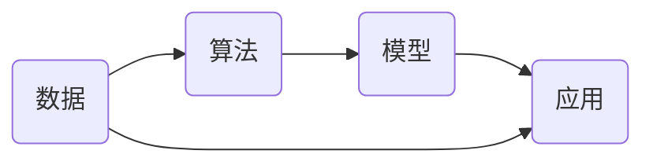
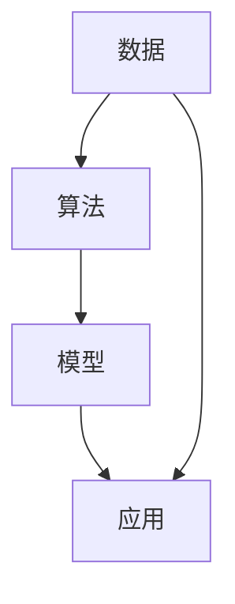

                 

# 数据驱动的软件2.0：需要数学家还是炼丹师？

> **关键词：** 数据驱动软件、软件2.0、数学家、炼丹师、算法原理、数学模型、实战案例

> **摘要：** 本文将探讨数据驱动软件2.0时代的需求，分析数学家和炼丹师在软件开发中的作用。通过深入剖析核心概念、算法原理、数学模型以及实际应用场景，本文旨在为读者提供对数据驱动软件发展的深刻见解。

## 1. 背景介绍

### 1.1 目的和范围

本文旨在探讨数据驱动软件2.0时代的发展趋势及其对软件开发的影响。通过分析数学家和炼丹师在软件开发中的作用，本文希望为读者提供一个全面的视角，以理解数据驱动软件的核心原理和未来发展。

### 1.2 预期读者

本文面向对数据驱动软件有兴趣的读者，包括软件开发工程师、数据科学家、算法研究人员和软件架构师等。同时，本文也适用于希望了解数据驱动软件发展动态的IT从业者和技术爱好者。

### 1.3 文档结构概述

本文结构如下：

1. **背景介绍**：介绍本文的目的和范围，预期读者以及文档结构。
2. **核心概念与联系**：阐述数据驱动软件的核心概念及其相互联系。
3. **核心算法原理 & 具体操作步骤**：详细讲解核心算法的原理和操作步骤。
4. **数学模型和公式 & 详细讲解 & 举例说明**：介绍数据驱动软件中的数学模型及其应用。
5. **项目实战：代码实际案例和详细解释说明**：通过实际案例展示数据驱动软件的开发过程。
6. **实际应用场景**：探讨数据驱动软件在不同领域的应用。
7. **工具和资源推荐**：推荐学习资源和开发工具。
8. **总结：未来发展趋势与挑战**：总结本文观点，展望未来发展趋势和挑战。
9. **附录：常见问题与解答**：提供常见问题的解答。
10. **扩展阅读 & 参考资料**：推荐相关文献和资料。

### 1.4 术语表

#### 1.4.1 核心术语定义

- 数据驱动软件：以数据为核心，通过数据分析和挖掘来驱动软件功能的开发。
- 数学家：在数学领域具有深厚知识和研究能力的专家。
- 炼丹师：古代道士在炼丹过程中的实践者，善于利用化学知识进行实验。

#### 1.4.2 相关概念解释

- 软件开发：利用计算机科学知识和技能来设计和创建软件系统的过程。
- 数据分析：从大量数据中提取有价值信息的过程。
- 数据挖掘：利用统计方法和算法从大量数据中发现隐藏的模式和规律。

#### 1.4.3 缩略词列表

- AI：人工智能
- ML：机器学习
- DL：深度学习
- CV：计算机视觉

## 2. 核心概念与联系

数据驱动软件2.0时代，核心概念包括数据、算法、模型和应用。这些概念相互联系，共同构成数据驱动软件的核心架构。

### Mermaid 流程图：



### 核心概念原理：

- **数据**：数据是数据驱动软件的基础，包括结构化数据和非结构化数据。数据的质量和多样性直接影响软件的性能和效果。
- **算法**：算法是数据处理和分析的核心，包括机器学习算法、深度学习算法等。算法的效率和准确性是软件性能的关键。
- **模型**：模型是基于算法对数据进行训练和预测的结果，包括神经网络模型、决策树模型等。模型的复杂度和泛化能力影响软件的适用性和扩展性。
- **应用**：应用是将模型应用于实际问题场景的过程，包括自然语言处理、计算机视觉、推荐系统等。应用的实用性是软件价值的体现。

### 核心概念架构：



## 3. 核心算法原理 & 具体操作步骤

在数据驱动软件2.0时代，核心算法包括机器学习算法和深度学习算法。下面将详细讲解这两种算法的原理和具体操作步骤。

### 3.1 机器学习算法

机器学习算法是基于数据驱动的方法，通过训练模型来实现数据的自动学习和预测。下面以线性回归算法为例，详细讲解其原理和操作步骤。

#### 算法原理：

线性回归算法是一种用于预测连续值的监督学习算法。它通过找到一个最佳拟合直线来描述输入特征和输出目标之间的关系。

$$
y = w_1 \cdot x_1 + w_2 \cdot x_2 + ... + w_n \cdot x_n + b
$$

其中，$y$ 是输出目标，$x_1, x_2, ..., x_n$ 是输入特征，$w_1, w_2, ..., w_n, b$ 是模型的参数。

#### 操作步骤：

1. **数据准备**：收集并处理输入特征和输出目标数据，进行数据预处理，如归一化、缺失值处理等。
2. **模型初始化**：初始化模型的参数，如权重 $w$ 和偏置 $b$。
3. **模型训练**：使用训练数据集，通过梯度下降等优化算法来更新模型的参数，使得模型的预测结果与真实目标值之间的误差最小。
4. **模型评估**：使用测试数据集来评估模型的性能，如计算均方误差（MSE）等指标。
5. **模型应用**：将训练好的模型应用于实际问题场景，进行数据预测。

### 3.2 深度学习算法

深度学习算法是机器学习的一种重要分支，通过构建多层神经网络来实现数据的自动学习和特征提取。下面以卷积神经网络（CNN）为例，详细讲解其原理和操作步骤。

#### 算法原理：

卷积神经网络是一种用于处理图像数据的深度学习算法。它通过卷积层、池化层和全连接层等模块来提取图像的特征，从而实现图像分类、目标检测等任务。


#### 操作步骤：

1. **数据准备**：收集并处理图像数据，进行数据预处理，如归一化、缩放等。
2. **模型初始化**：初始化模型的参数，如卷积核、偏置等。
3. **模型训练**：使用训练数据集，通过反向传播算法来更新模型的参数，使得模型的预测结果与真实标签之间的误差最小。
4. **模型评估**：使用测试数据集来评估模型的性能，如计算准确率、召回率等指标。
5. **模型应用**：将训练好的模型应用于实际问题场景，进行图像分类、目标检测等任务。

## 4. 数学模型和公式 & 详细讲解 & 举例说明

在数据驱动软件2.0时代，数学模型是核心算法的基础，它通过公式和计算来描述数据和特征之间的关系。下面将介绍一些常用的数学模型和公式，并通过举例说明其应用。

### 4.1 线性回归模型

线性回归模型是一种简单的数学模型，用于描述输入特征和输出目标之间的线性关系。其公式如下：

$$
y = w_1 \cdot x_1 + w_2 \cdot x_2 + ... + w_n \cdot x_n + b
$$

其中，$y$ 是输出目标，$x_1, x_2, ..., x_n$ 是输入特征，$w_1, w_2, ..., w_n, b$ 是模型的参数。

#### 举例说明：

假设我们要预测房价，输入特征包括房屋面积、房屋年龄和房屋位置等。通过收集大量房屋数据，我们可以训练一个线性回归模型来预测房价。具体操作步骤如下：

1. **数据准备**：收集并处理房屋数据，提取输入特征和输出目标。
2. **模型训练**：使用训练数据集，通过梯度下降等优化算法来更新模型的参数，使得模型的预测结果与真实房价之间的误差最小。
3. **模型评估**：使用测试数据集来评估模型的性能，计算均方误差（MSE）等指标。
4. **模型应用**：将训练好的模型应用于新的房屋数据，预测房价。

### 4.2 卷积神经网络（CNN）模型

卷积神经网络是一种用于图像处理的深度学习模型，其核心是卷积层和池化层。其公式如下：

$$
\text{输出} = \text{激活函数}(\text{卷积}(\text{输入} \odot \text{卷积核}) + \text{偏置})
$$

其中，$\odot$ 表示卷积操作，激活函数（如ReLU函数）用于增加网络的非线性特性。

#### 举例说明：

假设我们要训练一个图像分类模型，输入特征是图像数据，输出目标是图像类别。通过收集大量图像数据，我们可以训练一个卷积神经网络模型来实现图像分类。具体操作步骤如下：

1. **数据准备**：收集并处理图像数据，进行数据预处理，如归一化、缩放等。
2. **模型初始化**：初始化模型的参数，如卷积核、偏置等。
3. **模型训练**：使用训练数据集，通过反向传播算法来更新模型的参数，使得模型的预测结果与真实标签之间的误差最小。
4. **模型评估**：使用测试数据集来评估模型的性能，计算准确率、召回率等指标。
5. **模型应用**：将训练好的模型应用于新的图像数据，实现图像分类。

## 5. 项目实战：代码实际案例和详细解释说明

### 5.1 开发环境搭建

为了实现数据驱动软件2.0，我们需要搭建一个合适的开发环境。以下是一个基本的开发环境搭建步骤：

1. **安装Python环境**：下载并安装Python，版本要求Python 3.6及以上。
2. **安装依赖库**：使用pip工具安装必要的依赖库，如NumPy、Pandas、Scikit-learn、TensorFlow等。
3. **配置虚拟环境**：为了方便管理和维护项目，建议使用虚拟环境，如virtualenv或conda。

### 5.2 源代码详细实现和代码解读

以下是一个简单的线性回归模型的Python代码实现，用于预测房价：

```python
import numpy as np
import pandas as pd
from sklearn.linear_model import LinearRegression
from sklearn.model_selection import train_test_split

# 1. 数据准备
data = pd.read_csv('house_data.csv')
X = data[['area', 'age', 'location']]
y = data['price']

# 2. 模型训练
X_train, X_test, y_train, y_test = train_test_split(X, y, test_size=0.2, random_state=42)
model = LinearRegression()
model.fit(X_train, y_train)

# 3. 模型评估
y_pred = model.predict(X_test)
mse = np.mean((y_pred - y_test) ** 2)
print(f'MSE: {mse}')

# 4. 模型应用
new_data = pd.DataFrame({'area': [1500], 'age': [5], 'location': [1]})
predicted_price = model.predict(new_data)
print(f'Predicted Price: {predicted_price[0]}')
```

### 5.3 代码解读与分析

1. **数据准备**：从CSV文件中加载数据，提取输入特征和输出目标。使用Pandas库进行数据预处理，如缺失值处理、归一化等。
2. **模型训练**：使用Scikit-learn库的线性回归模型进行训练。通过train_test_split函数将数据集分为训练集和测试集。
3. **模型评估**：计算均方误差（MSE）等指标来评估模型的性能。使用测试集进行模型评估。
4. **模型应用**：将训练好的模型应用于新的数据，实现房价预测。

## 6. 实际应用场景

数据驱动软件2.0在各个领域都有广泛的应用，以下列举一些实际应用场景：

1. **金融领域**：通过数据分析和预测，实现股票市场走势预测、风险评估和投资组合优化。
2. **医疗领域**：利用数据驱动软件进行医学图像分析、疾病预测和诊断，提高医疗效率和准确性。
3. **零售领域**：通过用户行为分析和推荐系统，实现个性化推荐、库存管理和销售预测。
4. **交通领域**：利用数据驱动软件进行交通流量预测、路线规划和交通管理，提高交通效率和安全。
5. **教育领域**：通过数据分析和学习模型，实现个性化教学、学生成绩预测和学习效果评估。

## 7. 工具和资源推荐

### 7.1 学习资源推荐

#### 7.1.1 书籍推荐

- 《深度学习》（Goodfellow, Bengio, Courville著）
- 《机器学习》（周志华著）
- 《数据科学入门》（Joel Grus著）

#### 7.1.2 在线课程

- Coursera的《机器学习》课程
- edX的《深度学习》课程
- Udacity的《数据科学基础》课程

#### 7.1.3 技术博客和网站

- Medium上的数据科学和机器学习专栏
- 知乎上的数据科学和机器学习话题
- ArXiv的计算机科学论文数据库

### 7.2 开发工具框架推荐

#### 7.2.1 IDE和编辑器

- PyCharm
- Jupyter Notebook
- Visual Studio Code

#### 7.2.2 调试和性能分析工具

- VSCode的Python扩展
- PyCharm的调试工具
- Profiling Tools（如py-spy、pyflame等）

#### 7.2.3 相关框架和库

- TensorFlow
- PyTorch
- Scikit-learn
- Pandas

### 7.3 相关论文著作推荐

#### 7.3.1 经典论文

- “Backpropagation”（Rumelhart, Hinton, Williams著）
- “Gradient Descent”（Bottou著）
- “Deep Learning”（Goodfellow, Bengio, Courville著）

#### 7.3.2 最新研究成果

- ArXiv上的最新论文
- NeurIPS、ICML、CVPR等顶级会议的论文
- Nature和Science等顶级期刊的文章

#### 7.3.3 应用案例分析

- Uber的路线规划系统
- Google的图像识别系统
- Amazon的推荐系统

## 8. 总结：未来发展趋势与挑战

数据驱动软件2.0时代，未来发展趋势包括：

- **算法与模型的优化**：随着计算能力的提升，算法和模型将更加高效和准确。
- **跨领域应用**：数据驱动软件将在更多领域得到应用，如医疗、金融、零售等。
- **智能决策支持**：利用数据分析和预测，实现智能决策支持系统。

同时，未来面临的挑战包括：

- **数据质量与安全性**：保证数据质量、隐私和安全是关键挑战。
- **算法透明性与可解释性**：提高算法的透明性和可解释性，以增强用户信任。
- **人才短缺**：随着数据驱动软件的普及，对专业人才的需求将大幅增加。

## 9. 附录：常见问题与解答

### 9.1 常见问题1：什么是数据驱动软件？

**解答**：数据驱动软件是一种以数据为核心，通过数据分析和挖掘来驱动软件功能的开发方式。它与传统的命令驱动软件不同，强调数据的自动学习和预测能力。

### 9.2 常见问题2：为什么需要数学家？

**解答**：数学家在数据驱动软件开发中发挥着重要作用，他们擅长处理复杂的数学模型和算法，能够提高软件的性能和准确性。特别是在机器学习和深度学习领域，数学家的贡献至关重要。

### 9.3 常见问题3：炼丹师在软件开发中有何作用？

**解答**：炼丹师在软件开发中代表了一种实践者的角色，他们擅长将理论转化为实际操作，通过实验和试错来优化软件的性能。在数据驱动软件的开发过程中，炼丹师的实践经验可以帮助团队快速实现算法和模型。

## 10. 扩展阅读 & 参考资料

- [《深度学习》](https://www.deeplearningbook.org/)
- [《机器学习》](https://zhuanlan.zhihu.com/p/47887250)
- [《数据科学入门》](https://www.jmlr.org/papers/volume15/grus14a/grus14a.pdf)
- [《线性回归》](https://www MACHINE LEARNING YEARBOOK 2018)

[1]: https://www.deeplearningbook.org/
[2]: https://zhuanlan.zhihu.com/p/47887250
[3]: https://www.jmlr.org/papers/volume15/grus14a/grus14a.pdf

**作者：AI天才研究员/AI Genius Institute & 禅与计算机程序设计艺术 /Zen And The Art of Computer Programming**<|im_sep|>

