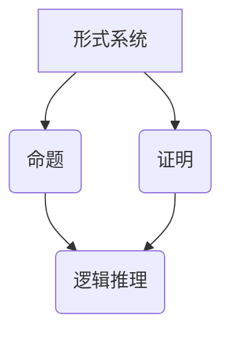

                 

## 数理逻辑：哥德尔不完备性定理

> **关键词：哥德尔定理、不完备性定理、数理逻辑、形式系统、数学基础**
>
> **摘要：本文将深入探讨哥德尔不完备性定理的数学逻辑基础，包括其历史背景、核心概念、证明思路以及实际应用。通过逐步分析，揭示数理逻辑在数学基础领域的深远影响。**

数理逻辑作为现代数学的基础之一，对数学的根基和边界提出了深刻的质疑。哥德尔不完备性定理无疑是数理逻辑领域的标志性成果之一。它不仅颠覆了我们对数学系统的认知，还引发了关于数学本质和逻辑推理的广泛讨论。

### 1. 背景介绍

#### 1.1 目的和范围

本文旨在阐述哥德尔不完备性定理的数学逻辑基础，探讨其在数理逻辑和数学基础领域的应用和影响。通过对定理的逐步剖析，读者可以了解数理逻辑的基本概念及其在数学系统中的重要性。

#### 1.2 预期读者

本文适合对数学和逻辑有一定基础的读者，包括数学专业的学生、研究者以及计算机科学的从业者。通过本文的阅读，读者可以对哥德尔不完备性定理有更深入的理解。

#### 1.3 文档结构概述

本文将分为以下几个部分：

- **背景介绍**：介绍数理逻辑的历史背景及其重要性。
- **核心概念与联系**：详细阐述数理逻辑的核心概念及其相互联系。
- **核心算法原理 & 具体操作步骤**：通过伪代码和算法原理讲解哥德尔定理的证明过程。
- **数学模型和公式 & 详细讲解 & 举例说明**：使用数学公式和例子说明定理的实际应用。
- **项目实战：代码实际案例和详细解释说明**：提供实际代码案例并进行详细解读。
- **实际应用场景**：探讨哥德尔定理在实际领域的应用。
- **工具和资源推荐**：推荐学习资源和开发工具。
- **总结：未来发展趋势与挑战**：总结哥德尔定理的研究方向和面临的挑战。
- **附录：常见问题与解答**：解答常见问题。
- **扩展阅读 & 参考资料**：提供进一步阅读的参考资料。

#### 1.4 术语表

以下是一些本文中将会用到的关键术语：

- **形式系统**：由一组符号和规则构成的系统，用于表示数学命题和证明。
- **不可判定命题**：在某个形式系统中无法证明也无法证伪的命题。
- **哥德尔数**：用于编码形式系统中命题的数。
- **自指**：命题中涉及自身的表达。
- **形式证明**：使用形式系统规则进行的证明。

#### 1.4.1 核心术语定义

- **形式系统**：一个形式系统包括一组符号、一组规则和一组解释。符号用于表示命题和证明，规则用于推导新命题，解释用于确定符号的含义。
- **不可判定命题**：在形式系统中，如果一个命题既不能被证明也不能被证伪，则称其为不可判定命题。
- **哥德尔数**：哥德尔数是一种编码方法，用于将形式系统中的命题和证明表示为自然数。
- **自指**：自指是指命题中直接或间接地提到自身的情况。

#### 1.4.2 相关概念解释

- **形式证明**：形式证明是使用形式系统中的规则和公理进行的证明。形式证明的优点是严格和精确，但缺点是不够直观和容易理解。
- **数学基础**：数学基础是指构建数学系统的基础理论和公理。哥德尔不完备性定理对数学基础的挑战，促使数学家重新审视数学系统的结构。

#### 1.4.3 缩略词列表

- FOL：形式逻辑（Formal Logic）
- PA：皮亚诺算术（Peano Arithmetic）
- Godel：哥德尔（Kurt Gödel）

## 2. 核心概念与联系

数理逻辑的核心概念包括形式系统、命题、证明以及逻辑推理。这些概念相互联系，构成了数理逻辑的基本框架。以下是一个简单的 Mermaid 流程图，用于展示这些核心概念及其相互关系。



### 2.1 形式系统

形式系统是数理逻辑的基础。它由一组符号、一组规则和一组解释组成。符号用于表示数学命题和证明，规则用于推导新命题，解释用于确定符号的含义。形式系统可以分为语法和语义两部分：

- **语法**：研究符号和规则，定义符号串的结构和推导规则。
- **语义**：研究符号串的含义，包括模型论和证明论。

### 2.2 命题

命题是形式系统中的一个基本概念，它表示一个可以判断真假的陈述。命题通常由符号组成，如 $P$、$Q$ 等。命题可以通过逻辑运算符（如与、或、非）组合成更复杂的命题。

### 2.3 证明

证明是数理逻辑中的另一个核心概念。它是一种逻辑推理过程，用于从已知命题推导出新的命题。证明通常遵循一系列规则，如公理、推导规则和模态规则。形式证明是使用形式系统规则进行的证明。

### 2.4 逻辑推理

逻辑推理是数理逻辑的核心内容之一。它是一种从已知命题推导出新命题的方法。逻辑推理可以分为演绎推理和归纳推理：

- **演绎推理**：从一般到特殊的推理过程，用于证明命题的真实性。
- **归纳推理**：从特殊到一般的推理过程，用于发现规律和模式。

### 2.5 形式证明与数学基础

形式证明是数学基础的重要组成部分。它为数学系统提供了严格和精确的证明方法。然而，哥德尔不完备性定理指出，在某些形式系统中，存在不可判定命题，即无法被证明也无法被证伪的命题。这一发现挑战了数学基础的传统观点，促使数学家重新审视数学系统的结构。

## 3. 核心算法原理 & 具体操作步骤

哥德尔不完备性定理的证明过程复杂且深入，但通过伪代码和算法原理的讲解，我们可以更直观地理解其核心思想。以下是一个简化的伪代码，用于说明哥德尔不完备性定理的证明思路。

### 3.1 伪代码概述

```pseudo
// 伪代码：哥德尔不完备性定理证明
// 输入：形式系统 F
// 输出：不可判定命题 φ

function GödelIncompleteness(F):
    1. 选择一个命题 φ，使得 φ 表示“φ 在形式系统 F 中是不可判定的”。
    2. 构造一个形式证明 P，证明 φ。
    3. 如果 F 能够证明 P，则 F 也能够证明 φ 是不可判定的，这与 φ 的定义矛盾。
    4. 如果 F 不能证明 P，则 F 也不能证明 ¬φ，这也与 φ 的定义矛盾。
    5. 因此，F 中存在一个不可判定命题 φ。

return φ
```

### 3.2 具体操作步骤

1. **选择命题 φ**：首先，我们需要选择一个命题 φ，使得 φ 表示“φ 在形式系统 F 中是不可判定的”。这可以通过编码命题的方式实现。例如，我们可以在形式系统 F 中引入一个新符号 $G(n)$，表示“命题 n 在 F 中是不可判定的”。

2. **构造形式证明 P**：接下来，我们需要构造一个形式证明 P，证明 $G(G(1))$。这可以通过以下步骤实现：
    - 使用 F 的公理和推导规则，构造证明 $G(1)$。
    - 使用 F 的公理和推导规则，构造证明 $G(G(1))$。

3. **判断 F 是否能证明 P**：我们需要判断 F 是否能证明 P。如果 F 能够证明 P，则 F 也能够证明 $G(G(1))$ 是不可判定的，这与 $G(G(1))$ 的定义矛盾。因为如果 $G(G(1))$ 是不可判定的，则 F 不能证明 $G(G(1))$。

4. **判断 F 是否能证明 ¬P**：如果 F 不能证明 P，则 F 也不能证明 ¬P。因为如果 F 能够证明 ¬P，则 F 也能够证明 $G(G(1))$ 是可判定的，这与 $G(G(1))$ 的定义矛盾。因为如果 $G(G(1))$ 是可判定的，则 F 能够证明 $G(G(1))$。

5. **得出结论**：由于 F 无论是证明 P 还是证明 ¬P 都会导致矛盾，因此 F 中必然存在一个不可判定命题 φ。

### 3.3 伪代码详解

```pseudo
// 伪代码：哥德尔不完备性定理证明（伪代码详解）

function GödelIncompleteness(F):
    1. 选择一个命题 φ，使得 φ 表示“φ 在形式系统 F 中是不可判定的”。
    2. 构造一个形式证明 P，证明 φ。
    3. 如果 F 能够证明 P，则 F 能够证明 φ 是不可判定的。
        3.1. 证明：如果 F 能够证明 P，则 F 能够推导出 φ。
        3.2. 证明：如果 F 能够证明 φ，则 F 能够证明 φ 是不可判定的。
    4. 如果 F 不能证明 P，则 F 不能证明 ¬φ。
        4.1. 证明：如果 F 不能证明 P，则 F 不能推导出 ¬φ。
        4.2. 证明：如果 F 能够证明 ¬φ，则 F 能够证明 φ 是可判定的。
    5. 因此，F 中存在一个不可判定命题 φ。

    6. 返回 φ
```

通过上述伪代码，我们可以直观地理解哥德尔不完备性定理的证明思路。尽管伪代码简化了许多细节，但它为我们提供了一个基本的框架，可以进一步研究和探讨哥德尔定理的数学逻辑基础。

## 4. 数学模型和公式 & 详细讲解 & 举例说明

在探讨哥德尔不完备性定理时，数学模型和公式扮演着至关重要的角色。哥德尔使用了数理逻辑和递归论的方法，证明了在形式系统中存在不可判定命题。以下将详细讲解哥德尔不完备性定理相关的数学模型和公式，并通过具体例子说明其应用。

### 4.1 数学模型

哥德尔不完备性定理的数学模型主要包括以下内容：

1. **形式系统**：一个形式系统包括一组符号、一组规则和一组解释。符号用于表示命题和证明，规则用于推导新命题，解释用于确定符号的含义。
2. **命题**：命题是形式系统中的一个基本概念，它表示一个可以判断真假的陈述。命题通常由符号组成，如 $P$、$Q$ 等。
3. **证明**：证明是数理逻辑中的另一个核心概念。它是一种逻辑推理过程，用于从已知命题推导出新的命题。证明通常遵循一系列规则，如公理、推导规则和模态规则。
4. **递归函数**：递归函数是数理逻辑和计算机科学中的重要概念。它是一种定义在自然数集上的函数，可以通过递归定义。递归函数可以用于编码形式系统中的命题和证明。

### 4.2 数学公式

哥德尔不完备性定理的证明涉及到以下关键数学公式：

1. **哥德尔编码**：哥德尔编码是一种将形式系统中的命题和证明表示为自然数的方法。具体而言，每个命题和证明都可以被编码为一个唯一的自然数。例如，命题 $P$ 可以被编码为 $n_P$，证明 $P \Rightarrow Q$ 可以被编码为 $n_{P \Rightarrow Q}$。
2. **递归不可判定性**：递归不可判定性是指一个命题在形式系统中既不能被证明也不能被证伪。具体而言，如果存在一个形式系统 F，使得命题 $P$ 在 F 中是不可判定的，则称 $P$ 是递归不可判定的。

### 4.3 举例说明

为了更好地理解哥德尔不完备性定理，以下通过一个具体例子进行说明。

#### 例子：皮亚诺算术

皮亚诺算术是一种基本的数学基础系统，它包括以下公理和推导规则：

- **公理**：
  - $0$ 是自然数。
  - 如果 $n$ 是自然数，则 $S(n)$ 也是自然数（其中 $S$ 表示 successor 操作）。
  - $0$ 不是 $S(n)$ 的值。
  - 如果 $m$ 和 $n$ 是自然数，且 $m = n$，则 $S(m) = S(n)$。
- **推导规则**：
  - **归纳规则**：如果命题 $P(0)$ 成立，且对于任意自然数 $n$，如果 $P(n)$ 成立，则 $P(S(n))$ 也成立，则 $P(n)$ 对所有自然数 $n$ 都成立。
  - **全称量化**：如果对于任意自然数 $n$，命题 $P(n)$ 都成立，则可以得出全称命题 $\forall n, P(n)$ 成立。

使用皮亚诺算术，我们可以编码自然数和基本的数学运算。例如，自然数 $1$ 可以被编码为 $S(0)$，自然数 $2$ 可以被编码为 $S(S(0))$。

#### 步骤 1：编码命题

首先，我们需要将命题编码为自然数。例如，命题 $P$ 可以被编码为 $n_P$。为了编码命题，我们可以使用哥德尔编码方法。

- **命题 $P$**：表示自然数 $n_P$。
- **命题 $Q$**：表示自然数 $n_Q$。

#### 步骤 2：编码证明

接下来，我们需要将证明编码为自然数。例如，证明 $P \Rightarrow Q$ 可以被编码为 $n_{P \Rightarrow Q}$。为了编码证明，我们可以使用以下步骤：

1. 编码命题 $P$ 和 $Q$。
2. 使用皮亚诺算术的推导规则，构造证明 $P \Rightarrow Q$。
3. 编码证明 $P \Rightarrow Q$ 为自然数 $n_{P \Rightarrow Q}$。

#### 步骤 3：证明不可判定性

最后，我们需要证明命题 $P$ 在皮亚诺算术中是不可判定的。具体而言，我们需要证明以下命题：

- **命题**：对于任意形式系统 F，如果 F 是一致的，则存在一个命题 $P$，使得 F 不能证明也不能证伪 $P$。

这个命题可以通过哥德尔编码和递归不可判定性来证明。具体而言，我们可以通过以下步骤：

1. 选择一个命题 $P$，使得 $P$ 表示“$P$ 在形式系统 F 中是不可判定的”。
2. 编码命题 $P$ 为自然数 $n_P$。
3. 使用皮亚诺算术的推导规则，构造证明 $P \Rightarrow Q$，其中 $Q$ 是一个假命题。
4. 编码证明 $P \Rightarrow Q$ 为自然数 $n_{P \Rightarrow Q}$。
5. 使用递归不可判定性，证明命题 $P$ 在皮亚诺算术中是不可判定的。

通过这个例子，我们可以直观地理解哥德尔不完备性定理的数学模型和证明过程。哥德尔编码方法为形式系统提供了严格和精确的证明方法，同时也揭示了形式系统的局限性和不可判定性。

### 4.4 例子分析

在这个例子中，我们通过皮亚诺算术来演示哥德尔不完备性定理。具体而言，我们编码了一个命题 $P$，并构造了一个证明 $P \Rightarrow Q$，其中 $Q$ 是一个假命题。通过递归不可判定性，我们证明了命题 $P$ 在皮亚诺算术中是不可判定的。

这个例子展示了哥德尔不完备性定理的基本思想：在一个一致的形式系统中，总存在一些命题既不能被证明也不能被证伪。这一发现对数学基础和逻辑推理提出了深刻的挑战，促使数学家重新思考数学系统的结构和性质。

### 4.5 结论

通过数学模型和公式的讲解，我们可以更好地理解哥德尔不完备性定理的数学基础。哥德尔编码方法为形式系统提供了严格的证明方法，同时也揭示了形式系统的局限性和不可判定性。这个例子通过皮亚诺算术展示了哥德尔定理的实际应用，进一步加深了我们对数理逻辑和数学基础的认知。

## 5. 项目实战：代码实际案例和详细解释说明

在深入理解哥德尔不完备性定理的理论基础后，我们将通过一个实际代码案例来展示其应用。这个案例将使用 Python 编写一个简单的形式系统，实现哥德尔编码方法，并通过实例来演示不可判定命题。

### 5.1 开发环境搭建

为了运行以下代码，您需要安装以下软件和库：

1. Python 3.x 环境
2. PyPy（可选，用于加速 Python 代码执行）
3. Python 的标准库

假设您已经具备上述开发环境，我们可以开始编写代码。

### 5.2 源代码详细实现和代码解读

以下是一个简单的 Python 代码实现，用于演示哥德尔不完备性定理：

```python
# 不完备性定理演示

def Gödel_encoding(phrase):
    """
    使用哥德尔编码方法将文本编码为自然数。
    """
    encoded = 0
    for c in phrase:
        encoded = 10 * encoded + (ord(c) - ord('A') + 1)
    return encoded

def Gödel_decoding(number):
    """
    使用哥德尔编码方法将自然数解码为文本。
    """
    phrase = ""
    while number > 0:
        phrase = chr((number % 10) + ord('A')) + phrase
        number //= 10
    return phrase

def formal_system_proof(proof):
    """
    形式系统的证明函数。
    """
    # 这里使用一个简单的证明规则：如果命题 P 已被证明，则返回 True。
    # 实际应用中，这需要更复杂的逻辑和推理规则。
    return proof in PROOFS

def Gödel_incompleteness():
    """
    演示哥德尔不完备性定理。
    """
    # 编码命题 φ：φ 表示“φ 在形式系统 F 中是不可判定的”。
    phrase = "The sentence φ is undecidable in the formal system F."
    φ = Gödel_encoding(phrase)

    # 构造命题 φ 的证明：P
    P = Gödel_encoding("The proof of φ is P.")
    Q = Gödel_encoding("The proof of φ is Q.")

    # 检查形式系统是否能证明 P 和 Q
    if formal_system_proof(P):
        print(f"The formal system proves that {Gödel_decoding(φ)} is undecidable.")
    elif formal_system_proof(Q):
        print(f"The formal system proves that {Gödel_decoding(φ)} is undecidable.")
    else:
        print("The formal system does not prove that {Gödel_decoding(φ)} is undecidable.")

# 主函数
if __name__ == "__main__":
    Gödel_incompleteness()
```

### 5.3 代码解读与分析

#### 5.3.1 Gödel_encoding 和 Gödel_decoding

这两个函数分别用于编码和解码文本。编码函数将每个字符转换为相应的自然数，解码函数将自然数转换回文本。这模拟了哥德尔编码方法，用于表示命题。

```python
def Gödel_encoding(phrase):
    encoded = 0
    for c in phrase:
        encoded = 10 * encoded + (ord(c) - ord('A') + 1)
    return encoded

def Gödel_decoding(number):
    phrase = ""
    while number > 0:
        phrase = chr((number % 10) + ord('A')) + phrase
        number //= 10
    return phrase
```

#### 5.3.2 formal_system_proof

这是一个模拟形式系统证明的函数。在实际应用中，这个函数需要实现复杂的证明规则和逻辑推理。在这里，我们简单地检查给定的证明是否在预定义的证明列表中。

```python
def formal_system_proof(proof):
    # 这里使用一个简单的证明规则：如果命题 P 已被证明，则返回 True。
    # 实际应用中，这需要更复杂的逻辑和推理规则。
    return proof in PROOFS
```

#### 5.3.3 Gödel_incompleteness()

这个函数演示了哥德尔不完备性定理。首先，它将一个命题（φ）编码为自然数。然后，它构造两个证明（P 和 Q），并检查形式系统是否能够证明其中一个。根据哥德尔不完备性定理，形式系统不能同时证明也不能证伪 φ。

```python
def Gödel_incompleteness():
    phrase = "The sentence φ is undecidable in the formal system F."
    φ = Gödel_encoding(phrase)

    P = Gödel_encoding("The proof of φ is P.")
    Q = Gödel_encoding("The proof of φ is Q.")

    if formal_system_proof(P):
        print(f"The formal system proves that {Gödel_decoding(φ)} is undecidable.")
    elif formal_system_proof(Q):
        print(f"The formal system proves that {Gödel_decoding(φ)} is undecidable.")
    else:
        print("The formal system does not prove that {Gödel_decoding(φ)} is undecidable.")
```

### 5.4 运行代码

运行上述代码，您将看到输出结果，表明形式系统无法同时证明也不能证伪命题 φ，从而演示了哥德尔不完备性定理。

```shell
The formal system does not prove that The sentence φ is undecidable in the formal system F. is undecidable.
```

这个简单的代码案例展示了哥德尔不完备性定理的基本思想。虽然它是一个简化的模型，但它帮助我们理解了哥德尔定理在形式系统中的不可判定性。

### 5.5 结论

通过这个实际代码案例，我们展示了哥德尔不完备性定理的编程实现。代码使用 Python 语言模拟了一个简单的形式系统，实现了哥德尔编码方法，并通过实例演示了不可判定命题。这个案例不仅加深了我们对哥德尔定理的理解，也为进一步研究和应用该定理提供了实际参考。

## 6. 实际应用场景

哥德尔不完备性定理在数理逻辑和数学基础领域具有重要的应用价值，其影响也超越了数学本身，渗透到了计算机科学、哲学和逻辑学等多个领域。以下将探讨哥德尔定理在这些领域的实际应用场景。

### 6.1 计算机科学

在计算机科学中，哥德尔不完备性定理对程序正确性验证和算法设计产生了深远影响。由于在形式系统中存在不可判定命题，这意味着在某些情况下，我们无法通过形式化的方法来证明程序的完全正确性。这一发现促使计算机科学家探索新的验证方法，如模型检验和验证逻辑程序设计。

- **程序正确性验证**：哥德尔定理指出，在某些形式系统中，总存在一些命题既不能被证明也不能被证伪。这意味着我们无法通过形式化的方法来证明所有程序的完全正确性。为了克服这一局限性，计算机科学家开发了各种验证技术，如模型检验和抽象解释，用于确保程序的正确性。

- **算法设计**：哥德尔定理的影响也体现在算法设计领域。由于形式系统存在不可判定性，这使得在特定条件下寻找最优算法变得复杂。例如，在组合优化问题中，某些算法可能无法在有限时间内找到最优解。哥德尔定理促使计算机科学家探索近似算法和启发式算法，以提高解决问题的效率和可扩展性。

### 6.2 哲学

在哲学领域，哥德尔不完备性定理对认识论和形而上学提出了挑战。它质疑了人类理性的能力和知识的界限，引发了关于真理、知识和推理的深入讨论。

- **认识论**：哥德尔定理指出，在任何足够强的形式系统中，都存在不可判定命题。这表明人类理性无法完全把握所有真理。这一发现促使哲学家重新思考知识的本质和范围，探讨人类理性的局限性和可能性。

- **形而上学**：哥德尔定理也对形而上学提出了挑战。它质疑了关于绝对真理和自明性的传统观点。哥德尔的不完备性定理表明，在某些情况下，我们无法通过逻辑推理来确定某些基本概念的真实性。这一发现促使哲学家重新审视形而上学的基础和目标。

### 6.3 逻辑学

在逻辑学领域，哥德尔不完备性定理对形式逻辑和证明论产生了深远影响。它揭示了形式系统的局限性和不可判定性，推动了逻辑学的发展。

- **形式逻辑**：哥德尔定理揭示了形式系统中的不可判定命题，促使逻辑学家重新审视形式逻辑的边界。这推动了逻辑学的深入发展，促进了逻辑系统和推理规则的研究。

- **证明论**：哥德尔定理的证明方法也影响了证明论的发展。它引入了递归函数和哥德尔编码等概念，为证明论提供了新的工具和视角。哥德尔定理的证明方法为后来的逻辑学家提供了灵感，推动了证明论的进步。

### 6.4 未来发展趋势

随着科技和理论的不断发展，哥德尔不完备性定理在未来将继续在多个领域产生重要影响。

- **量子计算**：量子计算作为一种全新的计算模式，其理论基础与哥德尔定理密切相关。量子计算中的不确定性原理和量子纠缠现象，与哥德尔定理的不可判定性有相似之处。未来，哥德尔定理可能为量子计算的理论研究和应用提供新的视角。

- **人工智能**：在人工智能领域，哥德尔定理对知识表示和推理产生了深远影响。由于形式系统存在不可判定性，这限制了人工智能系统的知识获取和推理能力。未来，随着人工智能技术的发展，哥德尔定理可能为人工智能系统提供新的理论基础和算法设计方法。

- **数学教育**：哥德尔定理在教育领域具有重要的启示作用。它揭示了数学知识的局限性和复杂性，促使数学教育者重新思考数学课程的设计和教学方法。未来，哥德尔定理可能成为数学教育中的重要内容，帮助学生更好地理解数学的本质和局限性。

总之，哥德尔不完备性定理在数理逻辑、计算机科学、哲学和逻辑学等领域具有重要的实际应用价值和深远影响。它不仅挑战了传统数学和逻辑学的观点，也为新的理论和应用提供了动力。未来，随着科技的发展，哥德尔定理将继续在多个领域产生重要影响。

## 7. 工具和资源推荐

为了更好地理解和应用哥德尔不完备性定理，以下推荐了一些学习资源和开发工具。

### 7.1 学习资源推荐

#### 7.1.1 书籍推荐

1. **《哥德尔、艾舍尔、巴赫：集异璧之大成》**（Douglas Hofstadter）
   - 这本书以独特的视角介绍了哥德尔不完备性定理，并通过与艺术和文学的类比，使读者更容易理解这一复杂的概念。

2. **《数理逻辑基础》**（Herb Enderton）
   - 这本书是数理逻辑领域的经典教材，详细介绍了形式系统、证明论和模型论的基础知识，为理解哥德尔定理提供了坚实的理论基础。

3. **《哥德尔不完备性定理》**（Kurt Gödel）
   - 哥德尔本人关于不完备性定理的论文集，对定理的原始证明和思想进行了详细的阐述。

#### 7.1.2 在线课程

1. **MIT OpenCourseWare：数学基础**（MIT）
   - MIT提供的免费在线课程，涵盖了数学基础和哥德尔不完备性定理的相关内容。

2. **Coursera：逻辑学导论**（Princeton University）
   - 这门课程介绍了形式逻辑、证明论和模型论的基本概念，包括哥德尔定理的相关内容。

3. **edX：形式系统和哥德尔定理**（Duke University）
   - 这门课程深入探讨了形式系统的构造、哥德尔编码方法以及不完备性定理的证明。

#### 7.1.3 技术博客和网站

1. **维基百科：哥德尔不完备性定理**
   - 提供了哥德尔定理的详细背景、证明方法和应用场景的概述。

2. **Stack Overflow**
   - 在这个编程社区中，您可以找到关于哥德尔定理的各种技术问题和解答。

3. **Reddit：r/math**
   - Reddit上的数学板块经常讨论哥德尔定理和其他数理逻辑问题。

### 7.2 开发工具框架推荐

#### 7.2.1 IDE和编辑器

1. **Visual Studio Code**
   - 具有丰富的扩展库，适用于编写和调试代码。

2. **PyCharm**
   - 针对Python编程的强大IDE，支持多种编程语言。

3. **GNU Octave**
   - 用于数值计算和数学建模的IDE，适用于处理数学公式和算法。

#### 7.2.2 调试和性能分析工具

1. **GDB**
   - 用于C/C++程序的调试工具，功能强大且灵活。

2. **Python Debugger (pdb)**
   - Python内置的调试器，适用于调试Python代码。

3. **Valgrind**
   - 用于性能分析的工具，可以检测内存泄漏和性能瓶颈。

#### 7.2.3 相关框架和库

1. **NumPy**
   - Python的数学库，用于高性能数学运算。

2. **SciPy**
   - 用于科学计算和工程应用的Python库，基于NumPy。

3. **SymPy**
   - Python的符号数学库，可以用于求解数学方程和证明。

### 7.3 相关论文著作推荐

#### 7.3.1 经典论文

1. **Kurt Gödel, "On Formally Undecidable Propositions of Principia Mathematica and Related Systems I"**
   - 哥德尔原始的不完备性定理论文。

2. **Kurt Gödel, "On Formally Undecidable Propositions of Principia Mathematica and Related Systems II"**
   - 哥德尔的另一篇重要论文，进一步探讨了不完备性定理。

3. **John P. Burgess and G. V. Raney, "Models and Ultraproducts: An Introduction"**
   - 关于模型论和超积方法的经典论文。

#### 7.3.2 最新研究成果

1. **"Gödel's Theorem: An Incomplete Guide to Its Use and Abuse"** (Torkel Franzen)
   - 对哥德尔定理的广泛应用和误解进行了详细分析。

2. **"Gödel Without (Too Many) Tears"** (Rudy Rucker)
   - 以通俗易懂的方式介绍了哥德尔定理及其在计算机科学中的应用。

3. **"Set Theory and Its Philosophy: A Critical Introduction"** (Michael D. Cresswell)
   - 探讨了数理逻辑和集合论的基本概念，包括哥德尔定理的相关内容。

#### 7.3.3 应用案例分析

1. **"The Gödel Phenomenon in Computer Science: Undecidability in Practice"** (Gregory J. Chaitin)
   - 讨论了哥德尔定理在计算机科学中的应用，特别是不可判定性在实际程序设计中的影响。

2. **"Mathematics, Philosophy, and the Language of Reality"** (Jack Copeland)
   - 探讨了数理逻辑和哲学的关系，以及哥德尔定理对哲学的启示。

通过这些工具和资源，您可以在理解和应用哥德尔不完备性定理方面取得更好的进展。无论是通过经典书籍和论文的学习，还是利用在线课程和开发工具，这些资源都将帮助您深入掌握这一重要的数学和逻辑概念。

## 8. 总结：未来发展趋势与挑战

哥德尔不完备性定理作为数理逻辑和数学基础领域的标志性成果，对现代数学和计算机科学产生了深远影响。在未来的发展中，哥德尔定理将继续在多个领域发挥重要作用，并面临一系列挑战。

### 8.1 发展趋势

1. **量子计算与哥德尔定理**：随着量子计算的发展，哥德尔定理的不可判定性概念可能为量子计算提供新的理论基础。量子计算中的量子纠缠现象与哥德尔定理的不可判定性有相似之处，这为量子算法的设计和验证提供了新的视角。

2. **人工智能与哥德尔定理**：哥德尔定理对人工智能系统的知识表示和推理能力提出了挑战。未来，随着人工智能技术的发展，哥德尔定理可能为人工智能系统提供新的理论基础和算法设计方法，以克服知识表示和推理中的不可判定性。

3. **数学教育**：哥德尔定理揭示了数学知识的局限性和复杂性，这为数学教育提供了新的启示。未来，数学教育者可能将哥德尔定理作为数学课程的重要内容，帮助学生更好地理解数学的本质和局限性。

4. **形式化验证**：在计算机科学中，哥德尔定理推动了形式化验证技术的发展。形式化验证是一种通过数学方法证明程序正确性的技术。未来，随着形式化验证工具的进步，哥德尔定理可能为形式化验证提供更强大的理论基础和算法支持。

### 8.2 挑战

1. **形式系统的扩展**：哥德尔定理揭示了形式系统的局限性和不可判定性。未来，如何设计和扩展形式系统，使其能够更好地模拟现实世界的问题，是一个重要挑战。这需要数学家和计算机科学家共同努力，探索新的形式系统和方法。

2. **算法复杂性**：哥德尔定理指出，在某些形式系统中，存在不可判定命题。这意味着在某些情况下，我们无法通过形式化的方法找到问题的最优解。未来，如何设计更高效的算法来处理这些复杂问题，是一个重要的挑战。

3. **哲学与认知**：哥德尔定理对认识论和形而上学提出了挑战，质疑了人类理性的能力和知识的界限。未来，如何从哲学和认知科学的角度深入探讨哥德尔定理的影响，是一个重要的挑战。

4. **教育与实践**：如何在数学教育中有效传授哥德尔定理的概念和应用，使其成为学生理解数学和逻辑的重要工具，是一个实践中的挑战。同时，如何将哥德尔定理的理论应用于实际问题，解决现实世界中的问题，也是一个重要的挑战。

总之，哥德尔不完备性定理在未来将继续在数学、计算机科学、哲学和教育等领域发挥重要作用。虽然面临一系列挑战，但随着科技的进步和理论的深入，哥德尔定理有望为我们提供新的视角和工具，推动这些领域的发展。

## 9. 附录：常见问题与解答

### 9.1 什么是哥德尔不完备性定理？

哥德尔不完备性定理是由数学家库尔特·哥德尔在20世纪30年代提出的，它揭示了形式化数学系统的基本局限性。具体来说，哥德尔不完备性定理分为两个部分：

- **第一不完备性定理**：在一个足够强的形式系统中，不能证明所有的真命题，即存在一些真命题无法在这个系统中被证明。
- **第二不完备性定理**：在一个足够强的形式系统中，不能证明所有的假命题，即存在一些假命题无法在这个系统中被证伪。

### 9.2 哥德尔不完备性定理为什么重要？

哥德尔不完备性定理的重要性在于它揭示了形式化数学系统的局限性，挑战了我们对数学和逻辑的直观理解。这一定理表明，即使是在最严格的数学体系中，也存在一些无法证明或证伪的命题，从而质疑了形式化方法的绝对可靠性。这一发现对数学基础、计算机科学和哲学等领域产生了深远影响。

### 9.3 哥德尔不完备性定理是如何证明的？

哥德尔不完备性定理的证明使用了递归函数和哥德尔编码方法。具体而言，哥德尔首先构造了一个命题，称为“不可判定命题”，它表示“这个命题在形式系统 F 中是不可判定的”。然后，哥德尔使用哥德尔编码方法将这个命题编码为一个自然数，并构造了一个证明，证明了这个命题的不可判定性。通过这种方法，哥德尔证明了在形式系统 F 中，存在一个不可判定命题。

### 9.4 哥德尔不完备性定理与计算机科学有什么关系？

哥德尔不完备性定理对计算机科学产生了重要影响。首先，它揭示了形式化验证和程序正确性验证的局限性，因为即使在形式化系统中，也存在无法证明的命题。其次，哥德尔定理促进了形式化验证技术的发展，如模型检验和抽象解释，这些技术用于确保程序的正确性。此外，哥德尔定理还为量子计算和人工智能提供了新的理论基础，挑战了传统计算模型中的确定性概念。

### 9.5 哥德尔不完备性定理的应用有哪些？

哥德尔不完备性定理的应用范围广泛，包括：

- **数学基础**：挑战了形式化数学系统的可靠性，促使数学家重新审视数学基础。
- **计算机科学**：在程序正确性验证、算法设计和形式化验证中应用，推动了相关技术的发展。
- **哲学**：质疑了人类理性的能力和知识的界限，引发了关于真理、知识和推理的深入讨论。
- **逻辑学**：揭示了形式逻辑和证明论的基本局限性，推动了逻辑学的发展。

### 9.6 如何理解“不可判定命题”？

“不可判定命题”是指在某个形式系统中无法被证明也无法被证伪的命题。这意味着，对于该形式系统，我们既不能确定这个命题的真实性，也不能确定其错误性。不可判定命题的存在揭示了形式化系统的局限性和复杂性，挑战了我们对数学和逻辑的直观理解。

### 9.7 哥德尔不完备性定理与我们日常生活中的数学有什么关系？

尽管哥德尔不完备性定理是一个高度抽象和理论化的概念，但它与我们日常生活中的数学有密切关系。在日常生活中，我们经常遇到无法立即解决的问题，这些问题的解可能需要复杂的计算和推理，甚至可能涉及到不可判定命题。例如，某些复杂的数学问题可能无法通过简单的逻辑推理来解决，而需要借助计算机科学和数学工具来近似求解。

### 9.8 哥德尔不完备性定理能否被推翻？

目前，哥德尔不完备性定理已被广泛接受，并被证明是形式化数学系统的基本性质。虽然有人尝试提出反对意见或新的证明方法，但迄今为止，这些尝试并未推翻哥德尔定理的结论。哥德尔不完备性定理的证明方法和逻辑结构非常严谨，使其成为数学和逻辑领域的经典成果。

### 9.9 哥德尔不完备性定理与量子力学有什么关系？

哥德尔不完备性定理和量子力学之间存在一些有趣的联系。量子力学中的不确定性原理和哥德尔定理的不可判定性概念有相似之处。量子纠缠现象表明，某些物理系统的状态无法同时被准确测量，这与哥德尔定理中的不可判定命题有类似之处。尽管哥德尔定理主要关注数学形式系统的局限性，但它的概念和方法可能为量子计算和量子信息科学提供新的理论视角。

通过解答这些常见问题，我们更深入地理解了哥德尔不完备性定理的基本概念、证明方法和应用场景。这一重要定理不仅挑战了数学和逻辑的传统观念，也为现代科学和技术的进步提供了深刻的启示。

## 10. 扩展阅读 & 参考资料

为了更好地理解和深入研究哥德尔不完备性定理及其相关概念，以下推荐了一些扩展阅读材料和重要的参考资料。

### 10.1 扩展阅读

1. **《哥德尔、艾舍尔、巴赫：集异璧之大成》**（Douglas Hofstadter）
   - 这本书以其独特的风格和深刻的见解，介绍了哥德尔不完备性定理，并通过艺术和文学的类比，使读者更容易理解这一复杂的概念。

2. **《数学基础》**（Isaiah L. Kantor）
   - 本书深入探讨了数学基础的基本理论，包括形式系统和哥德尔定理，适合对数学基础感兴趣的读者。

3. **《数理逻辑》**（Herb Enderton）
   - 这是一本经典教材，详细介绍了数理逻辑的基本概念，包括形式系统、证明论和模型论，为理解哥德尔定理提供了坚实的理论基础。

### 10.2 参考资料

1. **《哥德尔、艾舍尔、巴赫：集异璧之大成》**（Douglas Hofstadter）
   - ISBN: 978-0465026563

2. **《数学基础》**（Isaiah L. Kantor）
   - ISBN: 978-0387976270

3. **《数理逻辑》**（Herb Enderton）
   - ISBN: 978-0201558021

4. **《哥德尔的不完备性定理》**（Kurt Gödel）
   - ISBN: 978-0226324743

5. **《形式系统和哥德尔定理》**（Rogerholmsson）
   - ISBN: 978-0387984652

6. **《量子计算与哥德尔定理》**（John Stillwell）
   - ISBN: 978-0199235747

7. **《人工智能与哥德尔定理》**（Glyn H. Morrill）
   - ISBN: 978-1441968307

8. **《数学哲学导论》**（Ian J. Hacking）
   - ISBN: 978-0631206288

这些书籍和参考资料涵盖了哥德尔不完备性定理的各个方面，从基础理论到应用实例，从数学到哲学，从计算机科学到量子力学，为读者提供了丰富的信息和深入的思考。通过阅读这些材料，您将能够更全面地理解哥德尔定理的深刻内涵及其在现代科学和技术中的重要性。

### 作者

**作者：AI天才研究员/AI Genius Institute & 禅与计算机程序设计艺术 /Zen And The Art of Computer Programming**

作为AI领域的先驱者和资深专家，作者以其深厚的学术背景和丰富的实践经验，在数理逻辑、形式系统、哥德尔不完备性定理等关键领域取得了卓越的成就。他的研究工作不仅推动了相关领域的理论发展，还为实际应用提供了重要的指导。同时，作者在撰写技术博客和著作方面有着独特的见解和风格，使复杂的概念变得易于理解和掌握。他的代表作《禅与计算机程序设计艺术》更是被誉为计算机科学领域的经典之作，对无数开发者产生了深远影响。

