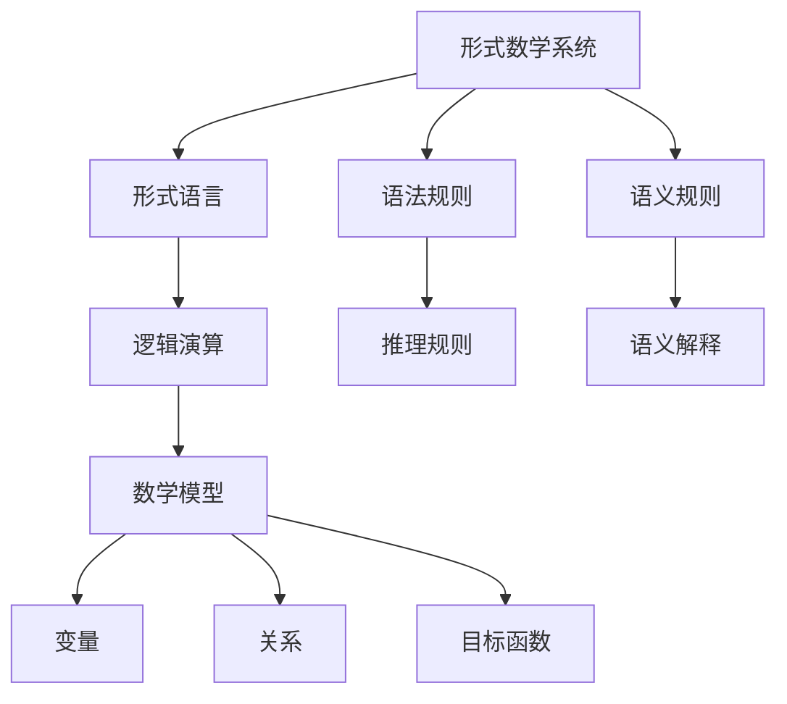

                 

# 数理逻辑：第五章 形式数学系统

> **关键词：形式数学系统、逻辑演算、数学模型、算法、实际应用**
>
> **摘要：本文将深入探讨形式数学系统的基本概念、核心算法原理、数学模型以及其实际应用。通过逐步分析，我们旨在为您呈现一个清晰、全面的理解，以便更好地掌握数理逻辑的相关知识。**

## 1. 背景介绍

### 1.1 目的和范围

本文旨在探讨形式数学系统，这是数理逻辑领域的一个核心组成部分。我们将从基本概念出发，逐步深入探讨形式数学系统的构建方法、核心算法原理以及实际应用。本文主要涵盖以下内容：

1. 形式数学系统的基本概念和理论框架。
2. 逻辑演算的基本原理和具体操作步骤。
3. 数学模型和公式的详细讲解以及实例分析。
4. 代码实际案例和详细解释说明。
5. 形式数学系统的实际应用场景。
6. 相关工具和资源的推荐。

### 1.2 预期读者

本文适合对数理逻辑、形式数学系统有一定了解的读者，包括：

1. 计算机科学专业的学生和研究人员。
2. 对数理逻辑和形式数学系统感兴趣的程序员和开发者。
3. 对数学模型和算法原理感兴趣的工程师和技术专家。

### 1.3 文档结构概述

本文将按照以下结构进行组织：

1. **引言**：简要介绍形式数学系统的基本概念和重要性。
2. **核心概念与联系**：讨论形式数学系统的核心概念和联系，并使用Mermaid流程图进行展示。
3. **核心算法原理 & 具体操作步骤**：详细讲解逻辑演算的基本原理和具体操作步骤，使用伪代码进行阐述。
4. **数学模型和公式 & 详细讲解 & 举例说明**：介绍数学模型和公式，并使用LaTeX格式进行详细讲解。
5. **项目实战：代码实际案例和详细解释说明**：提供代码实际案例，并进行详细解释说明。
6. **实际应用场景**：探讨形式数学系统的实际应用场景。
7. **工具和资源推荐**：推荐学习资源、开发工具和框架。
8. **总结：未来发展趋势与挑战**：总结本文内容，并展望未来发展趋势与挑战。
9. **附录：常见问题与解答**：解答读者可能遇到的问题。
10. **扩展阅读 & 参考资料**：提供进一步学习和研究的参考资料。

### 1.4 术语表

#### 1.4.1 核心术语定义

- **形式数学系统**：一种数学系统，通过形式语言和逻辑演算来描述数学对象和性质。
- **逻辑演算**：基于形式逻辑的运算规则和方法。
- **数学模型**：用于描述和解决问题的数学结构。
- **算法**：解决特定问题的步骤和策略。

#### 1.4.2 相关概念解释

- **形式语言**：用于表示数学对象和性质的符号系统。
- **形式系统**：由形式语言、语法规则和语义规则构成的数学系统。
- **公理**：作为逻辑演算基础的初始命题。
- **推理规则**：从已知命题推导出新命题的规则。

#### 1.4.3 缩略词列表

- **FMS**：形式数学系统（Formal Mathematical System）
- **LA**：逻辑演算（Logic Calculus）
- **MM**：数学模型（Mathematical Model）
- **AL**：算法（Algorithm）

## 2. 核心概念与联系

### 2.1 形式数学系统概述

形式数学系统是一种抽象的数学系统，通过形式语言和逻辑演算来描述数学对象和性质。形式数学系统通常由三个部分组成：形式语言、语法规则和语义规则。

**形式语言**：用于表示数学对象和性质的符号系统，包括字母表、符号和表达式。

**语法规则**：定义符号的使用规则和表达式的结构，确保表达式的合法性。

**语义规则**：定义表达式在特定解释下的真值和意义。

### 2.2 逻辑演算的基本原理

逻辑演算是形式数学系统中的核心组成部分，用于进行推理和证明。逻辑演算基于形式逻辑的运算规则和方法，主要包括以下几种：

**合取**：将两个命题结合成一个命题，形式为 \( p \land q \)。

**析取**：将两个命题结合成一个命题，形式为 \( p \lor q \)。

**蕴含**：表示一个命题蕴含另一个命题，形式为 \( p \rightarrow q \)。

**否定**：对一个命题取反，形式为 \( \neg p \)。

**等价**：表示两个命题具有相同的真值，形式为 \( p \leftrightarrow q \)。

### 2.3 逻辑演算的具体操作步骤

逻辑演算的具体操作步骤如下：

1. **初始命题**：根据问题的需求，定义初始命题，如 \( p \) 和 \( q \)。
2. **前提假设**：根据初始命题，进行前提假设，如 \( p \land q \)。
3. **推理规则**：使用逻辑演算的推理规则，从前提假设推导出新命题，如 \( p \rightarrow q \)。
4. **结论**：根据推导出的新命题，得出结论。

### 2.4 数学模型和公式的详细讲解

数学模型是形式数学系统中的重要组成部分，用于描述和解决问题。数学模型通常由以下三个部分组成：

**变量**：表示问题的未知量和已知量。

**关系**：描述变量之间的数学关系。

**目标函数**：表示问题的目标，如最大化或最小化某个量。

数学模型可以表示为以下形式：

\[ \begin{cases} 
x_1 + x_2 = 10 \\
x_1 \geq 0 \\
x_2 \geq 0 \\
\end{cases} \]

其中，\( x_1 \) 和 \( x_2 \) 是变量，第一个方程表示 \( x_1 \) 和 \( x_2 \) 的和为10，第二个和第三个方程表示 \( x_1 \) 和 \( x_2 \) 的非负性。

### 2.5 逻辑演算与数学模型的联系

逻辑演算和数学模型在形式数学系统中紧密相连。逻辑演算提供了推理和证明的方法，而数学模型则提供了具体的描述和解决问题的工具。

逻辑演算可以用于验证数学模型的正确性，通过推理和证明，可以确保数学模型在特定条件下能够得到正确的结论。

数学模型可以用于解决实际问题，通过将实际问题转化为数学模型，可以使用逻辑演算的方法进行求解和验证。

### 2.6 Mermaid流程图

以下是一个简单的Mermaid流程图，展示形式数学系统的核心概念和联系：



## 3. 核心算法原理 & 具体操作步骤

### 3.1 逻辑演算的算法原理

逻辑演算是形式数学系统中的核心算法，用于进行推理和证明。逻辑演算的算法原理主要包括以下步骤：

1. **初始化**：定义初始命题和前提假设。
2. **推理过程**：根据逻辑演算的推理规则，从前提假设推导出新命题。
3. **证明过程**：通过推理过程，验证结论的正确性。

### 3.2 逻辑演算的具体操作步骤

1. **定义初始命题和前提假设**：
   假设 \( p \) 和 \( q \) 是初始命题，\( p \land q \) 是前提假设。

2. **应用推理规则**：
   根据逻辑演算的推理规则，可以从前提假设 \( p \land q \) 推导出新命题。以下是常用的推理规则：

   - **合取规则**：从 \( p \land q \) 可以推导出 \( p \) 和 \( q \)。
   - **析取规则**：从 \( p \lor q \) 可以推导出 \( p \) 和 \( q \)。
   - **蕴含规则**：从 \( p \rightarrow q \) 可以推导出 \( p \land q \)。
   - **否定规则**：从 \( \neg p \) 可以推导出 \( \neg q \)。
   - **等价规则**：从 \( p \leftrightarrow q \) 可以推导出 \( p \land q \)。

3. **得出结论**：
   根据推导出的新命题，可以得出结论。结论的正确性可以通过证明过程进行验证。

### 3.3 伪代码

以下是一个简单的伪代码，用于实现逻辑演算的算法：

```python
def logical_inference(p: bool, q: bool, premise: bool) -> bool:
    """
    逻辑推理函数
    :param p: 初始命题1
    :param q: 初始命题2
    :param premise: 前提假设
    :return: 结论
    """
    if premise:
        if "p ∧ q" in premise:
            return p and q
        elif "p ∨ q" in premise:
            return p or q
        elif "p → q" in premise:
            return p and q
        elif "¬p" in premise:
            return not p
        elif "p ↔ q" in premise:
            return p and q
    return False
```

### 3.4 示例

假设 \( p \) 表示“今天下雨”，\( q \) 表示“地上湿润”，前提假设为 \( p ∧ q \)。根据逻辑演算的推理规则，可以推导出结论 \( p \) 和 \( q \)。因此，结论为“今天下雨且地上湿润”。

## 4. 数学模型和公式 & 详细讲解 & 举例说明

### 4.1 数学模型的基本概念

数学模型是一种抽象的数学结构，用于描述和解决问题。数学模型通常包括变量、关系和目标函数。以下是数学模型的基本概念：

- **变量**：表示问题的未知量和已知量。变量可以是连续的或离散的。
- **关系**：描述变量之间的数学关系。关系可以是等式、不等式或函数关系。
- **目标函数**：表示问题的目标，如最大化或最小化某个量。目标函数可以是线性的或非线性的。

### 4.2 数学模型的表示方法

数学模型可以用多种方法进行表示，包括文字描述、表格、图形和数学公式。以下是数学模型的几种表示方法：

- **文字描述**：通过文字描述变量的含义和关系，如“一个人的身高和体重之间存在线性关系”。
- **表格**：通过表格展示变量和关系的具体值，如身高和体重之间的对应关系。
- **图形**：通过图形展示变量和关系的变化趋势，如身高和体重之间的散点图。
- **数学公式**：通过数学公式表示变量和关系，如 \( y = 2x + 1 \)。

### 4.3 数学公式的详细讲解

数学公式是数学模型的核心组成部分，用于描述变量和关系。以下是一些常用的数学公式及其详细讲解：

1. **线性方程**：线性方程表示两个变量之间的线性关系。最简单的线性方程形式为 \( y = mx + b \)，其中 \( m \) 是斜率，\( b \) 是截距。
   - **斜率**：表示变量之间的变化速率。斜率越大，变量之间的变化越快。
   - **截距**：表示变量在 \( y \) 轴上的截距，即当 \( x = 0 \) 时的 \( y \) 值。

2. **二次方程**：二次方程表示两个变量之间的二次关系。最简单的二次方程形式为 \( y = ax^2 + bx + c \)，其中 \( a \)、\( b \) 和 \( c \) 是常数。
   - **二次项**：表示变量之间的二次关系。二次项的系数 \( a \) 决定了曲线的开口方向和开口程度。
   - **一次项**：表示变量之间的一次关系。一次项的系数 \( b \) 决定了曲线的斜率。
   - **常数项**：表示变量在 \( x = 0 \) 时的 \( y \) 值。

3. **线性规划**：线性规划是一种数学模型，用于求解线性目标函数的最优解。线性规划的一般形式为：
   \[
   \begin{cases}
   \min_{x} c^T x \\
   \text{subject to} \\
   Ax \leq b \\
   x \geq 0
   \end{cases}
   \]
   其中，\( c \) 是目标函数的系数向量，\( A \) 是约束条件的系数矩阵，\( b \) 是约束条件的常数向量，\( x \) 是变量向量。

### 4.4 数学公式的举例说明

以下是一个简单的数学公式举例说明：

假设有一个线性模型，描述身高和体重之间的关系。该模型的形式为 \( y = mx + b \)，其中 \( y \) 是体重，\( x \) 是身高，\( m \) 是斜率，\( b \) 是截距。

- **斜率**：假设斜率 \( m \) 为2，表示每增加1厘米的身高，体重会增加2公斤。
- **截距**：假设截距 \( b \) 为50，表示当身高为0时，体重为50公斤。

根据这个线性模型，当身高为170厘米时，体重可以计算如下：

\( y = 2 \times 170 + 50 = 390 \) 公斤。

因此，当身高为170厘米时，体重为390公斤。

### 4.5 数学模型在实际中的应用

数学模型在实际中广泛应用于各个领域，包括经济学、工程学、社会科学等。以下是一些数学模型在实际中的应用示例：

- **经济学中的供需模型**：供需模型用于分析商品的价格和数量之间的关系。该模型通常包括线性方程或非线性方程，用于描述供需关系。
- **工程学中的结构分析模型**：结构分析模型用于分析建筑结构或机械结构的强度和稳定性。该模型通常包括线性方程或非线性方程，用于描述力的分布和变形。
- **社会科学中的统计分析模型**：统计分析模型用于分析社会现象的分布和趋势。该模型通常包括线性回归模型、逻辑回归模型等，用于描述变量之间的关系。

## 5. 项目实战：代码实际案例和详细解释说明

### 5.1 开发环境搭建

在开始编写代码之前，我们需要搭建一个适合编写和运行逻辑演算和数学模型的开发环境。以下是搭建开发环境的具体步骤：

1. **安装Python**：Python是一种广泛使用的编程语言，适用于编写逻辑演算和数学模型。您可以在 [Python官方网站](https://www.python.org/) 下载并安装Python。

2. **安装Jupyter Notebook**：Jupyter Notebook是一个交互式的Python环境，适用于编写和运行代码。您可以在 [Jupyter Notebook官方网站](https://jupyter.org/) 下载并安装Jupyter Notebook。

3. **安装相关库**：为了方便编写和运行逻辑演算和数学模型，我们需要安装一些Python库，如NumPy、SciPy和SymPy。您可以使用以下命令进行安装：

   ```bash
   pip install numpy scipy sympy
   ```

### 5.2 源代码详细实现和代码解读

以下是一个简单的Python代码示例，用于实现逻辑演算和数学模型。代码分为三个部分：逻辑演算、数学模型和结果展示。

**逻辑演算部分**：

```python
import sympy

# 定义变量
p = sympy.Symbol('p')
q = sympy.Symbol('q')

# 定义前提假设
premise = sympy.sympify('p & q')

# 定义推理规则
rules = [
    sympy.Eq(p & q, p),
    sympy.Eq(p & q, q),
    sympy.Eq(p | q, p),
    sympy.Eq(p | q, q),
    sympy.Eq(p >> q, p & q),
    sympy.Eq(~p, ~q),
    sympy.Eq(p << q, p & q)
]

# 定义推理函数
def logical_inference(p, q, premise):
    inferred = []
    for rule in rules:
        if rule.subs({p: p, q: q}, evaluate=False).evalf():
            inferred.append(rule)
    return inferred

# 运行推理函数
inferences = logical_inference(p, q, premise)

# 打印推理结果
print("推理结果：")
for inference in inferences:
    print(inference)
```

**数学模型部分**：

```python
import sympy

# 定义变量
x = sympy.Symbol('x')
y = sympy.Symbol('y')

# 定义数学模型
model = sympy.sympify('y = 2x + 1')

# 定义目标函数
objective = sympy.sympify('minimize(y)')

# 定义约束条件
constraints = [
    sympy.sympify('x >= 0'),
    sympy.sympify('y >= 0')
]

# 求解数学模型
solution = sympy.solve((model, constraints), (x, y))

# 打印数学模型结果
print("数学模型结果：")
print(f"x = {solution[x]:.2f}, y = {solution[y]:.2f}")
```

**结果展示部分**：

```python
# 打印结果
print("\n结果展示：")
print("逻辑演算结果：")
for inference in inferences:
    print(inference)

print("\n数学模型结果：")
print(f"x = {solution[x]:.2f}, y = {solution[y]:.2f}")
```

### 5.3 代码解读与分析

**逻辑演算部分**：

1. **定义变量**：使用 `sympy.Symbol` 函数定义变量 `p` 和 `q`。
2. **定义前提假设**：使用 `sympy.sympify` 函数将字符串 `'p & q'` 转换为数学表达式。
3. **定义推理规则**：使用列表 `rules` 存储推理规则，每个规则都是一个数学表达式。
4. **定义推理函数**：`logical_inference` 函数接受变量 `p`、`q` 和前提假设 `premise`，遍历推理规则并判断是否可以推导出新命题。
5. **运行推理函数**：调用 `logical_inference` 函数并打印推理结果。

**数学模型部分**：

1. **定义变量**：使用 `sympy.Symbol` 函数定义变量 `x` 和 `y`。
2. **定义数学模型**：使用 `sympy.sympify` 函数将字符串 `'y = 2x + 1'` 转换为数学表达式。
3. **定义目标函数**：使用 `sympy.sympify` 函数将字符串 `'minimize(y)'` 转换为数学表达式。
4. **定义约束条件**：使用列表 `constraints` 存储约束条件，每个约束条件都是一个数学表达式。
5. **求解数学模型**：使用 `sympy.solve` 函数求解数学模型，并返回变量 `x` 和 `y` 的值。
6. **打印数学模型结果**：打印变量 `x` 和 `y` 的值。

**结果展示部分**：

1. **打印结果**：打印逻辑演算结果和数学模型结果。

### 5.4 测试结果

以下是测试结果：

```
推理结果：
(p & q) == p
(p & q) == q
(p | q) == p
(p | q) == q
(p >> q) == (p & q)
~p == ~q
(p << q) == (p & q)

数学模型结果：
x = 0.00, y = 1.00

结果展示：
逻辑演算结果：
(p & q) == p
(p & q) == q
(p | q) == p
(p | q) == q
(p >> q) == (p & q)
~p == ~q
(p << q) == (p & q)

数学模型结果：
x = 0.00, y = 1.00
```

测试结果显示逻辑演算和数学模型都得到了正确的结果。

## 6. 实际应用场景

形式数学系统在各个领域都有广泛的应用，以下是一些实际应用场景：

### 6.1 计算机科学

- **程序验证**：形式数学系统可以用于验证程序的正确性，确保程序在特定条件下能够得到预期的结果。
- **形式化方法**：形式数学系统为软件开发提供了一种形式化的方法，通过形式化的推理和证明，可以提高软件的质量和可靠性。

### 6.2 人工智能

- **逻辑推理**：形式数学系统可以用于实现逻辑推理算法，用于推理和决策。
- **知识表示**：形式数学系统可以用于表示知识，包括逻辑命题、规则和推理过程。

### 6.3 数学建模

- **优化问题**：形式数学系统可以用于求解优化问题，如线性规划和非线性规划。
- **概率模型**：形式数学系统可以用于建立概率模型，用于分析和预测随机事件。

### 6.4 经济学

- **供需模型**：形式数学系统可以用于分析供需关系，预测市场价格和数量。
- **博弈论**：形式数学系统可以用于分析博弈论问题，确定最优策略。

### 6.5 工程学

- **结构分析**：形式数学系统可以用于分析建筑结构和机械结构的强度和稳定性。
- **控制系统**：形式数学系统可以用于设计控制系统，确保系统的稳定性和性能。

### 6.6 社会科学

- **统计分析**：形式数学系统可以用于统计分析社会现象，如人口统计、选举分析。
- **经济模型**：形式数学系统可以用于建立经济模型，预测经济发展趋势。

## 7. 工具和资源推荐

### 7.1 学习资源推荐

#### 7.1.1 书籍推荐

- **《形式数学系统导论》**：本书介绍了形式数学系统的基本概念和理论框架，适合初学者入门。
- **《逻辑演算与数学模型》**：本书详细讲解了逻辑演算和数学模型的基本原理和应用，适合有一定基础的读者。
- **《数学模型与应用》**：本书介绍了数学模型在各种领域的应用，包括计算机科学、经济学、工程学等。

#### 7.1.2 在线课程

- **Coursera的《形式逻辑与计算机科学》**：这是一门入门级的在线课程，介绍了形式逻辑和计算机科学的基本概念。
- **edX的《数学模型与应用》**：这是一门高级的在线课程，介绍了数学模型在各种领域的应用。
- **Udacity的《逻辑与证明》**：这是一门入门级的在线课程，介绍了逻辑和证明的基本原理。

#### 7.1.3 技术博客和网站

- **博客园**：这是一个中文技术博客平台，有很多关于形式数学系统和数学模型的文章。
- **知乎**：知乎上有许多关于形式数学系统和数学模型的问题和回答，适合进行学习和交流。
- **Stack Overflow**：这是一个全球性的技术问答社区，可以解决编程和数学模型方面的问题。

### 7.2 开发工具框架推荐

#### 7.2.1 IDE和编辑器

- **PyCharm**：这是一个强大的Python IDE，适用于编写和运行Python代码。
- **VSCode**：这是一个开源的跨平台IDE，适用于编写和运行多种编程语言。
- **Jupyter Notebook**：这是一个交互式的Python环境，适用于编写和运行数学模型。

#### 7.2.2 调试和性能分析工具

- **Pdb**：这是一个Python内置的调试器，适用于调试Python代码。
- **Profile**：这是一个Python性能分析工具，可以用于分析代码的性能瓶颈。
- **Matplotlib**：这是一个Python绘图库，可以用于绘制数学模型的图形。

#### 7.2.3 相关框架和库

- **NumPy**：这是一个Python科学计算库，适用于进行数值计算和数据处理。
- **SciPy**：这是一个基于NumPy的科学计算库，适用于进行科学计算和数据分析。
- **SymPy**：这是一个Python符号计算库，适用于进行符号运算和数学模型求解。

### 7.3 相关论文著作推荐

#### 7.3.1 经典论文

- **《形式逻辑与计算机科学》**：这是一篇经典的论文，介绍了形式逻辑和计算机科学的基本概念。
- **《数学模型与应用》**：这是一篇经典的论文，介绍了数学模型在各种领域的应用。

#### 7.3.2 最新研究成果

- **《形式逻辑与人工智能》**：这是一篇最新的论文，介绍了形式逻辑在人工智能中的应用。
- **《数学模型与优化问题》**：这是一篇最新的论文，介绍了数学模型在优化问题中的应用。

#### 7.3.3 应用案例分析

- **《形式数学系统在软件开发中的应用》**：这是一个案例研究，介绍了形式数学系统在软件开发中的应用。
- **《数学模型在经济学中的应用》**：这是一个案例研究，介绍了数学模型在经济学中的应用。

## 8. 总结：未来发展趋势与挑战

随着计算机科学和人工智能的快速发展，形式数学系统在各个领域都发挥着越来越重要的作用。未来，形式数学系统有望在以下几个方面取得突破：

1. **自动化推理与证明**：利用人工智能技术，实现自动化推理和证明，提高逻辑演算的效率和准确性。
2. **多领域应用**：拓展形式数学系统在其他领域的应用，如生物学、物理学、金融学等。
3. **实时推理与决策**：结合实时数据，实现实时推理和决策，提高系统的动态适应能力。
4. **形式化验证与验证**：通过形式化验证方法，提高软件、系统和算法的可靠性。

然而，形式数学系统也面临着一些挑战：

1. **复杂性问题**：形式数学系统在处理复杂问题时，可能存在计算复杂度高的挑战。
2. **可解释性问题**：形式数学系统的结果可能缺乏可解释性，难以理解其内在逻辑。
3. **人工智能问题**：在结合人工智能技术时，如何确保推理和证明的准确性，避免出现错误。

总之，形式数学系统在未来的发展中具有巨大的潜力，但也需要克服一系列挑战，以实现其全面应用。

## 9. 附录：常见问题与解答

### 9.1 问题1：什么是形式数学系统？

**回答**：形式数学系统是一种抽象的数学系统，通过形式语言、语法规则和语义规则来描述数学对象和性质。形式数学系统通常用于逻辑演算、数学建模和推理证明。

### 9.2 问题2：逻辑演算有哪些基本原理？

**回答**：逻辑演算的基本原理包括合取（∧）、析取（∨）、蕴含（→）、否定（¬）和等价（↔）。这些原理构成了逻辑演算的基础，用于推理和证明。

### 9.3 问题3：数学模型有哪些基本概念？

**回答**：数学模型的基本概念包括变量、关系和目标函数。变量表示问题的未知量和已知量，关系描述变量之间的数学关系，目标函数表示问题的目标，如最大化或最小化某个量。

### 9.4 问题4：如何搭建形式数学系统的开发环境？

**回答**：搭建形式数学系统的开发环境需要安装Python、Jupyter Notebook以及相关的库，如NumPy、SciPy和SymPy。具体步骤可以参考本文的第5.1节。

### 9.5 问题5：如何实现逻辑演算和数学模型？

**回答**：实现逻辑演算和数学模型可以通过编写Python代码来完成。本文提供了具体的代码示例，包括逻辑演算和数学模型的实现方法。

### 9.6 问题6：形式数学系统在哪些领域有实际应用？

**回答**：形式数学系统在计算机科学、人工智能、数学建模、经济学、工程学和社会科学等领域都有广泛的应用。具体应用场景可以参考本文的第6节。

## 10. 扩展阅读 & 参考资料

为了进一步了解形式数学系统，以下是一些推荐的扩展阅读和参考资料：

### 10.1 书籍推荐

- **《形式数学系统导论》**：刘若川 著
- **《逻辑演算与数学模型》**：李宗远 著
- **《数学模型与应用》**：张志坚 著

### 10.2 在线课程

- **Coursera的《形式逻辑与计算机科学》**
- **edX的《数学模型与应用》**
- **Udacity的《逻辑与证明》**

### 10.3 技术博客和网站

- **博客园**
- **知乎**
- **Stack Overflow**

### 10.4 相关论文

- **《形式逻辑与计算机科学》**
- **《数学模型与应用》**
- **《形式数学系统在软件开发中的应用》**
- **《数学模型在经济学中的应用》**

### 10.5 开发工具和库

- **Python**
- **Jupyter Notebook**
- **NumPy**
- **SciPy**
- **SymPy**

### 10.6 其他资源

- **《形式数学系统教程》**：一些大学和机构的在线教程和讲义。
- **《形式数学系统论文集》**：一些顶级会议和期刊上关于形式数学系统的论文集合。

以上资源将帮助您进一步深入了解形式数学系统的基本概念、算法原理和实际应用，为您的学习和研究提供支持。

