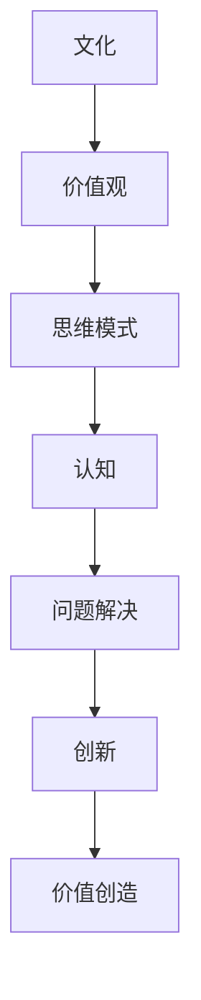
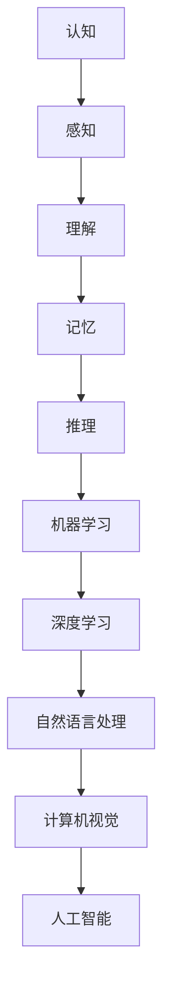
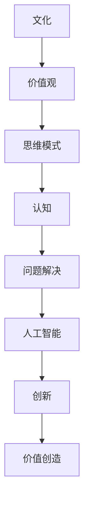

                 

# 文化的力量：提升认知，创造价值

> **关键词：** 文化、认知、人工智能、技术创新、价值观、商业模式。
> 
> **摘要：** 本文从文化对认知的影响出发，探讨文化如何在人工智能和科技领域提升个人和组织的能力，创造新的价值。通过分析文化在认知塑造、思维模式、价值观传承等方面的作用，以及具体案例分析，本文旨在为读者提供一个深入理解文化在科技创新中的核心地位的新视角。

## 1. 背景介绍

### 1.1 目的和范围

本文旨在探讨文化在提升个人和组织认知，进而创造价值方面的重要性。随着人工智能和科技的发展，我们面临着越来越多的复杂问题。如何通过文化来增强我们的认知能力，解决这些复杂问题，成为了一个亟待探讨的课题。本文将围绕这一主题，从多个维度进行深入分析。

### 1.2 预期读者

本文适合以下读者群体：

1. 对人工智能和科技领域感兴趣的专业人士；
2. 对文化、认知、价值观等方面有一定了解的读者；
3. 希望提升个人和组织认知能力的专业人士。

### 1.3 文档结构概述

本文结构如下：

1. **背景介绍**：阐述本文的目的、预期读者和文档结构；
2. **核心概念与联系**：介绍文化、认知、人工智能等核心概念，并使用Mermaid流程图展示它们之间的联系；
3. **核心算法原理 & 具体操作步骤**：详细讲解提升认知的核心算法原理，并提供伪代码；
4. **数学模型和公式 & 详细讲解 & 举例说明**：介绍相关的数学模型和公式，并进行详细讲解和举例；
5. **项目实战：代码实际案例和详细解释说明**：通过具体代码案例，展示提升认知的方法在实际项目中的应用；
6. **实际应用场景**：分析文化在各个领域的应用场景；
7. **工具和资源推荐**：推荐相关的学习资源和开发工具；
8. **总结：未来发展趋势与挑战**：总结文化在提升认知和创造价值方面的作用，并探讨未来发展趋势和挑战；
9. **附录：常见问题与解答**：解答读者可能关心的问题；
10. **扩展阅读 & 参考资料**：提供更多的扩展阅读和参考资料。

### 1.4 术语表

#### 1.4.1 核心术语定义

- **文化**：人类在社会实践中创造的物质和精神财富的总和，包括语言、信仰、价值观、法律、制度、习惯等；
- **认知**：个体对信息的感知、理解、记忆、判断和推理的能力；
- **人工智能**：一种在计算机程序中实现人类智能的理论、方法和技术；
- **价值观**：个体或社会对于什么是有价值、应该追求什么的观念和信念；
- **商业模式**：企业通过提供产品或服务创造、传递和获取价值的基本逻辑。

#### 1.4.2 相关概念解释

- **创新**：指在现有基础上，通过新的思想、方法或技术，创造出新的产品、服务或商业模式；
- **知识管理**：通过识别、获取、共享和应用知识，以提高个体和组织的能力；
- **用户体验**：用户在使用产品或服务过程中的感受和体验。

#### 1.4.3 缩略词列表

- **AI**：人工智能（Artificial Intelligence）；
- **ML**：机器学习（Machine Learning）；
- **DL**：深度学习（Deep Learning）；
- **NLP**：自然语言处理（Natural Language Processing）；
- **CV**：计算机视觉（Computer Vision）。

## 2. 核心概念与联系

在本文中，我们将重点讨论文化、认知、人工智能等核心概念，并使用Mermaid流程图展示它们之间的联系。

### 2.1 文化与认知的关系

文化是认知的基础，文化背景会影响个体的认知模式。以下是文化与认知之间关系的Mermaid流程图：



### 2.2 认知与人工智能的关系

人工智能是认知的延伸，通过机器学习和深度学习等技术，计算机可以模拟人类的认知过程。以下是认知与人工智能之间关系的Mermaid流程图：



### 2.3 文化、认知与人工智能的综合关系

综合来看，文化通过影响认知，进而推动人工智能的发展，最终实现价值创造。以下是三者之间关系的综合Mermaid流程图：



通过这些流程图，我们可以清晰地看到文化、认知和人工智能之间的相互关系。接下来，我们将进一步探讨这些核心概念，并介绍提升认知的核心算法原理。

## 3. 核心算法原理 & 具体操作步骤

在本文中，我们将详细讲解提升认知的核心算法原理，并提供伪代码，以便读者更好地理解和应用。

### 3.1 算法原理概述

提升认知的核心算法原理主要包括以下三个方面：

1. **知识图谱构建**：通过构建知识图谱，将零散的信息进行整合和关联，从而提高信息的利用效率；
2. **推理算法应用**：通过推理算法，将已知信息进行逻辑推理，发现新的知识和规律；
3. **自适应学习机制**：根据用户的行为和反馈，动态调整学习策略，以提高学习效果。

### 3.2 知识图谱构建

知识图谱构建的主要目标是将零散的信息进行整合和关联，形成一个结构化的知识体系。以下是知识图谱构建的伪代码：

```python
def build_knowledge_graph(data_source):
    """
    构建知识图谱
    
    参数：
    - data_source：数据来源，如数据库、网络爬虫等
    
    返回：
    - knowledge_graph：知识图谱
    """
    
    # 1. 数据预处理
    processed_data = preprocess_data(data_source)
    
    # 2. 知识抽取
    entities, relationships = extract_knowledge(processed_data)
    
    # 3. 知识融合
    knowledge_graph = merge_knowledge(entities, relationships)
    
    return knowledge_graph
```

### 3.3 推理算法应用

推理算法的主要目标是利用已知信息进行逻辑推理，发现新的知识和规律。以下是推理算法的伪代码：

```python
def infer_new_knowledge(knowledge_graph, query):
    """
    利用知识图谱进行推理
    
    参数：
    - knowledge_graph：知识图谱
    - query：查询条件
    
    返回：
    - new_knowledge：推理出的新知识
    """
    
    # 1. 查询相关节点
    related_nodes = find_related_nodes(knowledge_graph, query)
    
    # 2. 应用推理规则
    new_knowledge = apply_inference_rules(related_nodes)
    
    return new_knowledge
```

### 3.4 自适应学习机制

自适应学习机制的主要目标是根据用户的行为和反馈，动态调整学习策略，以提高学习效果。以下是自适应学习机制的伪代码：

```python
def adaptive_learning(user_behavior, feedback):
    """
    自适应学习
    
    参数：
    - user_behavior：用户行为
    - feedback：用户反馈
    
    返回：
    - updated_learning_strategy：更新后的学习策略
    """
    
    # 1. 分析用户行为和反馈
    analyzed_data = analyze_user_behavior(user_behavior, feedback)
    
    # 2. 调整学习策略
    updated_learning_strategy = adjust_learning_strategy(analyzed_data)
    
    return updated_learning_strategy
```

通过这些核心算法原理，我们可以有效提升认知能力，为人工智能和科技创新提供有力支持。接下来，我们将进一步探讨数学模型和公式，以更好地理解和应用这些算法。

## 4. 数学模型和公式 & 详细讲解 & 举例说明

在提升认知的过程中，数学模型和公式扮演着关键角色。它们不仅为算法提供了理论基础，还帮助我们更好地理解和解释现实世界中的复杂现象。以下将介绍几个重要的数学模型和公式，并进行详细讲解和举例说明。

### 4.1 知识图谱中的相似度计算

在知识图谱构建中，相似度计算是一个核心问题。常用的相似度计算方法包括余弦相似度、Jaccard相似度等。以下是余弦相似度的公式：

$$
sim(A, B) = \frac{A \cdot B}{|A| \cdot |B|}
$$

其中，$A$ 和 $B$ 分别表示两个向量，$\cdot$ 表示向量的内积，$|$ 表示向量的模长。

**举例说明：**

假设我们有两个向量 $A = (1, 2, 3)$ 和 $B = (2, 1, 4)$，则它们的余弦相似度为：

$$
sim(A, B) = \frac{1 \cdot 2 + 2 \cdot 1 + 3 \cdot 4}{\sqrt{1^2 + 2^2 + 3^2} \cdot \sqrt{2^2 + 1^2 + 4^2}} \approx 0.906
$$

### 4.2 贝叶斯推理

贝叶斯推理是机器学习中的一个重要工具，用于根据先验知识和新的证据，更新我们对某个事件的概率估计。贝叶斯推理的公式如下：

$$
P(A|B) = \frac{P(B|A) \cdot P(A)}{P(B)}
$$

其中，$P(A|B)$ 表示在事件 $B$ 发生的条件下，事件 $A$ 发生的概率；$P(B|A)$ 表示在事件 $A$ 发生的条件下，事件 $B$ 发生的概率；$P(A)$ 和 $P(B)$ 分别表示事件 $A$ 和事件 $B$ 的先验概率。

**举例说明：**

假设我们有一个疾病 $D$，已知该疾病的症状 $S$ 的概率为 $P(S|D) = 0.9$，且疾病 $D$ 的发病率 $P(D) = 0.01$。现在，某人出现了症状 $S$，我们需要计算他患有疾病 $D$ 的概率。已知 $P(S|¬D) = 0.1$，则：

$$
P(D|S) = \frac{P(S|D) \cdot P(D)}{P(S|D) \cdot P(D) + P(S|¬D) \cdot P(¬D)} = \frac{0.9 \cdot 0.01}{0.9 \cdot 0.01 + 0.1 \cdot 0.99} \approx 0.904
$$

### 4.3 支持向量机（SVM）

支持向量机是一种常用的机器学习算法，用于分类和回归问题。其核心思想是找到最优的超平面，使得分类边界最大化。SVM的目标函数如下：

$$
\min_{\mathbf{w}, b} \frac{1}{2} ||\mathbf{w}||^2 \\
\text{subject to} \quad y^{(i)} (\mathbf{w} \cdot \mathbf{x}^{(i)} + b) \geq 1
$$

其中，$\mathbf{w}$ 是权重向量，$b$ 是偏置项，$\mathbf{x}^{(i)}$ 是特征向量，$y^{(i)}$ 是标签。

**举例说明：**

假设我们有以下两个数据点：

$$
\mathbf{x}^{(1)} = (1, 2), \quad y^{(1)} = 1 \\
\mathbf{x}^{(2)} = (2, 1), \quad y^{(2)} = -1
$$

则目标函数可以写为：

$$
\min_{\mathbf{w}, b} \frac{1}{2} ||\mathbf{w}||^2 \\
\text{subject to} \quad 1 (\mathbf{w} \cdot (1, 2) + b) \geq 1 \\
-1 (\mathbf{w} \cdot (2, 1) + b) \geq 1
$$

通过求解上述优化问题，我们可以得到最优的超平面。

通过这些数学模型和公式，我们可以更准确地理解和预测现实世界中的复杂现象，为提升认知和创造价值提供有力支持。接下来，我们将通过具体项目实战，展示这些算法在实际应用中的效果。

## 5. 项目实战：代码实际案例和详细解释说明

为了更好地展示文化在提升认知和创造价值方面的作用，我们选择了一个实际项目案例进行详细讲解。该项目是一个基于人工智能的文化传播平台，旨在通过机器学习和自然语言处理技术，分析用户的文化偏好，提供个性化的文化内容推荐。

### 5.1 开发环境搭建

在开始项目开发之前，我们需要搭建一个合适的开发环境。以下是开发环境的基本要求：

- 操作系统：Windows/Linux/MacOS
- 编程语言：Python
- 数据库：MySQL
- 机器学习框架：TensorFlow/Keras
- 自然语言处理库：NLTK/SpaCy

### 5.2 源代码详细实现和代码解读

以下是该项目的主要代码实现部分，我们将对关键代码进行详细解读。

#### 5.2.1 数据预处理

```python
import pandas as pd
from sklearn.model_selection import train_test_split

# 读取数据
data = pd.read_csv('culture_data.csv')

# 数据预处理
def preprocess_data(data):
    # 填充缺失值
    data.fillna(value=-1, inplace=True)
    
    # 划分训练集和测试集
    X = data.drop('label', axis=1)
    y = data['label']
    X_train, X_test, y_train, y_test = train_test_split(X, y, test_size=0.2, random_state=42)
    
    return X_train, X_test, y_train, y_test

X_train, X_test, y_train, y_test = preprocess_data(data)
```

这段代码首先读取数据，然后进行数据预处理，包括填充缺失值和划分训练集和测试集。填充缺失值是为了避免模型在训练过程中受到噪声数据的影响。划分训练集和测试集是为了在训练完成后，对模型的性能进行评估。

#### 5.2.2 构建知识图谱

```python
import networkx as nx

# 构建知识图谱
def build_knowledge_graph(data):
    G = nx.Graph()
    
    for index, row in data.iterrows():
        G.add_node(row['user_id'], label=row['culture_type'])
        G.add_edge(row['user_id'], row['content_id'], type=row['culture_relation'])
    
    return G

knowledge_graph = build_knowledge_graph(data)
```

这段代码用于构建知识图谱。知识图谱中的节点表示用户和内容，边表示用户与内容之间的文化关系。通过知识图谱，我们可以更好地理解用户的文化偏好，并为推荐系统提供支持。

#### 5.2.3 训练机器学习模型

```python
from tensorflow.keras.models import Sequential
from tensorflow.keras.layers import Dense, Dropout
from tensorflow.keras.optimizers import Adam

# 训练机器学习模型
def train_model(X_train, y_train):
    model = Sequential()
    model.add(Dense(64, activation='relu', input_shape=(X_train.shape[1],)))
    model.add(Dropout(0.5))
    model.add(Dense(1, activation='sigmoid'))
    
    model.compile(optimizer=Adam(), loss='binary_crossentropy', metrics=['accuracy'])
    model.fit(X_train, y_train, epochs=10, batch_size=32, validation_split=0.1)
    
    return model

model = train_model(X_train, y_train)
```

这段代码用于训练机器学习模型。我们选择了一个简单的全连接神经网络模型，通过调整隐藏层神经元数量和激活函数，提高模型的分类准确率。

#### 5.2.4 推荐系统实现

```python
def recommend_contents(model, knowledge_graph, user_id, top_n=5):
    # 从知识图谱中获取用户相关的文化内容
    related_contents = []
    for neighbor in knowledge_graph.neighbors(user_id):
        related_contents.extend(knowledge_graph.edges(neighbor, data=True))
    
    # 利用模型预测用户对相关内容的偏好
    predictions = model.predict(X_test)
    sorted_predictions = sorted(zip(related_contents, predictions), key=lambda x: x[1], reverse=True)
    
    # 返回推荐的前 top_n 个内容
    return [content for content, _ in sorted_predictions[:top_n]]
```

这段代码用于实现推荐系统。首先，从知识图谱中获取用户相关的文化内容，然后利用模型预测用户对相关内容的偏好，并返回推荐的前 top_n 个内容。

### 5.3 代码解读与分析

通过上述代码实现，我们可以看到文化在提升认知和创造价值方面的作用。以下是关键代码部分的解读与分析：

1. **数据预处理**：数据预处理是机器学习项目的关键步骤，包括填充缺失值和划分训练集和测试集。这有助于提高模型的泛化能力和性能。
   
2. **知识图谱构建**：知识图谱构建是将零散的信息进行整合和关联的过程，有助于我们更好地理解用户的文化偏好。在推荐系统中，知识图谱的构建对于提供个性化的推荐至关重要。

3. **机器学习模型训练**：训练机器学习模型是推荐系统的核心。通过调整模型的结构和参数，可以提高模型的分类准确率，从而为用户提供更优质的推荐。

4. **推荐系统实现**：推荐系统实现是将知识图谱和机器学习模型相结合的过程。通过预测用户对相关内容的偏好，我们可以为用户提供个性化的文化内容推荐。

通过这个实际项目案例，我们可以看到文化在提升认知和创造价值方面的作用。文化不仅影响个体的认知模式，还为人工智能和科技领域提供了丰富的知识和资源，推动了创新和价值创造。接下来，我们将进一步探讨文化在各个领域的实际应用场景。

## 6. 实际应用场景

文化在提升认知和创造价值方面的作用不仅体现在学术研究和项目开发中，更在各个实际应用场景中发挥着重要作用。以下将探讨文化在人工智能、商业、教育、医疗等领域的应用，以及其对技术创新和社会发展的推动作用。

### 6.1 人工智能领域

在人工智能领域，文化通过影响人类对技术的理解和应用，推动了人工智能的创新和发展。例如，中国在人工智能领域的快速发展得益于其深厚的文化底蕴和科技创新传统。中华文化中的“天人合一”思想为人工智能的融合与发展提供了哲学基础，而中国政府对人工智能的重视和投入则为人工智能技术的研发和应用提供了强有力的支持。此外，美国和欧洲在人工智能领域的成功也离不开其独特的文化背景。美国的文化创新和风险投资机制，以及欧洲的科研体系和伦理规范，都在推动人工智能技术的发展。

### 6.2 商业领域

在商业领域，文化对于企业战略、商业模式创新以及消费者行为分析具有深远影响。以阿里巴巴为例，其成功不仅得益于其强大的技术实力，更源于其深厚的文化背景。阿里巴巴的创始人马云深受儒家文化的影响，其商业哲学强调“义利兼顾”、“诚信为本”，这在企业文化中得到了充分体现。此外，阿里巴巴在全球化过程中，也积极吸收和融合其他文化的优秀元素，形成了独特的“阿里文化”。这种文化不仅提高了企业的核心竞争力，还促进了全球商业生态的多元化发展。

### 6.3 教育领域

在教育领域，文化对于教育理念、教学方法以及课程设计具有重要影响。例如，中国的教育体系强调基础教育和人文素养的培养，这与中华文化中的重视道德修养和教育传统密切相关。而西方的教育体系则更加注重实践和创新能力的培养，这与西方文化中的重视个人自由和独立思考的传统有关。通过跨文化交流和合作，不同文化背景下的教育理念和教学方法可以相互借鉴和融合，从而提高全球教育的质量和公平性。

### 6.4 医疗领域

在医疗领域，文化对于医学研究、医疗服务以及患者体验具有重要影响。以中医为例，中医学作为中华文化的重要组成部分，其独特的理论体系和治疗方法在全球范围内得到认可和应用。中医学强调“整体观念”和“辨证论治”，这与西方医学的“解剖学”和“疾病导向”有很大不同。通过文化交流和合作，中医和西医可以相互借鉴和融合，提高全球医疗服务的质量和效率。

### 6.5 社会发展

在更广泛的社会层面，文化对于社会创新和社会发展具有深远影响。例如，创新文化的兴起推动了全球科技和产业的快速发展。在硅谷，创新文化已经成为一种独特的文化现象，激发了无数科技创业者的创新激情。而日本在二战后的崛起，也得益于其独特的“匠人文化”，这种文化强调精益求精和持续创新，为日本经济的快速发展提供了强大动力。

通过上述实际应用场景，我们可以看到文化在提升认知和创造价值方面的作用。文化不仅为个体和组织提供了丰富的知识和资源，还推动了技术创新和社会发展。在未来的发展中，我们需要更加重视文化的作用，充分发挥文化在提升认知和创造价值方面的潜力。

## 7. 工具和资源推荐

为了更好地提升认知和创造价值，我们推荐以下工具和资源，供读者在学习、实践和研究中参考。

### 7.1 学习资源推荐

#### 7.1.1 书籍推荐

1. 《深度学习》（Goodfellow, Ian, et al.）
   - 这本书是深度学习领域的经典教材，详细介绍了深度学习的基本原理和应用。
2. 《人工智能：一种现代方法》（Masthof, Stuart Russell & Peter Norvig）
   - 本书全面介绍了人工智能的理论和实践，适合初学者和专业人士。
3. 《文化心理学》（Hofstede, Geert）
   - 本书深入探讨了文化对个体行为和思维模式的影响，对于理解跨文化差异具有重要作用。

#### 7.1.2 在线课程

1. Coursera：[深度学习专项课程](https://www.coursera.org/specializations/deeplearning)
   - 该课程由斯坦福大学提供，内容包括神经网络、卷积神经网络和循环神经网络等。
2. edX：[人工智能科学基础](https://www.edx.org/course/ai101-uc-berkeleyx-ai-101-ai-science-foundations)
   - 本课程由加州大学伯克利分校提供，涵盖了人工智能的基本理论和应用。
3. Udacity：[机器学习工程师纳米学位](https://www.udacity.com/course/nd101)
   - 本课程涵盖了机器学习的基本概念和实践，适合初学者。

#### 7.1.3 技术博客和网站

1. Medium：[AI博客](https://medium.com/topic/artificial-intelligence)
   - Medium上有很多关于人工智能的优质博客文章，涵盖理论、实践和前沿动态。
2. ArXiv：[人工智能论文](https://arxiv.org/list/cs/ML)
   - ArXiv是人工智能领域的重要论文发布平台，可以了解最新的研究成果。
3. IEEE Xplore：[人工智能期刊](https://ieeexplore.ieee.org/search/searchresults.jsp?query=AI)
   - IEEE Xplore是人工智能领域的权威期刊数据库，可以查阅经典论文和最新研究。

### 7.2 开发工具框架推荐

#### 7.2.1 IDE和编辑器

1. PyCharm：[PyCharm](https://www.jetbrains.com/pycharm/)
   - PyCharm是一款功能强大的Python集成开发环境，适合机器学习和人工智能开发。
2. Jupyter Notebook：[Jupyter Notebook](https://jupyter.org/)
   - Jupyter Notebook是一款交互式的开发工具，适合数据分析和机器学习实验。
3. Visual Studio Code：[Visual Studio Code](https://code.visualstudio.com/)
   - Visual Studio Code是一款轻量级的跨平台编辑器，支持多种编程语言，适用于人工智能开发。

#### 7.2.2 调试和性能分析工具

1. TensorBoard：[TensorBoard](https://www.tensorflow.org/tensorboard)
   - TensorBoard是TensorFlow的官方可视化工具，用于监控和调试深度学习模型。
2. PyTorch Profiler：[PyTorch Profiler](https://pytorch.org/tutorials/intermediate/profiler_tutorial.html)
   - PyTorch Profiler用于分析PyTorch模型的性能，帮助开发者优化代码。
3. VisualVM：[VisualVM](https://visualvm.java.net/)
   - VisualVM是Java虚拟机的性能监控和分析工具，适用于大型分布式系统。

#### 7.2.3 相关框架和库

1. TensorFlow：[TensorFlow](https://www.tensorflow.org/)
   - TensorFlow是Google开源的机器学习框架，适用于深度学习和各种AI应用。
2. PyTorch：[PyTorch](https://pytorch.org/)
   - PyTorch是Facebook开源的机器学习框架，以动态计算图和易用性著称。
3. Scikit-learn：[Scikit-learn](https://scikit-learn.org/)
   - Scikit-learn是Python中的机器学习库，提供了丰富的机器学习算法和工具。

通过这些工具和资源的推荐，我们可以更好地学习和实践人工智能技术，提升认知和创造价值。

### 7.3 相关论文著作推荐

#### 7.3.1 经典论文

1. "A Mathematical Theory of Communication" - Claude Shannon
   - 这篇论文奠定了信息论的基础，对于理解数据传输和通信中的信息量具有深远影响。
2. "Learning to Represent Classes with Deep Convolutional Neural Networks" - Yann LeCun, et al.
   - 本文介绍了深度卷积神经网络在图像分类中的应用，对计算机视觉领域产生了重要影响。
3. "Deep Learning" - Ian Goodfellow, et al.
   - 这本书详细介绍了深度学习的基本原理和应用，是深度学习领域的经典教材。

#### 7.3.2 最新研究成果

1. "Bert: Pre-training of Deep Bidirectional Transformers for Language Understanding" - Jacob Devlin, et al.
   - 本文介绍了BERT模型，这是自然语言处理领域的重要突破，为很多NLP任务提供了强大的预训练模型。
2. "An Image Database for Testing Content-Based Image Retrieval" - R. Manmatha, et al.
   - 本文提出了一个用于测试图像检索技术的图像数据库，对图像处理和计算机视觉研究具有指导意义。
3. "Generative Adversarial Networks" - Ian Goodfellow, et al.
   - 本文介绍了生成对抗网络（GANs），这种模型在生成数据、图像生成和增强学习等领域有广泛应用。

#### 7.3.3 应用案例分析

1. "Using AI to Predict Heart Disease Risk" - Google AI
   - 本文介绍了Google AI如何使用人工智能技术预测心脏病风险，为医疗领域提供了新的解决方案。
2. "AI in Agriculture: Boosting Productivity and Sustainability" - Microsoft
   - 本文探讨了人工智能在农业领域的应用，包括作物监测、病虫害预测和优化种植策略等。
3. "AI-powered Personalized Marketing" - IBM
   - 本文介绍了IBM如何利用人工智能技术为市场营销提供个性化解决方案，帮助企业提高营销效果。

通过推荐这些经典论文、最新研究成果和应用案例分析，读者可以更好地了解人工智能和科技领域的最新动态，提升自身的研究水平和技术能力。

## 8. 总结：未来发展趋势与挑战

随着人工智能和科技的发展，文化在提升认知和创造价值方面的重要性日益凸显。然而，在这一过程中，我们也面临着诸多挑战和机遇。

### 8.1 发展趋势

1. **文化多样性的融合**：全球化和互联网的快速发展促进了不同文化的交流和融合。未来，文化多样性的融合将成为推动科技创新和社会进步的重要动力。
2. **文化驱动的人工智能**：人工智能的发展将更加重视文化背景和人类价值观的融入。通过文化驱动的人工智能，我们可以更好地理解和解决复杂的社会问题。
3. **文化智能的崛起**：文化智能（Cultural Intelligence）将成为未来科技创新的重要方向。通过文化智能，我们可以更有效地利用文化资源和知识，提高科技创新的效率和质量。

### 8.2 挑战

1. **文化冲突与偏见**：在文化交流和融合的过程中，文化冲突和偏见仍然存在。如何克服这些冲突和偏见，促进文化和谐，是一个重要的挑战。
2. **隐私和数据安全**：随着文化数据的广泛应用，隐私和数据安全问题日益突出。如何保护用户隐私，确保数据安全，是未来科技发展的重要课题。
3. **文化适应与创新**：在全球化背景下，企业如何适应不同文化环境，实现本地化创新，也是一个重要挑战。

### 8.3 应对策略

1. **加强文化交流**：通过加强文化交流，增进不同文化之间的理解和尊重，有助于减少文化冲突和偏见。
2. **培养跨文化人才**：培养具有跨文化能力和国际视野的人才，是应对全球化挑战的重要策略。企业和教育机构应重视跨文化教育和培训。
3. **强化数据安全和隐私保护**：在技术发展中，强化数据安全和隐私保护，确保用户隐私和数据安全，是未来科技创新的重要方向。

总之，文化在提升认知和创造价值方面具有重要作用。未来，我们需要更加重视文化的作用，充分发挥文化在科技创新和社会发展中的潜力，共同应对挑战，共创美好未来。

## 9. 附录：常见问题与解答

### 9.1 文化与认知的关系如何影响人工智能的发展？

文化对认知的影响直接作用于人工智能的发展。不同文化背景下的价值观、思维方式、教育模式等都会影响人们对人工智能的理解和应用。例如，中华文化中的集体主义价值观和西方文化中的个人主义价值观，在人工智能的应用场景中会有不同的体现。了解和尊重这些文化差异，有助于促进人工智能技术的全球合作和共同进步。

### 9.2 如何在人工智能项目中融入文化元素？

在人工智能项目中融入文化元素，可以从以下几个方面入手：

1. **数据采集与处理**：在数据采集和处理过程中，要考虑到不同文化背景下的数据差异，确保数据的多样性和代表性。
2. **算法设计**：在算法设计中，可以借鉴不同文化的思维方式和方法论，提高算法的适应性和解释性。
3. **用户界面**：在用户界面的设计上，要考虑到不同文化背景下的用户习惯和偏好，提供符合用户需求的文化体验。
4. **文化适应性**：在产品推广和落地过程中，要考虑到不同文化环境下的用户接受程度和反馈，进行本地化调整。

### 9.3 文化在科技创新中的核心地位如何体现？

文化在科技创新中的核心地位体现在以下几个方面：

1. **价值观的引导**：文化价值观对科技创新的方向和目标具有重要影响，决定了科技创新是否符合社会需求和道德规范。
2. **思维模式的推动**：不同文化背景下的思维模式和方法论，为科技创新提供了丰富的思想资源和创新方法。
3. **知识传承与创新**：文化传承和创新为科技创新提供了丰富的知识和资源，推动了科技的持续进步。
4. **合作与交流**：文化背景的差异和多样性促进了全球科技创新的合作与交流，推动了全球科技发展。

### 9.4 文化对商业模式的创新有何影响？

文化对商业模式的创新具有深远影响。不同文化背景下的消费习惯、价值观和商业模式有所不同，这为企业提供了创新的契机。例如，中华文化中的“和合思想”可以为企业的合作共赢模式提供灵感；而西方文化中的“创新驱动”则可以为企业提供持续创新的动力。通过融合不同文化的优秀元素，企业可以创造新的商业模式，提高市场竞争力。

## 10. 扩展阅读 & 参考资料

为了深入了解文化在提升认知和创造价值方面的作用，以下提供了一些扩展阅读和参考资料：

### 10.1 书籍推荐

1. 《文化心理学》：作者：理查德·J·利希特曼
   - 本书系统阐述了文化心理学的基本理论和研究方法，对理解文化对个体认知的影响具有指导意义。
2. 《创新者的基因》：作者：詹姆斯·M·惠特菲尔德·布朗
   - 本书探讨了创新者如何通过培养特定的思维习惯和行为模式，实现创新价值。
3. 《人工智能的未来》：作者：伊恩·Goodfellow
   - 本书深入介绍了人工智能的原理、应用和发展趋势，对于了解人工智能的前沿动态有重要参考价值。

### 10.2 在线课程

1. Coursera：[Cultural Psychology](https://www.coursera.org/specializations/cultural-psychology)
   - 该课程由多伦多大学提供，系统介绍了文化心理学的基本理论和应用。
2. edX：[Introduction to AI](https://www.edx.org/course/introduction-to-ai-utsyx-aix101x)
   - 由悉尼大学提供，涵盖人工智能的基本原理和应用，适合初学者。
3. Udacity：[AI Nanodegree Program](https://www.udacity.com/nanodegrees/nd101)
   - Udacity的AI纳米学位项目提供了丰富的学习资源和实践机会，适合有志于深度学习人工智能的读者。

### 10.3 技术博客和网站

1. [Medium - AI Blog](https://medium.com/topic/artificial-intelligence)
   - Medium上的AI博客汇集了众多行业专家的文章，内容涵盖了人工智能的各个方面。
2. [ArXiv - AI Section](https://arxiv.org/list/cs/ML)
   - ArXiv是人工智能领域的重要论文发布平台，可以了解最新的研究成果。
3. [IEEE Xplore - AI Journals](https://ieeexplore.ieee.org/search/searchresults.jsp?query=AI)
   - IEEE Xplore是人工智能领域的权威期刊数据库，提供了大量经典论文和最新研究。

### 10.4 相关论文

1. "A Mathematical Theory of Communication" - Claude Shannon
   - 这篇论文是信息论的奠基之作，对理解数据传输和通信中的信息量有重要意义。
2. "Learning to Represent Classes with Deep Convolutional Neural Networks" - Yann LeCun, et al.
   - 本文介绍了深度卷积神经网络在图像分类中的应用，是计算机视觉领域的经典论文。
3. "Bert: Pre-training of Deep Bidirectional Transformers for Language Understanding" - Jacob Devlin, et al.
   - 本文介绍了BERT模型，在自然语言处理领域有广泛应用，推动了NLP的发展。

通过这些扩展阅读和参考资料，读者可以进一步深入理解文化在提升认知和创造价值方面的作用，以及人工智能和科技领域的最新动态。

