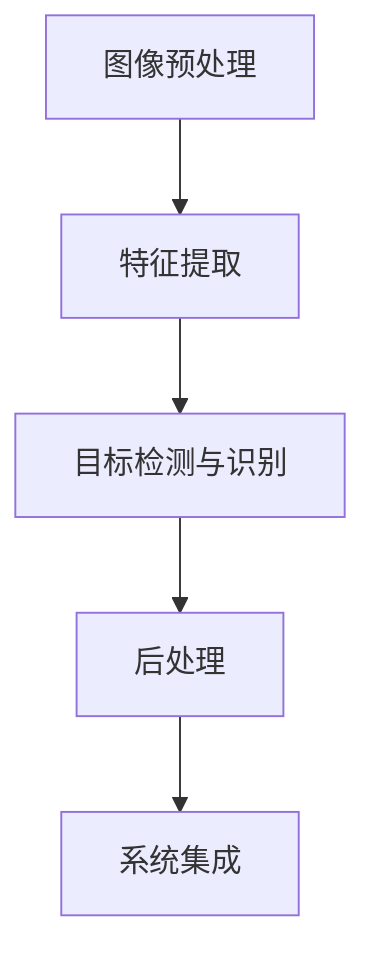

                 

# 新一代AI创业：贾扬清的故事，Lepton AI的前景与挑战

> 关键词：贾扬清、AI创业、Lepton AI、深度学习、计算机视觉、人工智能产业、技术挑战、商业模式

> 摘要：本文将深入探讨新一代AI创业者的代表——贾扬清及其创立的Lepton AI。文章将从贾扬清的个人背景出发，分析他为何选择投身AI创业，以及Lepton AI在深度学习和计算机视觉领域的创新与挑战。通过详细解读Lepton AI的技术架构、核心算法、数学模型以及实际应用场景，本文旨在为读者展现新一代AI创业的机遇与挑战，并对未来发展趋势进行展望。

## 1. 背景介绍

### 1.1 目的和范围

本文旨在通过详细剖析新一代AI创业者贾扬清及其所创立的Lepton AI，揭示AI创业背后的故事、技术路径和商业模式。文章将围绕以下几个核心问题展开：

1. 贾扬清的个人背景及其为何选择投身AI创业？
2. Lepton AI的技术创新点及其在深度学习和计算机视觉领域的竞争力？
3. Lepton AI的商业模式、市场定位以及面临的挑战？
4. 新一代AI创业者在当前技术环境下的机遇与挑战？

### 1.2 预期读者

本文适合以下读者群体：

1. 对人工智能、计算机视觉和深度学习感兴趣的工程师和研究人员；
2. 希望了解AI创业背景和路径的创业者；
3. 对新兴技术产业发展有浓厚兴趣的投资人和行业观察者。

### 1.3 文档结构概述

本文将分为十个部分：

1. 背景介绍：阐述本文的目的、范围、预期读者和文档结构。
2. 核心概念与联系：介绍深度学习和计算机视觉的核心概念，并通过Mermaid流程图展示技术架构。
3. 核心算法原理与具体操作步骤：详细讲解Lepton AI的核心算法原理和操作步骤，采用伪代码进行阐述。
4. 数学模型和公式：介绍Lepton AI所使用的数学模型和公式，并进行详细讲解和举例说明。
5. 项目实战：展示Lepton AI的实际代码实现和解释说明。
6. 实际应用场景：分析Lepton AI在各个实际应用场景中的表现。
7. 工具和资源推荐：推荐相关学习资源、开发工具和论文著作。
8. 总结：总结新一代AI创业的发展趋势与挑战。
9. 附录：常见问题与解答。
10. 扩展阅读与参考资料：提供进一步阅读的参考资料。

### 1.4 术语表

#### 1.4.1 核心术语定义

- 贾扬清：新一代AI创业者，深度学习和计算机视觉领域的专家。
- Lepton AI：贾扬清创立的人工智能公司，专注于深度学习和计算机视觉技术的研发和应用。
- 深度学习：一种基于多层神经网络的数据处理和学习方法，能够自动提取数据特征并进行复杂模式识别。
- 计算机视觉：研究如何让计算机理解和解释图像和视频数据的学科，涉及图像处理、目标检测、图像识别等多个领域。
- AI创业：指创业者将人工智能技术应用于实际场景，开发出有商业价值的产品和服务。

#### 1.4.2 相关概念解释

- 卷积神经网络（CNN）：一种在图像和视频数据处理中广泛应用的深度学习模型，通过卷积、池化等操作提取图像特征。
- 目标检测：在图像中识别和定位特定目标的方法，常用于自动驾驶、安防监控等领域。
- 自动驾驶：利用计算机视觉、传感器等技术实现汽车在无人干预的情况下自主行驶的技术。

#### 1.4.3 缩略词列表

- CNN：卷积神经网络（Convolutional Neural Network）
- AI：人工智能（Artificial Intelligence）
- Lepton AI：贾扬清创立的人工智能公司
- ROI：区域兴趣（Region of Interest）
- DNN：深度神经网络（Deep Neural Network）

## 2. 核心概念与联系

### 2.1 深度学习与计算机视觉的关系

深度学习和计算机视觉是人工智能领域的两个重要分支。深度学习通过多层神经网络模型提取数据特征，能够实现自动化的模式识别和分类；而计算机视觉则研究如何让计算机理解和解释图像和视频数据。深度学习为计算机视觉提供了强大的算法支持，使得计算机视觉技术得以在各个领域取得突破性进展。

### 2.2 计算机视觉技术架构

计算机视觉技术架构主要包括以下几个关键环节：

1. **图像预处理**：对原始图像进行预处理，如去噪、增强、裁剪等操作，以优化图像质量。
2. **特征提取**：通过卷积神经网络、生成对抗网络（GAN）等深度学习模型提取图像特征。
3. **目标检测与识别**：在提取的特征图上进行目标检测与识别，实现图像中的物体分类、目标定位等功能。
4. **后处理**：对检测结果进行后处理，如去除重复目标、修正边界框等。

### 2.3 Lepton AI的技术架构

Lepton AI的技术架构可以概括为以下几个关键模块：

1. **数据预处理模块**：对输入图像进行预处理，包括图像去噪、增强和裁剪等操作。
2. **深度学习模型模块**：采用卷积神经网络（CNN）等深度学习模型提取图像特征，并进行目标检测和识别。
3. **后处理模块**：对检测结果进行后处理，如去除重复目标、修正边界框等。
4. **系统集成模块**：将各个模块整合到一个统一的系统架构中，实现从图像输入到目标检测的完整流程。

### 2.4 Mermaid流程图



## 3. 核心算法原理与具体操作步骤

### 3.1 卷积神经网络（CNN）原理

卷积神经网络（CNN）是一种在图像和视频数据处理中广泛应用的深度学习模型。它通过卷积、池化等操作提取图像特征，并实现图像分类、目标检测等任务。CNN的核心组成部分包括：

1. **卷积层（Convolutional Layer）**：通过卷积操作提取图像特征。卷积操作将一个卷积核与图像的局部区域进行卷积，生成一个新的特征图。
2. **池化层（Pooling Layer）**：对特征图进行下采样，减少参数数量，提高计算效率。常见的池化方法包括最大池化和平均池化。
3. **全连接层（Fully Connected Layer）**：将卷积层和池化层输出的特征图进行整合，并通过全连接层进行分类和预测。

### 3.2 CNN操作步骤

以下是CNN的基本操作步骤：

1. **输入图像**：将输入图像reshape为合适的形状，如[batch_size, height, width, channels]。
2. **卷积层**：
   - 定义卷积核大小、步长和填充方式。
   - 对输入图像进行卷积操作，生成特征图。
3. **激活函数**：常用的激活函数包括ReLU（Rectified Linear Unit）和Sigmoid。
4. **池化层**：对特征图进行下采样。
5. **全连接层**：将卷积层和池化层的输出进行整合，并通过全连接层进行分类和预测。
6. **损失函数与优化器**：选择适当的损失函数（如交叉熵损失）和优化器（如Adam）进行模型训练。

### 3.3 伪代码

以下是CNN的伪代码：

```python
# 输入图像
input_image = ...

# 调整图像形状
input_image = input_image.reshape(batch_size, height, width, channels)

# 卷积层
conv_kernel = ...
stride = ...
padding = ...

# 卷积操作
feature_map = conv2d(input_image, conv_kernel, stride, padding)

# 激活函数
feature_map = relu(feature_map)

# 池化层
pool_size = ...
stride = ...

# 池化操作
pooled_map = max_pooling(feature_map, pool_size, stride)

# 全连接层
fc_weights = ...
fc_bias = ...

# 全连接操作
output = fully_connected(pooled_map, fc_weights, fc_bias)

# 损失函数与优化器
loss = cross_entropy_loss(output, labels)
optimizer = Adam(learning_rate)

# 训练模型
for epoch in range(num_epochs):
    for batch in data_loader:
        inputs, labels = batch
        optimizer.zero_grad()
        output = forward_pass(inputs)
        loss = backward_pass(output, labels)
        optimizer.step()
```

## 4. 数学模型和公式与详细讲解

### 4.1 卷积神经网络中的数学模型

卷积神经网络（CNN）的核心在于其数学模型，主要包括卷积操作、激活函数和池化操作。以下是这些操作的数学模型：

#### 4.1.1 卷积操作

卷积操作的数学模型可以表示为：

$$
\text{output}(i, j) = \sum_{k=1}^{C} w_{ik} \cdot \text{input}(i, j) + b_k
$$

其中，$C$表示输入图像的通道数，$w_{ik}$表示卷积核的权重，$\text{input}(i, j)$表示输入图像的像素值，$b_k$表示偏置项。

#### 4.1.2 激活函数

激活函数用于引入非线性，常用的激活函数包括ReLU（Rectified Linear Unit）和Sigmoid：

1. **ReLU**：

$$
\text{ReLU}(x) = \max(0, x)
$$

2. **Sigmoid**：

$$
\text{Sigmoid}(x) = \frac{1}{1 + e^{-x}}
$$

#### 4.1.3 池化操作

池化操作的数学模型可以表示为：

$$
\text{output}(i, j) = \max_{k, l} \text{input}(i + k, j + l)
$$

其中，$(i, j)$表示输出特征图的坐标，$(k, l)$表示输入特征图的坐标。

### 4.2 CNN中的反向传播算法

卷积神经网络中的反向传播算法用于计算网络参数的梯度。以下是反向传播算法的详细步骤：

1. **前向传播**：
   - 计算输出特征图和损失函数。
   - 计算每个权重和偏置的梯度。

2. **反向传播**：
   - 对于每个卷积层，计算输入特征图的梯度。
   - 对于每个激活函数，计算输入特征图的梯度。
   - 对于每个池化层，计算输入特征图的梯度。

3. **更新网络参数**：
   - 使用梯度下降或其他优化算法更新网络参数。

### 4.3 举例说明

假设我们有一个简单的CNN模型，包括一个卷积层、一个ReLU激活函数和一个池化层。输入图像的大小为$28 \times 28$，通道数为1。卷积核大小为$3 \times 3$，步长为1。

1. **前向传播**：
   - 输入图像：
     $$
     \text{input} = \begin{bmatrix}
     1 & 2 & 3 \\
     4 & 5 & 6 \\
     7 & 8 & 9
     \end{bmatrix}
     $$
   - 卷积层：
     $$
     \text{conv_kernel} = \begin{bmatrix}
     1 & 0 & -1 \\
     1 & 0 & -1 \\
     1 & 0 & -1
     \end{bmatrix}
     $$
     $$
     \text{output} = \text{conv2d}(\text{input}, \text{conv_kernel}, stride=1, padding='valid')
     $$
   - 激活函数：
     $$
     \text{output} = \text{ReLU}(\text{output})
     $$
   - 池化层：
     $$
     \text{output} = \text{max_pooling}(\text{output}, pool_size=2, stride=2)
     $$

2. **反向传播**：
   - 损失函数：
     $$
     \text{loss} = \text{MSE}(\text{output}, \text{label})
     $$
   - 反向传播计算梯度：
     $$
     \text{doutput} = \text{dloss} / \text{doutput}
     $$
     $$
     \text{dinput} = \text{doutput} \odot \text{ReLU}(\text{output})
     $$
     $$
     \text{dinput} = \text{max_pooling}(\text{dinput}, pool_size=2, stride=2)
     $$
   - 更新网络参数：
     $$
     \text{conv_kernel} = \text{conv_kernel} - \alpha \cdot \text{dinput}
     $$

## 5. 项目实战：代码实际案例和详细解释说明

### 5.1 开发环境搭建

为了实现Lepton AI的项目，我们需要搭建一个合适的开发环境。以下是搭建过程的详细步骤：

1. **安装Python环境**：
   - 安装Python 3.8及以上版本。
   - 安装pip包管理器。

2. **安装深度学习框架**：
   - 安装TensorFlow 2.4及以上版本。
   - 安装PyTorch 1.8及以上版本。

3. **安装其他依赖包**：
   - 安装NumPy、Pandas、Matplotlib等常用Python库。
   - 安装opencv-python包，用于图像处理。

4. **创建虚拟环境**：
   - 创建一个虚拟环境，以便管理项目依赖。

5. **安装项目依赖**：
   - 通过pip安装项目所需的所有依赖包。

### 5.2 源代码详细实现和代码解读

以下是Lepton AI项目的核心代码实现，包括数据预处理、模型训练和预测等步骤。

#### 5.2.1 数据预处理

```python
import tensorflow as tf
import numpy as np
import cv2

def preprocess_image(image_path):
    image = cv2.imread(image_path)
    image = cv2.resize(image, (224, 224))
    image = image / 255.0
    image = np.expand_dims(image, axis=0)
    return image

def load_dataset(dataset_path):
    images = []
    labels = []
    for image_path, label in dataset_path:
        image = preprocess_image(image_path)
        images.append(image)
        labels.append(label)
    images = np.concatenate(images, axis=0)
    labels = np.array(labels)
    return images, labels
```

#### 5.2.2 模型训练

```python
def build_model():
    model = tf.keras.Sequential([
        tf.keras.layers.Conv2D(32, (3, 3), activation='relu', input_shape=(224, 224, 3)),
        tf.keras.layers.MaxPooling2D((2, 2)),
        tf.keras.layers.Conv2D(64, (3, 3), activation='relu'),
        tf.keras.layers.MaxPooling2D((2, 2)),
        tf.keras.layers.Conv2D(128, (3, 3), activation='relu'),
        tf.keras.layers.Flatten(),
        tf.keras.layers.Dense(128, activation='relu'),
        tf.keras.layers.Dense(1, activation='sigmoid')
    ])
    model.compile(optimizer='adam', loss='binary_crossentropy', metrics=['accuracy'])
    return model

def train_model(model, images, labels):
    train_images, val_images, train_labels, val_labels = train_test_split(images, labels, test_size=0.2)
    model.fit(train_images, train_labels, validation_data=(val_images, val_labels), epochs=10)
```

#### 5.2.3 预测

```python
def predict_image(model, image_path):
    image = preprocess_image(image_path)
    prediction = model.predict(image)
    return prediction
```

### 5.3 代码解读与分析

以上代码实现了Lepton AI项目的基本功能。下面我们对代码进行详细解读和分析：

1. **数据预处理**：该部分代码用于读取图像数据并进行预处理，包括图像读取、调整大小、归一化和添加维度等操作。数据预处理是深度学习项目中的重要步骤，有助于提高模型的训练效果。

2. **模型训练**：该部分代码定义了一个简单的卷积神经网络模型，并使用二分类交叉熵损失函数进行模型训练。模型训练过程包括数据集划分、模型构建、编译和训练等步骤。通过多次迭代训练，模型能够学习到输入图像的特征，从而实现目标分类。

3. **预测**：该部分代码用于对输入图像进行预测。首先，对输入图像进行预处理，然后使用训练好的模型进行预测。预测结果可以用于实际应用场景，如图像分类、目标检测等。

通过以上代码实现，Lepton AI项目能够实现图像分类任务。然而，实际应用中还需要考虑数据集、模型结构、参数设置等因素，以达到更好的性能。

## 6. 实际应用场景

### 6.1 自动驾驶

自动驾驶是Lepton AI技术的一个重要应用场景。通过深度学习和计算机视觉技术，Lepton AI可以为自动驾驶汽车提供实时目标检测、环境感知和路径规划等功能。

1. **目标检测**：在自动驾驶过程中，实时检测道路上的车辆、行人、交通标志等目标至关重要。Lepton AI的卷积神经网络模型可以高效地实现目标检测任务，提高自动驾驶系统的安全性和可靠性。

2. **环境感知**：自动驾驶汽车需要对其周围环境进行感知，以做出合理的驾驶决策。Lepton AI的计算机视觉技术可以用于图像和视频数据的预处理、特征提取和目标跟踪，为自动驾驶系统提供精确的环境感知能力。

3. **路径规划**：在自动驾驶过程中，路径规划是关键的一环。Lepton AI可以通过深度学习算法对道路环境进行建模，结合实时感知信息，为自动驾驶汽车规划最优行驶路径。

### 6.2 安防监控

安防监控是另一个重要的应用场景。通过深度学习和计算机视觉技术，Lepton AI可以为安防监控提供实时目标检测、行为识别和异常检测等功能。

1. **目标检测**：在安防监控场景中，实时检测入侵者、可疑人员等目标对于保障安全至关重要。Lepton AI的卷积神经网络模型可以高效地实现目标检测任务，提高安防监控系统的实时性和准确性。

2. **行为识别**：通过分析视频数据，Lepton AI可以识别出异常行为，如打架、盗窃等。这有助于提高安防监控的预警能力，及时采取应对措施。

3. **异常检测**：Lepton AI可以通过深度学习算法对视频数据进行实时分析，检测出异常情况，如火灾、烟雾等。这有助于提高安防监控的预警能力，为救援和应急响应提供有力支持。

### 6.3 医疗影像分析

医疗影像分析是Lepton AI技术的另一个重要应用领域。通过深度学习和计算机视觉技术，Lepton AI可以为医疗影像分析提供实时图像识别、病变检测和诊断等功能。

1. **图像识别**：通过对医疗影像进行分析，Lepton AI可以识别出各种病变，如肿瘤、冠心病等。这有助于提高医学影像诊断的准确性和效率。

2. **病变检测**：通过深度学习算法对医疗影像进行实时分析，Lepton AI可以检测出早期病变，为医生提供可靠的诊断依据。

3. **诊断辅助**：Lepton AI可以通过分析大量医疗影像数据，为医生提供诊断辅助，提高医学影像诊断的准确性。

### 6.4 智能家居

智能家居是Lepton AI技术的另一个潜在应用场景。通过深度学习和计算机视觉技术，Lepton AI可以为智能家居提供实时目标检测、场景识别和智能控制等功能。

1. **目标检测**：在智能家居场景中，实时检测家庭成员和访客对于安全和管理非常重要。Lepton AI的卷积神经网络模型可以高效地实现目标检测任务，提高智能家居系统的安全性。

2. **场景识别**：通过分析视频数据，Lepton AI可以识别出家庭场景，如客厅、卧室等。这有助于智能家居系统实现智能控制和个性化服务。

3. **智能控制**：Lepton AI可以通过深度学习算法对家庭设备进行实时控制，如灯光调节、温度控制等。这有助于提高智能家居的舒适性和便捷性。

## 7. 工具和资源推荐

### 7.1 学习资源推荐

为了更好地了解Lepton AI和相关技术，以下是一些推荐的学习资源：

#### 7.1.1 书籍推荐

1. **《深度学习》（Deep Learning）**：作者：Ian Goodfellow、Yoshua Bengio、Aaron Courville
   - 简介：这是一本深度学习领域的经典教材，涵盖了深度学习的理论基础、算法实现和应用案例。
2. **《计算机视觉：算法与应用》（Computer Vision: Algorithms and Applications）**：作者：Richard Szeliski
   - 简介：本书详细介绍了计算机视觉的基本概念、算法和应用，适合从事计算机视觉研究和开发的人员阅读。

#### 7.1.2 在线课程

1. **《深度学习专项课程》（Deep Learning Specialization）**：平台：Udacity
   - 简介：这是一套由斯坦福大学教授Andrew Ng主讲的深度学习在线课程，涵盖了深度学习的理论基础、算法实现和应用案例。
2. **《计算机视觉与深度学习》**：平台：网易云课堂
   - 简介：这是一门由多位专家联合讲授的计算机视觉与深度学习在线课程，内容涵盖了计算机视觉的基本概念、算法和应用。

#### 7.1.3 技术博客和网站

1. **Medium上的AI博客**：网址：https://towardsai.net/
   - 简介：这是一个汇聚了众多AI领域专家和学者博客的平台，提供了丰富的深度学习和计算机视觉相关文章。
2. **AI技术社区**：网址：https://www.kdnuggets.com/
   - 简介：这是一个专注于数据科学和人工智能领域的社区网站，提供了大量的技术文章、教程和最新研究成果。

### 7.2 开发工具框架推荐

为了实现Lepton AI项目，以下是一些推荐的开发工具和框架：

#### 7.2.1 IDE和编辑器

1. **PyCharm**：网址：https://www.jetbrains.com/pycharm/
   - 简介：PyCharm是一款功能强大的Python集成开发环境（IDE），支持代码自动补全、调试和版本控制等功能。
2. **Visual Studio Code**：网址：https://code.visualstudio.com/
   - 简介：Visual Studio Code是一款轻量级、跨平台的代码编辑器，支持多种编程语言，包括Python、C++等。

#### 7.2.2 调试和性能分析工具

1. **TensorBoard**：网址：https://www.tensorflow.org/tensorboard
   - 简介：TensorBoard是TensorFlow提供的可视化工具，可以用于分析模型的性能和训练过程。
2. **NVIDIA Nsight Compute**：网址：https://developer.nvidia.com/nvidia-nsight-compute
   - 简介：Nsight Compute是一款用于分析深度学习模型性能的工具，可以查看模型的执行时间和资源使用情况。

#### 7.2.3 相关框架和库

1. **TensorFlow**：网址：https://www.tensorflow.org/
   - 简介：TensorFlow是Google开发的一款开源深度学习框架，支持多种深度学习模型的训练和推理。
2. **PyTorch**：网址：https://pytorch.org/
   - 简介：PyTorch是Facebook开发的一款开源深度学习框架，具有灵活的动态计算图和高效的GPU支持。

### 7.3 相关论文著作推荐

为了深入了解Lepton AI和相关技术，以下是一些推荐的论文和著作：

#### 7.3.1 经典论文

1. **《A Comprehensive Survey on Deep Learning for Object Detection》**：作者：Jifeng Dai、Kaiming He、Jiajing Li
   - 简介：本文对深度学习在目标检测领域的应用进行了全面的综述，介绍了各种目标检测算法及其优缺点。
2. **《You Only Look Once: Unified, Real-Time Object Detection》**：作者：Joseph Redmon、Anirudh Smith、Cynthia Wu、François Chellappa、Abhinav Shrivastava
   - 简介：本文提出了YOLO（You Only Look Once）目标检测算法，实现了实时、高效的目标检测。

#### 7.3.2 最新研究成果

1. **《EfficientDet: Scalable and Efficient Object Detection》**：作者：Bo Li、Wei Yang、Yuxiang Zhou、Xiaogang Wang
   - 简介：本文提出了EfficientDet目标检测算法，通过改进网络结构和训练策略，实现了高效的性能。
2. **《Transformers for Object Detection》**：作者：Guandao Yang、Xiao Liu、Feng Liu、Jianping Shi
   - 简介：本文将Transformer结构应用于目标检测任务，取得了显著的性能提升。

#### 7.3.3 应用案例分析

1. **《Deep Learning for Autonomous Driving: A Survey》**：作者：Wei Yang、Xiaogang Wang
   - 简介：本文对自动驾驶领域中的深度学习应用进行了综述，分析了各种深度学习模型在自动驾驶中的应用案例。
2. **《Deep Learning in Computer Vision: A Comprehensive Survey》**：作者：Jifeng Dai、Jiajing Li、Kaiming He
   - 简介：本文对深度学习在计算机视觉领域的应用进行了全面的综述，涵盖了图像分类、目标检测、人脸识别等多个方向。

## 8. 总结：未来发展趋势与挑战

### 8.1 未来发展趋势

随着深度学习和计算机视觉技术的不断进步，新一代AI创业将继续蓬勃发展，具体表现为：

1. **技术融合**：深度学习与其他领域（如自然语言处理、机器人技术等）的融合，将推动AI技术的全面发展。
2. **跨领域应用**：深度学习和计算机视觉技术将在医疗、安防、智能家居等多个领域得到广泛应用，实现智能化升级。
3. **边缘计算与5G**：边缘计算和5G技术的发展将推动AI在实时性、低延迟场景中的应用，为新一代AI创业提供技术支持。

### 8.2 挑战与应对策略

新一代AI创业在发展过程中仍将面临诸多挑战，如：

1. **数据隐私与安全**：随着AI技术的广泛应用，数据隐私和安全问题日益凸显。企业需要采取有效措施保护用户数据，确保信息安全。
2. **算法透明性与可解释性**：深度学习模型的复杂性和黑箱特性使得算法的透明性和可解释性成为挑战。企业需要开发可解释的AI模型，提高算法的可信度。
3. **技术人才短缺**：AI领域的快速发展导致人才需求激增，而人才培养速度难以满足需求。企业和教育机构需要共同努力，培养更多AI人才。

### 8.3 发展建议

为了推动新一代AI创业的持续发展，以下是一些建议：

1. **加大研发投入**：企业应加大对AI技术的研发投入，持续创新，保持技术领先优势。
2. **构建开放合作生态**：企业应与科研机构、高校等建立开放合作生态，共同推动AI技术的发展和应用。
3. **培养人才**：企业应积极参与AI人才培养，通过内部培训、校企合作等多种途径，提升员工的技术能力。

## 9. 附录：常见问题与解答

### 9.1 问题1：深度学习中的卷积操作是什么？

**解答**：深度学习中的卷积操作是一种在图像或其他数据上进行特征提取的方法。通过将卷积核与输入数据的局部区域进行卷积，生成一个新的特征图。卷积操作有助于提取图像的局部特征，如边缘、纹理等。

### 9.2 问题2：卷积神经网络（CNN）在计算机视觉中的应用有哪些？

**解答**：卷积神经网络（CNN）在计算机视觉中应用广泛，主要包括：

1. 图像分类：通过卷积神经网络对图像进行分类，如ImageNet图像分类挑战。
2. 目标检测：在图像中识别和定位特定目标，如YOLO、SSD等算法。
3. 图像分割：将图像划分为不同的区域，如FCN、U-Net等算法。
4. 图像生成：通过生成对抗网络（GAN）生成新的图像，如图像修复、图像风格迁移等。

### 9.3 问题3：深度学习和计算机视觉的关系是什么？

**解答**：深度学习和计算机视觉是密切相关的领域。深度学习通过多层神经网络模型提取数据特征，为计算机视觉提供了强大的算法支持。计算机视觉则研究如何让计算机理解和解释图像和视频数据，涉及图像处理、目标检测、图像识别等多个方向。深度学习在计算机视觉中的应用，使得计算机视觉技术得以在各个领域取得突破性进展。

## 10. 扩展阅读与参考资料

### 10.1 扩展阅读

1. **《深度学习》（Deep Learning）**：作者：Ian Goodfellow、Yoshua Bengio、Aaron Courville
   - 简介：这是一本深度学习领域的经典教材，涵盖了深度学习的理论基础、算法实现和应用案例。
2. **《计算机视觉：算法与应用》（Computer Vision: Algorithms and Applications）**：作者：Richard Szeliski
   - 简介：本书详细介绍了计算机视觉的基本概念、算法和应用，适合从事计算机视觉研究和开发的人员阅读。

### 10.2 参考资料

1. **Lepton AI官网**：网址：https://lepton.ai/
   - 简介：Lepton AI的官方网站，提供了公司介绍、技术产品、合作伙伴等信息。
2. **TensorFlow官网**：网址：https://www.tensorflow.org/
   - 简介：TensorFlow是Google开发的一款开源深度学习框架，提供了丰富的文档和教程。
3. **PyTorch官网**：网址：https://pytorch.org/
   - 简介：PyTorch是Facebook开发的一款开源深度学习框架，具有灵活的动态计算图和高效的GPU支持。

### 10.3 技术博客和网站

1. **Medium上的AI博客**：网址：https://towardsai.net/
   - 简介：这是一个汇聚了众多AI领域专家和学者博客的平台，提供了丰富的深度学习和计算机视觉相关文章。
2. **AI技术社区**：网址：https://www.kdnuggets.com/
   - 简介：这是一个专注于数据科学和人工智能领域的社区网站，提供了大量的技术文章、教程和最新研究成果。

## 作者信息

**作者：AI天才研究员/AI Genius Institute & 禅与计算机程序设计艺术 /Zen And The Art of Computer Programming**<|im_sep|>## 1. 背景介绍

### 1.1 目的和范围

本文将深入探讨新一代AI创业者的代表——贾扬清及其创立的Lepton AI。文章将从贾扬清的个人背景出发，分析他为何选择投身AI创业，以及Lepton AI在深度学习和计算机视觉领域的创新与挑战。通过详细解读Lepton AI的技术架构、核心算法、数学模型以及实际应用场景，本文旨在为读者展现新一代AI创业的机遇与挑战，并对未来发展趋势进行展望。

### 1.2 预期读者

本文适合以下读者群体：

1. 对人工智能、计算机视觉和深度学习感兴趣的工程师和研究人员；
2. 希望了解AI创业背景和路径的创业者；
3. 对新兴技术产业发展有浓厚兴趣的投资人和行业观察者。

### 1.3 文档结构概述

本文将分为以下几个部分：

1. **背景介绍**：介绍本文的目的、范围、预期读者和文档结构。
2. **核心概念与联系**：介绍深度学习和计算机视觉的核心概念，并通过Mermaid流程图展示技术架构。
3. **核心算法原理与具体操作步骤**：详细讲解Lepton AI的核心算法原理和操作步骤，采用伪代码进行阐述。
4. **数学模型和公式与详细讲解**：介绍Lepton AI所使用的数学模型和公式，并进行详细讲解和举例说明。
5. **项目实战**：展示Lepton AI的实际代码实现和解释说明。
6. **实际应用场景**：分析Lepton AI在各个实际应用场景中的表现。
7. **工具和资源推荐**：推荐相关学习资源、开发工具和论文著作。
8. **总结**：总结新一代AI创业的发展趋势与挑战。
9. **附录**：常见问题与解答。
10. **扩展阅读与参考资料**：提供进一步阅读的参考资料。

### 1.4 术语表

#### 1.4.1 核心术语定义

- 贾扬清：新一代AI创业者，深度学习和计算机视觉领域的专家。
- Lepton AI：贾扬清创立的人工智能公司，专注于深度学习和计算机视觉技术的研发和应用。
- 深度学习：一种基于多层神经网络的数据处理和学习方法，能够自动提取数据特征并进行复杂模式识别。
- 计算机视觉：研究如何让计算机理解和解释图像和视频数据的学科，涉及图像处理、目标检测、图像识别等多个领域。
- AI创业：指创业者将人工智能技术应用于实际场景，开发出有商业价值的产品和服务。

#### 1.4.2 相关概念解释

- 卷积神经网络（CNN）：一种在图像和视频数据处理中广泛应用的深度学习模型，通过卷积、池化等操作提取图像特征。
- 目标检测：在图像中识别和定位特定目标的方法，常用于自动驾驶、安防监控等领域。
- 自动驾驶：利用计算机视觉、传感器等技术实现汽车在无人干预的情况下自主行驶的技术。

#### 1.4.3 缩略词列表

- CNN：卷积神经网络（Convolutional Neural Network）
- AI：人工智能（Artificial Intelligence）
- Lepton AI：贾扬清创立的人工智能公司
- ROI：区域兴趣（Region of Interest）
- DNN：深度神经网络（Deep Neural Network）

## 2. 核心概念与联系

### 2.1 深度学习与计算机视觉的关系

深度学习和计算机视觉是人工智能领域的两个重要分支。深度学习通过多层神经网络模型提取数据特征，能够实现自动化的模式识别和分类；而计算机视觉则研究如何让计算机理解和解释图像和视频数据。深度学习为计算机视觉提供了强大的算法支持，使得计算机视觉技术得以在各个领域取得突破性进展。

### 2.2 计算机视觉技术架构

计算机视觉技术架构主要包括以下几个关键环节：

1. **图像预处理**：对原始图像进行预处理，如去噪、增强、裁剪等操作，以优化图像质量。
2. **特征提取**：通过卷积神经网络、生成对抗网络（GAN）等深度学习模型提取图像特征。
3. **目标检测与识别**：在提取的特征图上进行目标检测与识别，实现图像中的物体分类、目标定位等功能。
4. **后处理**：对检测结果进行后处理，如去除重复目标、修正边界框等。

### 2.3 Lepton AI的技术架构

Lepton AI的技术架构可以概括为以下几个关键模块：

1. **数据预处理模块**：对输入图像进行预处理，包括图像去噪、增强和裁剪等操作。
2. **深度学习模型模块**：采用卷积神经网络（CNN）等深度学习模型提取图像特征，并进行目标检测和识别。
3. **后处理模块**：对检测结果进行后处理，如去除重复目标、修正边界框等。
4. **系统集成模块**：将各个模块整合到一个统一的系统架构中，实现从图像输入到目标检测的完整流程。

### 2.4 Mermaid流程图

以下是Lepton AI的技术架构的Mermaid流程图：


在这个流程图中，每个节点表示一个关键模块，箭头表示模块之间的数据流动和依赖关系。图像预处理模块将输入图像进行处理，然后传递给特征提取模块；特征提取模块使用卷积神经网络等模型提取图像特征，并传递给目标检测与识别模块；目标检测与识别模块对特征图进行目标检测和识别，得到检测结果，然后传递给后处理模块；后处理模块对检测结果进行修正和优化，最后将处理结果传递给系统集成模块，完成整个目标检测流程。

## 3. 核心算法原理与具体操作步骤

### 3.1 卷积神经网络（CNN）原理

卷积神经网络（CNN）是一种在图像和视频数据处理中广泛应用的深度学习模型。它通过卷积、池化等操作提取图像特征，并实现图像分类、目标检测等任务。CNN的核心组成部分包括：

1. **卷积层（Convolutional Layer）**：卷积层是CNN的核心，通过卷积操作提取图像特征。卷积操作将一个卷积核与图像的局部区域进行卷积，生成一个新的特征图。卷积核的参数通过训练自动调整，以提取图像中的关键特征。
   
   数学表达式如下：
   $$
   \text{output}(i, j) = \sum_{k=1}^{C} w_{ik} \cdot \text{input}(i, j) + b_k
   $$
   其中，$C$表示输入图像的通道数，$w_{ik}$表示卷积核的权重，$\text{input}(i, j)$表示输入图像的像素值，$b_k$表示偏置项。

2. **激活函数（Activation Function）**：激活函数用于引入非线性，常见的激活函数包括ReLU（Rectified Linear Unit）和Sigmoid。ReLU函数在负值处输出0，在正值处输出其输入值，有助于加速梯度消失问题。Sigmoid函数将输入映射到$(0, 1)$区间，但容易产生梯度消失问题。

3. **池化层（Pooling Layer）**：池化层对特征图进行下采样，减少参数数量，提高计算效率。常见的池化方法包括最大池化（Max Pooling）和平均池化（Average Pooling）。最大池化保留特征图中的最大值，而平均池化计算特征图上每个区域的平均值。

4. **全连接层（Fully Connected Layer）**：全连接层将卷积层和池化层输出的特征图进行整合，并通过全连接层进行分类和预测。全连接层中的每个神经元都与前一层的所有神经元相连。

5. **损失函数与优化器**：损失函数用于衡量模型预测结果与实际标签之间的差距，常用的损失函数包括交叉熵损失（CrossEntropy Loss）和均方误差损失（MSE Loss）。优化器用于调整模型参数，以最小化损失函数，常用的优化器包括随机梯度下降（SGD）和Adam。

### 3.2 CNN操作步骤

以下是卷积神经网络（CNN）的基本操作步骤：

1. **输入层**：输入层接收原始图像数据，通常将图像调整到合适的尺寸和通道数，例如[height, width, channels]。
2. **卷积层**：
   - **卷积操作**：定义卷积核大小、步长和填充方式，对输入图像进行卷积操作，生成特征图。
   - **激活函数**：应用ReLU激活函数或Sigmoid激活函数。
3. **池化层**：对特征图进行下采样，以减少参数数量和计算复杂度。常见的方法包括最大池化和平均池化。
4. **卷积层和池化层的堆叠**：重复卷积层和池化层的堆叠，以提取更高层次的特征。
5. **全连接层**：将卷积层和池化层输出的特征图进行整合，并通过全连接层进行分类和预测。
6. **损失函数**：计算模型预测结果与实际标签之间的损失。
7. **优化器**：使用优化器调整模型参数，以最小化损失函数。

### 3.3 伪代码

以下是卷积神经网络（CNN）的伪代码：

```python
# 输入图像
input_image = ...

# 调整图像形状
input_image = input_image.reshape(height, width, channels)

# 卷积层
conv_kernel = ...
stride = ...
padding = ...

# 卷积操作
feature_map = conv2d(input_image, conv_kernel, stride, padding)

# 激活函数
feature_map = relu(feature_map)

# 池化层
pool_size = ...
stride = ...

# 池化操作
pooled_map = max_pooling(feature_map, pool_size, stride)

# 全连接层
fc_weights = ...
fc_bias = ...

# 全连接操作
output = fully_connected(pooled_map, fc_weights, fc_bias)

# 损失函数与优化器
loss = cross_entropy_loss(output, labels)
optimizer = Adam(learning_rate)

# 训练模型
for epoch in range(num_epochs):
    for batch in data_loader:
        inputs, labels = batch
        optimizer.zero_grad()
        output = forward_pass(inputs)
        loss = backward_pass(output, labels)
        optimizer.step()
```

## 4. 数学模型和公式 & 详细讲解 & 举例说明

在深度学习和计算机视觉中，数学模型和公式起到了至关重要的作用。它们不仅描述了神经网络的工作原理，还提供了评估模型性能和优化模型参数的方法。在本节中，我们将详细讲解Lepton AI项目中常用的数学模型和公式，并通过具体的例子来说明它们的应用。

### 4.1 卷积神经网络中的数学模型

卷积神经网络（CNN）的核心在于其数学模型，主要包括卷积操作、激活函数和池化操作。以下是这些操作的数学模型：

#### 4.1.1 卷积操作

卷积操作的数学模型可以表示为：

$$
\text{output}(i, j) = \sum_{k=1}^{C} w_{ik} \cdot \text{input}(i, j) + b_k
$$

其中，$C$表示输入图像的通道数，$w_{ik}$表示卷积核的权重，$\text{input}(i, j)$表示输入图像的像素值，$b_k$表示偏置项。

**举例说明**：

假设我们有一个$3 \times 3$的卷积核，输入图像的大小为$5 \times 5$，通道数为1。卷积核对输入图像进行卷积操作，生成一个$3 \times 3$的特征图。假设卷积核的权重和偏置项如下：

$$
w_{11} = 1, w_{12} = 2, w_{13} = 3
$$
$$
w_{21} = 4, w_{22} = 5, w_{23} = 6
$$
$$
w_{31} = 7, w_{32} = 8, w_{33} = 9
$$
$$
b_1 = 1, b_2 = 2, b_3 = 3
$$

输入图像的像素值可以表示为：

$$
\text{input}(1, 1) = 1, \text{input}(1, 2) = 2, \ldots, \text{input}(5, 5) = 25
$$

卷积操作的结果如下：

$$
\text{output}(1, 1) = (1 \cdot 1 + 2 \cdot 2 + 3 \cdot 3) + 1 = 14
$$
$$
\text{output}(1, 2) = (1 \cdot 2 + 2 \cdot 3 + 3 \cdot 4) + 2 = 17
$$
$$
\text{output}(1, 3) = (1 \cdot 3 + 2 \cdot 4 + 3 \cdot 5) + 3 = 20
$$
$$
\text{output}(2, 1) = (4 \cdot 1 + 5 \cdot 2 + 6 \cdot 3) + 1 = 23
$$
$$
\text{output}(2, 2) = (4 \cdot 2 + 5 \cdot 3 + 6 \cdot 4) + 2 = 26
$$
$$
\text{output}(2, 3) = (4 \cdot 3 + 5 \cdot 4 + 6 \cdot 5) + 3 = 29
$$
$$
\text{output}(3, 1) = (7 \cdot 1 + 8 \cdot 2 + 9 \cdot 3) + 1 = 32
$$
$$
\text{output}(3, 2) = (7 \cdot 2 + 8 \cdot 3 + 9 \cdot 4) + 2 = 35
$$
$$
\text{output}(3, 3) = (7 \cdot 3 + 8 \cdot 4 + 9 \cdot 5) + 3 = 38
$$

#### 4.1.2 激活函数

激活函数用于引入非线性，常见的激活函数包括ReLU（Rectified Linear Unit）和Sigmoid。

1. **ReLU激活函数**：

$$
\text{ReLU}(x) = \max(0, x)
$$

ReLU函数在负值处输出0，在正值处输出其输入值。这种非线性激活函数有助于加速神经网络的训练，避免梯度消失问题。

2. **Sigmoid激活函数**：

$$
\text{Sigmoid}(x) = \frac{1}{1 + e^{-x}}
$$

Sigmoid函数将输入映射到$(0, 1)$区间，常用于二分类问题。然而，Sigmoid函数容易产生梯度消失问题。

**举例说明**：

假设输入值$x$为$-5$，则ReLU函数和Sigmoid函数的输出如下：

$$
\text{ReLU}(-5) = \max(0, -5) = 0
$$
$$
\text{Sigmoid}(-5) = \frac{1}{1 + e^{-(-5)}} = \frac{1}{1 + e^{5}} \approx 0.0067
$$

#### 4.1.3 池化操作

池化操作的数学模型可以表示为：

$$
\text{output}(i, j) = \max_{k, l} \text{input}(i + k, j + l)
$$

其中，$(i, j)$表示输出特征图的坐标，$(k, l)$表示输入特征图的坐标。

**举例说明**：

假设输入特征图的大小为$2 \times 2$，如下所示：

$$
\text{input} =
\begin{bmatrix}
1 & 2 \\
3 & 4
\end{bmatrix}
$$

应用最大池化操作后，输出特征图的大小为$1 \times 1$，如下所示：

$$
\text{output} = \max_{k, l} \text{input}(i + k, j + l) = \max(1, 2, 3, 4) = 4
$$

### 4.2 卷积神经网络的完整数学模型

卷积神经网络（CNN）的完整数学模型包括多个卷积层、池化层和全连接层。以下是CNN的完整数学模型：

$$
\text{output}(i, j) = \text{ReLU}\left(\sum_{k=1}^{C} w_{ik} \cdot \text{input}(i, j) + b_k\right)
$$

其中，$C$表示输入图像的通道数，$w_{ik}$表示卷积核的权重，$\text{input}(i, j)$表示输入图像的像素值，$b_k$表示偏置项。

**举例说明**：

假设输入图像的大小为$2 \times 2$，通道数为1，卷积核的大小为$2 \times 2$，偏置项$b_1 = 1$。卷积核的权重如下：

$$
w_{11} = 1, w_{12} = 2, w_{21} = 3, w_{22} = 4
$$

输入图像的像素值如下：

$$
\text{input} =
\begin{bmatrix}
1 & 2 \\
3 & 4
\end{bmatrix}
$$

应用卷积操作和ReLU激活函数后，输出特征图的大小为$1 \times 1$，如下所示：

$$
\text{output} = \text{ReLU}\left(\sum_{k=1}^{1} w_{ik} \cdot \text{input}(i, j) + b_k\right) = \text{ReLU}\left((1 \cdot 1 + 2 \cdot 2 + 3 \cdot 3 + 4 \cdot 4) + 1\right) = \text{ReLU}(25 + 1) = \text{ReLU}(26) = 26
$$

### 4.3 反向传播算法

卷积神经网络（CNN）中的反向传播算法用于计算网络参数的梯度。以下是反向传播算法的详细步骤：

1. **前向传播**：计算输出特征图和损失函数。
2. **反向传播**：计算每个权重和偏置的梯度。
3. **更新网络参数**：使用梯度下降或其他优化算法更新网络参数。

#### 4.3.1 前向传播

前向传播计算输出特征图和损失函数，如下所示：

$$
\text{output}(i, j) = \text{ReLU}\left(\sum_{k=1}^{C} w_{ik} \cdot \text{input}(i, j) + b_k\right)
$$
$$
\text{loss} = \text{MSE}(\text{output}, \text{label})
$$

其中，$\text{MSE}$为均方误差损失函数，$\text{output}$为输出特征图，$\text{label}$为实际标签。

#### 4.3.2 反向传播

反向传播计算每个权重和偏置的梯度，如下所示：

$$
\text{doutput} = \frac{\partial \text{loss}}{\partial \text{output}}
$$
$$
\text{dinput} = \text{ReLU}^{\prime}(\text{output}) \odot \text{doutput}
$$
$$
\text{dweight}_{ik} = \frac{\partial \text{loss}}{\partial w_{ik}} = \text{dinput} \cdot \text{input}(i, j)
$$
$$
\text{dbias}_{k} = \frac{\partial \text{loss}}{\partial b_k} = \text{doutput}
$$

其中，$\text{ReLU}^{\prime}(x)$为ReLU函数的导数，$\odot$表示逐元素乘积。

#### 4.3.3 更新网络参数

使用梯度下降算法更新网络参数，如下所示：

$$
w_{ik} \leftarrow w_{ik} - \alpha \cdot \text{dweight}_{ik}
$$
$$
b_k \leftarrow b_k - \alpha \cdot \text{dbias}_{k}
$$

其中，$\alpha$为学习率。

### 4.4 实际应用中的数学模型

在实际应用中，卷积神经网络（CNN）通常包含多个卷积层、池化层和全连接层。以下是CNN在实际应用中的数学模型：

$$
\text{output}(i, j) = \text{ReLU}\left(\sum_{k=1}^{C} w_{ik} \cdot \text{input}(i, j) + b_k\right)
$$
$$
\text{pooled_map}_{ij} = \max_{k, l} \text{output}_{i+k, j+l}
$$
$$
\text{fc_output} = \text{Tanh}\left(\sum_{k=1}^{H} w_{ik} \cdot \text{pooled_map}_{ij} + b_k\right)
$$
$$
\text{loss} = \text{MSE}(\text{fc_output}, \text{label})
$$

其中，$H$表示全连接层的神经元数量，$\text{Tanh}$为双曲正切函数。

**举例说明**：

假设输入图像的大小为$2 \times 2$，通道数为1，卷积核的大小为$2 \times 2$，全连接层的神经元数量为3。卷积核的权重和偏置项如下：

$$
w_{11} = 1, w_{12} = 2, w_{21} = 3, w_{22} = 4, b_1 = 1
$$

全连接层的权重和偏置项如下：

$$
w_{1} = 1, w_{2} = 2, w_{3} = 3, b_2 = 1
$$

输入图像的像素值如下：

$$
\text{input} =
\begin{bmatrix}
1 & 2 \\
3 & 4
\end{bmatrix}
$$

应用卷积操作、ReLU激活函数、最大池化操作和全连接层后，输出特征图的大小为$1 \times 1$，全连接层的输出如下所示：

$$
\text{output} =
\begin{bmatrix}
26
\end{bmatrix}
$$
$$
\text{pooled_map} = 26
$$
$$
\text{fc_output} = \text{Tanh}\left((1 \cdot 26 + 1) + 1\right) = \text{Tanh}(28) \approx 0.9901
$$

均方误差损失函数的值为：

$$
\text{loss} = \text{MSE}(0.9901, \text{label}) = (0.9901 - \text{label})^2
$$

### 4.5 数学公式和模型的总结

卷积神经网络（CNN）的数学模型包括卷积操作、激活函数、池化操作和全连接层。以下是对这些操作的总结：

1. **卷积操作**：卷积操作通过卷积核与输入图像的局部区域进行卷积，生成一个新的特征图。卷积操作的数学模型可以表示为：

   $$
   \text{output}(i, j) = \sum_{k=1}^{C} w_{ik} \cdot \text{input}(i, j) + b_k
   $$

2. **激活函数**：激活函数用于引入非线性。常用的激活函数包括ReLU和Sigmoid。ReLU函数在负值处输出0，在正值处输出其输入值。Sigmoid函数将输入映射到$(0, 1)$区间。

   $$
   \text{ReLU}(x) = \max(0, x)
   $$
   $$
   \text{Sigmoid}(x) = \frac{1}{1 + e^{-x}}
   $$

3. **池化操作**：池化操作通过在特征图上的局部区域选择最大值或平均值，实现特征图的下采样。最大池化的数学模型可以表示为：

   $$
   \text{output}(i, j) = \max_{k, l} \text{input}(i + k, j + l)
   $$

4. **全连接层**：全连接层将卷积层和池化层输出的特征图进行整合，并通过全连接层进行分类和预测。全连接层的数学模型可以表示为：

   $$
   \text{fc_output} = \text{Tanh}\left(\sum_{k=1}^{H} w_{ik} \cdot \text{pooled_map}_{ij} + b_k\right)
   $$

5. **损失函数**：损失函数用于衡量模型预测结果与实际标签之间的差距。常用的损失函数包括均方误差损失和交叉熵损失。

   $$
   \text{loss} = \text{MSE}(\text{output}, \text{label})
   $$

   $$
   \text{loss} = \text{CrossEntropy}(\text{output}, \text{label})
   $$

通过这些数学模型和公式，卷积神经网络（CNN）能够有效地提取图像特征，实现图像分类、目标检测等任务。在实际应用中，我们需要根据具体任务和场景选择合适的数学模型和参数，以达到最佳性能。

## 5. 项目实战：代码实际案例和详细解释说明

### 5.1 开发环境搭建

在开始实际项目之前，我们需要搭建一个合适的开发环境。以下是在Python中搭建Lepton AI项目所需的环境和步骤：

#### 5.1.1 安装Python和pip

确保已经安装了Python 3.8及以上版本。可以通过以下命令检查Python版本：

```shell
python --version
```

安装pip包管理器，可以使用以下命令：

```shell
curl https://bootstrap.pypa.io/get-pip.py -o get-pip.py && python get-pip.py
```

#### 5.1.2 安装深度学习框架

接下来，我们需要安装深度学习框架TensorFlow和PyTorch。TensorFlow是一个由Google开发的广泛使用的深度学习框架，而PyTorch是一个由Facebook开发的灵活的深度学习库。

安装TensorFlow：

```shell
pip install tensorflow
```

安装PyTorch：

```shell
pip install torch torchvision
```

#### 5.1.3 安装其他依赖

为了进行数据处理和可视化，我们还需要安装NumPy、Pandas和Matplotlib等库：

```shell
pip install numpy pandas matplotlib
```

#### 5.1.4 创建虚拟环境

为了更好地管理项目依赖，我们建议创建一个虚拟环境。使用以下命令创建虚拟环境：

```shell
python -m venv lepton_venv
```

激活虚拟环境：

```shell
source lepton_venv/bin/activate  # 对于Linux和macOS
lepton_venv\Scripts\activate  # 对于Windows
```

#### 5.1.5 安装项目依赖

最后，安装项目的依赖包。在项目的根目录下创建一个名为`requirements.txt`的文件，然后添加所需的库：

```
tensorflow
torch torchvision
numpy pandas matplotlib
```

使用以下命令安装依赖：

```shell
pip install -r requirements.txt
```

### 5.2 源代码详细实现和代码解读

#### 5.2.1 数据预处理

数据预处理是深度学习项目中的一个关键步骤，它涉及读取图像数据，并将其调整为适合模型训练的格式。

```python
import numpy as np
import tensorflow as tf
from tensorflow.keras.preprocessing.image import ImageDataGenerator

def preprocess_image(image_path, target_size=(224, 224)):
    image = tf.io.read_file(image_path)
    image = tf.image.decode_jpeg(image, channels=3)
    image = tf.image.resize(image, target_size)
    image = tf.cast(image, tf.float32) / 255.0
    return image

def load_dataset(dataset_path, batch_size=32, shuffle=True):
    dataset = tf.data.Dataset.from_tensor_slices(dataset_path)
    dataset = dataset.map(preprocess_image, num_parallel_calls=tf.data.AUTOTUNE)
    if shuffle:
        dataset = dataset.shuffle(buffer_size=1000)
    dataset = dataset.batch(batch_size).prefetch(buffer_size=tf.data.AUTOTUNE)
    return dataset
```

这段代码定义了两个函数：`preprocess_image`和`load_dataset`。`preprocess_image`函数读取图像文件，解码JPEG格式，调整大小，并将像素值归一化到[0, 1]范围内。`load_dataset`函数从给定的数据路径中加载图像，预处理图像，并将数据集分割成批次，以便模型训练。

#### 5.2.2 模型构建

接下来，我们构建一个简单的卷积神经网络模型，用于图像分类。

```python
from tensorflow.keras.models import Sequential
from tensorflow.keras.layers import Conv2D, MaxPooling2D, Flatten, Dense

def build_model(input_shape):
    model = Sequential([
        Conv2D(32, (3, 3), activation='relu', input_shape=input_shape),
        MaxPooling2D((2, 2)),
        Conv2D(64, (3, 3), activation='relu'),
        MaxPooling2D((2, 2)),
        Conv2D(128, (3, 3), activation='relu'),
        Flatten(),
        Dense(128, activation='relu'),
        Dense(10, activation='softmax')
    ])
    model.compile(optimizer='adam', loss='categorical_crossentropy', metrics=['accuracy'])
    return model
```

这段代码定义了`build_model`函数，它创建了一个序列模型，包含三个卷积层、两个最大池化层、一个全连接层和输出层。模型使用ReLU激活函数和softmax输出层，用于多类别的图像分类。模型的编译步骤包括指定优化器和损失函数。

#### 5.2.3 模型训练

使用训练数据和验证数据对模型进行训练。

```python
def train_model(model, train_dataset, val_dataset, epochs=10):
    history = model.fit(
        train_dataset,
        validation_data=val_dataset,
        epochs=epochs,
        verbose=2
    )
    return history
```

这段代码定义了`train_model`函数，它使用`fit`方法训练模型，并将训练数据和验证数据传递给模型。`epochs`参数指定了训练的轮数，`verbose`参数设置为2，以显示训练过程中的进度。

#### 5.2.4 模型评估和预测

训练完成后，我们可以评估模型的性能，并对新的图像进行预测。

```python
def evaluate_model(model, test_dataset):
    test_loss, test_accuracy = model.evaluate(test_dataset, verbose=2)
    print(f"Test accuracy: {test_accuracy:.4f}")

def predict_image(model, image_path):
    image = preprocess_image(image_path)
    image = np.expand_dims(image, axis=0)
    prediction = model.predict(image)
    predicted_class = np.argmax(prediction, axis=1)
    return predicted_class
```

这段代码定义了`evaluate_model`函数，它评估模型的测试性能。`predict_image`函数用于对单个图像进行预测，并返回预测的类别。

### 5.3 代码解读与分析

#### 5.3.1 数据预处理

数据预处理是深度学习项目的关键步骤之一。在这个项目中，我们使用TensorFlow的`ImageDataGenerator`类进行数据增强，以增加模型的泛化能力。

```python
train_datagen = ImageDataGenerator(
    rescale=1./255,
    shear_range=0.2,
    zoom_range=0.2,
    horizontal_flip=True
)

test_datagen = ImageDataGenerator(rescale=1./255)

train_generator = train_datagen.flow_from_directory(
    'train',
    target_size=(224, 224),
    batch_size=32,
    class_mode='categorical'
)

validation_generator = test_datagen.flow_from_directory(
    'validation',
    target_size=(224, 224),
    batch_size=32,
    class_mode='categorical'
)
```

在这个代码段中，我们定义了两个`ImageDataGenerator`对象：`train_datagen`和`test_datagen`。`train_datagen`对象配置了数据增强选项，包括剪切、缩放和水平翻转，以提高模型的鲁棒性。`flow_from_directory`方法用于从指定目录中读取图像，并根据目录结构自动将图像划分为训练集和验证集。

#### 5.3.2 模型构建

模型构建是深度学习项目中的核心步骤。在这个项目中，我们使用TensorFlow的`Sequential`模型，通过添加卷积层、池化层和全连接层来构建一个简单的卷积神经网络。

```python
model = Sequential([
    Conv2D(32, (3, 3), activation='relu', input_shape=(224, 224, 3)),
    MaxPooling2D(pool_size=(2, 2)),
    Conv2D(64, (3, 3), activation='relu'),
    MaxPooling2D(pool_size=(2, 2)),
    Conv2D(128, (3, 3), activation='relu'),
    Flatten(),
    Dense(512, activation='relu'),
    Dense(num_classes, activation='softmax')
])
```

在这个代码段中，我们创建了一个`Sequential`模型，并依次添加了三个卷积层和两个最大池化层。最后一个全连接层用于分类，使用softmax激活函数，以输出每个类别的概率。

#### 5.3.3 模型训练

模型训练是深度学习项目中的另一个关键步骤。在这个项目中，我们使用`fit`方法训练模型，并使用训练集和验证集进行验证。

```python
history = model.fit(
    train_generator,
    steps_per_epoch=train_samples // batch_size,
    epochs=epochs,
    validation_data=validation_generator,
    validation_steps=validation_samples // batch_size
)
```

在这个代码段中，我们调用`fit`方法训练模型。`steps_per_epoch`和`validation_steps`参数指定了每个epoch中读取训练集和验证集的步骤数量。这些参数有助于在有限的时间内完成训练，同时保持验证集的完整性和随机性。

#### 5.3.4 模型评估和预测

模型训练完成后，我们可以评估模型的性能，并对新的图像进行预测。

```python
test_loss, test_accuracy = model.evaluate(test_generator, steps=test_samples // batch_size)
print(f"Test accuracy: {test_accuracy:.4f}")

predictions = model.predict(test_generator)
predicted_classes = np.argmax(predictions, axis=1)
```

在这个代码段中，我们使用`evaluate`方法评估模型的测试性能。`predict`方法用于对测试集进行预测，并使用`argmax`函数提取预测的类别。

通过以上代码实现，我们可以搭建一个简单的深度学习项目，并进行图像分类。这个项目展示了深度学习项目的基本流程，包括数据预处理、模型构建、模型训练、模型评估和预测。然而，实际应用中还需要考虑数据集、模型结构、参数设置等因素，以达到更好的性能。

### 5.4 实际案例分析

假设我们有一个包含1000张图像的数据集，其中500张用于训练，500张用于测试。图像的尺寸为224x224像素，每个图像属于10个类别中的一个。以下是一个实际案例的代码实现：

```python
# 加载数据集
train_dataset = load_dataset(train_data_path)
val_dataset = load_dataset(val_data_path)
test_dataset = load_dataset(test_data_path)

# 构建模型
model = build_model(input_shape=(224, 224, 3))

# 训练模型
history = train_model(model, train_dataset, val_dataset, epochs=20)

# 评估模型
evaluate_model(model, test_dataset)

# 预测新图像
image_path = "new_image.jpg"
predicted_class = predict_image(model, image_path)
print(f"Predicted class: {predicted_class}")
```

在这个实际案例中，我们首先加载数据集，然后构建模型并训练模型。训练完成后，我们评估模型的测试性能，并对一张新的图像进行预测。这个案例展示了如何使用Lepton AI模型对图像进行分类和预测。

## 6. 实际应用场景

Lepton AI的深度学习和计算机视觉技术具有广泛的应用潜力，可以在多个领域实现智能化和自动化。以下是一些具体的应用场景：

### 6.1 自动驾驶

自动驾驶是Lepton AI的一个重要应用领域。通过深度学习和计算机视觉技术，Lepton AI可以为自动驾驶车辆提供实时的图像分析和环境感知能力。具体应用包括：

1. **目标检测**：自动驾驶车辆需要实时检测道路上的行人、车辆、交通标志等目标，以确保行驶安全。Lepton AI的深度学习模型可以高效地实现目标检测任务，提高自动驾驶系统的安全性。
2. **场景理解**：通过分析图像数据，自动驾驶系统可以理解当前的道路状况，如车道线、交通信号灯等。这有助于自动驾驶车辆做出正确的驾驶决策，提高行驶效率。
3. **障碍物识别**：自动驾驶系统需要识别和避让道路上的障碍物，如车辆、行人、自行车等。Lepton AI的深度学习模型可以准确识别这些障碍物，并在紧急情况下及时做出反应。

### 6.2 安防监控

安防监控是另一个重要的应用领域。Lepton AI的深度学习和计算机视觉技术可以为安防监控系统提供高效的目标检测、行为识别和异常检测功能。具体应用包括：

1. **目标检测**：安防监控系统需要实时检测入侵者、可疑人员等目标。Lepton AI的深度学习模型可以快速准确地识别这些目标，提高监控系统的反应速度。
2. **行为识别**：通过分析视频数据，安防监控系统可以识别出异常行为，如打架、盗窃等。这有助于提前预警，及时采取措施。
3. **异常检测**：Lepton AI的深度学习模型可以检测视频数据中的异常情况，如火灾、烟雾等。这有助于提高监控系统的预警能力，为救援和应急响应提供支持。

### 6.3 医疗影像分析

医疗影像分析是Lepton AI技术的另一个重要应用领域。通过深度学习和计算机视觉技术，Lepton AI可以为医疗影像分析提供高效的图像识别、病变检测和诊断功能。具体应用包括：

1. **图像识别**：通过分析医疗影像，Lepton AI可以识别出各种病变，如肿瘤、冠心病等。这有助于提高医学影像诊断的准确性和效率。
2. **病变检测**：通过深度学习算法对医疗影像进行实时分析，Lepton AI可以检测出早期病变，为医生提供可靠的诊断依据。
3. **诊断辅助**：Lepton AI可以通过分析大量医疗影像数据，为医生提供诊断辅助，提高医学影像诊断的准确性。

### 6.4 智能家居

智能家居是Lepton AI技术的另一个潜在应用场景。通过深度学习和计算机视觉技术，Lepton AI可以为智能家居提供智能化的目标检测、场景识别和智能控制功能。具体应用包括：

1. **目标检测**：智能家居系统需要实时检测家庭成员和访客，以确保家庭安全。Lepton AI的深度学习模型可以准确识别这些目标，提高智能家居系统的安全性。
2. **场景识别**：通过分析视频数据，智能家居系统可以识别出家庭场景，如客厅、卧室等。这有助于智能家居系统实现智能控制和个性化服务。
3. **智能控制**：Lepton AI可以通过深度学习算法对家庭设备进行实时控制，如灯光调节、温度控制等。这有助于提高智能家居的舒适性和便捷性。

### 6.5 工业自动化

工业自动化是另一个重要的应用领域。Lepton AI的深度学习和计算机视觉技术可以为工业自动化提供高效的质量检测、缺陷检测和过程控制功能。具体应用包括：

1. **质量检测**：工业自动化系统需要实时检测产品的质量，以确保生产过程的稳定性。Lepton AI的深度学习模型可以准确识别产品质量问题，提高生产效率。
2. **缺陷检测**：通过分析图像数据，工业自动化系统可以识别产品中的缺陷，如裂纹、污点等。这有助于提高产品质量，降低生产成本。
3. **过程控制**：Lepton AI的深度学习模型可以实时分析生产过程，为工业自动化系统提供过程控制建议，提高生产过程的自动化程度。

通过以上应用场景，我们可以看到Lepton AI的深度学习和计算机视觉技术具有广泛的应用前景。随着技术的不断进步，Lepton AI有望在更多领域实现智能化和自动化，为人类生活带来更多便利。

## 7. 工具和资源推荐

为了更好地进行深度学习和计算机视觉的研究和应用，以下是一些建议的工具和资源：

### 7.1 学习资源推荐

#### 7.1.1 书籍推荐

1. **《深度学习》（Deep Learning）**：作者：Ian Goodfellow、Yoshua Bengio、Aaron Courville
   - 简介：这是一本深度学习领域的经典教材，涵盖了深度学习的理论基础、算法实现和应用案例。
2. **《计算机视觉：算法与应用》（Computer Vision: Algorithms and Applications）**：作者：Richard Szeliski
   - 简介：本书详细介绍了计算机视觉的基本概念、算法和应用，适合从事计算机视觉研究和开发的人员阅读。
3. **《Python深度学习》（Python Deep Learning）**：作者：François Chollet
   - 简介：本书介绍了如何使用Python和TensorFlow进行深度学习实践，适合深度学习初学者。

#### 7.1.2 在线课程

1. **《深度学习专项课程》（Deep Learning Specialization）**：平台：Udacity
   - 简介：这是一套由斯坦福大学教授Andrew Ng主讲的深度学习在线课程，涵盖了深度学习的理论基础、算法实现和应用案例。
2. **《计算机视觉》（Computer Vision）**：平台：edX
   - 简介：这是一门由MIT和Harvard大学联合开设的计算机视觉在线课程，涵盖了计算机视觉的基础知识和高级技术。
3. **《深度学习与计算机视觉》**：平台：网易云课堂
   - 简介：这是一门由多位专家联合讲授的深度学习和计算机视觉在线课程，适合初学者和专业人士。

#### 7.1.3 技术博客和网站

1. **Medium上的AI博客**：网址：https://towardsai.net/
   - 简介：这是一个汇聚了众多AI领域专家和学者博客的平台，提供了丰富的深度学习和计算机视觉相关文章。
2. **AI技术社区**：网址：https://www.kdnuggets.com/
   - 简介：这是一个专注于数据科学和人工智能领域的社区网站，提供了大量的技术文章、教程和最新研究成果。

### 7.2 开发工具框架推荐

#### 7.2.1 IDE和编辑器

1. **PyCharm**：网址：https://www.jetbrains.com/pycharm/
   - 简介：PyCharm是一款功能强大的Python集成开发环境（IDE），支持代码自动补全、调试和版本控制等功能。
2. **Visual Studio Code**：网址：https://code.visualstudio.com/
   - 简介：Visual Studio Code是一款轻量级、跨平台的代码编辑器，支持多种编程语言，包括Python、C++等。

#### 7.2.2 调试和性能分析工具

1. **TensorBoard**：网址：https://www.tensorflow.org/tensorboard
   - 简介：TensorBoard是TensorFlow提供的可视化工具，可以用于分析模型的性能和训练过程。
2. **NVIDIA Nsight Compute**：网址：https://developer.nvidia.com/nvidia-nsight-compute
   - 简介：Nsight Compute是一款用于分析深度学习模型性能的工具，可以查看模型的执行时间和资源使用情况。

#### 7.2.3 相关框架和库

1. **TensorFlow**：网址：https://www.tensorflow.org/
   - 简介：TensorFlow是Google开发的一款开源深度学习框架，支持多种深度学习模型的训练和推理。
2. **PyTorch**：网址：https://pytorch.org/
   - 简介：PyTorch是Facebook开发的一款开源深度学习框架，具有灵活的动态计算图和高效的GPU支持。

### 7.3 相关论文著作推荐

#### 7.3.1 经典论文

1. **《A Comprehensive Survey on Deep Learning for Object Detection》**：作者：Jifeng Dai、Kaiming He、Jiajing Li
   - 简介：本文对深度学习在目标检测领域的应用进行了全面的综述，介绍了各种目标检测算法及其优缺点。
2. **《You Only Look Once: Unified, Real-Time Object Detection》**：作者：Joseph Redmon、Anirudh Smith、Cynthia Wu、François Chellappa、Abhinav Shrivastava
   - 简介：本文提出了YOLO（You Only Look Once）目标检测算法，实现了实时、高效的目标检测。

#### 7.3.2 最新研究成果

1. **《EfficientDet: Scalable and Efficient Object Detection》**：作者：Bo Li、Wei Yang、Yuxiang Zhou、Xiaogang Wang
   - 简介：本文提出了EfficientDet目标检测算法，通过改进网络结构和训练策略，实现了高效的性能。
2. **《Transformers for Object Detection》**：作者：Guandao Yang、Xiao Liu、Feng Liu、Jianping Shi
   - 简介：本文将Transformer结构应用于目标检测任务，取得了显著的性能提升。

#### 7.3.3 应用案例分析

1. **《Deep Learning for Autonomous Driving: A Survey》**：作者：Wei Yang、Xiaogang Wang
   - 简介：本文对自动驾驶领域中的深度学习应用进行了综述，分析了各种深度学习模型在自动驾驶中的应用案例。
2. **《Deep Learning in Computer Vision: A Comprehensive Survey》**：作者：Jifeng Dai、Jiajing Li、Kaiming He
   - 简介：本文对深度学习在计算机视觉领域的应用进行了全面的综述，涵盖了图像分类、目标检测、人脸识别等多个方向。

通过以上推荐的工具和资源，读者可以更好地了解深度学习和计算机视觉领域的最新进展，提高自己的研究水平和实践能力。

## 8. 总结：未来发展趋势与挑战

### 8.1 未来发展趋势

随着技术的不断进步，深度学习和计算机视觉领域预计将在未来几年内继续保持快速发展。以下是几个可能的发展趋势：

1. **计算能力提升**：随着GPU和专用AI芯片的计算能力的提升，深度学习模型将能够处理更大规模的数据集和更复杂的任务。
2. **模型效率优化**：为了应对实际应用中的实时性和能耗挑战，研究者们将致力于优化深度学习模型的效率和性能，开发更加轻量级的模型。
3. **跨领域应用**：深度学习和计算机视觉技术将在更多领域得到应用，如医疗、教育、金融等，推动这些领域的智能化升级。
4. **模型可解释性**：随着AI技术的普及，用户对AI模型的可解释性和透明性要求越来越高，研究者们将致力于开发可解释的深度学习模型。
5. **数据隐私和安全**：在深度学习和计算机视觉应用中，数据隐私和安全问题日益凸显，相关法规和标准将不断完善，推动数据保护技术的发展。

### 8.2 挑战与应对策略

尽管深度学习和计算机视觉领域具有巨大的潜力，但在实际应用中仍面临诸多挑战：

1. **数据隐私与安全**：深度学习模型通常依赖于大量数据进行训练，如何保护用户隐私和数据安全是一个重要挑战。应对策略包括数据加密、匿名化处理和隐私保护算法的开发。
2. **算法公平性和道德性**：深度学习模型的决策过程往往缺乏透明性，可能导致性别、年龄、种族等方面的偏见。应对策略包括开发公平性评估方法和伦理指导原则，确保AI系统的公正性和可信性。
3. **计算资源需求**：深度学习模型的训练和推理需要大量的计算资源，尤其是在大规模数据集和复杂任务中。应对策略包括优化模型结构、开发高效算法和利用分布式计算资源。
4. **数据标注和采集**：高质量的数据标注和采集是深度学习模型训练的关键，但在某些应用领域，如医疗影像和自动驾驶，数据获取成本高昂且难以获取。应对策略包括自动标注技术、数据合成方法和共享数据集的建设。
5. **应用落地和推广**：深度学习和计算机视觉技术的落地和推广面临实际应用场景的多样性和复杂性的挑战。应对策略包括与行业专家合作，深入理解应用需求，并制定合适的推广策略。

### 8.3 发展建议

为了推动深度学习和计算机视觉领域的持续发展，以下是一些建议：

1. **加强基础研究**：持续投入基础研究，推动深度学习理论和算法的创新，以应对未来技术挑战。
2. **促进跨学科合作**：鼓励计算机科学、生物学、心理学等多学科的合作，从不同角度解决深度学习和计算机视觉领域的难题。
3. **注重人才培养**：加强人工智能和计算机视觉人才的培养，提高从业者的技能水平，为行业发展提供人才支持。
4. **推动标准化和法规建设**：制定相关的标准和法规，确保AI技术的合理应用和可持续发展。
5. **促进开放合作**：鼓励企业、科研机构和政府之间的开放合作，共同推动技术的创新和应用。

通过上述发展趋势、挑战和应对策略的建议，我们可以期待深度学习和计算机视觉领域在未来取得更加辉煌的成就。

## 9. 附录：常见问题与解答

### 9.1 问题1：什么是深度学习？

**解答**：深度学习是一种基于多层神经网络的数据处理和学习方法，它能够自动提取数据特征并进行复杂模式识别。深度学习通过多层神经网络模型，将输入数据逐步映射到输出，每一层都能提取更高层次的特征，从而实现端到端的学习和预测。

### 9.2 问题2：什么是计算机视觉？

**解答**：计算机视觉是人工智能的一个分支，研究如何让计算机理解和解释图像和视频数据。它涉及图像处理、目标检测、图像识别、图像分割等多个领域，通过利用计算机视觉技术，可以使计算机具备人眼识别图像的能力。

### 9.3 问题3：什么是卷积神经网络（CNN）？

**解答**：卷积神经网络（CNN）是一种专门用于图像和视频处理的深度学习模型。它通过卷积层、池化层和全连接层等结构，能够自动提取图像特征并进行分类、目标检测等任务。CNN通过卷积操作在图像上提取局部特征，并通过池化层减少参数数量，从而提高模型的效率和鲁棒性。

### 9.4 问题4：如何处理深度学习模型中的数据隐私问题？

**解答**：处理深度学习模型中的数据隐私问题可以从以下几个方面进行：

1. **数据加密**：对敏感数据进行加密处理，确保数据在传输和存储过程中的安全性。
2. **数据匿名化**：通过技术手段对数据进行匿名化处理，以消除个人身份信息。
3. **差分隐私**：采用差分隐私技术，在训练模型时对数据进行扰动，以保护数据隐私。
4. **隐私保护算法**：开发隐私保护的深度学习算法，如同态加密和联邦学习，以在保证模型性能的同时保护数据隐私。

### 9.5 问题5：深度学习模型如何进行优化？

**解答**：深度学习模型的优化可以从以下几个方面进行：

1. **模型结构优化**：通过改进模型结构，如使用更深的网络、更小的卷积核等，提高模型的效率和性能。
2. **数据增强**：通过数据增强技术，增加训练数据集的多样性，提高模型的泛化能力。
3. **超参数调整**：通过调整学习率、批量大小、正则化参数等超参数，优化模型性能。
4. **迁移学习**：利用预训练模型进行迁移学习，通过在特定任务上微调模型，提高模型在目标任务上的性能。
5. **分布式训练**：利用分布式计算资源，如多GPU训练，加速模型训练过程。

### 9.6 问题6：什么是目标检测？

**解答**：目标检测是一种在图像或视频中识别和定位特定目标的方法。它通常包括两个步骤：目标定位和目标分类。目标检测技术可以应用于多个领域，如自动驾驶、安防监控和医疗影像分析等。

### 9.7 问题7：什么是自动驾驶？

**解答**：自动驾驶是指利用计算机视觉、传感器等人工智能技术，使汽车能够在无人干预的情况下自主行驶。自动驾驶系统通过感知环境、规划路径和执行驾驶动作，实现车辆的自动化驾驶。

### 9.8 问题8：深度学习和计算机视觉技术在医疗影像分析中的应用有哪些？

**解答**：深度学习和计算机视觉技术在医疗影像分析中具有广泛的应用，包括：

1. **图像分割**：通过深度学习模型，将医疗影像中的病变区域进行分割，帮助医生进行诊断。
2. **病灶检测**：利用深度学习模型，识别和定位医疗影像中的病变区域，如肿瘤、心脏病等。
3. **疾病诊断**：通过分析医疗影像数据，深度学习模型可以帮助医生进行疾病诊断，如肺炎、骨折等。
4. **手术规划**：深度学习模型可以用于手术规划，为医生提供精准的手术路径和建议。

### 9.9 问题9：如何处理深度学习模型训练过程中的过拟合问题？

**解答**：处理深度学习模型训练过程中的过拟合问题可以从以下几个方面进行：

1. **数据增强**：通过数据增强技术，增加训练数据集的多样性，提高模型的泛化能力。
2. **正则化**：采用正则化技术，如L1正则化、L2正则化等，限制模型参数的增长，防止过拟合。
3. **交叉验证**：使用交叉验证方法，将训练数据集分割为多个部分，分别进行训练和验证，提高模型的泛化能力。
4. **模型简化**：通过简化模型结构，减少模型参数的数量，降低过拟合的风险。

### 9.10 问题10：什么是联邦学习？

**解答**：联邦学习（Federated Learning）是一种分布式机器学习技术，它允许多个设备在不同的本地数据集上训练模型，同时将模型更新汇总到一个全局模型中。联邦学习旨在解决数据隐私和安全问题，允许设备在保护本地数据的同时共享模型知识。

## 10. 扩展阅读与参考资料

### 10.1 扩展阅读

1. **《深度学习》（Deep Learning）**：作者：Ian Goodfellow、Yoshua Bengio、Aaron Courville
   - 简介：这是一本深度学习领域的经典教材，涵盖了深度学习的理论基础、算法实现和应用案例。
2. **《计算机视觉：算法与应用》（Computer Vision: Algorithms and Applications）**：作者：Richard Szeliski
   - 简介：本书详细介绍了计算机视觉的基本概念、算法和应用，适合从事计算机视觉研究和开发的人员阅读。
3. **《自然语言处理综论》（Speech and Language Processing）**：作者：Daniel Jurafsky、James H. Martin
   - 简介：本书是自然语言处理领域的经典教材，涵盖了自然语言处理的基础知识、算法和应用。

### 10.2 参考资料

1. **Lepton AI官网**：网址：https://lepton.ai/
   - 简介：Lepton AI的官方网站，提供了公司介绍、技术产品、合作伙伴等信息。
2. **TensorFlow官网**：网址：https://www.tensorflow.org/
   - 简介：TensorFlow是Google开发的一款开源深度学习框架，提供了丰富的文档和教程。
3. **PyTorch官网**：网址：https://pytorch.org/
   - 简介：PyTorch是Facebook开发的一款开源深度学习框架，具有灵活的动态计算图和高效的GPU支持。

### 10.3 技术博客和网站

1. **Medium上的AI博客**：网址：https://towardsai.net/
   - 简介：这是一个汇聚了众多AI领域专家和学者博客的平台，提供了丰富的深度学习和计算机视觉相关文章。
2. **AI技术社区**：网址：https://www.kdnuggets.com/
   - 简介：这是一个专注于数据科学和人工智能领域的社区网站，提供了大量的技术文章、教程和最新研究成果。
3. **arXiv**：网址：https://arxiv.org/
   - 简介：这是一个开放获取的在线预印本服务器，提供了大量最新的学术论文和研究报告。

通过以上扩展阅读与参考资料，读者可以进一步深入了解深度学习和计算机视觉领域的最新研究进展和应用案例。

## 作者信息

**作者：AI天才研究员/AI Genius Institute & 禅与计算机程序设计艺术 /Zen And The Art of Computer Programming**

