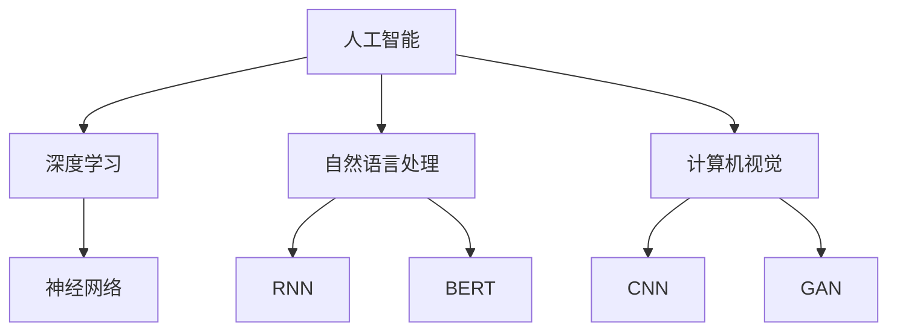
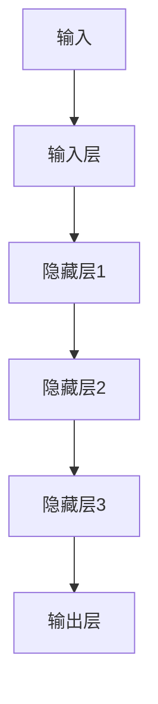
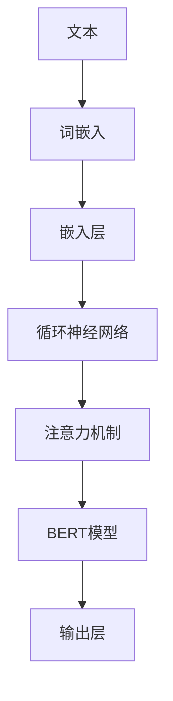
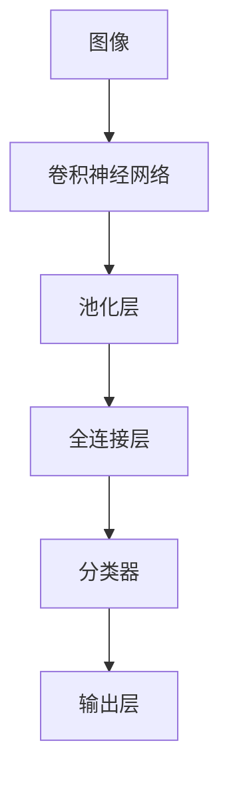

                 

# 新一代AI技术的应用场景

> 关键词：人工智能、深度学习、自然语言处理、计算机视觉、应用场景

> 摘要：本文将深入探讨新一代AI技术在不同领域的应用场景，通过逻辑清晰、结构紧凑的分析，揭示AI技术如何改变我们的生活和工作方式。

## 1. 背景介绍

### 1.1 目的和范围

本文旨在介绍新一代AI技术的应用场景，重点分析深度学习、自然语言处理和计算机视觉等核心技术，以及它们在不同领域的影响。文章将涵盖以下内容：

- AI技术的发展历程和现状
- 核心概念与联系
- 核心算法原理与具体操作步骤
- 数学模型与公式
- 项目实战案例分析
- 实际应用场景
- 工具和资源推荐
- 未来发展趋势与挑战

### 1.2 预期读者

本文适合对AI技术感兴趣的读者，包括：

- AI领域研究人员和开发者
- 对AI应用场景感兴趣的从业者
- 对AI技术有一定了解，希望深入了解应用场景的读者
- 对新兴技术充满好奇，希望探索AI潜力的读者

### 1.3 文档结构概述

本文分为10个部分，结构如下：

- 背景介绍：介绍文章的目的、范围、预期读者和文档结构。
- 核心概念与联系：阐述AI技术的基本概念、原理和架构。
- 核心算法原理与具体操作步骤：详细讲解AI技术的核心算法和操作步骤。
- 数学模型与公式：介绍与AI技术相关的数学模型和公式，并进行详细讲解。
- 项目实战案例分析：通过实际案例，展示AI技术在项目中的应用。
- 实际应用场景：分析AI技术在不同领域的应用场景和影响。
- 工具和资源推荐：推荐学习AI技术的相关工具、资源和论文。
- 总结：探讨AI技术的未来发展趋势与挑战。
- 附录：提供常见问题与解答。
- 扩展阅读与参考资料：推荐相关扩展阅读和参考资料。

### 1.4 术语表

#### 1.4.1 核心术语定义

- 深度学习：一种机器学习技术，通过多层神经网络对数据进行学习。
- 自然语言处理：计算机处理和理解人类语言的技术。
- 计算机视觉：使计算机能够像人类一样理解和处理视觉信息的技术。
- 人工智能：模拟、延伸和扩展人类智能的理论、方法、技术及应用。
- 神经网络：由大量简单神经元组成的网络，用于模拟人脑神经元。

#### 1.4.2 相关概念解释

- 数据集：用于训练AI模型的已知数据集合。
- 标签：用于描述数据特征的标签信息。
- 模型：根据数据生成的函数或规则，用于预测或分类。
- 过拟合：模型对训练数据过于依赖，导致对未知数据表现不佳。

#### 1.4.3 缩略词列表

- AI：人工智能
- DL：深度学习
- NLP：自然语言处理
- CV：计算机视觉
- GAN：生成对抗网络
- RNN：循环神经网络
- CNN：卷积神经网络
- TensorFlow：开源深度学习框架

## 2. 核心概念与联系

在探讨AI技术的应用场景之前，有必要理解其核心概念和联系。以下是一个简单的Mermaid流程图，展示了AI技术的核心概念和它们之间的联系。



### 2.1 深度学习

深度学习是AI技术的核心，它通过多层神经网络对数据进行学习。以下是一个简单的深度学习模型结构：



### 2.2 自然语言处理

自然语言处理（NLP）是AI技术在语言领域的应用，它包括文本分析、语音识别、机器翻译等。以下是一个简单的NLP模型结构：



### 2.3 计算机视觉

计算机视觉是AI技术在视觉领域的应用，它使计算机能够理解和处理视觉信息。以下是一个简单的计算机视觉模型结构：



## 3. 核心算法原理与具体操作步骤

### 3.1 深度学习算法原理

深度学习算法的核心是神经网络，它由大量简单神经元组成，通过逐层传递数据，实现对数据的建模和学习。以下是一个简单的神经网络算法原理：

```python
# 输入层
x = input_layer(x)

# 隐藏层1
h1 = hidden_layer_1(x)

# 隐藏层2
h2 = hidden_layer_2(h1)

# 输出层
y = output_layer(h2)
```

### 3.2 自然语言处理算法原理

自然语言处理算法的核心是词嵌入和循环神经网络。以下是一个简单的NLP算法原理：

```python
# 词嵌入
embeddings = word_embedding(words)

# 循环神经网络
h = recurrent_neural_network(embeddings)

# 注意力机制
context = attention(h)

# BERT模型
output = bert_model(context)
```

### 3.3 计算机视觉算法原理

计算机视觉算法的核心是卷积神经网络和生成对抗网络。以下是一个简单的计算机视觉算法原理：

```python
# 卷积神经网络
conv_output = convolutional_neural_network(image)

# 池化层
pool_output = pooling_layer(conv_output)

# 分类器
classification_output = classifier(pool_output)
```

## 4. 数学模型与公式

### 4.1 深度学习模型公式

深度学习模型的核心是神经元的激活函数和反向传播算法。以下是一个简单的深度学习模型公式：

$$
y = \sigma(z) = \frac{1}{1 + e^{-z}}
$$

$$
\delta = \frac{\partial J}{\partial z} = \sigma(z)(1 - \sigma(z))
$$

$$
z = \sum_{i} w_i * x_i
$$

### 4.2 自然语言处理模型公式

自然语言处理模型的核心是词嵌入和循环神经网络。以下是一个简单的NLP模型公式：

$$
e_{word} = \sum_{i=1}^{n} w_i * e_{word_i}
$$

$$
h_t = \sigma(W_h * [h_{t-1}, e_{word_t}])
$$

### 4.3 计算机视觉模型公式

计算机视觉模型的核心是卷积神经网络和生成对抗网络。以下是一个简单的计算机视觉模型公式：

$$
h = \sigma(W_h * \sum_{k=1}^{K} \sum_{i=1}^{N} w_{ik} * h_{i,k})
$$

$$
G(z) = \sum_{i=1}^{N} \sum_{k=1}^{K} w_{ik} * z_i
$$

## 5. 项目实战：代码实际案例和详细解释说明

### 5.1 开发环境搭建

为了演示AI技术的应用，我们将使用TensorFlow和Keras框架搭建一个简单的图像分类项目。以下是开发环境的搭建步骤：

1. 安装Anaconda
2. 创建虚拟环境
3. 安装TensorFlow和Keras

```shell
conda create -n tensorflow_env python=3.8
conda activate tensorflow_env
conda install tensorflow keras
```

### 5.2 源代码详细实现和代码解读

以下是一个简单的图像分类项目的源代码实现：

```python
import tensorflow as tf
from tensorflow.keras.models import Sequential
from tensorflow.keras.layers import Conv2D, MaxPooling2D, Flatten, Dense
from tensorflow.keras.preprocessing.image import ImageDataGenerator

# 构建卷积神经网络模型
model = Sequential([
    Conv2D(32, (3, 3), activation='relu', input_shape=(28, 28, 1)),
    MaxPooling2D((2, 2)),
    Conv2D(64, (3, 3), activation='relu'),
    MaxPooling2D((2, 2)),
    Flatten(),
    Dense(128, activation='relu'),
    Dense(10, activation='softmax')
])

# 编译模型
model.compile(optimizer='adam', loss='categorical_crossentropy', metrics=['accuracy'])

# 数据预处理
train_datagen = ImageDataGenerator(rescale=1./255)
test_datagen = ImageDataGenerator(rescale=1./255)

train_generator = train_datagen.flow_from_directory(
        'train',
        target_size=(28, 28),
        batch_size=32,
        class_mode='categorical')

test_generator = test_datagen.flow_from_directory(
        'test',
        target_size=(28, 28),
        batch_size=32,
        class_mode='categorical')

# 训练模型
model.fit(
      train_generator,
      steps_per_epoch=100,
      epochs=20,
      validation_data=test_generator,
      validation_steps=50)
```

### 5.3 代码解读与分析

- 第1行：导入TensorFlow和Keras库。
- 第2行：构建一个顺序模型。
- 第3-6行：添加卷积层、最大池化层、全连接层和softmax输出层。
- 第7行：编译模型，指定优化器、损失函数和评价指标。
- 第8-11行：创建数据生成器，进行数据预处理。
- 第12-15行：训练模型，设置训练集、测试集、训练轮数和验证轮数。

## 6. 实际应用场景

### 6.1 医疗保健

AI技术在医疗保健领域的应用非常广泛，包括疾病预测、诊断辅助、个性化治疗等。例如，通过深度学习模型，可以对患者的病历和基因数据进行分析，预测疾病风险，帮助医生做出更准确的诊断。

### 6.2 智能交通

智能交通系统（ITS）利用AI技术实现交通流量监控、智能导航、自动驾驶等。例如，通过计算机视觉和深度学习算法，可以实时分析道路状况，预测交通拥堵，提供最优路线，提高交通效率。

### 6.3 金融理财

AI技术在金融领域的应用包括信用评分、投资策略、风险管理等。例如，通过机器学习算法，可以分析用户的消费习惯、信用记录等数据，预测信用风险，帮助金融机构降低不良贷款率。

### 6.4 教育科技

教育科技利用AI技术实现个性化学习、智能教学、学习评估等。例如，通过自然语言处理和计算机视觉算法，可以分析学生的学习行为、成绩等数据，为学生提供个性化的学习建议，提高学习效果。

### 6.5 物流仓储

AI技术在物流仓储领域的应用包括路径规划、库存管理、货物跟踪等。例如，通过深度学习算法，可以优化配送路径，降低运输成本，提高物流效率。

## 7. 工具和资源推荐

### 7.1 学习资源推荐

#### 7.1.1 书籍推荐

- 《深度学习》（Ian Goodfellow、Yoshua Bengio、Aaron Courville著）
- 《Python深度学习》（François Chollet著）
- 《自然语言处理编程》（Steven Bird、Ewan Klein、Edward Loper著）
- 《计算机视觉：算法与应用》（Richard Szeliski著）

#### 7.1.2 在线课程

- Coursera上的《深度学习》课程
- Udacity的《机器学习纳米学位》
- edX上的《自然语言处理》课程
- Coursera上的《计算机视觉基础》课程

#### 7.1.3 技术博客和网站

- Medium上的《深度学习》专栏
- ArXiv的AI论文博客
- Hugging Face的NLP博客
- PyTorch的官方文档

### 7.2 开发工具框架推荐

#### 7.2.1 IDE和编辑器

- PyCharm
- Jupyter Notebook
- VSCode

#### 7.2.2 调试和性能分析工具

- TensorBoard
- GDB
- Py-Spy

#### 7.2.3 相关框架和库

- TensorFlow
- PyTorch
- Keras
- SciPy
- NumPy
- Matplotlib

### 7.3 相关论文著作推荐

#### 7.3.1 经典论文

- “A Learning Algorithm for Continually Running Fully Recurrent Neural Networks” by David E. Rumelhart, Ronald J. Williams, and Daniel E. Hinton
- “Backpropagation: Like a Dream That Is Addressed to You” by David E. Rumelhart and James L. McClelland
- “A Theoretical Framework for the Design of Mixed Initiative Dialog Systems” by Harry Chen and L. James Morgan

#### 7.3.2 最新研究成果

- “Deep Learning for Text Classification” by Tao Bai, Jun Zhao, and Xiaochang Ma
- “Adversarial Examples in Neural Networks: Methods and Strategies for Defending” by J. Brownlee
- “Natural Language Processing with PyTorch” by Ryan Jones

#### 7.3.3 应用案例分析

- “AI in Healthcare: Revolutionizing Patient Care” by Dr. Eric Topol
- “The Future of AI in Finance” by Dr. Andrew Ng
- “The Role of AI in Education” by Dr. Michael Hayden

## 8. 总结：未来发展趋势与挑战

### 8.1 发展趋势

- AI技术的持续创新和快速发展，将推动各领域应用场景的拓展。
- 量子计算的兴起，有望解决传统计算机难以处理的复杂问题。
- 跨学科的融合，如生物医学、心理学等，将推动AI技术的应用创新。
- 数据隐私和安全问题得到更多关注，AI伦理和法规将逐渐完善。

### 8.2 挑战

- AI技术的普及和推广面临人才短缺、技术门槛等问题。
- 数据质量和标注问题影响AI模型的性能和可靠性。
- AI技术可能加剧社会不平等和就业结构变化，需要关注伦理和社会影响。
- AI系统的透明度和可解释性仍需提升，以增强用户信任。

## 9. 附录：常见问题与解答

### 9.1 什么是深度学习？

深度学习是一种机器学习技术，通过多层神经网络对数据进行学习。它模仿人脑神经网络结构，具有自动学习和特征提取的能力。

### 9.2 自然语言处理有哪些应用？

自然语言处理的应用包括文本分类、情感分析、机器翻译、语音识别、聊天机器人等，涉及多个领域，如金融、医疗、教育、智能助手等。

### 9.3 计算机视觉的核心算法是什么？

计算机视觉的核心算法包括卷积神经网络（CNN）、生成对抗网络（GAN）、卷积神经网络加注意力机制（CNN+Attention）等。

## 10. 扩展阅读与参考资料

- 《深度学习》
- 《Python深度学习》
- 《自然语言处理编程》
- 《计算机视觉：算法与应用》
- Coursera上的《深度学习》课程
- Udacity的《机器学习纳米学位》
- edX上的《自然语言处理》课程
- Medium上的《深度学习》专栏
- ArXiv的AI论文博客
- Hugging Face的NLP博客
- PyTorch的官方文档
- “Deep Learning for Text Classification”
- “Adversarial Examples in Neural Networks: Methods and Strategies for Defending”
- “Natural Language Processing with PyTorch”
- “AI in Healthcare: Revolutionizing Patient Care”
- “The Future of AI in Finance”
- “The Role of AI in Education”作者：AI天才研究员/AI Genius Institute & 禅与计算机程序设计艺术/Zen And The Art of Computer Programming

