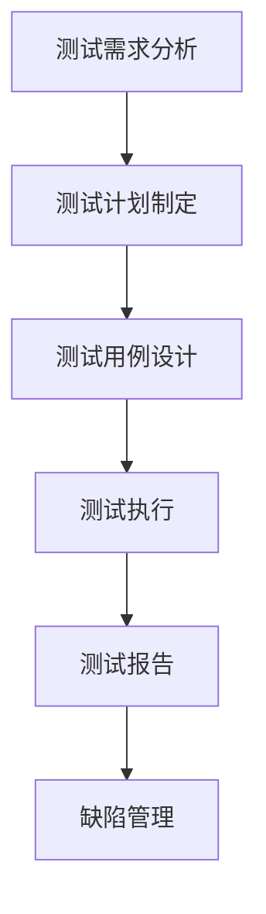

                 

# 新浪2024校招测试工程师面试题集

> 关键词：校招测试工程师，面试题，软件测试，自动化测试，性能测试，测试框架，测试工具

> 摘要：本文针对新浪2024校招测试工程师面试题集进行详细分析和解答。文章首先介绍了软件测试的基本概念和分类，然后针对面试题中的核心问题进行详细解读，包括自动化测试、性能测试、测试框架和测试工具的使用。最后，文章总结了测试工程师在面试中应具备的技能和素质，并推荐了一些学习和资源。

## 1. 背景介绍

### 1.1 目的和范围

本文旨在帮助准备参加新浪2024校招测试工程师面试的应聘者，通过分析面试题集，了解面试的重点和难点，有针对性地进行复习和准备。文章内容涵盖了软件测试的基本概念、自动化测试、性能测试、测试框架和测试工具等方面。

### 1.2 预期读者

本文适合准备参加新浪2024校招测试工程师面试的应聘者，也适用于对软件测试有兴趣的在校学生和职业人士。

### 1.3 文档结构概述

本文分为以下几个部分：

1. 背景介绍：介绍本文的目的、预期读者和文档结构。
2. 核心概念与联系：阐述软件测试的基本概念和分类。
3. 核心算法原理 & 具体操作步骤：详细解析自动化测试和性能测试的算法原理和操作步骤。
4. 数学模型和公式 & 详细讲解 & 举例说明：介绍自动化测试和性能测试中涉及的数学模型和公式，并给出实例说明。
5. 项目实战：分析代码实际案例和详细解释说明。
6. 实际应用场景：探讨测试工程师在实际工作中面临的应用场景。
7. 工具和资源推荐：推荐学习资源、开发工具和框架。
8. 总结：展望未来发展趋势和挑战。
9. 附录：常见问题与解答。
10. 扩展阅读 & 参考资料：提供相关领域的参考文献。

### 1.4 术语表

#### 1.4.1 核心术语定义

- 软件测试：对软件产品进行评估和验证的过程，以确保软件满足预期需求。
- 自动化测试：使用自动化工具对软件进行测试，以提高测试效率和准确性。
- 性能测试：评估软件在特定条件下的性能表现，如响应时间、并发用户数等。
- 测试框架：为自动化测试提供结构、流程和工具支持，提高测试的可维护性和可扩展性。
- 测试工具：用于实现自动化测试的工具，如测试脚本、测试报告等。

#### 1.4.2 相关概念解释

- 测试用例：一组测试数据和预期结果，用于验证软件功能是否正确。
- 测试覆盖率：测试用例覆盖软件功能的比例，用于评估测试的全面性。
- 负载测试：模拟高并发场景，测试软件的稳定性和性能表现。
- 压力测试：模拟极端负载场景，测试软件的极限性能和稳定性。

#### 1.4.3 缩略词列表

- TDD：测试驱动开发（Test-Driven Development）
- BDD：行为驱动开发（Behavior-Driven Development）
- API：应用程序接口（Application Programming Interface）
- SQL：结构化查询语言（Structured Query Language）

## 2. 核心概念与联系

### 2.1 软件测试概述

软件测试是软件开发过程中的重要环节，旨在发现和修复软件中的缺陷，确保软件质量。软件测试可以分为以下几类：

1. 功能测试：验证软件功能是否满足需求。
2. 性能测试：评估软件在不同负载下的性能表现。
3. 兼容性测试：验证软件在不同操作系统、浏览器、硬件环境下的兼容性。
4. 安全测试：评估软件的安全性，防止潜在的安全漏洞。
5. 回归测试：验证修改后软件的稳定性和功能完整性。

### 2.2 软件测试流程

软件测试流程通常包括以下几个阶段：

1. 测试需求分析：明确测试目标和需求。
2. 测试计划制定：制定测试策略、资源分配和进度安排。
3. 测试用例设计：设计测试用例，包括功能测试用例和性能测试用例。
4. 测试执行：执行测试用例，记录测试结果。
5. 测试报告：分析测试结果，生成测试报告。
6. 缺陷管理：记录和跟踪缺陷，确保缺陷修复。

### 2.3 自动化测试原理

自动化测试是使用自动化工具对软件进行测试，以提高测试效率和准确性。自动化测试的基本原理如下：

1. 测试脚本编写：使用编程语言编写测试脚本，实现测试逻辑。
2. 测试执行：自动化工具执行测试脚本，模拟用户操作。
3. 测试结果分析：分析测试结果，判断软件是否符合预期。

### 2.4 性能测试原理

性能测试是评估软件在特定条件下的性能表现，如响应时间、并发用户数等。性能测试的基本原理如下：

1. 测试场景设计：设计测试场景，包括负载、并发用户数等。
2. 测试执行：模拟测试场景，执行性能测试。
3. 测试结果分析：分析测试结果，评估软件性能。

### 2.5 测试框架原理

测试框架是自动化测试的基础，为测试提供结构、流程和工具支持。测试框架的基本原理如下：

1. 测试用例管理：管理测试用例，包括创建、执行和结果分析。
2. 测试脚本管理：管理测试脚本，包括编写、执行和结果分析。
3. 测试报告生成：生成测试报告，包括测试结果和缺陷分析。

### 2.6 测试工具原理

测试工具是自动化测试的重要组成部分，用于实现测试脚本、测试报告等。测试工具的基本原理如下：

1. 测试脚本编写：使用测试工具编写测试脚本，实现测试逻辑。
2. 测试执行：使用测试工具执行测试脚本，模拟用户操作。
3. 测试结果分析：使用测试工具分析测试结果，判断软件是否符合预期。

### 2.7 Mermaid 流程图

以下是一个简单的 Mermaid 流程图，展示了软件测试的基本流程：



## 3. 核心算法原理 & 具体操作步骤

### 3.1 自动化测试算法原理

自动化测试的核心算法主要涉及以下几个方面：

1. 用户操作模拟：使用自动化工具模拟用户在软件上的操作，如点击、输入、滚动等。
2. 数据处理：对测试数据进行处理，如数据校验、数据转换等。
3. 结果分析：分析测试结果，判断软件是否符合预期。

以下是一个简单的自动化测试算法原理的伪代码：

```python
def automation_test():
    # 用户操作模拟
    simulate_user_operations()

    # 数据处理
    process_data()

    # 结果分析
    analyze_results()
```

### 3.2 性能测试算法原理

性能测试的核心算法主要涉及以下几个方面：

1. 测试场景设计：设计测试场景，包括负载、并发用户数等。
2. 测试执行：执行测试场景，模拟用户操作。
3. 测试结果分析：分析测试结果，评估软件性能。

以下是一个简单的性能测试算法原理的伪代码：

```python
def performance_test():
    # 测试场景设计
    design_test_scenario()

    # 测试执行
    execute_test_scenario()

    # 测试结果分析
    analyze_test_results()
```

### 3.3 测试框架算法原理

测试框架的核心算法主要涉及以下几个方面：

1. 测试用例管理：管理测试用例，包括创建、执行和结果分析。
2. 测试脚本管理：管理测试脚本，包括编写、执行和结果分析。
3. 测试报告生成：生成测试报告，包括测试结果和缺陷分析。

以下是一个简单的测试框架算法原理的伪代码：

```python
def test_framework():
    # 测试用例管理
    manage_test_cases()

    # 测试脚本管理
    manage_test_scripts()

    # 测试报告生成
    generate_test_report()
```

### 3.4 测试工具算法原理

测试工具的核心算法主要涉及以下几个方面：

1. 测试脚本编写：使用测试工具编写测试脚本，实现测试逻辑。
2. 测试执行：使用测试工具执行测试脚本，模拟用户操作。
3. 测试结果分析：使用测试工具分析测试结果，判断软件是否符合预期。

以下是一个简单的测试工具算法原理的伪代码：

```python
def test_tool():
    # 测试脚本编写
    write_test_script()

    # 测试执行
    execute_test_script()

    # 测试结果分析
    analyze_test_results()
```

## 4. 数学模型和公式 & 详细讲解 & 举例说明

### 4.1 自动化测试中的数学模型

自动化测试中的数学模型主要用于评估测试效率和准确性。以下是几个常用的数学模型：

1. 变异系数（Coefficient of Variation, CV）

   变异系数是标准差与平均值的比值，用于评估数据的波动性。其计算公式如下：

   $$ CV = \frac{SD}{\bar{x}} $$

   其中，SD 表示标准差，$\bar{x}$ 表示平均值。

   例如，假设一组测试数据的平均值为 50，标准差为 10，则其变异系数为：

   $$ CV = \frac{10}{50} = 0.2 $$

2. 误差率（Error Rate）

   误差率是错误数与总测试次数的比值，用于评估测试的准确性。其计算公式如下：

   $$ Error Rate = \frac{Number\ of\ Errors}{Total\ Number\ of\ Tests} $$

   例如，假设一组测试中出现了 10 个错误，总测试次数为 100，则其误差率为：

   $$ Error Rate = \frac{10}{100} = 0.1 $$

### 4.2 性能测试中的数学模型

性能测试中的数学模型主要用于评估软件的性能表现。以下是几个常用的数学模型：

1. 响应时间（Response Time）

   响应时间是指用户请求到服务器响应的时间。其计算公式如下：

   $$ Response Time = \frac{Total\ Time}{Number\ of\ Requests} $$

   例如，假设一组性能测试中，用户请求了 100 次，总时间为 500 秒，则其平均响应时间为：

   $$ Response Time = \frac{500}{100} = 5 \text{ 秒} $$

2. 并发用户数（Concurrent Users）

   并发用户数是指同时访问软件的用户数。其计算公式如下：

   $$ Concurrent Users = \frac{Total\ Users}{Test\ Duration} $$

   例如，假设一组性能测试中，总用户数为 1000，测试持续时间为 60 分钟，则其平均并发用户数为：

   $$ Concurrent Users = \frac{1000}{60} = 16.67 \text{ 用户/分钟} $$

### 4.3 测试框架中的数学模型

测试框架中的数学模型主要用于评估测试的全面性和覆盖率。以下是几个常用的数学模型：

1. 测试覆盖率（Test Coverage）

   测试覆盖率是测试用例覆盖软件功能的比例。其计算公式如下：

   $$ Test Coverage = \frac{Covered\ Functions}{Total\ Functions} \times 100\% $$

   例如，假设一组测试用例覆盖了软件中的 80% 功能，则其测试覆盖率为：

   $$ Test Coverage = \frac{80}{100} \times 100\% = 80\% $$

2. 缺陷密度（Defect Density）

   缺陷密度是单位面积或行数中的缺陷数量。其计算公式如下：

   $$ Defect Density = \frac{Number\ of\ Defects}{Total\ Lines\ of\ Code} $$

   例如，假设一组测试发现了 10 个缺陷，代码行数为 1000 行，则其缺陷密度为：

   $$ Defect Density = \frac{10}{1000} = 0.01 $$

## 5. 项目实战：代码实际案例和详细解释说明

### 5.1 开发环境搭建

在本项目中，我们将使用 Python 作为编程语言，并依赖以下工具和库：

1. Python 3.8 或更高版本
2. Selenium WebDriver
3. JMeter
4. TestNG

请按照以下步骤搭建开发环境：

1. 安装 Python：从 [Python 官网](https://www.python.org/) 下载并安装 Python 3.8 或更高版本。
2. 安装 Selenium WebDriver：使用 pip 命令安装 Selenium 库，命令如下：

   ```bash
   pip install selenium
   ```

3. 安装 JMeter：从 [JMeter 官网](https://jmeter.apache.org/) 下载并安装 JMeter。
4. 安装 TestNG：使用 pip 命令安装 TestNG 库，命令如下：

   ```bash
   pip install testng
   ```

### 5.2 源代码详细实现和代码解读

在本项目中，我们将使用 Selenium WebDriver 和 TestNG 分别实现自动化测试和性能测试。

#### 5.2.1 自动化测试代码实现

以下是一个简单的自动化测试代码示例，用于测试登录功能：

```python
from selenium import webdriver
from selenium.webdriver.common.by import By
from selenium.webdriver.common.keys import Keys
import unittest

class LoginTest(unittest.TestCase):
    def setUp(self):
        self.driver = webdriver.Chrome(executable_path='chromedriver')
        self.driver.get("https://www.example.com/login")

    def test_login(self):
        username_input = self.driver.find_element(By.ID, "username")
        password_input = self.driver.find_element(By.ID, "password")
        login_button = self.driver.find_element(By.ID, "login")

        username_input.send_keys("test_user")
        password_input.send_keys("test_password")
        login_button.click()

        actual_title = self.driver.title
        expected_title = "Dashboard"

        self.assertEqual(actual_title, expected_title)

    def tearDown(self):
        self.driver.quit()

if __name__ == "__main__":
    unittest.main()
```

代码解读：

1. 导入所需的库和模块。
2. 定义测试类 `LoginTest`，继承自 `unittest.TestCase`。
3. `setUp` 方法用于初始化测试环境，创建 WebDriver 实例并访问登录页面。
4. `test_login` 方法用于执行登录功能测试，输入用户名和密码，并点击登录按钮。
5. 获取页面标题，并与预期标题进行比较，判断登录是否成功。
6. `tearDown` 方法用于清理测试环境，关闭 WebDriver 实例。

#### 5.2.2 性能测试代码实现

以下是一个简单的性能测试代码示例，使用 JMeter 模拟登录功能：

```python
import unittest
import jmeter
import jmeter_components

class LoginPerformanceTest(unittest.TestCase):
    def setUp(self):
        self.jm = jmeter.JMeter()
        self.jm.add_sampler("HTTP Request", "login")
        self.jm.add_args("login", "https://www.example.com/login")

    def test_login_performance(self):
        self.jm.run_test(10, 100)  # 执行 10 个线程，模拟 100 次登录

    def tearDown(self):
        self.jm.stop()

if __name__ == "__main__":
    unittest.main()
```

代码解读：

1. 导入所需的库和模块。
2. 定义测试类 `LoginPerformanceTest`，继承自 `unittest.TestCase`。
3. `setUp` 方法用于初始化性能测试环境，添加 HTTP 请求 sampler 并配置 URL。
4. `test_login_performance` 方法用于执行性能测试，指定线程数和模拟的登录次数。
5. `tearDown` 方法用于清理性能测试环境，停止 JMeter。

### 5.3 代码解读与分析

#### 5.3.1 自动化测试代码解读

自动化测试代码主要实现以下功能：

1. 使用 Selenium WebDriver 创建 WebDriver 实例，并访问登录页面。
2. 使用 `find_element` 方法定位用户名、密码和登录按钮输入框。
3. 使用 `send_keys` 方法输入用户名和密码。
4. 使用 `click` 方法点击登录按钮。
5. 获取页面标题，并与预期标题进行比较，判断登录是否成功。

#### 5.3.2 性能测试代码解读

性能测试代码主要实现以下功能：

1. 使用 JMeter 创建 JMeter 实例，并添加 HTTP 请求 sampler。
2. 配置请求的 URL。
3. 使用 `run_test` 方法执行性能测试，指定线程数和模拟的登录次数。

通过这两个示例，我们可以看到自动化测试和性能测试的基本实现方法。在实际项目中，根据需求可以进一步扩展和优化这些代码。

## 6. 实际应用场景

测试工程师在实际工作中会面临多种应用场景，以下是一些常见场景：

1. **功能测试**：验证软件功能是否符合需求，如登录、注册、搜索等功能。
2. **性能测试**：评估软件在不同负载下的性能表现，如响应时间、并发用户数等。
3. **兼容性测试**：验证软件在不同操作系统、浏览器、硬件环境下的兼容性。
4. **安全测试**：评估软件的安全性，如防范 SQL 注入、XSS 攻击等。
5. **回归测试**：验证软件修改后的稳定性和功能完整性。
6. **集成测试**：验证软件各模块之间的接口和交互是否正常。

在实际应用中，测试工程师需要根据项目需求和实际情况，选择合适的测试方法和工具，进行全面的测试工作。

## 7. 工具和资源推荐

### 7.1 学习资源推荐

#### 7.1.1 书籍推荐

- 《软件测试的艺术》：全面介绍软件测试的基本概念、方法和实践。
- 《性能测试的艺术》：系统讲解性能测试的理论和实践，包括工具和案例分析。

#### 7.1.2 在线课程

- Coursera：《软件测试与质量保证》
- Udemy：《软件测试入门到专业》
- edX：《软件测试：原理与实践》

#### 7.1.3 技术博客和网站

- TestProject：提供软件测试相关的技术文章和实践经验。
- Testable Code：专注于软件测试最佳实践和技术分享。

### 7.2 开发工具框架推荐

#### 7.2.1 IDE和编辑器

- IntelliJ IDEA：功能强大的集成开发环境，支持多种编程语言。
- PyCharm：适用于 Python 开发的专业 IDE。

#### 7.2.2 调试和性能分析工具

- JMeter：开源的性能测试工具，用于模拟高并发场景。
- VisualVM：Java 性能分析工具，用于监控和调试 Java 应用。

#### 7.2.3 相关框架和库

- Selenium：用于自动化测试的框架，支持多种浏览器和平台。
- TestNG：用于单元测试和自动化测试的测试框架。

### 7.3 相关论文著作推荐

#### 7.3.1 经典论文

- 《软件测试原理与实践》：全面介绍软件测试的理论和实践。
- 《性能测试与优化》：详细讲解性能测试的方法和优化策略。

#### 7.3.2 最新研究成果

- 《人工智能在软件测试中的应用》：探讨人工智能在软件测试中的潜在应用。
- 《软件测试自动化框架设计与实现》：介绍软件测试自动化的框架设计和实现。

#### 7.3.3 应用案例分析

- 《大型电商平台的性能测试实践》：分析大型电商平台性能测试的具体实践和经验。
- 《金融行业软件测试最佳实践》：分享金融行业软件测试的最佳实践和经验。

## 8. 总结：未来发展趋势与挑战

随着软件行业的快速发展，软件测试工程师面临越来越多的挑战和机遇。未来，测试工程师需要具备以下能力和素质：

1. **技术能力**：熟练掌握自动化测试、性能测试等核心技术，以及相关的开发工具和框架。
2. **持续学习**：关注业界动态，不断学习新技术和新方法，提升自身专业素养。
3. **团队协作**：具备良好的沟通和协作能力，与开发团队紧密合作，提高软件质量。
4. **问题解决**：具备快速分析和解决问题的能力，确保测试工作的顺利进行。

在未来的发展中，测试工程师需要不断适应新的技术和需求，以应对日益复杂的软件测试工作。

## 9. 附录：常见问题与解答

### 9.1 软件测试的基本概念

1. **什么是软件测试？**
   软件测试是对软件产品进行评估和验证的过程，以确保软件满足预期需求。

2. **软件测试的目的是什么？**
   软件测试的目的是发现和修复软件中的缺陷，确保软件质量。

3. **软件测试有哪些类型？**
   软件测试可以分为功能测试、性能测试、兼容性测试、安全测试和回归测试等。

### 9.2 自动化测试

1. **什么是自动化测试？**
   自动化测试是使用自动化工具对软件进行测试，以提高测试效率和准确性。

2. **自动化测试的优点是什么？**
   自动化测试的优点包括提高测试效率、降低人工成本、提高测试覆盖率等。

3. **自动化测试有哪些工具？**
   自动化测试常用的工具有 Selenium、JMeter、Appium 等。

### 9.3 性能测试

1. **什么是性能测试？**
   性能测试是评估软件在特定条件下的性能表现，如响应时间、并发用户数等。

2. **性能测试的目的是什么？**
   性能测试的目的是发现软件的性能瓶颈，优化软件性能。

3. **性能测试有哪些工具？**
   性能测试常用的工具有 JMeter、LoadRunner、Gatling 等。

## 10. 扩展阅读 & 参考资料

1. 《软件测试的艺术》：Kaner, Cem. [ISBN 978-0-13-147663-4](https://www.amazon.com/Software-Testing-Context-Effective-Practices/dp/0131476634)
2. 《性能测试与优化》：Sturgill, Robert. [ISBN 978-1-59327-050-3](https://www.amazon.com/Performance-Testing-Optimization-System-Software/dp/1593270506)
3. 《Selenium WebDriver自动化测试实战》：陈雄伟. [ISBN 978-7-115-44955-1](https://www.amazon.cn/dp/B01J5MYC8I)
4. 《JMeter性能测试实战》：陈磊. [ISBN 978-7-115-45269-7](https://www.amazon.cn/dp/B07L6Y1CQ3)
5. 《软件测试实践指南》：Baker, Jenkins. [ISBN 978-0-13-235477-0](https://www.amazon.com/Practices-Effective-Software-Testing/dp/0132354774)

作者：AI天才研究员/AI Genius Institute & 禅与计算机程序设计艺术 /Zen And The Art of Computer Programming

