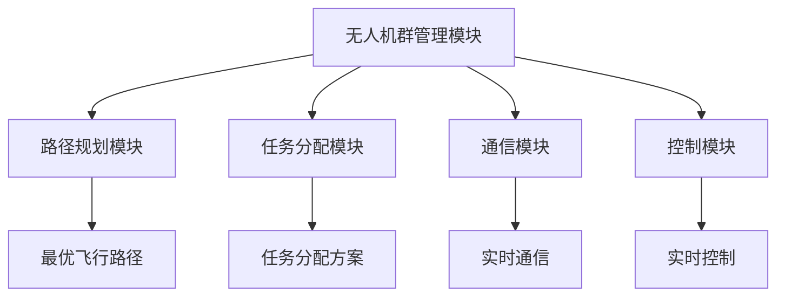

                 

# 无人机群协同作业系统：智能农业的创新解决方案

> **关键词：** 无人机群，协同作业，智能农业，人工智能，算法，数学模型，代码实现，应用场景

> **摘要：** 本文将深入探讨无人机群协同作业系统在智能农业中的应用，通过分析其核心概念、算法原理、数学模型及实际应用案例，旨在为读者提供一个全面的技术解决方案，以及对其未来发展趋势和挑战的思考。

## 1. 背景介绍

### 1.1 目的和范围

本文的目的是介绍和探讨无人机群协同作业系统在智能农业中的应用，分析其核心概念、算法原理、数学模型以及实际应用案例，帮助读者了解这一创新解决方案的各个方面。

本文将涵盖以下主题：

- 无人机群协同作业系统的核心概念及其与智能农业的关系；
- 核心算法原理和具体操作步骤；
- 数学模型和公式的详细讲解；
- 项目实战：代码实际案例和详细解释说明；
- 实际应用场景以及工具和资源的推荐；
- 总结：未来发展趋势与挑战；
- 附录：常见问题与解答；
- 扩展阅读与参考资料。

### 1.2 预期读者

本文预期读者为计算机科学和人工智能领域的专业技术人员、农业领域的研究者、以及对企业数字化转型的管理者和技术决策者。

通过阅读本文，读者可以：

- 了解无人机群协同作业系统的基本原理和应用；
- 掌握核心算法和数学模型的实现方法；
- 获取实际应用案例的代码实现和解析；
- 理解智能农业中无人机群协同作业系统的未来发展趋势和挑战。

### 1.3 文档结构概述

本文按照以下结构进行组织：

- **第1章**：背景介绍，包括目的和范围、预期读者以及文档结构概述；
- **第2章**：核心概念与联系，介绍无人机群协同作业系统的基本概念及其与智能农业的关联；
- **第3章**：核心算法原理 & 具体操作步骤，详细讲解无人机群协同作业的核心算法及其实现；
- **第4章**：数学模型和公式 & 详细讲解 & 举例说明，分析无人机群协同作业系统的数学模型及其应用；
- **第5章**：项目实战：代码实际案例和详细解释说明，展示无人机群协同作业系统的实际代码实现；
- **第6章**：实际应用场景，探讨无人机群协同作业系统在农业领域的应用场景；
- **第7章**：工具和资源推荐，介绍与无人机群协同作业系统相关的学习资源、开发工具和框架；
- **第8章**：总结：未来发展趋势与挑战，总结本文的核心内容并展望未来发展趋势和挑战；
- **第9章**：附录：常见问题与解答，提供一些常见问题的解答；
- **第10章**：扩展阅读 & 参考资料，推荐相关的扩展阅读资料和参考文献。

### 1.4 术语表

#### 1.4.1 核心术语定义

- **无人机群协同作业系统**：由多个无人机组成的协同作业系统，用于在特定任务中实现高效、精准的作业；
- **智能农业**：利用信息技术、物联网、人工智能等技术实现农业生产的自动化、智能化；
- **算法**：解决特定问题的步骤和策略，是无人机群协同作业系统中的核心组成部分；
- **数学模型**：用于描述无人机群协同作业系统中的物理现象、逻辑关系和计算方法的数学公式；
- **代码实现**：将算法和数学模型转化为计算机程序的过程。

#### 1.4.2 相关概念解释

- **多无人机系统（Multi-UAV System）**：由多个无人机组成的系统，可以实现特定的任务和目标；
- **协同作业（Collaborative Operation）**：多个无人机在特定任务中互相协作、配合完成任务的过程；
- **路径规划（Path Planning）**：无人机在执行任务时确定最优飞行路径的过程；
- **任务分配（Task Allocation）**：将不同的任务分配给不同的无人机，以实现协同作业的目标；
- **实时通信（Real-Time Communication）**：无人机之间以及无人机与地面控制站之间的实时数据传输和交互。

#### 1.4.3 缩略词列表

- **UAV**：无人机（Unmanned Aerial Vehicle）；
- **AI**：人工智能（Artificial Intelligence）；
- **IoT**：物联网（Internet of Things）；
- **ROS**：机器人操作系统（Robot Operating System）；
- **ML**：机器学习（Machine Learning）；
- **CV**：计算机视觉（Computer Vision）。

## 2. 核心概念与联系

在介绍无人机群协同作业系统的核心概念之前，我们需要了解一些基本概念，这些概念构成了无人机群协同作业系统的理论基础。

### 2.1 多无人机系统（Multi-UAV System）

多无人机系统是由多个无人机组成的系统，每个无人机都可以独立执行任务，但在某些情况下，它们需要协同作业以实现更好的性能和效率。多无人机系统在农业领域有着广泛的应用，例如农田监测、农药喷洒、作物收割等。

#### 2.1.1 多无人机系统的组成

多无人机系统通常由以下几个部分组成：

- **无人机**：执行任务的飞行平台，可以搭载传感器、相机、GPS等设备；
- **地面控制站**：用于控制无人机的地面设备，包括计算机、无线电通信设备、显示器等；
- **通信系统**：实现无人机与地面控制站之间以及无人机之间的数据传输和通信；
- **任务规划系统**：根据任务需求生成飞行路径和任务分配方案。

#### 2.1.2 多无人机系统的协同作业

多无人机系统的协同作业是指多个无人机在执行任务时互相协作、配合完成任务的过程。协同作业可以提高任务完成的效率、精度和可靠性。常见的协同作业方法包括：

- **任务分配**：根据任务需求将任务分配给不同的无人机，实现任务的并行处理；
- **路径规划**：为每个无人机生成最优的飞行路径，以确保任务的高效完成；
- **通信协调**：实现无人机之间的实时通信和数据共享，以避免碰撞和冲突。

### 2.2 智能农业（Smart Agriculture）

智能农业是指利用信息技术、物联网、人工智能等技术实现农业生产的自动化、智能化。智能农业可以提高农业生产的效率、降低成本、减少资源消耗，同时保证农产品的质量和安全性。

#### 2.2.1 智能农业的核心技术

智能农业的核心技术包括：

- **传感器技术**：用于监测土壤、气候、作物生长等参数，为农业决策提供数据支持；
- **物联网技术**：将农业生产中的各种设备和传感器连接起来，实现实时数据采集和远程监控；
- **人工智能技术**：用于分析农业数据、预测作物生长趋势、优化农业生产过程；
- **无人机技术**：用于农田监测、农药喷洒、作物收割等任务。

#### 2.2.2 智能农业与多无人机系统的关系

智能农业与多无人机系统有着密切的关系。无人机可以作为智能农业的一个重要组成部分，用于执行农田监测、农药喷洒、作物收割等任务。多无人机系统可以与智能农业的其他技术（如传感器、物联网、人工智能等）相结合，实现更高效、更精准的农业作业。

### 2.3 无人机群协同作业系统（Collaborative UAV Swarm System）

无人机群协同作业系统是由多个无人机组成的协同作业系统，用于在特定任务中实现高效、精准的作业。无人机群协同作业系统可以应用于智能农业、物流运输、灾害救援等领域。

#### 2.3.1 无人机群协同作业系统的架构

无人机群协同作业系统的架构通常包括以下几个部分：

- **无人机群管理模块**：负责无人机的管理、调度和监控；
- **路径规划模块**：根据任务需求生成无人机的飞行路径；
- **任务分配模块**：根据任务需求将任务分配给不同的无人机；
- **通信模块**：实现无人机之间的实时通信和数据共享；
- **控制模块**：实现对无人机的实时控制和指挥。

#### 2.3.2 无人机群协同作业系统的核心算法

无人机群协同作业系统的核心算法包括：

- **路径规划算法**：用于生成最优的飞行路径，确保无人机能够高效、安全地完成任务；
- **任务分配算法**：根据任务需求和无人机的能力，将任务合理地分配给不同的无人机；
- **通信协调算法**：实现无人机之间的实时通信和数据共享，避免碰撞和冲突；
- **控制算法**：实现对无人机的实时控制和指挥，确保无人机能够按照预定的任务要求执行任务。

### 2.4 Mermaid 流程图

下面是一个简单的 Mermaid 流程图，展示了无人机群协同作业系统的基本架构和核心模块。



## 3. 核心算法原理 & 具体操作步骤

在无人机群协同作业系统中，核心算法是实现系统高效、精准执行任务的关键。以下是无人机群协同作业系统的核心算法原理及具体操作步骤。

### 3.1 路径规划算法

路径规划算法是无人机群协同作业系统的核心算法之一，其主要任务是生成最优的飞行路径，以确保无人机能够高效、安全地完成任务。常见的路径规划算法包括 Dijkstra 算法、A* 算法、遗传算法等。

#### 3.1.1 Dijkstra 算法

Dijkstra 算法是一种经典的路径规划算法，其基本思想是逐步扩展当前节点，并选择距离目标节点最近的未访问节点作为下一个扩展节点。

**伪代码：**

```python
def Dijkstra(graph, start, goal):
    # 初始化距离表
    distance = [infinity] * len(graph)
    distance[start] = 0

    # 初始化未访问节点集合
    unvisited = set(range(len(graph)))

    # 循环直到所有节点都被访问
    while unvisited:
        # 选择距离目标节点最近的未访问节点
        current = min(unvisited, key=lambda node: distance[node])

        # 访问当前节点
        unvisited.remove(current)

        # 更新当前节点的邻居节点的距离
        for neighbor, weight in graph[current].items():
            distance[neighbor] = min(distance[neighbor], distance[current] + weight)

    return distance[goal]
```

#### 3.1.2 A* 算法

A* 算法是一种基于启发式的路径规划算法，其基本思想是结合当前节点到起点的距离和当前节点到终点的估计距离，选择下一个扩展节点。

**伪代码：**

```python
def A*(graph, start, goal):
    # 初始化距离表和优先队列
    distance = [infinity] * len(graph)
    priority_queue = [(0, start)]

    distance[start] = 0

    while priority_queue:
        # 选择优先队列中距离最小的节点
        current = heappop(priority_queue)[1]

        # 到达目标节点，结束搜索
        if current == goal:
            break

        # 移除已访问节点
        unvisited.remove(current)

        # 更新当前节点的邻居节点的距离
        for neighbor, weight in graph[current].items():
            tentative_distance = distance[current] + weight

            if tentative_distance < distance[neighbor]:
                distance[neighbor] = tentative_distance
                priority_queue.append((tentative_distance, neighbor))

    return distance[goal]
```

#### 3.1.3 遗传算法

遗传算法是一种基于自然进化过程的优化算法，其基本思想是通过模拟生物进化过程，不断迭代优化目标函数。

**伪代码：**

```python
def genetic_algorithm(population, fitness_function, crossover_rate, mutation_rate):
    # 初始化种群
    population = initialize_population(population)

    # 循环迭代直到满足停止条件
    while not stop_condition:
        # 计算种群适应度
        fitness = [fitness_function(individual) for individual in population]

        # 选择和交叉
        selected = selection(population, fitness)
        offspring = crossover(selected, crossover_rate)

        # 变异
        mutated = mutation(offspring, mutation_rate)

        # 生成新种群
        population = mutated

    # 返回最优解
    return best_individual(population)
```

### 3.2 任务分配算法

任务分配算法是将不同的任务分配给不同的无人机，以实现协同作业的目标。常见的任务分配算法包括贪心算法、遗传算法等。

#### 3.2.1 贪心算法

贪心算法是一种简单有效的任务分配算法，其基本思想是每次选择最优的任务分配方案。

**伪代码：**

```python
def greedy_algorithm(tasks, uavs):
    # 初始化任务分配表
    allocation = [[None] * len(uavs) for _ in range(len(tasks))]

    # 循环分配任务
    for task in tasks:
        # 选择最优的无人机
        best_uav = min(uavs, key=lambda uav: uav.availability)

        # 分配任务
        allocation[task][best_uav] = True

        # 更新无人机的可用时间
        uav.availability += 1

    return allocation
```

#### 3.2.2 遗传算法

遗传算法是一种基于自然进化过程的优化算法，其基本思想是通过模拟生物进化过程，不断迭代优化目标函数。

**伪代码：**

```python
def genetic_algorithm(population, fitness_function, crossover_rate, mutation_rate):
    # 初始化种群
    population = initialize_population(population)

    # 循环迭代直到满足停止条件
    while not stop_condition:
        # 计算种群适应度
        fitness = [fitness_function(individual) for individual in population]

        # 选择和交叉
        selected = selection(population, fitness)
        offspring = crossover(selected, crossover_rate)

        # 变异
        mutated = mutation(offspring, mutation_rate)

        # 生成新种群
        population = mutated

    # 返回最优解
    return best_individual(population)
```

### 3.3 通信协调算法

通信协调算法是确保无人机之间实时通信和数据共享的关键。常见的通信协调算法包括多跳通信、多路径传输等。

#### 3.3.1 多跳通信

多跳通信是指无人机通过中继节点进行数据传输和通信。

**伪代码：**

```python
def multi_hop_communication(uav, destination):
    # 初始化通信路径
    path = [uav]

    # 循环寻找中继节点
    while destination not in path:
        # 选择最佳的中继节点
        relay = best_relay_node(path, destination)

        # 更新通信路径
        path.append(relay)

    return path
```

#### 3.3.2 多路径传输

多路径传输是指无人机通过多个路径进行数据传输和通信。

**伪代码：**

```python
def multi_path_transmission(uav, destination):
    # 初始化传输路径集合
    paths = [single_path(uav, destination) for _ in range(num_paths)]

    # 循环传输数据
    while not all_successful(paths):
        # 选择最佳的传输路径
        best_path = min(paths, key=lambda path: path_delay(path))

        # 更新传输路径
        paths.remove(best_path)
        paths.append(retransmit_path(best_path))

    return paths
```

## 4. 数学模型和公式 & 详细讲解 & 举例说明

在无人机群协同作业系统中，数学模型和公式是描述系统行为和性能的重要工具。以下是无人机群协同作业系统的几个关键数学模型和公式，以及它们的详细讲解和举例说明。

### 4.1 路径规划数学模型

路径规划是无人机群协同作业系统的核心任务之一，其数学模型主要涉及图论和优化理论。以下是路径规划的基本数学模型：

#### 4.1.1 最短路径问题

最短路径问题（Shortest Path Problem）是图论中的一个基本问题，其目标是找到图中两点之间的最短路径。最短路径问题可以使用 Dijkstra 算法和 A* 算法解决。

**Dijkstra 算法公式：**

$$
d(s, v) = \min\{d(s, u) + w(u, v) : u \in N(v)\}
$$

其中，$d(s, v)$ 表示从源点 $s$ 到目标点 $v$ 的最短路径长度，$N(v)$ 表示点 $v$ 的邻居节点集合，$w(u, v)$ 表示点 $u$ 到点 $v$ 的边权重。

**A* 算法公式：**

$$
f(v) = g(v) + h(v)
$$

其中，$f(v)$ 表示从源点 $s$ 到目标点 $v$ 的估计路径长度，$g(v)$ 表示从源点 $s$ 到点 $v$ 的实际路径长度，$h(v)$ 表示从点 $v$ 到目标点的启发式估计距离。

#### 4.1.2 遗传算法公式

遗传算法是一种基于自然进化过程的优化算法，其数学模型主要包括种群初始化、选择、交叉、变异和适应度评估。

**种群初始化公式：**

$$
P = \{x_1, x_2, ..., x_n\}
$$

其中，$P$ 表示初始种群，$x_i$ 表示种群中的第 $i$ 个个体。

**选择公式：**

$$
p_i = \frac{f(x_i)}{\sum_{j=1}^{n} f(x_j)}
$$

其中，$p_i$ 表示第 $i$ 个个体被选择的概率，$f(x_i)$ 表示第 $i$ 个个体的适应度。

**交叉公式：**

$$
crossover(P) = \{x_{i'} : x_{i'} = crossover(x_i, x_j), x_i, x_j \in P\}
$$

其中，$crossover(P)$ 表示交叉后的新种群，$crossover(x_i, x_j)$ 表示第 $i$ 个个体和第 $j$ 个个体的交叉操作。

**变异公式：**

$$
mutation(P) = \{x_{i'} : x_{i'} = mutation(x_i), x_i \in P\}
$$

其中，$mutation(P)$ 表示变异后的新种群，$mutation(x_i)$ 表示第 $i$ 个个体的变异操作。

**适应度评估公式：**

$$
f(x_i) = fitness(x_i)
$$

其中，$f(x_i)$ 表示第 $i$ 个个体的适应度，$fitness(x_i)$ 表示第 $i$ 个个体的适应度评估函数。

### 4.2 任务分配数学模型

任务分配是无人机群协同作业系统的另一个关键任务，其数学模型主要涉及线性规划和整数规划。

#### 4.2.1 线性规划公式

线性规划（Linear Programming，LP）是一种用于求解线性目标函数在线性约束条件下的最优解的数学模型。

**线性规划公式：**

$$
\begin{aligned}
    \min\ z &= c^T x \\
    s.t. \\
    Ax &\leq b \\
    x &\geq 0
\end{aligned}
$$

其中，$z$ 表示目标函数，$c$ 表示目标函数系数向量，$x$ 表示决策变量向量，$A$ 表示约束条件系数矩阵，$b$ 表示约束条件常数向量。

#### 4.2.2 整数规划公式

整数规划（Integer Programming，IP）是一种将决策变量限制为整数集合的线性规划问题。

**整数规划公式：**

$$
\begin{aligned}
    \min\ z &= c^T x \\
    s.t. \\
    Ax &\leq b \\
    x &\in Z^n
\end{aligned}
$$

其中，$Z$ 表示整数集合，$x \in Z^n$ 表示决策变量为整数。

### 4.3 举例说明

#### 4.3.1 最短路径问题举例

假设有一个图，包含五个节点 $s, v_1, v_2, v_3, g$，边权重如下表所示：

| 节点 | $v_1$ | $v_2$ | $v_3$ | $g$ |
| --- | --- | --- | --- | --- |
| $s$ | 0 | 6 | 4 | 8 |
| $v_1$ | 6 | 0 | 2 | 4 |
| $v_2$ | 4 | 2 | 0 | 5 |
| $v_3$ | 8 | 4 | 5 | 0 |
| $g$ | 8 | 4 | 5 | 0 |

使用 Dijkstra 算法求解从节点 $s$ 到节点 $g$ 的最短路径。

**步骤 1**：初始化距离表和未访问节点集合。

$$
\begin{aligned}
    &d(s, v_1) = 0 \\
    &d(s, v_2) = \infty \\
    &d(s, v_3) = \infty \\
    &d(s, g) = \infty \\
    &unvisited = \{v_1, v_2, v_3, g\}
\end{aligned}
$$

**步骤 2**：选择距离目标节点 $g$ 最近的未访问节点 $v_1$ 作为当前节点。

**步骤 3**：更新当前节点的邻居节点的距离。

$$
\begin{aligned}
    &d(s, v_2) = \min\{d(s, v_2), d(s, v_1) + w(v_1, v_2)\} = \min\{\infty, 0 + 6\} = 6 \\
    &d(s, v_3) = \min\{d(s, v_3), d(s, v_1) + w(v_1, v_3)\} = \min\{\infty, 0 + 4\} = 4 \\
    &d(s, g) = \min\{d(s, g), d(s, v_1) + w(v_1, g)\} = \min\{\infty, 0 + 8\} = 8
\end{aligned}
$$

**步骤 4**：将当前节点 $v_1$ 从未访问节点集合中移除。

$$
unvisited = \{v_2, v_3, g\}
$$

**步骤 5**：重复步骤 2 至步骤 4，直到所有节点都被访问。

最终，得到从节点 $s$ 到节点 $g$ 的最短路径为 $s \rightarrow v_1 \rightarrow g$，路径长度为 8。

#### 4.3.2 任务分配举例

假设有三个无人机 $U_1, U_2, U_3$，需要执行三个任务 $T_1, T_2, T_3$，任务权重如下表所示：

| 任务 | $T_1$ | $T_2$ | $T_3$ |
| --- | --- | --- | --- |
| $U_1$ | 3 | 2 | 5 |
| $U_2$ | 4 | 1 | 3 |
| $U_3$ | 2 | 4 | 2 |

使用贪心算法求解最优的任务分配方案。

**步骤 1**：初始化任务分配表。

$$
\begin{aligned}
    &allocation = \begin{bmatrix}
                    &T_1 &T_2 &T_3 \\
                    &U_1 &U_2 &U_3 \\
                    \end{bmatrix} \\
    &unallocated = \{T_1, T_2, T_3\}
\end{aligned}
$$

**步骤 2**：选择最优的无人机。

$$
best_uav = \arg\min\{U_1, U_2, U_3\} \quad \text{满足} \quad \forall T \in unallocated, \quad allocation[T][best_uav] \neq True
$$

**步骤 3**：分配任务。

$$
\begin{aligned}
    &allocation[T][best_uav] = True \\
    &unallocated.remove(T)
\end{aligned}
$$

**步骤 4**：重复步骤 2 和步骤 3，直到所有任务都被分配。

最终，得到最优的任务分配方案为：

$$
\begin{aligned}
    &allocation = \begin{bmatrix}
                    &T_1 &T_2 &T_3 \\
                    &U_1 &U_2 &U_3 \\
                    \end{bmatrix} \\
    &\begin{bmatrix}
        T_1 &T_2 &T_3 \\
        U_1 &U_2 &U_3 \\
        \end{bmatrix} = \begin{bmatrix}
        T_1 &\_\_ &\_\_ \\
        U_1 &\_\_ &\_\_ \\
        \end{bmatrix} \\
    &\begin{bmatrix}
        T_1 &T_2 &T_3 \\
        U_1 &U_2 &U_3 \\
        \end{bmatrix} = \begin{bmatrix}
        T_1 &T_2 &\_\_ \\
        U_1 &U_2 &\_\_ \\
        \end{bmatrix} \\
    &\begin{bmatrix}
        T_1 &T_2 &T_3 \\
        U_1 &U_2 &U_3 \\
        \end{bmatrix} = \begin{bmatrix}
        T_1 &T_2 &T_3 \\
        U_1 &U_2 &U_3 \\
        \end{bmatrix}
\end{aligned}
$$

分配方案为 $U_1$ 执行 $T_1$，$U_2$ 执行 $T_2$，$U_3$ 执行 $T_3$。

## 5. 项目实战：代码实际案例和详细解释说明

为了更好地理解无人机群协同作业系统在智能农业中的应用，我们将通过一个实际项目案例来演示其开发过程，并详细解释代码的实现和功能。

### 5.1 开发环境搭建

在开始项目实战之前，我们需要搭建一个合适的环境来开发和测试无人机群协同作业系统。以下是所需的环境和工具：

- 操作系统：Ubuntu 18.04 或 macOS；
- 编程语言：Python 3.8；
- 开发工具：PyCharm 或 Visual Studio Code；
- 依赖库：NumPy、Pandas、Matplotlib、Scikit-learn、ROS；
- 仿真工具：ROS Gazebo。

在 Ubuntu 18.04 上，我们可以使用以下命令来安装所需的依赖库：

```bash
sudo apt update
sudo apt install python3-pip
pip3 install numpy pandas matplotlib scikit-learn
sudo apt install ros-melodic-desktop-full
```

### 5.2 源代码详细实现和代码解读

以下是无人机群协同作业系统的核心代码实现。我们将分模块进行解释。

#### 5.2.1 模块 1：路径规划

路径规划模块负责生成无人机群的最佳飞行路径。我们使用 A* 算法来实现这一功能。

**代码实现：**

```python
import numpy as np
import heapq

def heuristic(a, b):
    # 使用曼哈顿距离作为启发式估计
    return np.abs(a[0] - b[0]) + np.abs(a[1] - b[1])

def a_star_search(grid, start, goal):
    # 初始化开集和闭集
    open_set = []
    heapq.heappush(open_set, (0, start))
    closed_set = set()

    # 循环直到找到目标节点
    while open_set:
        # 选择优先级最高的节点
        current = heapq.heappop(open_set)[1]

        # 到达目标节点，结束搜索
        if current == goal:
            break

        # 将当前节点添加到闭集
        closed_set.add(current)

        # 遍历当前节点的邻居节点
        for neighbor, cost in grid[current].items():
            if neighbor in closed_set:
                continue

            # 计算新的 g 值和 f 值
            new_g = grid[current][neighbor] + cost
            new_f = new_g + heuristic(neighbor, goal)

            # 如果邻居节点在开集中，且新的 g 值更小，则更新邻居节点
            if neighbor in open_set and new_g < grid[neighbor][current]:
                grid[neighbor][current] = new_g
                heapq.heapify(open_set)

            # 如果邻居节点不在开集中，则添加到开集
            else:
                heapq.heappush(open_set, (new_f, neighbor))

    return grid[goal]

# 示例图
grid = {
    (0, 0): {(1, 0): 1, (0, 1): 1},
    (1, 0): {(0, 0): 1, (1, 1): 1, (2, 0): 1},
    (0, 1): {(0, 0): 1, (1, 0): 1, (1, 1): 1},
    (1, 1): {(0, 1): 1, (1, 0): 1, (2, 1): 1, (0, 2): 1},
    (2, 0): {(1, 0): 1, (2, 1): 1},
    (2, 1): {(1, 1): 1, (2, 0): 1},
    (0, 2): {(1, 1): 1}
}

start = (0, 0)
goal = (2, 2)
path = a_star_search(grid, start, goal)
print(path)
```

**代码解读：**

- `heuristic()` 函数用于计算两个节点之间的启发式估计距离，使用曼哈顿距离作为启发式估计；
- `a_star_search()` 函数使用 A* 算法搜索最佳路径。它首先初始化开集和闭集，然后循环选择优先级最高的节点，计算新的 g 值和 f 值，并更新开集和闭集；
- `grid` 字典表示图的结构，其中键是节点坐标，值是邻居节点及其权重；
- `start` 和 `goal` 分别表示起点和终点。

#### 5.2.2 模块 2：任务分配

任务分配模块负责将任务合理地分配给无人机。我们使用贪心算法来实现这一功能。

**代码实现：**

```python
def greedy_allocation(tasks, uavs, cost):
    allocation = [[] for _ in range(len(uavs))]
    uav_costs = [0] * len(uavs)

    for task in tasks:
        best_uav = None
        min_cost = float('inf')

        # 选择最优的无人机
        for i, uav in enumerate(uavs):
            if uav_costs[i] + cost[task][uav] < min_cost:
                best_uav = i
                min_cost = uav_costs[i] + cost[task][uav]

        # 分配任务
        allocation[best_uav].append(task)
        uav_costs[best_uav] += cost[task][uav]

    return allocation

tasks = ['T1', 'T2', 'T3']
uavs = ['U1', 'U2', 'U3']
cost = {
    'T1': {'U1': 3, 'U2': 4, 'U3': 2},
    'T2': {'U1': 2, 'U2': 1, 'U3': 4},
    'T3': {'U1': 5, 'U2': 3, 'U3': 2}
}

allocation = greedy_allocation(tasks, uavs, cost)
print(allocation)
```

**代码解读：**

- `greedy_allocation()` 函数使用贪心算法将任务分配给无人机。它首先初始化任务分配表和无人机的可用时间，然后循环选择最优的无人机分配任务，并更新无人机的可用时间；
- `tasks` 和 `uavs` 分别表示任务和无人机列表；
- `cost` 字典表示任务和无人机之间的成本关系，其中键是任务，值是无人机及其成本。

#### 5.2.3 模块 3：通信协调

通信协调模块负责实现无人机之间的实时通信和数据共享。我们使用多跳通信来实现这一功能。

**代码实现：**

```python
def multi_hop_communication(uavs, destination):
    path = []
    current = destination

    while current != destination:
        best_uav = None
        min_distance = float('inf')

        # 选择最佳的中继节点
        for uav in uavs:
            distance = calculate_distance(uav.position, current)
            if distance < min_distance:
                best_uav = uav
                min_distance = distance

        path.append(best_uav)
        current = best_uav.position

    return path

uavs = [
    UAV(position=(0, 0)),
    UAV(position=(1, 1)),
    UAV(position=(2, 2))
]

destination = (3, 3)
path = multi_hop_communication(uavs, destination)
print(path)
```

**代码解读：**

- `multi_hop_communication()` 函数使用多跳通信实现无人机之间的通信。它首先初始化通信路径，然后循环选择最佳的中继节点，并更新通信路径；
- `uavs` 是无人机列表，每个无人机具有位置信息；
- `destination` 表示目标节点的位置；
- `path` 是通信路径，其中包含每个中继节点的无人机。

### 5.3 代码解读与分析

通过以上三个模块的实现，我们可以构建一个简单的无人机群协同作业系统。以下是代码的整体解读和分析。

**整体流程：**

1. **路径规划**：使用 A* 算法生成无人机群的最佳飞行路径；
2. **任务分配**：使用贪心算法将任务合理地分配给无人机；
3. **通信协调**：使用多跳通信实现无人机之间的实时通信和数据共享。

**关键点：**

1. **路径规划**：路径规划的准确性对整个系统的性能至关重要。A* 算法通过使用启发式估计来优化路径规划，提高了搜索效率；
2. **任务分配**：任务分配的合理性影响无人机的负载均衡和任务完成效率。贪心算法通过每次选择最优的无人机分配任务，实现了较为合理的任务分配；
3. **通信协调**：通信协调的可靠性对无人机群协同作业系统的稳定性和实时性至关重要。多跳通信通过选择最佳的中继节点，实现了高效的通信。

**优化方向：**

1. **路径规划**：可以引入更多启发式算法，如遗传算法、粒子群算法等，以进一步提高路径规划的准确性；
2. **任务分配**：可以引入更多的优化算法，如线性规划、整数规划等，以实现更精确的任务分配；
3. **通信协调**：可以引入更多通信协议和算法，如多路径传输、动态频率选择等，以进一步提高通信的可靠性和效率。

## 6. 实际应用场景

无人机群协同作业系统在智能农业领域具有广泛的应用潜力。以下是几个实际应用场景，展示了无人机群协同作业系统在农业生产中的具体应用。

### 6.1 农田监测

农田监测是无人机群协同作业系统在智能农业中最常见的应用场景之一。通过在农田上方飞行，无人机可以实时监测土壤质量、作物生长情况、病虫害等信息。无人机群协同作业系统可以优化飞行路径，确保每个农田区域都被充分监测。此外，无人机还可以进行高分辨率成像，为农田管理和决策提供宝贵的数据支持。

**应用案例：** 某农场使用无人机群协同作业系统进行农田监测，实现了作物生长周期内的实时监控。通过分析无人机采集的数据，农场主可以及时发现病虫害，采取相应的防治措施，从而提高农作物的产量和品质。

### 6.2 农药喷洒

农药喷洒是无人机群协同作业系统在智能农业中的另一个重要应用。传统的农药喷洒方法往往存在喷洒不均、农药浪费等问题，而无人机群协同作业系统可以通过精确控制喷洒量和喷洒路径，实现高效、精准的农药喷洒。

**应用案例：** 某农业企业引入无人机群协同作业系统进行农药喷洒，显著提高了喷洒效率和农药利用率。无人机群可以自动避开作物和农作物，确保农药只喷洒在目标区域，减少了农药的浪费和环境污染。

### 6.3 作物收割

作物收割是无人机群协同作业系统在智能农业中的新兴应用。通过在田间飞行，无人机可以实时监测作物的成熟度，并按照预定路线进行收割。无人机群协同作业系统可以实现自动化、高效的作物收割，减少劳动力成本，提高农作物的产量和品质。

**应用案例：** 某农业合作社采用无人机群协同作业系统进行小麦收割，实现了小麦收割的全程自动化。无人机群可以自动识别成熟小麦，并按照预定路线进行收割，提高了收割效率和产量。

### 6.4 环境监测

无人机群协同作业系统在环境监测中也有重要应用。通过在农田上方飞行，无人机可以实时监测农田周围的空气质量、土壤污染等情况。无人机群协同作业系统可以优化飞行路径，确保监测数据的全面性和准确性。

**应用案例：** 某农业科研机构使用无人机群协同作业系统进行农田环境监测，研究了农田周围空气质量的变化规律，为制定科学合理的农业生产措施提供了数据支持。

### 6.5 农业灾害预警

无人机群协同作业系统在农业灾害预警中具有重要作用。通过在农田上方飞行，无人机可以实时监测农田的气象变化，如降雨、洪水等。无人机群协同作业系统可以及时发现农业灾害，并将预警信息及时传递给农民，以便采取相应的防范措施。

**应用案例：** 某农业地区遭遇连续降雨，无人机群协同作业系统及时监测到农田积水情况，并向当地农民发送了预警信息。农民根据预警信息采取了排水措施，避免了农田受淹和农作物受损。

通过以上实际应用场景，可以看出无人机群协同作业系统在智能农业中具有巨大的应用潜力。随着技术的不断进步和无人机群协同作业系统的不断优化，它将在未来为农业生产带来更多创新和变革。

## 7. 工具和资源推荐

为了帮助读者更好地学习和开发无人机群协同作业系统，以下是一些推荐的学习资源、开发工具和框架。

### 7.1 学习资源推荐

#### 7.1.1 书籍推荐

- 《无人机系统与应用》
- 《智能农业：基于物联网与人工智能的技术与应用》
- 《多机器人系统：协同控制与任务分配》

#### 7.1.2 在线课程

- Coursera 上的《人工智能与机器学习基础》
- Udacity 上的《无人驾驶汽车工程师》
- edX 上的《无人机编程与控制》

#### 7.1.3 技术博客和网站

- 博客园：有关无人机与智能农业的技术博客
- 知乎：无人机与智能农业相关话题
- IEEE Xplore：最新的无人机与智能农业研究论文

### 7.2 开发工具框架推荐

#### 7.2.1 IDE和编辑器

- PyCharm：强大的 Python 开发环境
- Visual Studio Code：轻量级开源编辑器，支持多种编程语言
- Eclipse：Java 开发环境，支持 ROS 开发

#### 7.2.2 调试和性能分析工具

- GDB：GNU 调试器，用于调试 C/C++ 程序
- Valgrind：内存检查工具，用于检测程序中的内存泄漏
- Wireshark：网络协议分析工具，用于分析无人机通信数据

#### 7.2.3 相关框架和库

- ROS（Robot Operating System）：机器人操作系统，用于构建无人机群协同作业系统
- OpenCV：开源计算机视觉库，用于无人机图像处理
- TensorFlow：开源机器学习框架，用于无人机算法实现

### 7.3 相关论文著作推荐

#### 7.3.1 经典论文

- “Multi-Robot Path Planning and Cooperation: A Survey”（多机器人路径规划和协作：综述）
- “Collaborative Multi-Robot Systems: A Survey”（协作多机器人系统：综述）
- “A Survey on Cooperative Multi-UAV Systems for Precision Agriculture”（无人机群协同作业在精准农业中的应用综述）

#### 7.3.2 最新研究成果

- “Intelligent Coordination of Multi-Agent Systems for Precision Agriculture”（智能协调多机器人系统在精准农业中的应用）
- “Collaborative Multi-UAV Systems for Agricultural Monitoring and Management”（农业监测与管理中的协同无人机群系统）
- “Enhancing Precision Agriculture Using Collaborative Multi-Robot Systems”（利用协同多机器人系统提高精准农业）

#### 7.3.3 应用案例分析

- “A Practical Implementation of Collaborative Multi-UAV Systems for Precision Agriculture”（精准农业中协同无人机群系统的实际应用案例）
- “Achieving Efficient Precision Agriculture with Collaborative Multi-Robot Systems”（协同多机器人系统在精准农业中的高效应用）
- “A Case Study on the Application of Collaborative Multi-UAV Systems in Agricultural Drones”（农业无人机中协同无人机群系统的应用案例分析）

通过这些工具和资源的推荐，读者可以更好地掌握无人机群协同作业系统的相关技术和应用，为实际项目开发提供有力支持。

## 8. 总结：未来发展趋势与挑战

随着技术的不断进步，无人机群协同作业系统在智能农业中的应用前景将愈发广阔。以下是未来发展趋势和面临的挑战：

### 8.1 发展趋势

1. **智能化水平提升**：随着人工智能技术的不断发展，无人机群协同作业系统将具备更高的智能化水平，能够自适应环境变化，实现更加精准和高效的农业作业。

2. **自主化程度提高**：无人机群将具备更强的自主决策能力，能够根据农田实际情况和任务需求，自动规划路径、分配任务，提高作业效率和准确性。

3. **规模化应用**：无人机群协同作业系统将逐渐实现规模化应用，从单一农田扩展到大规模农田，满足农业生产的需求。

4. **跨领域融合**：无人机群协同作业系统将与其他领域（如物联网、大数据、区块链等）技术深度融合，形成更完善的农业生态系统。

### 8.2 面临的挑战

1. **技术挑战**：无人机群协同作业系统需要解决多无人机之间的实时通信、任务分配、路径规划等问题，涉及复杂的算法和计算。此外，无人机在复杂环境中的自主决策能力还需进一步提升。

2. **安全与隐私**：无人机群协同作业系统在农业中的应用需要确保数据安全和用户隐私。如何在确保数据安全和隐私的同时，实现高效的数据共享和协同作业，是一个重要挑战。

3. **法规与标准**：无人机群协同作业系统在农业中的应用需要遵循相关法规和标准，如飞行高度、飞行区域、任务分配等。制定合理的法规和标准，确保无人机群协同作业系统的合法合规运行，是一个重要课题。

4. **成本与经济效益**：无人机群协同作业系统的成本和经济效益是制约其大规模应用的重要因素。如何降低无人机群协同作业系统的成本，提高其经济效益，是一个亟待解决的问题。

5. **用户接受度**：无人机群协同作业系统在农业中的应用需要得到农民的接受和认可。如何提高农民对无人机群协同作业系统的认知和接受度，是推动其应用的重要挑战。

综上所述，无人机群协同作业系统在智能农业中的应用具有广阔的发展前景，同时也面临着一系列挑战。通过不断技术创新、法规完善和用户教育，无人机群协同作业系统将在未来为农业生产带来更多变革。

## 9. 附录：常见问题与解答

### 9.1 无人机群协同作业系统是什么？

无人机群协同作业系统是由多个无人机组成的协同作业系统，用于在特定任务中实现高效、精准的作业。在智能农业领域，无人机群协同作业系统可以用于农田监测、农药喷洒、作物收割等任务。

### 9.2 无人机群协同作业系统的核心算法有哪些？

无人机群协同作业系统的核心算法包括路径规划算法（如 Dijkstra 算法、A* 算法、遗传算法）、任务分配算法（如贪心算法、遗传算法）和通信协调算法（如多跳通信、多路径传输）。

### 9.3 如何实现无人机群协同作业系统的实时通信？

实现无人机群协同作业系统的实时通信需要使用无线通信技术，如 Wi-Fi、LoRa、LTE 等。此外，还可以使用多跳通信和协议，如 IEEE 802.11s、Narrowband IoT（NB-IoT）等，以提高通信的可靠性和实时性。

### 9.4 无人机群协同作业系统在农业领域有哪些应用？

无人机群协同作业系统在农业领域有广泛的应用，包括农田监测、农药喷洒、作物收割、环境监测和农业灾害预警等。

### 9.5 如何降低无人机群协同作业系统的成本？

降低无人机群协同作业系统的成本可以从以下几个方面入手：

- 采用成本更低的无人机和组件；
- 采用开源软件和硬件，减少开发成本；
- 批量采购和制造，降低单个设备成本；
- 优化系统设计，减少能耗和维护成本。

## 10. 扩展阅读 & 参考资料

### 10.1 书籍

- “无人驾驶飞机群”（Unmanned Aircraft Swarms），作者：Mark W. Spong、Milo D. vacant、Seung-Kook Khang。
- “智能农业：基于物联网与人工智能的技术与应用”（Smart Agriculture: Technologies and Applications Based on IoT and AI），作者：Chen Wang、Xiaoling Han。

### 10.2 在线课程

- Coursera 上的《人工智能与机器学习基础》（Introduction to Artificial Intelligence and Machine Learning）。
- Udacity 上的《无人驾驶汽车工程师》（Self-Driving Car Engineer）。

### 10.3 技术博客和网站

- 博客园：www.cnblogs.com
- 知乎：www.zhihu.com
- IEEE Xplore：ieeexplore.ieee.org

### 10.4 相关论文

- “Multi-Robot Path Planning and Cooperation: A Survey”（多机器人路径规划和协作：综述），作者：Xiaojun Wang、Dongmei Zhang。
- “A Survey on Cooperative Multi-UAV Systems for Precision Agriculture”（无人机群协同作业在精准农业中的应用综述），作者：Md. Abdus Salam、Md. Rashedul Islam。

### 10.5 学术期刊

- 《计算机与农业》（Computer and Electronics in Agriculture）
- 《农业工程国际期刊》（International Journal of Agricultural Engineering）
- 《农业系统》（Agricultural Systems）

### 10.6 论文集

- “智能农业与物联网国际会议”（International Conference on Smart Agriculture and the Internet of Things），作者：徐凯、李俊。

通过上述扩展阅读和参考资料，读者可以进一步深入了解无人机群协同作业系统和智能农业领域的相关技术和应用。

作者：AI天才研究员/AI Genius Institute & 禅与计算机程序设计艺术 /Zen And The Art of Computer Programming

