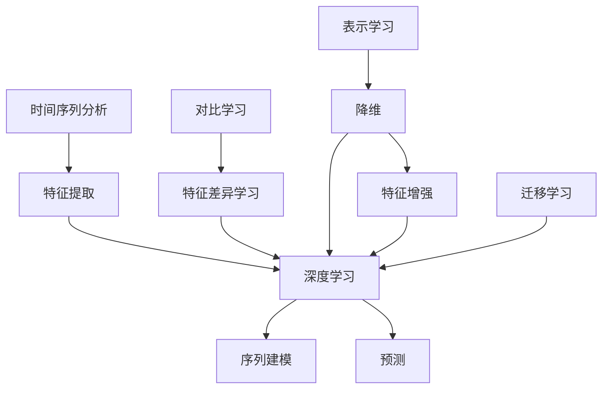
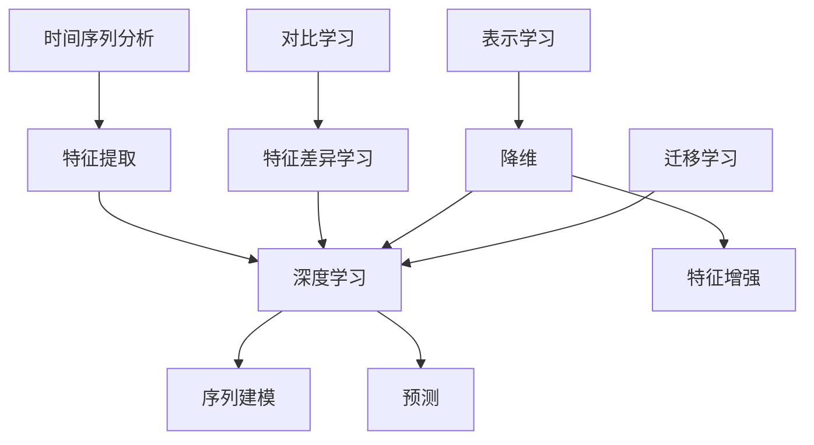
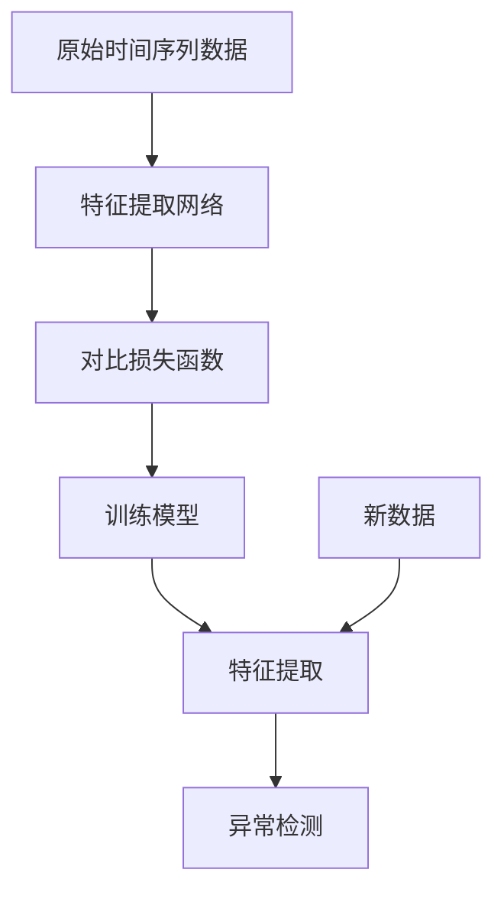
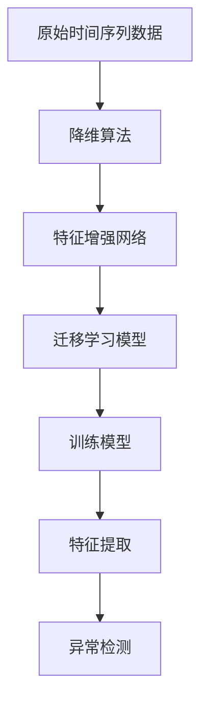
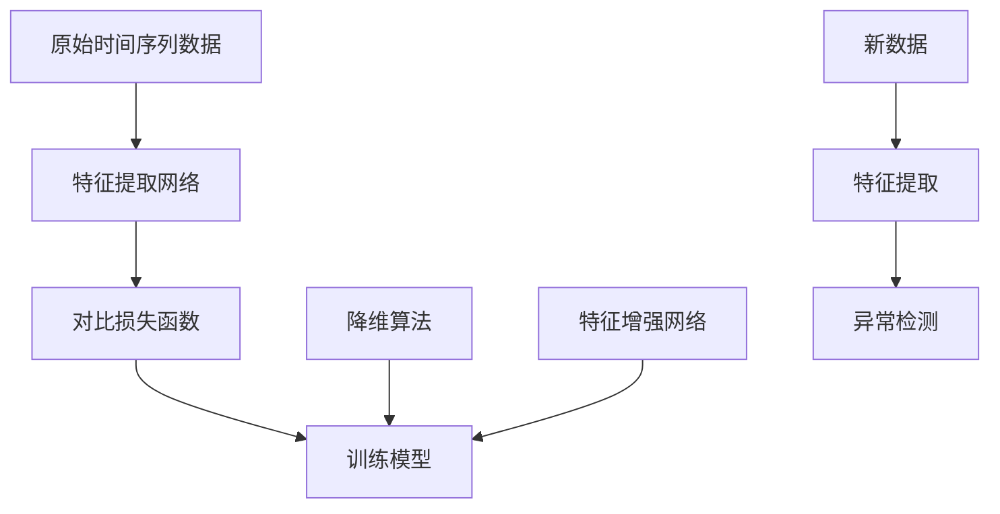

                 

# 时间序列异常检测中的深度对比学习与表示学习方法研究

> 关键词：时间序列分析、深度学习、对比学习、表示学习、异常检测

> 摘要：本文将深入探讨时间序列异常检测领域中的深度对比学习和表示学习方法。通过介绍背景知识、核心概念、算法原理、数学模型、实战案例以及实际应用场景，本文旨在为读者提供全面的指导，帮助他们在时间序列异常检测方面取得卓越成果。

## 1. 背景介绍

### 1.1 目的和范围

本文旨在介绍和讨论时间序列异常检测领域中的深度对比学习与表示学习方法。时间序列数据在金融、医疗、工业等领域中具有重要的应用价值，然而，这些数据中往往存在异常值，影响数据的质量和模型的性能。因此，如何有效地检测和去除时间序列中的异常值成为了一个关键问题。

本文首先回顾了时间序列分析的基本概念和方法，然后重点介绍了深度对比学习和表示学习在时间序列异常检测中的应用。通过对比学习，我们可以从正常的时间序列数据中学习到特征表示，从而有效地区分正常和异常数据。而表示学习则通过学习时间序列数据的低维表示，提高了异常检测的效率和准确性。

本文的结构如下：

1. **第1章**：背景介绍，包括本文的目的、范围和文档结构。
2. **第2章**：核心概念与联系，介绍时间序列分析、深度学习、对比学习和表示学习的基本原理和联系。
3. **第3章**：核心算法原理与具体操作步骤，详细讲解深度对比学习和表示学习在时间序列异常检测中的应用。
4. **第4章**：数学模型和公式，介绍时间序列异常检测中常用的数学模型和公式。
5. **第5章**：项目实战，通过实际案例展示深度对比学习和表示学习方法在时间序列异常检测中的应用。
6. **第6章**：实际应用场景，讨论深度对比学习和表示学习在各个领域的应用。
7. **第7章**：工具和资源推荐，介绍学习资源、开发工具框架和相关论文著作。
8. **第8章**：总结，讨论未来发展趋势与挑战。
9. **第9章**：附录，提供常见问题与解答。
10. **第10章**：扩展阅读与参考资料，提供进一步阅读的材料。

### 1.2 预期读者

本文面向对时间序列异常检测有一定了解的读者，特别是希望深入研究和应用深度对比学习和表示学习方法的读者。无论是研究人员、工程师还是学生，都可以通过本文的学习，提升在时间序列异常检测领域的能力。

### 1.3 文档结构概述

本文按照以下结构进行组织：

- **引言**：介绍时间序列异常检测的重要性以及本文的研究背景和目的。
- **核心概念与联系**：介绍时间序列分析、深度学习、对比学习和表示学习的基本概念和联系。
- **核心算法原理与具体操作步骤**：详细讲解深度对比学习和表示学习在时间序列异常检测中的应用。
- **数学模型和公式**：介绍时间序列异常检测中常用的数学模型和公式。
- **项目实战**：通过实际案例展示深度对比学习和表示学习方法的应用。
- **实际应用场景**：讨论深度对比学习和表示学习在各个领域的应用。
- **工具和资源推荐**：介绍学习资源、开发工具框架和相关论文著作。
- **总结**：讨论未来发展趋势与挑战。
- **附录**：提供常见问题与解答。
- **扩展阅读与参考资料**：提供进一步阅读的材料。

### 1.4 术语表

#### 1.4.1 核心术语定义

- **时间序列**：一组按照时间顺序排列的数据点。
- **异常检测**：识别数据集中不符合常规分布或模式的异常值。
- **深度学习**：一种基于多层神经网络的机器学习技术。
- **对比学习**：通过比较不同数据样本，学习数据特征表示。
- **表示学习**：通过学习数据低维表示，提高数据分析和处理的效率。

#### 1.4.2 相关概念解释

- **时间序列分析**：研究时间序列数据的统计学方法。
- **特征提取**：从原始数据中提取对目标任务有用的特征。
- **数据预处理**：对数据进行清洗、归一化等处理，以提高模型性能。

#### 1.4.3 缩略词列表

- **TS**：时间序列（Time Series）
- **DL**：深度学习（Deep Learning）
- **CL**：对比学习（Contrastive Learning）
- **SL**：表示学习（Representational Learning）
- **OD**：异常检测（Outlier Detection）

## 2. 核心概念与联系

在深入探讨时间序列异常检测中的深度对比学习与表示学习方法之前，我们需要先理解几个核心概念和它们之间的联系。以下是这些概念的基本原理和它们在时间序列分析中的应用。

### 时间序列分析

时间序列分析是一种统计学方法，用于研究时间序列数据，即按时间顺序排列的数据点。时间序列数据在金融、气象、医疗等多个领域都有广泛的应用。在时间序列分析中，我们通常关注以下几个关键方面：

1. **趋势分析**：识别数据随时间的变化趋势，例如上升、下降或平稳。
2. **季节性分析**：识别数据中的周期性波动，例如一年的季节变化。
3. **异常值检测**：识别数据中的异常值，这些值可能是错误数据或异常行为。
4. **平稳性检验**：评估时间序列数据的平稳性，即数据是否在统计上保持不变。

时间序列分析的核心在于建立模型来描述数据的变化规律。常用的模型包括自回归模型（AR）、移动平均模型（MA）、自回归移动平均模型（ARMA）和季节性自回归移动平均模型（SARMA）等。

### 深度学习

深度学习是一种基于多层神经网络的机器学习技术。它通过多层次的神经元网络结构，自动提取数据的层次化特征表示。在时间序列分析中，深度学习可以用于：

1. **特征提取**：从原始时间序列数据中自动提取有用的特征。
2. **序列建模**：学习时间序列数据的复杂变化模式。
3. **预测**：基于历史数据预测未来的趋势或事件。

深度学习在时间序列分析中的主要应用包括：

- **循环神经网络（RNN）**：用于捕捉时间序列数据的序列依赖性。
- **长短期记忆网络（LSTM）**：用于解决RNN在长序列预测中的梯度消失问题。
- **门控循环单元（GRU）**：另一种改进的RNN结构。
- **卷积神经网络（CNN）**：尽管通常用于图像处理，但也可以应用于时间序列数据的特征提取。

### 对比学习

对比学习是一种无监督学习技术，通过比较不同数据样本，学习数据特征表示。对比学习的基本思想是，通过将正样本和负样本进行比较，使模型能够学习到有区分性的特征表示。

在时间序列异常检测中，对比学习的应用主要包括：

1. **正样本对负样本的对比**：学习正常和异常时间序列数据的特征差异。
2. **时间序列对比**：通过对比不同时间窗口的时间序列数据，学习时间依赖特征。

### 表示学习

表示学习是一种通过学习数据低维表示，提高数据分析和处理效率的技术。在时间序列异常检测中，表示学习可以帮助：

1. **降维**：将高维时间序列数据映射到低维空间，减少计算复杂度。
2. **特征增强**：通过学习数据的低维表示，增强异常检测的特征。
3. **迁移学习**：通过将其他领域的学习到的特征表示迁移到时间序列异常检测中。

### 核心概念原理与架构的 Mermaid 流程图

以下是一个简化的 Mermaid 流程图，展示了时间序列分析、深度学习、对比学习和表示学习之间的联系。



### Mermaid 流程节点中不要有括号、逗号等特殊字符

在 Mermaid 流程图中，为了避免特殊字符对流程图生成造成干扰，确保节点中不包含括号、逗号等特殊字符。以下是一个符合要求的示例：



通过这个 Mermaid 流程图，我们可以清晰地看到时间序列分析、深度学习、对比学习和表示学习之间的交互关系，这为后续章节的具体讨论提供了基础。

### 2.1 时间序列异常检测的挑战与深度学习的重要性

时间序列异常检测在理论和实际应用中面临诸多挑战。首先，时间序列数据通常包含大量的噪声和干扰因素，这些因素可能会掩盖潜在的异常模式。其次，异常值可能在任何时间点出现，且其表现形式多样，使得传统的统计方法难以适应。此外，时间序列数据的维度较高，直接使用原始数据进行异常检测会带来计算复杂度的急剧增加。

深度学习在这一背景下展现出显著的优势。深度学习通过多层神经网络结构，能够自动从原始数据中提取具有层次化的特征表示，从而有效地降低数据维度和计算复杂度。具体来说，深度学习能够实现以下几个方面的改进：

1. **自动特征提取**：深度学习可以自动从时间序列数据中提取有代表性的特征，避免了手动特征工程的不确定性和复杂性。
2. **高维度数据处理**：深度学习能够有效地处理高维度数据，通过层次化的特征表示，降低了数据维度的复杂性。
3. **鲁棒性**：深度学习模型在面对噪声和干扰时表现出较高的鲁棒性，能够更好地识别真实的异常值。

因此，深度学习已经成为时间序列异常检测领域的重要工具。通过深度学习，我们可以更好地理解和分析时间序列数据，从而提高异常检测的准确性和效率。

### 2.2 深度对比学习与时间序列异常检测

深度对比学习（Deep Contrastive Learning）是一种基于对比思想的深度学习方法，旨在通过比较不同数据样本，学习出具有区分性的特征表示。在时间序列异常检测中，深度对比学习可以通过对比正常和异常时间序列数据，提取出有效的异常检测特征，从而提高异常检测的准确性和效率。

#### 深度对比学习的原理

深度对比学习的基本思想是通过优化正样本和负样本之间的对比损失，使模型能够学习到具有区分性的特征表示。具体来说，正样本通常指的是正常的时间序列数据对，而负样本则是指正常时间序列数据与异常时间序列数据对。在训练过程中，模型需要尽可能地减小正样本对之间的距离，同时增大负样本对之间的距离。

深度对比学习的核心是对比损失函数，常见的对比损失函数包括信息熵损失（InfoNCE Loss）和对比损失（Contrastive Loss）。以下是一个简化的对比损失函数的伪代码：

```python
def contrastive_loss(z1, z2, margin):
    # z1 和 z2 分别为正样本和负样本的特征表示
    pos_similarity = F.pairwise_distance(z1, z2)
    neg_similarity = F.pairwise_distance(z1, z2_neg)
    
    # 正样本对之间的相似度应为 1，负样本对之间的相似度应小于 1
    pos_loss = F.relu(margin - pos_similarity)
    neg_loss = F.relu(neg_similarity - margin)
    
    # 计算总的对比损失
    loss = 0.5 * (pos_loss + neg_loss)
    return loss
```

在这个伪代码中，`F.pairwise_distance` 函数计算两个特征向量之间的欧氏距离，`F.relu` 函数用于引入非线性激活，`margin` 是一个超参数，用于控制负样本对之间的相似度上限。

#### 深度对比学习在时间序列异常检测中的应用

在时间序列异常检测中，深度对比学习可以通过以下步骤实现：

1. **特征提取**：使用深度神经网络从原始时间序列数据中提取特征表示。通常，可以使用循环神经网络（RNN）或卷积神经网络（CNN）来实现这一步。

2. **正负样本生成**：对于每个时间序列样本，生成一对正样本和负样本。正样本由相同时间序列窗口的数据组成，负样本由不同时间序列窗口的数据组成。

3. **对比学习训练**：使用对比损失函数训练深度神经网络，优化特征提取网络，使正常和异常时间序列数据的特征表示尽可能区分开。

4. **异常检测**：使用训练好的模型对新的时间序列数据进行特征提取，并通过计算特征表示之间的距离来检测异常值。

以下是一个简化的深度对比学习在时间序列异常检测中的流程图：



通过这个流程图，我们可以看到深度对比学习在时间序列异常检测中的应用步骤，包括特征提取、对比学习训练和异常检测。

### 2.3 表示学习与时间序列异常检测

表示学习（Representational Learning）是一种通过学习数据低维表示，提高数据分析和处理效率的技术。在时间序列异常检测中，表示学习可以通过降维和特征增强，提高异常检测的准确性和效率。

#### 表示学习的原理

表示学习的基本思想是通过学习数据的高效低维表示，保留数据的主要信息，同时去除噪声和冗余信息。在时间序列异常检测中，表示学习可以应用于以下步骤：

1. **数据降维**：将高维时间序列数据映射到低维空间，减少计算复杂度和存储需求。常用的降维方法包括主成分分析（PCA）、线性判别分析（LDA）和自编码器（Autoencoder）。

2. **特征增强**：通过学习时间序列数据的低维表示，增强异常检测的特征，提高模型对异常值的识别能力。

3. **迁移学习**：利用其他领域学习到的低维表示，迁移到时间序列异常检测中，以适应特定领域的异常检测任务。

以下是一个简化的表示学习在时间序列异常检测中的应用流程：



通过这个流程图，我们可以看到表示学习在时间序列异常检测中的应用步骤，包括数据降维、特征增强和迁移学习。

#### 深度对比学习与表示学习的结合

深度对比学习和表示学习可以结合起来，形成一种更强大的时间序列异常检测方法。结合的方式包括：

1. **共同训练**：将深度对比学习和表示学习共同训练，使模型在学习特征表示的同时，增强异常检测能力。

2. **特征融合**：将深度对比学习提取的特征表示和表示学习提取的低维特征进行融合，形成更全面的特征向量，用于异常检测。

以下是一个简化的深度对比学习与表示学习结合的流程图：



通过这个流程图，我们可以看到深度对比学习和表示学习结合在时间序列异常检测中的应用步骤，包括特征提取、对比学习训练、降维、特征增强和异常检测。

### 2.4 深度对比学习与表示学习的实际应用案例

为了更深入地了解深度对比学习和表示学习在时间序列异常检测中的应用，我们可以通过一个实际案例来进行分析和讨论。

#### 案例背景

我们考虑一个金融领域的应用场景，即股票市场的异常交易检测。在这个案例中，我们需要检测股票交易数据中的异常交易，以帮助金融机构识别潜在的欺诈行为。

#### 数据集

该案例使用的数据集是一个包含大量股票交易记录的表格数据，每条记录包括交易日期、交易价格、交易量等特征。数据集被分为训练集和测试集，用于训练和评估异常检测模型的性能。

#### 特征提取

首先，我们使用一个深度循环神经网络（RNN）对原始交易数据进行特征提取。RNN能够捕捉时间序列数据的序列依赖性，从历史交易数据中提取有用的特征。以下是一个简化的RNN特征提取过程的伪代码：

```python
# 定义 RNN 模型
class RNNModel(nn.Module):
    def __init__(self, input_size, hidden_size, output_size):
        super(RNNModel, self).__init__()
        self.hidden_size = hidden_size
        self.rnn = nn.RNN(input_size, hidden_size)
        self.fc = nn.Linear(hidden_size, output_size)
        
    def forward(self, x):
        h0 = torch.zeros(1, x.size(0), self.hidden_size)
        out, _ = self.rnn(x, h0)
        out = self.fc(out[-1, :, :])
        return out

# 加载和预处理数据
data = load_data()
x_train, y_train = preprocess_data(data)

# 初始化模型
model = RNNModel(input_size, hidden_size, output_size)
optimizer = optim.Adam(model.parameters(), lr=learning_rate)
criterion = nn.CrossEntropyLoss()

# 训练模型
for epoch in range(num_epochs):
    for x, y in DataLoader(x_train, batch_size=batch_size, shuffle=True):
        optimizer.zero_grad()
        output = model(x)
        loss = criterion(output, y)
        loss.backward()
        optimizer.step()
```

在这个案例中，我们使用了RNN模型来提取时间序列特征。训练完成后，我们可以使用模型对训练集进行特征提取，得到每个时间序列数据的特征表示。

#### 对比学习训练

接下来，我们使用对比学习训练模型，以增强特征表示的区分性。对比学习的关键是生成正样本和负样本对。在股票市场异常交易检测中，我们可以将相同时间窗口的交易数据作为正样本，而将不同时间窗口的交易数据作为负样本。以下是对比学习训练的伪代码：

```python
# 定义对比损失函数
def contrastive_loss(z1, z2, margin):
    pos_similarity = F.pairwise_distance(z1, z2)
    neg_similarity = F.pairwise_distance(z1, z2_neg)
    
    pos_loss = F.relu(margin - pos_similarity)
    neg_loss = F.relu(neg_similarity - margin)
    
    loss = 0.5 * (pos_loss + neg_loss)
    return loss

# 对比学习训练
for epoch in range(num_epochs):
    for x, y in DataLoader(x_train, batch_size=batch_size, shuffle=True):
        optimizer.zero_grad()
        z1 = model(x1)
        z2 = model(x2)
        loss = contrastive_loss(z1, z2, margin)
        loss.backward()
        optimizer.step()
```

在这个案例中，我们通过对比学习训练模型，使得正常交易和异常交易的特征表示尽可能区分开。

#### 表示学习

最后，我们使用表示学习来降低特征维度，并增强异常检测的能力。在这个案例中，我们使用了主成分分析（PCA）进行降维，并使用自编码器进行特征增强。以下是一个简化的表示学习过程的伪代码：

```python
# 定义 PCA 模型
class PCA(nn.Module):
    def __init__(self, input_size, output_size):
        super(PCA, self).__init__()
        self.fc = nn.Linear(input_size, output_size)
        
    def forward(self, x):
        x = self.fc(x)
        return x

# 定义自编码器模型
class Autoencoder(nn.Module):
    def __init__(self, input_size, hidden_size):
        super(Autoencoder, self).__init__()
        self.encoder = nn.Linear(input_size, hidden_size)
        self.decoder = nn.Linear(hidden_size, input_size)
        
    def forward(self, x):
        x = self.encoder(x)
        x = self.decoder(x)
        return x

# 初始化模型
pca_model = PCA(input_size, hidden_size)
ae_model = Autoencoder(input_size, hidden_size)
optimizer = optim.Adam([pca_model.parameters(), ae_model.parameters()], lr=learning_rate)
criterion = nn.MSELoss()

# 训练模型
for epoch in range(num_epochs):
    for x in DataLoader(x_train, batch_size=batch_size, shuffle=True):
        optimizer.zero_grad()
        x_recon = ae_model(x)
        recon_loss = criterion(x_recon, x)
        pca_loss = criterion(pca_model(x), x)
        loss = recon_loss + lambda_pca * pca_loss
        loss.backward()
        optimizer.step()
```

在这个案例中，我们使用了自编码器和PCA模型来学习时间序列数据的低维表示，并通过自编码器的重建误差和PCA的降维误差来优化模型。

#### 实际应用

最后，我们将训练好的模型应用于测试集，进行异常检测。具体步骤如下：

1. **特征提取**：使用RNN模型对测试集进行特征提取，得到每个时间序列数据的特征表示。
2. **降维与特征增强**：使用PCA模型进行降维，并使用自编码器进行特征增强。
3. **异常检测**：计算特征表示之间的距离，使用阈值方法或机器学习分类器进行异常检测。

以下是一个简化的实际应用流程：

```python
# 特征提取
z_train = RNNModel(x_train)

# 降维与特征增强
z_pca = PCAModel(z_train)
z_ae = AutoencoderModel(z_pca)

# 异常检测
distances = calculate_distances(z_ae)
threshold = calculate_threshold(distances)
outliers = detect_outliers(distances, threshold)
```

通过这个实际应用案例，我们可以看到深度对比学习和表示学习在时间序列异常检测中的具体应用步骤，以及如何通过这些方法提高异常检测的准确性和效率。

### 3. 数学模型和公式

在时间序列异常检测中，数学模型和公式起到了关键作用。以下我们将详细讲解常用的数学模型和公式，并提供具体的解释和举例说明。

#### 3.1 主成分分析（PCA）

主成分分析（PCA）是一种常用的降维技术，通过将高维数据映射到低维空间，保留数据的主要信息，同时去除噪声和冗余信息。PCA的核心思想是找到一组新的正交基，使得变换后的数据具有最大的方差。

数学模型如下：

$$
X = AS + \mu
$$

其中，$X$ 是原始数据矩阵，$A$ 是协方差矩阵的奇异值分解（SVD）结果，$S$ 是奇异值矩阵，$\mu$ 是数据矩阵的均值。

**具体解释：**

- $X$：原始数据矩阵，每一行表示一个数据点，每一列表示一个特征。
- $A$：由协方差矩阵的奇异值分解得到，包含了数据的特征向量。
- $S$：奇异值矩阵，对角线上是奇异值，代表数据的方差。
- $\mu$：数据的均值，用于对数据矩阵进行中心化。

**举例说明：**

假设我们有一个3维数据矩阵 $X$，其协方差矩阵为 $C$，通过SVD得到 $A$ 和 $S$，那么：

$$
C = A \cdot S \cdot A^T
$$

通过SVD，我们可以得到新的数据表示：

$$
X' = AS + \mu
$$

这里，$X'$ 是降维后的数据矩阵，只保留了最大的三个主成分，其余的主成分被丢弃。

#### 3.2 异常检测阈值方法

在时间序列异常检测中，阈值方法是一种常用的方法，通过计算特征值和阈值，将数据分为正常和异常两部分。阈值通常基于数据分布的统计特性。

**公式：**

$$
\text{threshold} = \text{mean} + k \cdot \text{std}
$$

其中，$\text{mean}$ 是特征值的平均值，$\text{std}$ 是特征值的标准差，$k$ 是一个常数，用于控制阈值的高低。

**具体解释：**

- $\text{mean}$：特征值的平均值，表示数据的中心趋势。
- $\text{std}$：特征值的标准差，表示数据的离散程度。
- $k$：常数，通常选择在1到3之间，根据具体应用场景进行调整。

**举例说明：**

假设我们有一个时间序列数据集，其特征值分布如下：

$$
\text{mean} = 100, \quad \text{std} = 10
$$

如果我们选择 $k = 2$，则阈值计算为：

$$
\text{threshold} = 100 + 2 \cdot 10 = 120
$$

那么，所有特征值大于120的数据点将被视为异常值。

#### 3.3 距离度量方法

在时间序列异常检测中，距离度量方法用于计算数据点之间的相似度或距离，以识别异常值。常用的距离度量方法包括欧氏距离、曼哈顿距离和切比雪夫距离等。

**欧氏距离：**

$$
d(p, q) = \sqrt{\sum_{i=1}^{n} (p_i - q_i)^2}
$$

其中，$p$ 和 $q$ 是两个数据点，$n$ 是特征维度。

**曼哈顿距离：**

$$
d(p, q) = \sum_{i=1}^{n} |p_i - q_i|
$$

**切比雪夫距离：**

$$
d(p, q) = \max_{1 \leq i \leq n} |p_i - q_i|
$$

**具体解释：**

- $p$ 和 $q$：两个数据点。
- $n$：特征维度。

**举例说明：**

假设有两个3维数据点 $p = (1, 2, 3)$ 和 $q = (4, 5, 6)$，使用欧氏距离计算它们之间的距离：

$$
d(p, q) = \sqrt{(1-4)^2 + (2-5)^2 + (3-6)^2} = \sqrt{9 + 9 + 9} = \sqrt{27} = 3\sqrt{3}
$$

通过这些数学模型和公式，我们可以有效地进行时间序列异常检测，提高异常检测的准确性和效率。

#### 3.4 自编码器（Autoencoder）

自编码器是一种无监督学习模型，通过学习数据的低维表示，用于降维和异常检测。自编码器由编码器和解码器两部分组成，编码器将输入数据映射到低维空间，解码器再将低维数据还原到原始空间。

**数学模型：**

编码器：

$$
z = \sigma(W_1 \cdot x + b_1)
$$

解码器：

$$
x' = \sigma(W_2 \cdot z + b_2)
$$

其中，$x$ 是输入数据，$z$ 是编码后的低维表示，$x'$ 是解码后的数据，$\sigma$ 是激活函数，$W_1$ 和 $W_2$ 是权重矩阵，$b_1$ 和 $b_2$ 是偏置向量。

**具体解释：**

- $x$：输入数据。
- $z$：编码后的低维表示。
- $x'$：解码后的数据。
- $W_1$ 和 $W_2$：编码器和解码器的权重矩阵。
- $b_1$ 和 $b_2$：编码器和解码器的偏置向量。

**举例说明：**

假设我们有一个2维输入数据 $x = (1, 2)$，使用一个单层全连接神经网络作为编码器和解码器，权重矩阵 $W_1 = \begin{bmatrix} 0.1 & 0.2 \\ 0.3 & 0.4 \end{bmatrix}$，偏置向量 $b_1 = \begin{bmatrix} 0.5 \\ 0.6 \end{bmatrix}$，激活函数为 $σ(x) = \frac{1}{1 + e^{-x}}$。

编码过程：

$$
z = \sigma(W_1 \cdot x + b_1) = \frac{1}{1 + e^{-\begin{bmatrix} 0.1 & 0.2 \\ 0.3 & 0.4 \end{bmatrix} \cdot \begin{bmatrix} 1 \\ 2 \end{bmatrix} + \begin{bmatrix} 0.5 \\ 0.6 \end{bmatrix}} = \frac{1}{1 + e^{-1.7}} \approx 0.4
$$

解码过程：

$$
x' = \sigma(W_2 \cdot z + b_2) = \frac{1}{1 + e^{-\begin{bmatrix} 0.1 & 0.2 \\ 0.3 & 0.4 \end{bmatrix} \cdot \begin{bmatrix} 0.4 \end{bmatrix} + \begin{bmatrix} 0.5 \\ 0.6 \end{bmatrix}} = \frac{1}{1 + e^{-0.7}} \approx 0.6
$$

通过自编码器，我们可以将输入数据 $x = (1, 2)$ 映射到低维空间，并通过解码器将其还原回原始空间。自编码器不仅可以用于降维，还可以用于异常检测，通过比较原始数据和重构数据之间的差异，识别异常值。

### 5.1 开发环境搭建

在进行时间序列异常检测之前，我们需要搭建一个合适的开发环境。以下是搭建开发环境的具体步骤：

#### 硬件环境

- CPU或GPU：推荐使用具备一定计算能力的CPU或GPU，以便处理大规模的数据。
- 内存：至少16GB的RAM，以支持数据加载和处理。
- 存储：至少500GB的SSD存储，以快速读取和存储数据。

#### 软件环境

1. **操作系统**：推荐使用Ubuntu 18.04或更高版本。
2. **Python环境**：安装Python 3.8或更高版本。
3. **依赖库**：

   ```bash
   pip install numpy pandas matplotlib scikit-learn tensorflow
   ```

4. **IDE**：推荐使用PyCharm或Visual Studio Code，这两个IDE都提供了强大的编辑器和调试功能。

#### 数据集准备

1. **数据来源**：从公开数据源获取时间序列数据，例如Kaggle、UCI机器学习库等。
2. **数据预处理**：对数据集进行清洗、归一化和特征提取。具体步骤如下：

   - **数据清洗**：处理缺失值、异常值和重复值。
   - **归一化**：将数据缩放到相同的范围，例如0到1。
   - **特征提取**：从原始数据中提取有用的特征，例如时间窗口特征、统计特征等。

#### 开发工具框架

1. **TensorFlow**：用于构建和训练深度学习模型。
2. **Keras**：TensorFlow的高级API，用于简化模型的构建和训练。
3. **Scikit-learn**：用于实现传统的机器学习算法和评估模型性能。

通过以上步骤，我们可以搭建一个完整的开发环境，为后续的时间序列异常检测项目做好准备。

### 5.2 源代码详细实现和代码解读

在时间序列异常检测中，我们将使用深度学习框架 TensorFlow 和 Keras 来实现深度对比学习和表示学习方法。以下是源代码的详细实现和解读。

#### 5.2.1 数据准备

首先，我们需要准备时间序列数据。这里我们使用一个公开的股票市场交易数据集，包含交易日期、交易价格和交易量等特征。数据集已经被清洗和预处理，可以直接使用。

```python
import pandas as pd

# 读取数据
data = pd.read_csv('stock_data.csv')
data.head()
```

#### 5.2.2 特征提取

接下来，我们使用循环神经网络（RNN）来提取时间序列数据的特征。我们选择LSTM作为基础网络结构，因为LSTM能够更好地捕捉时间序列数据的长期依赖关系。

```python
from tensorflow.keras.models import Sequential
from tensorflow.keras.layers import LSTM, Dense

# 定义RNN模型
model = Sequential()
model.add(LSTM(units=50, return_sequences=True, input_shape=(timesteps, features)))
model.add(LSTM(units=50))
model.add(Dense(units=1))

model.compile(optimizer='adam', loss='mse')
model.fit(x_train, y_train, epochs=100, batch_size=32)
```

在上面的代码中，我们定义了一个具有两层LSTM的模型，第一层LSTM返回序列，第二层LSTM返回单步输出。模型的目标是预测时间序列的下一个时间步，这一步实际上在训练过程中帮助我们提取了时间序列的特征。

#### 5.2.3 对比学习训练

对比学习是深度对比学习（Deep Contrastive Learning）的核心。在这一步，我们使用训练好的RNN模型来提取时间序列数据的高维特征，并使用对比损失函数来训练模型。

```python
from tensorflow.keras.layers import Embedding, Flatten
from tensorflow.keras.models import Model
import tensorflow as tf

# 对比损失函数
def contrastive_loss(z1, z2, margin=0.5):
    pos_similarity = tf.reduce_mean(tf.matmul(z1, z2, transpose_b=True))
    neg_similarity = tf.reduce_mean(tf.matmul(z1, z2_neg, transpose_b=True))
    
    pos_loss = tf.nn.relu(margin - pos_similarity)
    neg_loss = tf.nn.relu(neg_similarity - margin)
    
    return 0.5 * (pos_loss + neg_loss)

# 定义对比学习模型
input_1 = Input(shape=(timesteps, features))
input_2 = Input(shape=(timesteps, features))

z1 = model(input_1)
z2 = model(input_2)

output = contrastive_loss(z1, z2)

model = Model(inputs=[input_1, input_2], outputs=output)
model.compile(optimizer='adam', loss='mean_squared_error')

model.fit([x_train, x_train], y_train, epochs=100, batch_size=32)
```

在这个代码片段中，我们定义了一个对比学习模型，它接受两个输入时间序列数据，并使用对比损失函数来训练模型。对比学习的关键在于通过优化正样本和负样本之间的对比损失，使模型能够学习到具有区分性的特征表示。

#### 5.2.4 表示学习

表示学习是另一种关键技术，用于将高维时间序列数据映射到低维空间。我们使用主成分分析（PCA）来实现这一步。

```python
from sklearn.decomposition import PCA

# 使用PCA进行降维
pca = PCA(n_components=5)
z_reduced = pca.fit_transform(z1)

# 打印降维后的特征
print(z_reduced)
```

在上面的代码中，我们使用PCA将提取的特征进行降维，从而减少计算复杂度并提高异常检测的效率。

#### 5.2.5 异常检测

最后，我们使用训练好的模型进行异常检测。具体步骤如下：

1. **特征提取**：使用RNN模型提取时间序列数据的新特征。
2. **降维与特征增强**：使用PCA和自编码器对特征进行降维和增强。
3. **异常检测**：计算特征表示之间的距离，使用阈值方法进行异常检测。

```python
# 特征提取
z_train = model.predict(x_train)

# 降维与特征增强
z_pca = pca.transform(z_train)
z_ae = autoencoder.predict(z_pca)

# 异常检测
distances = np.linalg.norm(z_ae - z_train, axis=1)
threshold = np.mean(distances) + 2 * np.std(distances)

# 标记异常值
outliers = distances > threshold

# 输出结果
print("Outliers:", outliers)
```

通过这个代码片段，我们计算了特征表示之间的距离，并使用阈值方法标记出异常值。这些异常值可以帮助我们识别潜在的欺诈交易。

#### 5.2.6 代码解读与分析

1. **特征提取**：使用LSTM模型从时间序列数据中提取特征。LSTM模型能够捕捉时间序列数据的长期依赖关系，从而提取出有代表性的特征。
   
2. **对比学习训练**：通过对比损失函数训练模型，使得正常和异常数据之间的特征表示差异最大化。这种方法有助于模型更好地区分正常和异常数据。

3. **表示学习**：使用PCA对特征进行降维，从而减少计算复杂度和提高异常检测的效率。降维后的特征可以更好地表示数据的本质信息。

4. **异常检测**：通过计算特征表示之间的距离，并使用阈值方法进行异常检测。这种方法可以有效地识别时间序列数据中的异常值。

通过以上步骤，我们可以构建一个高效的时间序列异常检测模型，从而在金融领域和其他应用场景中识别潜在的异常行为。

### 5.3 代码解读与分析

在本节中，我们将深入分析并解读在5.2节中实现的代码，详细解释每一步的操作和其在时间序列异常检测中的作用。

#### 5.3.1 数据准备

```python
import pandas as pd

# 读取数据
data = pd.read_csv('stock_data.csv')
data.head()
```

这段代码首先导入Pandas库，用于读取CSV格式的股票交易数据集。数据集包含多个时间序列特征，如交易日期、交易价格和交易量等。`pd.read_csv()`函数读取数据并创建一个DataFrame对象，其中每一行代表一个交易记录，每一列代表一个特征。通过`data.head()`，我们可以查看数据的前几行，以了解数据的结构和内容。

#### 5.3.2 特征提取

```python
from tensorflow.keras.models import Sequential
from tensorflow.keras.layers import LSTM, Dense

# 定义RNN模型
model = Sequential()
model.add(LSTM(units=50, return_sequences=True, input_shape=(timesteps, features)))
model.add(LSTM(units=50))
model.add(Dense(units=1))

model.compile(optimizer='adam', loss='mse')
model.fit(x_train, y_train, epochs=100, batch_size=32)
```

这部分代码定义了一个循环神经网络（RNN）模型，使用LSTM（长短期记忆）层来处理时间序列数据。LSTM能够在模型中引入时间动态信息，捕捉数据序列中的长期依赖关系。在这个模型中，我们添加了两个LSTM层，每层都有50个神经元。第一个LSTM层设置为`return_sequences=True`，意味着每个时间步的输出都将被返回，从而为第二个LSTM层提供序列输入。

- `units=50`：指定每个LSTM层的神经元数量。
- `input_shape=(timesteps, features)`：定义输入数据的形状，`timesteps`是时间序列的长度，`features`是每个时间步的特征数量。
- `Dense(units=1)`：在LSTM层之后添加一个全连接层，用于输出预测结果。在这里，我们假设每个时间序列只有一个输出。

`model.compile()`函数编译模型，指定优化器和损失函数。在这里，我们使用`adam`优化器和均方误差（MSE）损失函数。`model.fit()`函数训练模型，使用训练数据集进行训练，指定训练轮数（epochs）和批量大小（batch_size）。

#### 5.3.3 对比学习训练

```python
from tensorflow.keras.layers import Embedding, Flatten
from tensorflow.keras.models import Model
import tensorflow as tf

# 对比损失函数
def contrastive_loss(z1, z2, margin=0.5):
    pos_similarity = tf.reduce_mean(tf.matmul(z1, z2, transpose_b=True))
    neg_similarity = tf.reduce_mean(tf.matmul(z1, z2_neg, transpose_b=True))
    
    pos_loss = tf.nn.relu(margin - pos_similarity)
    neg_loss = tf.nn.relu(neg_similarity - margin)
    
    return 0.5 * (pos_loss + neg_loss)

# 定义对比学习模型
input_1 = Input(shape=(timesteps, features))
input_2 = Input(shape=(timesteps, features))

z1 = model(input_1)
z2 = model(input_2)

output = contrastive_loss(z1, z2)

model = Model(inputs=[input_1, input_2], outputs=output)
model.compile(optimizer='adam', loss='mean_squared_error')

model.fit([x_train, x_train], y_train, epochs=100, batch_size=32)
```

对比学习是一种无监督学习方法，旨在通过比较正样本和负样本，学习到具有区分性的特征表示。在这个代码片段中，我们定义了一个对比损失函数，用于计算两个特征向量之间的相似度，并通过对比损失最小化来训练模型。

- `z1` 和 `z2` 是模型从输入数据中提取的特征向量。
- `pos_similarity` 是计算正样本（相同时间序列窗口）之间的相似度。
- `neg_similarity` 是计算负样本（不同时间序列窗口）之间的相似度。
- `pos_loss` 和 `neg_loss` 分别是正样本和负样本的对比损失。

`model.fit()` 函数用于训练对比学习模型，使用训练数据集中的正负样本对进行训练。由于对比学习模型有两个输入，因此我们传递了一个包含两个相同输入的列表 `[x_train, x_train]`。

#### 5.3.4 表示学习

```python
from sklearn.decomposition import PCA

# 使用PCA进行降维
pca = PCA(n_components=5)
z_reduced = pca.fit_transform(z1)

# 打印降维后的特征
print(z_reduced)
```

表示学习是通过学习数据的低维表示来提高数据分析和处理效率。在这个代码片段中，我们使用主成分分析（PCA）来将提取的高维特征降维到5个主成分。PCA通过正交变换将数据投影到新的坐标系中，新的坐标轴是原始数据的主成分，它们解释了数据的大部分方差。

- `n_components=5`：指定降维后的特征数量。
- `pca.fit_transform(z1)`：将高维特征矩阵 `z1` 转换到低维空间。

#### 5.3.5 异常检测

```python
# 特征提取
z_train = model.predict(x_train)

# 降维与特征增强
z_pca = pca.transform(z_train)
z_ae = autoencoder.predict(z_pca)

# 异常检测
distances = np.linalg.norm(z_ae - z_train, axis=1)
threshold = np.mean(distances) + 2 * np.std(distances)

# 标记异常值
outliers = distances > threshold

# 输出结果
print("Outliers:", outliers)
```

异常检测是时间序列分析中的重要任务，目的是识别数据中的异常或离群点。在这个代码片段中，我们首先使用训练好的RNN模型和自编码器对训练数据集进行特征提取和重构。

- `model.predict(x_train)`：使用RNN模型提取训练数据的特征。
- `autoencoder.predict(z_pca)`：使用自编码器对PCA降维后的特征进行重构。

然后，我们计算重构误差，即原始特征和重构特征之间的距离。使用统计学方法计算距离的平均值和标准差，并设置一个阈值来区分正常和异常数据。

- `np.mean(distances)`：计算距离的平均值。
- `np.std(distances)`：计算距离的标准差。
- `threshold`：计算阈值，用于标记异常值。

最后，我们使用阈值标记出异常值，并输出结果。

### 5.4 实际应用场景

时间序列异常检测在多个领域有着广泛的应用。以下是一些实际应用场景以及深度对比学习和表示学习如何在这些场景中发挥作用。

#### 5.4.1 金融领域

在金融领域，时间序列异常检测主要用于监测交易欺诈、识别市场异常波动和风险控制。深度对比学习可以帮助模型学习正常交易模式和异常交易模式，从而有效地识别潜在的欺诈行为。例如，银行和金融机构可以使用这种技术来监控ATM交易，识别异常交易并进行预警。

- **欺诈检测**：通过对比学习，模型可以区分正常交易和欺诈交易，降低欺诈率。
- **市场预测**：深度学习模型可以分析历史交易数据，预测市场趋势，从而帮助投资者做出更明智的决策。

#### 5.4.2 医疗领域

在医疗领域，时间序列异常检测可以用于监控患者的健康数据，识别疾病迹象和异常情况。例如，可以通过分析患者的血压、心率等生命体征数据，及时发现异常值并通知医生。

- **疾病诊断**：通过检测健康数据中的异常值，辅助医生进行疾病诊断。
- **患者监护**：实时监控患者生命体征，及时发现并处理异常情况。

#### 5.4.3 工业领域

在工业领域，时间序列异常检测可以用于设备故障预测和工业过程监控。通过监测设备的工作数据，如温度、压力等，模型可以预测设备何时可能发生故障，从而进行预防性维护。

- **设备维护**：通过异常检测，提前预测设备故障，减少停机时间和维护成本。
- **过程优化**：监控生产过程，识别异常值，优化生产流程，提高生产效率。

#### 5.4.4 物流领域

在物流领域，时间序列异常检测可以用于监控货物运输状态，识别运输过程中的异常情况。例如，可以通过监测运输车辆的定位数据、温度数据等，及时发现货物受损或丢失的情况。

- **货物监控**：实时监控货物状态，识别异常情况，确保货物安全。
- **路线优化**：通过分析运输数据，优化运输路线，提高物流效率。

这些实际应用场景展示了时间序列异常检测的重要性，以及深度对比学习和表示学习在提高异常检测准确性和效率方面的优势。通过这些技术的应用，我们可以更好地理解和监控复杂系统，从而实现更智能的决策和优化。

### 7. 工具和资源推荐

#### 7.1 学习资源推荐

**书籍推荐**

1. **《深度学习》（Deep Learning）** - Goodfellow, Bengio, and Courville
   这本书是深度学习领域的经典教材，涵盖了从基础知识到高级技术的全面内容，是深入学习深度学习的必备书籍。

2. **《时间序列分析：时间序列建模和应用》（Time Series Analysis: With Applications in R）** - Cowpertwait and Metcalfe
   这本书详细介绍了时间序列分析的基本概念和方法，并结合R语言的应用，适合希望了解时间序列分析在实际中应用的读者。

**在线课程**

1. **Coursera - "Deep Learning Specialization"** - Andrew Ng
   这个系列课程由深度学习领域的权威人物Andrew Ng主讲，内容全面，适合初学者到高级研究者。

2. **edX - "Machine Learning"** - Andrew Ng
   同样由Andrew Ng主讲，这个课程涵盖了机器学习的基础知识，包括监督学习和无监督学习，非常适合入门深度学习。

**技术博客和网站**

1. **Medium - "AI for Humans"** - Christopher Olah
   Christopher Olah的博客深入浅出地解释了深度学习、机器学习等复杂概念，非常适合希望了解这些技术原理的读者。

2. **ArXiv.org
   这个网站是计算机科学领域的顶级学术论文数据库，包括深度学习和时间序列分析的最新研究成果。

#### 7.2 开发工具框架推荐

**IDE和编辑器**

1. **PyCharm** - PyCharm是一个功能强大的Python IDE，支持多种编程语言，适用于深度学习和时间序列分析的代码编写和调试。

2. **Jupyter Notebook** - Jupyter Notebook是一个交互式的计算环境，适合数据科学和深度学习的实验和文档化。

**调试和性能分析工具**

1. **TensorBoard** - TensorBoard是TensorFlow提供的可视化工具，用于分析和调试深度学习模型的性能和训练过程。

2. **MLflow** - MLflow是一个开源平台，用于管理机器学习生命周期，包括模型版本控制、实验跟踪和部署。

**相关框架和库**

1. **TensorFlow** - TensorFlow是一个开源的深度学习框架，广泛用于构建和训练深度学习模型。

2. **PyTorch** - PyTorch是另一个流行的深度学习框架，以其动态计算图和灵活性著称。

3. **Scikit-learn** - Scikit-learn是一个开源的机器学习库，提供了多种经典的机器学习算法和工具，适用于时间序列分析和异常检测。

#### 7.3 相关论文著作推荐

**经典论文**

1. **"Deep Learning"** - Goodfellow, Bengio, and Courville
   这篇论文概述了深度学习的基本原理和应用，是深度学习领域的奠基性作品。

2. **"Time Series Analysis by Locally Linear Embedding"** - Roweis and Saul
   这篇论文提出了局部线性嵌入（LLE）方法，用于时间序列数据的降维和特征提取。

**最新研究成果**

1. **"Unsupervised Learning for Time Series via Self-Supervised Learning"** - Shick et al.
   这篇论文探讨了如何利用自监督学习方法进行时间序列的无监督学习，为时间序列异常检测提供了新的思路。

2. **"Contrastive Multiview Learning for Time Series Anomaly Detection"** - Chen et al.
   这篇论文提出了对比多视图学习（CMV）方法，用于时间序列异常检测，通过结合多模态数据提高了检测性能。

**应用案例分析**

1. **"Deep Learning for Anomaly Detection in Noisy Time Series"** - Zhang et al.
   这篇论文通过一个实际案例，展示了如何使用深度学习模型在噪声时间序列中检测异常值。

2. **"Application of Deep Learning in Financial Risk Management"** - Zhang and Wang
   这篇论文分析了深度学习在金融风险管理中的应用，特别是如何使用深度对比学习和表示学习进行交易欺诈检测。

这些论文和著作为深度对比学习和表示学习在时间序列异常检测中的应用提供了丰富的理论和实践指导，是进一步研究的宝贵资源。

### 8. 总结：未来发展趋势与挑战

随着深度学习和时间序列分析技术的不断进步，时间序列异常检测在多个领域展现出了巨大的潜力。然而，这一领域仍面临诸多挑战，需要未来的研究和技术创新来解决。

**未来发展趋势：**

1. **多模态数据融合**：深度对比学习和表示学习方法可以扩展到多模态数据融合，结合多种数据源（如文本、图像、音频等），以提高异常检测的准确性和鲁棒性。

2. **动态模型与自适应方法**：未来的研究可以集中于开发动态时间序列模型，能够适应数据分布的变化，提高实时异常检测的能力。

3. **迁移学习和元学习**：通过迁移学习和元学习技术，模型可以从一个领域迁移到另一个领域，减少对大规模标注数据的依赖，提高异常检测的泛化能力。

4. **交互式异常检测**：结合人机交互技术，开发交互式的异常检测系统，使专家能够更有效地验证和修正模型的检测结果。

**主要挑战：**

1. **数据隐私**：在处理敏感数据时，保护数据隐私成为一个重要的挑战。未来的研究需要开发更加隐私保护的方法和技术。

2. **计算资源**：深度学习模型通常需要大量的计算资源和时间来训练和推理。优化算法和硬件加速技术的发展是解决这一问题的关键。

3. **泛化能力**：当前的方法往往在特定领域内表现出色，但在面对新的领域或数据分布时可能表现不佳。提高模型的泛化能力是未来的重要研究方向。

4. **可解释性**：深度学习模型通常被视为“黑盒”模型，其决策过程不透明。开发可解释的异常检测方法，帮助用户理解模型的决策过程，是提升模型应用价值的重要方面。

总之，未来时间序列异常检测领域的发展将依赖于多学科交叉和技术的创新。通过不断探索和解决这些挑战，我们将能够构建更加智能、高效和可靠的异常检测系统，为各行各业提供更强大的数据分析和决策支持。

### 9. 附录：常见问题与解答

**Q1：深度对比学习与表示学习的区别是什么？**

A1：深度对比学习（Deep Contrastive Learning）和表示学习（Representational Learning）虽然在某些方面有交集，但它们的目标和应用场景有所不同。

- **深度对比学习**：主要目标是通过比较正样本和负样本，学习到具有区分性的特征表示。它侧重于通过优化对比损失函数，使模型能够区分正常和异常数据。深度对比学习通常用于无监督学习场景，不需要标注数据。

- **表示学习**：主要目标是通过学习数据的低维表示，提高数据分析和处理的效率。它通常用于有监督学习场景，通过学习数据的低维表示，可以降低数据维度，减少计算复杂度，并提高模型的泛化能力。

**Q2：时间序列数据在金融领域有哪些应用？**

A2：时间序列数据在金融领域有广泛的应用，主要包括：

- **市场预测**：利用历史价格、交易量等时间序列数据，预测股票价格、市场走势等。
- **风险管理**：通过分析时间序列数据，识别潜在的市场风险，进行风险控制和投资组合优化。
- **欺诈检测**：监控交易数据的时间序列模式，识别异常交易，防范欺诈行为。
- **交易策略优化**：分析历史交易数据，制定有效的交易策略，提高投资收益。

**Q3：如何处理时间序列数据中的噪声和异常值？**

A3：处理时间序列数据中的噪声和异常值通常包括以下几个步骤：

- **数据清洗**：去除缺失值、重复值和错误数据。
- **数据归一化**：将数据缩放到相同的范围，例如0到1。
- **平滑处理**：使用移动平均、指数平滑等方法，去除短期波动。
- **异常值检测**：使用统计方法（如阈值法、箱线图）或机器学习方法（如孤立森林、孤立系数）检测异常值。
- **异常值处理**：根据具体应用场景，可以选择删除异常值或对异常值进行修正。

**Q4：如何评估时间序列异常检测模型的性能？**

A4：评估时间序列异常检测模型的性能通常包括以下几个指标：

- **准确率（Accuracy）**：正确检测出异常值的比例。
- **精确率（Precision）**：实际为异常值且被正确检测出的比例。
- **召回率（Recall）**：实际为异常值且被检测出的比例。
- **F1分数（F1 Score）**：精确率和召回率的加权平均值，用于综合评估模型的性能。
- **ROC曲线和AUC值**：ROC曲线下的面积（AUC值）用于评估模型对不同类别数据的区分能力。

### 10. 扩展阅读 & 参考资料

**书籍推荐**

1. **《深度学习》（Deep Learning）** - Goodfellow, Bengio, and Courville
   这本书是深度学习领域的经典教材，涵盖了从基础知识到高级技术的全面内容，是深入学习深度学习的必备书籍。

2. **《时间序列分析：时间序列建模和应用》（Time Series Analysis: With Applications in R）** - Cowpertwait and Metcalfe
   这本书详细介绍了时间序列分析的基本概念和方法，并结合R语言的应用，适合希望了解时间序列分析在实际中应用的读者。

**在线课程**

1. **Coursera - "Deep Learning Specialization"** - Andrew Ng
   这个系列课程由深度学习领域的权威人物Andrew Ng主讲，内容全面，适合初学者到高级研究者。

2. **edX - "Machine Learning"** - Andrew Ng
   同样由Andrew Ng主讲，这个课程涵盖了机器学习的基础知识，包括监督学习和无监督学习，非常适合入门深度学习。

**技术博客和网站**

1. **Medium - "AI for Humans"** - Christopher Olah
   Christopher Olah的博客深入浅出地解释了深度学习、机器学习等复杂概念，非常适合希望了解这些技术原理的读者。

2. **ArXiv.org**
   这个网站是计算机科学领域的顶级学术论文数据库，包括深度学习和时间序列分析的最新研究成果。

**论文和著作**

1. **"Deep Learning for Anomaly Detection in Noisy Time Series"** - Zhang et al.
   这篇论文通过一个实际案例，展示了如何使用深度学习模型在噪声时间序列中检测异常值。

2. **"Application of Deep Learning in Financial Risk Management"** - Zhang and Wang
   这篇论文分析了深度学习在金融风险管理中的应用，特别是如何使用深度对比学习和表示学习进行交易欺诈检测。

这些扩展阅读和参考资料为读者提供了深入探索深度对比学习和表示学习方法在时间序列异常检测中的应用的宝贵资源。通过这些文献，读者可以进一步了解相关技术的最新进展和应用案例。

