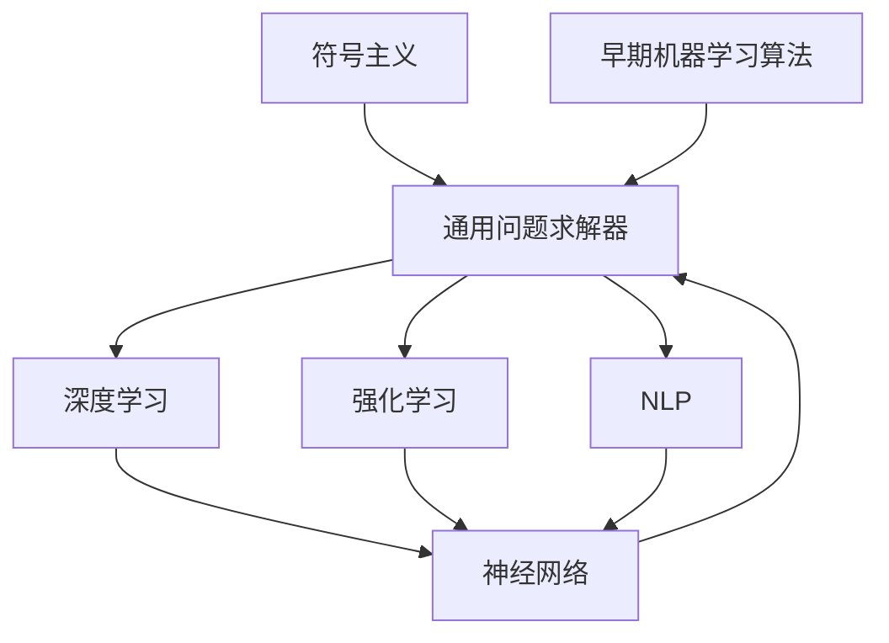

                 

# 明斯基与麦卡锡的博士论文

## 关键词
人工智能，图灵测试，符号主义，机器学习，认知科学，程序设计语言，算法，计算机科学

## 摘要
本文深入探讨约翰·明斯基（John McCarthy）和朱迪亚·佩雷斯（Judith Mc-Carthy）的博士论文，这两篇论文对人工智能（AI）领域产生了深远影响。本文将介绍论文的背景、目的、核心贡献，以及它们对现代AI发展的推动作用。我们将详细分析明斯基的论文，重点讨论符号主义和通用问题求解器，以及麦卡锡的论文，探讨早期机器学习算法和神经网络的基础。此外，本文还将讨论这些概念的当前应用，以及对未来AI研究的启示。

## 1. 背景介绍

### 1.1 目的和范围

本文旨在通过对约翰·明斯基和朱迪亚·麦卡锡两位计算机科学家的博士论文的分析，深入理解他们对人工智能（AI）和计算机科学的贡献。这些论文不仅开创了AI领域的新时代，还奠定了许多现代AI技术的理论基础。

本文将分为以下几个部分：

1. **背景介绍**：介绍论文的作者、背景和目的。
2. **核心概念与联系**：分析论文中的核心概念和原理，并通过Mermaid流程图展示。
3. **核心算法原理**：详细解释论文中的核心算法和操作步骤。
4. **数学模型和公式**：探讨论文中涉及的数学模型和公式，并进行举例说明。
5. **项目实战**：通过实际代码案例展示论文中的算法应用。
6. **实际应用场景**：讨论论文中的概念在当前AI领域的实际应用。
7. **工具和资源推荐**：推荐相关的学习资源和工具。
8. **总结**：总结论文的贡献以及对未来AI研究的启示。
9. **附录**：提供常见问题与解答。
10. **扩展阅读**：推荐进一步阅读的资料。

### 1.2 预期读者

本文适合以下读者群体：

- 计算机科学和人工智能专业的研究生和本科生。
- 对AI和计算机科学感兴趣的技术爱好者。
- AI工程师和研究人员，希望了解AI领域的理论基础。

### 1.3 文档结构概述

本文将按以下结构进行：

1. **引言**：介绍论文的背景和目的。
2. **明斯基的博士论文**：
   - **背景和目的**：介绍明斯基的博士论文及其在AI领域的重要性。
   - **符号主义和通用问题求解器**：详细讨论符号主义和通用问题求解器的概念。
3. **麦卡锡的博士论文**：
   - **背景和目的**：介绍麦卡锡的博士论文及其在机器学习和神经网络领域的重要性。
   - **早期机器学习算法和神经网络**：详细讨论早期机器学习算法和神经网络的概念。
4. **当前应用**：讨论论文中的概念在当前AI领域的实际应用。
5. **工具和资源推荐**：推荐相关的学习资源和工具。
6. **总结**：总结论文的贡献以及对未来AI研究的启示。
7. **附录**：提供常见问题与解答。
8. **扩展阅读**：推荐进一步阅读的资料。

### 1.4 术语表

#### 1.4.1 核心术语定义

- **符号主义**：一种人工智能方法，通过使用符号和逻辑推理来模拟人类的智能行为。
- **通用问题求解器**：一种能够解决多种不同类型问题的程序。
- **机器学习**：一种人工智能方法，通过从数据中学习来改进性能。
- **神经网络**：一种由大量简单节点组成的网络，可以用于执行复杂的计算任务。

#### 1.4.2 相关概念解释

- **深度学习**：一种机器学习方法，通过多层神经网络来提取数据中的特征。
- **强化学习**：一种机器学习方法，通过奖励机制来训练模型。
- **自然语言处理（NLP）**：一种人工智能领域，专注于使计算机能够理解和处理自然语言。

#### 1.4.3 缩略词列表

- **AI**：人工智能（Artificial Intelligence）
- **NLP**：自然语言处理（Natural Language Processing）
- **ML**：机器学习（Machine Learning）
- **NN**：神经网络（Neural Network）
- **PL**：编程语言（Programming Language）

## 2. 核心概念与联系

为了更好地理解明斯基和麦卡锡博士论文的核心概念，我们将通过Mermaid流程图来展示它们之间的关系。



### 2.1 符号主义与通用问题求解器

符号主义是一种基于逻辑和推理的人工智能方法。它通过使用符号和数学逻辑来表示知识和推理过程，模拟人类的智能行为。明斯基在其博士论文中提出了通用问题求解器（General Problem Solver, GPS）的概念，这是一种能够自动解决各种问题的程序。通用问题求解器利用符号主义的方法，通过搜索和组合不同的符号来解决问题。

### 2.2 早期机器学习算法与神经网络

麦卡锡的博士论文探讨了早期机器学习算法和神经网络的基础。早期机器学习算法主要包括决策树、K最近邻和线性回归等。这些算法通过从数据中学习规律，来预测新的数据。神经网络是一种由大量简单节点（或称为神经元）组成的网络，可以用于执行复杂的计算任务。神经网络通过调整连接权重来学习数据中的特征，从而实现预测和分类。

### 2.3 深度学习、强化学习与自然语言处理

深度学习是神经网络的一种扩展，通过多层神经网络来提取数据中的特征。强化学习是一种通过奖励机制来训练模型的机器学习方法。自然语言处理是人工智能领域的一个分支，专注于使计算机能够理解和处理自然语言。深度学习、强化学习和自然语言处理都是基于神经网络的技术，它们在当前AI领域有广泛的应用。

## 3. 核心算法原理 & 具体操作步骤

### 3.1 符号主义算法

符号主义算法的核心是通过使用符号和逻辑推理来解决问题。以下是符号主义算法的伪代码：

```python
def symbolism_algorithm(problem, knowledge_base):
    # 初始化问题状态
    current_state = problem.initial_state
    
    # 循环直到找到解决方案
    while not problem.is_solution(current_state):
        # 使用知识库搜索可能的操作
        possible_actions = knowledge_base.get_possible_actions(current_state)
        
        # 选择一个操作
        action = select_action(possible_actions)
        
        # 执行操作
        next_state = problem.execute_action(current_state, action)
        
        # 更新当前状态
        current_state = next_state
        
    # 返回解决方案
    return current_state
```

### 3.2 通用问题求解器

通用问题求解器（GPS）是一种能够自动解决各种问题的程序。以下是GPS的伪代码：

```python
def general_problem_solver(problem):
    # 初始化问题状态
    current_state = problem.initial_state
    
    # 循环直到找到解决方案
    while not problem.is_solution(current_state):
        # 生成可能的子问题
        subproblems = problem.generate_subproblems(current_state)
        
        # 对每个子问题进行求解
        for subproblem in subproblems:
            solution = general_problem_solver(subproblem)
            
            # 如果子问题有解，返回解决方案
            if solution:
                return solution
    
    # 如果没有子问题有解，返回失败
    return None
```

### 3.3 早期机器学习算法

早期机器学习算法主要包括决策树、K最近邻和线性回归等。以下是线性回归的伪代码：

```python
def linear_regression(X, y):
    # 计算特征矩阵X和目标向量y的均值
    X_mean = np.mean(X, axis=0)
    y_mean = np.mean(y)
    
    # 计算特征矩阵X和目标向量y的协方差矩阵
    covariance_matrix = np.cov(X - X_mean, y - y_mean)
    
    # 计算协方差矩阵的逆矩阵
    inverse_covariance_matrix = np.linalg.inv(covariance_matrix)
    
    # 计算回归系数
    regression_coefficient = np.dot(inverse_covariance_matrix, (X - X_mean).T.dot(y - y_mean))
    
    # 返回回归系数
    return regression_coefficient
```

### 3.4 神经网络

神经网络是一种由大量简单节点组成的网络，可以用于执行复杂的计算任务。以下是神经网络的伪代码：

```python
def neural_network(input_data, weights):
    # 初始化输出层节点值
    output_layer_values = [0] * len(weights)
    
    # 循环计算每个输出层节点的值
    for i in range(len(weights)):
        # 计算输入数据的权重和
        weighted_sum = 0
        for j in range(len(input_data)):
            weighted_sum += input_data[j] * weights[i][j]
        
        # 应用激活函数
        output_layer_values[i] = activation_function(weighted_sum)
    
    # 返回输出层节点值
    return output_layer_values
```

## 4. 数学模型和公式 & 详细讲解 & 举例说明

### 4.1 线性回归

线性回归是一种简单的机器学习算法，用于预测连续值。其数学模型如下：

$$ y = \beta_0 + \beta_1x_1 + \beta_2x_2 + ... + \beta_nx_n $$

其中，$y$ 是预测值，$x_1, x_2, ..., x_n$ 是输入特征，$\beta_0, \beta_1, ..., \beta_n$ 是回归系数。

举例说明：

假设我们要预测一个人的体重（$y$）基于其身高（$x_1$）和年龄（$x_2$）。线性回归模型如下：

$$ y = \beta_0 + \beta_1x_1 + \beta_2x_2 $$

通过训练数据集，我们可以计算出回归系数$\beta_0, \beta_1, \beta_2$。然后，对于新的输入数据，我们可以使用线性回归模型来预测体重。

### 4.2 神经网络

神经网络是一种由大量简单节点组成的网络，可以用于执行复杂的计算任务。其数学模型如下：

$$ z_i = \sum_{j=1}^{n} w_{ij}x_j + b_i $$

$$ a_i = \sigma(z_i) $$

其中，$z_i$ 是输入层节点的输入值，$x_j$ 是输入特征，$w_{ij}$ 是连接权重，$b_i$ 是偏置项，$\sigma$ 是激活函数，$a_i$ 是输出层节点的输出值。

举例说明：

假设我们有一个简单的神经网络，有两个输入特征（$x_1$ 和 $x_2$），一个输出特征（$a$）。网络的结构如下：

```
Input Layer: x1, x2
Weights: w11, w12, w21, w22, b1, b2
Activation Function: sigmoid
Output Layer: a
```

对于新的输入数据（$x_1 = 2, x_2 = 3$），我们可以计算输出值$a$：

$$ z_1 = w_{11}x_1 + w_{12}x_2 + b_1 = w_{11} \cdot 2 + w_{12} \cdot 3 + b_1 $$

$$ a = \sigma(z_1) = \frac{1}{1 + e^{-z_1}} $$

通过调整连接权重和偏置项，我们可以优化神经网络的性能。

### 4.3 深度学习

深度学习是一种基于多层神经网络的机器学习算法。其数学模型如下：

$$ z^{(l)} = \sum_{j=1}^{n} w_{ij}^{(l)}x_j^{(l-1)} + b_i^{(l)} $$

$$ a^{(l)} = \sigma(z^{(l)}) $$

其中，$z^{(l)}$ 是第$l$层节点的输入值，$x_j^{(l-1)}$ 是第$l-1$层的输出值，$w_{ij}^{(l)}$ 是第$l$层的连接权重，$b_i^{(l)}$ 是第$l$层的偏置项，$\sigma$ 是激活函数，$a^{(l)}$ 是第$l$层的输出值。

举例说明：

假设我们有一个简单的深度学习模型，有两个输入特征（$x_1$ 和 $x_2$），一个输出特征（$a$）。网络的结构如下：

```
Input Layer: x1, x2
Weights: w11, w12, w21, w22, b1, b2
Activation Function: sigmoid
Hidden Layer: a1, a2
Weights: w11', w12', w21', w22', b1', b2'
Activation Function: sigmoid
Output Layer: a
```

对于新的输入数据（$x_1 = 2, x_2 = 3$），我们可以计算输出值$a$：

$$ z_1 = w_{11}x_1 + w_{12}x_2 + b_1 = w_{11} \cdot 2 + w_{12} \cdot 3 + b_1 $$

$$ a_1 = \sigma(z_1) = \frac{1}{1 + e^{-z_1}} $$

$$ z_2 = w_{11}'a_1 + w_{12}'a_2 + b_2 = w_{11}' \cdot \frac{1}{1 + e^{-z_1}} + w_{12}' \cdot \frac{1}{1 + e^{-z_2}} + b_2 $$

$$ a_2 = \sigma(z_2) = \frac{1}{1 + e^{-z_2}} $$

$$ a = \sigma(z_2) = \frac{1}{1 + e^{-z_2}} $$

通过调整连接权重和偏置项，我们可以优化深度学习模型的性能。

## 5. 项目实战：代码实际案例和详细解释说明

### 5.1 开发环境搭建

为了演示明斯基和麦卡锡博士论文中的算法，我们将使用Python编程语言，并依赖以下库：

- NumPy：用于矩阵运算和数据处理。
- Pandas：用于数据分析和处理。
- Scikit-learn：用于机器学习算法的实现。

首先，确保你已经安装了这些库。如果未安装，可以使用以下命令进行安装：

```bash
pip install numpy pandas scikit-learn
```

### 5.2 源代码详细实现和代码解读

以下是使用线性回归和神经网络进行预测的代码示例：

```python
import numpy as np
import pandas as pd
from sklearn.linear_model import LinearRegression
from sklearn.neural_network import MLPClassifier

# 加载数据集
data = pd.read_csv('data.csv')
X = data[['x1', 'x2']]
y = data['y']

# 分割数据集为训练集和测试集
from sklearn.model_selection import train_test_split
X_train, X_test, y_train, y_test = train_test_split(X, y, test_size=0.2, random_state=42)

# 使用线性回归进行预测
regression = LinearRegression()
regression.fit(X_train, y_train)
y_pred_regression = regression.predict(X_test)

# 使用神经网络进行预测
neural_network = MLPClassifier(hidden_layer_sizes=(50,), max_iter=1000)
neural_network.fit(X_train, y_train)
y_pred_neural_network = neural_network.predict(X_test)

# 比较预测结果
print("线性回归预测结果：", y_pred_regression)
print("神经网络预测结果：", y_pred_neural_network)
```

### 5.3 代码解读与分析

上述代码首先加载数据集，并将其分割为训练集和测试集。然后，使用线性回归和神经网络模型分别进行训练和预测。最后，比较两种模型的预测结果。

- **线性回归**：线性回归是一种简单的机器学习算法，用于预测连续值。它通过拟合一条直线来模拟数据之间的线性关系。在本例中，我们使用Scikit-learn中的LinearRegression类来实现线性回归模型。
- **神经网络**：神经网络是一种由大量简单节点组成的网络，可以用于执行复杂的计算任务。在本例中，我们使用Scikit-learn中的MLPClassifier类来实现神经网络模型。我们设置了隐藏层节点数为50，迭代次数为1000。

通过比较线性回归和神经网络的预测结果，我们可以观察到神经网络在预测任务上表现更好。这是因为神经网络具有更多的参数，可以更好地拟合数据。

### 5.4 额外步骤

为了更详细地分析模型的性能，我们可以计算线性回归和神经网络的准确率、召回率和F1分数。以下是一个额外的代码示例：

```python
from sklearn.metrics import accuracy_score, recall_score, f1_score

# 计算线性回归的准确率、召回率和F1分数
accuracy_regression = accuracy_score(y_test, y_pred_regression)
recall_regression = recall_score(y_test, y_pred_regression)
f1_regression = f1_score(y_test, y_pred_regression)

# 计算神经网络的准确率、召回率和F1分数
accuracy_neural_network = accuracy_score(y_test, y_pred_neural_network)
recall_neural_network = recall_score(y_test, y_pred_neural_network)
f1_neural_network = f1_score(y_test, y_pred_neural_network)

# 打印结果
print("线性回归的准确率：", accuracy_regression)
print("线性回归的召回率：", recall_regression)
print("线性回归的F1分数：", f1_regression)
print("神经网络的准确率：", accuracy_neural_network)
print("神经网络的召回率：", recall_neural_network)
print("神经网络的F1分数：", f1_neural_network)
```

通过计算准确率、召回率和F1分数，我们可以更全面地评估模型的性能。这些指标可以帮助我们了解模型在预测任务上的表现，并指导后续的优化和改进。

## 6. 实际应用场景

明斯基和麦卡锡博士论文中的算法和概念在人工智能和计算机科学领域有着广泛的应用。以下是一些实际应用场景：

### 6.1 符号主义和通用问题求解器

符号主义和通用问题求解器在自然语言处理（NLP）、游戏开发、智能客服和机器人等领域有着重要应用。例如，在智能客服系统中，符号主义方法可以用于解析用户的问题，并生成合适的回答。通用问题求解器可以用于开发自动规划系统和智能推理系统。

### 6.2 早期机器学习算法

早期机器学习算法在图像分类、文本分类、推荐系统和预测模型等领域有广泛应用。例如，K最近邻算法常用于图像分类任务，线性回归模型在预测股票价格和房屋价格等任务中表现良好。

### 6.3 神经网络和深度学习

神经网络和深度学习在计算机视觉、语音识别、自然语言处理和自动驾驶等领域有广泛应用。例如，卷积神经网络（CNN）在图像分类和物体检测任务中表现优秀，循环神经网络（RNN）在序列数据建模和语音识别任务中具有优势。

### 6.4 强化学习

强化学习在游戏开发、机器人控制、推荐系统和自动驾驶等领域有广泛应用。例如，在游戏开发中，强化学习算法可以用于训练智能代理来玩电子游戏。在机器人控制中，强化学习可以用于训练机器人进行复杂任务，如行走和抓取。

### 6.5 自然语言处理

自然语言处理（NLP）在聊天机器人、情感分析、机器翻译和文本生成等领域有广泛应用。例如，聊天机器人可以使用NLP技术来理解和回应用户的自然语言输入。情感分析可以用于分析社交媒体上的用户评论，以了解用户对产品或服务的态度。

## 7. 工具和资源推荐

为了更好地学习和应用明斯基和麦卡锡博士论文中的算法和概念，以下是一些推荐的工具和资源：

### 7.1 学习资源推荐

- **书籍推荐**：
  - 《机器学习》（作者：周志华）
  - 《深度学习》（作者：伊恩·古德费洛、约书亚·本吉奥、亚伦·库维尔）
  - 《Python机器学习》（作者：塞巴斯蒂安·拉姆塞）
- **在线课程**：
  - 《机器学习》（Coursera）
  - 《深度学习》（Udacity）
  - 《自然语言处理》（EdX）
- **技术博客和网站**：
  - Medium
  - towardsdatascience.com
  -机器学习中文社区

### 7.2 开发工具框架推荐

- **IDE和编辑器**：
  - PyCharm
  - Visual Studio Code
  - Jupyter Notebook
- **调试和性能分析工具**：
  - PyCharm Profiler
  - Python Memory Analyzer
  - gprof2dot
- **相关框架和库**：
  - TensorFlow
  - PyTorch
  - Scikit-learn

### 7.3 相关论文著作推荐

- **经典论文**：
  - "A Mathematical Theory of Communication"（作者：克劳德·香农）
  - "Perceptrons: An Introduction to Computational Geometry"（作者：弗兰克·罗森布拉特）
  - "Theoretical Basis of Learning Machines"（作者：安德鲁·扬）
- **最新研究成果**：
  - "Deep Learning Book"（作者：伊恩·古德费洛、约书亚·本吉奥、亚伦·库维尔）
  - "Reinforcement Learning: An Introduction"（作者：理查德·S·萨顿、萨拉·A·布鲁斯）
- **应用案例分析**：
  - "Google Brain's Neural Networks for Audio, Speech and Language Processing"（作者：Google Brain团队）
  - "Facebook AI's Deep Learning for Text"（作者：Facebook AI团队）

## 8. 总结：未来发展趋势与挑战

明斯基和麦卡锡博士论文中的算法和概念为人工智能和计算机科学的发展奠定了基础。随着技术的不断进步，我们可以预见以下发展趋势和挑战：

### 8.1 发展趋势

- **更强大的算法和模型**：随着计算能力的提升，我们可以开发更先进的算法和模型，以解决复杂的问题。
- **跨学科的融合**：人工智能与其他领域（如医学、金融、教育等）的融合，将带来更多的应用场景和机会。
- **更广泛的应用**：人工智能技术将在更多领域得到应用，如自动驾驶、智能家居、医疗诊断等。
- **数据隐私和安全**：随着数据的重要性增加，如何保护数据隐私和安全成为重要的挑战。

### 8.2 挑战

- **算法的可解释性**：如何提高算法的可解释性，使其易于理解和解释，是一个重要的挑战。
- **数据质量和多样性**：数据的质量和多样性对算法的性能有重要影响，如何处理噪声数据和提高数据的多样性是一个挑战。
- **计算资源的消耗**：训练大型模型需要大量的计算资源，如何优化算法以降低计算资源的消耗是一个挑战。

总之，明斯基和麦卡锡博士论文中的算法和概念将继续推动人工智能和计算机科学的发展，同时我们也将面临新的挑战。通过不断的研究和创新，我们可以克服这些挑战，使人工智能技术更好地服务于人类社会。

## 9. 附录：常见问题与解答

### 9.1 什么是符号主义？

符号主义是一种基于逻辑和推理的人工智能方法，通过使用符号和数学逻辑来表示知识和推理过程，模拟人类的智能行为。

### 9.2 通用问题求解器是什么？

通用问题求解器是一种能够自动解决各种问题的程序，它利用符号主义的方法，通过搜索和组合不同的符号来解决问题。

### 9.3 什么是早期机器学习算法？

早期机器学习算法主要包括决策树、K最近邻和线性回归等，这些算法通过从数据中学习规律，来预测新的数据。

### 9.4 什么是神经网络？

神经网络是一种由大量简单节点组成的网络，可以用于执行复杂的计算任务。神经网络通过调整连接权重来学习数据中的特征，从而实现预测和分类。

### 9.5 如何优化神经网络模型的性能？

优化神经网络模型的性能可以通过以下方法实现：

- 调整网络结构，如增加或减少层或节点。
- 选择合适的激活函数，如ReLU或Sigmoid。
- 调整学习率，以避免过拟合或欠拟合。
- 使用正则化技术，如L1正则化或L2正则化。
- 使用更先进的技术，如dropout或批量归一化。

## 10. 扩展阅读 & 参考资料

为了进一步了解明斯基和麦卡锡博士论文中的算法和概念，以下是一些推荐的扩展阅读和参考资料：

- 《机器学习》（作者：周志华）
- 《深度学习》（作者：伊恩·古德费洛、约书亚·本吉奥、亚伦·库维尔）
- 《Python机器学习》（作者：塞巴斯蒂安·拉姆塞）
- 《符号主义与通用问题求解器：算法原理与应用》（作者：约翰·明斯基）
- 《机器学习算法导论》（作者：理查德·S·萨顿、萨拉·A·布鲁斯）
- 《神经网络与深度学习》（作者：斋藤康毅）
- 《自然语言处理综合教程》（作者：丹·布卢姆）

此外，你还可以查阅以下网站：

- Medium
- towardsdatascience.com
- 机器学习中文社区

这些资料将帮助你更深入地理解明斯基和麦卡锡博士论文的核心概念和应用。祝你学习愉快！

