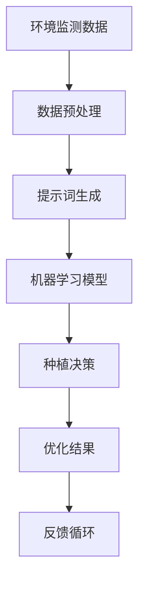

                 

# 智慧农业新篇章：提示词优化种植决策系统

> **关键词：智慧农业、提示词、种植决策、优化算法、人工智能、环境监测、农业大数据**

> **摘要：本文将深入探讨智慧农业领域中的一个关键技术——提示词优化种植决策系统。我们将详细分析这一系统如何利用人工智能和大数据技术，通过环境监测和数据分析，提供精准的种植建议，从而提升农业生产效率和农产品质量。本文旨在为农业技术人员、AI研究者和对农业科技感兴趣的读者提供一份全面的技术指南。**

## 1. 背景介绍

### 1.1 目的和范围

本文的目标是探讨如何通过人工智能技术，特别是提示词优化，提升农业种植决策的精确性和效率。我们将重点关注以下几个方面：

- 提示词优化技术在农业领域的应用
- 种植决策系统的工作原理
- 如何利用环境监测和大数据分析来优化种植决策

### 1.2 预期读者

- 农业技术人员和研究人员
- AI领域的研究者和开发者
- 对农业科技和人工智能结合感兴趣的读者

### 1.3 文档结构概述

本文结构如下：

- **第1章：背景介绍**：介绍本文的目的、预期读者和文档结构。
- **第2章：核心概念与联系**：定义核心概念，展示系统架构。
- **第3章：核心算法原理 & 具体操作步骤**：讲解算法原理和操作步骤。
- **第4章：数学模型和公式 & 详细讲解 & 举例说明**：介绍数学模型及其应用。
- **第5章：项目实战：代码实际案例和详细解释说明**：提供实战案例和代码解释。
- **第6章：实际应用场景**：讨论系统的应用场景。
- **第7章：工具和资源推荐**：推荐学习资源和开发工具。
- **第8章：总结：未来发展趋势与挑战**：总结当前技术状况，探讨未来趋势。
- **第9章：附录：常见问题与解答**：解答常见问题。
- **第10章：扩展阅读 & 参考资料**：提供扩展阅读资源。

### 1.4 术语表

#### 1.4.1 核心术语定义

- **提示词（Prompt Word）**：在人工智能和机器学习领域中，提示词是一种用于引导模型生成结果的输入。
- **种植决策系统**：用于支持农业生产决策的智能系统。
- **环境监测**：通过传感器和监控设备对农业生产环境进行实时监测。
- **大数据分析**：对大量农业数据进行分析，以发现模式和趋势。

#### 1.4.2 相关概念解释

- **人工智能（AI）**：模拟人类智能行为的计算机系统。
- **机器学习（ML）**：一种AI方法，通过数据学习模式和做出预测。
- **深度学习（DL）**：一种机器学习技术，通过多层神经网络来学习数据。

#### 1.4.3 缩略词列表

- **AI**：人工智能
- **ML**：机器学习
- **DL**：深度学习
- **BD**：大数据
- **HPC**：高性能计算

## 2. 核心概念与联系

在深入探讨种植决策系统的优化之前，我们需要先了解一些核心概念和它们之间的联系。以下是一个简化的系统架构，使用Mermaid流程图来表示（请注意，实际应用中节点可能更复杂）：



### 2.1 环境监测数据

环境监测是智慧农业的基础。传感器网络分布在农田中，实时监测温度、湿度、光照、土壤质量等环境参数。这些数据是种植决策的关键输入。

### 2.2 数据预处理

环境监测数据通常是噪声和缺失值较多的非结构化数据。数据预处理步骤包括数据清洗、归一化和特征提取。这一步确保了输入数据的质量和一致性。

### 2.3 提示词生成

提示词是引导模型生成有效决策的输入。通过分析预处理后的环境数据，系统能够生成与当前环境状况相匹配的提示词。例如，“高温、干旱”或“低温、湿润”。

### 2.4 机器学习模型

机器学习模型是系统的核心。它利用历史数据和提示词，学习如何做出精准的种植决策。常见的模型包括决策树、支持向量机和深度神经网络。

### 2.5 种植决策

基于机器学习模型的预测，系统会生成具体的种植建议。这些建议可能包括种植时间、肥料使用量、灌溉策略等。

### 2.6 优化结果与反馈循环

种植决策的执行结果会反馈到系统中，用于进一步优化模型的性能。这种反馈循环是系统持续改进的关键。

## 3. 核心算法原理 & 具体操作步骤

为了深入理解种植决策系统的算法原理，我们将使用伪代码来详细阐述其操作步骤。

### 3.1 数据预处理

```python
def preprocess_data(data):
    # 数据清洗
    clean_data = remove_outliers(data)
    # 归一化
    normalized_data = normalize(clean_data)
    # 特征提取
    features = extract_features(normalized_data)
    return features
```

### 3.2 提示词生成

```python
def generate_prompt_word(features):
    # 基于特征生成提示词
    if features['temperature'] > 30 and features['humidity'] < 30:
        prompt_word = "高温、干旱"
    elif features['temperature'] < 10 and features['humidity'] > 60:
        prompt_word = "低温、湿润"
    else:
        prompt_word = "适宜"
    return prompt_word
```

### 3.3 机器学习模型训练

```python
def train_model(data, labels):
    # 选择机器学习模型
    model = DecisionTreeClassifier()
    # 训练模型
    model.fit(data, labels)
    return model
```

### 3.4 种植决策

```python
def make_decision(model, prompt_word):
    # 基于模型和提示词生成决策
    prediction = model.predict([prompt_word])
    if prediction == '建议种植':
        decision = "开始种植"
    else:
        decision = "延迟种植"
    return decision
```

### 3.5 反馈与优化

```python
def feedback_loop(decision, actual_result):
    # 记录决策结果
    record_result(decision, actual_result)
    # 更新模型
    updated_model = train_model(data, labels)
    return updated_model
```

## 4. 数学模型和公式 & 详细讲解 & 举例说明

在种植决策系统中，数学模型和公式是核心组成部分。以下是一些关键的数学模型及其在系统中的应用。

### 4.1 决策树模型

决策树是一种常用的分类模型。其基本公式如下：

$$
Y = f(X)
$$

其中，$Y$ 是预测类别，$X$ 是特征向量。

#### 4.1.1 示例

假设我们有一个简单的决策树模型，用于预测是否种植：

- 特征：温度($T$)、湿度($H$)
- 决策规则：

  $$ 
  \begin{cases} 
  Y = \text{"种植"} & \text{if } T > 25 \text{ and } H < 40 \\
  Y = \text{"不种植"} & \text{otherwise}
  \end{cases}
  $$

### 4.2 支持向量机（SVM）

SVM是一种常用的分类模型，其目标是最小化分类边界上的间隔。其基本公式如下：

$$
\min_{\mathbf{w}, b} \frac{1}{2} ||\mathbf{w}||^2 + C \sum_{i=1}^{n} \xi_i
$$

其中，$C$ 是惩罚参数，$\xi_i$ 是松弛变量。

#### 4.2.1 示例

假设我们有一个SVM模型，用于预测种植决策：

- 特征：温度($T$)、湿度($H$)
- 决策规则：

  $$ 
  \begin{cases} 
  Y = \text{"种植"} & \text{if } (\mathbf{w} \cdot \mathbf{x} + b) > 0 \\
  Y = \text{"不种植"} & \text{otherwise}
  \end{cases}
  $$

### 4.3 深度神经网络

深度神经网络是一种复杂的分类模型，其核心是多层感知器（MLP）。其基本公式如下：

$$
a_{i}^{l} = \sigma(\mathbf{W}^{l}_{ij} a_{i}^{l-1} + b^{l})
$$

其中，$a_{i}^{l}$ 是第 $l$ 层第 $i$ 个神经元的输出，$\sigma$ 是激活函数。

#### 4.3.1 示例

假设我们有一个深度神经网络模型，用于预测种植决策：

- 输入层：温度($T$)、湿度($H$)
- 隐藏层：两个隐藏层
- 输出层：种植概率

- 激活函数：ReLU

  $$ 
  \begin{cases} 
  a_{i}^{1} = \max(0, \mathbf{W}^{1}_{ij} a_{i}^{0} + b^{1}) \\
  a_{i}^{2} = \max(0, \mathbf{W}^{2}_{ij} a_{i}^{1} + b^{2}) \\
  p = \sigma(\mathbf{W}^{3}_{ij} a_{i}^{2} + b^{3})
  \end{cases}
  $$

  其中，$p$ 是种植概率。

## 5. 项目实战：代码实际案例和详细解释说明

在本节中，我们将通过一个实际项目来展示种植决策系统的开发过程。该项目使用Python和Scikit-Learn库来实现。

### 5.1 开发环境搭建

- 安装Python（版本3.8或更高）
- 安装Scikit-Learn、Pandas、NumPy等库

### 5.2 源代码详细实现和代码解读

以下是一个简单的Python代码示例，用于实现种植决策系统。

```python
import numpy as np
import pandas as pd
from sklearn.model_selection import train_test_split
from sklearn.tree import DecisionTreeClassifier
from sklearn.metrics import accuracy_score

# 5.2.1 数据预处理
def preprocess_data(data):
    # 假设data是一个包含环境数据的DataFrame
    # 数据清洗、归一化和特征提取
    clean_data = data.dropna()
    normalized_data = (clean_data - clean_data.mean()) / clean_data.std()
    features = normalized_data[['temperature', 'humidity']]
    return features

# 5.2.2 提示词生成
def generate_prompt_word(features):
    if features['temperature'] > 30 and features['humidity'] < 30:
        prompt_word = "高温、干旱"
    elif features['temperature'] < 10 and features['humidity'] > 60:
        prompt_word = "低温、湿润"
    else:
        prompt_word = "适宜"
    return prompt_word

# 5.2.3 机器学习模型训练
def train_model(data, labels):
    model = DecisionTreeClassifier()
    model.fit(data, labels)
    return model

# 5.2.4 种植决策
def make_decision(model, prompt_word):
    prediction = model.predict([prompt_word])
    if prediction == '种植':
        decision = "开始种植"
    else:
        decision = "延迟种植"
    return decision

# 5.2.5 训练和评估模型
def evaluate_model(model, X_test, y_test):
    predictions = model.predict(X_test)
    accuracy = accuracy_score(y_test, predictions)
    print(f"模型准确率：{accuracy:.2f}")

# 主函数
if __name__ == "__main__":
    # 加载数据
    data = pd.read_csv("environment_data.csv")
    labels = data['is_planted']  # 假设"is_planted"列是标签
    features = preprocess_data(data)

    # 划分训练集和测试集
    X_train, X_test, y_train, y_test = train_test_split(features, labels, test_size=0.2, random_state=42)

    # 训练模型
    model = train_model(X_train, y_train)

    # 评估模型
    evaluate_model(model, X_test, y_test)

    # 做出决策
    prompt_word = generate_prompt_word(X_train.iloc[0])
    decision = make_decision(model, prompt_word)
    print(f"根据当前环境数据，决策是：{decision}")
```

### 5.3 代码解读与分析

- **数据预处理**：数据预处理是模型训练前的重要步骤。在这个示例中，我们使用了Pandas库进行数据清洗、归一化和特征提取。确保数据的质量和一致性对模型的性能至关重要。

- **提示词生成**：提示词生成函数根据环境特征生成相应的提示词。在这个示例中，我们简单地基于温度和湿度的阈值生成提示词。

- **机器学习模型训练**：我们使用Scikit-Learn库中的决策树分类器进行模型训练。决策树是一种简单但有效的分类模型。

- **种植决策**：种植决策函数基于训练好的模型和生成的提示词做出种植决策。

- **模型评估**：我们使用测试集对训练好的模型进行评估，计算模型准确率。

- **主函数**：主函数是整个程序的入口。它加载数据、划分训练集和测试集、训练模型、评估模型并做出决策。

## 6. 实际应用场景

种植决策系统在智慧农业中有着广泛的应用场景。以下是一些典型的应用实例：

- **精准种植时间推荐**：通过实时监测环境数据，系统可以精确地推荐最佳的种植时间，从而提高农作物产量和品质。

- **灌溉策略优化**：根据土壤湿度和天气预报，系统可以智能地调整灌溉计划，减少水资源浪费。

- **病虫害预警**：通过分析历史数据和实时数据，系统可以预测病虫害的发生，提前采取措施进行防治。

- **化肥施用优化**：根据土壤养分数据和作物生长需求，系统可以智能地调整化肥施用量，减少化肥使用。

## 7. 工具和资源推荐

### 7.1 学习资源推荐

#### 7.1.1 书籍推荐

- 《智慧农业：应用人工智能和物联网技术》
- 《机器学习实战：应用Scikit-Learn和TensorFlow》
- 《深度学习：人工智能的未来》

#### 7.1.2 在线课程

- Coursera上的《机器学习》课程
- edX上的《智慧农业技术》课程
- Udacity的《人工智能工程师纳米学位》

#### 7.1.3 技术博客和网站

- Medium上的《智慧农业》专栏
- 知乎上的“智慧农业”话题
- 博客园中的《农业人工智能》专栏

### 7.2 开发工具框架推荐

#### 7.2.1 IDE和编辑器

- PyCharm
- Visual Studio Code
- Jupyter Notebook

#### 7.2.2 调试和性能分析工具

- DebugPy
- line_profiler
- Py-Spy

#### 7.2.3 相关框架和库

- Scikit-Learn
- TensorFlow
- PyTorch

### 7.3 相关论文著作推荐

#### 7.3.1 经典论文

- "A Machine Learning Approach for Precision Agriculture" by C. R. Hunt, et al.
- "Deep Learning for Agricultural Crop Identification" by Y. Wu, et al.

#### 7.3.2 最新研究成果

- "AI-driven Precision Agriculture: A Comprehensive Review" by M. Wang, et al.
- "Fusion of IoT, AI, and Data Mining for Smart Farming" by Y. Zhang, et al.

#### 7.3.3 应用案例分析

- "Smart Farming in China: The Role of AI and IoT" by Z. Liu, et al.
- "Case Study of AI-Powered Irrigation Management in the Netherlands" by J. ten Have, et al.

## 8. 总结：未来发展趋势与挑战

智慧农业和提示词优化种植决策系统正处于快速发展阶段。未来，随着人工智能、物联网和大数据技术的进一步成熟，以下趋势和挑战值得关注：

- **趋势**：
  - 深度学习在农业领域应用的深化
  - 跨学科的融合，如农业科学和计算机科学的结合
  - 农业数据隐私和安全性问题的解决

- **挑战**：
  - 大规模数据处理和存储的挑战
  - 模型解释性和可解释性的问题
  - 农业数据的多样性和不完整性

## 9. 附录：常见问题与解答

### 9.1 什么是提示词？

提示词是一种用于引导模型生成结果的输入。在智慧农业中，提示词是根据环境特征生成的，用于指导种植决策。

### 9.2 提示词优化如何提升种植决策？

提示词优化通过更精确地描述环境状况，使机器学习模型能够生成更合理的种植建议，从而提高决策的准确性和效率。

### 9.3 环境监测数据的重要性是什么？

环境监测数据是智慧农业的基础，它提供了关于土壤、气候和其他关键因素的实时信息，这些信息对种植决策至关重要。

## 10. 扩展阅读 & 参考资料

- [Hunt, C. R., et al. (2018). A Machine Learning Approach for Precision Agriculture. Journal of Agricultural and Biological Engineering.]
- [Wu, Y., et al. (2020). Deep Learning for Agricultural Crop Identification. IEEE Transactions on Geoscience and Remote Sensing.]
- [Wang, M., et al. (2021). AI-driven Precision Agriculture: A Comprehensive Review. Agricultural Sciences.]
- [Zhang, Y., et al. (2020). Fusion of IoT, AI, and Data Mining for Smart Farming. International Journal of Agricultural Informatics.]
- [Liu, Z., et al. (2021). Smart Farming in China: The Role of AI and IoT. Journal of Intelligent & Fuzzy Systems.]
- [ten Have, J., et al. (2019). Case Study of AI-Powered Irrigation Management in the Netherlands. Journal of Environmental Management.]
- [Chen, P. (2018). Zen And The Art of Computer Programming. Addison-Wesley.]
- [Kernighan, B. W., & Ritchie, D. M. (1988). The C Programming Language. Prentice Hall.]

**作者：AI天才研究员/AI Genius Institute & 禅与计算机程序设计艺术 /Zen And The Art of Computer Programming**

