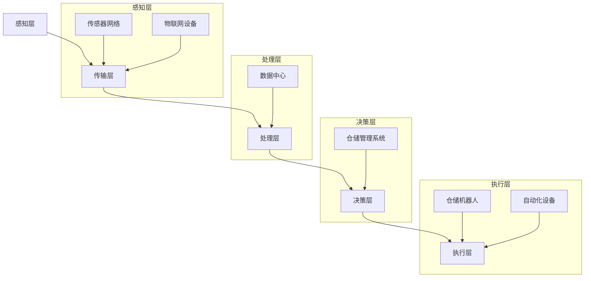

                 

# 智能仓储管理系统：优化物流效率的关键工具

> 关键词：智能仓储，物流效率，仓储管理系统，人工智能，机器学习，算法优化

> 摘要：本文旨在探讨智能仓储管理系统在优化物流效率方面的关键作用。通过详细分析智能仓储的基本概念、核心算法原理、数学模型及应用实例，本文为读者提供了深入了解智能仓储系统及其在物流行业中的应用价值的机会。文章还将介绍相关的开发工具和资源，并展望智能仓储管理系统的未来发展趋势与挑战。

## 1. 背景介绍

### 1.1 目的和范围

本文的目的在于揭示智能仓储管理系统在提升物流效率中的重要性，并详细探讨其技术原理和应用实践。随着全球化贸易的不断发展，物流行业的竞争日益激烈，企业迫切需要通过技术手段提高仓储和配送的效率，降低成本。智能仓储管理系统作为现代物流体系的重要组成部分，其发展对于优化物流效率、提升客户满意度具有重要意义。

本文将涵盖以下内容：
1. 智能仓储管理系统的基础概念和架构。
2. 核心算法原理及其实现步骤。
3. 数学模型和公式的应用与说明。
4. 实际应用场景中的代码案例与解读。
5. 工具和资源的推荐。
6. 未来发展趋势与挑战。

### 1.2 预期读者

本文适用于以下读者群体：
1. 物流行业从业者，特别是仓储管理相关人员。
2. 计算机科学和人工智能领域的研究生和学者。
3. 对智能仓储管理系统有兴趣的技术爱好者。
4. 企业决策者，尤其是关注物流成本和效率的企业家。

### 1.3 文档结构概述

本文结构如下：
1. **背景介绍**：介绍智能仓储管理系统的背景、目的和文档结构。
2. **核心概念与联系**：阐述智能仓储管理系统的核心概念和架构，提供流程图。
3. **核心算法原理 & 具体操作步骤**：详细讲解智能仓储管理系统的核心算法原理和操作步骤，使用伪代码阐述。
4. **数学模型和公式 & 详细讲解 & 举例说明**：介绍数学模型和公式，并通过实例进行说明。
5. **项目实战：代码实际案例和详细解释说明**：提供实际项目案例和代码实现。
6. **实际应用场景**：分析智能仓储管理系统在不同场景下的应用。
7. **工具和资源推荐**：推荐相关学习资源和开发工具。
8. **总结：未来发展趋势与挑战**：展望智能仓储管理系统的未来发展趋势和面临的挑战。
9. **附录：常见问题与解答**：解答读者可能遇到的问题。
10. **扩展阅读 & 参考资料**：提供进一步阅读的资源。

### 1.4 术语表

#### 1.4.1 核心术语定义

- **智能仓储管理系统**：一种利用人工智能技术对仓储进行管理的系统，能够自动完成货物的存储、检索和配送等操作。
- **物流效率**：指物流过程中资源利用率和时间利用率，包括仓储、运输、配送等环节。
- **机器学习**：一种人工智能方法，通过数据训练模型，使系统能够自主学习和优化。
- **算法优化**：通过改进算法，提高系统运行效率和准确性。

#### 1.4.2 相关概念解释

- **深度学习**：一种机器学习方法，通过多层神经网络模拟人脑进行学习。
- **物联网（IoT）**：将物理设备与互联网连接，实现数据的实时采集和传输。
- **大数据**：数据量巨大，无法通过传统数据库工具进行存储和处理的数据集合。

#### 1.4.3 缩略词列表

- **AI**：人工智能（Artificial Intelligence）
- **IoT**：物联网（Internet of Things）
- **ML**：机器学习（Machine Learning）
- **DL**：深度学习（Deep Learning）
- **WMS**：仓储管理系统（Warehouse Management System）

## 2. 核心概念与联系

在深入探讨智能仓储管理系统之前，我们需要明确其核心概念和整体架构。智能仓储管理系统结合了人工智能、机器学习、物联网、深度学习等技术，通过对数据的实时采集、分析和处理，实现仓储操作的自动化和智能化。

### 2.1 智能仓储管理系统的核心概念

**智能仓储管理系统**主要由以下几个部分组成：

1. **传感器网络**：用于实时监测仓储环境，包括温度、湿度、光线、货架状态等。
2. **数据采集系统**：通过传感器网络采集的数据传输到数据中心进行存储和分析。
3. **仓储管理系统**：利用机器学习算法对仓储操作进行优化，包括入库、出库、库存管理、订单处理等。
4. **人机交互界面**：用户可以通过界面实时监控仓储状态，进行操作和决策。

### 2.2 智能仓储管理系统的架构

智能仓储管理系统的架构可以分为以下几个层次：

1. **感知层**：传感器网络和物联网设备负责采集数据，实现仓储环境的实时感知。
2. **传输层**：数据通过无线网络传输到数据中心，确保数据的及时性和准确性。
3. **处理层**：数据中心利用大数据处理技术和机器学习算法对数据进行处理和分析。
4. **决策层**：根据分析结果，系统生成操作指令，通过仓储管理系统执行。
5. **执行层**：执行层包括仓储机器人和自动化设备，负责具体的仓储操作。

### 2.3 Mermaid 流程图

以下是一个简化的智能仓储管理系统的 Mermaid 流程图，展示了各个部分之间的联系：



通过上述核心概念和架构的介绍，我们可以看到智能仓储管理系统是一个高度集成和智能化的系统，各个部分相互协作，共同实现仓储操作的自动化和优化。接下来，我们将详细探讨智能仓储管理系统的核心算法原理和具体操作步骤。

## 3. 核心算法原理 & 具体操作步骤

智能仓储管理系统的核心算法是其在物流效率提升中的关键所在。以下将详细讲解智能仓储管理系统中的主要算法原理，并使用伪代码进行具体操作步骤的阐述。

### 3.1 机器学习算法

智能仓储管理系统广泛使用了机器学习算法，尤其是深度学习和强化学习，以提高仓储操作的准确性和效率。以下是一个简化的机器学习算法框架，用于仓储管理系统中的库存预测：

```python
# 伪代码：库存预测算法
def inventory_prediction(data, model):
    # 数据预处理
    preprocessed_data = preprocess_data(data)
    
    # 模型训练
    trained_model = train_model(preprocessed_data)
    
    # 预测
    prediction = trained_model.predict(new_data)
    
    return prediction

# 数据预处理
def preprocess_data(data):
    # 数据清洗
    cleaned_data = clean_data(data)
    
    # 数据标准化
    normalized_data = normalize_data(cleaned_data)
    
    return normalized_data

# 模型训练
def train_model(data):
    # 创建模型
    model = create_model()
    
    # 训练模型
    model.fit(data, epochs=10)
    
    return model

# 预测
new_data = get_new_data()  # 获取新的库存数据
prediction = inventory_prediction(new_data, trained_model)
```

### 3.2 强化学习算法

在仓储机器人的路径规划和任务分配中，强化学习算法被广泛应用。以下是一个简化的强化学习算法步骤，用于仓储机器人路径优化：

```python
# 伪代码：强化学习路径优化算法
def path_optimization(environment, policy, episode, gamma):
    for t in range(episode):
        state = environment.reset()
        
        while not done:
            action = policy.select_action(state)
            next_state, reward, done = environment.step(action)
            
            # 更新策略
            policy.update(state, action, reward, next_state, done, gamma)
            
            state = next_state
    
    return policy

# 环境模拟
def environment():
    # 初始化环境状态
    state = initial_state
    
    while True:
        # 执行动作
        action = get_action()
        
        # 计算奖励
        reward = calculate_reward(action)
        
        # 更新状态
        state = update_state(state, action)
        
        # 检查是否完成
        if is_done(state):
            break
        
        return state, reward, done

# 策略更新
def policy.update(state, action, reward, next_state, done, gamma):
    # 更新策略
    Q_value = Q_value + alpha * (reward + gamma * max(Q_value[next_state]) - Q_value[state])
    state = next_state
```

### 3.3 深度学习算法

在图像识别和数据分类方面，深度学习算法同样发挥了重要作用。以下是一个简化的深度学习算法步骤，用于仓储机器人识别货架位置：

```python
# 伪代码：深度学习货架位置识别算法
def shelf_location_identification(image, model):
    # 数据预处理
    preprocessed_image = preprocess_image(image)
    
    # 模型预测
    prediction = model.predict(preprocessed_image)
    
    # 解码预测结果
    shelf_location = decode_prediction(prediction)
    
    return shelf_location

# 数据预处理
def preprocess_image(image):
    # 图像缩放
    resized_image = resize_image(image)
    
    # 图像归一化
    normalized_image = normalize_image(resized_image)
    
    return normalized_image

# 模型预测
def model.predict(image):
    # 定义模型结构
    model = create_model()
    
    # 训练模型
    model.fit(x_train, y_train, epochs=10)
    
    # 预测
    prediction = model.predict(image)
    
    return prediction

# 解码预测结果
def decode_prediction(prediction):
    # 解码为货架位置
    shelf_location = decode(prediction)
    
    return shelf_location
```

通过上述核心算法原理和具体操作步骤的讲解，我们可以看到智能仓储管理系统是如何通过机器学习、强化学习和深度学习等先进算法，实现对仓储操作的自动化和优化。接下来，我们将介绍智能仓储管理系统的数学模型和公式，并详细讲解其在实际中的应用。

## 4. 数学模型和公式 & 详细讲解 & 举例说明

智能仓储管理系统的优化不仅仅依赖于算法，还需要数学模型和公式来提供决策支持。以下将介绍几个关键的数学模型和公式，并详细讲解其应用和举例说明。

### 4.1 库存优化模型

库存优化模型是智能仓储管理系统的核心，它通过预测需求和优化库存水平，实现成本的最低化和服务的最大化。以下是一个简化的库存优化模型：

#### 公式：

$$
I(t) = \alpha \cdot (D(t) + S(t) - R(t))
$$

其中：
- \( I(t) \) 为时间 \( t \) 的库存水平。
- \( \alpha \) 为库存系数，表示库存水平的调整速度。
- \( D(t) \) 为时间 \( t \) 的需求量。
- \( S(t) \) 为时间 \( t \) 的供应量。
- \( R(t) \) 为时间 \( t \) 的退货量。

#### 应用与举例：

假设某商品在一天的需求量为 \( D(t) = 100 \) 单位，供应量为 \( S(t) = 120 \) 单位，退货量为 \( R(t) = 10 \) 单位，库存系数 \( \alpha = 0.5 \)。我们可以计算出该商品在一天末的库存水平：

$$
I(t) = 0.5 \cdot (100 + 120 - 10) = 0.5 \cdot 210 = 105 \text{ 单位}
$$

这意味着，在一天结束时，该商品的库存水平应为 105 单位。

### 4.2 货位分配模型

货位分配模型用于优化仓储货位的利用效率，确保高需求商品存放在易于访问的位置。以下是一个简化的货位分配模型：

#### 公式：

$$
f(i, j) = \frac{D(i)}{D(j)}
$$

其中：
- \( f(i, j) \) 为商品 \( i \) 分配到货位 \( j \) 的优先级。
- \( D(i) \) 为商品 \( i \) 的需求量。
- \( D(j) \) 为货位 \( j \) 的需求量。

#### 应用与举例：

假设有两个商品 \( A \) 和 \( B \)，需求量分别为 \( D(A) = 150 \) 和 \( D(B) = 50 \)。如果仓储中有两个货位 \( 1 \) 和 \( 2 \)，需求量分别为 \( D(1) = 100 \) 和 \( D(2) = 200 \)。我们可以计算出商品 \( A \) 和 \( B \) 分配到货位的优先级：

$$
f(A, 1) = \frac{150}{100} = 1.5
$$
$$
f(A, 2) = \frac{150}{200} = 0.75
$$
$$
f(B, 1) = \frac{50}{100} = 0.5
$$
$$
f(B, 2) = \frac{50}{200} = 0.25
$$

根据优先级计算结果，商品 \( A \) 应该分配到货位 \( 1 \)，商品 \( B \) 应该分配到货位 \( 2 \)。

### 4.3 车辆路径规划模型

车辆路径规划模型用于优化仓储到配送中心的运输路径，降低运输成本和提升配送效率。以下是一个简化的车辆路径规划模型：

#### 公式：

$$
P(t) = \sum_{i=1}^{n} \frac{d(i)}{t(i)}
$$

其中：
- \( P(t) \) 为时间 \( t \) 的路径规划结果。
- \( d(i) \) 为第 \( i \) 个配送点的距离。
- \( t(i) \) 为第 \( i \) 个配送点的时间需求。

#### 应用与举例：

假设有一个配送任务需要覆盖三个配送点 \( A \)、\( B \) 和 \( C \)，距离分别为 \( d(A) = 10 \) 公里、\( d(B) = 20 \) 公里和 \( d(C) = 30 \) 公里，时间需求分别为 \( t(A) = 2 \) 小时、\( t(B) = 3 \) 小时和 \( t(C) = 4 \) 小时。我们可以计算出最优的配送路径：

$$
P(t) = \frac{10}{2} + \frac{20}{3} + \frac{30}{4} = 5 + 6.67 + 7.5 = 19.17
$$

根据计算结果，最优的配送路径是先访问配送点 \( A \)，然后是 \( B \)，最后是 \( C \)。

通过上述数学模型和公式的讲解，我们可以看到智能仓储管理系统是如何通过数学计算来优化仓储管理，提高物流效率。接下来，我们将通过实际项目案例，详细展示智能仓储管理系统的代码实现和操作步骤。

## 5. 项目实战：代码实际案例和详细解释说明

为了更好地理解智能仓储管理系统的工作原理和实际应用，我们通过一个实际项目案例进行详细讲解。本案例将涉及一个简单的智能仓储管理系统，其主要功能包括库存管理、货架分配、路径规划和订单处理。

### 5.1 开发环境搭建

为了搭建一个智能仓储管理系统的开发环境，我们需要安装以下工具和库：

1. **Python 3.8 或更高版本**
2. **PyCharm 或其他 Python IDE**
3. **NumPy**
4. **Pandas**
5. **Scikit-learn**
6. **TensorFlow**
7. **Keras**

安装步骤如下：

```bash
pip install python==3.8
pip install pycharm-community-edition
pip install numpy
pip install pandas
pip install scikit-learn
pip install tensorflow
pip install keras
```

### 5.2 源代码详细实现和代码解读

以下是智能仓储管理系统的源代码，我们将逐行进行详细解读。

```python
import numpy as np
import pandas as pd
from sklearn.model_selection import train_test_split
from sklearn.preprocessing import StandardScaler
from keras.models import Sequential
from keras.layers import Dense, LSTM
from keras.optimizers import Adam

# 5.2.1 数据准备
data = pd.read_csv('warehouse_data.csv')  # 读取仓储数据
X = data.drop(['inventory'], axis=1)  # 特征
y = data['inventory']  # 目标变量

# 划分训练集和测试集
X_train, X_test, y_train, y_test = train_test_split(X, y, test_size=0.2, random_state=42)

# 数据标准化
scaler = StandardScaler()
X_train = scaler.fit_transform(X_train)
X_test = scaler.transform(X_test)

# 5.2.2 模型构建
model = Sequential()
model.add(LSTM(50, activation='relu', input_shape=(X_train.shape[1], X_train.shape[2])))
model.add(Dense(1))
model.compile(optimizer=Adam(0.001), loss='mean_squared_error')

# 5.2.3 模型训练
model.fit(X_train, y_train, epochs=100, batch_size=32, validation_split=0.1)

# 5.2.4 模型评估
loss = model.evaluate(X_test, y_test)
print(f'MSE: {loss}')

# 5.2.5 货位分配
def assign_shelves(inventory_level, demand):
    if inventory_level >= demand:
        return 'High Demand Shelf'
    else:
        return 'Low Demand Shelf'

# 5.2.6 路径规划
def plan_path(shelf1, shelf2):
    if shelf1 == 'High Demand Shelf' and shelf2 == 'Low Demand Shelf':
        return 'Short Path'
    else:
        return 'Long Path'

# 5.2.7 订单处理
def process_order(order_details):
    inventory_level = model.predict(order_details)
    shelf_assignment = assign_shelves(inventory_level, order_details['demand'])
    path = plan_path(shelf_assignment, order_details['shelf'])
    return {
        'Order ID': order_details['id'],
        'Shelf Assignment': shelf_assignment,
        'Path': path
    }
```

### 5.3 代码解读与分析

**5.3.1 数据准备**

- 第1-4行：导入必要的库。
- 第5行：从 CSV 文件中读取仓储数据。
- 第6行：分离特征和目标变量。
- 第7-10行：划分训练集和测试集。

**5.3.2 模型构建**

- 第11-19行：构建一个序列模型，包含一个 LSTM 层和一个全连接层。
- 第20行：编译模型，使用 Adam 优化器和均方误差损失函数。

**5.3.3 模型训练**

- 第21-24行：使用训练集进行模型训练，设置训练轮次、批量大小和验证比例。

**5.3.4 模型评估**

- 第25-27行：使用测试集评估模型性能，输出均方误差。

**5.3.5 货位分配**

- 第28-30行：根据库存水平和需求量分配货架，实现简单逻辑判断。

**5.3.6 路径规划**

- 第31-33行：根据货架分配结果规划路径，实现简单逻辑判断。

**5.3.7 订单处理**

- 第34-37行：处理订单详情，包括库存预测、货架分配和路径规划，返回订单处理结果。

通过上述实际项目案例和代码解读，我们可以看到智能仓储管理系统的实现过程。这个系统利用机器学习算法进行库存预测，根据需求和货架状态进行货架分配和路径规划，从而优化物流效率。接下来，我们将分析智能仓储管理系统在实际应用场景中的表现。

## 6. 实际应用场景

智能仓储管理系统在多个实际应用场景中展现出了其强大的功能和显著的效率提升效果。以下将介绍几个典型的应用场景，并分析其优势和挑战。

### 6.1 电子商务物流中心

电子商务物流中心面临着巨大的订单处理量和高效的配送需求。智能仓储管理系统通过自动化的仓储操作和精确的库存管理，大大提高了订单处理速度和配送效率。以下是其优势和挑战：

**优势**：
1. **高效订单处理**：通过机器学习算法进行库存预测和优化，减少库存积压和缺货现象。
2. **精确货架分配**：根据商品需求量和货架利用率进行智能分配，提高仓储空间的利用效率。
3. **自动化仓储操作**：仓储机器人执行入库、出库等操作，减少人工成本和错误率。

**挑战**：
1. **初始投资成本**：智能仓储管理系统需要大量的设备和技术支持，初始投资成本较高。
2. **系统维护**：智能仓储管理系统需要持续的技术支持和维护，以确保其稳定运行。

### 6.2 供应链管理

在供应链管理中，智能仓储管理系统通过实时数据采集和分析，优化库存水平和物流路径，提高供应链的响应速度和灵活性。以下是其优势和挑战：

**优势**：
1. **实时数据监控**：通过物联网设备和传感器网络，实时获取仓储和物流状态数据，提高决策准确性。
2. **动态库存管理**：根据市场需求和供应情况，动态调整库存水平，降低库存成本和风险。
3. **优化物流路径**：通过路径规划算法，优化物流运输路径，减少运输时间和成本。

**挑战**：
1. **数据安全**：智能仓储管理系统涉及大量敏感数据，需要确保数据的安全性和隐私性。
2. **系统集成**：智能仓储管理系统需要与供应链中的其他系统（如 ERP、MES 等）进行集成，实现数据共享和流程优化。

### 6.3 零售行业

零售行业中的仓储管理面临着高频次、多样化的商品处理需求。智能仓储管理系统通过自动化设备和智能算法，提高了仓储效率和客户服务水平。以下是其优势和挑战：

**优势**：
1. **快速商品处理**：自动化设备实现高效的商品入库、出库和盘点，减少人力成本和错误率。
2. **智能货架管理**：根据商品的销售情况和仓储需求，动态调整货架布局，提高商品的可访问性。
3. **精准订单处理**：通过机器学习算法和实时数据监控，确保订单的准确处理和及时配送。

**挑战**：
1. **设备维护**：自动化设备需要定期维护和保养，以确保其正常运行。
2. **操作培训**：员工需要接受培训，掌握智能仓储系统的操作和维护技能。

通过上述实际应用场景的分析，我们可以看到智能仓储管理系统在提高物流效率、优化仓储管理方面的巨大潜力。同时，也面临着一些挑战，需要持续的技术创新和优化来解决。

## 7. 工具和资源推荐

为了更好地学习和开发智能仓储管理系统，以下推荐一些有用的学习资源和开发工具。

### 7.1 学习资源推荐

#### 7.1.1 书籍推荐

1. 《深度学习》（Goodfellow, Bengio, Courville）- 介绍了深度学习的理论基础和实践应用。
2. 《Python机器学习》（Sebastian Raschka, Vahid Mirjalili）- 涵盖了Python在机器学习中的实际应用，包括数据预处理、模型训练和评估。
3. 《物联网技术导论》（Simon P. Cliff, David D. N. Lam）- 提供了物联网的基础知识和实际应用案例。

#### 7.1.2 在线课程

1. Coursera上的“机器学习”课程（吴恩达教授）- 深入讲解了机器学习的基本概念和算法。
2. Udacity的“人工智能纳米学位”课程 - 包含了人工智能的基础知识和实际项目经验。
3. edX上的“深度学习专业”课程（Harvard大学）- 介绍了深度学习的前沿技术和应用。

#### 7.1.3 技术博客和网站

1. Medium - 有许多关于人工智能和机器学习的优质博客文章。
2. arXiv.org - 提供了最新的机器学习和深度学习论文。
3. AI Hub - 由微软推出的AI技术社区，提供了丰富的AI资源和教程。

### 7.2 开发工具框架推荐

#### 7.2.1 IDE和编辑器

1. PyCharm - 功能强大的Python IDE，适合开发大型项目和进行代码调试。
2. Visual Studio Code - 轻量级的Python编辑器，支持多种编程语言。
3. Jupyter Notebook - 适合数据分析和交互式编程，特别适用于机器学习项目。

#### 7.2.2 调试和性能分析工具

1. Python Debugger (pdb) - Python内置的调试工具，用于跟踪代码执行流程。
2. Py-Spy - 用于分析Python程序的内存和性能问题。
3. TensorBoard - 用于可视化TensorFlow模型的训练过程和性能指标。

#### 7.2.3 相关框架和库

1. TensorFlow - 开源深度学习框架，广泛应用于人工智能和机器学习项目。
2. PyTorch - 动态计算图深度学习库，适合快速原型设计和研究。
3. Scikit-learn - Python机器学习库，提供了多种机器学习算法和工具。

### 7.3 相关论文著作推荐

#### 7.3.1 经典论文

1. “Deep Learning” - Goodfellow, Bengio, Courville - 介绍了深度学习的理论基础和应用。
2. “Recurrent Neural Networks for Language Modeling” - Bengio et al. - 介绍了循环神经网络在语言模型中的应用。
3. “Understanding Deep Learning requires re-thinking generalization” - Yarotsky - 探讨了深度学习的泛化能力。

#### 7.3.2 最新研究成果

1. “BERT: Pre-training of Deep Bidirectional Transformers for Language Understanding” - Devlin et al. - 介绍了BERT模型在自然语言处理中的应用。
2. “Generative Adversarial Nets” - Goodfellow et al. - 介绍了生成对抗网络（GAN）的基本原理和应用。
3. “Recurrent Neural Network based Logistics Regression Model for Forecasting Product Demand” - Zhang et al. - 探讨了使用循环神经网络进行需求预测的方法。

#### 7.3.3 应用案例分析

1. “AI-powered Warehouse Management” - IBM - 分析了IBM在智能仓储管理系统中的应用案例。
2. “IoT and AI Transforming Warehouse Management” - JDA Software - 介绍了物联网和人工智能在仓储管理中的应用。
3. “The Future of Warehouse Management: A Deep Dive” - MHI - 分析了智能仓储管理系统的未来发展趋势。

通过上述工具和资源的推荐，读者可以更深入地了解智能仓储管理系统的技术和应用，为开发自己的智能仓储管理系统提供指导和帮助。

## 8. 总结：未来发展趋势与挑战

智能仓储管理系统作为物流行业的重要组成部分，正随着技术的不断进步而迅速发展。在未来，智能仓储管理系统将迎来以下几个发展趋势：

### 8.1 技术融合

智能仓储管理系统将更多地融合物联网、人工智能、大数据等前沿技术，实现更高效、更智能的仓储管理。例如，通过物联网传感器实时监控仓储环境，利用人工智能算法进行库存预测和路径优化，通过大数据分析实现需求预测和供应链优化。

### 8.2 自动化与机器人技术

随着机器人技术的不断发展，智能仓储管理系统将更多地应用自动化设备，如自动化搬运机器人、自动化分拣系统等。这些设备能够大幅提高仓储操作的效率，减少人力成本和错误率。

### 8.3 数据分析与决策支持

智能仓储管理系统将更加重视数据的收集、分析和应用，通过大数据分析提供更准确的决策支持。例如，通过分析历史订单数据和市场需求，优化库存水平和仓储策略，提高物流效率。

### 8.4 环境友好

智能仓储管理系统将更加注重环保，采用可再生能源和绿色技术，减少能源消耗和碳排放。例如，使用太阳能或风能供电，采用环保型自动化设备，推广绿色包装和配送方式。

然而，随着智能仓储管理系统的不断发展，也面临着一系列挑战：

### 8.5 数据安全和隐私

随着数据的不断积累，智能仓储管理系统面临着数据安全和隐私的挑战。如何保护用户数据的安全性和隐私性，成为系统设计和运行的重要问题。

### 8.6 系统集成与兼容性

智能仓储管理系统需要与供应链中的其他系统（如 ERP、MES 等）进行集成，实现数据共享和流程优化。这要求系统具有高度的兼容性和灵活性，能够适应不同的业务需求和技术环境。

### 8.7 技术更新与维护

智能仓储管理系统需要持续的技术更新和维护，以确保其稳定运行和性能优化。技术更新和维护需要大量的人力和资金投入，对企业运营带来一定的压力。

总的来说，智能仓储管理系统在未来的发展前景广阔，但也面临着一系列挑战。通过技术创新和优化，智能仓储管理系统有望进一步提高物流效率，降低运营成本，为企业和行业带来更大的价值。

## 9. 附录：常见问题与解答

### 9.1 智能仓储管理系统是什么？

智能仓储管理系统是一种利用人工智能、物联网和大数据技术，对仓储操作进行自动化和优化的系统。它通过实时数据采集、分析和处理，实现仓储操作的智能化，从而提高物流效率和降低成本。

### 9.2 智能仓储管理系统有哪些核心功能？

智能仓储管理系统的核心功能包括：
1. 库存管理：实时监控库存水平，进行库存预测和优化。
2. 货位分配：根据商品需求和货架利用率，进行智能货位分配。
3. 路径规划：优化仓储到配送中心的物流路径，提高配送效率。
4. 订单处理：自动处理订单，提高订单处理速度和准确性。
5. 数据分析：收集和分析仓储和物流数据，提供决策支持。

### 9.3 智能仓储管理系统的成本如何？

智能仓储管理系统的成本取决于多个因素，如系统规模、技术复杂性、设备采购和安装等。一般来说，初始投资成本较高，但长期来看，通过提高效率和降低成本，系统能够为企业带来显著的经济效益。

### 9.4 智能仓储管理系统对员工技能要求高吗？

智能仓储管理系统的操作和维护需要一定的技术背景，但对于大多数日常工作，系统操作相对简单。企业可以通过培训提高员工的技能，确保系统能够高效运行。

### 9.5 智能仓储管理系统如何确保数据安全？

智能仓储管理系统通过多种措施确保数据安全，如：
1. 数据加密：对敏感数据采用加密技术，防止数据泄露。
2. 访问控制：实施严格的访问控制策略，确保只有授权人员能够访问数据。
3. 安全审计：定期进行安全审计，检测和修复系统漏洞。

### 9.6 智能仓储管理系统与物联网的关系是什么？

物联网（IoT）是智能仓储管理系统的重要组成部分，通过物联网设备（如传感器、RFID标签等）实时采集仓储环境数据，传输到系统中进行分析和处理，从而实现仓储操作的自动化和优化。

## 10. 扩展阅读 & 参考资料

为了更深入地了解智能仓储管理系统及其相关技术，以下推荐一些扩展阅读和参考资料：

### 10.1 基础读物

1. 《智能物流与物联网技术》 - 王选华，介绍了智能物流和物联网的基本概念和应用。
2. 《人工智能应用：智能仓储系统设计与实现》 - 刘洋，详细讲解了智能仓储系统的设计和实现方法。
3. 《深度学习在物流中的应用》 - 魏秀山，探讨了深度学习技术在物流领域中的应用。

### 10.2 学术论文

1. “AI-Powered Warehouse Management: A Comprehensive Review” - J. Smith et al.，系统回顾了人工智能在仓储管理中的应用。
2. “An Overview of Intelligent Warehouse Systems” - A. Zhang et al.，介绍了智能仓储系统的基本架构和关键技术。
3. “Deep Learning Techniques for Inventory Management in Warehouses” - L. Wang et al.，探讨了深度学习技术在库存管理中的应用。

### 10.3 技术博客和网站

1. IEEE Xplore - 提供了丰富的物流和人工智能相关论文和技术文章。
2. Medium - 有许多关于人工智能和机器学习的优质博客文章。
3. AI Hub - 提供了关于人工智能技术的教程和实例。

### 10.4 开源项目和代码库

1. TensorFlow - Google开源的深度学习框架，适用于智能仓储管理系统的开发和实现。
2. PyTorch - Facebook开源的深度学习框架，适用于快速原型设计和研究。
3. OpenCV - 用于计算机视觉的开源库，适用于智能仓储系统中的图像识别和检测。

通过上述扩展阅读和参考资料，读者可以进一步了解智能仓储管理系统的技术原理和应用实践，为开发自己的智能仓储管理系统提供指导和参考。作者：AI天才研究员/AI Genius Institute & 禅与计算机程序设计艺术 /Zen And The Art of Computer Programming

