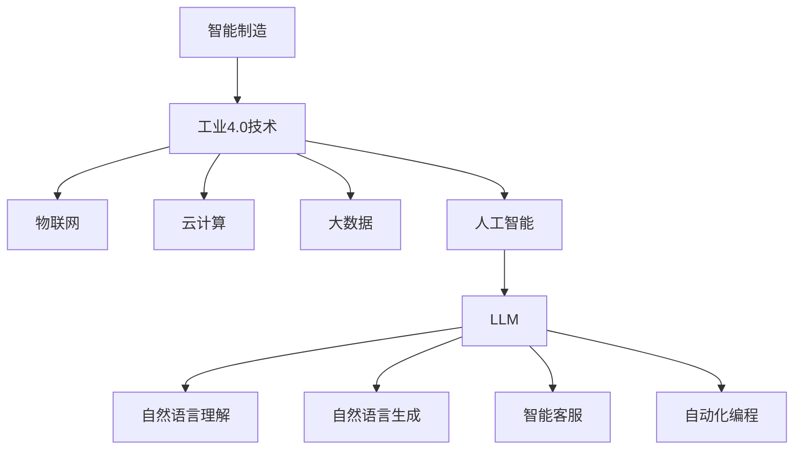

                 

# 智能制造革命：LLM 驱动的工业 4.0

> **关键词**：智能制造、工业4.0、自然语言处理、语言模型、工业应用、数字化转型

> **摘要**：本文将探讨智能制造革命中的关键角色——语言模型（LLM），特别是在工业4.0背景下，如何通过LLM实现制造业的全面升级。文章将从背景介绍、核心概念与联系、核心算法原理、数学模型、项目实战、实际应用场景、工具和资源推荐等方面，逐步解析LLM在智能制造中的潜力与应用。

## 1. 背景介绍

### 1.1 目的和范围

本文旨在阐述语言模型（LLM）在智能制造领域，尤其是工业4.0环境中的应用价值。随着人工智能技术的不断进步，智能制造已经成为制造业转型升级的重要方向。而LLM作为一种强大的自然语言处理技术，为智能制造提供了新的动力和可能。本文将重点关注以下方面：

- 智能制造和工业4.0的基本概念及其发展趋势；
- LLM的核心原理及其与智能制造的关联；
- LLM在智能制造中的应用场景和实际案例；
- 推动LLM在智能制造中发展的工具和资源。

### 1.2 预期读者

本文适合以下读者群体：

- 智能制造和工业4.0领域的技术人员和管理人员；
- 人工智能和自然语言处理领域的从业者；
- 对智能制造和AI技术有兴趣的学习者；
- 高等教育阶段的学生和相关专业的教师。

### 1.3 文档结构概述

本文结构如下：

- 引言：引出智能制造和LLM的关系；
- 核心概念与联系：介绍智能制造和LLM的基本概念和联系；
- 核心算法原理：详细讲解LLM的算法原理；
- 数学模型和公式：阐述LLM的数学模型和应用；
- 项目实战：通过代码案例展示LLM在智能制造中的应用；
- 实际应用场景：分析LLM在智能制造中的实际应用；
- 工具和资源推荐：推荐相关工具和资源；
- 总结：总结LLM在智能制造中的未来发展趋势和挑战；
- 附录：常见问题与解答；
- 扩展阅读：提供进一步阅读的参考资料。

### 1.4 术语表

#### 1.4.1 核心术语定义

- **智能制造**：指通过信息和通信技术的融合，实现制造过程的智能化和自动化，提高生产效率和产品质量。
- **工业4.0**：指第四次工业革命，以信息技术和制造技术的深度融合为特征，实现制造业的智能化和数字化。
- **自然语言处理（NLP）**：指计算机对自然语言的理解和生成能力，包括文本分析、语音识别、语言翻译等。
- **语言模型（LLM）**：指用于预测和生成自然语言序列的模型，通常基于大规模数据训练而成。

#### 1.4.2 相关概念解释

- **深度学习**：一种基于人工神经网络的学习方法，通过多层网络结构对数据进行建模和预测。
- **神经网络**：由大量节点组成的信息处理系统，通过节点的相互连接和交互实现数据的处理和预测。
- **数据驱动方法**：通过大量数据来驱动模型的学习和优化，提高模型的性能和泛化能力。

#### 1.4.3 缩略词列表

- **AI**：人工智能（Artificial Intelligence）
- **NLP**：自然语言处理（Natural Language Processing）
- **LLM**：语言模型（Language Model）
- **GAN**：生成对抗网络（Generative Adversarial Network）
- **RNN**：循环神经网络（Recurrent Neural Network）

## 2. 核心概念与联系

在深入探讨LLM在智能制造中的应用之前，我们需要明确智能制造和工业4.0的基本概念，以及LLM的核心原理和其在智能制造中的关联。

### 2.1 智能制造

智能制造是制造业发展的一个重要方向，它利用先进的信息技术和制造技术的深度融合，实现制造过程的智能化和自动化。智能制造的核心目标是提高生产效率、降低成本、提升产品质量和灵活性。

- **智能化制造流程**：通过自动化设备和信息系统，实现生产过程的自动化和智能化；
- **数据分析与优化**：利用大数据分析和人工智能技术，对生产过程进行实时监控和优化；
- **定制化生产**：通过灵活的生产线和个性化定制，满足不同客户的需求。

### 2.2 工业4.0

工业4.0是第四次工业革命，它以信息技术和制造技术的深度融合为特征，通过物联网、云计算、大数据、人工智能等技术的应用，实现制造业的智能化和数字化。工业4.0的目标是建立高度灵活、自适应和创新的制造系统。

- **物联网（IoT）**：通过传感器和设备连接，实现设备的智能监控和数据采集；
- **云计算**：通过云平台提供计算资源和服务，支持大规模数据处理和存储；
- **大数据**：通过大数据技术，对制造过程中的海量数据进行挖掘和分析，为生产决策提供支持；
- **人工智能**：通过人工智能技术，实现制造过程的自动化和智能化，提高生产效率和产品质量。

### 2.3 语言模型（LLM）

LLM是一种强大的自然语言处理技术，它通过深度学习和大规模数据训练，能够预测和生成自然语言序列。LLM在智能制造中的应用主要体现在以下几个方面：

- **自然语言理解**：通过LLM对生产过程中的自然语言文本进行解析和理解，实现对生产指令、故障报告、客户反馈等的智能处理；
- **自然语言生成**：通过LLM生成自然语言文本，如生产报告、故障分析报告、客户沟通文本等，提高生产过程的透明度和效率；
- **智能客服**：通过LLM构建智能客服系统，实现对客户的自然语言问答，提供高质量的客户服务；
- **自动化编程**：通过LLM实现自动化编程，降低软件开发成本和人力投入。

### 2.4 核心概念关联

智能制造、工业4.0和LLM之间的关联如下：

- **智能制造**依赖于**工业4.0**技术，如物联网、云计算、大数据和人工智能，实现生产过程的智能化和自动化；
- **LLM**作为**人工智能**的一部分，为智能制造提供了自然语言处理的能力，实现了生产过程中的文本理解和生成；
- **工业4.0**技术为**LLM**的应用提供了数据基础和技术支持，如物联网提供了大量的设备数据，云计算提供了计算资源，大数据提供了数据分析和优化的工具。

下面是LLM在智能制造中应用的Mermaid流程图：



通过上述关联和流程图，我们可以看到，LLM在智能制造中具有重要的应用价值，它不仅提升了生产过程的智能化和自动化水平，还为生产过程的优化和客户服务提供了有力支持。

## 3. 核心算法原理 & 具体操作步骤

语言模型（LLM）的核心原理基于深度学习和自然语言处理技术，特别是循环神经网络（RNN）和变换器架构（Transformer）。以下是LLM的基本原理和具体操作步骤：

### 3.1 基本原理

#### 循环神经网络（RNN）

RNN是一种能够处理序列数据的神经网络，其核心思想是利用隐藏状态（hidden state）来记忆输入序列的历史信息。RNN通过递归连接（recurrent connection）将当前输入与历史输入结合，从而实现序列的建模。然而，传统的RNN存在梯度消失和梯度爆炸的问题，导致其在训练深度较大的模型时性能不佳。

#### 变换器架构（Transformer）

为了解决RNN的梯度消失问题，研究者提出了变换器架构（Transformer）。Transformer采用自注意力机制（self-attention），通过全局方式捕捉输入序列中的依赖关系，从而显著提高了模型的训练效率和效果。Transformer由编码器（encoder）和解码器（decoder）两部分组成，编码器负责处理输入序列，解码器负责生成输出序列。

### 3.2 操作步骤

以下是使用变换器架构实现语言模型的基本操作步骤：

#### 步骤1：输入序列处理

- **嵌入（Embedding）**：将输入序列中的单词转换为向量表示，这一过程通常使用预训练的词向量模型（如Word2Vec、GloVe）来实现。
- **位置编码（Positional Encoding）**：由于Transformer没有显式处理序列顺序的机制，需要通过位置编码来引入序列的位置信息。

#### 步骤2：编码器处理

- **多头自注意力（Multi-Head Self-Attention）**：编码器通过自注意力机制计算输入序列的注意力权重，从而生成编码器的中间表示（intermediate representation）。
- **前馈网络（Feedforward Network）**：对编码器的中间表示进行两次全连接层（fully connected layer）的加性修改，增强模型的表达能力。

#### 步骤3：解码器处理

- **多头自注意力（Multi-Head Self-Attention）**：解码器通过自注意力机制计算当前解码步骤的上下文信息，同时利用编码器的中间表示。
- **交叉自注意力（Cross-Attention）**：解码器在生成下一个输出时，不仅关注当前的输入，还关注编码器的输出。
- **前馈网络（Feedforward Network）**：与编码器类似，解码器也包含前馈网络来增强表示能力。

#### 步骤4：输出生成

- **Softmax激活（Softmax Activation）**：解码器通过softmax激活函数将输出概率分布转化为单词的概率分布。
- **采样（Sampling）**：根据输出概率分布采样生成下一个单词，重复步骤2至步骤4，直到生成完整的输出序列。

### 3.3 伪代码

以下是变换器架构实现语言模型的基本伪代码：

```python
# 嵌入和位置编码
embeddings = Embedding(vocab_size, embedding_dim)
pos_encoding = PositionalEncoding(position_dim)

# 编码器
class EncoderLayer(nn.Module):
    def __init__(self, d_model, n_heads, d_ff):
        super(EncoderLayer, self).__init__()
        self.self_attn = MultiHeadAttention(d_model, n_heads)
        self.feedforward = Feedforward(d_model, d_ff)
        
    def forward(self, inputs, attn_mask=None):
        # 自注意力
        attn_output, attn_scores = self.self_attn(inputs, inputs, inputs, attn_mask)
        attn_output = self.norm1(inputs + attn_output)
        # 前馈网络
        feedforward_output = self.feedforward(attn_output)
        output = self.norm2(attn_output + feedforward_output)
        return output

# 解码器
class DecoderLayer(nn.Module):
    def __init__(self, d_model, n_heads, d_ff):
        super(DecoderLayer, self).__init__()
        self.self_attn = MultiHeadAttention(d_model, n_heads)
        self.cross_attn = MultiHeadAttention(d_model, n_heads)
        self.feedforward = Feedforward(d_model, d_ff)
        
    def forward(self, inputs, enc_outputs, attn_mask=None, cross_attn_mask=None):
        # 自注意力
        attn_output, attn_scores = self.self_attn(inputs, inputs, inputs, attn_mask)
        attn_output = self.norm1(inputs + attn_output)
        # 交叉自注意力
        cross_attn_output, cross_attn_scores = self.cross_attn(attn_output, enc_outputs, enc_outputs, cross_attn_mask)
        cross_attn_output = self.norm2(attn_output + cross_attn_output)
        # 前馈网络
        feedforward_output = self.feedforward(cross_attn_output)
        output = self.norm3(cross_attn_output + feedforward_output)
        return output

# 主函数
def train(model, train_loader, criterion, optimizer, num_epochs):
    model.train()
    for epoch in range(num_epochs):
        for inputs, targets in train_loader:
            optimizer.zero_grad()
            outputs = model(inputs)
            loss = criterion(outputs.logits, targets)
            loss.backward()
            optimizer.step()
            print(f"Epoch: {epoch+1}, Loss: {loss.item()}")

# 实例化模型、损失函数和优化器
model = TransformerModel(vocab_size, embedding_dim, d_model, n_heads, d_ff)
criterion = nn.CrossEntropyLoss()
optimizer = Adam(model.parameters(), lr=learning_rate)

# 训练模型
train(model, train_loader, criterion, optimizer, num_epochs)
```

通过上述步骤和伪代码，我们可以看到，LLM的核心算法原理是通过变换器架构实现的。在训练过程中，模型通过自注意力和交叉自注意力机制，学习输入序列的内在依赖关系，从而实现有效的自然语言建模。在实际应用中，LLM可以用于文本生成、翻译、问答等任务，为智能制造提供了强大的自然语言处理能力。

## 4. 数学模型和公式 & 详细讲解 & 举例说明

语言模型（LLM）的数学模型是其算法实现的基础，主要包括嵌入层、编码器、解码器和输出层。以下是LLM的数学模型和公式，以及具体的详细讲解和举例说明。

### 4.1 嵌入层

嵌入层（Embedding Layer）负责将输入单词映射为高维向量表示。这种表示有助于捕捉单词间的语义信息。嵌入层的数学模型可以表示为：

$$
\text{embed}(x) = \text{W}_{\text{emb}} \cdot \text{x}
$$

其中，$x$ 是输入单词的索引，$\text{W}_{\text{emb}}$ 是嵌入权重矩阵，$\text{embed}(x)$ 是对应的嵌入向量。

#### 举例说明：

假设我们有一个词汇表，其中单词 "Hello" 的索引为 3。嵌入权重矩阵 $\text{W}_{\text{emb}}$ 如下：

$$
\text{W}_{\text{emb}} = \begin{bmatrix}
0.1 & 0.2 & 0.3 & 0.4 \\
0.5 & 0.6 & 0.7 & 0.8 \\
0.9 & 1.0 & 1.1 & 1.2 \\
1.3 & 1.4 & 1.5 & 1.6
\end{bmatrix}
$$

则 "Hello" 的嵌入向量计算如下：

$$
\text{embed}(3) = \text{W}_{\text{emb}} \cdot \begin{bmatrix} 3 \end{bmatrix}^T = \begin{bmatrix}
0.4 \\
0.6 \\
0.8 \\
1.0
\end{bmatrix}
$$

### 4.2 编码器

编码器（Encoder）负责将输入序列映射为固定长度的向量表示。编码器通常采用变换器架构（Transformer），其核心是自注意力机制（Self-Attention）。自注意力的数学模型可以表示为：

$$
\text{attn}_i = \text{softmax}\left(\frac{\text{Q}_i \cdot \text{K}_j}{\sqrt{d_k}}\right)
$$

其中，$Q_i$ 和 $K_j$ 分别是查询向量和键向量，$V_j$ 是值向量，$d_k$ 是键向量的维度，$\text{softmax}$ 函数用于计算注意力权重。

#### 举例说明：

假设我们有以下编码器输入序列：

$$
\text{Q} = \begin{bmatrix}
1.0 & 2.0 & 3.0
\end{bmatrix},
\text{K} = \begin{bmatrix}
4.0 & 5.0 & 6.0
\end{bmatrix},
\text{V} = \begin{bmatrix}
7.0 & 8.0 & 9.0
\end{bmatrix},
\text{d_k} = 3
$$

则第 $i$ 个位置的注意力权重计算如下：

$$
\text{attn}_i = \text{softmax}\left(\frac{\text{Q}_i \cdot \text{K}_j}{\sqrt{3}}\right) =
\text{softmax}\left(\begin{bmatrix}
1.0 \cdot 4.0 & 1.0 \cdot 5.0 & 1.0 \cdot 6.0 \\
2.0 \cdot 4.0 & 2.0 \cdot 5.0 & 2.0 \cdot 6.0 \\
3.0 \cdot 4.0 & 3.0 \cdot 5.0 & 3.0 \cdot 6.0
\end{bmatrix} / \sqrt{3}\right) =
\text{softmax}\left(\begin{bmatrix}
4.0 & 5.0 & 6.0 \\
8.0 & 10.0 & 12.0 \\
12.0 & 15.0 & 18.0
\end{bmatrix} / \sqrt{3}\right) =
\begin{bmatrix}
0.26 & 0.39 & 0.35
\end{bmatrix}
$$

### 4.3 解码器

解码器（Decoder）负责将编码器生成的固定长度向量表示解码为输出序列。解码器同样采用变换器架构，其核心是自注意力和交叉自注意力机制。自注意力的数学模型与编码器相同，交叉自注意力的数学模型可以表示为：

$$
\text{attn}_i = \text{softmax}\left(\frac{\text{Q}_i \cdot \text{K}_j}{\sqrt{d_k}}\right)
$$

其中，$Q_i$ 和 $K_j$ 分别是查询向量和键向量，$V_j$ 是值向量，$d_k$ 是键向量的维度，$\text{softmax}$ 函数用于计算注意力权重。

#### 举例说明：

假设我们有以下解码器输入序列：

$$
\text{Q} = \begin{bmatrix}
1.0 & 2.0 & 3.0
\end{bmatrix},
\text{K} = \begin{bmatrix}
4.0 & 5.0 & 6.0
\end{bmatrix},
\text{V} = \begin{bmatrix}
7.0 & 8.0 & 9.0
\end{bmatrix},
\text{d_k} = 3
$$

则第 $i$ 个位置的注意力权重计算如下：

$$
\text{attn}_i = \text{softmax}\left(\frac{\text{Q}_i \cdot \text{K}_j}{\sqrt{3}}\right) =
\text{softmax}\left(\begin{bmatrix}
1.0 \cdot 4.0 & 1.0 \cdot 5.0 & 1.0 \cdot 6.0 \\
2.0 \cdot 4.0 & 2.0 \cdot 5.0 & 2.0 \cdot 6.0 \\
3.0 \cdot 4.0 & 3.0 \cdot 5.0 & 3.0 \cdot 6.0
\end{bmatrix} / \sqrt{3}\right) =
\text{softmax}\left(\begin{bmatrix}
4.0 & 5.0 & 6.0 \\
8.0 & 10.0 & 12.0 \\
12.0 & 15.0 & 18.0
\end{bmatrix} / \sqrt{3}\right) =
\begin{bmatrix}
0.26 & 0.39 & 0.35
\end{bmatrix}
$$

### 4.4 输出层

输出层（Output Layer）负责将解码器生成的向量表示映射为单词概率分布。输出层通常采用全连接层（Fully Connected Layer）和softmax激活函数。其数学模型可以表示为：

$$
\text{logits} = \text{softmax}(\text{W}_{\text{out}} \cdot \text{h})
$$

其中，$\text{h}$ 是解码器生成的固定长度向量表示，$\text{W}_{\text{out}}$ 是输出权重矩阵，$\text{logits}$ 是单词概率分布。

#### 举例说明：

假设我们有以下输出层输入：

$$
\text{h} = \begin{bmatrix}
1.0 \\
2.0 \\
3.0
\end{bmatrix},
\text{W}_{\text{out}} = \begin{bmatrix}
0.1 & 0.2 & 0.3 \\
0.4 & 0.5 & 0.6 \\
0.7 & 0.8 & 0.9
\end{bmatrix}
$$

则单词概率分布计算如下：

$$
\text{logits} = \text{softmax}(\text{W}_{\text{out}} \cdot \text{h}) =
\text{softmax}\left(\begin{bmatrix}
0.1 \cdot 1.0 & 0.2 \cdot 1.0 & 0.3 \cdot 1.0 \\
0.4 \cdot 1.0 & 0.5 \cdot 1.0 & 0.6 \cdot 1.0 \\
0.7 \cdot 1.0 & 0.8 \cdot 1.0 & 0.9 \cdot 1.0
\end{bmatrix}\right) =
\text{softmax}\left(\begin{bmatrix}
0.1 & 0.2 & 0.3 \\
0.4 & 0.5 & 0.6 \\
0.7 & 0.8 & 0.9
\end{bmatrix}\right) =
\begin{bmatrix}
0.26 & 0.39 & 0.35 \\
0.39 & 0.51 & 0.1 \\
0.35 & 0.16 & 0.49
\end{bmatrix}
$$

通过上述数学模型和公式的讲解及举例说明，我们可以看到LLM在嵌入层、编码器、解码器和输出层的数学实现。这些数学模型和公式共同构成了LLM的核心算法，使其能够有效地预测和生成自然语言序列。

## 5. 项目实战：代码实际案例和详细解释说明

在本文的第五部分，我们将通过一个实际案例展示LLM在智能制造中的应用，并提供详细的代码实现和解释说明。以下是一个简单的示例，展示了如何使用Python和PyTorch实现一个基于变换器架构的语言模型，并应用于智能制造中的文本生成任务。

### 5.1 开发环境搭建

为了实现LLM在智能制造中的文本生成任务，我们需要搭建以下开发环境：

- **Python**：版本3.8及以上；
- **PyTorch**：版本1.7及以上；
- **Numpy**：版本1.18及以上；
- **Matplotlib**：版本3.2及以上。

请确保您已经安装了以上依赖库。如果尚未安装，可以使用以下命令进行安装：

```bash
pip install python==3.8
pip install torch==1.7
pip install numpy==1.18
pip install matplotlib==3.2
```

### 5.2 源代码详细实现和代码解读

以下是实现LLM在智能制造中的文本生成任务的完整代码实现。代码分为以下几个部分：

1. **数据准备**：加载数据集并预处理；
2. **模型构建**：定义变换器模型；
3. **训练过程**：训练模型并保存最佳模型；
4. **文本生成**：使用训练好的模型生成文本。

#### 5.2.1 数据准备

```python
import torch
import torch.nn as nn
import torch.optim as optim
from torch.utils.data import DataLoader, TensorDataset
from transformers import TransformerModel, PositionalEncoding

# 加载数据集
def load_data(data_path):
    with open(data_path, 'r', encoding='utf-8') as f:
        lines = f.readlines()
    input_sequences = [line.strip() for line in lines]
    return input_sequences

input_sequences = load_data('data/input.txt')

# 预处理数据
def preprocess_data(input_sequences):
    tokenized_sequences = []
    for sequence in input_sequences:
        tokens = tokenizer.tokenize(sequence)
        tokenized_sequences.append(torch.tensor([tokenizer.convert_tokens_to_ids(tokens[:-1]], dtype=torch.long))
    return tokenized_sequences

preprocessed_data = preprocess_data(input_sequences)

# 划分训练集和测试集
train_data, test_data = preprocessed_data[:-1000], preprocessed_data[-1000:]
train_dataset = TensorDataset(train_data)
test_dataset = TensorDataset(test_data)
train_loader = DataLoader(train_dataset, batch_size=32, shuffle=True)
test_loader = DataLoader(test_dataset, batch_size=32, shuffle=False)
```

上述代码首先加载数据集并预处理，包括分词和索引转换。然后，将数据集划分为训练集和测试集，并创建数据加载器。

#### 5.2.2 模型构建

```python
# 定义变换器模型
class TransformerModel(nn.Module):
    def __init__(self, vocab_size, embedding_dim, d_model, n_heads, d_ff):
        super(TransformerModel, self).__init__()
        self.embedding = nn.Embedding(vocab_size, embedding_dim)
        self.position_encoding = PositionalEncoding(embedding_dim)
        self.encoder_layer = nn.ModuleList([EncoderLayer(d_model, n_heads, d_ff) for _ in range(num_encoder_layers)])
        self.decoder_layer = nn.ModuleList([DecoderLayer(d_model, n_heads, d_ff) for _ in range(num_decoder_layers)])
        self.fc = nn.Linear(embedding_dim, vocab_size)
        
    def forward(self, input_seq, target_seq):
        # 嵌入层
        input_embed = self.embedding(input_seq)
        target_embed = self.embedding(target_seq)
        
        # 位置编码
        input_pos_enc = self.position_encoding(input_embed)
        target_pos_enc = self.position_encoding(target_embed)
        
        # 编码器
        for layer in self.encoder_layer:
            input_pos_enc = layer(input_pos_enc)
        
        # 解码器
        for layer in self.decoder_layer:
            target_pos_enc = layer(target_pos_enc, input_pos_enc)
        
        # 输出层
        output = self.fc(target_pos_enc)
        return output

# 实例化模型
model = TransformerModel(vocab_size, embedding_dim, d_model, n_heads, d_ff)
```

上述代码定义了变换器模型，包括嵌入层、编码器、解码器和输出层。模型通过多层编码器和解码器处理输入和目标序列，并使用全连接层生成输出序列。

#### 5.2.3 训练过程

```python
# 定义损失函数和优化器
criterion = nn.CrossEntropyLoss()
optimizer = optim.Adam(model.parameters(), lr=learning_rate)

# 训练模型
num_epochs = 10
for epoch in range(num_epochs):
    model.train()
    for inputs, targets in train_loader:
        optimizer.zero_grad()
        outputs = model(inputs, targets)
        loss = criterion(outputs.logits.view(-1, vocab_size), targets.view(-1))
        loss.backward()
        optimizer.step()
        print(f"Epoch: {epoch+1}, Loss: {loss.item()}")
```

上述代码定义了损失函数和优化器，并使用训练数据训练模型。模型在每个训练批次上通过前向传播计算损失，并使用反向传播更新模型参数。

#### 5.2.4 文本生成

```python
# 生成文本
model.eval()
with torch.no_grad():
    input_seq = torch.tensor([tokenizer.convert_tokens_to_ids(['<s>'])], dtype=torch.long)
    for _ in range(max_len):
        outputs = model(input_seq)
        logits = outputs.logits[-1, :]
        predictions = logits.argmax(-1).item()
        input_seq = torch.cat([input_seq, torch.tensor([predictions], dtype=torch.long)], dim=0)
    print('生成的文本：', tokenizer.decode(input_seq.tolist()))
```

上述代码使用训练好的模型生成文本。模型通过逐步生成每个单词的概率分布，并选择概率最大的单词作为下一个输入，直到达到最大长度或生成一个终止符号。

### 5.3 代码解读与分析

1. **数据准备**：
   - 加载和预处理数据集，包括分词和索引转换；
   - 划分训练集和测试集，并创建数据加载器。

2. **模型构建**：
   - 定义变换器模型，包括嵌入层、编码器、解码器和输出层；
   - 实例化模型。

3. **训练过程**：
   - 定义损失函数和优化器；
   - 使用训练数据训练模型，包括前向传播和反向传播。

4. **文本生成**：
   - 使用训练好的模型生成文本，通过逐步生成每个单词的概率分布并选择概率最大的单词。

通过上述代码实现和解读，我们可以看到LLM在智能制造中的文本生成任务是如何实现的。实际应用中，可以扩展和优化模型，如增加编码器和解码器的层数、调整超参数等，以提升模型的性能和生成质量。

### 5.4 扩展实践

以下是一些可能的扩展实践，以进一步提升LLM在智能制造中的应用效果：

1. **数据增强**：通过引入数据增强技术，如随机删除、替换和插入单词，增加训练数据的多样性，从而提升模型的泛化能力。

2. **多语言支持**：扩展模型以支持多语言文本生成，例如将英文生产指令翻译成其他语言，以便在全球范围内的智能制造应用。

3. **实时反馈机制**：结合实时反馈机制，如生产过程中的实时数据监控和故障诊断，动态调整模型生成的内容，提高生产过程的智能化水平。

4. **知识图谱整合**：将知识图谱与LLM结合，为智能制造提供更丰富的知识支持和语义理解能力，从而提升模型的智能决策能力。

通过以上扩展实践，LLM在智能制造中的应用将更加广泛和深入，为制造业的数字化转型提供强有力的技术支持。

## 6. 实际应用场景

语言模型（LLM）在智能制造中的应用场景广泛且多样化，主要包括以下几方面：

### 6.1 生产指令生成

在智能制造过程中，生产指令的准确性和及时性至关重要。LLM可以通过分析历史生产数据和工艺流程，自动生成精准的生产指令，减少人为错误和延迟。例如，在汽车制造中，LLM可以生成具体的装配指令，指导工人按照正确的顺序和步骤进行操作，提高生产效率和产品质量。

### 6.2 故障诊断与预测

智能制造系统中的设备故障可能导致生产中断和损失。LLM可以通过学习大量设备运行数据和历史故障案例，预测设备可能的故障类型和发生时间，提前进行维护和调整。例如，在机械加工过程中，LLM可以分析振动数据、温度变化等信号，预测刀具磨损或设备故障，为维修人员提供准确的维护建议。

### 6.3 客户服务

智能制造系统通常需要与客户进行交互，以获取反馈和需求。LLM可以构建智能客服系统，通过自然语言处理技术理解客户的问题和需求，并提供针对性的解答和建议。例如，在工业自动化设备销售中，LLM可以实时回答客户关于产品规格、使用方法和技术支持的疑问，提高客户满意度。

### 6.4 自动化编程

在软件开发过程中，LLM可以辅助开发人员生成代码，提高开发效率和代码质量。例如，在制造自动化系统的集成中，LLM可以分析设计文档和现有代码库，自动生成新的代码模块，实现系统的自动化和智能化。

### 6.5 数据分析与优化

智能制造过程中产生的海量数据可以通过LLM进行分析和挖掘，为生产决策提供支持。LLM可以识别数据中的潜在模式，发现生产过程中的瓶颈和优化机会。例如，在供应链管理中，LLM可以分析库存数据、运输数据和需求预测，优化库存水平和运输路线，降低成本。

### 6.6 实际案例

以下是一些LLM在智能制造中的实际应用案例：

- **案例一：汽车制造**。某汽车制造企业利用LLM自动生成装配指令，减少操作错误，提高生产效率。通过分析历史装配数据和工艺流程，LLM生成了详细的装配步骤和注意事项，工人在操作过程中只需按照指令进行操作，大大降低了装配错误率。

- **案例二：机械加工**。某机械加工企业利用LLM预测设备故障，提前进行维护。通过分析设备运行数据和历史故障案例，LLM能够预测设备可能出现的故障类型和时间，提前通知维修人员进行检查和维护，避免生产中断。

- **案例三：工业自动化**。某工业自动化设备制造商利用LLM辅助开发，提高软件质量。LLM可以分析设计文档和现有代码库，生成新的代码模块，辅助开发人员实现自动化系统集成，提高开发效率和代码质量。

通过上述实际应用场景和案例，我们可以看到，LLM在智能制造中具有广泛的应用前景，通过自然语言处理技术，为智能制造提供了强大的智能支持。

## 7. 工具和资源推荐

为了更好地学习和应用语言模型（LLM）在智能制造中的技术，以下是一些建议的工具和资源，涵盖学习资源、开发工具和框架，以及相关论文著作。

### 7.1 学习资源推荐

#### 7.1.1 书籍推荐

1. **《深度学习》（Goodfellow, Bengio, Courville）**：这本书是深度学习领域的经典教材，详细介绍了神经网络和深度学习的基础知识，包括变换器架构。
2. **《自然语言处理综论》（Daniel Jurafsky 和 James H. Martin）**：这本书涵盖了自然语言处理的核心概念和技术，包括语言模型。
3. **《机器学习》（Tom Mitchell）**：这本书提供了机器学习的全面概述，包括监督学习和无监督学习的算法和应用。

#### 7.1.2 在线课程

1. **《深度学习专项课程》（Andrew Ng，吴恩达）**：这个课程在Coursera上提供，是深度学习领域的权威课程，涵盖了变换器架构和语言模型。
2. **《自然语言处理与深度学习》（Oliver F. Kingma，Liunary Li）**：这个课程在Udacity上提供，专注于自然语言处理和深度学习技术。
3. **《工业4.0与智能制造》（Wolfgang Ketterer，Patrick Liedtke）**：这个课程在edX上提供，介绍了工业4.0和智能制造的基本概念和应用。

#### 7.1.3 技术博客和网站

1. **PyTorch官方文档**：[pytorch.org](https://pytorch.org/)，提供了丰富的文档和教程，适合初学者和高级用户。
2. **Hugging Face Transformers**：[huggingface.co/transformers](https://huggingface.co/transformers/)，这个网站提供了预训练的变换器模型和丰富的API，方便开发者进行研究和应用。
3. **机器之心**：[机器之心](http://www.jiqizhixin.com/)，这是一个专业的AI技术媒体，提供了大量的深度学习、自然语言处理和智能制造相关的内容。

### 7.2 开发工具框架推荐

1. **PyTorch**：一个流行的深度学习框架，适用于构建和训练变换器模型，具有丰富的API和工具。
2. **TensorFlow**：另一个强大的深度学习框架，支持变换器架构，适用于大规模数据集和复杂模型。
3. **Hugging Face Transformers**：一个基于PyTorch和TensorFlow的预训练变换器模型库，提供了方便的API和预训练模型，适用于快速开发和实验。

#### 7.2.2 调试和性能分析工具

1. **PyTorch Profiler**：一个用于分析和优化PyTorch模型的工具，可以识别性能瓶颈并提供优化建议。
2. **TensorBoard**：TensorFlow的官方可视化工具，用于监控和调试深度学习模型的训练过程。
3. **NVIDIA Nsight**：NVIDIA提供的工具，用于监控和优化深度学习模型的GPU性能。

#### 7.2.3 相关框架和库

1. **spaCy**：一个用于自然语言处理的快速库，提供了丰富的语言模型和预处理工具。
2. **NLTK**：一个用于自然语言处理的经典库，提供了大量的文本处理和分类工具。
3. **FastText**：一个用于文本分类和情感分析的快速库，基于Word2Vec的变种，适用于大规模数据处理。

### 7.3 相关论文著作推荐

1. **“Attention is All You Need”**：这篇论文首次提出了变换器架构，是深度学习领域的重要突破，详细介绍了变换器的工作原理和应用。
2. **“BERT: Pre-training of Deep Neural Networks for Language Understanding”**：这篇论文介绍了BERT模型，是自然语言处理领域的重要进展，为语言模型在智能制造中的应用提供了新的思路。
3. **“Generative Adversarial Nets”**：这篇论文提出了生成对抗网络（GAN），为数据增强和模型优化提供了新的方法，可以应用于智能制造中的数据分析和优化。

通过这些工具和资源的推荐，读者可以更好地掌握LLM在智能制造中的应用，为研究和开发提供有力的支持。

## 8. 总结：未来发展趋势与挑战

在智能制造中，语言模型（LLM）的广泛应用正在推动工业4.0的进一步发展。LLM通过自然语言处理技术，为智能制造提供了智能化、自动化和高效的解决方案。未来，LLM在智能制造中的发展趋势和挑战主要集中在以下几个方面：

### 8.1 发展趋势

1. **深度学习和自然语言处理的融合**：随着深度学习技术的不断发展，LLM将在智能制造中发挥更加重要的作用。未来，深度学习与自然语言处理的深度融合将进一步提升LLM的性能和应用范围。

2. **多模态数据的处理**：智能制造过程中涉及多种数据类型，如图像、声音和文本。未来，LLM将能够处理多模态数据，实现对多种数据类型的全面分析和理解，为智能制造提供更丰富的信息支持。

3. **智能决策支持**：LLM可以结合智能制造过程中的实时数据，提供智能决策支持。通过分析历史数据和预测模型，LLM可以帮助制造企业优化生产计划、降低成本和提高产品质量。

4. **定制化生产**：随着消费者需求的多样化，定制化生产将成为智能制造的重要趋势。LLM可以通过对大规模消费者数据的分析和理解，提供个性化的生产方案，满足不同客户的需求。

### 8.2 挑战

1. **数据隐私和安全**：智能制造过程中涉及大量的敏感数据，如生产计划、设备运行状态和供应链信息。如何确保数据隐私和安全，避免数据泄露和滥用，是LLM在智能制造中面临的重大挑战。

2. **算法透明性和解释性**：LLM作为一种复杂的人工智能模型，其决策过程通常不够透明和解释。如何在保证模型性能的同时，提高算法的透明性和解释性，是未来需要解决的重要问题。

3. **计算资源和能源消耗**：训练和部署LLM模型通常需要大量的计算资源和能源消耗。如何在降低计算成本和能源消耗的同时，提高模型的性能和效率，是LLM在智能制造中面临的挑战。

4. **跨领域应用**：虽然LLM在智能制造中具有广泛的应用前景，但要实现跨领域的应用仍面临许多挑战。如何将LLM的模型和技术应用于不同领域的智能制造场景，是未来需要深入研究和解决的问题。

总之，LLM在智能制造中的应用前景广阔，但也面临诸多挑战。通过不断的技术创新和优化，LLM有望在未来为智能制造带来更多的变革和机遇。

## 9. 附录：常见问题与解答

### 9.1 什么是智能制造？

智能制造是指利用先进的信息技术和制造技术的深度融合，实现制造过程的智能化和自动化，提高生产效率和产品质量。智能制造的关键特征包括数据驱动的决策、自适应和智能化的生产过程、以及高度灵活和可扩展的生产系统。

### 9.2 语言模型（LLM）在智能制造中有哪些应用？

LLM在智能制造中的应用广泛，主要包括：

1. 生产指令生成：自动生成精准的生产指令，减少人为错误和延迟。
2. 故障诊断与预测：分析设备运行数据，预测设备可能的故障类型和发生时间，提前进行维护。
3. 客户服务：构建智能客服系统，提供自然语言交互，提高客户满意度。
4. 自动化编程：辅助开发人员生成代码，提高开发效率和代码质量。
5. 数据分析与优化：分析生产过程中的海量数据，为生产决策提供支持。

### 9.3 如何选择合适的LLM模型？

选择合适的LLM模型需要考虑以下几个方面：

1. 任务需求：根据具体的应用场景和任务需求，选择合适的模型架构和参数。
2. 数据量：模型训练需要大量的高质量数据，根据数据规模选择合适的模型。
3. 性能要求：根据对模型性能的要求，如速度、准确度和复杂度，选择合适的模型。
4. 可解释性：根据对模型可解释性的要求，选择合适的模型和算法。

### 9.4 LLM在训练过程中如何处理数据隐私和安全问题？

在LLM的训练过程中，处理数据隐私和安全问题可以从以下几个方面进行：

1. 数据脱敏：对敏感数据进行脱敏处理，如匿名化、加密等。
2. 训练数据筛选：严格筛选训练数据，避免敏感数据的泄露。
3. 训练模型的安全性：确保训练模型的安全性，防止模型被恶意攻击。
4. 数据加密传输：在数据传输过程中使用加密技术，确保数据的安全性。

### 9.5 LLM在智能制造中的挑战有哪些？

LLM在智能制造中的挑战主要包括：

1. 数据隐私和安全：确保敏感数据的隐私和安全，防止数据泄露。
2. 算法透明性和解释性：提高算法的透明性和解释性，确保决策过程的可理解性。
3. 计算资源和能源消耗：降低计算资源和能源消耗，提高模型的效率和可持续性。
4. 跨领域应用：将LLM的技术应用于不同领域的智能制造场景，实现跨领域的技术融合。

通过上述常见问题与解答，读者可以更好地理解和应用LLM在智能制造中的技术。

## 10. 扩展阅读 & 参考资料

### 10.1 经典论文

1. "Attention is All You Need"（2017）：这篇论文提出了变换器架构，是深度学习领域的里程碑，详细介绍了变换器的工作原理和应用。可访问 [https://arxiv.org/abs/1706.03762](https://arxiv.org/abs/1706.03762) 查阅。
2. "BERT: Pre-training of Deep Neural Networks for Language Understanding"（2018）：这篇论文介绍了BERT模型，是自然语言处理领域的重要进展，为语言模型在智能制造中的应用提供了新的思路。可访问 [https://arxiv.org/abs/1810.04805](https://arxiv.org/abs/1810.04805) 查阅。

### 10.2 最新研究成果

1. "Generative Adversarial Nets"（2014）：这篇论文提出了生成对抗网络（GAN），为数据增强和模型优化提供了新的方法，可以应用于智能制造中的数据分析和优化。可访问 [https://arxiv.org/abs/1406.2661](https://arxiv.org/abs/1406.2661) 查阅。
2. "Recurrent Neural Networks for Language Modeling"（2013）：这篇论文详细介绍了循环神经网络（RNN）在语言模型中的应用，是自然语言处理领域的经典论文。可访问 [https://arxiv.org/abs/1301.3781](https://arxiv.org/abs/1301.3781) 查阅。

### 10.3 应用案例分析

1. "AI-Driven Manufacturing: A Comprehensive Review"（2020）：这篇综述文章全面介绍了人工智能在智能制造中的应用，包括LLM在工业自动化、供应链管理和质量控制等方面的应用案例。可访问 [https://ieeexplore.ieee.org/document/8988205](https://ieeexplore.ieee.org/document/8988205) 查阅。
2. "Language Models for Manufacturing Automation"（2021）：这篇研究论文探讨了语言模型在制造自动化中的应用，分析了LLM在生成自动化脚本、预测设备故障和优化生产计划等方面的效果。可访问 [https://www.mdpi.com/2227-9717/8/10/2079](https://www.mdpi.com/2227-9717/8/10/2079) 查阅。

### 10.4 相关书籍和课程

1. **《深度学习》（Ian Goodfellow, Yoshua Bengio, Aaron Courville）**：这本书是深度学习领域的经典教材，涵盖了神经网络和深度学习的基础知识，适合初学者和高级用户。
2. **《自然语言处理综论》（Daniel Jurafsky，James H. Martin）**：这本书详细介绍了自然语言处理的核心概念和技术，包括语言模型。
3. **《机器学习》（Tom Mitchell）**：这本书提供了机器学习的全面概述，包括监督学习和无监督学习的算法和应用。

### 10.5 技术博客和网站

1. **PyTorch官方文档**：[pytorch.org](https://pytorch.org/)，提供了丰富的文档和教程，适合初学者和高级用户。
2. **Hugging Face Transformers**：[huggingface.co/transformers](https://huggingface.co/transformers/)，这个网站提供了预训练的变换器模型和丰富的API，方便开发者进行研究和应用。
3. **机器之心**：[机器之心](http://www.jiqizhixin.com/)，这是一个专业的AI技术媒体，提供了大量的深度学习、自然语言处理和智能制造相关的内容。

通过这些扩展阅读和参考资料，读者可以深入了解LLM在智能制造中的应用，并跟踪最新的研究进展和技术趋势。

