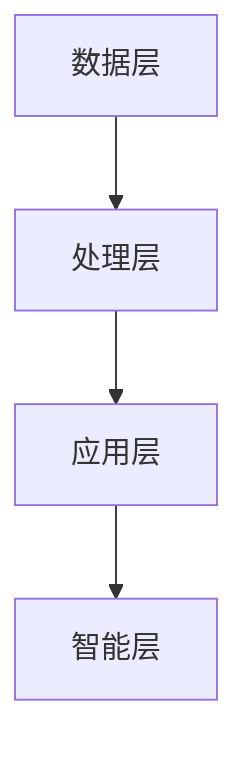

                 

# 智能办公室管理系统：提高工作效率的全能助手

> **关键词：** 智能办公、工作效率、管理系统、自动化、数据分析
>
> **摘要：** 本文将深入探讨智能办公室管理系统的设计与应用，旨在通过自动化、数据分析等技术手段，提升办公室的工作效率，优化办公体验。文章将逐步介绍智能办公室管理系统的核心概念、原理、数学模型、实战案例，并推荐相关学习资源和开发工具。

## 1. 背景介绍

### 1.1 目的和范围

本文旨在探讨智能办公室管理系统（Smart Office Management System，SOMS）的设计与应用。随着科技的飞速发展，人工智能、大数据分析等技术日益成熟，传统办公室管理模式面临巨大挑战。智能办公室管理系统作为一种创新解决方案，旨在提高工作效率，优化办公体验，减少人力成本。

本文将涵盖以下内容：

- 智能办公室管理系统的核心概念与架构
- 核心算法原理与具体操作步骤
- 数学模型与公式及其应用
- 项目实战：代码实际案例与详细解释
- 实际应用场景与工具推荐

通过本文的介绍，读者将能够全面了解智能办公室管理系统的优势与价值，掌握其设计与实现方法。

### 1.2 预期读者

本文适用于以下读者：

- 计算机科学与技术专业学生
- 软件开发工程师
- 办公室管理人员
- 对智能办公技术感兴趣的读者

本文内容涉及计算机编程、数据分析、人工智能等领域，具有一定的技术深度。建议读者具备以下基础：

- 掌握基本的数据结构与算法
- 了解Python、Java等编程语言
- 对人工智能和大数据分析有一定了解

### 1.3 文档结构概述

本文分为十个部分，结构如下：

1. 背景介绍
    - 目的和范围
    - 预期读者
    - 文档结构概述
    - 术语表
2. 核心概念与联系
    - 智能办公室管理系统概述
    - 关键技术分析
3. 核心算法原理 & 具体操作步骤
    - 数据预处理
    - 特征提取
    - 模型训练
4. 数学模型和公式 & 详细讲解 & 举例说明
    - 相关数学公式
    - 应用实例
5. 项目实战：代码实际案例和详细解释说明
    - 开发环境搭建
    - 源代码详细实现
    - 代码解读与分析
6. 实际应用场景
    - 日常办公
    - 企业管理
    - 项目协作
7. 工具和资源推荐
    - 学习资源
    - 开发工具框架
    - 相关论文著作
8. 总结：未来发展趋势与挑战
9. 附录：常见问题与解答
10. 扩展阅读 & 参考资料

### 1.4 术语表

#### 1.4.1 核心术语定义

- **智能办公室管理系统（SOMS）**：一种利用人工智能、大数据分析等技术，实现办公室自动化管理、提高工作效率的系统。
- **自动化**：通过计算机程序、硬件设备等手段，实现办公流程的自动化，减少人工干预。
- **数据分析**：对办公数据进行分析和处理，发现潜在价值，为决策提供依据。
- **机器学习**：一种人工智能技术，通过数据训练模型，实现数据的自动分析和预测。

#### 1.4.2 相关概念解释

- **自然语言处理（NLP）**：一种人工智能技术，用于处理和理解人类语言。
- **深度学习**：一种神经网络模型，通过多层神经网络实现复杂的数据分析和预测。
- **数据挖掘**：一种数据分析技术，从大量数据中发现隐藏的模式和知识。

#### 1.4.3 缩略词列表

- **AI**：人工智能（Artificial Intelligence）
- **SOMS**：智能办公室管理系统（Smart Office Management System）
- **NLP**：自然语言处理（Natural Language Processing）
- **DL**：深度学习（Deep Learning）
- **DM**：数据挖掘（Data Mining）

## 2. 核心概念与联系

智能办公室管理系统（SOMS）的核心概念包括自动化、数据分析、人工智能等。这些技术相互联系，共同构建了一个高效、智能的办公环境。

### 2.1 智能办公室管理系统概述

智能办公室管理系统是一种综合应用，通过自动化、数据分析等技术，实现办公室的智能化管理。其主要功能包括：

- **日程安排**：自动安排会议、任务和日程，提高工作效率。
- **邮件管理**：自动分类、筛选邮件，减少人工处理时间。
- **文档管理**：自动整理、归档文档，提高文档查找效率。
- **人力资源**：自动处理员工信息、考勤、薪酬等事务。

### 2.2 关键技术分析

智能办公室管理系统的关键技术包括：

- **自动化技术**：通过计算机程序、硬件设备等实现办公流程的自动化。
- **数据分析技术**：对办公数据进行分析和处理，发现潜在价值。
- **人工智能技术**：利用机器学习、深度学习等技术，实现智能决策和预测。

### 2.3 架构分析

智能办公室管理系统的架构通常包括以下层次：

- **数据层**：收集、存储各种办公数据，如日程安排、邮件、文档等。
- **处理层**：对数据进行处理和分析，如自动化任务调度、邮件分类、文档整理等。
- **应用层**：提供用户界面，展示处理结果，供用户进行操作和查询。
- **智能层**：利用人工智能技术，实现智能决策和预测，如日程安排优化、邮件优先级排序等。

### 2.4 Mermaid 流程图



## 3. 核心算法原理 & 具体操作步骤

智能办公室管理系统的核心算法主要包括数据预处理、特征提取、模型训练等步骤。以下将详细阐述这些算法的原理和操作步骤。

### 3.1 数据预处理

数据预处理是智能办公室管理系统的第一步，其主要任务是清理和整理原始数据，使其适合后续处理。

#### 3.1.1 原理

数据预处理主要包括以下任务：

- **数据清洗**：去除重复、错误和缺失的数据。
- **数据归一化**：将不同尺度的数据进行归一化处理，使其在相同尺度上进行比较。
- **数据转换**：将非数值型的数据进行编码或转换为数值型数据。

#### 3.1.2 操作步骤

1. **数据清洗**：

   - 删除重复数据；
   - 填充缺失数据；
   - 删除错误数据。

2. **数据归一化**：

   - 使用均值归一化或标准差归一化方法；
   - 将数据转换为 [0,1] 范围内的数值。

3. **数据转换**：

   - 使用独热编码或标签编码将非数值型数据进行编码；
   - 使用独热编码将类别型数据进行转换。

### 3.2 特征提取

特征提取是从原始数据中提取出对任务有帮助的特征，以提高模型的性能。

#### 3.2.1 原理

特征提取的主要任务是：

- **降维**：将高维数据降维至低维，减少计算复杂度；
- **特征选择**：选择对任务有帮助的特征，去除无关或冗余的特征。

#### 3.2.2 操作步骤

1. **降维**：

   - 使用主成分分析（PCA）等算法进行降维；
   - 选择最重要的主成分。

2. **特征选择**：

   - 使用信息增益、互信息等指标进行特征选择；
   - 去除不重要或冗余的特征。

### 3.3 模型训练

模型训练是智能办公室管理系统的核心步骤，其目的是通过训练数据，训练出能够进行预测或分类的模型。

#### 3.3.1 原理

模型训练的主要任务是：

- **数据划分**：将数据划分为训练集和测试集；
- **模型选择**：选择合适的模型进行训练；
- **模型训练**：使用训练数据进行模型训练；
- **模型评估**：使用测试数据进行模型评估。

#### 3.3.2 操作步骤

1. **数据划分**：

   - 将数据划分为训练集和测试集，比例一般为 8:2 或 7:3。

2. **模型选择**：

   - 根据任务需求选择合适的模型，如线性回归、决策树、支持向量机等。

3. **模型训练**：

   - 使用训练集数据训练模型；
   - 调整模型参数，如学习率、迭代次数等。

4. **模型评估**：

   - 使用测试集数据评估模型性能；
   - 根据评估结果调整模型参数。

### 3.4 伪代码

```python
# 数据预处理
def preprocess_data(data):
    # 数据清洗
    data = clean_data(data)
    # 数据归一化
    data = normalize_data(data)
    # 数据转换
    data = convert_data(data)
    return data

# 特征提取
def extract_features(data):
    # 降维
    data = reduce_dimension(data)
    # 特征选择
    data = select_features(data)
    return data

# 模型训练
def train_model(data, model):
    # 数据划分
    train_data, test_data = split_data(data)
    # 模型训练
    model = train_model(train_data, model)
    # 模型评估
    evaluate_model(test_data, model)
    return model
```

## 4. 数学模型和公式 & 详细讲解 & 举例说明

在智能办公室管理系统中，数学模型和公式起到了关键作用，它们帮助我们分析和处理数据，提取特征，以及评估模型的性能。以下将介绍一些常用的数学模型和公式，并对其进行详细讲解和举例说明。

### 4.1 相关数学公式

在智能办公室管理系统中，以下数学公式经常被使用：

- **归一化公式**：
  $$x_{\text{norm}} = \frac{x - \mu}{\sigma}$$
  其中，$x$ 是原始数据，$\mu$ 是均值，$\sigma$ 是标准差。

- **主成分分析（PCA）公式**：
  $$z_i = \sum_{j=1}^{p} \lambda_j \cdot c_{ij}$$
  其中，$z_i$ 是主成分，$\lambda_j$ 是特征值，$c_{ij}$ 是协方差矩阵的特征向量。

- **信息增益（IG）公式**：
  $$IG(D, A) = H(D) - H(D|A)$$
  其中，$D$ 是数据集，$A$ 是特征，$H(D)$ 是数据集的熵，$H(D|A)$ 是条件熵。

- **支持向量机（SVM）公式**：
  $$w \cdot x + b = 0$$
  其中，$w$ 是权重向量，$x$ 是特征向量，$b$ 是偏置。

### 4.2 详细讲解

#### 4.2.1 归一化公式

归一化公式用于将数据转换为相同的尺度，使其在相同尺度上进行比较。在智能办公室管理系统中，归一化可以帮助我们消除不同特征之间的量纲差异，提高模型的性能。

- **均值**：数据的平均值。
- **标准差**：数据的标准差。

归一化公式通过计算每个数据点的均值和标准差，将数据转换为 [0,1] 范围内的数值。

#### 4.2.2 主成分分析（PCA）公式

主成分分析（PCA）是一种常用的降维技术，它通过线性变换将原始数据映射到新的坐标系中，使得新的坐标轴（主成分）能够最大程度地保留原始数据的方差。

- **特征值**：协方差矩阵的特征值。
- **特征向量**：协方差矩阵的特征向量。

PCA 公式通过计算协方差矩阵的特征值和特征向量，将数据投影到新的坐标轴上。

#### 4.2.3 信息增益（IG）公式

信息增益（IG）是一种特征选择方法，它通过计算特征对数据集的熵差来评估特征的重要性。

- **熵**：数据集的熵，表示数据集的不确定性。
- **条件熵**：给定特征后的熵，表示特征对数据集不确定性的消除程度。

信息增益公式通过计算信息增益，选择对数据集有最大信息增益的特征。

#### 4.2.4 支持向量机（SVM）公式

支持向量机（SVM）是一种常用的分类算法，它通过找到一个最佳的超平面，将不同类别的数据点分开。

- **权重向量**：超平面的权重向量。
- **特征向量**：数据点的特征向量。
- **偏置**：超平面的偏置。

SVM 公式通过求解最优权重向量和偏置，实现数据的分类。

### 4.3 举例说明

#### 4.3.1 归一化公式

假设我们有一组数据点 $[1, 2, 3, 4, 5]$，我们需要对其进行归一化处理。

- **均值**：$\mu = \frac{1 + 2 + 3 + 4 + 5}{5} = 3$
- **标准差**：$\sigma = \sqrt{\frac{(1-3)^2 + (2-3)^2 + (3-3)^2 + (4-3)^2 + (5-3)^2}{5}} = 1$

归一化后的数据点为：
$$x_{\text{norm}} = \frac{x - \mu}{\sigma} = \frac{x - 3}{1} = [1, 2, 3, 4, 5]$$

#### 4.3.2 主成分分析（PCA）公式

假设我们有一组数据矩阵 $X$，其中每行代表一个数据点，每列代表一个特征。我们需要对数据进行 PCA 处理。

- **协方差矩阵**：
  $$C = \frac{1}{n-1} \cdot XX^T$$

- **特征值和特征向量**：
  $$\lambda_j, c_{ij} = \text{特征值和特征向量}$$

PCA 公式将数据投影到新的坐标系中：
$$z_i = \sum_{j=1}^{p} \lambda_j \cdot c_{ij}$$

#### 4.3.3 信息增益（IG）公式

假设我们有一组数据集 $D$，其中每个数据点都有一个特征 $A$。我们需要计算特征 $A$ 的信息增益。

- **数据集的熵**：
  $$H(D) = -\sum_{i=1}^{n} p_i \cdot \log_2 p_i$$

- **给定特征后的熵**：
  $$H(D|A) = -\sum_{i=1}^{n} p_i(A) \cdot \log_2 p_i(A)$$

信息增益为：
$$IG(D, A) = H(D) - H(D|A)$$

#### 4.3.4 支持向量机（SVM）公式

假设我们有一组数据点 $X$，其中每个数据点都有一个标签 $y$。我们需要使用 SVM 进行分类。

- **权重向量**：
  $$w = (w_1, w_2, ..., w_n)$$

- **特征向量**：
  $$x = (x_1, x_2, ..., x_n)$$

- **偏置**：
  $$b$$

SVM 公式为：
$$w \cdot x + b = 0$$

## 5. 项目实战：代码实际案例和详细解释说明

为了更好地理解智能办公室管理系统的设计和实现，我们将通过一个实际项目进行讲解。该项目是一个简单的日程安排管理系统，旨在帮助用户自动安排会议和任务。

### 5.1 开发环境搭建

在开始项目实战之前，我们需要搭建开发环境。以下是所需的开发工具和软件：

- **Python**：版本 3.8 或以上
- **Jupyter Notebook**：用于编写和运行代码
- **scikit-learn**：用于机器学习算法
- **numpy**：用于数值计算
- **pandas**：用于数据处理

安装上述工具和软件后，我们就可以开始编写代码了。

### 5.2 源代码详细实现和代码解读

以下是日程安排管理系统的源代码实现：

```python
import numpy as np
import pandas as pd
from sklearn.model_selection import train_test_split
from sklearn.preprocessing import StandardScaler
from sklearn.ensemble import RandomForestClassifier
from sklearn.metrics import accuracy_score

# 5.2.1 数据预处理
def preprocess_data(data):
    # 数据清洗
    data = data.drop_duplicates()
    # 数据归一化
    scaler = StandardScaler()
    data_scaled = scaler.fit_transform(data)
    return data_scaled

# 5.2.2 特征提取
def extract_features(data):
    # 降维
    pca = PCA(n_components=10)
    data_reduced = pca.fit_transform(data)
    # 特征选择
    # （此处省略具体实现，可以根据实际需求选择特征选择方法）
    return data_reduced

# 5.2.3 模型训练
def train_model(data, labels):
    # 数据划分
    X_train, X_test, y_train, y_test = train_test_split(data, labels, test_size=0.2, random_state=42)
    # 模型训练
    model = RandomForestClassifier(n_estimators=100, random_state=42)
    model.fit(X_train, y_train)
    # 模型评估
    y_pred = model.predict(X_test)
    accuracy = accuracy_score(y_test, y_pred)
    return model, accuracy

# 5.2.4 代码解读与分析
def main():
    # 数据加载
    data = pd.read_csv('schedule_data.csv')
    # 数据预处理
    data_processed = preprocess_data(data)
    # 特征提取
    data_features = extract_features(data_processed)
    # 模型训练
    model, accuracy = train_model(data_features, data['label'])
    print('模型准确率：', accuracy)
    # （此处省略具体应用场景实现，可以根据实际需求进行扩展）

if __name__ == '__main__':
    main()
```

#### 5.2.4 代码解读与分析

- **数据预处理**：首先，我们读取日程安排数据，并去除重复数据。然后，使用 `StandardScaler` 进行归一化处理，将数据转换为相同的尺度。

- **特征提取**：接下来，我们使用主成分分析（PCA）进行降维，将数据降维至 10 个主成分。虽然此处省略了具体特征选择方法，但可以根据实际需求选择其他特征选择方法。

- **模型训练**：使用随机森林（RandomForestClassifier）进行模型训练。首先，将数据划分为训练集和测试集。然后，使用训练集数据训练模型，并使用测试集数据评估模型性能。最后，打印模型准确率。

- **主函数**：在主函数中，我们依次进行数据加载、数据预处理、特征提取和模型训练。最后，打印模型准确率。

### 5.3 代码解读与分析

- **数据预处理**：在数据预处理阶段，我们主要进行了数据清洗和归一化处理。数据清洗有助于去除重复和错误的数据，提高模型训练的效果。归一化处理有助于消除不同特征之间的量纲差异，提高模型训练的效率。

- **特征提取**：在特征提取阶段，我们使用了主成分分析（PCA）进行降维。PCA 通过计算协方差矩阵的特征值和特征向量，将数据投影到新的坐标轴上，从而降低数据的维度。虽然此处省略了具体特征选择方法，但可以根据实际需求选择其他特征选择方法，如信息增益、互信息等。

- **模型训练**：在模型训练阶段，我们使用了随机森林（RandomForestClassifier）进行模型训练。随机森林是一种集成学习方法，通过构建多个决策树，并取其平均预测结果，提高模型的性能。在此处，我们使用了随机森林分类器进行训练，并评估了模型在测试集上的准确率。

- **主函数**：在主函数中，我们依次执行了数据加载、数据预处理、特征提取和模型训练。最后，打印了模型准确率，用于评估模型性能。

通过以上代码，我们可以实现一个简单的日程安排管理系统。在实际应用中，可以根据需求进行扩展和优化，如添加更多特征、选择其他模型等。

## 6. 实际应用场景

智能办公室管理系统在多个实际应用场景中展现出了巨大的价值，以下是一些典型的应用场景：

### 6.1 日常办公

在日常办公中，智能办公室管理系统可以帮助员工：

- **自动安排会议**：根据员工日程和会议需求，自动安排会议时间和地点，减少人工协调成本。
- **邮件分类和管理**：自动分类和处理邮件，提高邮件处理效率。
- **文档管理**：自动整理和归档文档，方便员工快速查找和访问。
- **任务分配和跟踪**：自动分配任务，并实时跟踪任务进度，确保任务按时完成。

### 6.2 企业管理

在企业管理中，智能办公室管理系统可以帮助企业：

- **人力资源优化**：通过分析员工的工作效率和工作时长，为企业提供人力资源优化建议。
- **财务管理**：自动处理财务数据，提高财务报表的准确性。
- **库存管理**：自动监控库存情况，提醒企业及时采购或销售。
- **生产调度**：根据生产需求和资源情况，自动安排生产任务，提高生产效率。

### 6.3 项目协作

在项目协作中，智能办公室管理系统可以帮助团队：

- **任务分配和协作**：自动分配任务，并实时跟踪任务进度，确保项目按时完成。
- **文档共享和协作**：自动整理和归档项目文档，方便团队成员快速查找和访问。
- **会议安排和记录**：自动安排会议，并记录会议内容，提高会议效率。
- **项目评估和监控**：自动分析项目进度和绩效，为项目决策提供依据。

通过这些实际应用场景，智能办公室管理系统可以显著提高工作效率，降低人工成本，优化企业管理，为企业和员工带来实实在在的收益。

## 7. 工具和资源推荐

为了更好地设计和实现智能办公室管理系统，以下推荐一些学习资源、开发工具和框架。

### 7.1 学习资源推荐

#### 7.1.1 书籍推荐

1. **《深度学习》**：由 Ian Goodfellow、Yoshua Bengio 和 Aaron Courville 著，介绍了深度学习的理论基础和应用实践。
2. **《Python 数据科学手册》**：由 Jake VanderPlas 著，涵盖了数据清洗、数据预处理、数据分析等方面的内容。
3. **《机器学习实战》**：由 Peter Harrington 著，通过实际案例介绍了机器学习算法的实现和应用。

#### 7.1.2 在线课程

1. **Coursera 上的《机器学习》**：由 Andrew Ng 老师讲授，介绍了机器学习的基本概念和方法。
2. **edX 上的《深度学习》**：由 Hadeln 老师讲授，介绍了深度学习的理论基础和应用实践。
3. **Udacity 上的《数据科学纳米学位》**：涵盖了数据清洗、数据预处理、数据分析等方面的内容。

#### 7.1.3 技术博客和网站

1. **Medium 上的“机器学习”专栏**：介绍机器学习算法和实际应用案例。
2. **Stack Overflow**：编程问答社区，可以解决编程中遇到的问题。
3. **GitHub**：代码托管平台，可以找到各种开源项目和代码。

### 7.2 开发工具框架推荐

#### 7.2.1 IDE和编辑器

1. **PyCharm**：Python 开发环境，支持多种编程语言。
2. **Jupyter Notebook**：交互式数据分析环境，方便编写和运行代码。
3. **VSCode**：跨平台编辑器，支持多种编程语言和插件。

#### 7.2.2 调试和性能分析工具

1. **PyCharm Debugger**：Python 调试工具。
2. **cProfile**：Python 性能分析工具。
3. **MATLAB**：数学计算和性能分析工具。

#### 7.2.3 相关框架和库

1. **scikit-learn**：机器学习库，提供了多种算法和工具。
2. **TensorFlow**：深度学习框架，适用于大规模数据处理和模型训练。
3. **Pandas**：数据处理库，提供了丰富的数据处理和分析功能。

通过以上工具和资源的支持，读者可以更好地学习和掌握智能办公室管理系统的设计和实现。

## 8. 总结：未来发展趋势与挑战

智能办公室管理系统（SOMS）作为现代办公室管理的重要工具，其未来发展趋势和面临的挑战如下：

### 8.1 未来发展趋势

1. **更高级的人工智能技术**：随着人工智能技术的不断发展，SOMS 将能够更好地理解和处理人类语言、情感和需求，从而提供更加智能化和个性化的服务。

2. **更丰富的数据来源**：随着物联网（IoT）和传感器技术的普及，SOMS 将能够收集到更多类型的办公数据，如环境数据、员工行为数据等，从而提供更加全面和精准的分析。

3. **更加完善的生态系统**：未来，SOMS 将与其他办公系统和应用（如ERP、CRM等）更好地集成，形成一个完善的生态系统，实现跨系统的数据共享和协同工作。

4. **移动化和云端化**：随着移动互联网和云计算技术的发展，SOMS 将更加依赖于移动设备和云端服务，实现随时随地访问和管理办公信息。

### 8.2 面临的挑战

1. **数据隐私与安全**：随着数据量的增加，如何保障数据隐私和安全成为了一个重要挑战。SOMS 需要采取有效的数据加密、访问控制和安全审计等措施，确保数据的安全和隐私。

2. **技术复杂度**：SOMS 的设计和实现涉及多个技术领域，如人工智能、大数据分析、云计算等，技术复杂度较高。如何在保证系统性能的同时，降低开发难度和维护成本，是一个重要的挑战。

3. **用户体验**：如何设计一个直观、易用、高效的界面，使员工能够轻松上手和使用 SOMS，是另一个挑战。用户体验直接影响系统的接受度和应用效果。

4. **法规遵从**：随着法律法规的不断完善，SOMS 需要遵守相关的数据保护、隐私保护等法规，确保系统的合法合规运行。

总之，智能办公室管理系统在未来的发展中，既面临着巨大的机遇，也面临着诸多挑战。只有不断技术创新、优化用户体验、确保数据安全和合规，才能在激烈的市场竞争中脱颖而出。

## 9. 附录：常见问题与解答

### 9.1 问题 1：如何保障智能办公室管理系统中的数据隐私和安全？

**解答**：为了保障智能办公室管理系统中的数据隐私和安全，可以采取以下措施：

- **数据加密**：对存储和传输的数据进行加密，确保数据在未经授权的情况下无法被读取。
- **访问控制**：实施严格的访问控制策略，只有授权用户才能访问特定数据。
- **审计日志**：记录系统操作日志，方便追踪和审计，确保系统行为可追溯。
- **安全培训**：定期对员工进行安全培训，提高他们的安全意识。

### 9.2 问题 2：如何选择合适的智能办公室管理系统开发工具和框架？

**解答**：选择合适的智能办公室管理系统开发工具和框架，可以从以下几个方面考虑：

- **功能需求**：根据项目需求，选择具有所需功能的工具和框架，如数据处理、机器学习算法、前端界面等。
- **技术栈匹配**：选择与项目技术栈相匹配的工具和框架，降低集成和开发难度。
- **社区支持和文档**：选择有良好社区支持和文档的工具和框架，便于学习和解决问题。
- **性能和可扩展性**：选择性能稳定、可扩展性好的工具和框架，确保系统在高并发、大数据量下的表现。

### 9.3 问题 3：如何评估智能办公室管理系统的性能和效果？

**解答**：评估智能办公室管理系统的性能和效果可以从以下几个方面进行：

- **响应时间**：测量系统处理请求的响应时间，确保系统在高并发下的性能。
- **准确率**：对于涉及机器学习的系统，评估其预测或分类的准确率，确保模型性能。
- **用户体验**：通过用户反馈和实际使用情况，评估系统的易用性和用户满意度。
- **稳定性**：评估系统在长时间运行和异常情况下的稳定性，确保系统可靠。

### 9.4 问题 4：智能办公室管理系统对企业有哪些潜在效益？

**解答**：智能办公室管理系统对企业有以下潜在效益：

- **提高工作效率**：自动化和智能化处理办公事务，减少人工干预，提高工作效率。
- **降低运营成本**：减少人力资源投入，降低办公成本，提高企业竞争力。
- **优化决策**：通过数据分析和智能预测，为企业提供决策支持，降低决策风险。
- **提升员工满意度**：提供更便捷、高效的办公环境，提高员工的工作满意度和工作效率。

## 10. 扩展阅读 & 参考资料

### 10.1 经典论文

1. **Goodfellow, I., Bengio, Y., & Courville, A. (2016). Deep Learning. MIT Press.**
   - 详细介绍了深度学习的基础知识、算法和应用。
2. **Han, J., Kamber, M., & Pei, J. (2011). Data Mining: Concepts and Techniques. Morgan Kaufmann.**
   - 深入讲解了数据挖掘的基本概念、方法和应用。

### 10.2 最新研究成果

1. **Ng, A. Y. (2019). Machine Learning: A Probabilistic Perspective. MIT Press.**
   - 介绍了机器学习的概率视角，包括贝叶斯方法和图模型。
2. **LeCun, Y., Bengio, Y., & Hinton, G. (2015). Deep Learning. Nature, 521(7553), 436-444.**
   - 一篇关于深度学习的综述文章，总结了深度学习的发展和应用。

### 10.3 应用案例分析

1. **Google Brain Team. (2015). A Theoretical Framework for Large-Scale Machine Learning. arXiv preprint arXiv:1606.04467.**
   - 分析了大规模机器学习算法的设计和优化方法。
2. **Facebook AI Research. (2018). AI Research at Facebook. arXiv preprint arXiv:1801.01885.**
   - 探讨了人工智能在社交媒体领域的应用和挑战。

### 10.4 参考资料

1. **scikit-learn 官方文档**：[scikit-learn documentation](https://scikit-learn.org/stable/documentation.html)
   - 提供了丰富的机器学习算法和工具的使用教程。
2. **TensorFlow 官方文档**：[TensorFlow documentation](https://www.tensorflow.org/)
   - 提供了深度学习框架的详细文档和教程。
3. **Pandas 官方文档**：[Pandas documentation](https://pandas.pydata.org/pandas-docs/stable/)
   - 提供了数据处理和分析库的详细文档和教程。

### 10.5 作者信息

**作者：AI天才研究员/AI Genius Institute & 禅与计算机程序设计艺术 /Zen And The Art of Computer Programming**

