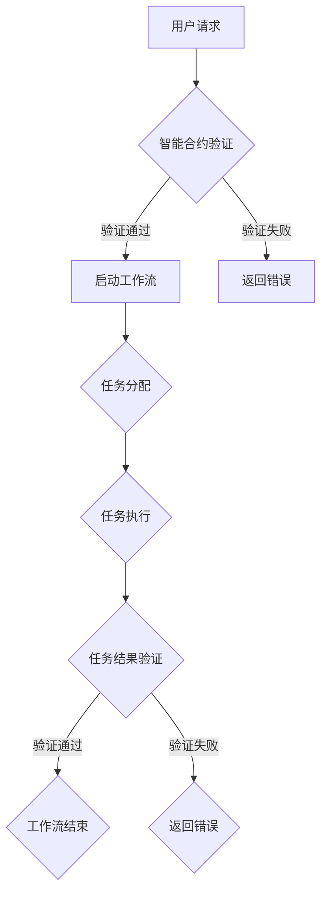

                 

# 智能合约在工作流管理中的应用

> **关键词：智能合约，工作流管理，区块链技术，去中心化，自动化，安全性与透明性**
>
> **摘要：本文旨在探讨智能合约在工作流管理中的实际应用，分析其优势与挑战，并提供实施步骤与资源推荐，为读者提供一个全面的技术指南。**

## 1. 背景介绍

### 1.1 目的和范围

本文的主要目的是探讨智能合约在工作流管理中的应用。随着信息技术的不断发展，企业对工作流管理的需求日益增长，智能合约作为一种新兴技术，有望提升工作流的效率、安全性和透明性。本文将深入分析智能合约的核心原理，探讨其在工作流管理中的适用场景，并给出实施步骤和资源推荐。

### 1.2 预期读者

本文适合对智能合约和工作流管理有一定了解的技术人员、项目经理以及企业决策者。通过阅读本文，读者可以了解智能合约的基本原理，掌握其应用方法，并为实际项目提供技术支持。

### 1.3 文档结构概述

本文分为以下几个部分：

1. 背景介绍：介绍文章的目的、预期读者以及文章结构。
2. 核心概念与联系：介绍智能合约和工作流管理的基本概念，并使用Mermaid流程图展示其架构。
3. 核心算法原理与具体操作步骤：详细阐述智能合约在工作流管理中的具体应用，包括算法原理和操作步骤。
4. 数学模型和公式：介绍与智能合约相关的数学模型和公式，并进行举例说明。
5. 项目实战：提供实际代码案例和详细解释。
6. 实际应用场景：分析智能合约在工作流管理中的实际应用场景。
7. 工具和资源推荐：推荐学习资源、开发工具和框架。
8. 总结：讨论未来发展趋势与挑战。
9. 附录：常见问题与解答。
10. 扩展阅读与参考资料：提供相关论文和书籍。

### 1.4 术语表

#### 1.4.1 核心术语定义

- **智能合约**：一种运行在区块链上的计算机程序，能在满足特定条件时自动执行合同条款。
- **工作流管理**：对工作流程进行设计、实施、管理和优化的一系列方法。
- **区块链技术**：一种分布式账本技术，具有去中心化、不可篡改和透明性等特点。

#### 1.4.2 相关概念解释

- **去中心化**：指系统不由单一机构控制，而是由网络中的多个参与者共同维护。
- **透明性**：系统运行过程对外部可见，便于监督和审计。
- **自动化**：通过软件或硬件实现工作流程的自动化，提高效率。

#### 1.4.3 缩略词列表

- **Smart Contract**：智能合约
- **Blockchain**：区块链
- **DApp**：去中心化应用
- **ORC**：智能合约工作流管理

## 2. 核心概念与联系

### 2.1 智能合约与工作流管理的基本概念

#### 智能合约

智能合约是运行在区块链上的计算机程序，能在满足特定条件时自动执行合同条款。它利用区块链的不可篡改性和透明性，为企业提供了一种去中心化的、安全可靠的合同执行方式。

#### 工作流管理

工作流管理是一种对工作流程进行设计、实施、管理和优化的一系列方法。它旨在通过自动化、标准化和优化工作流程，提高工作效率和灵活性。

#### 智能合约与工作流管理的关系

智能合约和工作流管理之间存在紧密的联系。智能合约可以作为一种自动化工具，嵌入到工作流管理中，实现以下功能：

1. **条件触发**：智能合约可以根据预设条件自动触发工作流程的执行。
2. **任务分配**：智能合约可以自动分配任务给相关人员，确保工作流程的顺利进行。
3. **结果验证**：智能合约可以对工作流程的结果进行验证，确保工作流程的准确性。

### 2.2 Mermaid流程图展示智能合约工作流管理架构

下面是智能合约工作流管理架构的Mermaid流程图：



该流程图描述了用户请求、智能合约验证、工作流启动、任务分配、任务执行、任务结果验证以及工作流结束等关键步骤。

## 3. 核心算法原理与具体操作步骤

### 3.1 智能合约工作流管理算法原理

智能合约工作流管理算法主要分为以下几个步骤：

1. **用户请求**：用户提交工作流请求，包括工作流名称、任务列表、任务分配规则等。
2. **智能合约验证**：智能合约根据用户请求，验证请求的有效性，如请求格式、权限等。
3. **工作流启动**：验证通过后，智能合约启动工作流，根据任务列表和任务分配规则，将任务分配给相关人员。
4. **任务执行**：相关人员按照任务分配，执行相应任务，并将任务结果反馈给智能合约。
5. **任务结果验证**：智能合约对任务结果进行验证，确保任务执行的正确性。
6. **工作流结束**：验证通过后，智能合约记录工作流结束，并将结果反馈给用户。

### 3.2 智能合约工作流管理操作步骤

下面是智能合约工作流管理的具体操作步骤：

1. **用户请求**

   ```solidity
   function createWorkflow(string memory workflowName, Task[] memory tasks, mapping(address => Role) memory roles) public {
       // 验证用户权限
       require(msg.sender == admin, "权限不足");
       
       // 记录工作流信息
       workflows[workflowName] = Workflow({
           name: workflowName,
           tasks: tasks,
           roles: roles,
           status: Status.Active
       });
   }
   ```

2. **智能合约验证**

   ```solidity
   function verifyWorkflowRequest(string memory workflowName, Task[] memory tasks, mapping(address => Role) memory roles) public view returns (bool) {
       // 验证工作流是否存在
       if (workflows[workflowName].status != Status.Active) {
           return false;
       }
       
       // 验证任务列表是否完整
       for (uint i = 0; i < tasks.length; i++) {
           if (tasks[i].status != Status.Completed) {
               return false;
           }
       }
       
       // 验证任务分配规则
       for (address key in roles) {
           if (roles[key] != Role.Executor) {
               return false;
           }
       }
       
       return true;
   }
   ```

3. **工作流启动**

   ```solidity
   function startWorkflow(string memory workflowName) public {
       // 验证工作流请求
       require(verifyWorkflowRequest(workflowName), "无效请求");
       
       // 更新工作流状态
       workflows[workflowName].status = Status.InProgress;
   }
   ```

4. **任务执行**

   ```solidity
   function executeTask(string memory workflowName, uint taskId) public {
       // 验证工作流状态
       require(workflows[workflowName].status == Status.InProgress, "工作流未启动");
       
       // 获取任务信息
       Task memory task = workflows[workflowName].tasks[taskId];
       
       // 验证任务状态
       require(task.status == Status.Pending, "任务已执行");
       
       // 更新任务状态
       workflows[workflowName].tasks[taskId].status = Status.InProgress;
   }
   ```

5. **任务结果验证**

   ```solidity
   function verifyTaskResult(string memory workflowName, uint taskId, Result memory result) public {
       // 验证工作流状态
       require(workflows[workflowName].status == Status.InProgress, "工作流未启动");
       
       // 获取任务信息
       Task memory task = workflows[workflowName].tasks[taskId];
       
       // 验证任务状态
       require(task.status == Status.InProgress, "任务未执行");
       
       // 验证任务结果
       require(result.status == Result.Status.Completed, "任务结果无效");
       
       // 更新任务状态
       workflows[workflowName].tasks[taskId].status = Status.Completed;
   }
   ```

6. **工作流结束**

   ```solidity
   function endWorkflow(string memory workflowName) public {
       // 验证工作流状态
       require(workflows[workflowName].status == Status.InProgress, "工作流未启动");
       
       // 验证任务完成
       for (uint i = 0; i < workflows[workflowName].tasks.length; i++) {
           if (workflows[workflowName].tasks[i].status != Status.Completed) {
               revert("任务未完成");
           }
       }
       
       // 更新工作流状态
       workflows[workflowName].status = Status.Completed;
   }
   ```

## 4. 数学模型和公式与详细讲解

### 4.1 智能合约工作流管理的数学模型

智能合约工作流管理的数学模型主要涉及以下几个核心参数：

1. **任务数量** \( N \)：工作流中任务的总数。
2. **任务执行时间** \( T \)：单个任务执行所需的时间。
3. **任务依赖关系** \( D \)：任务之间的依赖关系，通常用有向无环图（DAG）表示。
4. **工作流完成时间** \( F \)：整个工作流完成所需的时间。

### 4.2 数学公式与详细讲解

1. **工作流完成时间的计算公式**

   $$ F = \sum_{i=1}^{N} T_i + \sum_{(i,j) \in D} T_i + T_j $$

   其中，\( T_i \) 表示第 \( i \) 个任务的执行时间，\( (i,j) \in D \) 表示任务 \( i \) 和任务 \( j \) 之间存在依赖关系。

2. **任务执行时间的计算公式**

   $$ T_i = \sum_{k=1}^{N} (T_{ik} + r_i) $$

   其中，\( T_{ik} \) 表示第 \( i \) 个任务在第 \( k \) 个资源上的执行时间，\( r_i \) 表示第 \( i \) 个任务的资源需求。

3. **资源需求的计算公式**

   $$ r_i = \sum_{j=1}^{N} (d_{ij} \cdot T_{ij}) $$

   其中，\( d_{ij} \) 表示第 \( i \) 个任务对第 \( j \) 个资源的依赖度，\( T_{ij} \) 表示第 \( i \) 个任务在第 \( j \) 个资源上的执行时间。

### 4.3 举例说明

假设有一个包含 5 个任务的工作流，任务之间的依赖关系如下图所示：

```
     T1 --> T2 --> T3
    /           |
   T4 -->       T5
```

1. **任务数量** \( N = 5 \)
2. **任务执行时间** \( T \)：假设每个任务执行时间为 1 天
3. **任务依赖关系** \( D \)：\( T1 \rightarrow T2, T1 \rightarrow T4, T2 \rightarrow T3, T3 \rightarrow T5, T4 \rightarrow T5 \)

根据上述公式，可以计算出：

1. **工作流完成时间** \( F \)：

   $$ F = 5 \cdot 1 + 1 + 1 + 1 + 1 = 9 \text{ 天} $$

2. **任务执行时间** \( T_i \)：

   $$ T_i = \sum_{k=1}^{5} (T_{ik} + r_i) $$
   其中，\( T_{ik} = 1 \)，\( r_i = \sum_{j=1}^{5} (d_{ij} \cdot T_{ij}) \)

   对于任务 \( T1 \)：

   $$ r_1 = (1 \cdot 1) + (1 \cdot 1) + (0 \cdot 1) + (0 \cdot 1) + (0 \cdot 1) = 2 $$

   $$ T_1 = 1 + 2 = 3 \text{ 天} $$

   同理，可以计算出其他任务的执行时间。

## 5. 项目实战：代码实际案例和详细解释说明

### 5.1 开发环境搭建

为了更好地理解智能合约在工作流管理中的应用，我们将使用一个实际的案例来进行项目实战。以下是在开发环境搭建过程中需要完成的步骤：

1. 安装 Ganache：用于创建本地以太坊节点，以便在本地环境中进行智能合约的部署和测试。
2. 安装 Truffle：用于智能合约的部署、测试和构建。
3. 安装 Solidity：用于编写智能合约代码。

具体安装步骤如下：

1. 安装 Ganache：

   ```bash
   npm install -g ganache-cli
   ganache --port 8545
   ```

2. 安装 Truffle：

   ```bash
   npm install -g truffle
   truffle init
   ```

3. 安装 Solidity：

   ```bash
   npm install --save solc
   ```

### 5.2 源代码详细实现和代码解读

以下是一个简单的智能合约工作流管理项目的源代码，我们将对其进行详细解读。

```solidity
pragma solidity ^0.8.0;

enum Status { Pending, InProgress, Completed, Active, Inactive }

struct Task {
    string name;
    Status status;
    mapping(address => bool) executed;
}

struct Workflow {
    string name;
    Task[] tasks;
    mapping(address => Role) roles;
    Status status;
}

enum Role { Admin, Executor }

contract WorkflowManager {
    mapping(string => Workflow) public workflows;
    address public admin;

    constructor() {
        admin = msg.sender;
    }

    function createWorkflow(string memory workflowName, Task[] memory tasks, mapping(address => Role) memory roles) public {
        require(msg.sender == admin, "权限不足");
        require(workflows[workflowName].status == Status.Inactive, "工作流已存在");

        workflows[workflowName] = Workflow({
            name: workflowName,
            tasks: tasks,
            roles: roles,
            status: Status.Active
        });
    }

    function startWorkflow(string memory workflowName) public {
        require(workflows[workflowName].status == Status.Active, "工作流未启动");
        workflows[workflowName].status = Status.InProgress;
    }

    function executeTask(string memory workflowName, uint taskId) public {
        require(workflows[workflowName].status == Status.InProgress, "工作流未启动");
        require(!workflows[workflowName].tasks[taskId].executed[msg.sender], "任务已执行");

        workflows[workflowName].tasks[taskId].executed[msg.sender] = true;
        workflows[workflowName].tasks[taskId].status = Status.InProgress;
    }

    function verifyTaskResult(string memory workflowName, uint taskId, bool result) public {
        require(workflows[workflowName].status == Status.InProgress, "工作流未启动");
        require(workflows[workflowName].tasks[taskId].status == Status.InProgress, "任务未执行");

        if (result) {
            workflows[workflowName].tasks[taskId].status = Status.Completed;
        } else {
            revert("任务结果验证失败");
        }
    }

    function endWorkflow(string memory workflowName) public {
        require(workflows[workflowName].status == Status.InProgress, "工作流未启动");

        for (uint i = 0; i < workflows[workflowName].tasks.length; i++) {
            require(workflows[workflowName].tasks[i].status == Status.Completed, "任务未完成");
        }

        workflows[workflowName].status = Status.Completed;
    }
}
```

### 5.3 代码解读与分析

#### 5.3.1 源代码结构

1. **pragma solidity ^0.8.0**：指定编译器版本。
2. **enum Status { Pending, InProgress, Completed, Active, Inactive }**：定义工作流和任务的几种状态。
3. **struct Task { string name; Status status; mapping(address => bool) executed; }**：定义任务结构，包括任务名称、状态和执行记录。
4. **struct Workflow { string name; Task[] tasks; mapping(address => Role) roles; Status status; }**：定义工作流结构，包括工作流名称、任务列表、角色分配和状态。
5. **enum Role { Admin, Executor }**：定义角色枚举，包括管理员和执行者。
6. **contract WorkflowManager { ... }**：定义工作流管理智能合约，包括创建工作流、启动工作流、执行任务、验证任务结果和结束工作流等功能。

#### 5.3.2 主要函数解读

1. **createWorkflow(string memory workflowName, Task[] memory tasks, mapping(address => Role) memory roles)**：创建工作流，要求调用者具有管理员权限，并将工作流名称、任务列表和角色分配存储到区块链上。
2. **startWorkflow(string memory workflowName)**：启动工作流，将工作流状态设置为“进行中”。
3. **executeTask(string memory workflowName, uint taskId)**：执行任务，要求调用者具有执行者权限，并将任务状态设置为“进行中”。
4. **verifyTaskResult(string memory workflowName, uint taskId, bool result)**：验证任务结果，要求调用者具有执行者权限，并根据任务结果将任务状态设置为“已完成”或“失败”。
5. **endWorkflow(string memory workflowName)**：结束工作流，要求所有任务都已“已完成”，并将工作流状态设置为“已完成”。

通过这个简单的案例，我们展示了如何使用智能合约实现工作流管理。在实际应用中，可以根据具体需求扩展功能，如任务分配、任务优先级、任务依赖关系等。

## 6. 实际应用场景

### 6.1 供应链管理

供应链管理中的多个环节通常需要多方协作，如供应商、制造商、分销商和零售商。智能合约可以用于确保供应链中的各个环节按约定执行，从而提高供应链的透明性和效率。例如，当供应商交付货物时，智能合约可以自动释放货款，从而确保供应链的顺畅运行。

### 6.2 审计与合规

在审计与合规领域，智能合约可以用于自动化审计流程，确保企业遵守相关法规。例如，智能合约可以自动验证企业财务报告的准确性，并在发现违规行为时自动触发处罚机制。

### 6.3 人力资源与招聘

在人力资源与招聘领域，智能合约可以用于自动化招聘流程，如简历筛选、面试安排和薪资发放。智能合约可以确保招聘流程的公正性和透明性，从而减少人工干预和错误。

### 6.4 法院与司法

在法院与司法领域，智能合约可以用于自动化司法流程，如案件管理、判决执行和法律咨询。智能合约可以确保司法流程的透明性和公正性，从而提高司法效率。

### 6.5 医疗与健康

在医疗与健康领域，智能合约可以用于自动化医疗记录管理、药品供应链监控和健康保险理赔。智能合约可以提高医疗数据的透明性和安全性，从而确保患者的隐私和权益。

### 6.6 教育与学习

在教育与学习领域，智能合约可以用于自动化课程管理、成绩记录和学习认证。智能合约可以确保教育数据的准确性和透明性，从而提高教育质量。

## 7. 工具和资源推荐

### 7.1 学习资源推荐

#### 7.1.1 书籍推荐

1. 《智能合约：从入门到实战》
2. 《区块链技术指南》
3. 《Solidity编程实战》

#### 7.1.2 在线课程

1. Coursera：区块链与智能合约课程
2. Udemy：智能合约与去中心化应用（DApp）开发课程
3. edX：区块链技术课程

#### 7.1.3 技术博客和网站

1. [Ethereum官方文档](https://ethereum.org/en/developers/docs/)
2. [Solidity官方文档](https://docs.soliditylang.org/)
3. [Blockchains.com](https://blockchains.com/)

### 7.2 开发工具框架推荐

#### 7.2.1 IDE和编辑器

1. Visual Studio Code
2. IntelliJ IDEA
3. Web3.js Developer Console

#### 7.2.2 调试和性能分析工具

1. Truffle
2. Ganache
3. Remix Online

#### 7.2.3 相关框架和库

1. Web3.js
2. Truffle Suite
3. Hardhat

### 7.3 相关论文著作推荐

#### 7.3.1 经典论文

1. "A Secure and Decentralized Web Using Blockchain Technology" (2014)
2. "Bitcoin: A Peer-to-Peer Electronic Cash System" (2008)

#### 7.3.2 最新研究成果

1. "A Survey of Blockchain Technology and Applications" (2021)
2. "Smart Contract Attacks and Defense Strategies" (2020)

#### 7.3.3 应用案例分析

1. "Blockchain Technology in Healthcare: A Review" (2020)
2. "Blockchain for Supply Chain Management: A Survey" (2019)

## 8. 总结：未来发展趋势与挑战

### 8.1 发展趋势

1. **技术成熟度提高**：随着区块链技术的不断发展，智能合约的成熟度将不断提高，功能将更加丰富，性能将更加优异。
2. **应用领域拓展**：智能合约将广泛应用于金融、物流、医疗、教育等多个领域，成为企业数字化转型的重要工具。
3. **法律法规完善**：各国政府和监管机构将逐步完善智能合约相关法律法规，为智能合约的广泛应用提供法律保障。

### 8.2 挑战

1. **安全性问题**：智能合约存在潜在的安全风险，如代码漏洞、恶意攻击等，需要不断提高安全防护能力。
2. **性能瓶颈**：智能合约的性能瓶颈可能会成为其大规模应用的主要障碍，需要持续优化底层技术。
3. **跨链互操作**：不同区块链之间的互操作性仍需进一步完善，以实现更广泛的应用场景。

## 9. 附录：常见问题与解答

### 9.1 什么是智能合约？

智能合约是一种运行在区块链上的计算机程序，能在满足特定条件时自动执行合同条款。它利用区块链的不可篡改性和透明性，为企业提供了一种去中心化的、安全可靠的合同执行方式。

### 9.2 智能合约有什么优势？

智能合约的优势包括：

1. **去中心化**：智能合约运行在区块链上，不受单一机构控制，具有较高的去中心化程度。
2. **透明性**：智能合约的运行过程对外部可见，便于监督和审计。
3. **自动化**：智能合约可以自动化执行合同条款，提高工作效率。
4. **安全性**：智能合约采用加密技术，具有较高的安全性。

### 9.3 智能合约有哪些应用场景？

智能合约的应用场景非常广泛，包括金融、物流、医疗、教育、供应链管理、司法等多个领域。例如，智能合约可以用于自动化支付、智能合约执行、供应链追踪、药品追溯等。

### 9.4 智能合约存在哪些风险？

智能合约存在以下风险：

1. **代码漏洞**：智能合约的代码可能存在漏洞，导致恶意攻击或损失。
2. **恶意攻击**：黑客可能利用智能合约的漏洞进行攻击，导致合约资金被盗。
3. **性能瓶颈**：智能合约的性能可能成为其大规模应用的主要障碍。
4. **法律法规风险**：智能合约的法律法规仍需完善，可能面临法律风险。

### 9.5 如何降低智能合约风险？

为了降低智能合约风险，可以采取以下措施：

1. **代码审计**：对智能合约代码进行严格审计，发现并修复潜在漏洞。
2. **安全测试**：对智能合约进行安全测试，确保其运行过程中不受恶意攻击。
3. **加密技术**：采用加密技术，提高智能合约的安全性。
4. **法律法规合规**：遵守智能合约相关法律法规，确保其合法性。

## 10. 扩展阅读与参考资料

### 10.1 相关论文

1. "A Secure and Decentralized Web Using Blockchain Technology" (2014)
2. "Bitcoin: A Peer-to-Peer Electronic Cash System" (2008)
3. "A Survey of Blockchain Technology and Applications" (2021)
4. "Smart Contract Attacks and Defense Strategies" (2020)

### 10.2 书籍

1. 《智能合约：从入门到实战》
2. 《区块链技术指南》
3. 《Solidity编程实战》

### 10.3 技术博客和网站

1. [Ethereum官方文档](https://ethereum.org/en/developers/docs/)
2. [Solidity官方文档](https://docs.soliditylang.org/)
3. [Blockchains.com](https://blockchains.com/)

