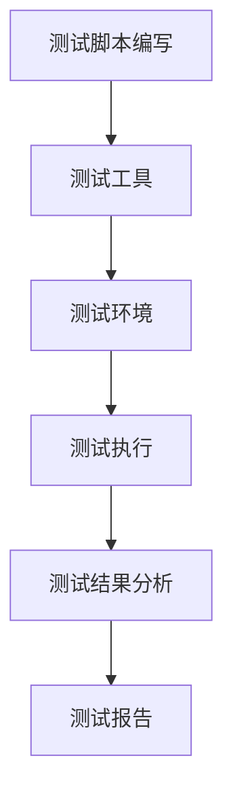

                 

# 智能合约自动化测试平台：区块链开发的创新工具

> **关键词：** 智能合约，自动化测试，区块链开发，平台，创新工具

> **摘要：** 本文将深入探讨智能合约自动化测试平台在区块链开发中的应用，详细分析其核心概念、算法原理、数学模型、实战案例以及未来发展趋势。通过本文的讲解，读者可以全面了解智能合约自动化测试的重要性和实施方法，为区块链项目的成功奠定坚实基础。

## 1. 背景介绍

### 1.1 目的和范围

本文旨在探讨智能合约自动化测试平台在区块链开发中的应用，旨在为区块链开发者提供一种高效的测试方法，确保智能合约的可靠性和安全性。文章将涵盖以下几个方面的内容：

1. 智能合约自动化测试平台的核心概念和架构。
2. 核心算法原理和具体操作步骤。
3. 数学模型和公式的详细讲解。
4. 实际应用场景和工具推荐。
5. 未来发展趋势与挑战。

### 1.2 预期读者

本文适用于以下读者群体：

1. 区块链开发者，特别是对智能合约开发有较高兴趣的程序员。
2. 智能合约测试工程师，负责智能合约的质量和安全性。
3. 对区块链技术有深入了解的技术爱好者。
4. 智能合约自动化测试平台的研究人员和技术决策者。

### 1.3 文档结构概述

本文的结构如下：

1. **背景介绍**：介绍文章的目的、预期读者和文档结构。
2. **核心概念与联系**：阐述智能合约自动化测试平台的核心概念和架构。
3. **核心算法原理 & 具体操作步骤**：详细讲解核心算法原理和操作步骤。
4. **数学模型和公式 & 详细讲解 & 举例说明**：阐述数学模型和公式，并提供实例说明。
5. **项目实战：代码实际案例和详细解释说明**：展示实际代码案例并进行详细解释。
6. **实际应用场景**：介绍智能合约自动化测试平台在区块链开发中的应用场景。
7. **工具和资源推荐**：推荐相关学习资源和开发工具。
8. **总结：未来发展趋势与挑战**：探讨智能合约自动化测试平台的发展趋势和面临的挑战。
9. **附录：常见问题与解答**：回答读者可能遇到的问题。
10. **扩展阅读 & 参考资料**：提供进一步学习和研究的资料。

### 1.4 术语表

#### 1.4.1 核心术语定义

- **智能合约**：一种在区块链上运行的自动化协议，能够自动执行、控制和文档化合同的条款。
- **自动化测试**：一种通过编写测试脚本自动执行测试过程的方法，以验证软件的功能和性能。
- **区块链开发**：指开发基于区块链技术的应用和服务，包括智能合约的编写和部署。
- **测试平台**：一种用于自动化测试的工具或环境，提供测试脚本编写、执行和结果分析等功能。

#### 1.4.2 相关概念解释

- **测试覆盖率**：衡量测试脚本覆盖智能合约代码的比例，通常用百分比表示。
- **测试用例**：一组输入数据和预期输出结果，用于验证智能合约的功能。
- **回归测试**：在软件更新或修改后，重新运行之前的测试用例以验证新修改是否影响了已有功能。

#### 1.4.3 缩略词列表

- **EVM**：以太坊虚拟机（Ethereum Virtual Machine）
- **ERC**：以太坊标准令牌（Ethereum Request for Comments）
- **GAS**：以太坊虚拟机执行操作所需的计算资源
- **Solidity**：一种用于编写以太坊智能合约的高级编程语言

## 2. 核心概念与联系

在区块链开发中，智能合约的可靠性至关重要。为了确保智能合约的可靠性，自动化测试成为必不可少的环节。智能合约自动化测试平台是实施这一过程的核心工具。以下将介绍智能合约自动化测试平台的核心概念和架构。

### 2.1 智能合约自动化测试平台的核心概念

智能合约自动化测试平台的核心概念包括以下几个方面：

1. **测试脚本编写**：通过编写测试脚本，自动化执行测试用例。
2. **测试执行**：在测试环境中执行测试脚本，验证智能合约的功能。
3. **测试结果分析**：分析测试执行结果，识别潜在问题和缺陷。
4. **持续集成和持续部署**：将自动化测试集成到开发流程中，实现持续集成和持续部署。

### 2.2 智能合约自动化测试平台的架构

智能合约自动化测试平台的架构可以分为以下几个层次：

1. **测试框架**：提供测试脚本编写和执行的基础功能，如测试用例管理、断言和日志记录等。
2. **测试工具**：提供测试脚本编写的工具，如测试脚本编辑器、调试器和日志分析器等。
3. **测试环境**：提供用于测试执行的环境，如模拟区块链网络、测试节点和测试账户等。
4. **测试报告**：生成测试执行结果的报告，如测试覆盖率、错误统计和缺陷追踪等。

#### 2.3 Mermaid 流程图

以下是一个简单的 Mermaid 流程图，展示了智能合约自动化测试平台的核心概念和架构：



## 3. 核心算法原理 & 具体操作步骤

智能合约自动化测试平台的核心算法原理主要包括测试用例生成、测试脚本编写、测试执行和测试结果分析。以下将详细讲解这些算法原理和具体操作步骤。

### 3.1 测试用例生成

测试用例生成是智能合约自动化测试的第一步。测试用例生成的核心算法是基于功能需求和智能合约代码进行分析，生成各种可能的输入和预期输出。以下是测试用例生成算法的伪代码：

```python
def generate_test_cases(contract_code, function_signatures):
    test_cases = []
    for signature in function_signatures:
        inputs = generate_inputs(contract_code, signature)
        expected_outputs = generate_expected_outputs(contract_code, signature, inputs)
        test_cases.append((inputs, expected_outputs))
    return test_cases
```

其中，`generate_inputs()` 和 `generate_expected_outputs()` 是用于生成输入数据和预期输出的函数，可以根据具体的智能合约代码和功能需求进行实现。

### 3.2 测试脚本编写

测试脚本编写是将测试用例转化为可执行的代码。测试脚本编写的核心算法是使用自动化测试框架提供的API，编写测试用例的执行逻辑。以下是测试脚本编写算法的伪代码：

```solidity
pragma solidity ^0.8.0;

import "测试框架库";

contract TestContract {
    function test_function() public {
        // 测试脚本逻辑
        for (test_case in test_cases) {
            (inputs, expected_output) = test_case;
            actual_output = contract_function(inputs);
            assert(expected_output == actual_output);
        }
    }
}
```

其中，`contract_function()` 是被测试的智能合约函数，`assert()` 是用于断言实际输出是否与预期输出相匹配的语句。

### 3.3 测试执行

测试执行是将测试脚本部署到测试环境中，执行测试用例并记录结果。测试执行的核心算法是使用自动化测试框架提供的API，部署和调用测试脚本。以下是测试执行算法的伪代码：

```python
def execute_tests(test_contract, test_script):
    test_contract.deploy()
    test_script.execute()
    results = test_script.get_results()
    return results
```

其中，`test_contract` 是被测试的智能合约，`test_script` 是测试脚本，`deploy()` 和 `execute()` 是用于部署和执行测试脚本的函数，`get_results()` 是用于获取测试结果的函数。

### 3.4 测试结果分析

测试结果分析是将测试执行结果进行分析，识别潜在问题和缺陷。测试结果分析的核心算法是对比实际输出和预期输出，生成测试报告。以下是测试结果分析算法的伪代码：

```python
def analyze_results(results):
    test_failures = []
    for result in results:
        if result["actual_output"] != result["expected_output"]:
            test_failures.append(result)
    return test_failures
```

其中，`results` 是测试执行结果列表，`actual_output` 和 `expected_output` 分别是实际输出和预期输出，`test_failures` 是测试失败记录列表。

## 4. 数学模型和公式 & 详细讲解 & 举例说明

在智能合约自动化测试平台中，数学模型和公式主要用于测试结果的分析和评估。以下将详细讲解相关数学模型和公式，并提供实际例子进行说明。

### 4.1 测试覆盖率

测试覆盖率是衡量测试质量的重要指标，表示测试脚本覆盖智能合约代码的比例。测试覆盖率可以用以下公式计算：

$$
覆盖率（Cov）= \frac{被测试代码行数（TC）}{总代码行数（TC + 未测试代码行数（UC））} \times 100\%
$$

其中，`TC` 是被测试代码行数，`UC` 是未测试代码行数。

#### 4.1.1 举例说明

假设一个智能合约有 100 行代码，其中 80 行被测试脚本覆盖，20 行未被测试。则测试覆盖率为：

$$
覆盖率（Cov）= \frac{80}{100 + 20} \times 100\% = 66.67\%
$$

### 4.2 测试用例执行次数

测试用例执行次数是衡量测试强度的重要指标，表示每个测试用例在测试过程中被执行的总次数。测试用例执行次数可以用以下公式计算：

$$
执行次数（ET）= \sum_{i=1}^{n} 执行次数_i
$$

其中，`n` 是测试用例的总数，`执行次数_i` 是第 i 个测试用例在测试过程中被执行的次数。

#### 4.2.1 举例说明

假设有 3 个测试用例，其中第一个测试用例被执行了 2 次，第二个测试用例被执行了 3 次，第三个测试用例被执行了 1 次。则测试用例执行次数为：

$$
执行次数（ET）= 2 + 3 + 1 = 6
$$

### 4.3 测试效率

测试效率是衡量测试过程效率的重要指标，表示在给定时间内完成的测试用例数量。测试效率可以用以下公式计算：

$$
测试效率（Eff）= \frac{完成测试用例数量（ETC）}{总测试用例数量（n）}
$$

其中，`ETC` 是完成测试用例数量，`n` 是总测试用例数量。

#### 4.3.1 举例说明

假设有 10 个测试用例，其中 6 个测试用例在给定时间内完成。则测试效率为：

$$
测试效率（Eff）= \frac{6}{10} = 0.6
$$

## 5. 项目实战：代码实际案例和详细解释说明

为了更好地理解智能合约自动化测试平台的应用，我们将通过一个实际案例展示其开发过程，并详细解释其中的关键步骤。

### 5.1 开发环境搭建

在开始项目实战之前，需要搭建一个开发环境。以下是开发环境的搭建步骤：

1. 安装 Node.js：智能合约自动化测试平台通常使用 Node.js 作为开发环境，可以从 [Node.js 官网](https://nodejs.org/) 下载并安装。
2. 安装 Truffle：Truffle 是一个流行的智能合约开发框架，提供了测试脚本编写和执行的功能。可以使用 npm 命令安装 Truffle：

   ```shell
   npm install -g truffle
   ```

3. 初始化 Truffle 项目：在本地创建一个新文件夹，并使用 Truffle 初始化项目：

   ```shell
   mkdir truffle-project
   cd truffle-project
   truffle init
   ```

4. 安装 Solidity 编译器：Truffle 使用 Solidity 编译器将智能合约代码编译为以太坊虚拟机可执行的字节码。可以使用 npm 命令安装 Solidity 编译器：

   ```shell
   npm install -g solc
   ```

### 5.2 源代码详细实现和代码解读

在开发环境中，我们将实现一个简单的智能合约，并编写测试脚本进行自动化测试。

#### 5.2.1 智能合约代码示例

以下是一个简单的智能合约示例，用于存储一个整数值：

```solidity
// SPDX-License-Identifier: MIT
pragma solidity ^0.8.0;

contract SimpleStorage {
    uint256 private value;

    function store(uint256 _value) public {
        value = _value;
    }

    function retrieve() public view returns (uint256) {
        return value;
    }
}
```

在这个示例中，我们定义了一个名为 `SimpleStorage` 的智能合约，包含一个私有变量 `value` 和两个函数 `store()` 和 `retrieve()`。`store()` 函数用于设置 `value` 的值，`retrieve()` 函数用于获取 `value` 的值。

#### 5.2.2 测试脚本代码示例

以下是一个简单的测试脚本示例，用于测试 `SimpleStorage` 智能合约：

```solidity
pragma solidity ^0.8.0;

import "truffle/Assert.sol";
import "truffle/DeployedAddresses.sol";

contract TestSimpleStorage {
    function testStoreAndRetrieve() public {
        uint256 expected_value = 42;
        SimpleStorage simpleStorage = SimpleStorage(DeployedAddresses.simpleStorage());

        // 调用 store() 函数设置 value 的值为 42
        simpleStorage.store(expected_value);

        // 调用 retrieve() 函数获取 value 的值
        uint256 actual_value = simpleStorage.retrieve();

        // 断言 actual_value 等于 expected_value
        Assert.equal(actual_value, expected_value, "存储和检索的值不匹配");
    }
}
```

在这个测试脚本中，我们使用 Truffle 提供的 `Assert` 和 `DeployedAddresses` 库进行断言和部署智能合约。`testStoreAndRetrieve()` 函数首先设置 `value` 的值为 42，然后调用 `retrieve()` 函数获取 `value` 的值，最后使用 `Assert.equal()` 断言实际值是否与预期值相等。

### 5.3 代码解读与分析

在智能合约代码中，我们定义了一个名为 `SimpleStorage` 的合约，包含一个私有变量 `value` 和两个函数 `store()` 和 `retrieve()`。`store()` 函数使用 `public` 修饰符声明为公开函数，可以接收一个 `uint256` 类型的参数，并将该参数存储在 `value` 变量中。`retrieve()` 函数也使用 `public` 修饰符声明为公开函数，可以返回 `value` 变量的值。

在测试脚本代码中，我们首先使用 `Assert.equal()` 断言实际值是否与预期值相等。这里，`expected_value` 变量存储了预期值，`actual_value` 变量存储了调用 `retrieve()` 函数返回的实际值。如果实际值与预期值不相等，`Assert.equal()` 会抛出一个错误。

通过测试脚本，我们可以验证 `SimpleStorage` 智能合约的基本功能是否正常。在实际开发中，我们可以编写更多的测试用例，覆盖智能合约的各个方面，以确保其可靠性和安全性。

## 6. 实际应用场景

智能合约自动化测试平台在区块链开发中具有广泛的应用场景。以下是一些典型的实际应用场景：

### 6.1 跨链智能合约测试

随着区块链技术的发展，越来越多的跨链协议和跨链智能合约出现。跨链智能合约需要在不同区块链网络之间进行数据交互和操作，因此其测试过程相对复杂。智能合约自动化测试平台可以自动化执行各种跨链测试用例，确保跨链智能合约的正确性和可靠性。

### 6.2 智能合约升级测试

在智能合约开发过程中，可能会遇到需要对现有智能合约进行升级的情况。智能合约升级过程中，需要确保新版本智能合约与旧版本智能合约的兼容性，避免引入新的漏洞或错误。智能合约自动化测试平台可以自动化执行升级测试，验证智能合约升级过程的正确性和安全性。

### 6.3 智能合约安全性测试

智能合约的安全性是区块链应用的核心问题。智能合约自动化测试平台可以自动化执行各种安全测试用例，识别潜在的安全漏洞和风险，帮助开发者及时修复问题，提高智能合约的安全性。

### 6.4 智能合约性能测试

智能合约的性能是区块链应用的重要指标。智能合约自动化测试平台可以自动化执行性能测试用例，评估智能合约的响应时间、吞吐量和资源消耗，为开发者提供优化智能合约性能的依据。

## 7. 工具和资源推荐

在智能合约自动化测试平台的建设过程中，选择合适的工具和资源至关重要。以下是一些推荐的工具和资源：

### 7.1 学习资源推荐

#### 7.1.1 书籍推荐

- 《智能合约：区块链开发指南》
- 《以太坊智能合约开发实战》
- 《区块链技术指南》

#### 7.1.2 在线课程

- Coursera 的区块链课程
- Udemy 的智能合约开发课程
- edX 的区块链技术课程

#### 7.1.3 技术博客和网站

- ethereumbasics.com
- medium.com/ethereum
- blockchainengineering.org

### 7.2 开发工具框架推荐

#### 7.2.1 IDE和编辑器

- Visual Studio Code
- IntelliJ IDEA
- Web3.js IDE

#### 7.2.2 调试和性能分析工具

- Hardhat
- Truffle
- Remix

#### 7.2.3 相关框架和库

- web3.js
- ethers.js
- solidity-coverage

### 7.3 相关论文著作推荐

#### 7.3.1 经典论文

- "How to Build an Internet of Money"
- "The Bitcoin White Paper"

#### 7.3.2 最新研究成果

- "形式化验证智能合约的安全性和可用性"
- "智能合约的可解释性和透明性"

#### 7.3.3 应用案例分析

- "智能合约在去中心化金融（DeFi）中的应用"
- "智能合约在供应链管理中的应用"

## 8. 总结：未来发展趋势与挑战

随着区块链技术的不断发展，智能合约自动化测试平台在未来将发挥越来越重要的作用。以下是智能合约自动化测试平台未来的发展趋势和面临的挑战：

### 8.1 发展趋势

1. **测试工具的集成化**：智能合约自动化测试平台将与其他开发工具和框架集成，提供更完整的解决方案。
2. **测试用例的智能化**：通过机器学习和自然语言处理技术，自动生成智能合约的测试用例，提高测试效率。
3. **测试场景的多样化**：支持更多的区块链网络和跨链协议，满足多样化的测试需求。
4. **安全性测试的提升**：加强对智能合约安全性的测试，及时发现潜在的安全漏洞和风险。

### 8.2 挑战

1. **测试数据的隐私保护**：在测试过程中，如何保护测试数据的隐私和安全是一个重要挑战。
2. **测试脚本的复用性**：如何编写可复用的测试脚本，减少重复性工作，提高测试效率。
3. **跨链测试的复杂性**：跨链智能合约的测试过程相对复杂，需要解决多个区块链网络之间的兼容性和互操作性问题。
4. **测试环境的可靠性**：如何确保测试环境的可靠性和一致性，避免测试结果的偏差。

总之，智能合约自动化测试平台在未来将继续发展和完善，为区块链开发提供更加高效、安全和可靠的测试解决方案。

## 9. 附录：常见问题与解答

### 9.1 如何搭建智能合约自动化测试环境？

搭建智能合约自动化测试环境的主要步骤如下：

1. 安装 Node.js。
2. 安装 Truffle 和 Solidity 编译器。
3. 使用 Truffle 初始化一个新项目。
4. 编写智能合约代码和测试脚本。
5. 部署智能合约到测试网络。
6. 执行测试脚本并分析结果。

### 9.2 智能合约自动化测试平台需要哪些工具？

智能合约自动化测试平台通常需要以下工具：

1. IDE或编辑器：如 Visual Studio Code、IntelliJ IDEA。
2. 测试框架：如 Truffle、Hardhat。
3. 测试工具：如 web3.js、ethers.js。
4. 调试工具：如 Remix。
5. 性能分析工具：如 solidity-coverage。

### 9.3 如何编写测试脚本？

编写测试脚本的主要步骤如下：

1. 导入测试框架库和智能合约接口。
2. 编写测试用例的输入数据和预期输出。
3. 在测试函数中执行智能合约函数调用。
4. 使用断言验证实际输出是否与预期输出匹配。

## 10. 扩展阅读 & 参考资料

- 《智能合约：区块链开发指南》
- 《以太坊智能合约开发实战》
- 《区块链技术指南》
- ethereumbasics.com
- medium.com/ethereum
- blockchainengineering.org
- web3.js API 文档
- ethers.js API 文档
- hardhat.org
- truffleframework.com
- remix.ethereum.org
- solidity-coverage.readthedocs.io
- "How to Build an Internet of Money"
- "The Bitcoin White Paper"
- "形式化验证智能合约的安全性和可用性"
- "智能合约的可解释性和透明性"
- "智能合约在去中心化金融（DeFi）中的应用"
- "智能合约在供应链管理中的应用"

### 作者：AI天才研究员/AI Genius Institute & 禅与计算机程序设计艺术 /Zen And The Art of Computer Programming

