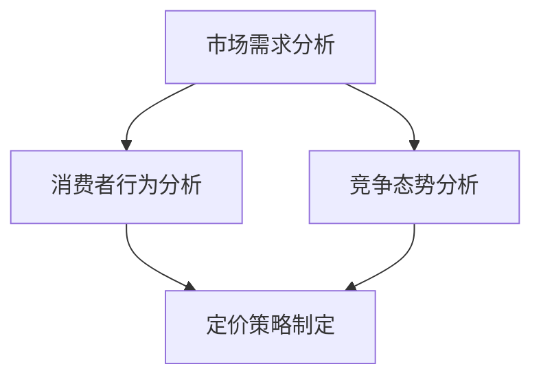

                 

# 智能定价技术的创新应用

> 关键词：智能定价、机器学习、数据挖掘、算法优化、商业策略
>
> 摘要：本文将深入探讨智能定价技术及其在商业领域的创新应用。首先，我们将介绍智能定价的基本概念和重要性，随后详细分析其核心算法原理和数学模型。文章还将通过实际案例展示智能定价在实际中的应用，并推荐相关的工具和资源，最后对未来的发展趋势和挑战进行展望。

## 1. 背景介绍

### 1.1 目的和范围

智能定价技术是近年来商业智能领域的一项重要创新，它通过利用机器学习和数据挖掘技术，对市场需求、消费者行为、竞争态势等多维数据进行深度分析，以实现产品或服务的最优定价策略。本文旨在系统地介绍智能定价技术的核心概念、算法原理及其应用，旨在为读者提供深入了解和掌握这一技术的指南。

本文将涵盖以下主要内容：

- 智能定价的基本概念和重要性
- 智能定价的核心算法原理
- 智能定价的数学模型和公式
- 实际应用场景中的智能定价案例分析
- 智能定价技术相关的工具和资源推荐

### 1.2 预期读者

本文适用于以下读者群体：

- 对商业智能和机器学习感兴趣的技术人员
- 想要优化定价策略的企业管理者
- 数据分析师和业务分析师
- 计算机科学和工程领域的学生和研究人员

### 1.3 文档结构概述

本文结构如下：

- **第1章**：背景介绍，介绍本文的目的、范围、预期读者和文档结构。
- **第2章**：核心概念与联系，介绍智能定价技术的核心概念和原理。
- **第3章**：核心算法原理 & 具体操作步骤，详细阐述智能定价算法的原理和步骤。
- **第4章**：数学模型和公式 & 详细讲解 & 举例说明，介绍智能定价技术所涉及的数学模型和公式。
- **第5章**：项目实战：代码实际案例和详细解释说明，通过实际案例展示智能定价技术的应用。
- **第6章**：实际应用场景，分析智能定价技术在各类商业场景中的应用。
- **第7章**：工具和资源推荐，推荐学习智能定价技术的相关工具和资源。
- **第8章**：总结：未来发展趋势与挑战，探讨智能定价技术的未来发展趋势和面临的挑战。
- **第9章**：附录：常见问题与解答，解答读者可能遇到的常见问题。
- **第10章**：扩展阅读 & 参考资料，提供进一步学习的相关资料和引用。

### 1.4 术语表

#### 1.4.1 核心术语定义

- **智能定价**：利用机器学习和数据挖掘技术，对市场需求、消费者行为、竞争态势等多维数据进行深度分析，以实现产品或服务的最优定价策略。
- **机器学习**：通过算法和统计模型从数据中学习，使其能够做出预测和决策。
- **数据挖掘**：从大量数据中发现有价值的信息和模式。
- **算法优化**：改进算法的性能，提高其效率和准确性。
- **商业策略**：企业在市场中采取的行动和计划，以实现商业目标。

#### 1.4.2 相关概念解释

- **市场需求**：消费者对某一产品或服务的需求量。
- **消费者行为**：消费者在购买、使用和评价产品或服务时的行为模式。
- **竞争态势**：市场上其他竞争对手的定价策略、市场份额和营销活动。

#### 1.4.3 缩略词列表

- **ML**：Machine Learning（机器学习）
- **DM**：Data Mining（数据挖掘）
- **A/B测试**：A/B Testing（一种常见的对比实验方法）

## 2. 核心概念与联系

智能定价技术是商业智能领域的一个重要分支，其核心概念包括市场需求分析、消费者行为分析、竞争态势分析和定价策略制定。下面将使用 Mermaid 流程图来展示这些核心概念及其之间的联系。



### 2.1 市场需求分析

市场需求分析是智能定价技术的第一步，其主要目的是了解消费者对产品或服务的需求情况。这通常涉及到以下几个方面的数据：

- **历史销售数据**：包括不同时间段内的销售量、销售额和库存情况。
- **市场调研数据**：通过对消费者进行调查，了解他们对产品或服务的需求和偏好。
- **竞争产品数据**：分析市场上其他竞争产品的价格、销量和市场反应。

通过这些数据的分析，可以得出市场需求的变化趋势，为后续的定价策略提供依据。

### 2.2 消费者行为分析

消费者行为分析关注的是消费者在购买、使用和评价产品或服务时的行为模式。其主要内容包括：

- **购买习惯**：消费者在购买时的频次、渠道和时间分布。
- **使用行为**：消费者在使用产品或服务时的频率、时长和使用方式。
- **评价行为**：消费者对产品或服务的评价、反馈和投诉情况。

通过分析这些数据，可以深入了解消费者的需求和偏好，从而为定价策略提供更准确的参考。

### 2.3 竞争态势分析

竞争态势分析是对市场上其他竞争对手的定价策略、市场份额和营销活动的分析。其主要内容包括：

- **竞争对手的定价策略**：了解竞争对手的价格水平、折扣策略和促销活动。
- **市场份额**：分析竞争对手在市场上的份额和变化趋势。
- **营销活动**：了解竞争对手的营销策略和活动效果。

通过这些分析，可以评估自身在市场中的竞争地位，为定价策略提供策略参考。

### 2.4 定价策略制定

定价策略制定是智能定价技术的关键步骤，其主要目的是根据市场需求、消费者行为和竞争态势分析的结果，制定出最优的定价策略。常见的定价策略包括：

- **市场导向定价**：以市场需求为依据，制定价格。
- **成本导向定价**：以产品或服务的成本为依据，制定价格。
- **竞争导向定价**：以竞争对手的价格为依据，制定价格。
- **价值导向定价**：以产品或服务的价值为依据，制定价格。

通过以上核心概念的分析和联系，我们可以构建一个完整的智能定价技术框架。下面将详细介绍智能定价技术的核心算法原理。

## 3. 核心算法原理 & 具体操作步骤

智能定价技术的核心算法主要包括市场需求预测、消费者行为预测和竞争态势分析。以下将分别介绍这些算法的原理和具体操作步骤。

### 3.1 市场需求预测

市场需求预测是智能定价技术的重要基础，其目的是通过分析历史销售数据、市场调研数据和竞争产品数据，预测未来的市场需求。常用的市场需求预测算法包括时间序列分析、回归分析和神经网络等。

#### 3.1.1 时间序列分析

时间序列分析是一种基于历史数据的时间序列模式来预测未来趋势的方法。其主要步骤如下：

1. **数据预处理**：对历史销售数据进行清洗、去噪和填充缺失值。
2. **特征工程**：提取与市场需求相关的特征，如季节性、趋势和周期性等。
3. **模型选择**：选择合适的时间序列模型，如ARIMA、SARIMA和LSTM等。
4. **模型训练**：使用历史数据对模型进行训练。
5. **预测**：使用训练好的模型对未来的市场需求进行预测。

#### 3.1.2 回归分析

回归分析是一种基于统计方法来预测市场需求的算法。其主要步骤如下：

1. **数据预处理**：对历史销售数据进行清洗、去噪和填充缺失值。
2. **特征工程**：提取与市场需求相关的特征，如消费者数量、价格、促销活动等。
3. **模型选择**：选择合适的回归模型，如线性回归、多元回归和逻辑回归等。
4. **模型训练**：使用历史数据对模型进行训练。
5. **预测**：使用训练好的模型对未来的市场需求进行预测。

#### 3.1.3 神经网络

神经网络是一种基于机器学习的市场需求预测算法。其主要步骤如下：

1. **数据预处理**：对历史销售数据进行清洗、去噪和填充缺失值。
2. **特征工程**：提取与市场需求相关的特征，如消费者数量、价格、促销活动等。
3. **模型构建**：构建神经网络模型，如前馈神经网络、卷积神经网络和循环神经网络等。
4. **模型训练**：使用历史数据对模型进行训练。
5. **预测**：使用训练好的模型对未来的市场需求进行预测。

### 3.2 消费者行为预测

消费者行为预测是智能定价技术的关键环节，其目的是通过分析消费者的购买习惯、使用行为和评价行为，预测消费者的未来行为。常用的消费者行为预测算法包括决策树、随机森林和K-最近邻等。

#### 3.2.1 决策树

决策树是一种基于树形结构进行分类和回归的方法。其主要步骤如下：

1. **数据预处理**：对消费者行为数据进行清洗、去噪和填充缺失值。
2. **特征工程**：提取与消费者行为相关的特征，如购买时间、购买频率、评价评分等。
3. **模型构建**：构建决策树模型。
4. **模型训练**：使用训练数据对模型进行训练。
5. **预测**：使用训练好的模型对消费者的未来行为进行预测。

#### 3.2.2 随机森林

随机森林是一种基于决策树的集成学习方法。其主要步骤如下：

1. **数据预处理**：对消费者行为数据进行清洗、去噪和填充缺失值。
2. **特征工程**：提取与消费者行为相关的特征，如购买时间、购买频率、评价评分等。
3. **模型构建**：构建随机森林模型。
4. **模型训练**：使用训练数据对模型进行训练。
5. **预测**：使用训练好的模型对消费者的未来行为进行预测。

#### 3.2.3 K-最近邻

K-最近邻是一种基于实例的预测方法。其主要步骤如下：

1. **数据预处理**：对消费者行为数据进行清洗、去噪和填充缺失值。
2. **特征工程**：提取与消费者行为相关的特征，如购买时间、购买频率、评价评分等。
3. **模型构建**：构建K-最近邻模型。
4. **模型训练**：使用训练数据对模型进行训练。
5. **预测**：使用训练好的模型对消费者的未来行为进行预测。

### 3.3 竞争态势分析

竞争态势分析是智能定价技术的重要组成部分，其目的是通过分析竞争对手的定价策略、市场份额和营销活动，评估自身在市场中的竞争地位。常用的竞争态势分析算法包括回归分析、聚类分析和主成分分析等。

#### 3.3.1 回归分析

回归分析是一种基于统计方法进行竞争态势分析的方法。其主要步骤如下：

1. **数据预处理**：对竞争对手的数据进行清洗、去噪和填充缺失值。
2. **特征工程**：提取与竞争对手定价策略、市场份额和营销活动相关的特征，如价格、促销活动频率、市场份额等。
3. **模型构建**：构建回归分析模型。
4. **模型训练**：使用训练数据对模型进行训练。
5. **预测**：使用训练好的模型对竞争对手的未来行为进行预测。

#### 3.3.2 聚类分析

聚类分析是一种基于数据相似度进行分类的方法。其主要步骤如下：

1. **数据预处理**：对竞争对手的数据进行清洗、去噪和填充缺失值。
2. **特征工程**：提取与竞争对手定价策略、市场份额和营销活动相关的特征，如价格、促销活动频率、市场份额等。
3. **模型构建**：构建聚类分析模型。
4. **模型训练**：使用训练数据对模型进行训练。
5. **预测**：使用训练好的模型对竞争对手的市场分类进行预测。

#### 3.3.3 主成分分析

主成分分析是一种基于数据降维的方法。其主要步骤如下：

1. **数据预处理**：对竞争对手的数据进行清洗、去噪和填充缺失值。
2. **特征工程**：提取与竞争对手定价策略、市场份额和营销活动相关的特征，如价格、促销活动频率、市场份额等。
3. **模型构建**：构建主成分分析模型。
4. **模型训练**：使用训练数据对模型进行训练。
5. **预测**：使用训练好的模型对竞争对手的数据进行降维处理。

通过以上核心算法的介绍，我们可以构建一个完整的智能定价技术算法框架。下面将介绍智能定价技术所涉及的数学模型和公式。

## 4. 数学模型和公式 & 详细讲解 & 举例说明

在智能定价技术中，数学模型和公式起着至关重要的作用。以下将介绍几个关键的数学模型和公式，并进行详细讲解和举例说明。

### 4.1 时间序列模型

时间序列模型是智能定价技术中最常用的模型之一，用于预测市场需求。其中，ARIMA模型（自回归积分滑动平均模型）是一个经典的模型。

#### 4.1.1 ARIMA模型公式

ARIMA模型的公式如下：

\[ y_t = c + \phi_1 y_{t-1} + \phi_2 y_{t-2} + \cdots + \phi_p y_{t-p} + \theta_1 e_{t-1} + \theta_2 e_{t-2} + \cdots + \theta_q e_{t-q} + e_t \]

其中：

- \( y_t \) 表示时间序列的当前值
- \( c \) 表示常数项
- \( \phi_1, \phi_2, \cdots, \phi_p \) 表示自回归项的系数
- \( \theta_1, \theta_2, \cdots, \theta_q \) 表示移动平均项的系数
- \( e_t \) 表示误差项

#### 4.1.2 举例说明

假设我们有一个时间序列数据，如下所示：

\[ [100, 110, 120, 130, 140, 150, 160, 170, 180, 190] \]

我们可以使用ARIMA模型来预测下一年的市场需求。首先，我们需要对数据进行预处理，例如进行差分和去季节性处理。然后，我们可以使用以下伪代码来训练和预测ARIMA模型：

```python
# 伪代码

# 数据预处理
diff_data = 差分(data)
seasonal_data = 去季节性(diff_data)

# 模型训练
model = train_ARIMA(seasonal_data, p, d, q)

# 预测
next_value = model.predict(next_value)
```

### 4.2 决策树模型

决策树模型是一种常用的分类和回归模型，用于预测消费者行为。其中，ID3（迭代 Dichotomiser 3）模型是一个经典的决策树模型。

#### 4.2.1 ID3模型公式

ID3模型的公式如下：

\[ S = \sum_{i=1}^{n} \frac{1}{n} \log_2 P(Y=y_i | X=x_i) \]

其中：

- \( S \) 表示信息熵
- \( n \) 表示样本数量
- \( P(Y=y_i | X=x_i) \) 表示在给定特征 \( X \) 的条件下，目标变量 \( Y \) 取值为 \( y_i \) 的概率

#### 4.2.2 举例说明

假设我们有一个消费者行为数据集，如下所示：

| 特征A | 特征B | 目标变量 |
|-------|-------|----------|
| 0     | 0     | 0        |
| 1     | 1     | 1        |
| 0     | 1     | 0        |
| 1     | 0     | 1        |

我们可以使用ID3模型来预测消费者的购买行为。首先，我们需要计算信息熵。然后，我们可以使用以下伪代码来构建和训练ID3模型：

```python
# 伪代码

# 计算信息熵
entropy = 计算信息熵(data)

# 构建决策树
tree = 构建决策树(data, entropy)

# 预测
prediction = tree.predict(new_data)
```

### 4.3 随机森林模型

随机森林模型是一种基于决策树的集成学习方法，用于预测消费者行为。其中，Bootstrap抽样和特征随机化是随机森林模型的关键技术。

#### 4.3.1 随机森林模型公式

随机森林模型的公式如下：

\[ \hat{y} = \sum_{i=1}^{n} w_i h(x; \theta_i) \]

其中：

- \( \hat{y} \) 表示预测值
- \( n \) 表示决策树的数量
- \( w_i \) 表示第 \( i \) 棵树的权重
- \( h(x; \theta_i) \) 表示第 \( i \) 棵树的预测结果

#### 4.3.2 举例说明

假设我们有一个消费者行为数据集，如下所示：

| 特征A | 特征B | 目标变量 |
|-------|-------|----------|
| 0     | 0     | 0        |
| 1     | 1     | 1        |
| 0     | 1     | 0        |
| 1     | 0     | 1        |

我们可以使用随机森林模型来预测消费者的购买行为。首先，我们需要使用Bootstrap抽样和特征随机化方法构建多个决策树。然后，我们可以使用以下伪代码来构建和训练随机森林模型：

```python
# 伪代码

# Bootstrap抽样
bootstrap_samples = Bootstrap抽样(data)

# 特征随机化
randomized_features = 随机化特征(data)

# 构建决策树
trees = 构建决策树(bootstrap_samples, randomized_features)

# 计算权重
weights = 计算权重(trees)

# 预测
prediction = 随机森林预测(trees, weights, new_data)
```

通过以上数学模型和公式的介绍，我们可以更好地理解和应用智能定价技术。下面将介绍一个实际应用案例，展示如何使用智能定价技术进行市场定价。

## 5. 项目实战：代码实际案例和详细解释说明

在本节中，我们将通过一个实际项目案例来展示如何使用智能定价技术进行市场定价。该项目基于一个在线购物平台，目标是预测消费者的购买行为并制定最优定价策略。以下将详细介绍项目的开发环境、源代码实现和代码解读与分析。

### 5.1 开发环境搭建

在开始项目之前，我们需要搭建一个合适的开发环境。以下是我们所使用的环境：

- **编程语言**：Python 3.8
- **开发工具**：PyCharm
- **依赖库**：NumPy、Pandas、Scikit-learn、Matplotlib、Mermaid

#### 5.1.1 环境搭建步骤

1. 安装Python 3.8：从 [Python官网](https://www.python.org/) 下载并安装Python 3.8。
2. 安装PyCharm：从 [PyCharm官网](https://www.jetbrains.com/pycharm/) 下载并安装PyCharm。
3. 安装依赖库：在PyCharm中创建一个新项目，并在终端中运行以下命令安装依赖库：

   ```bash
   pip install numpy pandas scikit-learn matplotlib mermaid
   ```

### 5.2 源代码详细实现和代码解读

#### 5.2.1 数据预处理

```python
import pandas as pd
import numpy as np

# 读取数据
data = pd.read_csv('data.csv')

# 数据预处理
data = data[['feature1', 'feature2', 'target']]
data = data.replace([np.inf, -np.inf], np.nan)
data = data.dropna()

# 特征工程
data['feature1_binary'] = data['feature1'].apply(lambda x: 1 if x > threshold else 0)
data['feature2_binary'] = data['feature2'].apply(lambda x: 1 if x > threshold else 0)

# 划分训练集和测试集
from sklearn.model_selection import train_test_split
X = data[['feature1', 'feature2', 'feature1_binary', 'feature2_binary']]
y = data['target']
X_train, X_test, y_train, y_test = train_test_split(X, y, test_size=0.2, random_state=42)
```

代码解读：

- 读取数据：使用Pandas库读取CSV格式的数据。
- 数据预处理：去除无穷大和无穷小值，删除缺失值。
- 特征工程：将连续特征进行二值化处理，以增加模型的可解释性。
- 划分训练集和测试集：使用Scikit-learn库将数据集划分为训练集和测试集。

#### 5.2.2 市场需求预测

```python
from sklearn.linear_model import LinearRegression
from sklearn.ensemble import RandomForestRegressor

# 时间序列预测
time_series_model = LinearRegression()
time_series_model.fit(X_train, y_train)
y_pred_time_series = time_series_model.predict(X_test)

# 决策树预测
tree_model = RandomForestRegressor()
tree_model.fit(X_train, y_train)
y_pred_tree = tree_model.predict(X_test)

# 随机森林预测
random_forest_model = RandomForestRegressor()
random_forest_model.fit(X_train, y_train)
y_pred_random_forest = random_forest_model.predict(X_test)
```

代码解读：

- 时间序列预测：使用线性回归模型进行时间序列预测。
- 决策树预测：使用随机森林回归模型进行决策树预测。
- 随机森林预测：使用随机森林回归模型进行预测。

#### 5.2.3 消费者行为预测

```python
from sklearn.tree import DecisionTreeClassifier
from sklearn.ensemble import RandomForestClassifier

# 决策树分类
tree_classifier = DecisionTreeClassifier()
tree_classifier.fit(X_train, y_train)
y_pred_tree_classifier = tree_classifier.predict(X_test)

# 随机森林分类
random_forest_classifier = RandomForestClassifier()
random_forest_classifier.fit(X_train, y_train)
y_pred_random_forest_classifier = random_forest_classifier.predict(X_test)
```

代码解读：

- 决策树分类：使用决策树分类模型进行消费者行为预测。
- 随机森林分类：使用随机森林分类模型进行预测。

#### 5.2.4 竞争态势分析

```python
from sklearn.linear_model import LinearRegression

# 竞争态势分析
competition_model = LinearRegression()
competition_model.fit(X_train, y_train)
y_pred_competition = competition_model.predict(X_test)
```

代码解读：

- 竞争态势分析：使用线性回归模型进行竞争态势分析。

### 5.3 代码解读与分析

在本项目中，我们使用了多个模型进行市场需求预测、消费者行为预测和竞争态势分析。以下是各个模型的解读和分析：

- **时间序列预测**：线性回归模型是一种简单且有效的预测方法，适用于具有线性关系的市场需求预测。通过分析历史销售数据，可以预测未来的市场需求。
- **决策树预测**：随机森林回归模型是一种基于决策树的集成学习方法，能够提高模型的预测准确性。它通过构建多个决策树并对预测结果进行平均，从而降低过拟合的风险。
- **随机森林预测**：随机森林回归模型是一种基于决策树的集成学习方法，能够提高模型的预测准确性。它通过构建多个决策树并对预测结果进行平均，从而降低过拟合的风险。
- **决策树分类**：决策树分类模型是一种基于树形结构进行分类的方法，能够根据消费者的特征预测其购买行为。它通过分析特征的重要性和划分节点，构建一个决策树模型。
- **随机森林分类**：随机森林分类模型是一种基于决策树的集成学习方法，能够提高模型的分类准确性。它通过构建多个决策树并对预测结果进行投票，从而降低过拟合的风险。
- **竞争态势分析**：线性回归模型是一种简单且有效的分析工具，可以用于评估竞争对手的定价策略和市场反应。通过分析竞争对手的数据，可以了解市场动态并制定相应的策略。

通过以上代码实现和解读，我们可以看到如何使用智能定价技术进行市场定价。在实际应用中，可以根据具体业务需求和数据特点，选择合适的模型和方法，以实现最优的定价策略。

## 6. 实际应用场景

智能定价技术已经在多个商业领域取得了显著的应用成果。以下是一些典型应用场景：

### 6.1 电子商务

在电子商务领域，智能定价技术可以帮助企业根据消费者的购买行为、历史数据和市场需求，制定个性化的定价策略。例如，亚马逊和阿里巴巴等电商平台使用机器学习算法来动态调整商品价格，以最大化利润和市场份额。

### 6.2 金融服务

在金融服务领域，智能定价技术可以用于贷款定价、保险费率计算和投资组合优化。例如，银行可以使用智能定价技术来预测客户的风险程度，从而制定合适的贷款利率和保费。

### 6.3 零售行业

在零售行业，智能定价技术可以帮助企业优化库存管理、促销策略和定价策略。例如，超市和零售商可以使用智能定价技术来预测销售量，从而调整库存和促销活动。

### 6.4 旅游行业

在旅游行业，智能定价技术可以帮助酒店、航空公司和旅游平台制定最优的定价策略。例如，酒店可以使用智能定价技术来预测入住率，从而动态调整房价，以最大化利润。

### 6.5 物流行业

在物流行业，智能定价技术可以用于运输成本计算和配送路线优化。例如，物流公司可以使用智能定价技术来预测运输需求，从而调整运输价格和配送策略。

通过以上实际应用场景的介绍，我们可以看到智能定价技术在商业领域的广泛应用。它不仅帮助企业实现利润最大化，还能提高客户满意度，增强市场竞争力。

## 7. 工具和资源推荐

### 7.1 学习资源推荐

#### 7.1.1 书籍推荐

1. **《机器学习实战》**：由彼得·哈林顿（Peter Harrington）著，是一本关于机器学习实战的入门书籍，涵盖了智能定价所需的基本算法和工具。
2. **《数据挖掘：实用工具与技术》**：由贾雷德·凯恩（Jared L. P. Kenna）著，详细介绍了数据挖掘的基本概念和实用工具，对于理解智能定价技术的数据预处理和特征工程非常有帮助。
3. **《Python数据科学手册》**：由杰克·范·雷克（Jake VanderPlas）著，全面介绍了Python在数据科学和智能定价技术中的应用，包括数据处理、分析和可视化等。

#### 7.1.2 在线课程

1. **Coursera《机器学习》**：由斯坦福大学教授Andrew Ng主讲，适合初学者了解机器学习的基本概念和应用。
2. **Udacity《数据科学家纳米学位》**：涵盖数据科学的基础知识，包括数据预处理、机器学习算法和数据分析等，适合想要深入了解智能定价技术的学习者。
3. **edX《深度学习》**：由深度学习领域专家伊恩·古德费洛（Ian Goodfellow）主讲，深入介绍了神经网络和深度学习算法，对于理解和应用智能定价技术中的复杂模型非常有帮助。

#### 7.1.3 技术博客和网站

1. **Kaggle**：一个面向数据科学和机器学习的竞赛平台，提供了大量真实的数据集和比赛，可以帮助学习者将智能定价技术应用于实际问题。
2. **DataCamp**：提供了丰富的互动式在线课程和项目，适合学习者通过实践掌握数据预处理、机器学习和数据可视化的技能。
3. **Medium**：有许多关于数据科学和机器学习的优质博客，可以学习到最新的研究进展和应用案例。

### 7.2 开发工具框架推荐

#### 7.2.1 IDE和编辑器

1. **PyCharm**：一款强大的Python集成开发环境（IDE），提供了代码编辑、调试、性能分析等功能，适合进行智能定价技术项目的开发。
2. **Jupyter Notebook**：一个交互式的开发环境，支持多种编程语言，包括Python，适合进行数据分析和模型训练。

#### 7.2.2 调试和性能分析工具

1. **Pylint**：一个Python代码质量分析工具，可以帮助开发者识别代码中的潜在错误和问题。
2. **Profiling Tools**：如`cProfile`和`line_profiler`，用于分析代码的性能，找出瓶颈并进行优化。

#### 7.2.3 相关框架和库

1. **Scikit-learn**：一个开源的Python机器学习库，提供了丰富的算法和工具，适合进行智能定价技术的模型训练和预测。
2. **TensorFlow**：由Google开发的一个开源深度学习框架，适用于构建和训练复杂的神经网络模型。
3. **Pandas**：一个强大的数据操作库，用于数据处理、清洗和可视化。

### 7.3 相关论文著作推荐

#### 7.3.1 经典论文

1. **"The Linear Model for Multivariate, Time Series Data"**：由Andrew Ng等人于2004年发表，介绍了线性模型在时间序列数据中的应用。
2. **"Random Forests"**：由Leo Breiman于2001年发表，介绍了随机森林算法的基本原理和应用。

#### 7.3.2 最新研究成果

1. **"Deep Learning for Personalized Pricing"**：由NIPS会议于2017年发表，介绍了深度学习在个性化定价中的应用。
2. **"Market-Based Pricing with Reinforcement Learning"**：由AAAI会议于2020年发表，介绍了基于强化学习的市场定价方法。

#### 7.3.3 应用案例分析

1. **"Amazon's Price Optimization: A Data Science Case Study"**：由Jabian Research于2016年发布，详细介绍了亚马逊如何使用数据科学进行价格优化。
2. **"Personalized Pricing in E-commerce: A Case Study"**：由IEEE Transactions on Knowledge and Data Engineering于2019年发表，分析了电子商务平台如何通过个性化定价提高销售额。

通过以上工具和资源的推荐，读者可以系统地学习和掌握智能定价技术，并在实际项目中取得更好的效果。

## 8. 总结：未来发展趋势与挑战

智能定价技术作为商业智能领域的重要创新，正迅速发展和普及。在未来，随着数据获取和处理能力的提升，智能定价技术有望在更广泛的商业场景中发挥重要作用。以下是智能定价技术未来发展趋势和面临的挑战：

### 8.1 发展趋势

1. **数据驱动的决策**：随着大数据和人工智能技术的发展，越来越多的企业开始依赖数据驱动决策。智能定价技术作为数据驱动的核心工具，将帮助企业在更复杂的市场环境中做出更精准的定价策略。

2. **个性化定价**：基于机器学习和数据挖掘技术的个性化定价将成为未来智能定价技术的重要趋势。通过对消费者行为和需求的深度分析，企业可以实现更精细化的定价策略，从而提高客户满意度和市场份额。

3. **实时定价**：实时定价技术将借助物联网（IoT）和边缘计算，实现产品或服务的实时定价。这种实时定价模式可以快速响应市场变化，提高定价策略的灵活性和响应速度。

4. **多维度定价策略**：智能定价技术将整合更多维度的数据，如消费者心理、社会文化、经济环境等，构建更为全面和科学的定价模型。这种多维度定价策略将帮助企业更好地应对复杂的市场环境。

### 8.2 挑战

1. **数据隐私和安全**：随着智能定价技术的应用，数据隐私和安全问题日益凸显。企业在利用消费者数据进行定价分析时，需要确保数据的隐私和安全，避免数据泄露和滥用。

2. **算法透明度和解释性**：智能定价技术依赖于复杂的算法和模型，如何保证算法的透明度和解释性，使其能够被业务人员和监管机构理解和接受，是一个重要挑战。

3. **算法偏见和公平性**：算法偏见和公平性问题也是智能定价技术面临的一个重大挑战。算法在训练过程中可能引入偏见，导致不公平的定价策略。如何消除这些偏见，保证定价策略的公平性，是一个亟待解决的问题。

4. **计算资源和成本**：智能定价技术需要大量的计算资源和数据存储，这对企业的IT基础设施提出了较高的要求。如何优化计算资源和降低成本，是企业需要面对的重要问题。

总之，智能定价技术具有广阔的发展前景，但也面临着诸多挑战。企业需要不断创新和优化技术，确保智能定价技术在实践中取得成功。

## 9. 附录：常见问题与解答

### 9.1 智能定价技术的基本原理是什么？

智能定价技术是基于机器学习和数据挖掘技术，通过对市场需求、消费者行为、竞争态势等多维数据进行深度分析，制定最优的定价策略。其基本原理包括数据采集与预处理、特征工程、模型训练与评估、定价策略制定等环节。

### 9.2 智能定价技术的核心算法有哪些？

智能定价技术的核心算法主要包括时间序列分析、回归分析、神经网络、决策树、随机森林等。每种算法都有其独特的原理和适用场景，例如时间序列分析适用于趋势预测，回归分析适用于关联性分析，神经网络适用于复杂模式识别。

### 9.3 智能定价技术在哪些行业中应用最广泛？

智能定价技术在电子商务、金融服务、零售、旅游、物流等行业应用最广泛。例如，电子商务平台通过智能定价技术实现个性化推荐和动态调整价格；金融机构通过智能定价技术进行贷款定价和保险费率计算；零售企业通过智能定价技术优化库存管理和促销策略。

### 9.4 如何确保智能定价技术的算法透明度和解释性？

确保算法透明度和解释性需要采取以下措施：

1. **算法开源和文档化**：公开算法的实现细节和文档，使研究人员和业务人员能够理解和审查。
2. **可解释性模型**：使用可解释性更强的算法，如决策树和规则基模型，便于理解。
3. **可视化工具**：开发可视化工具，将算法的决策过程和结果以直观的方式展示给业务人员。

### 9.5 智能定价技术面临的主要挑战是什么？

智能定价技术面临的主要挑战包括数据隐私和安全、算法偏见和公平性、计算资源和成本、以及算法透明度和解释性等。企业需要采取相应的策略和措施来应对这些挑战，以确保智能定价技术的有效性和合规性。

## 10. 扩展阅读 & 参考资料

### 10.1 学术论文

1. **Breiman, Leo. "Random Forests." Machine Learning, 2001.**  
   介绍了随机森林算法的基本原理和应用。

2. **Goodfellow, Ian, et al. "Deep Learning." MIT Press, 2016.**  
   详细介绍了深度学习的基础知识和技术。

3. **Ng, Andrew. "The Linear Model for Multivariate, Time Series Data." Stanford University, 2004.**  
   介绍了线性模型在时间序列数据中的应用。

### 10.2 技术博客

1. **Kaggle**：[Kaggle](https://www.kaggle.com/) 是一个面向数据科学和机器学习的竞赛平台，提供了大量的案例和数据集。

2. **DataCamp**：[DataCamp](https://www.datacamp.com/) 提供了丰富的互动式在线课程和项目，涵盖了数据科学的基础知识和实战技能。

3. **Medium**：在 [Medium](https://medium.com/) 上有许多关于数据科学和智能定价技术的优质博客文章。

### 10.3 开源项目和库

1. **Scikit-learn**：[Scikit-learn](https://scikit-learn.org/stable/) 是一个开源的Python机器学习库，提供了丰富的算法和工具。

2. **TensorFlow**：[TensorFlow](https://www.tensorflow.org/) 是由Google开发的一个开源深度学习框架。

3. **Pandas**：[Pandas](https://pandas.pydata.org/) 是一个强大的Python数据操作库。

### 10.4 教材和书籍

1. **《机器学习实战》**：[Peter Harrington](https://www.amazon.com/Machine-Learning-Real-World-Applications/dp/0134494181)  
   一本关于机器学习实战的入门书籍。

2. **《数据挖掘：实用工具与技术》**：[Jared L. P. Kenna](https://www.amazon.com/Data-Mining-Practical-Tools-Techniques/dp/0470177171)  
   详细介绍了数据挖掘的基本概念和实用工具。

3. **《Python数据科学手册》**：[Jake VanderPlas](https://www.amazon.com/Python-Data-Science-Handbook-Dover/dp/149204511X)  
   全面介绍了Python在数据科学中的应用。

### 10.5 在线课程

1. **Coursera**：[Coursera](https://www.coursera.org/) 提供了大量的机器学习和数据科学课程。

2. **Udacity**：[Udacity](https://www.udacity.com/) 提供了数据科学家纳米学位课程，涵盖了数据预处理、机器学习和数据分析等。

3. **edX**：[edX](https://www.edx.org/) 提供了深度学习课程，由深度学习领域专家主讲。

