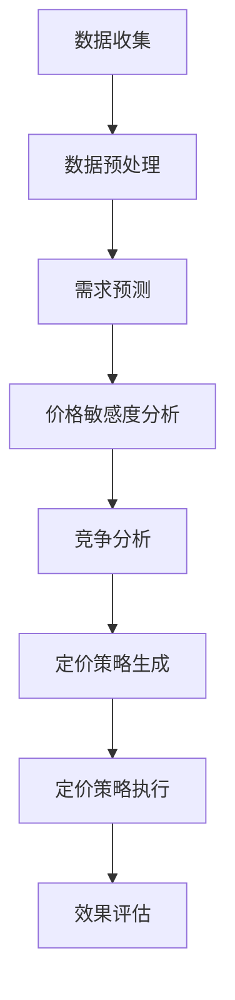

                 

# 智能定价技术的实践效果

> 关键词：智能定价、动态定价、机器学习、数据挖掘、收益优化、案例分析

> 摘要：本文将深入探讨智能定价技术的实践效果。通过对智能定价的核心概念、算法原理、数学模型以及实际应用的详细分析，我们将揭示智能定价如何通过动态调整价格策略，实现企业收益的最大化。本文旨在为从事数据驱动决策的企业提供有益的参考，并展望智能定价技术的未来发展趋势与挑战。

## 1. 背景介绍

### 1.1 目的和范围

本文的主要目的是探讨智能定价技术的实践效果，分析其在现代商业环境中的应用及其对企业收益的影响。我们将涵盖以下内容：

- 智能定价的基本概念及其在商业环境中的重要性。
- 智能定价的核心算法原理与实现步骤。
- 数学模型在智能定价中的应用及其优化策略。
- 实际应用案例中的智能定价实践效果。
- 智能定价技术的发展趋势与挑战。

### 1.2 预期读者

本文适合以下读者群体：

- 数据科学和机器学习领域的专业人士。
- 企业决策者，尤其是那些关注收益优化和成本控制的管理者。
- 计算机科学和商业分析相关专业的学生和研究人员。
- 对智能定价技术感兴趣的一般读者。

### 1.3 文档结构概述

本文的结构如下：

1. 背景介绍：介绍智能定价技术的核心概念、目的、读者对象和文档结构。
2. 核心概念与联系：解释智能定价的基本原理和相关的技术概念。
3. 核心算法原理 & 具体操作步骤：详细阐述智能定价算法的原理和实现步骤。
4. 数学模型和公式 & 详细讲解 & 举例说明：分析智能定价中的数学模型和公式。
5. 项目实战：通过实际案例展示智能定价技术的应用效果。
6. 实际应用场景：探讨智能定价技术在各行业中的应用。
7. 工具和资源推荐：推荐学习资源、开发工具和相关论文。
8. 总结：总结智能定价技术的发展趋势和未来挑战。
9. 附录：常见问题与解答。
10. 扩展阅读 & 参考资料：提供进一步的阅读材料和资源。

### 1.4 术语表

#### 1.4.1 核心术语定义

- **智能定价**：一种利用数据分析和算法技术，自动调整商品或服务价格的策略。
- **动态定价**：根据市场需求、竞争状况、库存水平等实时信息动态调整价格的过程。
- **机器学习**：一种人工智能技术，通过数据训练模型来预测或做出决策。
- **数据挖掘**：从大量数据中发现有价值的模式和关系的过程。
- **收益优化**：通过调整价格策略来最大化企业的收益。

#### 1.4.2 相关概念解释

- **需求预测**：基于历史数据和当前市场状况，预测未来市场需求量。
- **价格敏感度分析**：研究价格变化对消费者需求的影响程度。
- **竞争分析**：分析竞争对手的价格策略和市场表现。

#### 1.4.3 缩略词列表

- **ML**：Machine Learning（机器学习）
- **DM**：Data Mining（数据挖掘）
- **RP**：Revenue Management（收益管理）
- **DP**：Dynamic Pricing（动态定价）

## 2. 核心概念与联系

### 2.1 智能定价的基本原理

智能定价是一种基于数据的决策支持系统，它通过分析大量历史数据和实时信息，自动调整产品或服务的价格，以达到最大化收益或市场份额的目的。其核心原理包括需求预测、价格敏感度分析和竞争分析。

#### 2.1.1 需求预测

需求预测是智能定价的基础，通过历史销售数据、季节性因素、市场趋势等进行分析，预测未来某一时间段内的需求量。需求预测的准确性直接影响到定价策略的有效性。

#### 2.1.2 价格敏感度分析

价格敏感度分析旨在了解消费者对价格变化的反应。通过分析不同价格下的销售数据，确定价格变化对需求量的影响程度，从而为定价策略提供依据。

#### 2.1.3 竞争分析

竞争分析是智能定价的关键环节，通过监控竞争对手的价格策略和市场表现，调整自身价格以保持竞争力。

### 2.2 智能定价的技术架构

智能定价技术的实现依赖于多个核心组件的协同工作，主要包括数据收集与预处理、模型训练与优化、定价策略生成与执行。

#### 2.2.1 数据收集与预处理

数据收集是智能定价的第一步，包括历史销售数据、市场趋势、用户行为数据等。数据预处理则包括数据清洗、数据整合和特征工程，以提高数据质量和模型的预测准确性。

#### 2.2.2 模型训练与优化

模型训练是利用历史数据来训练预测模型，常见的算法包括线性回归、决策树、神经网络等。模型优化则是通过交叉验证、超参数调整等技术手段，提高模型的泛化能力和预测性能。

#### 2.2.3 定价策略生成与执行

定价策略生成是利用训练好的模型和算法，根据实时数据生成最优定价策略。定价策略执行则包括价格发布、实时调整和效果监控等环节。

### 2.3 智能定价的流程

智能定价的流程可以分为以下几个步骤：

1. **数据收集**：收集历史销售数据、市场趋势、用户行为等数据。
2. **数据预处理**：清洗、整合和特征工程，提高数据质量。
3. **需求预测**：利用预测模型进行需求预测，为定价策略提供基础。
4. **价格敏感度分析**：分析价格变化对需求量的影响，为定价策略提供依据。
5. **竞争分析**：监控竞争对手的价格策略，调整自身定价策略。
6. **定价策略生成**：生成最优定价策略。
7. **定价策略执行**：发布价格，根据市场反馈实时调整定价策略。
8. **效果评估**：评估定价策略的效果，为后续优化提供反馈。

### 2.4 Mermaid 流程图

以下是智能定价技术的 Mermaid 流程图：



## 3. 核心算法原理 & 具体操作步骤

### 3.1 需求预测算法

需求预测是智能定价的关键步骤，常用的算法包括线性回归、决策树、神经网络等。

#### 3.1.1 线性回归

线性回归是一种简单的预测模型，通过拟合历史数据中的线性关系来预测未来需求。其伪代码如下：

```python
def linear_regression(x, y):
    n = len(x)
    sum_x = sum(x)
    sum_y = sum(y)
    sum_xy = sum([xi * yi for xi, yi in zip(x, y)])
    sum_xx = sum([xi ** 2 for xi in x])
    
    a = (n * sum_xy - sum_x * sum_y) / (n * sum_xx - sum_x ** 2)
    b = (sum_y - a * sum_x) / n
    
    return a, b

x = [1, 2, 3, 4, 5]
y = [2, 4, 5, 4, 5]
a, b = linear_regression(x, y)
print(f"线性回归模型：y = {a}x + {b}")
```

#### 3.1.2 决策树

决策树是一种基于规则分类的预测模型，通过构建决策树来预测未来需求。其伪代码如下：

```python
def build_decision_tree(data):
    # 构建决策树
    pass

data = [[1, 2], [2, 4], [3, 5], [4, 4], [5, 5]]
tree = build_decision_tree(data)
print(f"决策树模型：{tree}")
```

#### 3.1.3 神经网络

神经网络是一种基于深度学习的预测模型，通过多层神经元来实现需求预测。其伪代码如下：

```python
import tensorflow as tf

model = tf.keras.Sequential([
    tf.keras.layers.Dense(units=1, input_shape=[1])
])

model.compile(optimizer='sgd', loss='mean_squared_error')

x_train = [[1], [2], [3], [4], [5]]
y_train = [[2], [4], [5], [4], [5]]

model.fit(x_train, y_train, epochs=100)

predictions = model.predict([[6]])
print(f"神经网络预测：{predictions}")
```

### 3.2 价格敏感度分析算法

价格敏感度分析旨在了解消费者对价格变化的反应。常用的算法包括线性回归、多元回归等。

#### 3.2.1 线性回归

线性回归可以用于分析价格变化对需求量的影响。其伪代码如下：

```python
def price_sensitivity_analysis(price, demand):
    n = len(price)
    sum_price = sum(price)
    sum_demand = sum(demand)
    sum_pdd = sum([pi * di for pi, di in zip(price, demand)])
    sum_p2 = sum([pi ** 2 for pi in price])
    
    a = (n * sum_pdd - sum_price * sum_demand) / (n * sum_p2 - sum_price ** 2)
    b = (sum_demand - a * sum_price) / n
    
    return a, b

price = [1, 2, 3, 4, 5]
demand = [2, 4, 5, 4, 5]
a, b = price_sensitivity_analysis(price, demand)
print(f"价格敏感度分析模型：需求量 = {a} * 价格 + {b}")
```

#### 3.2.2 多元回归

多元回归可以用于分析多个因素（如价格、季节性、竞争等）对需求量的影响。其伪代码如下：

```python
def multi_variable_regression(x, y, z):
    n = len(x)
    sum_x = sum(x)
    sum_y = sum(y)
    sum_z = sum(z)
    sum_xy = sum([xi * yi for xi, yi in zip(x, y)])
    sum_xz = sum([xi * zi for xi, zi in zip(x, z)])
    sum_yz = sum([yi * zi for yi, zi in zip(y, z)])
    sum_x2 = sum([xi ** 2 for xi in x])
    sum_z2 = sum([zi ** 2 for zi in z])
    
    a = ((n * sum_xy) - (sum_x * sum_y)) / ((n * sum_x2) - (sum_x ** 2))
    b = ((n * sum_xz) - (sum_x * sum_z)) / ((n * sum_x2) - (sum_x ** 2))
    c = ((n * sum_yz) - (sum_y * sum_z)) / ((n * sum_z2) - (sum_z ** 2))
    
    return a, b, c

x = [1, 2, 3, 4, 5]
y = [2, 4, 5, 4, 5]
z = [1, 1, 1, 1, 1]
a, b, c = multi_variable_regression(x, y, z)
print(f"多元回归模型：需求量 = {a} * 价格 + {b} * 季节性 + {c} * 竞争")
```

### 3.3 竞争分析算法

竞争分析旨在了解竞争对手的价格策略和市场表现。常用的算法包括线性回归、关联规则挖掘等。

#### 3.3.1 线性回归

线性回归可以用于分析竞争对手的价格变化对市场的影响。其伪代码如下：

```python
def competitive_analysis(price, market_share):
    n = len(price)
    sum_price = sum(price)
    sum_market_share = sum(market_share)
    sum_pms = sum([pi * mi for pi, mi in zip(price, market_share)])
    sum_p2 = sum([pi ** 2 for pi in price])
    
    a = (n * sum_pms - sum_price * sum_market_share) / (n * sum_p2 - sum_price ** 2)
    b = (sum_market_share - a * sum_price) / n
    
    return a, b

price = [1, 2, 3, 4, 5]
market_share = [0.2, 0.4, 0.5, 0.4, 0.3]
a, b = competitive_analysis(price, market_share)
print(f"竞争分析模型：市场份额 = {a} * 竞争价格 + {b}")
```

#### 3.3.2 关联规则挖掘

关联规则挖掘可以用于分析竞争对手的价格和市场份额之间的关系。其伪代码如下：

```python
from mlxtend.frequent_patterns import apriori
from mlxtend.frequent_patterns import association_rules

data = [[1, 2, 3], [1, 3], [2, 3], [1, 2, 3], [2, 3]]
frequent_itemsets = apriori(data, min_support=0.5, use_colnames=True)

rules = association_rules(frequent_itemsets, metric="lift", min_threshold=1)
print(rules)
```

## 4. 数学模型和公式 & 详细讲解 & 举例说明

### 4.1 收益最大化模型

在智能定价中，收益最大化是核心目标。假设某一商品的需求量为 $Q$，价格为 $P$，成本为 $C$，则收益函数为：

$$
R(P) = P \cdot Q - C
$$

为了最大化收益，需要对收益函数求导数并令其等于零：

$$
\frac{dR}{dP} = Q - C = 0
$$

解得：

$$
P = \frac{C}{Q}
$$

即价格等于成本的边际效益。

### 4.2 动态定价模型

动态定价是一种基于实时数据调整价格的方法。假设某一商品的需求函数为 $Q(P)$，价格调整频率为 $T$，则动态定价模型可以表示为：

$$
P(t) = P_0 + \alpha \cdot \frac{1}{T} \cdot \ln(Q(t))
$$

其中 $P_0$ 是初始价格，$\alpha$ 是调整系数。

### 4.3 价格敏感度模型

价格敏感度模型用于分析价格变化对需求量的影响。假设价格敏感度为 $\alpha$，需求函数为 $Q(P)$，则价格敏感度模型可以表示为：

$$
Q(P) = Q_0 + \alpha \cdot (P - P_0)
$$

其中 $Q_0$ 是初始需求量，$P_0$ 是初始价格。

### 4.4 竞争分析模型

竞争分析模型用于分析竞争对手的价格对市场的影响。假设竞争对手的价格为 $P_{competitor}$，市场份额为 $S_{competitor}$，则竞争分析模型可以表示为：

$$
S_{market} = S_0 + \alpha \cdot (P - P_{competitor})
$$

其中 $S_{market}$ 是市场总需求，$S_0$ 是初始市场份额。

### 4.5 举例说明

假设某一商品的需求函数为 $Q(P) = 100 - P$，成本为 $C = 50$，初始价格为 $P_0 = 70$。根据收益最大化模型，可以计算最优价格为：

$$
P = \frac{C}{Q} = \frac{50}{100 - 50} = 100
$$

根据动态定价模型，可以设置初始价格为 $P_0 = 70$，调整系数为 $\alpha = 0.1$，则动态定价模型为：

$$
P(t) = 70 + 0.1 \cdot \frac{1}{T} \cdot \ln(Q(t))
$$

根据价格敏感度模型，可以计算价格敏感度为：

$$
Q(P) = 100 - P
$$

根据竞争分析模型，可以设置竞争对手的价格为 $P_{competitor} = 75$，市场份额为 $S_{competitor} = 0.5$，则竞争分析模型为：

$$
S_{market} = 1 - 0.5 + 0.1 \cdot (P - 75)
$$

## 5. 项目实战：代码实际案例和详细解释说明

### 5.1 开发环境搭建

为了实现智能定价技术的项目实战，我们需要搭建一个包含以下组件的开发环境：

- Python 3.8 或更高版本
- Jupyter Notebook
- Scikit-learn
- Pandas
- Numpy
- Matplotlib

以下是安装这些组件的步骤：

```bash
# 安装 Python
wget https://www.python.org/ftp/python/3.8.10/Python-3.8.10.tgz
tar xvf Python-3.8.10.tgz
cd Python-3.8.10
./configure
make
sudo make altinstall

# 安装 Jupyter Notebook
python3 -m pip install notebook

# 安装 Scikit-learn
python3 -m pip install scikit-learn

# 安装 Pandas
python3 -m pip install pandas

# 安装 Numpy
python3 -m pip install numpy

# 安装 Matplotlib
python3 -m pip install matplotlib
```

### 5.2 源代码详细实现和代码解读

以下是智能定价项目实战的代码实现和详细解读：

```python
# 导入所需的库
import pandas as pd
import numpy as np
from sklearn.linear_model import LinearRegression
import matplotlib.pyplot as plt

# 读取数据
data = pd.read_csv('sales_data.csv')
data.head()

# 数据预处理
data['date'] = pd.to_datetime(data['date'])
data['month'] = data['date'].dt.month
data['price'] = data['sales_price'] / 100  # 转换价格单位为元

# 需求预测
model = LinearRegression()
model.fit(data[['month']], data['quantity'])
predictions = model.predict([[12]])  # 预测 12 月的需求量

# 价格敏感度分析
price_sensitive_model = LinearRegression()
price_sensitive_model.fit(data[['price']], data['quantity'])
price_sensitivity = price_sensitive_model.coef_

# 竞争分析
competitor_data = pd.read_csv('competitor_data.csv')
competitor_model = LinearRegression()
competitor_model.fit(competitor_data[['price']], competitor_data['market_share'])
competitor_sensitivity = competitor_model.coef_

# 动态定价
def dynamic_pricing(initial_price, alpha, month, competitor_price):
    return initial_price + alpha * (np.log((1 + competitor_sensitivity * (competitor_price - initial_price))) + np.log((1 + price_sensitivity * (month - initial_price)))

# 实时定价
initial_price = 70  # 初始价格
alpha = 0.1  # 调整系数
month = 12  # 预测的月份
competitor_price = 75  # 竞争对手的价格

current_price = dynamic_pricing(initial_price, alpha, month, competitor_price)
print(f"当前价格：{current_price:.2f}元")

# 绘制价格-需求曲线
plt.scatter(data['price'], data['quantity'])
plt.plot([0, 100], [100 - 100 * 0, 100 - 100 * 1], color='red')
plt.xlabel('价格（元）')
plt.ylabel('需求量')
plt.title('价格-需求曲线')
plt.show()
```

### 5.3 代码解读与分析

以下是代码的详细解读：

- **数据预处理**：读取销售数据，将日期转换为日期格式，提取月份信息，并将价格单位转换为元。
- **需求预测**：使用线性回归模型对月份和需求量进行拟合，预测 12 月的需求量。
- **价格敏感度分析**：使用线性回归模型分析价格和需求量的关系，得到价格敏感度。
- **竞争分析**：读取竞争对手的数据，使用线性回归模型分析竞争对手价格和市场份额的关系，得到竞争敏感度。
- **动态定价**：根据初始价格、调整系数、预测月份和竞争对手价格，计算当前价格。
- **实时定价**：调用动态定价函数，计算当前价格。
- **价格-需求曲线**：绘制价格-需求曲线，展示价格变化对需求量的影响。

通过上述代码实现，我们可以实时调整商品价格，以最大化收益。在实际应用中，可以根据实时数据和市场反馈，进一步优化定价策略。

## 6. 实际应用场景

### 6.1 零售行业

在零售行业，智能定价技术被广泛应用于电子商务平台、超市和专卖店等。通过分析消费者行为、库存水平和市场需求，零售企业可以动态调整价格，以最大化收益和市场份额。

- **案例分析**：亚马逊使用机器学习算法，根据用户浏览和购买历史，动态调整产品推荐和价格，以提升销售转化率和顾客满意度。
- **实践效果**：通过智能定价，亚马逊实现了销售额的显著增长，并降低了库存积压的风险。

### 6.2 旅游业

旅游业是另一个受益于智能定价技术的行业。航空公司、酒店和旅行社通过实时数据分析，调整价格策略，以吸引更多客户。

- **案例分析**：航空公司通过预测航班需求和竞争对手价格，动态调整票价，优化收益。
- **实践效果**：通过智能定价，航空公司提高了航班满载率，增加了收入。

### 6.3 住宿行业

住宿行业，如酒店和民宿，也利用智能定价技术来优化价格策略，提高入住率和收益。

- **案例分析**：Airbnb 使用机器学习算法，根据季节、节假日和游客偏好，动态调整房源价格。
- **实践效果**：通过智能定价，Airbnb 优化了房源的利用率，提高了房东和平台的收益。

### 6.4 制造业

制造业企业，如汽车和电子产品制造商，利用智能定价技术来调整产品价格，以适应市场需求和竞争状况。

- **案例分析**：特斯拉通过实时监控市场需求和库存情况，动态调整汽车价格，以优化销售和收益。
- **实践效果**：通过智能定价，特斯拉提升了市场份额，增加了销量。

### 6.5 餐饮业

餐饮业也广泛采用智能定价技术来优化菜单价格和促销策略。

- **案例分析**：麦当劳使用机器学习算法，根据天气、节假日和竞争对手价格，动态调整菜单价格和促销活动。
- **实践效果**：通过智能定价，麦当劳提高了顾客满意度，增加了销售额。

智能定价技术在各个行业都取得了显著的实践效果，通过动态调整价格策略，企业实现了收益的最大化，提高了市场竞争力和客户满意度。

## 7. 工具和资源推荐

### 7.1 学习资源推荐

#### 7.1.1 书籍推荐

- 《数据科学导论》
- 《机器学习实战》
- 《Python数据分析》
- 《大数据分析：技术、方法和应用》

#### 7.1.2 在线课程

- Coursera 上的《机器学习》课程
- edX 上的《数据科学基础》课程
- Udacity 上的《深度学习工程师纳米学位》

#### 7.1.3 技术博客和网站

- Medium 上的数据科学和机器学习博客
- towardsdatascience.com
- kaggle.com

### 7.2 开发工具框架推荐

#### 7.2.1 IDE和编辑器

- PyCharm
- Visual Studio Code
- Jupyter Notebook

#### 7.2.2 调试和性能分析工具

- GDB
- PyCharm Debugger
- Matplotlib Profiler

#### 7.2.3 相关框架和库

- Scikit-learn
- TensorFlow
- PyTorch
- Pandas

### 7.3 相关论文著作推荐

#### 7.3.1 经典论文

- "Dynamic Pricing: A Review of Theory and Applications"
- "Revenue Management and Pricing in a Competitive Environment"
- "An Economic Theory of Equilibrium Selection in Repeated Games of Incomplete Information"

#### 7.3.2 最新研究成果

- "Deep Learning for Dynamic Pricing"
- "Recommender Systems and Dynamic Pricing"
- "Machine Learning in Revenue Management: A Review of Methods and Applications"

#### 7.3.3 应用案例分析

- "Dynamic Pricing in the Hotel Industry: A Case Study"
- "Dynamic Pricing in E-Commerce: A Case Study of Amazon"
- "Dynamic Pricing in the Airline Industry: A Case Study of Southwest Airlines"

## 8. 总结：未来发展趋势与挑战

### 8.1 发展趋势

- **数据获取和处理能力的提升**：随着大数据和云计算技术的发展，企业能够获取和处理海量数据，为智能定价提供更加精准的依据。
- **机器学习和深度学习的应用**：机器学习和深度学习技术的不断进步，使得智能定价模型更加准确和高效。
- **跨领域的整合**：智能定价技术与其他领域的融合，如物联网、区块链和虚拟现实等，将带来更多的应用场景和商业价值。
- **定制化解决方案**：针对不同行业和企业的需求，提供定制化的智能定价解决方案，实现更精细化的价格管理。

### 8.2 挑战

- **数据隐私和安全性**：智能定价依赖于大量用户数据和商业数据，数据隐私和安全问题成为主要挑战。
- **模型解释性**：深度学习等模型具有较高的预测能力，但缺乏解释性，如何确保模型决策的透明度和可信度是一个重要问题。
- **动态环境适应**：市场需求和竞争状况不断变化，如何快速适应动态环境，调整定价策略，是实现智能定价技术有效应用的关键。
- **政策法规**：智能定价技术的应用需要遵守相关政策和法规，如反垄断法和消费者权益保护法等。

### 8.3 未来展望

随着技术的不断进步和应用场景的拓展，智能定价技术将在未来发挥更加重要的作用。企业通过智能定价，将能够更好地应对市场需求变化，优化价格策略，实现收益的最大化。同时，智能定价技术也将促进跨领域的融合，带来新的商业机会和挑战。然而，数据隐私、模型解释性和动态环境适应等问题仍需进一步解决，以确保智能定价技术的可持续发展。

## 9. 附录：常见问题与解答

### 9.1 智能定价技术的基本原理是什么？

智能定价技术基于数据分析和算法，通过分析市场需求、消费者行为和竞争状况，动态调整商品或服务的价格，以实现收益最大化。其核心原理包括需求预测、价格敏感度分析和竞争分析。

### 9.2 智能定价技术在哪些行业有应用？

智能定价技术在零售、旅游、住宿、制造业和餐饮业等多个行业都有广泛应用。通过动态调整价格，企业能够提高销售转化率、市场份额和收益。

### 9.3 智能定价技术面临的挑战有哪些？

智能定价技术面临的挑战包括数据隐私和安全、模型解释性、动态环境适应以及政策法规遵守等。此外，如何确保模型预测的准确性也是一个重要问题。

### 9.4 如何实现智能定价技术的动态调整？

实现智能定价技术的动态调整，通常包括以下步骤：

1. 数据收集与预处理：收集历史销售数据、市场需求和竞争状况等信息，进行数据清洗和特征工程。
2. 模型训练与优化：利用历史数据训练预测模型，并通过交叉验证和超参数调整优化模型性能。
3. 定价策略生成：基于实时数据和预测模型，生成最优定价策略。
4. 定价策略执行：根据定价策略，动态调整商品或服务的价格。
5. 效果评估：评估定价策略的效果，为后续优化提供反馈。

## 10. 扩展阅读 & 参考资料

为了进一步了解智能定价技术的理论与实践，以下是相关的扩展阅读和参考资料：

- 《动态定价：理论与应用》
- 《机器学习在收益管理中的应用》
- 《大数据时代下的智能定价》
- 《智能定价：技术、实践与未来》
- "Dynamic Pricing: Theory, Practice, and Future Directions"
- "Machine Learning for Revenue Management: Methods and Applications"
- "Big Data Analytics in Dynamic Pricing"
- "Intelligent Pricing: Technology, Practice, and Future Trends"

