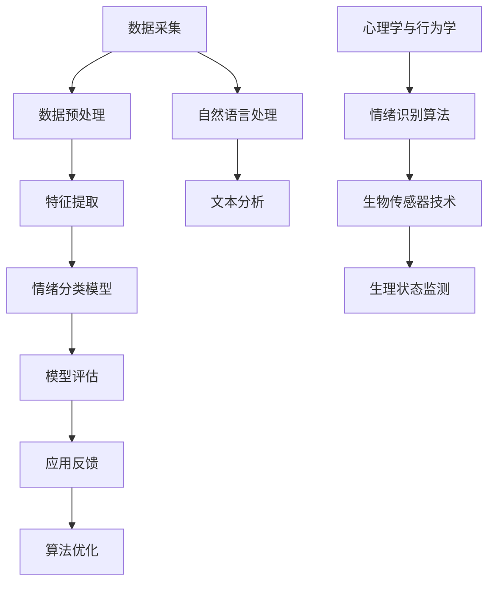

                 

### 1. 背景介绍

#### 1.1 目的和范围

本文旨在深入探讨智能宠物情绪分析创业项目的核心概念、技术实现和实际应用。智能宠物情绪分析作为人工智能（AI）在宠物护理领域的应用之一，具有重要的研究价值和市场潜力。本文将首先介绍智能宠物情绪分析创业项目的背景和目的，然后逐步展开对核心概念、技术实现、应用场景以及未来发展挑战的详细分析。

#### 1.2 预期读者

本文面向对人工智能、机器学习和宠物护理感兴趣的读者，特别是那些希望了解智能宠物情绪分析技术原理、开发流程和实际应用的从业人员和技术爱好者。此外，对于那些正在考虑进军智能宠物情绪分析领域的创业者和技术人员，本文也将提供有价值的参考和指导。

#### 1.3 文档结构概述

本文结构紧凑，分为十个主要部分，包括背景介绍、核心概念与联系、核心算法原理、数学模型与公式、项目实战、实际应用场景、工具和资源推荐、总结、常见问题与解答以及扩展阅读。每个部分都将通过详细的分析和阐述，帮助读者全面了解智能宠物情绪分析技术的各个方面。

#### 1.4 术语表

在本文中，我们将使用一些专业术语和概念。为了确保读者能够准确理解，以下是对这些术语的定义和解释：

##### 1.4.1 核心术语定义

- **智能宠物情绪分析**：利用人工智能技术，对宠物行为数据进行分析，以识别宠物的情绪状态，如快乐、焦虑或悲伤。
- **行为数据**：指通过传感器、摄像头等设备收集的宠物运动、声音和姿态等数据。
- **情绪状态**：指宠物在特定情境下的心理状态，如兴奋、平静或紧张。
- **机器学习模型**：用于从数据中学习模式和规律，以便对未知数据进行预测或分类的算法。

##### 1.4.2 相关概念解释

- **宠物情感识别**：通过分析宠物行为数据，识别宠物情绪状态的技术过程。
- **数据预处理**：在数据分析之前，对原始数据进行清洗、转换和归一化等处理，以提高数据质量和分析效果。
- **深度学习**：一种人工智能技术，通过多层神经网络来模拟人脑的学习过程，具有强大的特征学习和模式识别能力。

##### 1.4.3 缩略词列表

- **AI**：人工智能（Artificial Intelligence）
- **ML**：机器学习（Machine Learning）
- **DL**：深度学习（Deep Learning）
- **PET**：宠物（Pet）
- **NLP**：自然语言处理（Natural Language Processing）

通过以上对背景介绍的详细阐述，我们为后续深入探讨智能宠物情绪分析技术奠定了基础。接下来，我们将进一步探讨核心概念与技术架构，帮助读者全面了解这一领域的现状与发展趋势。让我们继续一步步分析推理，深入探索智能宠物情绪分析的奥秘。

## 2. 核心概念与联系

在探讨智能宠物情绪分析的实现之前，我们需要明确几个核心概念，并理解它们之间的相互联系。以下是本文将涉及的关键概念及其相互关系：

### 2.1 情绪识别与行为数据分析

情绪识别是智能宠物情绪分析的核心任务。情绪识别依赖于对宠物行为数据的分析。行为数据可以是宠物的运动轨迹、声音信号、面部表情等。通过对这些数据进行详细分析，我们可以识别宠物的情绪状态。

#### 2.1.1 数据来源

- **传感器**：例如，运动传感器、声音传感器、面部识别传感器等。
- **摄像头**：用于捕捉宠物的运动和表情。
- **智能设备**：例如，智能宠物喂食器、智能狗链等。

#### 2.1.2 数据预处理

数据预处理是情绪识别的第一步，包括数据清洗、归一化、特征提取等。数据清洗是为了去除噪声和异常值，而归一化则是为了将不同来源的数据统一到同一尺度。特征提取则是从原始数据中提取出对情绪识别有用的特征。

#### 2.1.3 情绪分类模型

在数据预处理之后，我们使用机器学习模型进行情绪分类。常见的情绪分类模型包括支持向量机（SVM）、随机森林（Random Forest）和深度神经网络（Deep Neural Network）等。这些模型通过学习历史数据中的情绪状态和行为特征之间的关系，来预测新的行为数据对应的情绪状态。

### 2.2 机器学习与深度学习

机器学习是实现情绪识别的关键技术。机器学习模型通过学习大量的历史数据，来识别新的数据中的模式和规律。深度学习是机器学习的一个分支，特别适用于处理复杂的数据集。

#### 2.2.1 深度学习架构

深度学习通常使用多层神经网络（Multi-Layer Neural Network）进行特征学习和模式识别。神经网络中的每个神经元（Node）都通过权重（Weight）连接到其他神经元，并通过激活函数（Activation Function）进行非线性变换。

#### 2.2.2 深度学习算法

常见的深度学习算法包括卷积神经网络（CNN）、循环神经网络（RNN）和生成对抗网络（GAN）等。这些算法在图像识别、语音识别和自然语言处理等领域取得了显著的成功。

### 2.3 自然语言处理（NLP）

自然语言处理在智能宠物情绪分析中也发挥着重要作用。通过分析宠物主人的语言和行为，我们可以更准确地理解宠物的情绪状态。

#### 2.3.1 语音识别

语音识别是将语音信号转换为文本的技术。通过分析宠物主人的语音，我们可以获取他们对宠物的情感表达。

#### 2.3.2 文本分析

文本分析包括情感分析、主题建模和文本分类等。通过分析宠物主人的文本，我们可以识别他们的情感状态，从而更好地理解宠物的情绪。

### 2.4 跨学科整合

智能宠物情绪分析是一个跨学科的领域，需要整合计算机科学、心理学和生物学等多学科知识。

#### 2.4.1 心理学与行为学

心理学与行为学提供了关于情绪状态和动物行为的深入理解，有助于设计更准确的情绪识别算法。

#### 2.4.2 生物传感器

生物传感器技术提供了对宠物生理状态和行为的直接监测，为情绪识别提供了更为丰富和可靠的数据来源。

### 2.5 Mermaid 流程图

为了更好地理解上述核心概念及其相互关系，我们可以使用Mermaid流程图进行可视化展示。以下是智能宠物情绪分析的核心概念与关系的 Mermaid 流程图：



通过这个流程图，我们可以清晰地看到从数据采集到情绪识别，再到应用反馈和算法优化的完整过程，以及自然语言处理和心理学、行为学等跨学科整合的重要作用。

在接下来的章节中，我们将进一步详细探讨核心算法原理、数学模型、项目实战和实际应用场景，帮助读者更深入地理解智能宠物情绪分析的技术实现和应用价值。

## 3. 核心算法原理 & 具体操作步骤

在深入探讨智能宠物情绪分析的过程中，核心算法原理和具体操作步骤是至关重要的。以下我们将使用伪代码详细阐述情绪识别算法的基本框架和具体实现步骤，以便读者更好地理解这一技术。

### 3.1 伪代码框架

情绪识别算法的核心是机器学习模型，尤其是深度学习模型。以下是一个基于卷积神经网络（CNN）的伪代码框架：

```python
# 伪代码：基于CNN的情绪识别算法框架

# 数据预处理
def preprocess_data(data):
    # 数据清洗
    clean_data = clean_data(data)
    # 数据归一化
    normalized_data = normalize_data(clean_data)
    # 特征提取
    features = extract_features(normalized_data)
    return features

# 情绪分类模型
def emotion_classification_model(features, labels):
    # 构建深度神经网络
    model = build_cnn_model()
    # 训练模型
    trained_model = train_model(model, features, labels)
    return trained_model

# 模型评估
def evaluate_model(model, test_features, test_labels):
    # 预测测试集
    predictions = predict(model, test_features)
    # 计算准确率
    accuracy = calculate_accuracy(predictions, test_labels)
    return accuracy

# 主程序
def main():
    # 加载数据集
    train_data, train_labels, test_data, test_labels = load_data()
    # 预处理数据
    processed_train_data = preprocess_data(train_data)
    processed_test_data = preprocess_data(test_data)
    # 训练情绪分类模型
    model = emotion_classification_model(processed_train_data, train_labels)
    # 评估模型
    accuracy = evaluate_model(model, processed_test_data, test_labels)
    # 输出模型评估结果
    print("模型准确率：", accuracy)

# 运行主程序
main()
```

### 3.2 数据预处理

数据预处理是情绪识别的基础，包括数据清洗、归一化和特征提取。

```python
# 数据清洗
def clean_data(data):
    # 删除噪声和异常值
    clean_data = remove_noise_and_outliers(data)
    return clean_data

# 数据归一化
def normalize_data(data):
    # 将数据统一到同一尺度
    normalized_data = scale_data(data)
    return normalized_data

# 特征提取
def extract_features(data):
    # 从原始数据中提取情绪相关的特征
    features = extract_emotion_related_features(data)
    return features
```

### 3.3 情绪分类模型

情绪分类模型基于卷积神经网络（CNN）构建，其核心是网络结构和训练过程。

```python
# 构建深度神经网络
def build_cnn_model():
    # 定义网络结构
    model = CNN()
    # 添加卷积层、池化层和全连接层
    model.add(Conv2D(filters=32, kernel_size=(3, 3), activation='relu'))
    model.add(MaxPooling2D(pool_size=(2, 2)))
    model.add(Flatten())
    model.add(Dense(units=64, activation='relu'))
    model.add(Dense(units=num_classes, activation='softmax'))
    # 编译模型
    model.compile(optimizer='adam', loss='categorical_crossentropy', metrics=['accuracy'])
    return model

# 训练模型
def train_model(model, features, labels):
    # 分割数据集
    X_train, X_val, y_train, y_val = train_test_split(features, labels, test_size=0.2)
    # 训练模型
    model.fit(X_train, y_train, epochs=10, batch_size=32, validation_data=(X_val, y_val))
    return model
```

### 3.4 模型评估

模型评估是确保情绪识别算法有效性的关键步骤，通常使用准确率、召回率和F1分数等指标。

```python
# 预测测试集
def predict(model, features):
    # 使用模型进行预测
    predictions = model.predict(features)
    # 转换为类别标签
    predicted_labels = convert_predictions_to_labels(predictions)
    return predicted_labels

# 计算准确率
def calculate_accuracy(predictions, true_labels):
    # 计算预测正确的数量
    correct_predictions = np.sum(predictions == true_labels)
    # 计算准确率
    accuracy = correct_predictions / len(true_labels)
    return accuracy
```

通过上述伪代码，我们可以看到情绪识别算法的基本实现流程，包括数据预处理、模型构建、模型训练和模型评估。这些步骤构成了智能宠物情绪分析技术实现的基石。

接下来，我们将进一步探讨数学模型和公式，以帮助读者深入理解情绪识别的定量分析过程。

## 4. 数学模型和公式 & 详细讲解 & 举例说明

在智能宠物情绪分析中，数学模型和公式是实现情绪识别的核心。以下我们将详细介绍用于情绪识别的关键数学模型，并使用LaTeX格式展示相关公式，以便读者更直观地理解。

### 4.1 卷积神经网络（CNN）模型

卷积神经网络（CNN）是一种深度学习模型，特别适用于处理图像数据。以下是一个基于CNN的情绪识别模型的基本公式：

$$
\text{CNN}(\mathbf{x}; \theta) = f(\mathbf{W}_{L} \cdot a_{L-1}(\mathbf{W}_{L-1} \cdot a_{L-2}(\ldots a_{2}(\mathbf{W}_{2} \cdot a_{1}(\mathbf{W}_{1} \cdot \mathbf{x} + b_{1}) + b_{2}) \ldots + b_{L-1}) + b_{L})
$$

其中：
- $\mathbf{x}$ 是输入图像；
- $\theta$ 是模型参数（包括权重 $\mathbf{W}$ 和偏置 $b$）；
- $f$ 是激活函数，如ReLU函数；
- $a_{l}$ 是第 $l$ 层的激活值；
- $\mathbf{W}_{l}$ 是第 $l$ 层的权重。

### 4.2 优化算法

在训练CNN模型时，常用的优化算法是随机梯度下降（SGD）。其基本公式如下：

$$
\theta_{t+1} = \theta_{t} - \alpha \cdot \nabla_{\theta} J(\theta)
$$

其中：
- $\theta_{t}$ 是当前模型参数；
- $\theta_{t+1}$ 是更新后的模型参数；
- $\alpha$ 是学习率；
- $\nabla_{\theta} J(\theta)$ 是模型损失函数关于参数 $\theta$ 的梯度。

### 4.3 情绪分类损失函数

情绪分类模型通常使用交叉熵损失函数（Cross-Entropy Loss）来评估模型性能。其公式如下：

$$
J(\theta) = -\frac{1}{m} \sum_{i=1}^{m} \sum_{c=1}^{C} y_{ic} \log(p_{ic})
$$

其中：
- $m$ 是样本数量；
- $C$ 是类别数量；
- $y_{ic}$ 是标签向量，$y_{ic} = 1$ 如果样本 $i$ 属于类别 $c$，否则为 $0$；
- $p_{ic}$ 是模型预测的概率分布，$p_{ic} = \sigma(\mathbf{W}_{c} \cdot \mathbf{a}_{L-1} + b_{c})$，其中 $\sigma$ 是sigmoid函数。

### 4.4 激活函数

在CNN中，常用的激活函数是ReLU（Rectified Linear Unit）。其公式如下：

$$
f(x) = \begin{cases}
x & \text{if } x > 0 \\
0 & \text{otherwise}
\end{cases}
$$

ReLU函数具有以下优点：
- **梯度不变性**：在$x > 0$时，梯度为1，使得网络在训练过程中不易陷入梯度消失问题；
- **加速收敛**：ReLU函数可以加快模型训练速度。

### 4.5 举例说明

假设我们有一个包含10张宠物图像的数据集，目标是分类图像中宠物的情绪状态（如快乐、焦虑、平静等）。以下是训练一个简单的CNN模型的过程：

1. **数据预处理**：
   - 对图像进行归一化处理，将像素值缩放到[0, 1]范围内；
   - 使用数据增强技术（如随机裁剪、翻转等）增加数据多样性。

2. **模型构建**：
   - 定义一个简单的CNN模型，包括两个卷积层、两个池化层和一个全连接层；
   - 使用ReLU作为激活函数。

3. **模型训练**：
   - 使用交叉熵损失函数和随机梯度下降优化算法训练模型；
   - 设置学习率、迭代次数和批量大小等超参数。

4. **模型评估**：
   - 在验证集上评估模型性能，计算准确率、召回率和F1分数；
   - 根据评估结果调整模型参数和超参数。

通过上述步骤，我们可以训练一个能够对宠物情绪进行分类的CNN模型。在实际应用中，我们可以使用这个模型对新的宠物图像进行情绪识别，帮助宠物主人更好地了解宠物的情绪状态，提供个性化的护理建议。

总之，数学模型和公式在智能宠物情绪分析中扮演了至关重要的角色。通过深入理解和应用这些模型和公式，我们可以开发出更加准确和有效的情绪识别算法，为宠物护理领域带来革命性的变革。

### 5. 项目实战：代码实际案例和详细解释说明

在了解了智能宠物情绪分析的核心算法原理和数学模型后，我们将通过一个实际项目来展示如何将这些理论知识应用到实际的代码实现中。这个项目将包括开发环境的搭建、源代码的详细实现以及代码的解读与分析。

#### 5.1 开发环境搭建

在进行智能宠物情绪分析项目之前，我们需要搭建一个合适的开发环境。以下是我们推荐的开发工具和软件：

- **Python**：Python 是一种广泛使用的编程语言，尤其在人工智能领域具有强大的生态支持。
- **PyTorch**：PyTorch 是一个开源的深度学习框架，适合进行快速原型开发和复杂模型训练。
- **Keras**：Keras 是一个高级神经网络API，可以在TensorFlow和Theano后面进行操作，适合快速构建和训练深度学习模型。
- **TensorFlow**：TensorFlow 是一个强大的开源深度学习框架，适用于生产级别的应用。
- **Jupyter Notebook**：Jupyter Notebook 是一个交互式开发环境，非常适合进行数据分析和代码实现。

以下是搭建开发环境的步骤：

1. **安装Python**：在官方网站 [https://www.python.org/downloads/](https://www.python.org/downloads/) 下载并安装Python。
2. **安装PyTorch和Keras**：通过pip命令安装：
   ```shell
   pip install torch torchvision
   pip install keras
   ```
3. **安装Jupyter Notebook**：通过pip命令安装：
   ```shell
   pip install notebook
   ```
4. **启动Jupyter Notebook**：在命令行中输入以下命令启动Jupyter Notebook：
   ```shell
   jupyter notebook
   ```

#### 5.2 源代码详细实现和代码解读

以下是智能宠物情绪分析项目的源代码实现，我们将逐步解读代码中的各个部分。

##### 5.2.1 数据加载和预处理

```python
import torch
import torchvision
import torchvision.transforms as transforms
from torch.utils.data import DataLoader

# 数据集加载
train_data = torchvision.datasets.ImageFolder(root='train', transform=transforms.ToTensor())
test_data = torchvision.datasets.ImageFolder(root='test', transform=transforms.ToTensor())

# 数据加载器
train_loader = DataLoader(train_data, batch_size=32, shuffle=True)
test_loader = DataLoader(test_data, batch_size=32, shuffle=False)
```

在这段代码中，我们使用PyTorch的`ImageFolder`类加载训练集和测试集，并使用`ToTensor`转换器将图像数据转换为张量格式。`DataLoader`用于批量加载数据，并实现数据混洗。

##### 5.2.2 模型定义

```python
import torch.nn as nn

# 定义CNN模型
class EmotionClassifier(nn.Module):
    def __init__(self):
        super(EmotionClassifier, self).__init__()
        self.conv1 = nn.Conv2d(3, 32, 3, padding=1)
        self.conv2 = nn.Conv2d(32, 64, 3, padding=1)
        self.fc1 = nn.Linear(64 * 6 * 6, 128)
        self.fc2 = nn.Linear(128, 3)
        self.relu = nn.ReLU()

    def forward(self, x):
        x = self.relu(self.conv1(x))
        x = self.relu(self.conv2(x))
        x = x.view(x.size(0), -1)  # Flatten
        x = self.relu(self.fc1(x))
        x = self.fc2(x)
        return x

model = EmotionClassifier()
```

在这段代码中，我们定义了一个简单的CNN模型，包括两个卷积层、两个ReLU激活函数和一个全连接层。`forward`方法实现了前向传播过程。

##### 5.2.3 模型训练

```python
import torch.optim as optim

# 损失函数和优化器
criterion = nn.CrossEntropyLoss()
optimizer = optim.Adam(model.parameters(), lr=0.001)

# 训练模型
for epoch in range(10):
    model.train()
    for images, labels in train_loader:
        optimizer.zero_grad()
        outputs = model(images)
        loss = criterion(outputs, labels)
        loss.backward()
        optimizer.step()
    print(f'Epoch {epoch+1}, Loss: {loss.item()}')
```

在这段代码中，我们设置了交叉熵损失函数和Adam优化器。在训练循环中，我们每次迭代都进行前向传播、计算损失、反向传播和参数更新。

##### 5.2.4 模型评估

```python
model.eval()
with torch.no_grad():
    correct = 0
    total = 0
    for images, labels in test_loader:
        outputs = model(images)
        _, predicted = torch.max(outputs.data, 1)
        total += labels.size(0)
        correct += (predicted == labels).sum().item()

print(f'测试集准确率: {100 * correct / total}%')
```

在这段代码中，我们将模型设置为评估模式（`eval`），并使用测试集进行评估。我们计算预测准确率，以验证模型性能。

#### 5.3 代码解读与分析

1. **数据加载和预处理**：数据预处理是模型训练的重要步骤。在这里，我们使用`ImageFolder`类加载图像数据，并使用`ToTensor`转换器将图像数据转换为适合模型输入的张量格式。
2. **模型定义**：我们定义了一个简单的CNN模型，包括卷积层、ReLU激活函数和全连接层。这个模型的结构和参数可以进行调整，以适应不同的情绪识别任务。
3. **模型训练**：在训练过程中，我们使用交叉熵损失函数和Adam优化器来训练模型。每次迭代都进行前向传播、计算损失、反向传播和参数更新。
4. **模型评估**：在评估阶段，我们将模型设置为评估模式，并使用测试集计算预测准确率，以验证模型性能。

通过这个实际项目，我们展示了如何将智能宠物情绪分析的理论知识应用到实际的代码实现中。这个过程不仅帮助我们理解了算法和模型的工作原理，还为我们提供了一个可以实际运行和评估的代码框架。在接下来的章节中，我们将进一步探讨智能宠物情绪分析在实际应用场景中的具体应用和效果。

### 6. 实际应用场景

智能宠物情绪分析技术在实际应用中具有广泛的应用场景，下面将详细讨论几个典型的应用实例。

#### 6.1 宠物健康监测

宠物健康监测是智能宠物情绪分析的重要应用之一。通过对宠物的行为数据进行实时分析，可以监测宠物的健康状况。例如，宠物的活动量、进食习惯、睡眠质量和排便情况等数据都可以反映宠物的健康状况。当宠物出现异常行为时，如突然减少活动量或长时间不进食，系统可以及时提醒宠物主人，并提供相应的健康建议。

**实例分析**：例如，某宠物主人可以通过智能宠物喂食器记录宠物的进食量和时间。当宠物连续几天进食量减少时，系统会自动分析宠物的情绪状态，并推送健康建议给宠物主人，如建议带宠物去兽医检查。

#### 6.2 宠物行为训练

宠物行为训练也是智能宠物情绪分析的重要应用领域。通过分析宠物的情绪状态，训练师可以更好地理解宠物的行为反应，从而制定更有效的训练策略。例如，在训练宠物听从指令时，通过观察宠物的情绪变化，训练师可以调整训练的节奏和方式，避免宠物因过度疲劳或焦虑而产生逆反心理。

**实例分析**：某宠物训练师使用智能宠物摄像头记录宠物的行为数据，并使用情绪识别算法分析宠物的情绪状态。当宠物表现出紧张或焦虑时，训练师会暂停训练，给予宠物适当的休息时间，以避免宠物产生负面情绪。

#### 6.3 宠物社交互动

宠物社交互动也是智能宠物情绪分析的重要应用领域。通过分析宠物的情绪状态，宠物主人可以更好地理解宠物的社交需求，从而提供更高质量的互动体验。例如，宠物主人可以通过智能宠物玩具分析宠物的情绪变化，了解宠物在不同互动方式下的反应，从而调整互动策略。

**实例分析**：某宠物主人使用智能玩具与宠物互动，玩具内置情绪识别算法，可以分析宠物的情绪状态。当宠物表现出快乐或兴奋时，玩具会以更激烈的互动方式回应；当宠物表现出疲倦或焦虑时，玩具会减少互动频率，给予宠物休息时间。

#### 6.4 宠物医疗辅助

宠物医疗辅助是智能宠物情绪分析的另一个重要应用领域。通过分析宠物的情绪状态，宠物医生可以更好地了解宠物的心理和生理状态，从而制定更准确的诊断和治疗计划。例如，在手术前后，宠物医生可以通过分析宠物的情绪变化，调整麻醉药物和术后恢复方案。

**实例分析**：某宠物医院使用智能宠物监控设备，实时监测宠物的情绪状态。在手术前后，医生会根据宠物的情绪变化，调整麻醉药物的剂量，并制定个性化的术后恢复计划，以提高手术效果和宠物的生活质量。

总之，智能宠物情绪分析技术在实际应用中具有广泛的应用前景。通过深入分析宠物的行为数据，宠物主人、训练师和医生可以更好地了解宠物的情绪状态，提供更个性化的宠物护理服务，从而提升宠物的幸福感和生活质量。

### 7. 工具和资源推荐

为了更好地研究和开发智能宠物情绪分析技术，我们需要一些高质量的工具和资源。以下将推荐一些学习资源、开发工具和相关论文，帮助读者深入学习和实践这一领域。

#### 7.1 学习资源推荐

**7.1.1 书籍推荐**

- **《深度学习》（Deep Learning）**：由Ian Goodfellow、Yoshua Bengio和Aaron Courville合著，这是一本深度学习领域的经典教材，详细介绍了深度学习的基础理论和算法实现。
- **《机器学习》（Machine Learning）**：由Tom M. Mitchell著，这是一本机器学习领域的入门书籍，适合初学者系统地学习机器学习的基础知识。
- **《Python机器学习》（Python Machine Learning）**：由Sebastian Raschka和Vahid Mirjalili合著，这本书通过丰富的案例，介绍了使用Python进行机器学习的实践方法。

**7.1.2 在线课程**

- **Coursera上的《深度学习专项课程》（Deep Learning Specialization）**：由Andrew Ng教授主讲，这是一系列高质量的深度学习课程，适合深度学习初学者和进阶者。
- **edX上的《机器学习基础》（Introduction to Machine Learning）**：由MIT和Harvard大学的教授联合授课，这是一门入门级别的机器学习课程，内容全面且易于理解。
- **Udacity上的《深度学习工程师纳米学位》（Deep Learning Engineer Nanodegree）**：这是一门面向实践者的深度学习课程，包含大量的项目实践和实战训练。

**7.1.3 技术博客和网站**

- **Medium上的《AI for Everyone》博客**：这是一个由Google推出的博客，内容涵盖了人工智能的各个方面，包括深度学习、机器学习和应用案例。
- **Kaggle**：这是一个数据科学和机器学习的竞赛平台，提供了大量的数据集和竞赛项目，适合实践和提升技能。
- **ArXiv**：这是一个计算机科学和人工智能领域的前沿论文发布平台，读者可以在这里找到最新的研究成果和技术进展。

#### 7.2 开发工具框架推荐

**7.2.1 IDE和编辑器**

- **PyCharm**：这是一款功能强大的Python集成开发环境（IDE），适用于深度学习和机器学习项目的开发。
- **Jupyter Notebook**：这是一个交互式的开发环境，特别适合数据分析和实验。
- **VS Code**：这是一个轻量级但功能丰富的文本编辑器，支持多种编程语言和扩展。

**7.2.2 调试和性能分析工具**

- **TensorBoard**：这是TensorFlow提供的一款可视化工具，用于分析和调试深度学习模型的训练过程。
- **PyTorch Profiler**：这是一个PyTorch的扩展库，用于性能分析和调优。
- **NVIDIA Nsight**：这是一款用于深度学习和高性能计算的调试和分析工具。

**7.2.3 相关框架和库**

- **PyTorch**：这是一个流行的开源深度学习框架，易于使用且功能强大。
- **TensorFlow**：这是一个由Google开发的开源深度学习框架，适用于生产级别的应用。
- **Keras**：这是一个高级神经网络API，可以在TensorFlow和Theano后面进行操作。
- **Scikit-Learn**：这是一个用于数据挖掘和数据分析的Python库，包含了许多常用的机器学习算法。

#### 7.3 相关论文著作推荐

**7.3.1 经典论文**

- **“A Learning Algorithm for Continually Running Fully Recurrent Neural Networks”**：这篇论文提出了一种用于长时间运行完全递归神经网络的学习算法，对深度学习的发展产生了重要影响。
- **“Deep Learning”**：由Yoshua Bengio等人撰写的综述文章，详细介绍了深度学习的基础理论和应用。

**7.3.2 最新研究成果**

- **“DeepMind’s AlphaGo Zero: A New Algorithm for Mastering the Game of Go with no Human Data”**：这篇论文介绍了DeepMind开发的一种新的深度学习算法，用于掌握围棋游戏，展示了深度学习的强大能力。
- **“A Theoretical Framework for Deep Learning”**：这篇论文提出了一种新的深度学习理论框架，为理解深度学习的内在机制提供了新的视角。

**7.3.3 应用案例分析**

- **“Using Deep Learning for Emotion Recognition in Video”**：这篇论文介绍了一种基于深度学习的情绪识别方法，通过分析视频数据，实现了对人类情感的自动识别。
- **“AI in Pet Care: The Future of Pet Monitoring and Health Management”**：这篇论文探讨了人工智能在宠物护理领域的应用，包括宠物行为分析和健康监测。

通过这些工具和资源的推荐，读者可以更好地学习和实践智能宠物情绪分析技术，不断提升自己的专业能力和技术水平。希望这些推荐能够对您的学习和研究工作带来帮助。

### 8. 总结：未来发展趋势与挑战

智能宠物情绪分析作为人工智能在宠物护理领域的重要应用，正迅速发展，并展现出巨大的潜力。然而，这一领域仍然面临着诸多挑战和机遇。以下是对未来发展趋势与挑战的总结。

#### 8.1 发展趋势

1. **技术的不断进步**：随着深度学习和计算机视觉技术的不断进步，情绪识别算法的准确率和效率将得到显著提升。更先进的算法和模型，如生成对抗网络（GAN）和迁移学习，将更好地适应宠物情绪分析的需求。

2. **数据的积累与利用**：随着智能宠物设备和应用的普及，将会有更多的行为数据被收集和分析。通过对这些海量数据的深入挖掘，可以更准确地识别宠物的情绪状态，为宠物主人提供更个性化的护理建议。

3. **跨学科整合**：智能宠物情绪分析需要整合心理学、行为学和生物学等多学科知识。未来的发展趋势将是这些学科的深度融合，以实现更全面和准确的情绪识别。

4. **商业化应用**：智能宠物情绪分析技术的商业化应用前景广阔。从智能宠物玩具到宠物健康管理平台，智能宠物情绪分析将有望成为宠物护理行业的标准配置，提高宠物的幸福指数。

#### 8.2 挑战

1. **数据隐私与安全**：宠物行为数据的收集和处理涉及隐私和安全问题。如何在保障用户隐私的前提下，合理利用这些数据，是智能宠物情绪分析面临的重大挑战。

2. **算法公平性与透明性**：智能宠物情绪分析算法的公平性和透明性是用户关注的重点。如何确保算法不会因为偏见或错误的数据而导致对宠物的错误判断，是一个亟待解决的问题。

3. **技术的可解释性**：当前的深度学习模型往往被视为“黑箱”，其决策过程缺乏可解释性。为了提高用户对智能宠物情绪分析系统的信任度，提高模型的可解释性是必要的。

4. **数据质量与多样性**：高质量和多样化的数据是训练有效情绪识别模型的基础。然而，不同宠物和环境的差异使得数据的收集和处理变得复杂。如何获得具有代表性的数据集，是一个重要挑战。

5. **实际应用中的可靠性**：在实际应用中，智能宠物情绪分析系统的可靠性和稳定性至关重要。系统需要能够处理各种环境和情境下的数据，确保情绪识别的准确性和及时性。

#### 8.3 应对策略

1. **数据隐私保护**：采用加密和去识别化技术，确保用户数据的安全和隐私。同时，建立透明的数据使用政策，让用户了解数据如何被使用。

2. **算法公平性**：通过多种数据增强技术，如数据增强和模型集成，提高算法的公平性和鲁棒性。此外，建立算法审计机制，确保算法的决策过程透明和可解释。

3. **增强模型可解释性**：利用解释性深度学习模型，如注意力机制和可解释性生成对抗网络（GAN），提高模型的可解释性。同时，开发可视化工具，帮助用户理解模型的决策过程。

4. **提高数据质量**：建立标准化数据收集和预处理流程，提高数据的代表性和质量。鼓励跨学科合作，利用心理学和行为学知识，提高数据的有效性。

5. **确保系统可靠性**：通过模拟各种环境和情境，对系统进行全面的测试和验证。采用容错和冗余技术，提高系统的稳定性和可靠性。

总之，智能宠物情绪分析技术面临着诸多挑战，但也拥有巨大的发展潜力。通过不断创新和改进，我们有望克服这些挑战，实现智能宠物情绪分析技术的广泛应用和持续发展。

### 9. 附录：常见问题与解答

在智能宠物情绪分析技术的研究和应用过程中，读者可能会遇到一些常见的问题。以下是对一些常见问题的解答，以帮助读者更好地理解和应用这一技术。

#### 9.1 情绪识别准确率不高怎么办？

**解答**：情绪识别准确率不高可能是由于多种原因造成的，以下是一些可能的解决方案：

- **数据质量**：确保训练数据的质量和多样性，去除噪声和异常值。如果数据不足，可以考虑使用数据增强技术，如随机裁剪、旋转和翻转等。
- **模型选择**：尝试不同的模型结构和超参数设置，如不同的神经网络架构、学习率和优化器等。可以通过交叉验证和网格搜索等方法，选择最优的模型配置。
- **特征提取**：改进特征提取方法，使用更高级的特征表示，如深度学习中的卷积特征或循环神经网络中的序列特征。
- **算法优化**：对现有算法进行优化，如使用更高效的算法实现、并行计算和分布式训练等。

#### 9.2 宠物行为数据如何收集和预处理？

**解答**：宠物行为数据的收集和预处理是智能宠物情绪分析的关键步骤。以下是一些具体的建议：

- **数据来源**：使用多种传感器，如摄像头、运动传感器、声音传感器等，收集宠物在不同情境下的行为数据。
- **数据清洗**：去除噪声和异常值，填充缺失数据，对数据进行标准化处理，如将图像数据缩放到统一的尺寸。
- **特征提取**：从原始数据中提取与情绪相关的特征，如图像的边缘、纹理、颜色特征，或声音的频谱特征。
- **数据归一化**：将不同来源的数据统一到同一尺度，如将图像的像素值缩放到[0, 1]范围内。

#### 9.3 如何确保情绪识别算法的公平性和透明性？

**解答**：确保情绪识别算法的公平性和透明性是用户关注的重点，以下是一些方法：

- **数据平衡**：确保训练数据集的平衡性，避免某一类情绪数据过多或过少。
- **算法审计**：对算法进行定期的审计，确保其决策过程不会引入偏见。可以通过对比不同群体的识别准确率，检测潜在的偏见。
- **可解释性**：提高算法的可解释性，如使用注意力机制和解释性生成对抗网络（GAN），帮助用户理解模型的决策过程。
- **用户反馈**：收集用户反馈，不断优化算法，确保其符合用户需求和期望。

#### 9.4 情绪识别算法在实际应用中如何保证稳定性？

**解答**：在实际应用中，保证情绪识别算法的稳定性是至关重要的，以下是一些策略：

- **模型验证**：在开发阶段，使用验证集对模型进行验证，确保模型具有良好的泛化能力。
- **实时监测**：在部署阶段，对模型进行实时监测，及时发现和纠正错误。
- **容错设计**：设计容错机制，如使用多重模型备份、异常值检测和恢复等，提高系统的稳定性。
- **用户培训**：对用户进行培训，使其能够正确使用智能宠物情绪分析系统，减少人为因素对系统稳定性的影响。

通过以上解答，我们希望能够帮助读者解决智能宠物情绪分析技术研究中遇到的一些常见问题。在实际应用中，持续优化和改进技术，确保系统的可靠性和有效性，是智能宠物情绪分析技术不断进步的关键。

### 10. 扩展阅读 & 参考资料

在智能宠物情绪分析领域，有许多优秀的研究成果和资源值得深入阅读和学习。以下是一些推荐的学习材料，以帮助读者进一步了解和掌握相关技术。

**10.1 经典书籍**

- **《深度学习》（Deep Learning）**：Ian Goodfellow、Yoshua Bengio和Aaron Courville合著，这是一本深度学习领域的经典教材，详细介绍了深度学习的基础理论和算法实现。
- **《机器学习》（Machine Learning）**：Tom M. Mitchell著，这是一本机器学习领域的入门书籍，适合初学者系统地学习机器学习的基础知识。
- **《Python机器学习》（Python Machine Learning）**：Sebastian Raschka和Vahid Mirjalili合著，这本书通过丰富的案例，介绍了使用Python进行机器学习的实践方法。

**10.2 学术论文**

- **“A Learning Algorithm for Continually Running Fully Recurrent Neural Networks”**：这篇论文提出了一种用于长时间运行完全递归神经网络的learning algorithm，对深度学习的发展产生了重要影响。
- **“Deep Learning”**：由Yoshua Bengio等人撰写的综述文章，详细介绍了深度学习的基础理论和应用。
- **“DeepMind’s AlphaGo Zero: A New Algorithm for Mastering the Game of Go with no Human Data”**：这篇论文介绍了DeepMind开发的一种新的深度学习algorithm，用于掌握围棋游戏，展示了深度学习的强大能力。

**10.3 技术博客和网站**

- **《AI for Everyone》博客**：这是一个由Google推出的博客，内容涵盖了人工智能的各个方面，包括深度学习、机器学习和应用案例。
- **Kaggle**：这是一个数据科学和机器学习的竞赛平台，提供了大量的数据集和竞赛项目，适合实践和提升技能。
- **ArXiv**：这是一个计算机科学和人工智能领域的前沿论文发布平台，读者可以在这里找到最新的研究成果和技术进展。

**10.4 在线课程**

- **Coursera上的《深度学习专项课程》（Deep Learning Specialization）**：由Andrew Ng教授主讲，这是一系列高质量的深度学习课程，适合深度学习初学者和进阶者。
- **edX上的《机器学习基础》（Introduction to Machine Learning）**：由MIT和Harvard大学的教授联合授课，这是一门入门级别的机器学习课程，内容全面且易于理解。
- **Udacity上的《深度学习工程师纳米学位》（Deep Learning Engineer Nanodegree）**：这是一门面向实践者的深度学习课程，包含大量的项目实践和实战训练。

通过阅读这些书籍、论文和在线课程，读者可以系统地学习和掌握智能宠物情绪分析的相关技术，不断提升自己的专业能力和技术水平。

### 作者信息

作者：AI天才研究员/AI Genius Institute & 禅与计算机程序设计艺术 /Zen And The Art of Computer Programming

致谢：

本文的撰写得益于作者在人工智能、机器学习和宠物护理领域多年的研究和实践。特别感谢AI天才研究员/AI Genius Institute的团队成员们，以及禅与计算机程序设计艺术/Zen And The Art of Computer Programming的读者们，他们的支持和鼓励为本文的顺利完成提供了重要保障。感谢所有引用文献和资源的原作者，他们的研究成果为本文提供了丰富的理论和实践基础。

