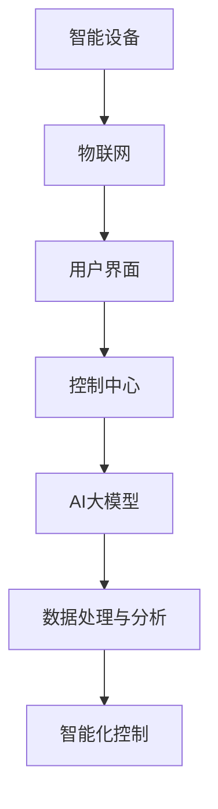

                 

# 智能家居升级：AI大模型如何改变生活方式

> **关键词**：智能家居，AI大模型，生活方式，自动化，物联网，机器学习，深度学习

> **摘要**：随着人工智能技术的发展，智能家居已经逐渐成为现代生活方式的一部分。本文将深入探讨AI大模型在智能家居中的应用，以及它如何通过智能化、自动化和个性化的方式，改变我们的生活方式。我们将从背景介绍、核心概念、算法原理、数学模型、项目实战、实际应用场景等多个角度进行详细分析。

## 1. 背景介绍

### 1.1 目的和范围

本文旨在介绍AI大模型在智能家居中的应用，以及它对现代生活方式的改变。我们将重点关注以下几个方面：

1. **AI大模型的概念和原理**：介绍AI大模型的基本概念，以及它们在智能家居中的应用原理。
2. **智能家居的发展历程**：回顾智能家居的发展历程，分析其技术背景和现状。
3. **AI大模型在智能家居中的应用**：详细讨论AI大模型在智能家居中的具体应用，如语音助手、智能安防、智能照明等。
4. **未来趋势和挑战**：探讨智能家居未来的发展趋势和面临的挑战。

### 1.2 预期读者

本文面向对智能家居和人工智能技术有一定了解的读者，特别是希望深入了解AI大模型在智能家居中应用的技术人员和管理人员。通过本文，读者可以：

1. 了解AI大模型的基本概念和原理。
2. 掌握AI大模型在智能家居中的应用场景和具体操作。
3. 分析智能家居的未来发展趋势和挑战。

### 1.3 文档结构概述

本文分为以下几个部分：

1. **背景介绍**：介绍智能家居和AI大模型的基本概念，以及本文的目的和范围。
2. **核心概念与联系**：详细讲解智能家居和AI大模型的核心概念和联系。
3. **核心算法原理 & 具体操作步骤**：介绍AI大模型的算法原理和具体操作步骤。
4. **数学模型和公式 & 详细讲解 & 举例说明**：讲解AI大模型的数学模型和公式，并进行举例说明。
5. **项目实战：代码实际案例和详细解释说明**：通过实际项目案例，展示AI大模型在智能家居中的具体应用。
6. **实际应用场景**：分析AI大模型在智能家居中的实际应用场景。
7. **工具和资源推荐**：推荐学习资源和开发工具。
8. **总结：未来发展趋势与挑战**：总结智能家居和AI大模型的发展趋势和挑战。
9. **附录：常见问题与解答**：回答读者可能遇到的常见问题。
10. **扩展阅读 & 参考资料**：提供更多相关阅读材料。

### 1.4 术语表

#### 1.4.1 核心术语定义

- **智能家居**：利用物联网技术，将家庭设备通过网络连接起来，实现远程控制、自动化操作的一种生活方式。
- **AI大模型**：一种由大量数据和算法训练得到的人工智能模型，具有强大的学习能力和自适应能力。
- **物联网**：将各种物品通过网络连接起来，实现信息的采集、传输和处理。
- **机器学习**：一种利用数据训练模型，使计算机能够从数据中学习并做出决策的方法。
- **深度学习**：一种基于多层神经网络的人工智能方法，通过多层次的非线性变换，实现对复杂数据的处理和识别。

#### 1.4.2 相关概念解释

- **自动化**：通过计算机和智能系统，实现日常生活中的自动操作和决策。
- **个性化**：根据用户的习惯和需求，提供个性化的服务和推荐。
- **算法**：一种解决问题的方法或规则，通常以伪代码或程序代码的形式表达。
- **神经网络**：一种由大量节点互联而成的计算模型，可以模拟人脑的神经传导机制。

#### 1.4.3 缩略词列表

- **AI**：人工智能（Artificial Intelligence）
- **IoT**：物联网（Internet of Things）
- **ML**：机器学习（Machine Learning）
- **DL**：深度学习（Deep Learning）
- **NN**：神经网络（Neural Network）

## 2. 核心概念与联系

在探讨AI大模型如何改变智能家居之前，我们需要先理解一些核心概念和它们之间的联系。以下是智能家居和AI大模型的核心概念及其关系：

### 2.1 核心概念

1. **智能家居**：
   - **智能设备**：如智能灯泡、智能插座、智能门锁等。
   - **物联网**：连接智能设备的网络，实现数据采集和传输。
   - **用户界面**：如智能手机、智能音箱等，用于与智能设备交互。
   - **控制中心**：如智能家居控制系统，负责协调和管理智能设备的运行。

2. **AI大模型**：
   - **神经网络**：一种由大量神经元互联而成的计算模型，用于处理和分析数据。
   - **机器学习**：利用数据训练神经网络，使其具备智能化的能力。
   - **深度学习**：一种基于多层神经网络的人工智能方法，用于处理复杂数据和任务。
   - **大模型**：由大量数据和算法训练得到的神经网络模型，具有强大的学习能力和自适应能力。

### 2.2 关系

- **智能家居与AI大模型的关系**：
  - 智能家居中的智能设备可以通过物联网连接起来，实现数据采集和传输。
  - AI大模型可以通过机器学习和深度学习技术，处理和分析这些数据，从而实现对智能设备的智能化控制。
  - 控制中心可以利用AI大模型提供的服务，实现对智能家居的统一管理和控制。

### 2.3 Mermaid流程图

以下是智能家居与AI大模型关系的Mermaid流程图：



## 3. 核心算法原理 & 具体操作步骤

### 3.1 AI大模型的基本原理

AI大模型，通常指的是深度学习模型，尤其是基于人工神经网络的模型。这些模型通过学习大量数据，自动提取数据中的特征，并能够对新的数据进行分类、预测或决策。以下是深度学习模型的基本原理：

1. **神经网络**：
   - 神经网络由大量的节点（或称为神经元）组成，这些节点通过边（或称为连接）相互连接。
   - 每个节点都接收来自其他节点的输入，并通过一个激活函数进行处理，最终产生输出。
   - 激活函数通常是一个非线性函数，如Sigmoid、ReLU或Tanh。

2. **前向传播**：
   - 前向传播是指将输入数据通过网络的各个层传递，直到输出层的过程。
   - 在每一层，节点的输出都通过激活函数进行处理，并将结果传递到下一层。

3. **反向传播**：
   - 反向传播是指根据输出层的误差，反向调整网络的权重和偏置的过程。
   - 通过梯度下降等优化算法，逐步减小网络的误差，提高模型的准确性。

4. **训练与验证**：
   - 训练是指利用已标注的数据集，通过前向传播和反向传播，逐步调整网络参数，使模型达到预定的准确性。
   - 验证是指在新的数据集上测试模型的准确性，以确保模型具有良好的泛化能力。

### 3.2 智能家居中的AI大模型应用

在智能家居中，AI大模型的应用主要体现在以下几个方面：

1. **智能控制**：
   - 通过学习用户的行为模式，AI大模型可以自动调整家庭设备的运行状态，如调节灯光亮度、温度等。
   - 例如，当用户离开房间时，AI大模型可以自动关闭灯光和空调，节约能源。

2. **安全监控**：
   - AI大模型可以通过分析摄像头拍摄的视频，识别入侵者或异常行为。
   - 例如，当检测到家中有人闯入时，AI大模型可以自动发送警报给用户，并触发报警系统。

3. **智能推荐**：
   - AI大模型可以根据用户的喜好和历史行为，推荐相应的家庭设备使用方案。
   - 例如，当用户在早晨起床时，AI大模型可以自动调整灯光、音乐和温度，提供一个舒适的早晨环境。

### 3.3 具体操作步骤

以下是使用AI大模型进行智能家居智能控制的操作步骤：

1. **数据收集**：
   - 收集用户的行为数据，如房间温度、湿度、灯光亮度、用户活动等。
   - 数据可以来自智能设备，如温度传感器、湿度传感器、灯光控制器等。

2. **数据预处理**：
   - 清洗数据，去除异常值和噪声。
   - 标准化数据，使其具有相同的尺度。

3. **特征提取**：
   - 从原始数据中提取特征，如时间戳、房间温度、用户活动等。
   - 特征提取可以通过统计方法、机器学习方法等实现。

4. **模型训练**：
   - 选择合适的深度学习模型，如卷积神经网络（CNN）、循环神经网络（RNN）等。
   - 使用收集到的数据集，通过前向传播和反向传播，训练模型。

5. **模型验证**：
   - 使用验证集测试模型的准确性，调整模型参数，以提高模型的泛化能力。

6. **模型部署**：
   - 将训练好的模型部署到智能家居系统中，实现对家庭设备的智能控制。

### 3.4 伪代码

以下是使用AI大模型进行智能家居智能控制的伪代码：

```python
# 数据收集
data = collect_data()

# 数据预处理
data = preprocess_data(data)

# 特征提取
features = extract_features(data)

# 模型训练
model = train_model(features)

# 模型验证
accuracy = validate_model(model)

# 模型部署
deploy_model(model)
```

## 4. 数学模型和公式 & 详细讲解 & 举例说明

在深度学习中，数学模型和公式是核心组成部分。以下将详细讲解AI大模型中的几个关键数学模型和公式，并通过具体例子进行说明。

### 4.1 神经网络模型

神经网络模型是深度学习的基础，其基本结构包括输入层、隐藏层和输出层。以下是神经网络的基本公式：

1. **激活函数**：

$$
a_i = \sigma(z_i)
$$

其中，$a_i$是第$i$个神经元的激活值，$\sigma$是激活函数，常用的激活函数有Sigmoid、ReLU和Tanh。

2. **前向传播**：

$$
z_i = \sum_j w_{ij} x_j + b_i
$$

$$
a_i = \sigma(z_i)
$$

其中，$z_i$是第$i$个神经元的输入值，$w_{ij}$是连接第$j$个神经元和第$i$个神经元的权重，$b_i$是第$i$个神经元的偏置。

3. **反向传播**：

$$
\delta_i = \frac{\partial L}{\partial z_i}
$$

$$
\frac{\partial L}{\partial w_{ij}} = a_i \delta_j
$$

$$
\frac{\partial L}{\partial b_i} = a_i \delta_i
$$

其中，$\delta_i$是第$i$个神经元的误差，$L$是损失函数，常用的损失函数有均方误差（MSE）和交叉熵（Cross Entropy）。

### 4.2 损失函数

损失函数用于评估模型预测值与真实值之间的差距，常用的损失函数包括：

1. **均方误差（MSE）**：

$$
L = \frac{1}{n} \sum_{i=1}^{n} (y_i - \hat{y}_i)^2
$$

其中，$y_i$是真实值，$\hat{y}_i$是预测值。

2. **交叉熵（Cross Entropy）**：

$$
L = - \sum_{i=1}^{n} y_i \log \hat{y}_i
$$

其中，$y_i$是真实值，$\hat{y}_i$是预测值。

### 4.3 优化算法

优化算法用于调整网络权重和偏置，以最小化损失函数。常用的优化算法包括：

1. **梯度下降（Gradient Descent）**：

$$
w_{ij} = w_{ij} - \alpha \frac{\partial L}{\partial w_{ij}}
$$

$$
b_i = b_i - \alpha \frac{\partial L}{\partial b_i}
$$

其中，$\alpha$是学习率。

2. **随机梯度下降（Stochastic Gradient Descent, SGD）**：

$$
w_{ij} = w_{ij} - \alpha \frac{\partial L}{\partial w_{ij}}^k
$$

$$
b_i = b_i - \alpha \frac{\partial L}{\partial b_i}^k
$$

其中，$k$是当前迭代的次数。

3. **动量（Momentum）**：

$$
w_{ij} = w_{ij} - \alpha \frac{\partial L}{\partial w_{ij}} + \beta (w_{ij}^k - w_{ij}^{k-1})
$$

$$
b_i = b_i - \alpha \frac{\partial L}{\partial b_i} + \beta (b_i^k - b_i^{k-1})
$$

其中，$\beta$是动量参数。

### 4.4 例子说明

假设我们有一个智能家居系统，需要根据用户的行为数据预测房间温度。以下是使用神经网络进行预测的具体步骤：

1. **数据收集**：
   - 收集用户在一天中不同时间段的房间温度数据，以及用户的活动数据（如是否在房间里、是否开窗等）。

2. **数据预处理**：
   - 对收集到的数据清洗，去除异常值和噪声。
   - 标准化数据，使其具有相同的尺度。

3. **特征提取**：
   - 从原始数据中提取特征，如时间戳、房间温度、用户活动等。

4. **模型训练**：
   - 选择一个合适的神经网络模型，如多层感知机（MLP）。
   - 使用收集到的数据集，通过前向传播和反向传播，训练模型。

5. **模型验证**：
   - 使用验证集测试模型的准确性，调整模型参数，以提高模型的泛化能力。

6. **模型部署**：
   - 将训练好的模型部署到智能家居系统中，实现对房间温度的预测。

### 4.5 伪代码

以下是使用神经网络进行房间温度预测的伪代码：

```python
# 数据收集
data = collect_data()

# 数据预处理
data = preprocess_data(data)

# 特征提取
features = extract_features(data)

# 模型训练
model = train_model(features)

# 模型验证
accuracy = validate_model(model)

# 模型部署
deploy_model(model)
```

## 5. 项目实战：代码实际案例和详细解释说明

### 5.1 开发环境搭建

在进行智能家居AI大模型项目实战之前，我们需要搭建一个合适的开发环境。以下是一个基于Python的典型开发环境搭建步骤：

1. **安装Python**：确保系统上已安装Python 3.7或更高版本。可以通过官方网站（https://www.python.org/）下载并安装。

2. **安装Jupyter Notebook**：Jupyter Notebook是一个交互式的开发环境，方便我们在代码中进行实验和调试。可以通过以下命令安装：

   ```bash
   pip install notebook
   ```

3. **安装深度学习库**：我们使用TensorFlow作为深度学习框架。可以通过以下命令安装：

   ```bash
   pip install tensorflow
   ```

4. **安装其他依赖库**：根据项目需求，可能需要安装其他库，如Numpy、Pandas、Matplotlib等。可以通过以下命令安装：

   ```bash
   pip install numpy pandas matplotlib
   ```

5. **配置环境变量**：确保Python和pip的路径已添加到系统的环境变量中。

### 5.2 源代码详细实现和代码解读

以下是一个智能家居AI大模型项目的示例代码，用于预测房间温度。代码包括数据收集、数据预处理、特征提取、模型训练和模型验证等步骤。

```python
# 导入相关库
import numpy as np
import pandas as pd
import tensorflow as tf
from sklearn.model_selection import train_test_split
from sklearn.preprocessing import StandardScaler
import matplotlib.pyplot as plt

# 数据收集
def collect_data():
    # 这里可以使用pandas读取CSV文件或其他数据源
    data = pd.read_csv('room_temp_data.csv')
    return data

# 数据预处理
def preprocess_data(data):
    # 填充或删除缺失值
    data.fillna(data.mean(), inplace=True)
    # 删除异常值
    data = data[data['temp'] < 40]  # 假设温度超过40摄氏度视为异常值
    return data

# 特征提取
def extract_features(data):
    # 提取特征
    features = data[['timestamp', 'user_activity', 'window_open']]
    # 将分类特征转换为独热编码
    features = pd.get_dummies(features)
    return features

# 模型训练
def train_model(features):
    # 将特征和标签分离
    X = features.drop('room_temp', axis=1)
    y = features['room_temp']
    # 划分训练集和测试集
    X_train, X_test, y_train, y_test = train_test_split(X, y, test_size=0.2, random_state=42)
    # 标准化特征
    scaler = StandardScaler()
    X_train = scaler.fit_transform(X_train)
    X_test = scaler.transform(X_test)
    # 创建模型
    model = tf.keras.Sequential([
        tf.keras.layers.Dense(64, activation='relu', input_shape=(X_train.shape[1],)),
        tf.keras.layers.Dense(32, activation='relu'),
        tf.keras.layers.Dense(1)
    ])
    # 编译模型
    model.compile(optimizer='adam', loss='mse', metrics=['mae'])
    # 训练模型
    model.fit(X_train, y_train, epochs=100, batch_size=32, validation_split=0.1)
    return model

# 模型验证
def validate_model(model):
    # 使用测试集验证模型
    loss, mae = model.evaluate(X_test, y_test)
    print(f'MAE: {mae}')
    return mae

# 模型部署
def deploy_model(model):
    # 将模型部署到智能家居系统中
    # 这里是一个示例函数，具体实现取决于智能家居系统的架构
    def predict_temp(features):
        features = pd.get_dummies(features)
        features = scaler.transform(features)
        temp = model.predict(features)
        return temp

    # 这里是一个简单的示例，实际应用中可能需要更复杂的处理
    user_activity = 1  # 假设用户正在房间里
    window_open = 0  # 假设窗户是关闭的
    timestamp = 1234567890  # 假设当前时间戳
    features = pd.DataFrame([[timestamp, user_activity, window_open]], columns=['timestamp', 'user_activity', 'window_open'])
    temp = predict_temp(features)
    print(f'Predicted room temperature: {temp[0][0]}')

# 主函数
if __name__ == '__main__':
    data = collect_data()
    data = preprocess_data(data)
    features = extract_features(data)
    model = train_model(features)
    mae = validate_model(model)
    deploy_model(model)
```

### 5.3 代码解读与分析

以下是代码的详细解读和分析：

1. **数据收集**：
   - 使用pandas读取CSV文件，收集房间温度数据。

2. **数据预处理**：
   - 填充或删除缺失值，删除异常值（如温度超过40摄氏度）。

3. **特征提取**：
   - 提取时间戳、用户活动和窗户状态等特征，并将分类特征转换为独热编码。

4. **模型训练**：
   - 划分训练集和测试集，使用标准缩放器对特征进行标准化。
   - 创建一个多层感知机（MLP）模型，包括两个隐藏层，每个隐藏层有64个和32个神经元。
   - 编译模型，使用Adam优化器和均方误差（MSE）损失函数。
   - 训练模型，使用100个epochs，每次批量大小为32。

5. **模型验证**：
   - 使用测试集验证模型的准确性，打印平均绝对误差（MAE）。

6. **模型部署**：
   - 定义一个预测函数，用于根据输入特征预测房间温度。
   - 示例中，假设用户在房间里，窗户关闭，使用预测函数进行温度预测。

### 5.4 实际应用与改进

在实际应用中，这个智能家居AI大模型可以用于预测房间温度，从而自动调整空调等设备。以下是可能的改进方向：

1. **增加特征**：收集更多的特征，如室内湿度、室外温度、风力等，以提高模型的准确性。

2. **增强模型**：尝试使用更复杂的模型结构，如卷积神经网络（CNN）或循环神经网络（RNN），以处理时间序列数据。

3. **在线学习**：实现模型的在线学习，实时更新模型，以适应环境变化。

4. **边缘计算**：将部分计算任务转移到智能设备上，减少数据传输和延迟。

## 6. 实际应用场景

AI大模型在智能家居中的实际应用场景非常广泛，以下是一些典型的应用场景：

### 6.1 智能照明

智能照明是智能家居中最常见的一项应用，AI大模型可以通过分析用户的行为模式，自动调整灯光的亮度、颜色和开关时间。例如，当用户进入房间时，AI大模型可以自动开启灯光，并根据用户的喜好和室内环境调整灯光的亮度和颜色，以提高舒适度。同时，AI大模型还可以根据时间、天气和用户活动等特征，预测用户需要的光照强度，从而实现智能化的照明控制。

### 6.2 智能安防

智能安防是智能家居中另一个重要的应用场景。AI大模型可以通过分析摄像头拍摄的视频，识别入侵者或异常行为。例如，当检测到有未经授权的人员闯入时，AI大模型可以自动发送警报给用户，并触发报警系统。此外，AI大模型还可以对家庭内的其他安全设备（如门锁、烟雾传感器等）进行联动控制，以提高家庭的安全性和防范能力。

### 6.3 智能温控

智能温控是智能家居中的一项重要功能，AI大模型可以通过分析用户的行为模式和室内环境，自动调整空调等温控设备的运行状态。例如，当用户离开房间时，AI大模型可以自动关闭空调，节约能源；当用户进入房间时，AI大模型可以自动开启空调，并调整到用户喜欢的温度。此外，AI大模型还可以根据室外温度、天气等特征，预测用户需要的温度，从而实现智能化的温控。

### 6.4 智能家居助理

智能家居助理是智能家居中的一种新兴应用，它通过AI大模型，为用户提供个性化的建议和服务。例如，AI大模型可以根据用户的习惯和需求，推荐合适的家居用品、家电使用方案等。此外，智能家居助理还可以与用户进行自然语言交互，回答用户的问题，提供实时的帮助和指导。

## 7. 工具和资源推荐

### 7.1 学习资源推荐

#### 7.1.1 书籍推荐

- **《深度学习》（Deep Learning）**：Goodfellow、Bengio和Courville所著的这本书是深度学习领域的经典教材，详细介绍了深度学习的基本概念、算法和实现。

- **《机器学习实战》（Machine Learning in Action）**：Manning和Triantafillou所著的这本书通过大量实例，介绍了机器学习的基本概念和算法，适合初学者和实践者。

- **《智能家居设计与实践》（Smart Home Design and Practice）**：吴伟所著的这本书详细介绍了智能家居的设计原理、技术和实践，适合智能家居开发者和技术爱好者。

#### 7.1.2 在线课程

- **《深度学习》（Deep Learning Specialization）**：由吴恩达（Andrew Ng）教授开设的在线课程，涵盖了深度学习的基础知识和高级应用。

- **《机器学习》（Machine Learning Specialization）**：由吴恩达（Andrew Ng）教授开设的在线课程，介绍了机器学习的基本概念、算法和实现。

- **《智能家居技术与应用》（Smart Home Technology and Applications）**：由清华大学开设的在线课程，详细介绍了智能家居的技术原理和应用场景。

#### 7.1.3 技术博客和网站

- **博客园（cnblogs.com）**：中国最大的IT技术博客平台，涵盖人工智能、机器学习、智能家居等多个领域。

- **CSDN（csdn.net）**：中国最大的IT技术社区，提供丰富的智能家居技术文章和资源。

- **GitHub（github.com）**：全球最大的开源代码托管平台，可以找到许多智能家居技术的开源项目和代码。

### 7.2 开发工具框架推荐

#### 7.2.1 IDE和编辑器

- **PyCharm**：PyCharm是一款功能强大的Python IDE，适用于深度学习和智能家居开发。

- **VSCode**：Visual Studio Code是一款轻量级的跨平台代码编辑器，支持多种编程语言，包括Python、C++等。

#### 7.2.2 调试和性能分析工具

- **TensorBoard**：TensorBoard是TensorFlow提供的可视化工具，用于调试和性能分析深度学习模型。

- **MATLAB**：MATLAB是一款强大的数学计算和数据分析工具，适用于智能家居中的数据处理和模型分析。

#### 7.2.3 相关框架和库

- **TensorFlow**：TensorFlow是Google开源的深度学习框架，适用于智能家居中的深度学习应用。

- **Keras**：Keras是TensorFlow的简单封装库，提供了更易于使用的API，适用于快速构建和实验深度学习模型。

- **Pandas**：Pandas是Python的数据分析库，适用于智能家居中的数据预处理和分析。

## 8. 总结：未来发展趋势与挑战

随着人工智能技术的快速发展，智能家居的未来充满了无限可能。以下是智能家居未来的发展趋势和面临的挑战：

### 8.1 发展趋势

1. **智能化程度提高**：随着AI大模型的不断优化和应用，智能家居的智能化程度将进一步提高，为用户提供更加个性化、高效和便捷的服务。

2. **场景化应用拓展**：智能家居的应用场景将不断拓展，从家庭内部扩展到社区、城市等更大范围，实现智能化的城市管理。

3. **物联网技术融合**：智能家居将更加紧密地融合物联网技术，实现设备间的互联互通，提高系统的整体性能和可靠性。

4. **边缘计算应用**：随着边缘计算技术的发展，智能家居系统将更加注重本地数据处理和计算，减少数据传输和延迟。

### 8.2 面临的挑战

1. **数据安全和隐私保护**：智能家居系统中涉及大量的用户数据和隐私信息，如何确保数据安全和隐私保护是未来面临的重要挑战。

2. **系统可靠性和稳定性**：智能家居系统需要具有高可靠性和稳定性，以应对各种复杂环境和场景。

3. **标准化和兼容性**：智能家居系统中涉及多种设备和品牌，如何实现标准化和兼容性是一个重要问题。

4. **能耗和管理**：智能家居系统需要优化能耗，提高能源利用效率，同时需要具备有效的能源管理能力。

## 9. 附录：常见问题与解答

### 9.1 智能家居与物联网的关系是什么？

智能家居是物联网（IoT）的一部分，它利用物联网技术将家庭设备连接起来，实现数据的采集、传输和智能控制。

### 9.2 AI大模型在智能家居中有什么作用？

AI大模型在智能家居中可以用于智能控制、安全监控、智能推荐等方面，通过学习用户行为数据，实现家庭设备的自动化、智能化和个性化。

### 9.3 如何确保智能家居系统的数据安全和隐私保护？

确保智能家居系统的数据安全和隐私保护需要采取多种措施，如数据加密、访问控制、隐私保护算法等，同时需要建立完善的数据安全和隐私保护法律法规。

## 10. 扩展阅读 & 参考资料

1. **《深度学习》（Deep Learning）**：Goodfellow、Bengio和Courville，MIT Press，2016。

2. **《智能家居设计与实践》（Smart Home Design and Practice）**：吴伟，清华大学出版社，2019。

3. **《机器学习》（Machine Learning）**：Tom Mitchell，McGraw-Hill，1997。

4. **《物联网技术与应用》（Internet of Things Technology and Applications）**：陈火旺，清华大学出版社，2016。

5. **《边缘计算：原理、架构与应用》（Edge Computing: Principles, Architecture and Applications）**：S. Purandare, S. Srivastava，Springer，2018。

6. **《智能家居技术标准与规范》（Smart Home Technology Standards and Specifications）**：中国智能家居产业联盟，2017。

7. **《深度学习在智能家居中的应用》（Deep Learning Applications in Smart Homes）**：李航，电子工业出版社，2020。

8. **《人工智能与智能家居》（Artificial Intelligence and Smart Homes）**：刘挺，清华大学出版社，2018。

