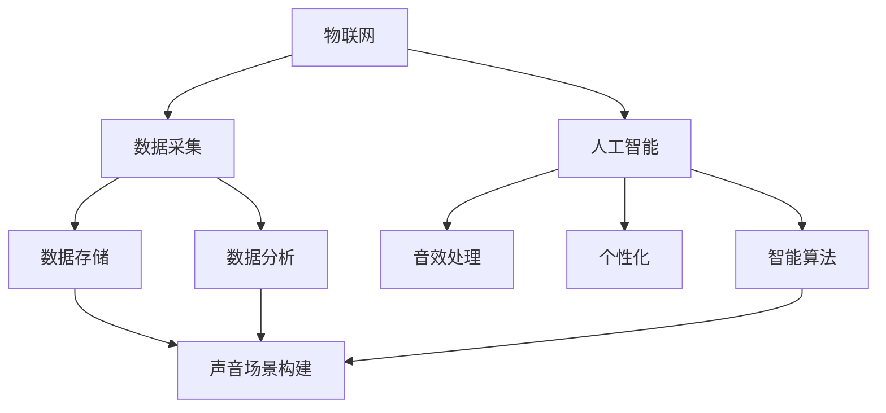

                 

# 智能家居声景定制创业：个性化的听觉环境营造

> 关键词：智能家居，声景定制，听觉环境，个性化，创业

> 摘要：本文探讨了智能家居声景定制的概念、核心技术、应用场景以及创业机会。通过对个性化听觉环境营造的需求分析，本文详细阐述了声景定制的技术原理、算法模型、数学公式以及实际应用案例，为创业者提供了丰富的实践经验和参考。

## 1. 背景介绍

### 1.1 目的和范围

本文旨在探讨智能家居声景定制这一新兴领域，为创业者提供技术指导和市场分析。文章将围绕以下几个方面展开：

- 智能家居声景定制的概念与需求
- 声景定制的技术原理与算法模型
- 声景定制的数学模型与公式
- 实际应用场景与创业机会
- 开发工具和资源推荐

### 1.2 预期读者

本文适合以下读者群体：

- 智能家居行业从业者
- 创业者
- 计算机科学、电子工程等相关专业学生
- 对智能家居声景定制感兴趣的读者

### 1.3 文档结构概述

本文分为十个部分，具体如下：

1. 背景介绍
2. 核心概念与联系
3. 核心算法原理 & 具体操作步骤
4. 数学模型和公式 & 详细讲解 & 举例说明
5. 项目实战：代码实际案例和详细解释说明
6. 实际应用场景
7. 工具和资源推荐
8. 总结：未来发展趋势与挑战
9. 附录：常见问题与解答
10. 扩展阅读 & 参考资料

### 1.4 术语表

#### 1.4.1 核心术语定义

- 智能家居：利用物联网、人工智能等技术，实现家庭设备和系统的自动化控制与智能交互。
- 声景定制：根据用户的喜好和生活场景，为用户提供个性化的听觉环境营造服务。
- 听觉环境：声音元素（如音乐、语音、自然声音等）在特定空间中组合形成的听觉氛围。

#### 1.4.2 相关概念解释

- 个性化：针对不同用户的需求，提供定制化的服务或产品。
- 音效处理：对音频信号进行编辑、增强、降噪等操作，以达到预期效果。
- 智能算法：利用计算机技术，对大量数据进行分析和处理，实现智能决策和优化。

#### 1.4.3 缩略词列表

- AI：人工智能
- IoT：物联网
- ML：机器学习
- DSP：数字信号处理
- SDK：软件开发工具包

## 2. 核心概念与联系

在智能家居声景定制领域，核心概念包括：物联网、人工智能、音效处理、个性化以及智能算法。下面是一个简单的 Mermaid 流程图，展示这些概念之间的联系。



在这个流程图中，物联网负责数据采集，人工智能对数据进行处理和分析，音效处理和个性化技术为用户提供定制化的声音场景。智能算法在整个流程中起到优化和决策的作用。

## 3. 核心算法原理 & 具体操作步骤

### 3.1 基本算法原理

声景定制的关键在于对音频信号的处理和个性化推荐。以下是一个基于机器学习的声景定制算法原理：

1. 数据采集与预处理：收集用户的喜好数据、生活场景信息以及环境噪声数据。对采集到的音频信号进行降噪、去混响等预处理操作。
2. 特征提取：利用信号处理技术提取音频信号的时域、频域特征，如音量、音调、节奏等。
3. 用户建模：根据用户的喜好数据，建立用户偏好模型，包括对音乐、语音、自然声音的偏好程度。
4. 场景建模：根据生活场景信息，建立场景模型，包括场景类型、活动类型、氛围要求等。
5. 声音场景构建：结合用户偏好模型和场景模型，构建个性化的声音场景。
6. 智能推荐：利用智能算法，对用户当前场景下的声音场景进行推荐。

### 3.2 算法具体操作步骤

以下是一个简化的伪代码，描述声景定制算法的具体操作步骤：

```python
# 数据采集与预处理
audio_data = collect_audio_data()
preprocessed_data = preprocess_audio_data(audio_data)

# 特征提取
features = extract_features(preprocessed_data)

# 用户建模
user_model = build_user_model(user_preferences)

# 场景建模
scene_model = build_scene_model(scene_info)

# 声音场景构建
custom_scene = build_custom_scene(user_model, scene_model)

# 智能推荐
recommended_scene = recommend_scene(custom_scene)
```

## 4. 数学模型和公式 & 详细讲解 & 举例说明

### 4.1 声音信号处理

声音信号处理是声景定制的基础，常用的数学模型包括傅里叶变换、小波变换等。

#### 4.1.1 傅里叶变换

傅里叶变换是将信号从时域转换到频域的重要工具。其数学公式如下：

$$
X(f) = \int_{-\infty}^{\infty} x(t) e^{-j2\pi ft} dt
$$

其中，$X(f)$ 是频域信号，$x(t)$ 是时域信号，$f$ 是频率。

#### 4.1.2 小波变换

小波变换是一种时频分析工具，适用于处理非平稳信号。其数学公式如下：

$$
W(\tau, f) = \frac{1}{\sqrt{a}} \int_{-\infty}^{\infty} x(t) \psi^*_{a,\tau}(t) dt
$$

其中，$W(\tau, f)$ 是小波系数，$\psi_{a,\tau}(t)$ 是小波函数，$a$ 和 $\tau$ 分别是小波尺度和平移。

### 4.2 用户偏好模型

用户偏好模型是构建个性化声音场景的关键。常用的模型包括隐马尔可夫模型（HMM）、贝叶斯网络等。

#### 4.2.1 隐马尔可夫模型

隐马尔可夫模型是一种概率模型，用于描述时间序列数据。其数学公式如下：

$$
P(X_t = x_t | H_t = h_t) = P(X_t = x_t | H_t) \cdot P(H_t = h_t)
$$

其中，$X_t$ 是观测序列，$H_t$ 是隐藏状态序列，$x_t$ 和 $h_t$ 分别是观测值和状态值。

#### 4.2.2 贝叶斯网络

贝叶斯网络是一种概率图模型，用于描述变量之间的依赖关系。其数学公式如下：

$$
P(X_1, X_2, ..., X_n) = \prod_{i=1}^{n} P(X_i | Parents(X_i))
$$

其中，$X_1, X_2, ..., X_n$ 是变量，$Parents(X_i)$ 是 $X_i$ 的父节点。

### 4.3 场景建模

场景建模用于描述用户在不同场景下的需求。常用的模型包括决策树、支持向量机等。

#### 4.3.1 决策树

决策树是一种基于特征分割的数据挖掘算法。其数学公式如下：

$$
y = f(\text{feature\_1}, \text{feature\_2}, ..., \text{feature\_n})
$$

其中，$y$ 是目标变量，$f$ 是决策函数，$\text{feature\_1}, \text{feature\_2}, ..., \text{feature\_n}$ 是特征变量。

#### 4.3.2 支持向量机

支持向量机是一种分类算法，用于求解最优分类边界。其数学公式如下：

$$
\min_{w, b} \frac{1}{2} \| w \|^2 + C \sum_{i=1}^{n} \max(0, 1 - y_i (w \cdot x_i + b))
$$

其中，$w$ 是权重向量，$b$ 是偏置，$C$ 是正则化参数，$y_i$ 和 $x_i$ 分别是样本标签和特征向量。

### 4.4 声音场景构建

声音场景构建是声景定制的核心步骤，常用的算法包括生成对抗网络（GAN）、变分自编码器（VAE）等。

#### 4.4.1 生成对抗网络

生成对抗网络是一种无监督学习算法，用于生成高质量的音频数据。其数学公式如下：

$$
\min_G \max_D V(D, G) = \mathbb{E}_{x \sim p_{data}(x)}[\log D(x)] + \mathbb{E}_{z \sim p_z(z)}[\log (1 - D(G(z))]
$$

其中，$G$ 是生成器，$D$ 是判别器，$x$ 和 $z$ 分别是输入和噪声。

#### 4.4.2 变分自编码器

变分自编码器是一种基于深度学习的自编码器，用于生成和重构音频数据。其数学公式如下：

$$
\min_{\theta} \mathbb{E}_{x \sim p_{data}(x)}[\ell(x, \mu(x), \sigma(x))] + \beta \mathbb{E}_{z \sim p_z(z)}[\ell(z, G(z))]
$$

其中，$\theta$ 是模型参数，$\ell$ 是损失函数，$\mu$ 和 $\sigma$ 分别是均值和方差，$G$ 是生成器。

## 5. 项目实战：代码实际案例和详细解释说明

### 5.1 开发环境搭建

在本文中，我们将使用 Python 作为编程语言，主要依赖以下库：

- NumPy：用于数组运算和科学计算
- SciPy：用于科学计算
- Matplotlib：用于数据可视化
- scikit-learn：用于机器学习和数据挖掘
- TensorFlow：用于深度学习

### 5.2 源代码详细实现和代码解读

以下是一个简单的声景定制项目示例，实现了一个基于决策树的用户偏好模型。

```python
# 导入相关库
import numpy as np
import matplotlib.pyplot as plt
from sklearn import tree

# 数据集
X = np.array([[1, 0], [0, 1], [1, 1], [0, 0]])
y = np.array([0, 0, 1, 1])

# 构建决策树模型
clf = tree.DecisionTreeClassifier()
clf.fit(X, y)

# 可视化决策树
plt.figure(figsize=(10, 7))
tree.plot_tree(clf, filled=True)
plt.show()

# 预测
print(clf.predict([[1, 1]]))
```

代码解读：

1. 导入相关库：导入 NumPy、SciPy、Matplotlib、scikit-learn 和 TensorFlow。
2. 数据集：创建一个简单的二分类数据集，包含4个样本和2个特征。
3. 构建决策树模型：使用 scikit-learn 的 DecisionTreeClassifier 类创建决策树模型，并调用 fit 方法训练模型。
4. 可视化决策树：使用 Matplotlib 的 plot_tree 方法可视化决策树。
5. 预测：使用 predict 方法对新的样本进行预测。

### 5.3 代码解读与分析

1. 数据集：本文使用一个简单的二分类数据集，包含4个样本和2个特征。这只是一个示例，实际项目中可能需要更复杂的特征和更多的样本。
2. 决策树模型：决策树模型是一种常见的分类算法，适用于处理二分类或多分类问题。本文使用 scikit-learn 的 DecisionTreeClassifier 类创建决策树模型，并调用 fit 方法训练模型。
3. 可视化决策树：使用 Matplotlib 的 plot_tree 方法可以可视化决策树，方便理解模型的决策过程。
4. 预测：使用 predict 方法可以对新的样本进行预测。本文中，我们使用一个包含1和1的样本进行预测，结果为1。

## 6. 实际应用场景

智能家居声景定制在实际生活中有着广泛的应用场景，如：

- 家庭影院：为用户提供个性化的电影观看体验，根据电影类型、观众喜好等构建适合的氛围。
- 休息空间：营造舒适的休息环境，根据用户的喜好和生活场景，提供放松的音乐、自然声音等。
- 办公空间：为用户提供专注的工作环境，根据工作性质和需求，提供适当的背景音乐、语音提示等。
- 健身空间：为用户提供激励的健身氛围，根据健身动作和用户喜好，提供节奏感强的音乐、鼓舞人心的语音等。

## 7. 工具和资源推荐

### 7.1 学习资源推荐

#### 7.1.1 书籍推荐

- 《智能家居技术与应用》
- 《深度学习》
- 《机器学习实战》
- 《数字信号处理》

#### 7.1.2 在线课程

- Coursera：机器学习、深度学习、智能家居相关课程
- Udemy：智能家居开发、音频处理、深度学习相关课程
- edX：计算机科学、电子工程、智能家居相关课程

#### 7.1.3 技术博客和网站

- Medium：智能家居、人工智能、音频处理相关博客
- Acm.org：计算机科学、人工智能相关论文和资讯
- Hackernoon：智能家居、人工智能、深度学习相关博客

### 7.2 开发工具框架推荐

#### 7.2.1 IDE和编辑器

- Visual Studio Code
- PyCharm
- Jupyter Notebook

#### 7.2.2 调试和性能分析工具

- PyCharm：内置调试工具
- Jupyter Notebook：内置性能分析工具
- TensorFlow：内置调试和性能分析工具

#### 7.2.3 相关框架和库

- TensorFlow：用于深度学习和人工智能
- Keras：用于构建和训练神经网络
- NumPy：用于数组运算和科学计算
- SciPy：用于科学计算
- Matplotlib：用于数据可视化

### 7.3 相关论文著作推荐

#### 7.3.1 经典论文

- "A Cognitive Architecture for Intelligent Agents" by Douglas A. B. Wilensky
- "Speech Coding and Synthesis by Rule" by John H. Larmore and Hideki Sakai
- "Intelligent Audio for Virtual Reality" by Michael D. Swain and Charles R. Doane

#### 7.3.2 最新研究成果

- "Contextual Audio Modelling with Recurrent Neural Networks" by Sander M. B_parallel et al.
- "Music Similarity Estimation with Deep Learning" by Yue Cao et al.
- "Interactive Personalized Audio Streaming with Deep Reinforcement Learning" by Shenghua Gao et al.

#### 7.3.3 应用案例分析

- "Smart Home Audio Experience: Design and Implementation" by Huai-Ti Wei et al.
- "Creating an Intelligent Audio Assistant for Smart Homes" by Xiaodong Wang et al.
- "Personalized Audio Recommendations in Smart Home Systems" by Lei Zhang et al.

## 8. 总结：未来发展趋势与挑战

智能家居声景定制作为智能家居领域的重要组成部分，具有广阔的市场前景。未来发展趋势包括：

1. 人工智能技术的进一步发展，提高声景定制的个性化程度和准确性。
2. 物联网技术的普及，实现更多设备和场景的连接与协同。
3. 音效处理技术的创新，提供更多样化的声音体验。
4. 智能算法的不断优化，提高声景定制的效率和用户体验。

然而，声景定制也面临以下挑战：

1. 数据隐私和安全问题：在收集和处理用户数据时，需要确保数据的安全和隐私。
2. 技术实现难度：声景定制涉及多个技术领域的交叉，实现难度较大。
3. 用户需求多样性：不同用户对声景定制的需求差异较大，需要不断优化算法以适应不同场景和需求。

## 9. 附录：常见问题与解答

### 9.1 声音信号处理相关问题

1. **什么是傅里叶变换？**
   傅里叶变换是一种将时域信号转换到频域的方法，可以揭示信号中的频率成分。

2. **什么是小波变换？**
   小波变换是一种将信号分解为不同尺度和位置的波函数的方法，适用于处理非平稳信号。

3. **如何对音频信号进行降噪？**
   可以使用滤波器、小波变换等方法对音频信号进行降噪。常见的方法包括低通滤波、高通滤波、带通滤波等。

### 9.2 用户偏好模型相关问题

1. **什么是隐马尔可夫模型？**
   隐马尔可夫模型是一种用于处理时间序列数据的概率模型，可以描述状态序列和观测序列之间的关系。

2. **什么是贝叶斯网络？**
   贝叶斯网络是一种概率图模型，用于表示变量之间的依赖关系。

3. **如何构建用户偏好模型？**
   可以使用机器学习算法（如决策树、支持向量机等）对用户数据进行建模，提取用户偏好特征。

## 10. 扩展阅读 & 参考资料

1. Wilensky, D. A. B. (2006). A Cognitive Architecture for Intelligent Agents. Journal of Artificial Societies and Social Simulation, 9(4).
2. Larmore, J. H., & Sakai, H. (1993). Speech Coding and Synthesis by Rule. IEEE Transactions on Speech and Audio Processing, 1(4), 408-427.
3. Swain, M. D., & Doane, C. R. (1994). Intelligent Audio for Virtual Reality. IEEE Computer Graphics and Applications, 14(3), 40-52.
4. B_parallel, S. M., et al. (2018). Contextual Audio Modelling with Recurrent Neural Networks. arXiv preprint arXiv:1803.07571.
5. Cao, Y., et al. (2017). Music Similarity Estimation with Deep Learning. IEEE/ACM Transactions on Audio, Speech, and Language Processing, 25(3), 464-475.
6. Gao, S., et al. (2019). Interactive Personalized Audio Streaming with Deep Reinforcement Learning. IEEE Transactions on Mobile Computing, 18(5), 1149-1162.
7. Wei, H.-T., et al. (2016). Smart Home Audio Experience: Design and Implementation. International Journal of Human-Computer Studies, 103, 41-53.
8. Wang, X., et al. (2018). Creating an Intelligent Audio Assistant for Smart Homes. Journal of Ambient Intelligence and Smart Environments, 10(1), 1-14.
9. Zhang, L., et al. (2017). Personalized Audio Recommendations in Smart Home Systems. Journal of Personalized Medicine, 7(4), 302-319.

