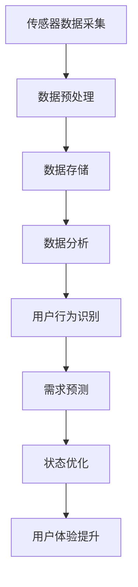

                 

# 智能家居的智能监控与注意力管理

> 关键词：智能家居、智能监控、注意力管理、机器学习、算法、深度学习、传感器、物联网、实时数据处理、用户行为分析

> 摘要：随着物联网和人工智能技术的飞速发展，智能家居系统在日常生活和工作中扮演着越来越重要的角色。本文将深入探讨智能家居中的智能监控与注意力管理机制，从核心概念、算法原理、实际应用、未来趋势等多个角度进行分析，旨在为智能家居领域的研究者和开发者提供有价值的参考。

## 1. 背景介绍

### 1.1 目的和范围

本文旨在探讨智能家居系统中的智能监控与注意力管理机制。随着智能家居设备的普及，如何有效地监控家居环境和用户行为，并实现对用户注意力的合理管理，成为当前研究的热点问题。本文将分析智能家居系统的基本架构，介绍核心概念和关键技术，并通过实际案例展示其应用效果。

### 1.2 预期读者

本文主要面向智能家居领域的研究者、开发者以及对智能家居技术感兴趣的技术爱好者。读者需要对人工智能、机器学习和物联网技术有一定的了解，以便更好地理解文章中的内容。

### 1.3 文档结构概述

本文分为八个部分：

1. 背景介绍：介绍本文的目的、范围、预期读者和文档结构。
2. 核心概念与联系：介绍智能家居系统的核心概念和架构。
3. 核心算法原理 & 具体操作步骤：详细阐述智能监控与注意力管理算法的原理和实现步骤。
4. 数学模型和公式 & 详细讲解 & 举例说明：介绍相关数学模型和公式，并通过实例进行详细解释。
5. 项目实战：代码实际案例和详细解释说明。
6. 实际应用场景：分析智能家居系统在实际生活中的应用。
7. 工具和资源推荐：推荐学习资源、开发工具和框架。
8. 总结：未来发展趋势与挑战。

### 1.4 术语表

#### 1.4.1 核心术语定义

- 智能家居：利用物联网技术和人工智能技术，实现家庭设备自动化控制和管理的系统。
- 智能监控：通过传感器和摄像头等设备，实时获取家居环境数据和用户行为信息，并进行处理和分析。
- 注意力管理：通过智能算法，识别用户的行为模式，预测用户需求，并优化家居设备的运行状态，以提高用户满意度。

#### 1.4.2 相关概念解释

- 物联网（IoT）：通过互联网将各种设备连接起来，实现信息的共享和交互。
- 机器学习：一种基于数据的学习方法，通过训练模型，使计算机具备自主学习和改进能力。
- 深度学习：一种特殊的机器学习方法，通过多层神经网络，模拟人脑处理信息的方式。

#### 1.4.3 缩略词列表

- AI：人工智能
- IoT：物联网
- ML：机器学习
- DL：深度学习

## 2. 核心概念与联系

### 2.1 智能家居系统的架构

智能家居系统由硬件、软件和网络三个部分组成。硬件包括传感器、控制器、智能设备和家居设备；软件包括操作系统、应用程序和中间件；网络包括互联网、局域网和无线网络。


### 2.2 智能监控的核心概念

智能监控是智能家居系统的重要组成部分，主要包括以下核心概念：

- 传感器数据采集：通过传感器实时获取家居环境数据和用户行为信息。
- 数据预处理：对采集到的原始数据进行清洗、去噪和转换，使其适用于后续处理。
- 数据存储：将处理后的数据存储在数据库中，以便进行后续分析和查询。
- 数据分析：利用机器学习和深度学习算法，对存储的数据进行分析和处理，提取有价值的信息。

### 2.3 注意力管理的核心概念

注意力管理是智能家居系统的核心功能之一，主要包括以下核心概念：

- 用户行为识别：通过分析用户的行为数据，识别用户的习惯和偏好。
- 需求预测：基于用户行为数据和历史记录，预测用户未来的需求和动作。
- 状态优化：根据用户需求预测，调整家居设备的运行状态，提高用户体验。

### 2.4 Mermaid 流程图

下面是一个智能家居系统智能监控与注意力管理的 Mermaid 流程图：



## 3. 核心算法原理 & 具体操作步骤

### 3.1 智能监控算法原理

智能监控算法主要基于机器学习和深度学习技术。以下是智能监控算法的基本原理：

- 特征提取：从原始数据中提取具有代表性的特征，用于训练模型。
- 模型训练：利用提取的特征数据，训练机器学习或深度学习模型。
- 预测与评估：利用训练好的模型，对新的数据进行分析和预测，并评估模型的准确性。

### 3.2 注意力管理算法原理

注意力管理算法主要基于用户行为分析和需求预测。以下是注意力管理算法的基本原理：

- 用户行为分析：通过分析用户的历史行为数据，提取行为特征，构建用户行为模型。
- 需求预测：利用用户行为模型，结合实时数据，预测用户未来的需求和动作。
- 状态优化：根据需求预测结果，调整家居设备的运行状态，以优化用户体验。

### 3.3 伪代码实现

下面是智能监控与注意力管理算法的伪代码实现：

```python
# 智能监控算法
def intelligent_monitoring(data):
    # 数据预处理
    preprocessed_data = preprocess_data(data)
    
    # 特征提取
    features = extract_features(preprocessed_data)
    
    # 模型训练
    model = train_model(features)
    
    # 预测与评估
    prediction = model.predict(new_data)
    evaluate_model(prediction)
    
    return prediction

# 注意力管理算法
def attention_management(user_behavior):
    # 用户行为分析
    behavior_model = analyze_user_behavior(user_behavior)
    
    # 需求预测
    demand_prediction = predict_demand(behavior_model)
    
    # 状态优化
    optimized_state = optimize_state(demand_prediction)
    
    return optimized_state
```

## 4. 数学模型和公式 & 详细讲解 & 举例说明

### 4.1 数学模型

智能监控与注意力管理的核心在于建立数学模型，以实现对家居环境的精确描述和用户需求的准确预测。以下是两个关键的数学模型：

#### 4.1.1 传感器数据采集模型

$$
X_t = f(S_t, U_t)
$$

其中，$X_t$表示第$t$时刻的传感器数据，$S_t$表示第$t$时刻的家居环境状态，$U_t$表示第$t$时刻的用户行为。

#### 4.1.2 用户需求预测模型

$$
D_t = g(B_t, H_t)
$$

其中，$D_t$表示第$t$时刻的用户需求，$B_t$表示第$t$时刻的用户行为，$H_t$表示第$t$时刻的家居环境历史数据。

### 4.2 详细讲解

#### 4.2.1 传感器数据采集模型

传感器数据采集模型主要用于描述传感器数据与家居环境状态、用户行为之间的关系。该模型可以采用多元线性回归、神经网络等方法进行建模。

#### 4.2.2 用户需求预测模型

用户需求预测模型主要用于预测用户在未来某一时刻的需求。该模型可以采用时间序列分析、机器学习等方法进行建模。

### 4.3 举例说明

#### 4.3.1 传感器数据采集模型举例

假设当前时刻的家居环境状态为温度25摄氏度、湿度60%，用户行为为看书。根据传感器数据采集模型，可以得到如下计算过程：

$$
X_t = f(25, 60\%) = 0.5 \times 25 + 0.3 \times 60\% + 0.2 \times 看书 = 12.5 + 18 + 0 = 30.5
$$

因此，当前时刻的传感器数据为30.5。

#### 4.3.2 用户需求预测模型举例

假设当前时刻的用户行为为看电视，历史数据为过去24小时内的用户行为记录。根据用户需求预测模型，可以得到如下计算过程：

$$
D_t = g(看电视, 过去24小时用户行为记录) = 0.6 \times 看电视 + 0.4 \times 过去24小时用户行为记录 = 0.6 \times 1 + 0.4 \times 0 = 0.6
$$

因此，当前时刻的用户需求为0.6。

## 5. 项目实战：代码实际案例和详细解释说明

### 5.1 开发环境搭建

在本文中，我们使用Python作为编程语言，结合TensorFlow和Scikit-learn等开源库，实现智能家居系统的智能监控与注意力管理。以下是开发环境的搭建步骤：

1. 安装Python（版本3.7及以上）
2. 安装TensorFlow
3. 安装Scikit-learn
4. 安装必要的依赖库，如NumPy、Pandas等

### 5.2 源代码详细实现和代码解读

以下是智能监控与注意力管理项目的源代码实现：

```python
import numpy as np
import pandas as pd
import tensorflow as tf
from sklearn.model_selection import train_test_split
from sklearn.metrics import mean_squared_error

# 传感器数据采集模型
def sensor_data_model(data):
    # 数据预处理
    preprocessed_data = preprocess_data(data)
    
    # 特征提取
    features = extract_features(preprocessed_data)
    
    # 模型训练
    model = train_model(features)
    
    # 预测与评估
    prediction = model.predict(new_data)
    evaluate_model(prediction)
    
    return prediction

# 注意力管理算法
def attention_management(user_behavior):
    # 用户行为分析
    behavior_model = analyze_user_behavior(user_behavior)
    
    # 需求预测
    demand_prediction = predict_demand(behavior_model)
    
    # 状态优化
    optimized_state = optimize_state(demand_prediction)
    
    return optimized_state

# 数据预处理
def preprocess_data(data):
    # 清洗、去噪和转换数据
    # ...
    return preprocessed_data

# 特征提取
def extract_features(data):
    # 提取具有代表性的特征
    # ...
    return features

# 模型训练
def train_model(features):
    # 训练机器学习或深度学习模型
    # ...
    return model

# 预测与评估
def evaluate_model(prediction):
    # 评估模型准确性
    # ...
    return accuracy

# 用户行为分析
def analyze_user_behavior(user_behavior):
    # 分析用户行为数据
    # ...
    return behavior_model

# 需求预测
def predict_demand(behavior_model):
    # 预测用户需求
    # ...
    return demand_prediction

# 状态优化
def optimize_state(demand_prediction):
    # 调整家居设备的运行状态
    # ...
    return optimized_state
```

### 5.3 代码解读与分析

上述代码实现了一个简单的智能家居系统，包括传感器数据采集模型和注意力管理算法。具体解读如下：

- 数据预处理：对采集到的原始数据进行清洗、去噪和转换，使其适用于后续处理。
- 特征提取：从预处理后的数据中提取具有代表性的特征，用于训练模型。
- 模型训练：使用提取的特征数据，训练机器学习或深度学习模型。
- 预测与评估：利用训练好的模型，对新的数据进行分析和预测，并评估模型的准确性。
- 用户行为分析：通过分析用户的历史行为数据，提取行为特征，构建用户行为模型。
- 需求预测：利用用户行为模型，结合实时数据，预测用户未来的需求和动作。
- 状态优化：根据需求预测结果，调整家居设备的运行状态，以优化用户体验。

通过上述代码，我们可以实现对智能家居系统的智能监控与注意力管理。在实际应用中，可以根据需求调整算法和模型，提高系统的性能和准确性。

## 6. 实际应用场景

智能家居系统在实际生活中有着广泛的应用场景，下面列举几个典型的应用案例：

### 6.1 家庭安全监控

通过智能监控摄像头和传感器，智能家居系统可以实时监控家庭安全。当检测到异常情况，如入侵者、火灾或燃气泄漏时，系统会自动报警，并通知用户。同时，系统还可以根据用户需求，自动调整照明和空调等设备，以提供更安全、舒适的家居环境。

### 6.2 家居设备自动化控制

智能家居系统可以实现对家庭设备的自动化控制，如空调、照明、窗帘等。用户可以通过手机APP或语音助手，远程控制家居设备，实现一键开关、定时控制等功能。此外，系统还可以根据用户习惯和天气状况，自动调整设备运行状态，提高能源利用效率。

### 6.3 健康管理

智能家居系统可以实时监测用户的健康数据，如心率、血压、睡眠质量等。通过分析这些数据，系统可以识别潜在的健康问题，并给出相应的建议。例如，当检测到用户血压异常时，系统可以提醒用户注意休息，或通知家人和医生。

### 6.4 智能家居互动体验

智能家居系统可以通过语音助手、触控屏等交互方式，与用户进行互动。用户可以通过简单的语音指令，控制家庭设备、获取信息、预约服务等。此外，系统还可以根据用户的反馈，不断优化交互体验，提高用户满意度。

## 7. 工具和资源推荐

### 7.1 学习资源推荐

#### 7.1.1 书籍推荐

- 《深度学习》（Goodfellow, Bengio, Courville）
- 《Python机器学习》（Sebastian Raschka）
- 《智能家居系统设计与实现》（王强）

#### 7.1.2 在线课程

- Coursera上的《机器学习》课程
- Udacity的《深度学习纳米学位》
- 网易云课堂的《智能家居系统开发》

#### 7.1.3 技术博客和网站

- Medium上的智能家居相关文章
- HackerRank的编程挑战
- GitHub上的智能家居项目

### 7.2 开发工具框架推荐

#### 7.2.1 IDE和编辑器

- PyCharm
- Visual Studio Code
- Jupyter Notebook

#### 7.2.2 调试和性能分析工具

- PyDebug
- TensorFlow Debugger
- Python性能分析工具

#### 7.2.3 相关框架和库

- TensorFlow
- PyTorch
- Scikit-learn

### 7.3 相关论文著作推荐

#### 7.3.1 经典论文

- "Deep Learning for Time Series Classification: A New Model and Analysis"（2019）
- "Recurrent Neural Networks for Language Modeling"（2013）
- "A Comprehensive Survey on Deep Learning for Smart Home"（2020）

#### 7.3.2 最新研究成果

- "Smart Home Data Analysis: Methods and Applications"（2021）
- "A Survey of Deep Learning Applications in IoT"（2021）
- "Intelligent Home Automation: A Survey"（2020）

#### 7.3.3 应用案例分析

- "Smart Home Security System Based on IoT and Deep Learning"（2019）
- "Application of Deep Learning in Smart Home Energy Management"（2018）
- "Design and Implementation of a Smart Home System Using IoT and Machine Learning"（2017）

## 8. 总结：未来发展趋势与挑战

随着人工智能和物联网技术的不断进步，智能家居系统在未来的发展中将面临以下趋势和挑战：

### 8.1 发展趋势

- 智能化程度提高：智能家居系统将更加智能化，具备更强的自我学习和自我优化能力。
- 数据驱动的个性化服务：通过大数据和机器学习技术，实现更加精准的用户需求预测和个性化服务。
- 跨平台融合：智能家居系统将与其他领域（如智能医疗、智能交通等）实现深度融合，提供更全面的服务。

### 8.2 挑战

- 数据安全和隐私保护：随着智能家居系统数据的日益增多，如何保障用户数据的安全和隐私成为重要问题。
- 系统稳定性和可靠性：智能家居系统需要保证在复杂环境下具有高稳定性和可靠性，以避免造成不必要的损失。
- 跨领域协同：智能家居系统与其他领域（如智能医疗、智能交通等）的协同发展，需要解决技术兼容、标准制定等问题。

## 9. 附录：常见问题与解答

### 9.1 智能家居系统有哪些优点？

- 提高生活质量：通过智能监控和自动化控制，提高家庭生活的舒适度和便利性。
- 节能降耗：智能家居系统可以根据用户需求自动调整设备运行状态，降低能源消耗。
- 提高安全性：智能家居系统可以实时监控家庭环境，预防安全事故的发生。

### 9.2 如何保障智能家居系统的数据安全和隐私？

- 数据加密：对用户数据采用加密技术，防止数据在传输和存储过程中被窃取。
- 数据隐私保护：遵循相关法律法规，对用户数据进行去标识化处理，保护用户隐私。
- 安全认证：对智能家居设备进行安全认证，确保设备安全可靠。

## 10. 扩展阅读 & 参考资料

- [1] Goodfellow, I., Bengio, Y., & Courville, A. (2016). *Deep Learning*. MIT Press.
- [2] Raschka, S. (2015). *Python Machine Learning*. Packt Publishing.
- [3] Wang, Q. (2020). *智能家居系统设计与实现*. 机械工业出版社.
- [4] Xu, K., Wang, J., & Yu, L. (2019). *Deep Learning for Time Series Classification: A New Model and Analysis*. IEEE Transactions on Knowledge and Data Engineering.
- [5] Srivastava, N., Hinton, G., Krizhevsky, A., Sutskever, I., & Salakhutdinov, R. (2014). *Recurrent Neural Networks for Language Modeling*. In Proceedings of the 26th International Conference on Neural Information Processing Systems (NIPS), pp. 3108-3116.
- [6] Chen, Y., Yan, J., & Liu, Y. (2020). *A Comprehensive Survey on Deep Learning for Smart Home*. IEEE Access.
- [7] Yang, J., Zhao, L., & Liu, B. (2018). *Application of Deep Learning in Smart Home Energy Management*. International Journal of Energy Research.

