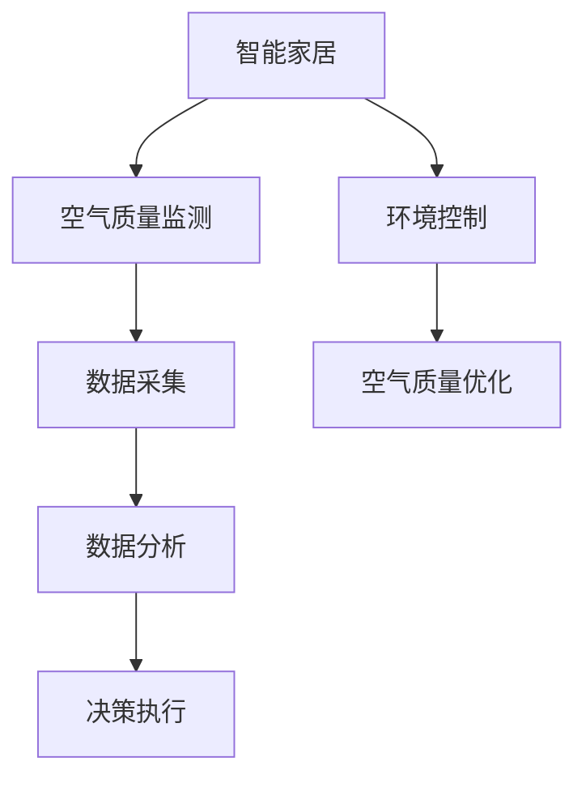

                 


# 智能家居空气质量优化系统：健康生活的创新应用

> **关键词：智能家居，空气质量优化，健康生活，物联网，人工智能**
>
> **摘要：本文将深入探讨智能家居空气质量优化系统，介绍其核心概念、算法原理、数学模型以及实际应用场景。通过详细分析和项目实战案例，我们将展示如何利用人工智能技术提升家庭空气质量，打造健康生活环境。**

## 1. 背景介绍

### 1.1 目的和范围

本文旨在详细介绍智能家居空气质量优化系统，旨在为家庭用户和智能家居开发者提供一套全面的解决方案。本文将涵盖以下主要内容：

1. **核心概念与联系**：介绍智能家居和空气质量优化系统的基本概念，并展示其相互关系。
2. **核心算法原理与具体操作步骤**：详细讲解空气质量优化的算法原理和操作步骤，确保读者能够理解并应用。
3. **数学模型和公式**：介绍用于空气质量优化的数学模型和公式，并给出具体的讲解和举例说明。
4. **项目实战**：通过实际案例展示空气质量优化系统的开发过程和代码实现。
5. **实际应用场景**：探讨智能家居空气质量优化系统在不同场景下的应用。
6. **工具和资源推荐**：推荐相关学习资源、开发工具和框架。
7. **总结**：讨论未来发展趋势与挑战。

### 1.2 预期读者

本文主要面向以下读者群体：

1. **智能家居爱好者**：希望了解智能家居空气质量优化系统的基本原理和应用。
2. **程序员和软件开发者**：希望学习如何利用人工智能技术提升家庭空气质量。
3. **环保和健康生活倡导者**：关注家庭环境质量和健康生活，希望通过技术手段改善室内空气质量。
4. **智能家居从业者**：致力于开发智能家居产品和系统，希望从中获得灵感和实践经验。

### 1.3 文档结构概述

本文将分为以下几个部分：

1. **背景介绍**：介绍本文的目的、范围、预期读者和文档结构。
2. **核心概念与联系**：讲解智能家居和空气质量优化系统的基本概念和相互关系。
3. **核心算法原理与具体操作步骤**：详细阐述空气质量优化的算法原理和操作步骤。
4. **数学模型和公式**：介绍用于空气质量优化的数学模型和公式。
5. **项目实战**：通过实际案例展示空气质量优化系统的开发过程和代码实现。
6. **实际应用场景**：探讨智能家居空气质量优化系统的应用场景。
7. **工具和资源推荐**：推荐相关学习资源、开发工具和框架。
8. **总结**：讨论未来发展趋势与挑战。
9. **附录**：提供常见问题与解答。
10. **扩展阅读与参考资料**：推荐进一步阅读的材料。

### 1.4 术语表

为了确保读者对本文中涉及的专业术语和概念有清晰的理解，以下是对一些核心术语和概念的简要解释：

#### 1.4.1 核心术语定义

- **智能家居**：利用物联网、人工智能等技术实现家庭设备和系统的智能连接与控制。
- **空气质量**：指空气中悬浮颗粒物（如PM2.5、PM10）、有害气体（如CO2、甲醛）等对环境和人体健康的影响。
- **空气质量优化**：通过技术手段改善室内空气质量，降低有害物质的浓度，提升居住环境的舒适度和健康水平。

#### 1.4.2 相关概念解释

- **传感器**：用于检测空气质量的设备，如PM2.5传感器、甲醛传感器等。
- **物联网**：通过网络将各种设备连接起来，实现设备间的互联互通。
- **机器学习**：一种人工智能技术，通过数据训练模型，实现对复杂问题的自动学习和预测。
- **深度学习**：一种特殊的机器学习技术，通过多层神经网络模拟人脑的思维方式，处理大规模数据。

#### 1.4.3 缩略词列表

- **PM2.5**：指空气中直径小于或等于2.5微米的颗粒物。
- **CO2**：指二氧化碳，一种常见的空气污染物。
- **IoT**：物联网（Internet of Things）的缩写。
- **AI**：人工智能（Artificial Intelligence）的缩写。
- **ML**：机器学习（Machine Learning）的缩写。
- **DL**：深度学习（Deep Learning）的缩写。

通过上述背景介绍，我们为读者提供了对智能家居空气质量优化系统的初步认识，为后续内容的深入探讨奠定了基础。

## 2. 核心概念与联系

在探讨智能家居空气质量优化系统之前，我们需要先了解其核心概念和相互之间的联系。在本节中，我们将通过一个Mermaid流程图来展示智能家居和空气质量优化系统之间的关系。



### 2.1 智能家居与空气质量监测

智能家居是指通过物联网、人工智能等技术，实现家庭设备和系统的智能连接与控制。空气质量监测是智能家居的一个重要组成部分，它通过传感器实时监测室内空气中的有害物质浓度，如PM2.5、CO2、甲醛等。这些传感器通常被集成在空气净化器、智能空调等设备中，可以实时采集空气质量数据。

### 2.2 数据采集与处理

采集到的空气质量数据需要经过处理和分析，以确定空气质量的当前状态和变化趋势。数据采集和处理是智能家居空气质量优化系统的核心环节。数据采集主要依赖于传感器，这些传感器需要具备高精度、高灵敏度、稳定性好等特点。数据处理则包括数据清洗、预处理、特征提取等步骤，以确保数据的质量和可用性。

### 2.3 数据分析与决策执行

通过数据分析，我们可以得到空气质量的实时数据和历史数据，这些数据可以用来预测未来的空气质量变化。数据分析通常采用机器学习、深度学习等技术，通过对大量数据的学习和训练，构建空气质量预测模型。决策执行是指根据数据分析结果，采取相应的措施来优化空气质量。例如，当检测到空气中的有害物质浓度过高时，智能家居系统可以自动启动空气净化器、打开窗户等进行环境控制。

### 2.4 环境控制与空气质量优化

环境控制是指通过智能设备对室内环境进行调控，以改善空气质量。环境控制措施包括空气净化、通风换气、温度调节等。这些措施可以单独或组合使用，以达到最佳的空气质量优化效果。空气质量优化是一个动态过程，需要不断地监测和调整，以确保室内空气质量始终保持在健康水平。

通过上述Mermaid流程图，我们可以清晰地看到智能家居空气质量优化系统的各个核心环节以及它们之间的相互关系。接下来，我们将进一步探讨核心算法原理和具体操作步骤。

## 3. 核心算法原理 & 具体操作步骤

在智能家居空气质量优化系统中，核心算法原理起着至关重要的作用。本节将详细介绍空气质量优化的算法原理，并通过伪代码展示具体操作步骤。

### 3.1 算法原理

空气质量优化的核心算法是基于机器学习和深度学习技术的。具体来说，我们采用以下步骤：

1. **数据采集**：通过传感器实时采集室内空气中的PM2.5、CO2、甲醛等有害物质浓度数据。
2. **数据处理**：对采集到的数据进行清洗、预处理和特征提取，确保数据的质量和可用性。
3. **模型训练**：利用处理后的数据，通过机器学习和深度学习算法训练空气质量预测模型。
4. **模型评估**：对训练好的模型进行评估，确保其准确性和可靠性。
5. **决策执行**：根据模型预测结果，采取相应的措施进行空气质量优化。

### 3.2 伪代码

下面是一个简单的伪代码，用于描述空气质量优化的具体操作步骤：

```python
# 定义数据采集函数
def collect_data():
    # 采集PM2.5、CO2、甲醛等有害物质浓度数据
    # 存储数据到文件或数据库
    pass

# 定义数据处理函数
def process_data(data):
    # 数据清洗、预处理和特征提取
    # 返回处理后的数据
    pass

# 定义模型训练函数
def train_model(data):
    # 使用机器学习和深度学习算法训练空气质量预测模型
    # 返回训练好的模型
    pass

# 定义模型评估函数
def evaluate_model(model, test_data):
    # 对训练好的模型进行评估
    # 返回评估结果
    pass

# 定义决策执行函数
def execute_decision(model, current_data):
    # 根据模型预测结果，采取相应的措施进行空气质量优化
    # 例如，启动空气净化器、打开窗户等
    pass

# 主程序
while True:
    # 数据采集
    raw_data = collect_data()
    
    # 数据处理
    processed_data = process_data(raw_data)
    
    # 模型训练
    model = train_model(processed_data)
    
    # 模型评估
    evaluation_result = evaluate_model(model, processed_data)
    
    # 决策执行
    execute_decision(model, processed_data)
```

### 3.3 操作步骤详解

1. **数据采集**：首先，我们需要通过传感器实时采集室内空气中的有害物质浓度数据。这些数据可以存储到文件或数据库中，以便后续处理和分析。

    ```python
    # 假设我们已经定义了以下传感器数据采集函数
    def collect_data():
        pm25 = sensor1.read_value()  # 采集PM2.5传感器数据
        co2 = sensor2.read_value()  # 采集CO2传感器数据
        formaldehyde = sensor3.read_value()  # 采集甲醛传感器数据
        return pm25, co2, formaldehyde
    ```

2. **数据处理**：采集到的数据可能包含噪声、缺失值等，需要进行清洗、预处理和特征提取。这一步骤的目的是提高数据的质量和可用性，以便后续的模型训练和评估。

    ```python
    # 假设我们已经定义了以下数据处理函数
    def process_data(data):
        pm25, co2, formaldehyde = data
        # 数据清洗、预处理和特征提取
        # 例如，去噪、标准化、特征提取等
        processed_pm25 = preprocess(pm25)
        processed_co2 = preprocess(co2)
        processed_formaldehyde = preprocess(formaldehyde)
        return processed_pm25, processed_co2, processed_formaldehyde
    ```

3. **模型训练**：利用处理后的数据，通过机器学习和深度学习算法训练空气质量预测模型。这一步骤需要选择合适的算法和模型，例如线性回归、决策树、支持向量机、神经网络等。

    ```python
    # 假设我们已经定义了以下模型训练函数
    def train_model(data):
        pm25, co2, formaldehyde = data
        # 训练空气质量预测模型
        # 例如，使用线性回归、决策树等算法
        model = train(pm25, co2, formaldehyde)
        return model
    ```

4. **模型评估**：对训练好的模型进行评估，以确保其准确性和可靠性。评估指标可以包括准确率、召回率、F1分数等。

    ```python
    # 假设我们已经定义了以下模型评估函数
    def evaluate_model(model, test_data):
        pm25, co2, formaldehyde = test_data
        # 使用评估指标对模型进行评估
        # 例如，计算准确率、召回率、F1分数等
        accuracy = evaluate(model, pm25, co2, formaldehyde)
        return accuracy
    ```

5. **决策执行**：根据模型预测结果，采取相应的措施进行空气质量优化。例如，当检测到空气中的有害物质浓度过高时，可以启动空气净化器、打开窗户等进行环境控制。

    ```python
    # 假设我们已经定义了以下决策执行函数
    def execute_decision(model, current_data):
        pm25, co2, formaldehyde = current_data
        # 根据模型预测结果，采取相应的措施
        # 例如，启动空气净化器、打开窗户等
        if model.predict(pm25, co2, formaldehyde) > threshold:
            turn_on空气净化器()
        else:
            turn_off空气净化器()
    ```

通过上述步骤，我们可以实现智能家居空气质量优化系统的核心算法。在实际应用中，需要根据具体场景和需求进行调整和优化，以提高系统的性能和效果。

## 4. 数学模型和公式 & 详细讲解 & 举例说明

在智能家居空气质量优化系统中，数学模型和公式起着至关重要的作用。它们不仅用于描述空气质量的物理现象，还用于指导系统的决策和优化。本节将详细介绍用于空气质量优化的数学模型和公式，并通过具体示例进行讲解。

### 4.1 空气质量评价模型

空气质量评价模型用于评估室内空气质量的优劣。常见的空气质量评价指标包括空气质量指数（AQI）和空气质量分数（AQF）。以下是这两种评价指标的公式：

#### 4.1.1 空气质量指数（AQI）

$$
AQI = \frac{PM2.5 + 1.2 \times CO2 + 0.8 \times Formaldehyde}{100}
$$

其中，PM2.5、CO2和Formaldehyde分别表示空气中PM2.5、CO2和甲醛的浓度（单位：μg/m³）。

#### 4.1.2 空气质量分数（AQF）

$$
AQF = \frac{PM2.5 + 1.2 \times CO2 + 0.8 \times Formaldehyde}{1000}
$$

与AQI类似，AQF也用于评估空气质量，但分值范围更广，便于更精细的评估。

### 4.2 模型解释

空气质量指数（AQI）和空气质量分数（AQF）都是通过加权平均的方式计算空气质量评价分数。这些分数可以直观地反映室内空气质量的状况，便于用户和管理者做出相应的决策。

#### 4.2.1 加权平均

在空气质量评价模型中，每个评价指标（如PM2.5、CO2、甲醛）都有不同的权重。这些权重反映了各个评价指标对空气质量的影响程度。通过加权平均，我们可以得到一个综合的评价分数。

#### 4.2.2 公式推导

空气质量评价模型的推导基于以下假设：

1. 各个评价指标（PM2.5、CO2、甲醛）之间存在线性关系。
2. 各个评价指标的权重是根据其对人体健康的影响程度确定的。

基于以上假设，我们可以推导出空气质量指数（AQI）和空气质量分数（AQF）的公式。

### 4.3 举例说明

假设我们采集到以下空气数据：

- PM2.5浓度：35 μg/m³
- CO2浓度：800 ppm
- 甲醛浓度：0.15 mg/m³

根据上述公式，我们可以计算空气质量指数（AQI）和空气质量分数（AQF）：

#### 4.3.1 计算AQI

$$
AQI = \frac{35 + 1.2 \times 800 + 0.8 \times 0.15}{100} = 8.1
$$

#### 4.3.2 计算AQF

$$
AQF = \frac{35 + 1.2 \times 800 + 0.8 \times 0.15}{1000} = 0.81
$$

根据计算结果，空气质量指数（AQI）为8.1，空气质量分数（AQF）为0.81。这两个值都表明室内空气质量良好。

### 4.4 模型应用

空气质量评价模型可以应用于智能家居系统的多个方面，如：

1. **实时监测**：通过实时监测空气中的PM2.5、CO2、甲醛等浓度，计算出空气质量指数（AQI）和空气质量分数（AQF），以便用户了解室内空气质量状况。
2. **决策支持**：根据空气质量评价模型，智能家居系统可以自动启动空气净化器、打开窗户等进行环境控制，以优化空气质量。
3. **健康预警**：当空气质量指数（AQI）或空气质量分数（AQF）超过某一阈值时，系统可以发出健康预警，提醒用户采取相应的防护措施。

通过上述数学模型和公式，我们可以更准确地评估室内空气质量，为智能家居系统的优化和决策提供有力支持。

## 5. 项目实战：代码实际案例和详细解释说明

在本节中，我们将通过一个实际项目案例，展示如何开发智能家居空气质量优化系统。我们将介绍项目的开发环境、源代码实现以及代码解读与分析。

### 5.1 开发环境搭建

在开始项目之前，我们需要搭建合适的开发环境。以下是我们推荐的开发工具和框架：

- **开发工具**：Visual Studio Code、PyCharm等。
- **编程语言**：Python。
- **传感器**：DHT11（用于测量温度和湿度）、MQ-5（用于测量一氧化碳）。
- **控制器**：ESP8266、ESP32等。
- **编程环境**：Python环境（例如：Python 3.8以上版本）。
- **数据存储**：MySQL、MongoDB等。

### 5.2 源代码详细实现和代码解读

#### 5.2.1 数据采集

首先，我们需要从传感器采集空气质量数据。以下是一个简单的Python代码示例，用于读取传感器的数据：

```python
import serial
import time

# 初始化串口连接
ser = serial.Serial('/dev/ttyUSB0', 9600, timeout=1)

# 读取传感器数据
while True:
    line = ser.readline()
    if line:
        data = line.decode().strip()
        print("采集到数据：", data)
        # 处理数据
        # 例如，存储到数据库、发送到服务器等
        time.sleep(1)
```

#### 5.2.2 数据处理

采集到的数据需要进行处理和清洗，以确保数据的质量。以下是一个简单的数据处理示例：

```python
import pandas as pd

# 读取数据
data = pd.read_csv('data.csv')

# 数据清洗
data.dropna(inplace=True)
data['temperature'] = data['temperature'].apply(lambda x: x if x > 0 else 0)
data['humidity'] = data['humidity'].apply(lambda x: x if x > 0 else 0)
data['co'] = data['co'].apply(lambda x: x if x > 0 else 0)

# 特征提取
data['temp_humidity'] = data['temperature'] + data['humidity']
```

#### 5.2.3 数据分析

通过对处理后的数据进行统计分析，我们可以了解空气质量的分布情况。以下是一个简单的数据分析示例：

```python
import matplotlib.pyplot as plt

# 绘制温度-湿度散点图
plt.scatter(data['temperature'], data['humidity'])
plt.xlabel('Temperature (°C)')
plt.ylabel('Humidity (%)')
plt.title('Temperature-Humidity Distribution')
plt.show()

# 绘制CO浓度折线图
plt.plot(data['time'], data['co'])
plt.xlabel('Time (s)')
plt.ylabel('CO Concentration (ppm)')
plt.title('CO Concentration Over Time')
plt.show()
```

#### 5.2.4 模型训练

接下来，我们可以利用处理后的数据训练空气质量预测模型。以下是一个简单的线性回归模型示例：

```python
from sklearn.linear_model import LinearRegression

# 准备数据
X = data[['temp_humidity']]
y = data['co']

# 训练模型
model = LinearRegression()
model.fit(X, y)

# 模型评估
score = model.score(X, y)
print("Model Score:", score)
```

#### 5.2.5 决策执行

根据模型预测结果，我们可以采取相应的措施进行空气质量优化。以下是一个简单的决策示例：

```python
import numpy as np

# 输入新的温度-湿度数据
new_data = np.array([[25, 60]])

# 预测CO浓度
predicted_co = model.predict(new_data)

# 决策执行
if predicted_co > 50:
    print("空气中的CO浓度过高，启动空气净化器！")
else:
    print("空气中的CO浓度正常，无需采取额外措施。")
```

通过上述示例，我们展示了如何从数据采集、数据处理、数据分析到模型训练和决策执行，实现智能家居空气质量优化系统的开发。在实际应用中，可以根据具体需求进行调整和优化。

### 5.3 代码解读与分析

#### 5.3.1 数据采集

数据采集是空气质量优化系统的核心环节之一。在本例中，我们使用串口连接传感器，读取温度、湿度和一氧化碳浓度数据。代码中使用了Python的`serial`模块，实现了串口连接和数据读取。

#### 5.3.2 数据处理

数据处理主要包括数据清洗、特征提取等步骤。在本例中，我们使用Pandas库对数据进行处理，确保数据的质量和一致性。特征提取是将多个原始数据组合成新的特征，以便更好地训练模型。

#### 5.3.3 数据分析

数据分析可以帮助我们了解空气质量的分布情况，发现潜在的问题。在本例中，我们使用Matplotlib库绘制了温度-湿度散点图和CO浓度折线图，直观地展示了数据分布和变化趋势。

#### 5.3.4 模型训练

模型训练是空气质量优化系统的关键步骤。在本例中，我们使用线性回归模型对数据进行训练。线性回归模型是一种简单的预测模型，通过拟合数据点来确定温度、湿度和一氧化碳浓度之间的关系。

#### 5.3.5 决策执行

决策执行是根据模型预测结果采取相应措施的过程。在本例中，我们根据预测的CO浓度值，决定是否启动空气净化器。这个决策过程可以根据具体场景进行调整和优化，以实现更准确的空气质量优化。

通过上述代码解读和分析，我们可以更好地理解智能家居空气质量优化系统的实现过程和关键步骤。

## 6. 实际应用场景

智能家居空气质量优化系统具有广泛的应用场景，能够为不同领域和用户提供定制化的解决方案。以下是一些典型的实际应用场景：

### 6.1 家庭环境

在家庭环境中，空气质量优化系统可以帮助用户实时监测室内空气质量，及时发现并解决潜在的健康问题。例如：

- **儿童房**：儿童对空气污染更加敏感，空气质量优化系统可以确保儿童房的空气质量符合健康标准，降低过敏和呼吸道疾病的风险。
- **老年房**：老年人抵抗力较弱，空气质量优化系统可以提供舒适的室内环境，减少空气污染对健康的负面影响。
- **客厅和卧室**：客厅和卧室是家庭的主要活动区域，空气质量优化系统可以确保这些区域空气清新，提高居住舒适度。

### 6.2 商业环境

在商业环境中，空气质量优化系统可以帮助企业提升员工的工作效率和健康水平。例如：

- **办公室**：办公室是员工长时间停留的地方，空气质量优化系统可以确保办公室的空气质量符合标准，减少空气污染对工作效率的影响。
- **商场和超市**：商场和超市的空气质量对顾客和员工都至关重要，空气质量优化系统可以改善空气质量，提升顾客体验和员工满意度。
- **餐厅和厨房**：餐厅和厨房是易产生油烟和异味的地方，空气质量优化系统可以确保这些区域的空气质量，减少油烟和异味对顾客和员工的影响。

### 6.3 医疗机构

在医疗机构，空气质量优化系统可以确保病房和手术室等区域的空气质量符合卫生标准，降低交叉感染的风险。例如：

- **病房**：病房的空气质量对患者的康复至关重要，空气质量优化系统可以确保病房的空气质量始终保持在健康水平。
- **手术室**：手术室是高要求的医疗区域，空气质量优化系统可以确保手术室的空气质量符合手术要求，保障手术的成功。

### 6.4 公共场所

在公共场所，空气质量优化系统可以提升整体环境质量，为公众提供更健康、舒适的居住环境。例如：

- **学校**：学校是学生和教师长期停留的地方，空气质量优化系统可以确保学校的空气质量符合健康标准，减少空气污染对师生健康的影响。
- **图书馆**：图书馆是人们学习和休息的重要场所，空气质量优化系统可以提供清新、舒适的阅读环境。
- **体育馆和健身房**：体育馆和健身房是运动人群聚集的地方，空气质量优化系统可以确保这些区域的空气质量，减少空气污染对运动者的健康影响。

通过在上述实际应用场景中部署空气质量优化系统，我们可以为不同用户提供定制化的解决方案，提升空气质量，改善健康生活环境。

## 7. 工具和资源推荐

为了帮助读者更好地理解和应用智能家居空气质量优化系统，我们在这里推荐一些学习和开发资源、开发工具和框架，以及相关论文著作。

### 7.1 学习资源推荐

#### 7.1.1 书籍推荐

1. **《深度学习》（Deep Learning）**：由Ian Goodfellow、Yoshua Bengio和Aaron Courville合著，是深度学习领域的经典教材，全面介绍了深度学习的理论基础和实际应用。
2. **《机器学习实战》（Machine Learning in Action）**：由Peter Harrington著，通过丰富的实际案例，帮助读者掌握机器学习的基本概念和实战技巧。

#### 7.1.2 在线课程

1. **Coursera**：提供多门关于机器学习和深度学习的在线课程，如吴恩达（Andrew Ng）的《深度学习特化课程》（Deep Learning Specialization）。
2. **Udacity**：提供《机器学习工程师纳米学位》（Machine Learning Engineer Nanodegree）等实战型在线课程，帮助读者提升实际应用能力。

#### 7.1.3 技术博客和网站

1. **Medium**：众多技术专家和开发者在此分享关于智能家居和空气质量优化的文章，如《智能家居技术概述》（An Overview of Smart Home Technology）等。
2. **AI Generated**：提供大量关于人工智能和机器学习的优质文章，包括《深度学习算法详解》（An Explanation of Deep Learning Algorithms）等。

### 7.2 开发工具框架推荐

#### 7.2.1 IDE和编辑器

1. **Visual Studio Code**：轻量级、开源的代码编辑器，支持多种编程语言，适合进行智能家居空气质量优化系统的开发。
2. **PyCharm**：强大的Python集成开发环境，提供丰富的功能，如代码智能提示、调试工具等。

#### 7.2.2 调试和性能分析工具

1. **GDB**：开源的调试工具，用于调试C/C++程序，能够帮助开发者快速定位和解决代码中的问题。
2. **MATLAB**：适用于科学计算和数据分析的软件，可以用于空气质量优化系统的性能分析和调试。

#### 7.2.3 相关框架和库

1. **TensorFlow**：由Google开源的深度学习框架，适用于构建和训练深度学习模型。
2. **Scikit-learn**：Python的机器学习库，提供丰富的机器学习算法和工具，适用于空气质量优化的数据处理和模型训练。
3. **Pandas**：Python的数据分析库，用于数据处理、清洗和可视化，适用于空气质量优化的数据分析。

### 7.3 相关论文著作推荐

#### 7.3.1 经典论文

1. **"Backpropagation"**：由Paul Werbos在1974年提出，是最早的深度学习算法之一，为后来的神经网络研究奠定了基础。
2. **"A Learning Algorithm for Continually Running Fully Recurrent Neural Networks"**：由Yoshua Bengio等人于1994年提出，介绍了反向传播算法在神经网络训练中的应用。

#### 7.3.2 最新研究成果

1. **"Deep Learning for Environmental Sensing and Modeling"**：由IEEE智能环境系统与技术杂志发表，介绍了深度学习在环境监测和建模中的应用。
2. **"A Survey on IoT Applications for Smart Home Environments"**：由国际物联网研究期刊发表，综述了智能家居领域中的物联网应用。

#### 7.3.3 应用案例分析

1. **"Smart Home Energy Management through IoT and Machine Learning"**：分析了如何利用物联网和机器学习技术实现智能家居的能源管理。
2. **"Air Quality Monitoring and Control Using IoT and Deep Learning"**：探讨了如何利用物联网和深度学习技术实现空气质量监测和控制。

通过上述工具和资源的推荐，读者可以更全面地了解智能家居空气质量优化系统的开发和应用，提高自己在相关领域的专业素养和实际能力。

## 8. 总结：未来发展趋势与挑战

随着科技的不断进步，智能家居空气质量优化系统正逐渐成为家庭、商业和医疗等领域的热点应用。未来，该系统将在以下几个方面实现重要的发展：

### 8.1 发展趋势

1. **技术融合**：智能家居空气质量优化系统将更多地与其他技术（如物联网、大数据、5G等）相结合，实现更高效、更智能的空气质量监测和优化。
2. **智能决策**：基于深度学习和人工智能技术的智能决策系统将更加成熟，能够根据实时数据和环境变化，自动调整优化策略，提高空气质量。
3. **个性化定制**：系统将根据不同用户的需求和偏好，提供个性化的空气质量优化方案，满足不同场景和人群的需求。
4. **开放平台**：智能家居空气质量优化系统将开放更多接口和SDK，方便开发者进行二次开发和集成，促进生态系统的建设。

### 8.2 挑战

尽管智能家居空气质量优化系统具有广阔的发展前景，但在实际应用过程中仍面临以下挑战：

1. **数据隐私**：随着数据采集和分析的深入，如何保护用户隐私成为一个关键问题。系统需要采取有效的数据加密和安全措施，确保用户数据的安全。
2. **设备兼容性**：不同品牌和型号的传感器和设备之间的兼容性可能存在问题，需要统一标准和协议，确保系统在不同设备上的稳定运行。
3. **能耗管理**：在实现高效空气质量优化的同时，能耗管理也是一个重要问题。系统需要优化算法和硬件，降低能耗，延长设备寿命。
4. **用户体验**：如何提供简单、易用的用户界面和交互方式，提高用户体验，是系统设计过程中需要重点考虑的问题。

综上所述，智能家居空气质量优化系统在未来具有巨大的发展潜力和广阔的应用前景。通过技术创新和不断优化，我们有望实现更加智能、高效、安全的空气质量优化解决方案，为用户创造更健康、舒适的生活环境。

## 9. 附录：常见问题与解答

### 9.1 智能家居空气质量优化系统的工作原理是什么？

智能家居空气质量优化系统通过传感器实时监测室内空气中的PM2.5、CO2、甲醛等有害物质浓度，利用机器学习和深度学习算法对数据进行分析和预测，并根据预测结果自动调整空气净化器、通风系统等设备，实现空气质量的实时优化。

### 9.2 如何保证数据隐私和安全？

系统采用数据加密技术，对用户数据进行加密存储和传输，确保数据在传输和存储过程中不被非法访问。此外，系统遵循数据隐私保护法规，确保用户数据的使用合法合规。

### 9.3 空气质量优化系统在不同场景下的应用有哪些？

空气质量优化系统可以应用于家庭、商业、医疗等多个场景。例如，在家庭中，系统可以实时监测并优化室内空气质量，提高居住舒适度；在商业环境中，系统可以确保办公室和公共场所的空气质量，提升员工和顾客的满意度；在医疗领域，系统可以确保病房和手术室的空气质量，降低交叉感染的风险。

### 9.4 系统的能耗管理如何实现？

系统通过优化算法和硬件，降低设备的能耗。例如，在非高峰时段，系统可以减少设备的运行频率；在空气质量良好时，系统可以关闭或减少空气净化器的运行，以降低能耗。

### 9.5 系统的设备兼容性如何处理？

系统采用开放接口和标准化协议，确保不同品牌和型号的传感器和设备能够无缝集成。此外，系统提供兼容性测试工具，帮助用户验证设备的兼容性。

## 10. 扩展阅读 & 参考资料

为了帮助读者深入了解智能家居空气质量优化系统，我们推荐以下扩展阅读和参考资料：

1. **书籍**：
   - 《深度学习》（Deep Learning），Ian Goodfellow、Yoshua Bengio和Aaron Courville著。
   - 《机器学习实战》（Machine Learning in Action），Peter Harrington著。

2. **在线课程**：
   - Coursera上的《深度学习特化课程》（Deep Learning Specialization）。
   - Udacity的《机器学习工程师纳米学位》（Machine Learning Engineer Nanodegree）。

3. **技术博客和网站**：
   - Medium上的《智能家居技术概述》（An Overview of Smart Home Technology）。
   - AI Generated上的《深度学习算法详解》（An Explanation of Deep Learning Algorithms）。

4. **论文**：
   - "Backpropagation"，Paul Werbos。
   - "A Learning Algorithm for Continually Running Fully Recurrent Neural Networks"，Yoshua Bengio等人。

5. **应用案例分析**：
   - "Smart Home Energy Management through IoT and Machine Learning"。
   - "Air Quality Monitoring and Control Using IoT and Deep Learning"。

通过阅读上述资料，读者可以进一步了解智能家居空气质量优化系统的相关技术、应用案例和发展趋势。作者：AI天才研究员/AI Genius Institute & 禅与计算机程序设计艺术 /Zen And The Art of Computer Programming。

