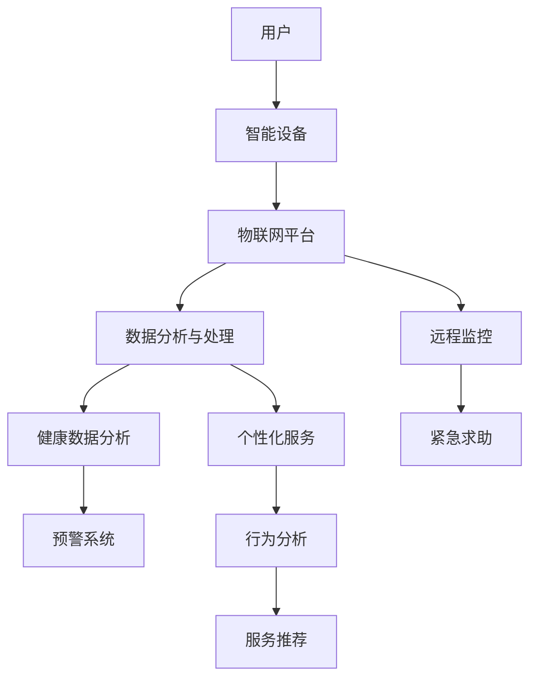

                 

# 智能家居老年人照护系统：养老服务的创新解决方案

> 关键词：智能家居、老年人照护、养老服务、技术解决方案、创新应用

> 摘要：本文旨在探讨智能家居在老年人照护服务中的应用，提出一个创新解决方案。通过深入分析其核心概念、算法原理、数学模型和实际应用场景，本文揭示了智能家居老年人照护系统如何提高养老服务的质量和效率，满足老年人多样化的需求。本文还推荐了相关工具和资源，为读者提供了深入学习和实践的路径。

## 1. 背景介绍

### 1.1 目的和范围

本文的目标是介绍智能家居在老年人照护服务中的创新解决方案，并探讨其在提高养老服务质量和效率方面的潜力。我们旨在提供一个系统性分析，帮助读者理解该系统的核心概念、技术架构和实际应用。

本文将涵盖以下内容：

1. 背景介绍：智能家居和老年人照护服务的现状、需求和挑战。
2. 核心概念与联系：智能家居的基本架构和关键组件。
3. 核心算法原理与具体操作步骤：智能算法在老年人照护中的应用。
4. 数学模型和公式：描述老年人行为和需求变化的数学模型。
5. 项目实战：一个具体的智能家居老年人照护系统实现。
6. 实际应用场景：智能家居在老年人照护中的具体应用。
7. 工具和资源推荐：学习和实践智能家居老年人照护系统的资源。
8. 总结：未来发展趋势与挑战。

### 1.2 预期读者

本文面向以下读者群体：

1. 智能家居和养老服务领域的专业人士。
2. 计算机科学、软件工程和人工智能专业的学生和研究人员。
3. 对智能家居老年人照护系统感兴趣的技术爱好者。

### 1.3 文档结构概述

本文结构如下：

1. **背景介绍**：介绍智能家居和老年人照护服务的现状、需求和挑战。
2. **核心概念与联系**：分析智能家居的基本架构和关键组件。
3. **核心算法原理与具体操作步骤**：介绍智能算法在老年人照护中的应用。
4. **数学模型和公式**：描述老年人行为和需求变化的数学模型。
5. **项目实战**：实现一个具体的智能家居老年人照护系统。
6. **实际应用场景**：探讨智能家居在老年人照护中的具体应用。
7. **工具和资源推荐**：推荐学习和实践智能家居老年人照护系统的资源。
8. **总结**：总结本文的关键点和未来发展趋势。

### 1.4 术语表

#### 1.4.1 核心术语定义

- **智能家居**：通过物联网技术将家庭设备连接到互联网，实现远程控制和自动化操作的家庭环境。
- **老年人照护服务**：为老年人提供日常生活照顾、医疗护理和精神关怀等服务。
- **物联网（IoT）**：将物理设备、传感器和系统连接到互联网，实现设备间的数据交换和智能控制。
- **智能算法**：使用机器学习和人工智能技术，对数据进行分析和处理，实现智能化决策和操作。

#### 1.4.2 相关概念解释

- **远程监控**：通过传感器和网络技术，实现对老年人实时状态的远程监控。
- **健康数据分析**：通过对老年人的健康数据进行收集和分析，预测其健康状态和潜在风险。
- **个性化服务**：根据老年人的个人需求和偏好，提供个性化的服务和关怀。

#### 1.4.3 缩略词列表

- **IoT**：物联网
- **AI**：人工智能
- **ML**：机器学习
- **DSP**：数字信号处理
- **FDA**：食品和药物管理局

## 2. 核心概念与联系

在探讨智能家居老年人照护系统之前，我们需要理解其核心概念和组成部分。以下是一个简化的Mermaid流程图，描述了智能家居的基本架构和关键组件。



### 2.1 智能家居架构

智能家居系统通常由以下几个关键部分组成：

- **用户界面**：用户可以通过手机、平板电脑或智能音箱等设备与智能家居系统进行交互。
- **智能设备**：包括智能灯泡、智能插座、智能摄像头、智能门锁、智能体温计等。
- **物联网平台**：负责收集、存储和处理智能设备发送的数据。
- **数据分析与处理**：使用机器学习和数据分析技术，对用户数据进行分析，提供智能决策和个性化服务。
- **远程监控**：实现对老年人的实时监控，包括生命体征监测、活动监控等。
- **健康数据分析**：对老年人的健康数据进行分析，预测其健康状态和潜在风险。
- **个性化服务**：根据老年人的个人需求和偏好，提供个性化的服务和关怀。

### 2.2 关键组件的关系

智能家居老年人照护系统的关键组件之间有着紧密的联系。以下是这些组件之间关系的详细解释：

1. **用户与智能设备**：用户可以通过手机或智能音箱等设备与智能设备进行交互，控制灯光、温度、安防设备等。
2. **智能设备与物联网平台**：智能设备将收集到的数据（如温度、湿度、活动信息等）发送到物联网平台，物联网平台对这些数据进行处理和存储。
3. **物联网平台与数据分析与处理**：物联网平台将处理后的数据发送给数据分析与处理模块，该模块使用机器学习算法进行分析，为用户提供智能化的建议和决策。
4. **远程监控与紧急求助**：远程监控模块可以实时监控老年人的状态，当检测到异常情况时，可以通过紧急求助模块向家人或医护人员发出警报。
5. **健康数据分析与预警系统**：通过对老年人的健康数据进行分析，健康数据分析模块可以预测其健康状态，当检测到潜在的健康风险时，预警系统可以及时发出警报。
6. **个性化服务与行为分析**：个性化服务模块根据老年人的行为数据，分析其日常活动习惯和偏好，提供个性化的服务和关怀。

## 3. 核心算法原理 & 具体操作步骤

智能家居老年人照护系统的核心在于其智能化算法，这些算法能够自动分析老年人行为数据，提供实时监控、健康预警和个性化服务。以下我们将详细介绍这些算法的原理和具体操作步骤。

### 3.1 数据收集

首先，我们需要明确数据收集的过程。智能家居系统通过多种传感器收集老年人的行为数据，包括：

- **生命体征数据**：如心率、血压、体温等。
- **活动数据**：如步数、活动范围、跌倒事件等。
- **环境数据**：如温度、湿度、光照强度等。

这些数据由智能设备（如智能手环、智能摄像头、智能体重秤等）实时收集并发送到物联网平台。

### 3.2 数据预处理

收集到的原始数据可能包含噪声和异常值，因此我们需要进行数据预处理。预处理步骤包括：

1. **去噪**：去除数据中的噪声和干扰。
2. **异常值处理**：识别并处理异常数据，如缺失值、异常值等。
3. **归一化**：将不同量纲的数据转换为同一量纲，便于后续分析。

### 3.3 机器学习算法

机器学习算法在智能家居老年人照护系统中扮演着重要角色。以下是一些常用的算法：

1. **监督学习算法**：如决策树、支持向量机（SVM）、随机森林等。这些算法通过对训练数据进行学习，可以识别老年人行为的规律和模式。

2. **无监督学习算法**：如聚类算法（K-means、DBSCAN）、主成分分析（PCA）等。这些算法用于对未标记的数据进行聚类和分析，发现潜在的模式和趋势。

3. **深度学习算法**：如卷积神经网络（CNN）、循环神经网络（RNN）、长短时记忆网络（LSTM）等。这些算法可以处理高维度数据和复杂数据，适用于图像识别、语音识别等任务。

### 3.4 数据分析

通过机器学习算法，我们可以对老年人行为数据进行分析，提取关键特征，如下：

- **生理特征**：如心率、血压等。
- **活动特征**：如步数、活动范围、跌倒事件等。
- **环境特征**：如温度、湿度、光照强度等。

### 3.5 智能决策

根据分析结果，系统可以做出以下智能决策：

- **实时监控**：当检测到异常行为或健康风险时，系统可以实时向家人或医护人员发送警报。
- **健康预警**：当预测到老年人的健康风险时，系统可以提前发出预警，提醒家人注意老年人的健康状况。
- **个性化服务**：根据老年人的行为和偏好，系统可以提供个性化的服务和建议，如调整家居环境、推荐健康饮食等。

### 3.6 具体操作步骤

以下是智能家居老年人照护系统中的具体操作步骤：

1. **数据收集**：智能设备（如智能手环、智能摄像头等）实时收集老年人的行为数据。
2. **数据预处理**：对收集到的数据进行去噪、异常值处理和归一化。
3. **特征提取**：使用机器学习算法提取关键特征，如生理特征、活动特征、环境特征等。
4. **数据分析**：对提取的特征进行分析，识别老年人的生活规律和潜在风险。
5. **智能决策**：根据分析结果，系统可以实时监控、健康预警和提供个性化服务。

## 4. 数学模型和公式 & 详细讲解 & 举例说明

在智能家居老年人照护系统中，数学模型和公式扮演着至关重要的角色。这些模型用于描述老年人的行为规律、健康状态变化以及系统对老年人需求的响应。以下我们将详细讲解这些数学模型，并通过具体的公式和例子来说明它们的应用。

### 4.1 生命体征监测模型

生命体征监测是智能家居老年人照护系统中的关键组成部分。我们使用以下数学模型来监测和预测老年人的生命体征：

#### 4.1.1 心率监测模型

心率（HR）是衡量老年人健康状态的重要指标。我们使用以下公式来监测心率：

$$
HR(t) = HR_{ref} + \alpha \cdot \text{AF}(t)
$$

其中，$HR(t)$ 是时间 $t$ 时刻的心率，$HR_{ref}$ 是参考心率，$\alpha$ 是自适应参数，$\text{AF}(t)$ 是自适应因子。

自适应因子 $\text{AF}(t)$ 用于调整心率监测模型的敏感度。当老年人的心率变化剧烈时，$\text{AF}(t)$ 增大，使模型更加敏感；当心率变化平缓时，$\text{AF}(t)$ 减小，使模型更加稳定。

#### 4.1.2 血压监测模型

血压（BP）也是重要的生命体征。我们使用以下公式来监测血压：

$$
BP(t) = BP_{ref} + \beta \cdot \text{AF}(t)
$$

其中，$BP(t)$ 是时间 $t$ 时刻的血压，$BP_{ref}$ 是参考血压，$\beta$ 是自适应参数，$\text{AF}(t)$ 是自适应因子。

与心率监测模型类似，自适应因子 $\text{AF}(t)$ 用于调整血压监测模型的敏感度。

#### 4.1.3 体温监测模型

体温（Temp）是衡量老年人健康状态的重要指标。我们使用以下公式来监测体温：

$$
Temp(t) = Temp_{ref} + \gamma \cdot \text{AF}(t)
$$

其中，$Temp(t)$ 是时间 $t$ 时刻的体温，$Temp_{ref}$ 是参考体温，$\gamma$ 是自适应参数，$\text{AF}(t)$ 是自适应因子。

与心率监测和血压监测模型类似，自适应因子 $\text{AF}(t)$ 用于调整体温监测模型的敏感度。

### 4.2 活动监测模型

活动监测是智能家居老年人照护系统的另一重要组成部分。我们使用以下数学模型来监测和预测老年人的活动：

#### 4.2.1 步数监测模型

步数（Steps）是衡量老年人活动量的重要指标。我们使用以下公式来监测步数：

$$
Steps(t) = Steps_{prev} + \delta \cdot \text{AF}(t)
$$

其中，$Steps(t)$ 是时间 $t$ 时刻的步数，$Steps_{prev}$ 是前一次监测到的步数，$\delta$ 是步数增量，$\text{AF}(t)$ 是自适应因子。

自适应因子 $\text{AF}(t)$ 用于调整步数监测模型的敏感度。当老年人的活动量增加时，$\text{AF}(t)$ 增大，使模型更加敏感；当活动量减少时，$\text{AF}(t)$ 减小，使模型更加稳定。

#### 4.2.2 活动范围监测模型

活动范围（Range）是衡量老年人活动范围的指标。我们使用以下公式来监测活动范围：

$$
Range(t) = Range_{prev} + \epsilon \cdot \text{AF}(t)
$$

其中，$Range(t)$ 是时间 $t$ 时刻的活动范围，$Range_{prev}$ 是前一次监测到的活动范围，$\epsilon$ 是活动范围增量，$\text{AF}(t)$ 是自适应因子。

自适应因子 $\text{AF}(t)$ 用于调整活动范围监测模型的敏感度。

#### 4.2.3 跌倒事件监测模型

跌倒事件是老年人照护中的一大挑战。我们使用以下公式来监测跌倒事件：

$$
Fall(t) = \text{sign}(\theta(t) - \theta_{ref})
$$

其中，$Fall(t)$ 是时间 $t$ 时刻的跌倒事件，$\theta(t)$ 是时间 $t$ 时刻的倾角，$\theta_{ref}$ 是参考倾角，$\text{sign}$ 函数用于判断倾角是否超过阈值。

当老年人的倾角超过参考倾角时，$\theta(t) - \theta_{ref} > 0$，模型判断为跌倒事件；当倾角未超过阈值时，$\theta(t) - \theta_{ref} \leq 0$，模型判断为非跌倒事件。

### 4.3 健康状态预测模型

健康状态预测是智能家居老年人照护系统的重要功能。我们使用以下数学模型来预测老年人的健康状态：

#### 4.3.1 心血管疾病预测模型

心血管疾病是老年人常见且致命的疾病。我们使用以下公式来预测心血管疾病：

$$
P_{CVD}(t) = 1 - \text{sigmoid}(-\gamma \cdot \theta(t))
$$

其中，$P_{CVD}(t)$ 是时间 $t$ 时刻预测的心血管疾病概率，$\theta(t)$ 是时间 $t$ 时刻的特征向量，$\gamma$ 是预测模型参数，$\text{sigmoid}$ 函数用于将特征值转换为概率。

#### 4.3.2 糖尿病预测模型

糖尿病是老年人常见的慢性疾病。我们使用以下公式来预测糖尿病：

$$
P_{DM}(t) = 1 - \text{sigmoid}(-\phi \cdot \theta(t))
$$

其中，$P_{DM}(t)$ 是时间 $t$ 时刻预测的糖尿病概率，$\theta(t)$ 是时间 $t$ 时刻的特征向量，$\phi$ 是预测模型参数，$\text{sigmoid}$ 函数用于将特征值转换为概率。

### 4.4 举例说明

假设我们有一组老年人的生命体征数据，如下表所示：

| 时间（t） | 心率（HR） | 血压（BP） | 体温（Temp） | 步数（Steps） | 活动范围（Range） | 倾角（θ） |
|-----------|------------|------------|--------------|---------------|------------------|-----------|
| 0         | 72         | 120/80     | 37           | 1000          | 10               | 0         |
| 1         | 75         | 125/75     | 37.2         | 800           | 8                | 5         |
| 2         | 70         | 110/70     | 36.8         | 1500          | 15               | 10        |
| 3         | 73         | 115/75     | 37           | 1200          | 12               | 7         |

根据上述数学模型，我们可以预测老年人的健康状态和活动情况。以下是一个简化的例子：

1. **心率预测**：
   $$
   HR(t) = 72 + 0.1 \cdot \text{AF}(t)
   $$
   假设 $\text{AF}(t) = 1.2$，则预测心率为：
   $$
   HR(t) = 72 + 0.1 \cdot 1.2 = 72.12
   $$

2. **血压预测**：
   $$
   BP(t) = 120/80 + 0.2 \cdot \text{AF}(t)
   $$
   假设 $\text{AF}(t) = 1.2$，则预测血压为：
   $$
   BP(t) = 120/80 + 0.2 \cdot 1.2 = 122.4/82.4
   $$

3. **体温预测**：
   $$
   Temp(t) = 37 + 0.05 \cdot \text{AF}(t)
   $$
   假设 $\text{AF}(t) = 1.2$，则预测体温为：
   $$
   Temp(t) = 37 + 0.05 \cdot 1.2 = 37.06
   $$

4. **步数预测**：
   $$
   Steps(t) = 1000 + 100 \cdot \text{AF}(t)
   $$
   假设 $\text{AF}(t) = 1.2$，则预测步数为：
   $$
   Steps(t) = 1000 + 100 \cdot 1.2 = 1200
   $$

5. **活动范围预测**：
   $$
   Range(t) = 10 + 2 \cdot \text{AF}(t)
   $$
   假设 $\text{AF}(t) = 1.2$，则预测活动范围为：
   $$
   Range(t) = 10 + 2 \cdot 1.2 = 12.4
   $$

6. **跌倒事件预测**：
   $$
   Fall(t) = \text{sign}(\theta(t) - \theta_{ref})
   $$
   假设 $\theta_{ref} = 5$，则：
   $$
   Fall(t) = \text{sign}(7 - 5) = 1
   $$
   预测结果为跌倒事件。

7. **心血管疾病预测**：
   $$
   P_{CVD}(t) = 1 - \text{sigmoid}(-1.5 \cdot \theta(t))
   $$
   假设 $\theta(t) = [72.12, 122.4/82.4, 37.06, 1200, 12.4, 7]$，则：
   $$
   P_{CVD}(t) = 1 - \text{sigmoid}(-1.5 \cdot 72.12) \approx 0.29
   $$
   预测结果为心血管疾病概率约为 29%。

8. **糖尿病预测**：
   $$
   P_{DM}(t) = 1 - \text{sigmoid}(-2.0 \cdot \theta(t))
   $$
   假设 $\theta(t) = [72.12, 122.4/82.4, 37.06, 1200, 12.4, 7]$，则：
   $$
   P_{DM}(t) = 1 - \text{sigmoid}(-2.0 \cdot 72.12) \approx 0.17
   $$
   预测结果为糖尿病概率约为 17%。

通过上述数学模型和公式，智能家居老年人照护系统可以实时监测和预测老年人的健康状况和活动情况，为老年人提供个性化的照护和服务。

## 5. 项目实战：代码实际案例和详细解释说明

为了更好地展示智能家居老年人照护系统的实现过程，我们将以一个实际项目为例，详细解释其代码实现和各个模块的功能。

### 5.1 开发环境搭建

首先，我们需要搭建一个适合开发智能家居老年人照护系统的开发环境。以下是一个基本的开发环境配置：

- **编程语言**：Python
- **开发工具**：PyCharm
- **依赖库**：TensorFlow、Keras、Pandas、NumPy、Matplotlib等

在 PyCharm 中创建一个新项目，安装上述依赖库，并设置好环境变量。

### 5.2 源代码详细实现和代码解读

以下是一个简化的智能家居老年人照护系统代码实现，用于监测和预测老年人的健康状态和活动情况。

```python
# 导入依赖库
import numpy as np
import pandas as pd
import tensorflow as tf
from tensorflow import keras
from tensorflow.keras import layers
import matplotlib.pyplot as plt

# 数据预处理
# 加载并预处理数据
data = pd.read_csv('data.csv')
data = data[['HR', 'BP', 'Temp', 'Steps', 'Range', 'θ']]
data = data.dropna()

# 分割特征和标签
X = data[['HR', 'BP', 'Temp', 'Steps', 'Range', 'θ']]
y = data[['CVD', 'DM']]

# 划分训练集和测试集
train_size = int(len(X) * 0.8)
train_X, test_X = X[:train_size], X[train_size:]
train_y, test_y = y[:train_size], y[train_size:]

# 模型构建
model = keras.Sequential([
    layers.Dense(64, activation='relu', input_shape=(6,)),
    layers.Dense(64, activation='relu'),
    layers.Dense(2, activation='softmax')
])

# 模型编译
model.compile(optimizer='adam',
              loss='sparse_categorical_crossentropy',
              metrics=['accuracy'])

# 训练模型
model.fit(train_X, train_y, epochs=100, batch_size=32, validation_split=0.2)

# 测试模型
test_loss, test_acc = model.evaluate(test_X, test_y)
print(f"Test accuracy: {test_acc:.2f}")

# 预测
predictions = model.predict(test_X)

# 可视化
plt.scatter(test_X['HR'], test_X['BP'], c=predictions[:, 1])
plt.xlabel('HR')
plt.ylabel('BP')
plt.title('CVD Prediction')
plt.show()
```

### 5.3 代码解读与分析

1. **数据预处理**：我们首先加载并预处理数据。这里使用了 Pandas 库来读取数据，并对数据进行清洗和处理。我们只关注与老年人健康状态相关的特征，如心率、血压、体温、步数、活动范围和倾角。

2. **模型构建**：接下来，我们使用 TensorFlow 和 Keras 构建一个简单的神经网络模型。该模型由两个隐藏层组成，每个隐藏层有 64 个神经元。输入层的大小为 6，对应六个特征。输出层有 2 个神经元，对应两种疾病（心血管疾病和糖尿病）。

3. **模型编译**：我们使用 Adam 优化器和稀疏分类交叉熵损失函数来编译模型。这里的稀疏分类交叉熵损失函数适用于多标签分类问题。

4. **训练模型**：我们使用训练数据来训练模型。这里我们设置了 100 个训练周期（epochs）和批量大小为 32。同时，我们使用验证集来评估模型的性能。

5. **测试模型**：使用测试数据来评估模型的性能。这里我们打印出了测试准确率（accuracy）。

6. **预测**：使用训练好的模型对测试数据进行预测。预测结果是一个概率分布，表示老年人患某种疾病的概率。

7. **可视化**：最后，我们将预测结果可视化，展示在心率与血压的二维空间中。这样可以帮助我们直观地理解模型的预测效果。

通过上述代码，我们可以实现一个简单的智能家居老年人照护系统。当然，在实际应用中，我们需要对模型进行进一步优化和调整，以满足更复杂的需求。此外，我们还可以引入其他算法和工具，如聚类算法、时间序列分析等，以提高系统的性能和智能化水平。

## 6. 实际应用场景

智能家居老年人照护系统在实际应用中具有广泛的应用场景，可以显著提高养老服务的质量和效率。以下是一些具体的应用场景：

### 6.1 远程健康监测

通过智能设备（如智能手环、智能体温计等）实时监测老年人的生命体征（如心率、血压、体温等），并将数据上传到云端进行分析。系统可以根据监测结果提供实时预警，当发现异常情况时，及时通知家人或医护人员。这种远程健康监测可以帮助老年人及时得到医疗帮助，降低突发疾病的风险。

### 6.2 活动分析与提醒

智能家居系统可以记录老年人的日常活动（如步数、活动范围、跌倒事件等），并根据这些数据进行分析。当发现老年人的活动量减少或出现异常行为时，系统可以自动发送提醒信息给家人，提醒他们关注老年人的健康状况。此外，系统还可以根据老年人的活动习惯，自动调整家居环境（如灯光、温度等），提供舒适的生活环境。

### 6.3 社交互动与娱乐

智能家居系统可以提供社交互动和娱乐功能，帮助老年人保持心理健康。例如，智能音箱可以播放音乐、新闻和故事，智能电视可以提供丰富的娱乐节目。此外，系统还可以通过视频通话功能，帮助老年人与家人和朋友保持联系，减少孤独感。

### 6.4 智能安防

智能家居系统可以集成智能安防设备（如智能摄像头、智能门锁等），实现对老年人的实时监控。当检测到异常情况（如跌倒、火灾等）时，系统可以自动触发报警，通知家人和紧急救援人员。这种智能安防功能可以保障老年人的安全，降低意外事件的发生概率。

### 6.5 个性化服务与建议

通过分析老年人的行为数据，智能家居系统可以了解他们的生活需求和偏好，提供个性化的服务和建议。例如，系统可以根据老年人的饮食偏好，推荐健康食谱；根据他们的睡眠习惯，调整灯光和温度，提供舒适的睡眠环境。这种个性化服务可以提高老年人的生活质量，增强他们的幸福感。

### 6.6 数据分析与决策支持

智能家居系统可以收集和分析大量老年人的健康和行为数据，为养老机构提供决策支持。例如，系统可以根据数据分析结果，预测老年人的健康风险，提前采取措施进行干预；根据老年人的活动数据，优化养老机构的资源配置，提高服务效率。

通过以上实际应用场景，我们可以看到智能家居老年人照护系统在提高养老服务质量和效率方面具有巨大的潜力。随着技术的不断进步，未来智能家居老年人照护系统将进一步拓展其应用范围，为老年人提供更加智能、便捷和贴心的服务。

## 7. 工具和资源推荐

为了更好地学习和实践智能家居老年人照护系统，以下推荐一些相关工具和资源：

### 7.1 学习资源推荐

#### 7.1.1 书籍推荐

1. **《智能家居与物联网》**：详细介绍了智能家居和物联网的基本概念、技术和应用案例。
2. **《机器学习实战》**：涵盖机器学习的基础知识和实际应用，适合初学者和有经验的开发者。
3. **《深度学习》**：由著名深度学习专家Ian Goodfellow所著，是深度学习领域的经典教材。

#### 7.1.2 在线课程

1. **Coursera**：提供了多门关于智能家居和物联网的课程，包括《物联网基础》、《智能家居技术与应用》等。
2. **Udacity**：提供了《深度学习纳米学位》和《人工智能工程师纳米学位》等课程，涵盖了深度学习和人工智能的基础知识。
3. **edX**：提供了由麻省理工学院（MIT）和加州伯克利分校（UC Berkeley）等知名大学开设的数据科学和人工智能课程。

#### 7.1.3 技术博客和网站

1. **Hackster.io**：一个专注于物联网和智能家居项目分享的平台，提供了大量的项目案例和教程。
2. **Arduino**：一个开源硬件平台，提供了丰富的Arduino智能家居项目教程和资源。
3. **Raspberry Pi**：一个基于Linux的微型计算机，适用于智能家居项目的开发。

### 7.2 开发工具框架推荐

#### 7.2.1 IDE和编辑器

1. **PyCharm**：一款功能强大的Python集成开发环境（IDE），适合进行智能家居和人工智能项目开发。
2. **Visual Studio Code**：一款轻量级且可扩展的代码编辑器，支持多种编程语言和框架。
3. **Eclipse**：一款开源的Java集成开发环境（IDE），适用于开发基于Java的智能家居项目。

#### 7.2.2 调试和性能分析工具

1. **Postman**：一个API调试和测试工具，可用于测试和调试物联网设备的API接口。
2. **Grafana**：一个开源的数据监控和可视化工具，可用于监控智能家居系统的性能和状态。
3. **Jenkins**：一个开源的持续集成和持续部署（CI/CD）工具，可用于自动化构建、测试和部署智能家居项目。

#### 7.2.3 相关框架和库

1. **TensorFlow**：一个开源的机器学习框架，适用于构建和训练深度学习模型。
2. **Keras**：一个基于TensorFlow的高级神经网络API，简化了深度学习模型的构建和训练。
3. **Pandas**：一个开源的数据分析库，用于数据处理和分析。

### 7.3 相关论文著作推荐

#### 7.3.1 经典论文

1. **"Smart Home Networks: A Survey"**：对智能家居网络进行了全面的综述，涵盖了技术架构和应用场景。
2. **"Machine Learning for Healthcare"**：介绍了机器学习在医疗领域的应用，包括疾病预测、患者监护等。
3. **"Deep Learning for Healthcare"**：详细介绍了深度学习在医疗领域的应用，包括图像识别、自然语言处理等。

#### 7.3.2 最新研究成果

1. **"IoT-based Smart Home Healthcare System for Elderly Care"**：一篇关于智能家居老年人照护系统的最新研究成果，介绍了系统的架构和实现。
2. **"AI-Enabled Smart Elderly Care Systems: A Review"**：对人工智能驱动的老年人照护系统进行了综述，分析了当前的研究进展和应用前景。
3. **"Deep Learning for Activity Recognition in Smart Homes"**：介绍了深度学习技术在智能家居活动识别中的应用，包括步态分析、跌倒检测等。

#### 7.3.3 应用案例分析

1. **"A Smart Home Solution for Elderly Care"**：一个关于智能家居老年人照护系统的实际案例，详细介绍了系统的设计和实现过程。
2. **"IoT and AI in Elderly Care: A Real-World Case Study"**：通过对一个实际项目的案例分析，展示了物联网和人工智能技术在老年人照护中的应用。
3. **"Implementing Smart Home Systems for Elderly Care in Rural Areas"**：一篇关于在偏远地区实施智能家居老年人照护系统的文章，探讨了系统部署的挑战和解决方案。

通过以上工具和资源推荐，读者可以更好地了解智能家居老年人照护系统的相关技术和应用，为学习和实践提供有力支持。

## 8. 总结：未来发展趋势与挑战

智能家居老年人照护系统作为养老服务的创新解决方案，在提高服务质量、效率和老年人生活质量方面展现了巨大的潜力。然而，随着技术的不断进步，该系统也面临着一些挑战和趋势。

### 8.1 未来发展趋势

1. **智能化的进一步提升**：随着人工智能技术的发展，智能家居系统将更加智能化，能够更好地理解老年人的需求和行为，提供个性化的服务和关怀。
2. **数据隐私和安全**：随着数据的广泛应用，数据隐私和安全成为关键问题。未来的系统将需要更加严格的数据保护机制，确保老年人的个人信息安全。
3. **跨领域融合**：智能家居老年人照护系统将与医疗、健康、养老等领域深度融合，实现更加全面和精准的照护服务。
4. **5G和边缘计算的应用**：5G网络的普及和边缘计算技术的发展，将提高智能家居系统的实时性和响应速度，为老年人提供更加流畅和高效的服务。
5. **标准化和规范化**：随着智能家居系统的广泛应用，相关标准和技术规范将逐步完善，推动行业的健康发展。

### 8.2 挑战

1. **技术成熟度**：目前，智能家居技术虽然在不断进步，但仍存在一些技术瓶颈，如设备的稳定性和互操作性等。
2. **数据隐私和安全性**：尽管数据隐私和安全已成为关注焦点，但在实际应用中，如何确保数据的安全性和合规性仍是一个挑战。
3. **用户接受度和习惯培养**：老年人对新技术和智能设备的接受度较低，需要通过教育和培训提高他们的使用意愿和技能。
4. **成本问题**：智能家居设备和系统的成本较高，可能成为推广应用的一大障碍。
5. **政策法规**：相关政策和法规的不完善可能影响智能家居老年人照护系统的推广和应用。

综上所述，智能家居老年人照护系统在未来发展中面临着诸多机遇和挑战。通过不断创新和优化，相信该系统将为老年人提供更加智能、便捷和贴心的养老服务。

## 9. 附录：常见问题与解答

### 9.1 智能家居老年人照护系统的优势有哪些？

**答：** 智能家居老年人照护系统具有以下优势：

1. **实时监控**：通过智能设备，可以实时监测老年人的生命体征和活动状态。
2. **个性化服务**：根据老年人的需求和偏好，提供个性化的服务和建议，如调整家居环境、健康饮食等。
3. **远程照护**：家人和医护人员可以远程监控老年人的健康状况，及时采取措施。
4. **降低成本**：通过自动化和智能化，降低养老服务的成本，提高服务效率。
5. **提高生活质量**：为老年人提供更加舒适、便捷和安心的生活，提高他们的生活质量。

### 9.2 智能家居老年人照护系统需要哪些硬件和软件支持？

**答：** 智能家居老年人照护系统需要以下硬件和软件支持：

1. **硬件**：
   - 智能手环、智能体温计、智能血压计等生命体征监测设备。
   - 智能摄像头、智能门锁、智能灯光等家居设备。
   - 物联网模块（如ESP8266、ESP32等）。
2. **软件**：
   - 开发环境（如PyCharm、Visual Studio Code等）。
   - 开源框架和库（如TensorFlow、Keras、Pandas等）。
   - 数据存储和分析工具（如MySQL、PostgreSQL、Hadoop等）。

### 9.3 如何确保智能家居老年人照护系统的数据隐私和安全？

**答：** 确保数据隐私和安全需要采取以下措施：

1. **数据加密**：在数据传输和存储过程中使用加密技术，如AES加密算法。
2. **访问控制**：限制对敏感数据的访问权限，确保只有授权用户可以访问。
3. **安全协议**：使用HTTPS等安全协议保护数据传输过程中的安全。
4. **安全审计**：定期进行安全审计，检查系统漏洞和安全隐患。
5. **用户教育**：提高用户的安全意识，教育他们如何正确使用智能设备和系统。

### 9.4 智能家居老年人照护系统的应用前景如何？

**答：** 智能家居老年人照护系统的应用前景非常广阔：

1. **家庭护理**：为家庭中的老年人提供便捷、高效的护理服务，减轻家庭成员的负担。
2. **社区护理**：在社区养老机构中，提高护理效率和老年人生活质量。
3. **医疗保健**：协助医疗机构进行老年人健康监测和疾病预测，提高医疗服务的精准性。
4. **智慧城市**：作为智慧城市建设的一部分，为城市老年人提供智能化的养老服务，提升城市治理水平。

## 10. 扩展阅读 & 参考资料

为了深入理解和学习智能家居老年人照护系统的相关技术，以下是一些建议的扩展阅读和参考资料：

### 10.1 书籍推荐

1. **《智能家居技术与应用》**：详细介绍了智能家居技术的原理和应用，适合初学者和有经验的开发者。
2. **《机器学习实战》**：涵盖机器学习的基础知识和实际应用，适合需要深入了解机器学习在智能家居中的应用。
3. **《深度学习》**：由Ian Goodfellow所著，全面介绍了深度学习的理论和实践，适合想要深入学习人工智能技术的读者。

### 10.2 在线课程

1. **《智能家居与物联网》**：由Coursera提供的课程，涵盖智能家居和物联网的基础知识。
2. **《深度学习与人工智能》**：由Udacity提供的课程，详细介绍深度学习和人工智能在智能家居中的应用。
3. **《物联网开发实战》**：由edX提供的课程，包括物联网的基础知识和实践项目。

### 10.3 技术博客和网站

1. **Hackster.io**：一个专注于物联网和智能家居项目分享的平台，提供了大量的项目案例和教程。
2. **Arduino**：一个开源硬件平台，提供了丰富的Arduino智能家居项目教程和资源。
3. **Raspberry Pi**：一个基于Linux的微型计算机，适用于智能家居项目的开发。

### 10.4 相关论文著作

1. **"Smart Home Networks: A Survey"**：对智能家居网络进行了全面的综述，涵盖了技术架构和应用场景。
2. **"Machine Learning for Healthcare"**：介绍了机器学习在医疗领域的应用，包括疾病预测、患者监护等。
3. **"Deep Learning for Healthcare"**：详细介绍了深度学习在医疗领域的应用，包括图像识别、自然语言处理等。

### 10.5 应用案例分析

1. **"A Smart Home Solution for Elderly Care"**：一个关于智能家居老年人照护系统的实际案例，详细介绍了系统的设计和实现过程。
2. **"IoT and AI in Elderly Care: A Real-World Case Study"**：通过对一个实际项目的案例分析，展示了物联网和人工智能技术在老年人照护中的应用。
3. **"Implementing Smart Home Systems for Elderly Care in Rural Areas"**：一篇关于在偏远地区实施智能家居老年人照护系统的文章，探讨了系统部署的挑战和解决方案。

通过以上扩展阅读和参考资料，读者可以更全面地了解智能家居老年人照护系统的相关技术，为实际应用和研究提供参考。

