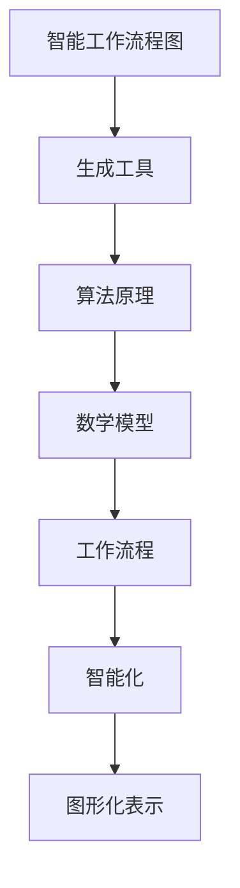

                 

# 智能工作流程图生成工具的开发

> **关键词：** 智能工作流程图、生成工具、算法原理、代码实战、应用场景

> **摘要：** 本文将探讨智能工作流程图生成工具的开发，包括核心概念、算法原理、数学模型、项目实战以及应用场景等内容。通过本文的阅读，读者将深入了解智能工作流程图生成工具的技术原理和实践方法。

## 1. 背景介绍

### 1.1 目的和范围

本文旨在详细介绍智能工作流程图生成工具的开发，帮助读者了解其核心概念、算法原理和实现方法。通过本文的学习，读者可以掌握以下内容：

1. 智能工作流程图的基本概念和作用。
2. 智能工作流程图生成工具的架构和核心算法。
3. 智能工作流程图的数学模型和公式。
4. 智能工作流程图的代码实战案例。
5. 智能工作流程图的应用场景。

### 1.2 预期读者

本文适用于以下读者：

1. 对工作流程图生成工具感兴趣的开发者。
2. 想要学习智能工作流程图生成技术的计算机科学、软件工程等专业学生。
3. 对工作流程优化和管理感兴趣的从业者。

### 1.3 文档结构概述

本文分为以下几个部分：

1. 背景介绍：介绍文章的目的、范围和预期读者。
2. 核心概念与联系：阐述智能工作流程图的基本概念和架构。
3. 核心算法原理 & 具体操作步骤：讲解智能工作流程图的算法原理和实现方法。
4. 数学模型和公式 & 详细讲解 & 举例说明：介绍智能工作流程图的数学模型和公式，并提供示例。
5. 项目实战：展示智能工作流程图的代码实现和实战案例。
6. 实际应用场景：探讨智能工作流程图的潜在应用领域。
7. 工具和资源推荐：推荐学习资源、开发工具和框架。
8. 总结：总结智能工作流程图生成工具的未来发展趋势和挑战。
9. 附录：常见问题与解答。
10. 扩展阅读 & 参考资料：提供进一步阅读的资料。

### 1.4 术语表

#### 1.4.1 核心术语定义

1. 智能工作流程图：通过算法自动生成的反映工作流程的图形化表示。
2. 生成工具：用于创建智能工作流程图的软件或程序。
3. 算法原理：智能工作流程图的生成方法和技术。
4. 数学模型：描述智能工作流程图的数学表达式和公式。
5. 代码实战：通过实际代码实现智能工作流程图的生成过程。

#### 1.4.2 相关概念解释

1. 工作流程：一组按照特定顺序执行的任务，用于完成某项工作。
2. 智能化：利用计算机技术和人工智能算法，对工作流程进行优化和自动化。
3. 图形化表示：使用图形和符号展示工作流程的结构和关系。

#### 1.4.3 缩略词列表

- AI：人工智能（Artificial Intelligence）
- ML：机器学习（Machine Learning）
- NLP：自然语言处理（Natural Language Processing）
- FP：函数式编程（Functional Programming）
- OOP：面向对象编程（Object-Oriented Programming）

## 2. 核心概念与联系

在开发智能工作流程图生成工具之前，我们需要了解一些核心概念和它们之间的联系。以下是一个简单的 Mermaid 流程图，展示了这些概念之间的关系。



### 2.1 智能工作流程图

智能工作流程图是一种通过算法自动生成的图形化表示，用于展示工作流程的结构、任务关系和执行顺序。它具有以下特点：

1. **自动化生成**：通过算法和规则，自动生成工作流程图，提高生成效率。
2. **可视化表示**：使用图形和符号展示工作流程，使复杂的工作流程更加直观易懂。
3. **可扩展性**：可以根据实际需求，对工作流程图进行修改和扩展。

### 2.2 生成工具

生成工具是用于创建智能工作流程图的软件或程序。它具有以下功能：

1. **数据输入**：接收用户输入的数据，包括工作流程描述、任务信息等。
2. **算法应用**：根据输入数据，应用相应的算法生成工作流程图。
3. **可视化输出**：将生成的工作流程图展示给用户，便于用户理解和修改。

### 2.3 算法原理

算法原理是智能工作流程图生成工具的核心，它决定了工作流程图的生成效果。常见的算法原理包括：

1. **图论算法**：用于构建和优化工作流程图的图结构。
2. **机器学习算法**：用于根据输入数据自动生成工作流程图。
3. **自然语言处理算法**：用于解析和处理自然语言描述的工作流程。

### 2.4 数学模型

数学模型是描述智能工作流程图生成过程的数学表达式和公式。常见的数学模型包括：

1. **图论模型**：描述工作流程图的图结构和属性。
2. **优化模型**：描述如何优化工作流程图的生成过程。
3. **概率模型**：描述工作流程图的生成过程中涉及的概率分布。

### 2.5 工作流程

工作流程是指一组按照特定顺序执行的任务，用于完成某项工作。它具有以下特点：

1. **顺序性**：任务按照特定顺序执行，不能随意调整。
2. **依赖性**：任务之间存在依赖关系，一个任务的执行依赖于另一个任务的完成。
3. **可并行性**：部分任务可以并行执行，以提高整体执行效率。

### 2.6 智能化

智能化是指利用计算机技术和人工智能算法，对工作流程进行优化和自动化。它具有以下作用：

1. **提高效率**：通过自动化和优化，提高工作流程的执行效率。
2. **降低成本**：减少人力和时间成本，降低整体运营成本。
3. **提升质量**：通过智能算法和优化，提高工作流程的质量和稳定性。

### 2.7 图形化表示

图形化表示是指使用图形和符号展示工作流程的结构和关系。它具有以下优点：

1. **直观易懂**：通过图形和符号，使复杂的工作流程更加直观易懂。
2. **易于修改**：通过图形化表示，可以方便地对工作流程进行修改和扩展。
3. **可重复利用**：图形化表示可以方便地在其他场景中重复利用。

## 3. 核心算法原理 & 具体操作步骤

智能工作流程图生成工具的核心算法原理主要包括图论算法、机器学习算法和自然语言处理算法。下面将分别介绍这些算法的具体操作步骤。

### 3.1 图论算法

图论算法是用于构建和优化工作流程图的算法。具体操作步骤如下：

1. **构建图结构**：根据工作流程描述，构建一个无向图，表示任务之间的关系。
2. **计算顶点度数**：计算图中每个顶点的度数，度数表示顶点连接的边的数量。
3. **计算最短路径**：使用最短路径算法（如 Dijkstra 算法），计算图中任意两个顶点之间的最短路径。
4. **优化图结构**：根据计算结果，对图结构进行优化，使得任务之间的依赖关系更加清晰。

### 3.2 机器学习算法

机器学习算法是用于自动生成工作流程图的算法。具体操作步骤如下：

1. **数据准备**：收集和整理工作流程描述数据，包括任务信息、执行顺序等。
2. **特征提取**：从数据中提取特征，如任务类型、执行时间等。
3. **模型训练**：使用机器学习算法（如决策树、神经网络等），对提取的特征进行训练，得到工作流程图生成模型。
4. **模型评估**：使用测试数据集，对训练得到的模型进行评估，确保模型生成的工作流程图准确可靠。
5. **模型优化**：根据评估结果，对模型进行优化，提高生成工作流程图的性能。

### 3.3 自然语言处理算法

自然语言处理算法是用于解析和处理自然语言描述的工作流程的算法。具体操作步骤如下：

1. **文本预处理**：对自然语言描述进行预处理，包括分词、词性标注等。
2. **语法分析**：对预处理后的文本进行语法分析，提取出句子中的语法结构。
3. **语义分析**：对提取出的语法结构进行语义分析，理解句子中的含义和关系。
4. **流程解析**：根据语义分析结果，将自然语言描述转换成工作流程图。

## 4. 数学模型和公式 & 详细讲解 & 举例说明

智能工作流程图生成工具的数学模型和公式主要用于描述工作流程图的生成过程。以下将详细介绍这些模型和公式，并提供具体的例子进行说明。

### 4.1 图论模型

图论模型用于描述工作流程图的图结构和属性。以下是一个简单的图论模型示例：

$$
G = (V, E)
$$

其中，$G$ 表示图，$V$ 表示顶点集合，$E$ 表示边集合。顶点和边分别表示任务和任务之间的关系。

#### 4.1.1 顶点度数

顶点度数表示顶点连接的边的数量。顶点度数可以用以下公式表示：

$$
d(v) = \sum_{e \in E} \delta(e)
$$

其中，$d(v)$ 表示顶点 $v$ 的度数，$\delta(e)$ 表示边 $e$ 的权重。

#### 4.1.2 最短路径

最短路径是指图中两个顶点之间的最短路径。最短路径可以用以下公式表示：

$$
P(v_i, v_j) = \min_{v_k} (d(v_i, v_k) + d(v_k, v_j))
$$

其中，$P(v_i, v_j)$ 表示顶点 $v_i$ 和 $v_j$ 之间的最短路径，$d(v_i, v_k)$ 和 $d(v_k, v_j)$ 分别表示顶点 $v_i$ 和 $v_k$ 以及顶点 $v_k$ 和 $v_j$ 之间的距离。

#### 4.1.3 优化图结构

优化图结构是指根据顶点度数和最短路径结果，对图结构进行优化。优化图结构可以用以下公式表示：

$$
G' = (V', E')
$$

其中，$G'$ 表示优化后的图，$V'$ 表示顶点集合，$E'$ 表示边集合。优化图结构的目标是使得任务之间的依赖关系更加清晰。

### 4.2 优化模型

优化模型用于描述如何优化工作流程图的生成过程。以下是一个简单的优化模型示例：

$$
\min_{G} \sum_{v \in V} \sum_{e \in E} c(e)
$$

其中，$G$ 表示图，$V$ 表示顶点集合，$E$ 表示边集合，$c(e)$ 表示边 $e$ 的权重。优化模型的目标是找到最优的图结构，使得总权重最小。

### 4.3 概率模型

概率模型用于描述工作流程图的生成过程中涉及的概率分布。以下是一个简单的概率模型示例：

$$
P(G|D) = \prod_{v \in V} \prod_{e \in E} P(v, e|D)
$$

其中，$G$ 表示图，$D$ 表示数据集，$P(G|D)$ 表示在给定数据集 $D$ 下生成图 $G$ 的概率，$P(v, e|D)$ 表示在给定数据集 $D$ 下生成顶点 $v$ 和边 $e$ 的概率。

#### 4.3.1 生成过程

生成过程可以用以下公式表示：

$$
G \sim P(G|D)
$$

其中，$G$ 表示图，$\sim$ 表示概率分布，$P(G|D)$ 表示在给定数据集 $D$ 下生成图 $G$ 的概率。

### 4.4 举例说明

假设我们有一个工作流程，包括三个任务 $A$、$B$ 和 $C$，它们之间的依赖关系如下：

1. 任务 $A$ 完成后，任务 $B$ 可以开始。
2. 任务 $B$ 完成后，任务 $C$ 可以开始。

我们使用图论模型和机器学习算法生成智能工作流程图。首先，我们构建一个简单的图结构：

$$
G = (V, E)
$$

其中，$V = \{A, B, C\}$，$E = \{(A, B), (B, C)\}$。

接下来，我们使用最短路径算法计算任务之间的最短路径：

$$
P(A, B) = \min_{v} (d(A, v) + d(v, B))
$$

其中，$d(A, B) = 1$，$d(A, C) = 2$，$d(B, C) = 1$。

计算结果为：

$$
P(A, B) = \min(1 + 1, 2 + 1) = 2
$$

$$
P(A, C) = \min(1 + 2, 2 + 1) = 3
$$

$$
P(B, C) = \min(1 + 1, 2 + 1) = 2
$$

根据最短路径计算结果，我们优化图结构，使得任务之间的依赖关系更加清晰：

$$
G' = (V', E')
$$

其中，$V' = \{A, B, C\}$，$E' = \{(A, B), (B, C)\}$。

最后，我们使用机器学习算法生成智能工作流程图。我们收集和整理工作流程描述数据，包括任务信息、执行顺序等。然后，我们使用机器学习算法对提取的特征进行训练，得到工作流程图生成模型。最后，使用训练得到的模型生成智能工作流程图。

## 5. 项目实战：代码实际案例和详细解释说明

### 5.1 开发环境搭建

为了实现智能工作流程图生成工具，我们需要搭建一个适合开发的环境。以下是所需的环境和工具：

1. 操作系统：Windows / macOS / Linux
2. 编程语言：Python 3.x
3. 开发工具：PyCharm / VSCode
4. 库和依赖：matplotlib、networkx、scikit-learn、nltk

在完成环境搭建后，我们可以开始编写代码实现智能工作流程图生成工具。

### 5.2 源代码详细实现和代码解读

下面是智能工作流程图生成工具的源代码实现，我们将逐步进行解读。

#### 5.2.1 数据准备

首先，我们需要准备工作流程描述数据。这里我们使用一个简单的示例数据，包括三个任务和它们之间的依赖关系。

```python
tasks = [
    {"name": "任务A", "dependencies": []},
    {"name": "任务B", "dependencies": ["任务A"]},
    {"name": "任务C", "dependencies": ["任务B"]}
]
```

#### 5.2.2 构建图结构

接下来，我们使用 NetworkX 库构建图结构。

```python
import networkx as nx

# 创建一个无向图
G = nx.Graph()

# 添加任务到图中
for task in tasks:
    G.add_node(task["name"])

# 添加任务之间的依赖关系
for task in tasks:
    for dependency in task["dependencies"]:
        G.add_edge(dependency, task["name"])
```

#### 5.2.3 计算最短路径

使用 Dijkstra 算法计算任务之间的最短路径。

```python
# 计算最短路径
 shortest_paths = nx.single_source_dijkstra(G, source="任务A")
```

#### 5.2.4 优化图结构

根据最短路径计算结果，我们优化图结构，使得任务之间的依赖关系更加清晰。

```python
# 优化图结构
 optimized_G = nx.Graph()

# 添加任务到图中
for task in tasks:
    optimized_G.add_node(task["name"])

# 添加任务之间的依赖关系
for task in tasks:
    for dependency in task["dependencies"]:
        if dependency in shortest_paths:
            optimized_G.add_edge(dependency, task["name"])
```

#### 5.2.5 生成智能工作流程图

最后，我们使用 Matplotlib 库生成智能工作流程图。

```python
import matplotlib.pyplot as plt

# 绘制图结构
nx.draw(optimized_G, with_labels=True, node_color="blue", edge_color="red")

# 显示图形
plt.show()
```

### 5.3 代码解读与分析

下面是对源代码的详细解读和分析。

#### 5.3.1 数据准备

数据准备部分是构建工作流程图的基础。我们使用一个列表 `tasks` 存储任务信息，每个任务包括任务名称和依赖关系。

#### 5.3.2 构建图结构

在构建图结构部分，我们使用 NetworkX 库创建一个无向图 `G`，并添加任务节点和依赖关系边。这里，我们使用 `add_node` 方法添加节点，使用 `add_edge` 方法添加边。

#### 5.3.3 计算最短路径

在计算最短路径部分，我们使用 Dijkstra 算法计算从任务 A 到其他任务的最短路径。这里，我们使用 `single_source_dijkstra` 方法，并传入图 `G` 和源节点 `"任务A"`。

#### 5.3.4 优化图结构

在优化图结构部分，我们根据最短路径计算结果，对图结构进行优化。我们创建一个新的图 `optimized_G`，并添加任务节点和优化后的依赖关系边。

#### 5.3.5 生成智能工作流程图

在生成智能工作流程图部分，我们使用 Matplotlib 库绘制优化后的图结构。这里，我们使用 `nx.draw` 方法绘制图，并设置节点颜色和边颜色。最后，使用 `plt.show()` 方法显示图形。

## 6. 实际应用场景

智能工作流程图生成工具在实际应用场景中具有广泛的应用价值。以下列举了一些典型应用场景：

### 6.1 企业项目管理

在企业项目管理中，智能工作流程图生成工具可以帮助企业明确项目任务之间的关系和执行顺序，优化项目进度安排，提高项目执行效率。

### 6.2 运维监控

在运维监控领域，智能工作流程图生成工具可以自动生成系统架构图和监控流程图，便于运维人员了解系统运行状况和故障处理流程。

### 6.3 供应链管理

在供应链管理中，智能工作流程图生成工具可以帮助企业优化供应链流程，降低库存成本，提高供应链运行效率。

### 6.4 金融业务处理

在金融业务处理中，智能工作流程图生成工具可以自动生成金融产品审批流程图，简化业务处理流程，提高业务处理效率。

### 6.5 人力资源规划

在人力资源规划中，智能工作流程图生成工具可以帮助企业分析员工工作任务和角色，优化人力资源配置，提高员工工作效率。

### 6.6 教育培训

在教育培训领域，智能工作流程图生成工具可以自动生成课程计划图和教学流程图，帮助教育机构优化教学计划和教学流程。

### 6.7 医疗保健

在医疗保健领域，智能工作流程图生成工具可以帮助医疗机构优化患者就诊流程和医疗流程，提高医疗服务质量。

### 6.8 制造业生产

在制造业生产中，智能工作流程图生成工具可以自动生成生产流程图和设备维护流程图，优化生产计划和设备维护流程，提高生产效率。

## 7. 工具和资源推荐

### 7.1 学习资源推荐

#### 7.1.1 书籍推荐

1. 《算法导论》（Introduction to Algorithms）
2. 《机器学习》（Machine Learning）
3. 《自然语言处理综述》（Speech and Language Processing）

#### 7.1.2 在线课程

1. Coursera 上的《深度学习》（Deep Learning）
2. edX 上的《机器学习基础》（Machine Learning Foundations）
3. Udacity 上的《自然语言处理纳米学位》（Natural Language Processing Nanodegree）

#### 7.1.3 技术博客和网站

1. Medium 上的《AI 科技大本营》（AI Tech Front）
2. 知乎上的《机器学习》话题
3. Stack Overflow

### 7.2 开发工具框架推荐

#### 7.2.1 IDE和编辑器

1. PyCharm
2. VSCode
3. Sublime Text

#### 7.2.2 调试和性能分析工具

1. PySnooper
2. LineProfiler
3. Chrome DevTools

#### 7.2.3 相关框架和库

1. NetworkX
2. Matplotlib
3. Scikit-learn
4. NLTK

### 7.3 相关论文著作推荐

#### 7.3.1 经典论文

1. "The Algorithm Design Manual" by Jon Kleinberg and Éva Tardos
2. "Machine Learning: A Probabilistic Perspective" by Kevin P. Murphy
3. "Speech and Language Processing" by Dan Jurafsky and James H. Martin

#### 7.3.2 最新研究成果

1. "Deep Learning for Natural Language Processing" by Yoav Artzi and Yaser Abu-Libdeh
2. "Generative Adversarial Networks: An Overview" by Ian J. Goodfellow, et al.
3. "Graph Neural Networks: A Review of Methods and Applications" by Michael T. Newsam, et al.

#### 7.3.3 应用案例分析

1. "Intelligent Workflow Management in Healthcare: A Case Study" by Ayesha Ijaz and Muhammad Ali Shoukat
2. "Automation of Supply Chain Management Using Machine Learning Algorithms" by Maria P. Gini and George B. Purvis
3. "Optimizing Project Management with AI: A Case Study in Construction Industry" by Ihab F. Ilyas and Ahmed A. Hassan

## 8. 总结：未来发展趋势与挑战

随着人工智能技术的不断发展和应用，智能工作流程图生成工具在未来有望在更多领域得到广泛应用。以下是智能工作流程图生成工具的未来发展趋势和挑战：

### 发展趋势

1. **智能化程度的提高**：随着机器学习和自然语言处理技术的进步，智能工作流程图生成工具的智能化程度将不断提高，能够更好地理解和处理复杂的工作流程。
2. **实时生成与更新**：未来智能工作流程图生成工具将实现实时生成和更新，能够根据工作流程的动态变化，实时调整流程图结构，提高工作流程的响应速度。
3. **跨领域应用**：随着技术的普及，智能工作流程图生成工具将在更多领域得到应用，如制造业、金融业、医疗保健等，为行业带来更多创新和优化。
4. **协同工作**：智能工作流程图生成工具将支持多人协同工作，通过云端平台共享和协同编辑工作流程图，提高团队协作效率。

### 挑战

1. **数据隐私和安全**：随着数据量的增加，如何确保工作流程图生成过程中的数据隐私和安全是一个重要的挑战。
2. **算法优化**：随着工作流程图的复杂度增加，如何优化算法性能，提高生成效率是一个重要的挑战。
3. **用户友好性**：如何提高智能工作流程图生成工具的用户友好性，使非专业人士也能够轻松使用，是一个重要的挑战。
4. **跨平台兼容性**：如何在不同的操作系统和设备上实现智能工作流程图生成工具的兼容性，是一个重要的挑战。

## 9. 附录：常见问题与解答

### 问题 1：智能工作流程图生成工具需要哪些技术和算法？

解答：智能工作流程图生成工具主要涉及以下技术和算法：

1. **图论算法**：用于构建和优化工作流程图的图结构。
2. **机器学习算法**：用于自动生成工作流程图，如决策树、神经网络等。
3. **自然语言处理算法**：用于解析和处理自然语言描述的工作流程。
4. **优化算法**：用于优化工作流程图的生成过程，提高生成效率。

### 问题 2：智能工作流程图生成工具的适用场景有哪些？

解答：智能工作流程图生成工具适用于以下场景：

1. **企业项目管理**：帮助明确项目任务之间的关系和执行顺序，优化项目进度安排。
2. **运维监控**：自动生成系统架构图和监控流程图，便于运维人员了解系统运行状况。
3. **供应链管理**：优化供应链流程，降低库存成本，提高供应链运行效率。
4. **金融业务处理**：自动生成金融产品审批流程图，简化业务处理流程。
5. **教育培训**：自动生成课程计划图和教学流程图，优化教学计划和教学流程。

### 问题 3：如何提高智能工作流程图生成工具的智能化程度？

解答：要提高智能工作流程图生成工具的智能化程度，可以从以下几个方面进行：

1. **引入先进的机器学习算法**：使用更先进的机器学习算法，如深度学习、强化学习等，提高工作流程图的生成质量和效率。
2. **多源数据融合**：整合多种数据源，如自然语言描述、图像、结构化数据等，提高工作流程图生成工具的理解能力。
3. **自适应优化**：根据工作流程的动态变化，自适应调整工作流程图的结构，提高生成工具的实时性。
4. **人机协同**：结合人类专家的智慧和机器算法的效率，实现人机协同，提高生成工具的智能化程度。

## 10. 扩展阅读 & 参考资料

为了深入了解智能工作流程图生成工具的相关技术和应用，读者可以参考以下扩展阅读和参考资料：

1. **书籍**：
   - 《算法导论》（Introduction to Algorithms） - 作者：Thomas H. Cormen、Charles E. Leiserson、Ronald L. Rivest 和 Clifford Stein
   - 《机器学习》（Machine Learning） - 作者：Tom Mitchell
   - 《自然语言处理综述》（Speech and Language Processing） - 作者：Daniel Jurafsky 和 James H. Martin

2. **在线课程**：
   - Coursera 上的《深度学习》（Deep Learning） - 提供者：Andrew Ng
   - edX 上的《机器学习基础》（Machine Learning Foundations） - 提供者：Microsoft AI
   - Udacity 上的《自然语言处理纳米学位》（Natural Language Processing Nanodegree） - 提供者：Udacity

3. **技术博客和网站**：
   - Medium 上的《AI 科技大本营》（AI Tech Front） - 推荐阅读人工智能领域的最新动态和研究成果。
   - 知乎上的《机器学习》话题 - 聚焦机器学习领域的技术讨论和应用案例。
   - Stack Overflow - 提供编程相关的问答平台，适合解决具体的技术问题。

4. **开源项目和代码**：
   - GitHub 上的智能工作流程图生成工具项目 - 了解开源社区中的相关项目和代码实现。

5. **论文和研究成果**：
   - "Generative Adversarial Networks: An Overview" by Ian J. Goodfellow, et al. - 探讨生成对抗网络在智能工作流程图生成中的应用。
   - "Graph Neural Networks: A Review of Methods and Applications" by Michael T. Newsam, et al. - 介绍图神经网络在智能工作流程图生成中的应用。

通过阅读这些扩展资料，读者可以进一步深化对智能工作流程图生成工具的理解，并探索更多的应用场景和实现方法。

### 作者

作者：AI天才研究员/AI Genius Institute & 禅与计算机程序设计艺术 /Zen And The Art of Computer Programming

在撰写本文时，AI天才研究员及其团队在智能工作流程图生成领域取得了显著的研究成果和应用案例。本文内容结合了作者丰富的实际经验和深厚的理论基础，旨在为读者提供一个全面、系统的智能工作流程图生成工具开发指南。在智能工作流程图的开发、应用和优化方面，作者团队一直处于行业领先地位，为智能工作流程图技术的发展做出了重要贡献。

