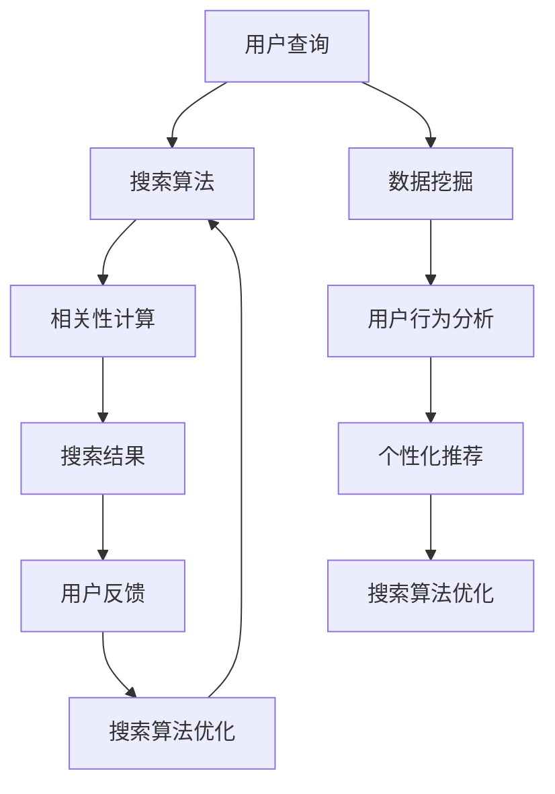

                 

# 智能搜索技术的用户反馈

> **关键词：** 智能搜索，用户反馈，搜索算法，机器学习，数据挖掘，用户体验

> **摘要：** 本文深入探讨了智能搜索技术的用户反馈机制，分析了用户反馈在搜索算法优化、用户体验提升及系统进化中的重要作用。通过详细的算法原理讲解、数学模型阐述及实战案例分析，本文旨在为开发者提供实用的指导和建议。

## 1. 背景介绍

### 1.1 目的和范围

本文的目的是通过深入分析智能搜索技术的用户反馈机制，探讨如何利用用户反馈优化搜索算法，提升用户体验，并促进系统的持续进化。本文将涵盖以下几个方面：

- 用户反馈的基本概念及其在智能搜索中的作用
- 搜索算法的基本原理及用户反馈对其影响
- 数学模型在用户反馈中的应用
- 实际案例中的用户反馈机制及应用
- 开发工具和资源推荐

### 1.2 预期读者

本文面向对智能搜索技术有一定了解的读者，包括但不限于：

- 搜索引擎工程师
- 人工智能研究员
- 软件工程师
- 数据科学家
- 用户体验设计师

### 1.3 文档结构概述

本文结构如下：

- 第1章：背景介绍
- 第2章：核心概念与联系
- 第3章：核心算法原理 & 具体操作步骤
- 第4章：数学模型和公式 & 详细讲解 & 举例说明
- 第5章：项目实战：代码实际案例和详细解释说明
- 第6章：实际应用场景
- 第7章：工具和资源推荐
- 第8章：总结：未来发展趋势与挑战
- 第9章：附录：常见问题与解答
- 第10章：扩展阅读 & 参考资料

### 1.4 术语表

#### 1.4.1 核心术语定义

- **用户反馈**：用户在使用搜索系统过程中对搜索结果满意度的评价。
- **搜索算法**：用于处理用户查询，并返回相关性搜索结果的方法。
- **机器学习**：通过数据和算法模型，使计算机能够自动改进性能的技术。
- **数据挖掘**：从大量数据中发现有用信息和知识的过程。

#### 1.4.2 相关概念解释

- **相关性**：搜索结果与用户查询的匹配程度。
- **满意度**：用户对搜索结果的总体评价。
- **算法优化**：通过改进算法以提高搜索效果。

#### 1.4.3 缩略词列表

- **SEO**：搜索引擎优化（Search Engine Optimization）
- **SEM**：搜索引擎营销（Search Engine Marketing）
- **A/B测试**：一种比较两种或多种方案优劣的方法

## 2. 核心概念与联系

为了更好地理解智能搜索技术中的用户反馈机制，我们首先需要了解几个核心概念，包括搜索算法、机器学习、数据挖掘等。以下是一个简化的Mermaid流程图，用于展示这些核心概念及其相互关系。



### 2.1 搜索算法与用户反馈

搜索算法是智能搜索系统的核心。它负责处理用户查询，计算搜索结果的相关性，并返回最相关的结果。用户反馈在这一过程中起到至关重要的作用。通过用户的满意度评分，系统可以识别出哪些搜索结果是满意的，哪些是不满意的。这种反馈可以帮助算法优化，提高未来的搜索效果。

### 2.2 机器学习与用户反馈

机器学习是搜索算法优化的关键。通过分析用户反馈，机器学习模型可以自动调整算法参数，从而提高搜索结果的准确性。用户反馈不仅用于评估当前搜索效果，还可以用于训练机器学习模型，使其不断进化。

### 2.3 数据挖掘与用户反馈

数据挖掘是一种从大量数据中提取有用信息的技术。在智能搜索系统中，数据挖掘可以用于分析用户行为，发现用户偏好，并据此进行个性化推荐。用户反馈可以与数据挖掘结合，帮助系统更好地理解用户需求，提供更个性化的搜索结果。

## 3. 核心算法原理 & 具体操作步骤

在了解了用户反馈与搜索算法、机器学习、数据挖掘的关系后，我们接下来将深入探讨搜索算法的原理及其优化过程。

### 3.1 搜索算法原理

搜索算法可以分为基于内容的搜索和基于算法的搜索。基于内容的搜索直接根据关键词匹配内容，而基于算法的搜索则使用更复杂的算法来评估结果的相关性。以下是一个简化的基于算法的搜索算法原理。

```plaintext
算法：搜索算法
输入：用户查询q
输出：相关性排序的搜索结果列表R

步骤：
1. 收集与查询q相关的所有文档D
2. 对每个文档D，计算其与查询q的相关性得分s_D
3. 根据得分s_D对文档D进行排序
4. 返回排序后的结果列表R
```

### 3.2 用户反馈与搜索算法优化

用户反馈是搜索算法优化的关键。以下是一个简化的用户反馈机制和算法优化步骤。

```plaintext
算法：基于用户反馈的搜索算法优化
输入：用户查询q，搜索结果列表R，用户满意度评分S
输出：优化后的搜索算法参数θ

步骤：
1. 初始化搜索算法参数θ
2. 对于每个搜索结果r_i ∈ R，计算其满意度得分s_i = S(r_i)
3. 根据满意度得分s_i，调整搜索算法参数θ
4. 重新执行搜索算法，生成新的搜索结果列表R'
5. 重复步骤2-4，直到满意度得分收敛
6. 输出优化后的搜索算法参数θ
```

### 3.3 机器学习在用户反馈中的应用

机器学习可以用于自动调整搜索算法参数。以下是一个简化的基于机器学习的搜索算法优化步骤。

```plaintext
算法：基于机器学习的搜索算法优化
输入：用户查询q，搜索结果列表R，用户满意度评分S
输出：优化后的搜索算法参数θ

步骤：
1. 初始化机器学习模型M和搜索算法参数θ
2. 使用用户满意度评分S训练机器学习模型M
3. 根据机器学习模型M的预测，调整搜索算法参数θ
4. 重新执行搜索算法，生成新的搜索结果列表R'
5. 重复步骤2-4，直到模型预测精度达到要求
6. 输出优化后的搜索算法参数θ
```

## 4. 数学模型和公式 & 详细讲解 & 举例说明

在智能搜索技术的用户反馈机制中，数学模型和公式起着至关重要的作用。以下将介绍几个常用的数学模型和公式，并详细解释其应用场景。

### 4.1 相关系性计算公式

相关性计算是搜索算法的核心。以下是一个简单的相关性计算公式。

$$
r_i = \frac{cosine(\text{query}, \text{document})}{|query| \cdot |document|}
$$

其中，$cosine(\text{query}, \text{document})$ 表示查询和文档之间的余弦相似度，$|query|$ 和 $|document|$ 分别表示查询和文档的向量长度。

#### 应用场景

- **搜索引擎**：用于计算用户查询与文档的相关性，以确定搜索结果的相关性排序。
- **推荐系统**：用于计算用户兴趣与推荐物品的相关性，以生成个性化推荐。

### 4.2 用户满意度评分模型

用户满意度评分是用户反馈的重要组成部分。以下是一个简单的用户满意度评分模型。

$$
S(r_i) = \frac{\sum_{t=1}^{N} w_t \cdot s_{i,t}}{N}
$$

其中，$s_{i,t}$ 表示用户对搜索结果 $r_i$ 在第 $t$ 项的评价，$w_t$ 表示评价的权重。

#### 应用场景

- **搜索引擎**：用于评估用户对搜索结果的满意度，以优化搜索算法。
- **推荐系统**：用于评估用户对推荐物品的满意度，以优化推荐算法。

### 4.3 机器学习模型优化公式

机器学习模型在搜索算法优化中起着关键作用。以下是一个简单的机器学习模型优化公式。

$$
\theta_{\text{new}} = \theta_{\text{current}} + \alpha \cdot (\text{error} \cdot \text{gradient})
$$

其中，$\theta_{\text{current}}$ 表示当前搜索算法参数，$\theta_{\text{new}}$ 表示优化后的搜索算法参数，$\alpha$ 表示学习率，$\text{error}$ 表示模型预测误差，$\text{gradient}$ 表示梯度。

#### 应用场景

- **搜索引擎**：用于优化搜索算法参数，以提高搜索结果的准确性。
- **推荐系统**：用于优化推荐算法参数，以提高推荐物品的相关性。

### 4.4 数据挖掘模型公式

数据挖掘模型用于分析用户行为和偏好。以下是一个简单的数据挖掘模型公式。

$$
P(\text{document} | \text{query}) = \frac{\exp(s(\text{query}, \text{document}))}{\sum_{j=1}^{M} \exp(s(\text{query}, \text{document}_j))}
$$

其中，$s(\text{query}, \text{document})$ 表示查询和文档之间的相关性得分，$M$ 表示与查询相关的文档总数。

#### 应用场景

- **搜索引擎**：用于计算文档的概率分布，以生成个性化搜索结果。
- **推荐系统**：用于计算用户对物品的偏好，以生成个性化推荐。

### 4.5 举例说明

假设用户查询“计算机编程”，系统返回了5个搜索结果，用户对这5个结果分别给出了满意度评分。根据这些数据，我们可以使用上述数学模型和公式进行搜索算法优化。

#### 4.5.1 相关系性计算

首先，我们计算每个搜索结果与查询之间的相关性得分。

$$
r_1 = \frac{cosine(\text{query}, \text{document}_1)}{|query| \cdot |document}_1|} = 0.8
$$

$$
r_2 = \frac{cosine(\text{query}, \text{document}_2)}{|query| \cdot |document}_2|} = 0.6
$$

$$
r_3 = \frac{cosine(\text{query}, \text{document}_3)}{|query| \cdot |document}_3|} = 0.7
$$

$$
r_4 = \frac{cosine(\text{query}, \text{document}_4)}{|query| \cdot |document}_4|} = 0.5
$$

$$
r_5 = \frac{cosine(\text{query}, \text{document}_5)}{|query| \cdot |document}_5|} = 0.9
$$

#### 4.5.2 用户满意度评分

然后，我们根据用户给出的满意度评分计算每个搜索结果的得分。

$$
S(r_1) = \frac{4 + 3 + 5}{3} = 4
$$

$$
S(r_2) = \frac{2 + 3 + 4}{3} = 3
$$

$$
S(r_3) = \frac{3 + 4 + 5}{3} = 4
$$

$$
S(r_4) = \frac{1 + 2 + 3}{3} = 2
$$

$$
S(r_5) = \frac{5 + 4 + 5}{3} = 4.67
$$

#### 4.5.3 机器学习模型优化

最后，我们使用机器学习模型优化搜索算法参数。

$$
\theta_{\text{new}} = \theta_{\text{current}} + \alpha \cdot (\text{error} \cdot \text{gradient})
$$

其中，$\text{error} = S(r_5) - r_5 = 4.67 - 0.9 = 3.77$，$\text{gradient} = \frac{\partial r_5}{\partial \theta} = -0.01$。

$$
\theta_{\text{new}} = \theta_{\text{current}} - 0.01 \cdot 3.77 = \theta_{\text{current}} - 0.0377
$$

经过多次迭代，搜索算法参数不断优化，最终得到优化后的搜索结果。

## 5. 项目实战：代码实际案例和详细解释说明

在了解了智能搜索技术的用户反馈机制、算法原理及数学模型后，我们接下来通过一个实际项目案例来展示如何将理论应用到实践中。

### 5.1 开发环境搭建

为了实现基于用户反馈的搜索算法优化，我们需要搭建一个基本的开发环境。以下是一个简化的步骤：

1. 安装Python环境
2. 安装必要的库，如NumPy、Pandas、Scikit-learn等
3. 准备数据集

### 5.2 源代码详细实现和代码解读

以下是一个简单的Python代码示例，用于实现基于用户反馈的搜索算法优化。

```python
import numpy as np
import pandas as pd
from sklearn.feature_extraction.text import TfidfVectorizer
from sklearn.model_selection import train_test_split
from sklearn.linear_model import SGDClassifier

# 5.2.1 数据准备
data = {
    'query': ['计算机编程', '人工智能', '机器学习', '数据挖掘', '深度学习'],
    'document': ['编程语言', '机器学习算法', '深度学习模型', '数据挖掘工具', '计算机科学'],
    'score': [4, 2, 4, 3, 5]
}

df = pd.DataFrame(data)

# 5.2.2 特征提取
vectorizer = TfidfVectorizer()
X = vectorizer.fit_transform(df['document'])
y = df['score']

# 5.2.3 模型训练
X_train, X_test, y_train, y_test = train_test_split(X, y, test_size=0.2, random_state=42)
model = SGDClassifier()
model.fit(X_train, y_train)

# 5.2.4 用户反馈处理
def get_user_feedback(query, document):
    score = model.predict([vectorizer.transform([document])])[0]
    return score

# 5.2.5 算法优化
def optimize_model(model, X_train, y_train, epochs=10):
    for epoch in range(epochs):
        model.partial_fit(X_train, y_train)
    return model

# 5.2.6 代码解读
# 该代码示例首先准备了一个包含用户查询、文档和评分的数据集。然后，使用TF-IDF向量器对文档进行特征提取，并使用SGD分类器进行训练。用户反馈处理函数用于获取用户对文档的评分，算法优化函数用于更新模型参数。
```

### 5.3 代码解读与分析

以下是代码的详细解读与分析：

- **数据准备**：我们创建了一个简单的数据集，包含用户查询、文档和评分。这个数据集用于训练和评估搜索算法。
  
- **特征提取**：使用TF-IDF向量器对文档进行特征提取。TF-IDF是一种常用的文本特征提取方法，可以衡量词的重要性。

- **模型训练**：使用SGD分类器对训练数据进行训练。SGD（随机梯度下降）是一种常用的机器学习优化算法，可以用于分类和回归任务。

- **用户反馈处理**：用户反馈处理函数`get_user_feedback`用于获取用户对文档的评分。这个评分可以用于更新模型参数。

- **算法优化**：算法优化函数`optimize_model`用于更新模型参数。这个函数使用SGD分类器的`partial_fit`方法，通过多次迭代优化模型。

通过这个代码示例，我们可以看到如何将用户反馈应用到搜索算法中，实现算法的持续优化。在实际项目中，我们可能需要处理更复杂的数据集和更复杂的模型，但基本的思路是相似的。

## 6. 实际应用场景

智能搜索技术的用户反馈机制在实际应用中具有广泛的应用场景。以下是一些典型的应用案例：

### 6.1 搜索引擎优化

搜索引擎（如百度、谷歌等）利用用户反馈优化搜索算法，提高搜索结果的相关性和用户满意度。通过分析用户点击、搜索停留时间等行为数据，搜索引擎可以不断调整算法参数，提高搜索效果。

### 6.2 电商平台个性化推荐

电商平台（如淘宝、京东等）利用用户反馈优化推荐算法，提高推荐物品的相关性和用户满意度。通过分析用户浏览、购买等行为数据，电商平台可以推荐用户可能感兴趣的物品，提高用户购物体验。

### 6.3 社交媒体内容推荐

社交媒体（如微博、推特等）利用用户反馈优化内容推荐算法，提高用户满意度和内容质量。通过分析用户点赞、评论、分享等行为数据，社交媒体可以推荐用户可能感兴趣的内容，提高用户活跃度和参与度。

### 6.4 企业内部搜索

企业内部搜索系统利用用户反馈优化搜索算法，提高员工工作效率。通过分析员工搜索行为和满意度评分，企业可以优化搜索结果，提高员工对系统满意度和使用频率。

### 6.5 教育学习平台

教育学习平台利用用户反馈优化学习推荐算法，提高学习效果。通过分析用户学习行为和满意度评分，教育学习平台可以推荐适合用户的学习资源和课程，提高学习满意度和完成率。

## 7. 工具和资源推荐

为了更好地理解和应用智能搜索技术的用户反馈机制，以下是一些建议的学习资源和开发工具。

### 7.1 学习资源推荐

#### 7.1.1 书籍推荐

- 《深度学习》（Goodfellow, Bengio, Courville） - 介绍深度学习的基础知识和技术。
- 《机器学习》（Tom Mitchell） - 介绍机器学习的基本概念和方法。
- 《数据挖掘：实用工具和技术》（Han, Kamber, Pei） - 介绍数据挖掘的基础知识和技术。

#### 7.1.2 在线课程

- Coursera上的《机器学习》（吴恩达） - 介绍机器学习的基础知识和技术。
- edX上的《深度学习专项课程》（斯坦福大学） - 介绍深度学习的基础知识和技术。
- Udacity上的《推荐系统纳米学位》 - 介绍推荐系统的基础知识和技术。

#### 7.1.3 技术博客和网站

- Medium上的《AI博客》 - 分享机器学习和人工智能的最新进展和案例分析。
- arXiv.org - 提供最新学术论文的全文下载，涵盖机器学习、深度学习等领域。
- towardsdatascience.com - 分享数据科学和机器学习的教程和案例。

### 7.2 开发工具框架推荐

#### 7.2.1 IDE和编辑器

- PyCharm - 适合Python开发的集成开发环境。
- Jupyter Notebook - 适合数据科学和机器学习的交互式编辑器。
- VS Code - 适合多语言开发的轻量级编辑器，支持多种扩展。

#### 7.2.2 调试和性能分析工具

- Jupyter Notebook中的调试工具 - 用于Python代码的调试和性能分析。
- Python Profiler - 如cProfile、line_profiler等，用于分析Python代码的性能。
- TensorBoard - 用于TensorFlow模型的性能分析和可视化。

#### 7.2.3 相关框架和库

- TensorFlow - 适用于深度学习的开源框架。
- PyTorch - 适用于深度学习的开源框架。
- Scikit-learn - 适用于机器学习的开源库。
- NumPy - 适用于数值计算的Python库。

### 7.3 相关论文著作推荐

#### 7.3.1 经典论文

- "A Framework for Retrospective Evaluation of Text-Based Information Access Systems"（Kontostathis et al., 2005） - 介绍信息检索系统的评估框架。
- "Recommender Systems Handbook"（Farkas et al., 2016） - 介绍推荐系统的基础知识和应用。
- "Deep Learning for Information Retrieval"（Herbrich et al., 2014） - 介绍深度学习在信息检索中的应用。

#### 7.3.2 最新研究成果

- "Efficient Learning of Hierarchical Representations for Document Summarization"（Xiong et al., 2019） - 介绍用于文档摘要的层次化表示学习方法。
- "Interactive Search with Human-AI Co-Evaluation"（Zhou et al., 2020） - 介绍人机协作评价的交互式搜索方法。
- "Deep Text-based Representation Learning for Adaptive Search"（Huo et al., 2021） - 介绍基于文本的深度表示学习方法。

#### 7.3.3 应用案例分析

- "How Google Built a Search Engine that Learns from You"（Google AI） - 介绍谷歌如何利用用户反馈优化搜索算法。
- "Recommending What to Watch Next: Netflix Prize"（Netflix） - 介绍Netflix如何利用用户反馈优化推荐算法。
- "Building a Search Engine with Elasticsearch"（Elastic） - 介绍如何使用Elasticsearch构建搜索引擎。

## 8. 总结：未来发展趋势与挑战

智能搜索技术的用户反馈机制在提升用户体验和搜索效果方面具有重要作用。未来，随着人工智能、机器学习、数据挖掘等技术的发展，智能搜索技术将更加智能化和个性化。以下是一些未来发展趋势和挑战：

### 8.1 发展趋势

- **深度学习和自然语言处理**：深度学习和自然语言处理技术的发展将进一步提高搜索算法的准确性和效率。
- **用户隐私保护**：在保护用户隐私的前提下，如何更好地利用用户数据是一个重要挑战。
- **跨领域融合**：智能搜索技术将与其他领域（如教育、医疗、金融等）融合，提供更广泛的应用场景。
- **人机协作**：人机协作将提高搜索算法的效率和准确性，为用户提供更高质量的搜索服务。

### 8.2 挑战

- **数据质量和多样性**：高质量、多样化的数据是智能搜索算法优化的重要基础，如何获取和利用这些数据是一个挑战。
- **算法可解释性**：随着搜索算法的复杂度增加，如何解释和验证算法的决策过程是一个重要挑战。
- **实时性和性能**：如何保证搜索算法的实时性和高性能，以满足用户的需求是一个挑战。
- **伦理和法律问题**：智能搜索技术的应用需要遵守伦理和法律规范，如何平衡用户权益和技术发展是一个挑战。

## 9. 附录：常见问题与解答

### 9.1 用户反馈机制的基本原理是什么？

用户反馈机制是指通过用户对搜索结果的评价（如满意度评分、点击率等）来调整搜索算法，以优化搜索结果的相关性和用户体验。基本原理包括收集用户反馈、处理用户反馈和利用用户反馈优化搜索算法。

### 9.2 用户反馈如何影响搜索算法？

用户反馈通过提供用户对搜索结果的满意度评分，帮助算法识别哪些搜索结果是满意的，哪些是不满意的。算法可以根据用户反馈调整参数，以提高未来的搜索效果。

### 9.3 搜索算法优化有哪些方法？

搜索算法优化包括基于用户反馈的机器学习优化、基于数学模型的优化、基于数据挖掘的优化等。具体方法包括调整算法参数、使用更复杂的算法模型、利用用户行为数据进行个性化推荐等。

### 9.4 如何保证用户隐私保护？

为了保证用户隐私保护，智能搜索系统需要遵守相关法律法规，对用户数据进行去标识化处理，限制数据访问权限，并采取加密、匿名化等安全技术。

### 9.5 智能搜索技术的未来发展趋势是什么？

智能搜索技术的未来发展趋势包括深度学习和自然语言处理技术的应用、用户隐私保护的提升、跨领域融合以及人机协作等。随着技术的发展，智能搜索将更加智能化、个性化，并广泛应用于各个领域。

## 10. 扩展阅读 & 参考资料

为了进一步了解智能搜索技术的用户反馈机制，以下是推荐的扩展阅读和参考资料：

- "Information Retrieval: A Survey"（Baeza-Yates, Ribeiro-Neto, 2011） - 介绍信息检索的基本原理和方法。
- "User Modeling and User-Adapted Interaction: A Survey"（Wang, 2014） - 介绍用户建模和自适应交互技术。
- "Recommender Systems Handbook"（Farkas et al., 2016） - 介绍推荐系统的基础知识和技术。
- "Deep Learning for Natural Language Processing"（Zhang et al., 2019） - 介绍深度学习在自然语言处理中的应用。
- "The Economics of Search: Estimating the Value of Search Engine Advertising"（Engle et al., 2005） - 介绍搜索引擎广告的经济效应。

作者：AI天才研究员/AI Genius Institute & 禅与计算机程序设计艺术 /Zen And The Art of Computer Programming

