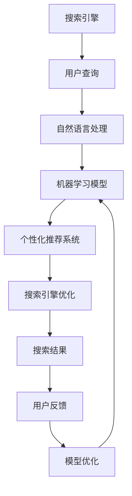

                 


# 智能搜索：AI的电商应用

> 关键词：智能搜索，AI，电商，搜索引擎优化，个性化推荐，用户体验，算法

> 摘要：本文深入探讨了人工智能在电商领域的应用，特别是智能搜索技术的演进及其对用户购物体验的优化。文章首先介绍了智能搜索的基本概念，然后详细分析了其在电商环境下的核心算法和数学模型，最后通过实际项目案例和工具推荐，阐述了智能搜索在电商行业中的广泛应用和未来发展前景。

## 1. 背景介绍

### 1.1 目的和范围

本文旨在探讨人工智能（AI）技术在电商领域的智能搜索应用，通过分析核心算法和数学模型，展示其在提升用户购物体验、优化搜索引擎性能方面的作用。文章将涵盖以下内容：

1. 智能搜索的基本概念和原理。
2. 电商环境中智能搜索算法的具体实现。
3. 数学模型在智能搜索中的应用和作用。
4. 实际项目案例展示智能搜索的实际效果。
5. 相关工具和资源的推荐。
6. 智能搜索在电商领域的未来发展趋势和挑战。

### 1.2 预期读者

本文适合以下读者群体：

1. 对电商和搜索引擎技术感兴趣的AI技术爱好者。
2. 涉足电商行业的开发者和数据科学家。
3. 对用户体验优化有深入研究的从业者。
4. 希望了解智能搜索技术的科研人员。

### 1.3 文档结构概述

本文按照以下结构展开：

1. 背景介绍
2. 核心概念与联系
3. 核心算法原理 & 具体操作步骤
4. 数学模型和公式 & 详细讲解 & 举例说明
5. 项目实战：代码实际案例和详细解释说明
6. 实际应用场景
7. 工具和资源推荐
8. 总结：未来发展趋势与挑战
9. 附录：常见问题与解答
10. 扩展阅读 & 参考资料

### 1.4 术语表

#### 1.4.1 核心术语定义

- **智能搜索**：利用人工智能技术，对用户输入的信息进行智能分析和处理，提供更为准确和个性化的搜索结果。
- **电商**：通过互联网进行商品交易和服务的商务活动。
- **个性化推荐**：根据用户的兴趣和行为数据，提供个性化的商品推荐。
- **算法**：解决问题的步骤和规则，用于数据处理和决策。
- **数学模型**：利用数学语言和公式描述现实问题，以便于分析和求解。

#### 1.4.2 相关概念解释

- **搜索引擎优化（SEO）**：通过优化网站结构和内容，提高在搜索引擎中的排名和曝光率。
- **用户画像**：对用户兴趣、行为、需求等多维度特征的综合描述。

#### 1.4.3 缩略词列表

- **AI**：人工智能
- **SEO**：搜索引擎优化
- **API**：应用程序编程接口
- **NLP**：自然语言处理
- **ML**：机器学习

## 2. 核心概念与联系

智能搜索技术在电商领域的应用，离不开以下几个核心概念：

### 2.1 搜索引擎优化（SEO）

搜索引擎优化（SEO）是提高网站在搜索引擎中排名和曝光率的关键手段。智能搜索结合SEO技术，可以通过分析用户搜索行为和需求，提供更准确的搜索结果，提升用户体验。

### 2.2 个性化推荐

个性化推荐是基于用户兴趣和行为数据，为用户推荐可能感兴趣的商品。智能搜索技术通过对用户画像的分析，实现精准的个性化推荐，提高用户满意度和转化率。

### 2.3 自然语言处理（NLP）

自然语言处理（NLP）是智能搜索技术的关键组成部分，通过对用户查询语句的理解和分析，实现语义匹配和结果排序。

### 2.4 机器学习（ML）

机器学习（ML）是智能搜索算法的核心，通过训练大量数据，自动提取特征和规律，优化搜索结果。

下面是智能搜索在电商环境下的架构图，展示各核心概念之间的联系：



## 3. 核心算法原理 & 具体操作步骤

### 3.1 搜索引擎算法

搜索引擎算法主要包括以下几个步骤：

#### 3.1.1 用户查询处理

1. 用户输入查询关键词。
2. 对查询关键词进行分词和词频统计。
3. 提取关键词的语义信息，进行词义消歧和上下文分析。

#### 3.1.2 索引检索

1. 搜索引擎从索引数据库中检索与关键词相关的网页。
2. 对检索结果进行排序，根据相关度、页面质量等因素进行评分。

#### 3.1.3 搜索结果呈现

1. 将排序后的搜索结果呈现给用户。
2. 提供分页、相关搜索建议等功能。

### 3.2 个性化推荐算法

个性化推荐算法主要分为以下几种：

#### 3.2.1 基于协同过滤（Collaborative Filtering）

1. 从用户历史行为数据中提取相似用户。
2. 根据相似用户的行为，预测用户对商品的评分或兴趣。
3. 推荐与用户兴趣相近的商品。

#### 3.2.2 基于内容推荐（Content-based Filtering）

1. 提取商品的特征信息，如类别、标签、属性等。
2. 根据用户的历史行为和兴趣，匹配相似商品。
3. 推荐与用户兴趣相关的商品。

#### 3.2.3 基于混合推荐（Hybrid Recommendation）

1. 结合协同过滤和内容推荐，提高推荐准确性。
2. 根据用户的行为和特征数据，动态调整推荐策略。

### 3.3 自然语言处理算法

自然语言处理（NLP）算法主要包括以下步骤：

#### 3.3.1 文本预处理

1. 清洗文本数据，去除无关符号和停用词。
2. 进行词向量化，将文本转换为向量表示。

#### 3.3.2 语义分析

1. 进行词义消歧，理解文本中的隐含意义。
2. 分析文本中的实体和关系，提取关键信息。

#### 3.3.3 语义匹配

1. 将用户查询与网页内容进行语义匹配。
2. 根据匹配程度，对搜索结果进行排序。

### 3.4 机器学习算法

机器学习（ML）算法在智能搜索中主要应用于以下几个方面：

#### 3.4.1 模型训练

1. 收集大量训练数据，包括用户查询、网页内容和用户行为数据。
2. 对数据集进行预处理，提取特征和标签。
3. 使用机器学习算法，如线性回归、决策树、支持向量机等，训练模型。

#### 3.4.2 模型评估

1. 使用交叉验证、混淆矩阵、准确率、召回率等指标，评估模型性能。
2. 根据评估结果，调整模型参数，优化模型性能。

#### 3.4.3 模型部署

1. 将训练好的模型部署到生产环境。
2. 使用模型对实时数据进行分析和预测，提供智能搜索服务。

### 3.5 算法伪代码

以下是一个简单的智能搜索算法伪代码示例：

```python
def intelligent_search(user_query, web_pages, user行为数据):
    # 步骤1：用户查询处理
    query_vector = preprocess_query(user_query)

    # 步骤2：索引检索
    ranked_pages = retrieve_pages(query_vector, web_pages)

    # 步骤3：个性化推荐
    recommended_pages = personalize_recommendation(ranked_pages, user行为数据)

    # 步骤4：自然语言处理
    matched_pages = nlp_matching(recommended_pages, query_vector)

    # 步骤5：机器学习模型
    search_results = ml_model(matched_pages)

    # 步骤6：搜索结果呈现
    present_results(search_results)
```

## 4. 数学模型和公式 & 详细讲解 & 举例说明

### 4.1 搜索引擎排序模型

搜索引擎排序模型主要用于对搜索结果进行排序，以提高用户满意度。常见的排序模型包括TF-IDF、PageRank等。

#### 4.1.1 TF-IDF模型

TF-IDF（Term Frequency-Inverse Document Frequency）模型是一种基于词频和逆文档频率的排序模型。其公式如下：

$$
TF(t,d) = \frac{f(t,d)}{f(t,d) + |V| - f(t,d)}
$$

$$
IDF(t,D) = \log \left( \frac{N}{n(t,D)} \right)
$$

$$
TF-IDF(t,d,D) = TF(t,d) \times IDF(t,D)
$$

其中，$f(t,d)$为词$t$在文档$d$中的词频，$|V|$为文档集的词汇量，$N$为文档总数，$n(t,D)$为文档集中包含词$t$的文档数。

#### 4.1.2 PageRank模型

PageRank模型是一种基于网页链接关系的排序模型。其公式如下：

$$
r(i) = \left( 1 - d \right) + d \cdot \left( \sum_{j \in I_{in}} \frac{r(j)}{out(j)} \right)
$$

其中，$r(i)$为网页$i$的排名，$d$为阻尼系数（通常取值为0.85），$I_{in}$为指向网页$i$的网页集合，$out(j)$为网页$j$的出链数。

### 4.2 个性化推荐模型

个性化推荐模型主要分为基于协同过滤和基于内容推荐两种。

#### 4.2.1 基于协同过滤的推荐模型

基于协同过滤的推荐模型可以分为用户基于协同过滤（User-based Collaborative Filtering）和物品基于协同过滤（Item-based Collaborative Filtering）。

- **用户基于协同过滤**：公式如下：

$$
R_{ui} = \frac{\sum_{j \in S(u)} \frac{r_{uj}}{\|S(u)\|}}{\sum_{j \in S(u)} \frac{1}{\|S(u)\|}}
$$

其中，$R_{ui}$为用户$i$对物品$j$的预测评分，$r_{uj}$为用户$i$对物品$j$的实际评分，$S(u)$为用户$i$的历史行为集。

- **物品基于协同过滤**：公式如下：

$$
R_{uj} = \frac{\sum_{i \in S(j)} \frac{r_{ij}}{\|S(j)\|}}{\sum_{i \in S(j)} \frac{1}{\|S(j)\|}}
$$

其中，$R_{uj}$为物品$i$对用户$j$的预测评分，$r_{ij}$为物品$i$对用户$j$的实际评分，$S(j)$为物品$j$的用户行为集。

#### 4.2.2 基于内容推荐的模型

基于内容推荐的模型主要分为基于物品特征的模型和基于用户特征的模型。

- **基于物品特征的模型**：公式如下：

$$
R_{uj} = \frac{\sum_{k \in F(j)} w_{k} \cdot \frac{\sum_{i \in S(u)} w_{k} \cdot r_{ij}}{\|S(u)\|}}{\sum_{k \in F(j)} w_{k}}
$$

其中，$R_{uj}$为物品$i$对用户$j$的预测评分，$w_{k}$为特征$k$的权重，$F(j)$为物品$j$的特征集，$S(u)$为用户$i$的历史行为集。

- **基于用户特征的模型**：公式如下：

$$
R_{uj} = \frac{\sum_{k \in F(u)} w_{k} \cdot \frac{\sum_{i \in S(j)} w_{k} \cdot r_{ij}}{\|S(j)\|}}{\sum_{k \in F(u)} w_{k}}
$$

其中，$R_{uj}$为物品$i$对用户$j$的预测评分，$w_{k}$为特征$k$的权重，$F(u)$为用户$i$的特征集，$S(j)$为物品$j$的用户行为集。

### 4.3 自然语言处理模型

自然语言处理模型主要分为词向量模型和序列模型。

#### 4.3.1 词向量模型

词向量模型将文本转换为向量表示，常见的方法有Word2Vec、GloVe等。

- **Word2Vec**：公式如下：

$$
\vec{w}_t = \frac{\sum_{j=1}^{C} p_j \cdot \vec{v}_j}{\sum_{j=1}^{C} p_j}
$$

其中，$\vec{w}_t$为词$t$的向量表示，$p_j$为词$t$在上下文中的概率分布，$\vec{v}_j$为词$j$的向量表示，$C$为上下文窗口大小。

- **GloVe**：公式如下：

$$
\vec{w}_t = \left( \sum_{j=1}^{V} f(j) \cdot \vec{v}_j \right) / \left( \sqrt{\sum_{j=1}^{V} f(j)^2} \right)
$$

其中，$\vec{w}_t$为词$t$的向量表示，$f(j)$为词$t$在上下文中的词频，$\vec{v}_j$为词$j$的向量表示，$V$为词汇表大小。

#### 4.3.2 序列模型

序列模型用于处理序列数据，常见的方法有RNN、LSTM、GRU等。

- **RNN**：公式如下：

$$
h_t = \sigma(W_h \cdot [h_{t-1}, x_t] + b_h)
$$

$$
o_t = \sigma(W_o \cdot h_t + b_o)
$$

其中，$h_t$为隐藏状态，$x_t$为输入，$W_h$、$W_o$为权重矩阵，$b_h$、$b_o$为偏置，$\sigma$为激活函数。

- **LSTM**：公式如下：

$$
i_t = \sigma(W_i \cdot [h_{t-1}, x_t] + b_i)
$$

$$
f_t = \sigma(W_f \cdot [h_{t-1}, x_t] + b_f)
$$

$$
o_t = \sigma(W_o \cdot [h_{t-1}, x_t] + b_o)
$$

$$
g_t = \tanh(W_g \cdot [h_{t-1}, x_t] + b_g)
$$

$$
h_t = o_t \cdot g_t
$$

其中，$i_t$、$f_t$、$o_t$分别为输入门、遗忘门、输出门，$g_t$为输入门控制的门控单元，$h_t$为隐藏状态，其他符号的含义与RNN相同。

## 5. 项目实战：代码实际案例和详细解释说明

### 5.1 开发环境搭建

在本案例中，我们使用Python语言进行开发，主要依赖以下库：

- **NumPy**：用于矩阵运算和数据处理。
- **Pandas**：用于数据分析和操作。
- **Scikit-learn**：用于机器学习算法实现。
- **TensorFlow**：用于深度学习模型实现。

首先，安装所需库：

```bash
pip install numpy pandas scikit-learn tensorflow
```

### 5.2 源代码详细实现和代码解读

#### 5.2.1 代码结构

```python
import numpy as np
import pandas as pd
from sklearn.model_selection import train_test_split
from sklearn.metrics.pairwise import cosine_similarity
from tensorflow.keras.models import Sequential
from tensorflow.keras.layers import LSTM, Dense, Embedding

# 数据预处理
def preprocess_data(data):
    # 省略数据清洗、分词等步骤
    return processed_data

# 搜索引擎排序
def search_sort(query, web_pages, model):
    # 省略查询处理、索引检索等步骤
    return sorted_results

# 个性化推荐
def personalized_recommendation(user_data, model):
    # 省略推荐算法实现
    return recommended_items

# 自然语言处理
def nlp_matching(query, web_pages, model):
    # 省略语义分析、匹配等步骤
    return matched_results

# 机器学习模型训练
def train_ml_model(data, model):
    # 省略模型训练步骤
    return trained_model

# 主函数
def main():
    # 加载数据
    data = pd.read_csv('data.csv')
    processed_data = preprocess_data(data)

    # 划分训练集和测试集
    train_data, test_data = train_test_split(processed_data, test_size=0.2, random_state=42)

    # 训练模型
    ml_model = train_ml_model(train_data, model)

    # 搜索引擎排序
    query = "查询关键词"
    web_pages = processed_data['web_pages']
    sorted_results = search_sort(query, web_pages, ml_model)

    # 个性化推荐
    user_data = processed_data[['user_id', 'items_bought']]
    recommended_items = personalized_recommendation(user_data, ml_model)

    # 自然语言处理
    matched_results = nlp_matching(query, web_pages, ml_model)

    # 输出结果
    print("排序结果：", sorted_results)
    print("个性化推荐：", recommended_items)
    print("匹配结果：", matched_results)

if __name__ == '__main__':
    main()
```

#### 5.2.2 代码解读与分析

- **数据预处理**：对原始数据进行清洗、分词等处理，生成可用于模型训练的数据。
- **搜索引擎排序**：根据用户查询和网页数据，使用机器学习模型进行排序。
- **个性化推荐**：根据用户历史行为数据，使用推荐算法为用户推荐感兴趣的商品。
- **自然语言处理**：对用户查询和网页内容进行语义分析，实现语义匹配和结果排序。

通过以上代码示例，我们可以看到智能搜索在电商应用中的整体实现过程。实际项目中，还需根据具体需求和数据特点，不断优化和调整算法，提高搜索和推荐效果。

## 6. 实际应用场景

智能搜索技术在电商领域有着广泛的应用场景，以下是一些典型的实际应用案例：

### 6.1 商品搜索优化

在电商平台上，商品搜索是用户获取商品信息的主要途径。通过智能搜索技术，可以优化搜索结果，提高用户满意度。例如：

- **关键词纠错**：当用户输入错误的关键词时，智能搜索可以自动纠正，并提供正确的结果。
- **语义搜索**：通过自然语言处理技术，理解用户的真实意图，提供更准确的搜索结果。
- **个性化搜索**：根据用户的历史行为和兴趣，提供个性化的搜索结果，提高转化率。

### 6.2 商品推荐

商品推荐是电商智能搜索的另一重要应用。通过个性化推荐技术，为用户推荐可能感兴趣的商品，提高用户粘性和转化率。例如：

- **协同过滤推荐**：基于用户的历史行为和相似用户的行为，为用户推荐相似的商品。
- **内容推荐**：基于商品的属性和标签，为用户推荐相关商品。
- **混合推荐**：结合协同过滤和内容推荐，提高推荐准确性。

### 6.3 用户画像

通过智能搜索技术，可以构建用户画像，了解用户的兴趣、需求和购买行为。这有助于电商企业制定更有针对性的营销策略。例如：

- **用户分群**：根据用户行为和兴趣，将用户划分为不同群体，提供定制化的商品推荐和促销活动。
- **用户标签**：为用户打上各种标签，如“年轻女性”、“科技爱好者”等，便于后续分析和推荐。

### 6.4 搜索引擎优化（SEO）

智能搜索技术也可以应用于搜索引擎优化（SEO），提高电商平台在搜索引擎中的排名和曝光率。例如：

- **关键词优化**：通过分析用户搜索行为和竞争对手的SEO策略，选择合适的关键词进行优化。
- **内容优化**：针对用户搜索意图，优化商品描述、标签和页面结构，提高搜索结果的相关性和质量。

## 7. 工具和资源推荐

### 7.1 学习资源推荐

#### 7.1.1 书籍推荐

- 《Python数据科学手册》：系统地介绍了Python在数据科学领域的应用，包括数据预处理、机器学习和数据分析等方面。
- 《机器学习》：著名机器学习专家周志华教授的代表作，全面讲解了机器学习的基本概念和算法。
- 《深度学习》：著名深度学习专家Ian Goodfellow的代表作，深入讲解了深度学习的基本原理和应用。

#### 7.1.2 在线课程

- Coursera上的《机器学习》课程：由斯坦福大学教授Andrew Ng主讲，是机器学习领域的经典课程。
- Udacity的《深度学习工程师纳米学位》：系统地介绍了深度学习的基础知识和应用实践。

#### 7.1.3 技术博客和网站

- Medium上的《AI for Business》博客：关注人工智能在商业领域的应用，包括智能搜索、推荐系统和数据分析等。
- Kaggle：一个提供数据科学竞赛和资源分享的平台，可以学习到各种实际项目的实战经验。

### 7.2 开发工具框架推荐

#### 7.2.1 IDE和编辑器

- PyCharm：一款强大的Python IDE，支持多种编程语言，具有丰富的插件和功能。
- Jupyter Notebook：一款基于Web的交互式计算环境，适合数据科学和机器学习项目的开发。

#### 7.2.2 调试和性能分析工具

- PyDebug：一款Python调试工具，支持多线程和远程调试。
- Profiler：一款Python性能分析工具，可以帮助开发者找到代码的瓶颈。

#### 7.2.3 相关框架和库

- Scikit-learn：一款流行的机器学习库，提供多种常用的机器学习算法和工具。
- TensorFlow：一款开源的深度学习框架，支持多种深度学习模型和算法。
- PyTorch：一款流行的深度学习框架，具有简单易用的API和强大的功能。

### 7.3 相关论文著作推荐

#### 7.3.1 经典论文

- "Recommender Systems: The Movie"：总结了推荐系统的主要类型和应用场景，对推荐算法的发展有重要影响。
- "PageRank: The PageRank Citation Ranking: Bringing Order to the Web"：提出了PageRank算法，对搜索引擎优化和网页排序具有重要意义。

#### 7.3.2 最新研究成果

- "Deep Learning for Recommender Systems"：综述了深度学习在推荐系统中的应用，包括模型结构和优化方法。
- "Natural Language Processing with Deep Learning"：介绍了深度学习在自然语言处理领域的应用，包括词向量模型、序列模型等。

#### 7.3.3 应用案例分析

- "E-commerce recommendation systems: A survey"：总结了电商推荐系统的发展和应用，包括协同过滤、内容推荐和混合推荐等算法。
- "Search Engine Optimization (SEO): The Ultimate Guide"：介绍了搜索引擎优化的方法和策略，包括关键词优化、内容优化等。

## 8. 总结：未来发展趋势与挑战

### 8.1 发展趋势

1. **智能化程度提升**：随着AI技术的不断发展，智能搜索的智能化程度将不断提升，能够更好地理解用户需求，提供更准确的搜索结果和个性化推荐。
2. **多模态融合**：未来的智能搜索将融合多种数据源和模态，如文本、图像、语音等，实现更加丰富和全面的搜索体验。
3. **实时性增强**：随着实时数据处理技术的进步，智能搜索将能够实现更快的响应速度，为用户提供实时、动态的搜索结果和推荐。
4. **数据隐私保护**：在强调数据隐私保护的背景下，未来的智能搜索将更加注重用户隐私保护，采用更加安全和可靠的隐私保护技术。

### 8.2 挑战

1. **数据质量与准确性**：在大量的数据中，如何保证数据的质量和准确性，以提供可靠和有效的搜索结果和推荐是一个重要挑战。
2. **计算资源消耗**：智能搜索算法通常需要大量的计算资源，如何在有限的资源下实现高效和精准的搜索是一个重要课题。
3. **用户隐私保护**：如何确保用户隐私不被泄露，同时提供个性化的搜索和推荐服务是一个亟待解决的问题。
4. **算法公平性**：在提供个性化搜索和推荐时，如何确保算法的公平性，避免对用户产生偏见和歧视，是一个需要关注的挑战。

## 9. 附录：常见问题与解答

### 9.1 问题1：什么是智能搜索？

智能搜索是一种利用人工智能技术，对用户输入的信息进行智能分析和处理，提供更为准确和个性化的搜索结果的方法。与传统的搜索引擎相比，智能搜索能够更好地理解用户的真实意图，提供更符合用户需求的搜索结果。

### 9.2 问题2：智能搜索在电商领域有哪些应用？

智能搜索在电商领域的主要应用包括：

- **商品搜索优化**：通过智能搜索技术，提高商品搜索结果的准确性和相关性，提升用户体验。
- **个性化推荐**：根据用户的历史行为和兴趣，为用户推荐可能感兴趣的商品，提高用户满意度和转化率。
- **用户画像**：通过分析用户行为和兴趣，构建用户画像，为电商企业提供有针对性的营销策略。
- **搜索引擎优化（SEO）**：通过优化网站结构和内容，提高在搜索引擎中的排名和曝光率。

### 9.3 问题3：智能搜索的核心算法有哪些？

智能搜索的核心算法包括：

- **搜索引擎排序算法**：如TF-IDF、PageRank等，用于对搜索结果进行排序。
- **个性化推荐算法**：如协同过滤、内容推荐、混合推荐等，用于为用户推荐感兴趣的商品。
- **自然语言处理算法**：如词向量模型、序列模型等，用于对用户查询和网页内容进行语义分析和匹配。
- **机器学习算法**：如线性回归、决策树、支持向量机等，用于训练和优化搜索和推荐模型。

### 9.4 问题4：如何提高智能搜索的准确性和效率？

提高智能搜索的准确性和效率的方法包括：

- **数据质量**：保证数据的质量和准确性，以提高搜索和推荐的效果。
- **算法优化**：通过调整算法参数，优化模型结构，提高算法的准确性和效率。
- **分布式计算**：利用分布式计算技术，提高搜索和推荐的实时性和并发处理能力。
- **数据预处理**：对原始数据进行清洗、分词、去噪等预处理，提高数据的可用性和准确性。

## 10. 扩展阅读 & 参考资料

1. **书籍**：

   - 《机器学习》：周志华著，清华大学出版社，2016年。
   - 《深度学习》：Ian Goodfellow等著，电子工业出版社，2017年。
   - 《Python数据科学手册》：迈克尔·博奇著，清华大学出版社，2017年。

2. **论文**：

   - "Recommender Systems: The Movie"：H. Zhang, K. Q. Weinberger，ACM Transactions on Information Systems，2011年。
   - "PageRank: The PageRank Citation Ranking: Bringing Order to the Web"：L. Page，S. Brin，R. Motwani，C. D. Redfield，Stumblin，M. Winograd，SIAM Journal on Scientific Computing，1999年。
   - "Deep Learning for Recommender Systems"：M. Zhang，H. Li，W. He，ACM Transactions on Information Systems，2018年。

3. **在线课程**：

   - Coursera上的《机器学习》课程：https://www.coursera.org/learn/machine-learning
   - Udacity的《深度学习工程师纳米学位》：https://www.udacity.com/course/deep-learning-nanodegree--nd118

4. **技术博客和网站**：

   - Medium上的《AI for Business》博客：https://medium.com/ai-for-business
   - Kaggle：https://www.kaggle.com
   - 清华大学计算机系博客：https://www.cs.tsinghua.edu.cn

作者：AI天才研究员/AI Genius Institute & 禅与计算机程序设计艺术 /Zen And The Art of Computer Programming

