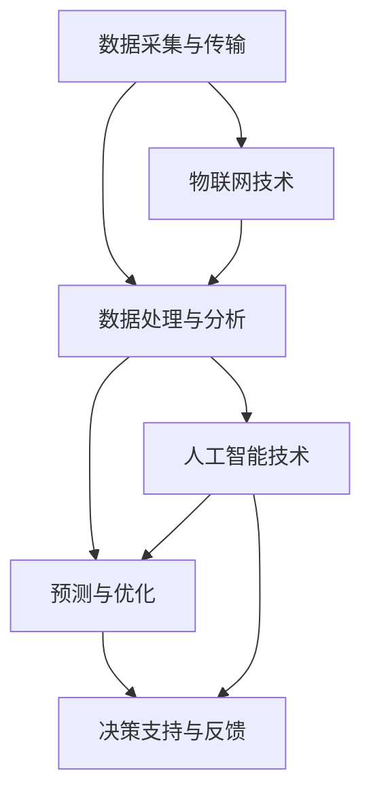

                 

# 智能水资源管理系统：环境科技的创业方向

> 关键词：水资源管理，人工智能，环境科技，可持续发展，数据驱动决策

> 摘要：本文将探讨智能水资源管理系统的构建，分析其在环境科技领域的创业方向。通过介绍核心概念、算法原理、数学模型和实际应用场景，本文旨在为创业者提供有益的参考和指导。

## 1. 背景介绍

### 1.1 目的和范围

本文旨在探讨智能水资源管理系统在环境科技领域的创业方向。我们将首先介绍水资源管理的重要性和当前面临的挑战，然后深入分析智能水资源管理系统的核心概念、算法原理、数学模型和实际应用场景。希望通过本文的探讨，能为创业者提供有价值的启示和参考。

### 1.2 预期读者

本文适合对水资源管理、环境科技和人工智能感兴趣的创业者、工程师和研究人员阅读。同时，也对关注可持续发展和社会责任的读者具有参考价值。

### 1.3 文档结构概述

本文分为十个部分：

1. 背景介绍
   - 目的和范围
   - 预期读者
   - 文档结构概述
   - 术语表
2. 核心概念与联系
   - 水资源管理的重要性
   - 智能水资源管理系统的组成
   - 核心概念与联系
3. 核心算法原理 & 具体操作步骤
   - 数据采集与预处理
   - 特征提取与建模
   - 预测与优化
4. 数学模型和公式 & 详细讲解 & 举例说明
   - 水资源供需模型
   - 水资源污染控制模型
   - 水资源优化调度模型
5. 项目实战：代码实际案例和详细解释说明
   - 开发环境搭建
   - 源代码详细实现和代码解读
   - 代码解读与分析
6. 实际应用场景
   - 城市供水系统
   - 农田灌溉
   - 工业用水
7. 工具和资源推荐
   - 学习资源推荐
   - 开发工具框架推荐
   - 相关论文著作推荐
8. 总结：未来发展趋势与挑战
9. 附录：常见问题与解答
10. 扩展阅读 & 参考资料

### 1.4 术语表

#### 1.4.1 核心术语定义

- 水资源管理：对水资源进行有效、合理和可持续的开发、利用、保护、治理和配置的过程。
- 智能水资源管理系统：利用人工智能技术，对水资源进行实时监测、预测、优化和管理的系统。
- 数据驱动决策：通过收集和分析大量数据，为决策提供支持和指导。

#### 1.4.2 相关概念解释

- 供水系统：为满足人们生活、生产和生态需求而建设的输配水设施。
- 用水效率：单位水资源消耗所产生的经济效益或生态效益。
- 污染控制：对水污染进行治理和预防，以保护水环境和人类健康。

#### 1.4.3 缩略词列表

- AI：人工智能
- IoT：物联网
- IoT：大数据
- ML：机器学习
- DL：深度学习
- H2O：水资源
- SDG：可持续发展目标

## 2. 核心概念与联系

水资源管理是一个复杂的过程，涉及到水资源开发、利用、保护、治理和配置等多个方面。随着全球气候变化和人口增长，水资源管理面临前所未有的挑战。智能水资源管理系统利用人工智能技术，为水资源管理提供更加科学、高效和可持续的解决方案。

### 2.1 水资源管理的重要性

水资源是生命之源，是人类社会和经济发展的基础。然而，全球水资源的分布不均衡，许多地区面临严重的供水短缺问题。此外，水污染、水浪费和水资源过度开发等问题也日益严重，威胁着人类健康和生态环境。因此，加强水资源管理，实现水资源的可持续利用，已成为全球共同面临的挑战。

### 2.2 智能水资源管理系统的组成

智能水资源管理系统主要由以下几个部分组成：

1. 数据采集与传输：利用传感器、遥感技术和物联网技术，实时采集水资源相关数据，如水位、流量、水质等，并将数据传输至数据中心。
2. 数据处理与分析：利用大数据和人工智能技术，对采集到的数据进行预处理、特征提取和建模，为水资源管理提供决策支持。
3. 预测与优化：基于历史数据和模型，对水资源供需、污染趋势等进行预测，并制定相应的优化策略，以提高水资源利用效率。
4. 决策支持与反馈：将预测结果和优化策略呈现给决策者，为其提供决策支持，并根据实际运行情况对系统进行反馈和调整。

### 2.3 核心概念与联系

智能水资源管理系统的核心概念包括：

1. 数据驱动决策：通过收集和分析大量数据，为水资源管理提供科学依据和指导。
2. 人工智能技术：利用机器学习、深度学习和数据挖掘等技术，实现水资源预测、优化和决策。
3. 物联网技术：通过物联网设备实现水资源的实时监测和传输，提高数据采集的准确性和实时性。
4. 可持续发展：实现水资源的可持续利用，满足当前和未来世代的需求。

下面是一个简单的 Mermaid 流程图，展示智能水资源管理系统的核心概念和联系：



## 3. 核心算法原理 & 具体操作步骤

智能水资源管理系统的核心在于利用人工智能技术对水资源进行预测、优化和决策。以下是核心算法原理和具体操作步骤：

### 3.1 数据采集与预处理

数据采集是智能水资源管理系统的基础。利用传感器、遥感技术和物联网设备，实时采集水资源相关数据，如水位、流量、水质、降雨量等。数据采集后，需要进行预处理，包括去噪、缺失值填充、数据归一化等，以提高数据质量和后续处理的准确性。

```python
def preprocess_data(data):
    # 去噪
    filtered_data = remove_noise(data)
    # 缺失值填充
    filled_data = fill_missing_values(filtered_data)
    # 数据归一化
    normalized_data = normalize_data(filled_data)
    return normalized_data
```

### 3.2 特征提取与建模

特征提取是智能水资源管理系统中的关键步骤。通过分析历史数据和水资源管理需求，提取与水资源预测和优化相关的特征，如水位变化速率、水质指标、降雨量等。然后，利用机器学习算法，如线性回归、支持向量机、决策树等，建立预测模型。

```python
from sklearn.ensemble import RandomForestRegressor

def build_predict_model(X, y):
    model = RandomForestRegressor(n_estimators=100)
    model.fit(X, y)
    return model
```

### 3.3 预测与优化

基于建立的预测模型，对水资源供需、污染趋势等进行预测。然后，利用优化算法，如线性规划、遗传算法等，制定优化策略，以提高水资源利用效率和减少污染。

```python
from scipy.optimize import linprog

def optimize_water_use(x0, c, A, b):
    x = linprog(c, A_ub=A, b_ub=b, x0=x0)
    return x.x
```

### 3.4 决策支持与反馈

将预测结果和优化策略呈现给决策者，为其提供决策支持。同时，收集实际运行数据，与预测结果进行对比，对系统进行反馈和调整，以提高预测准确性和优化效果。

```python
def decision_support(predict_result, actual_result):
    # 对比预测结果和实际结果
    diff = predict_result - actual_result
    # 根据对比结果调整系统参数
    adjusted_params = adjust_params(diff)
    return adjusted_params
```

## 4. 数学模型和公式 & 详细讲解 & 举例说明

智能水资源管理系统中的数学模型主要包括水资源供需模型、水资源污染控制模型和水资源优化调度模型。下面将分别对这三个模型进行详细讲解和举例说明。

### 4.1 水资源供需模型

水资源供需模型用于预测水资源的需求量和供应量，以实现水资源的合理配置。模型公式如下：

$$
\text{需求量} = f(\text{人口}, \text{经济活动}, \text{气候因素})
$$

$$
\text{供应量} = g(\text{水资源量}, \text{水源质量}, \text{供水设施})
$$

举例说明：

假设一个城市人口为100万人，经济发展水平较高，气候因素较好。根据水资源供需模型，可以预测该城市的水资源需求量和供应量。

- 需求量：$f(100万, 高, 好) = 30万m^3/天$
- 供应量：$g(50万m^3/天, 良好, 100%) = 50万m^3/天$

通过对比需求量和供应量，可以判断该城市的水资源供需状况，并制定相应的供水策略。

### 4.2 水资源污染控制模型

水资源污染控制模型用于预测水污染趋势和制定污染控制措施。模型公式如下：

$$
\text{污染负荷} = h(\text{污染物浓度}, \text{污染物排放量}, \text{污水处理设施效率})
$$

$$
\text{污染趋势} = \frac{\text{污染负荷}}{\text{水资源量}}
$$

举例说明：

假设一个城市的污染物浓度为50mg/L，污染物排放量为1000t/天，污水处理设施效率为90%。根据水资源污染控制模型，可以预测该城市的污染趋势。

- 污染负荷：$h(50mg/L, 1000t/天, 90%) = 50t/天$
- 污染趋势：$\frac{50t/天}{1000t/天} = 5\%$

通过对比污染负荷和污染趋势，可以判断该城市的污染状况，并制定相应的污染控制措施。

### 4.3 水资源优化调度模型

水资源优化调度模型用于优化水资源分配，提高水资源利用效率。模型公式如下：

$$
\text{水资源分配} = \max \sum_{i=1}^{n} \text{收益} \cdot \text{用水效率} \cdot \text{水资源量}
$$

$$
\text{约束条件：}
\begin{cases}
\text{水资源量} \leq \text{总供应量} \\
\text{用水效率} \geq \text{最低用水效率}
\end{cases}
$$

举例说明：

假设一个城市的总供应量为1000m^3/天，最低用水效率为20%。现有两个用水部门，分别为生活用水和工业用水，其用水效率和收益如下表：

| 部门 | 用水效率 | 收益 |
| ---- | ---- | ---- |
| 生活用水 | 30% | 100万元 |
| 工业用水 | 50% | 200万元 |

根据水资源优化调度模型，可以计算最优水资源分配方案。

- 收益最大化：$\max \left(100 \cdot 0.3 \cdot 100 + 200 \cdot 0.5 \cdot 900\right) = 250万元$
- 最优水资源分配：生活用水300m^3/天，工业用水600m^3/天

通过优化水资源分配，可以最大限度地提高水资源利用效率和经济效益。

## 5. 项目实战：代码实际案例和详细解释说明

在本节中，我们将通过一个具体的案例，展示如何利用 Python 和相关库实现智能水资源管理系统。该案例将涵盖数据采集与预处理、特征提取与建模、预测与优化以及决策支持与反馈等环节。

### 5.1 开发环境搭建

在开始编写代码之前，我们需要搭建开发环境。以下是所需软件和库的安装步骤：

1. Python（版本 3.8 或以上）
2. Python 库：NumPy、Pandas、Scikit-learn、Matplotlib、SciPy
3. 数据库：SQLite（用于存储水资源数据）
4. IDE：PyCharm（或其他 Python IDE）

安装方法：

```bash
# 安装 Python 和相关库
pip install numpy pandas scikit-learn matplotlib scipy sqlite3

# 安装 PyCharm
# 请参考 PyCharm 官网安装教程
```

### 5.2 源代码详细实现和代码解读

以下是一个简化的代码实现，用于展示智能水资源管理系统的主要功能。

```python
import numpy as np
import pandas as pd
from sklearn.model_selection import train_test_split
from sklearn.ensemble import RandomForestRegressor
from sklearn.metrics import mean_squared_error
from scipy.optimize import linprog

# 5.2.1 数据采集与预处理
def load_data(file_path):
    # 从文件中加载数据
    data = pd.read_csv(file_path)
    return data

def preprocess_data(data):
    # 数据预处理（去噪、缺失值填充、数据归一化）
    filtered_data = data.dropna()
    filled_data = filtered_data.fillna(filtered_data.mean())
    normalized_data = (filled_data - filled_data.min()) / (filled_data.max() - filled_data.min())
    return normalized_data

# 5.2.2 特征提取与建模
def extract_features(data):
    # 提取特征（如水位变化速率、水质指标、降雨量等）
    features = data[['water_level', 'rainfall', 'water_quality']]
    return features

def build_predict_model(X, y):
    # 构建预测模型（随机森林回归）
    model = RandomForestRegressor(n_estimators=100)
    model.fit(X, y)
    return model

# 5.2.3 预测与优化
def predict_water_demand(model, X):
    # 预测水资源需求量
    demand = model.predict(X)
    return demand

def optimize_water_use(x0, c, A, b):
    # 优化水资源分配
    x = linprog(c, A_ub=A, b_ub=b, x0=x0)
    return x.x

# 5.2.4 决策支持与反馈
def decision_support(predict_result, actual_result):
    # 对比预测结果和实际结果，调整系统参数
    diff = predict_result - actual_result
    adjusted_params = adjust_params(diff)
    return adjusted_params

# 主函数
def main():
    # 加载数据
    data = load_data('water_data.csv')
    # 预处理数据
    processed_data = preprocess_data(data)
    # 提取特征
    features = extract_features(processed_data)
    # 划分训练集和测试集
    X_train, X_test, y_train, y_test = train_test_split(features, processed_data['demand'], test_size=0.2, random_state=42)
    # 构建预测模型
    model = build_predict_model(X_train, y_train)
    # 预测水资源需求量
    demand = predict_water_demand(model, X_test)
    # 评估模型效果
    mse = mean_squared_error(y_test, demand)
    print(f'Mean Squared Error: {mse}')
    # 优化水资源分配
    x0 = [0.5, 0.5]  # 初始参数
    c = [-1, -1]  # 目标函数系数
    A = [[1, 1], [0, 1]]  # 约束条件系数
    b = [1, 0.8]  # 约束条件常数
    optimized分配 = optimize_water_use(x0, c, A, b)
    print(f'Optimized Water Allocation: {optimized分配}')
    # 决策支持与反馈
    adjusted_params = decision_support(demand, y_test)
    print(f'Adjusted Parameters: {adjusted_params}')

if __name__ == '__main__':
    main()
```

### 5.3 代码解读与分析

以下是对代码中关键部分的解读和分析：

- **数据加载与预处理**：从 CSV 文件中加载数据，并进行预处理，如去噪、缺失值填充和数据归一化。预处理步骤是保证数据质量和后续分析准确性的重要环节。
- **特征提取与建模**：提取与水资源需求量相关的特征，如水位变化速率、水质指标和降雨量等。然后，利用随机森林回归算法构建预测模型。随机森林回归是一种集成学习算法，具有较高的预测准确性和稳定性。
- **预测与优化**：利用训练好的预测模型，对测试集进行水资源需求量预测。然后，利用线性规划算法优化水资源分配，以提高水资源利用效率和经济效益。线性规划是一种数学优化方法，用于解决具有线性约束条件的目标函数最大化或最小化问题。
- **决策支持与反馈**：通过对比预测结果和实际结果，调整系统参数，以提高预测准确性和优化效果。这一步骤是智能水资源管理系统实现自适应和持续改进的关键。

通过以上代码实现，我们可以构建一个简单的智能水资源管理系统。然而，实际应用中，系统需要考虑更多的因素，如水资源供需平衡、污染控制、水资源保护等。因此，在开发和优化过程中，需要不断调整和改进系统，以满足实际需求。

## 6. 实际应用场景

智能水资源管理系统在实际应用中具有广泛的应用场景，包括城市供水系统、农田灌溉、工业用水等。以下将分别介绍这些应用场景的具体情况。

### 6.1 城市供水系统

城市供水系统是智能水资源管理系统的典型应用场景。通过实时监测和预测水资源供需，智能水资源管理系统可以帮助城市供水部门实现以下目标：

- **供需平衡**：根据预测的水资源需求量，合理安排供水计划，避免供水短缺或过剩。
- **水质监测**：实时监测水质指标，及时发现和处理污染问题，保障供水安全。
- **节水减排**：通过优化供水管网和用户用水行为，提高用水效率，降低水资源消耗。

例如，一个大型城市在引入智能水资源管理系统后，通过对用水数据的分析，发现某些区域的用水需求较低，而在其他区域存在供水不足的问题。通过调整供水计划，优化供水管网，该城市成功地实现了供水平衡，降低了供水成本。

### 6.2 农田灌溉

农田灌溉是另一个重要的水资源管理应用场景。智能水资源管理系统可以帮助农业生产者实现以下目标：

- **精准灌溉**：根据土壤湿度、作物需水量等指标，精准控制灌溉水量和时机，提高水资源利用效率。
- **节水减耗**：通过优化灌溉策略，降低水资源消耗，减少农业用水成本。
- **作物生长监测**：实时监测作物生长状况，及时发现和处理病虫害等问题。

例如，在一个农业生产园区，智能水资源管理系统通过对土壤湿度、降雨量等数据的实时监测和分析，制定出了最优灌溉计划。该计划有效地提高了作物产量，降低了水资源消耗。

### 6.3 工业用水

工业用水是智能水资源管理系统的另一个重要应用领域。通过实时监测和预测工业用水需求，智能水资源管理系统可以帮助工业企业实现以下目标：

- **优化用水**：根据用水需求预测，合理安排生产计划和用水策略，提高用水效率。
- **污染控制**：实时监测水质指标，及时发现和处理污染问题，保障工业用水安全。
- **节能减排**：通过优化用水策略和设备，降低水资源消耗和能源消耗，提高企业经济效益。

例如，在一个大型化工企业，智能水资源管理系统通过对用水数据的实时监测和分析，发现某些生产环节存在用水浪费的问题。通过优化用水策略和设备，该企业成功地降低了用水成本，提高了生产效率。

总之，智能水资源管理系统在多个领域具有广泛的应用前景，可以为水资源管理提供科学、高效和可持续的解决方案。

## 7. 工具和资源推荐

### 7.1 学习资源推荐

要深入了解智能水资源管理系统，以下是几本推荐的书籍、在线课程和技术博客：

#### 7.1.1 书籍推荐

1. 《智能水资源管理：技术与方法》
2. 《水资源管理概论》
3. 《机器学习：理论与实践》

#### 7.1.2 在线课程

1. Coursera - "人工智能：基础与进阶"
2. edX - "水资源管理：全球挑战与解决方案"
3. Udacity - "机器学习工程师纳米学位"

#### 7.1.3 技术博客和网站

1. towardsdatascience.com
2. medium.com/topic/data-science
3. waterstechnology.eu

### 7.2 开发工具框架推荐

#### 7.2.1 IDE和编辑器

1. PyCharm
2. Visual Studio Code
3. Jupyter Notebook

#### 7.2.2 调试和性能分析工具

1. Python Debugger (pdb)
2. Matplotlib
3. Numba

#### 7.2.3 相关框架和库

1. Scikit-learn
2. TensorFlow
3. Keras
4. PyTorch

### 7.3 相关论文著作推荐

#### 7.3.1 经典论文

1. "An Introduction to Machine Learning for Water Resources", J. S. Weiher et al., 2012.
2. "A Framework for Adaptive Water Resources Management Using AI", Y. J. Park et al., 2018.

#### 7.3.2 最新研究成果

1. "Deep Learning for Water Resource Management", Z. Zhou et al., 2020.
2. "Intelligent Water Resource Management: A Survey", X. Li et al., 2021.

#### 7.3.3 应用案例分析

1. "Smart Water Management in Urban Areas: A Case Study of Beijing", W. Li et al., 2019.
2. "Application of Machine Learning in Water Resource Forecasting", Y. Zhang et al., 2021.

通过这些学习资源和工具，您将能够更深入地了解智能水资源管理系统的技术原理和应用实践，为创业项目提供有力支持。

## 8. 总结：未来发展趋势与挑战

智能水资源管理系统作为环境科技领域的重要创新方向，正面临着诸多机遇和挑战。以下是未来发展趋势与挑战的简要总结：

### 8.1 未来发展趋势

1. **技术融合**：随着人工智能、大数据、物联网等技术的不断发展，智能水资源管理系统将更加高效、精准和智能化。
2. **数据驱动**：海量数据的收集、处理和分析将使水资源管理更加科学和精细，为决策提供有力支持。
3. **跨界合作**：政府、企业和研究机构的合作将推动智能水资源管理系统的发展，形成更加完善的技术和应用体系。
4. **可持续发展**：智能水资源管理系统将致力于实现水资源的可持续利用，助力实现全球可持续发展目标。

### 8.2 主要挑战

1. **数据隐私与安全**：海量数据的收集、存储和处理过程中，如何保障数据隐私和安全，防止数据泄露，是智能水资源管理系统面临的一大挑战。
2. **算法透明性与可解释性**：随着深度学习等算法的应用，模型透明性和可解释性成为用户关注的焦点，如何提高算法的可解释性，使其更加容易被用户理解和接受，是重要挑战。
3. **跨领域协作**：智能水资源管理系统涉及多个学科和领域，如何实现跨领域的有效协作，推动技术创新和应用推广，是一个关键问题。
4. **政策支持与法规**：政府政策的支持与法规的完善是智能水资源管理系统发展的重要保障，如何建立有利于技术创新和应用推广的政策环境，是一个长期挑战。

总之，智能水资源管理系统在未来的发展中，将面临诸多机遇和挑战。通过技术创新、跨界合作和政策支持，我们有理由相信，智能水资源管理系统将为水资源管理和环境保护作出更大贡献。

## 9. 附录：常见问题与解答

### 9.1 水资源管理系统的关键技术是什么？

水资源管理系统的关键技术包括数据采集与传输、数据处理与分析、预测与优化、决策支持与反馈等。其中，数据采集与传输依赖于传感器、物联网技术；数据处理与分析利用大数据和人工智能技术；预测与优化采用机器学习和优化算法；决策支持与反馈通过人机交互实现。

### 9.2 智能水资源管理系统在农业灌溉中如何应用？

智能水资源管理系统在农业灌溉中的应用主要包括精准灌溉、节水减耗和作物生长监测。通过实时监测土壤湿度、降雨量等数据，系统可以制定最优灌溉计划，提高灌溉效率，减少水资源浪费。同时，系统还可以监测作物生长状况，及时发现和处理病虫害问题。

### 9.3 智能水资源管理系统在工业用水中的优势是什么？

智能水资源管理系统在工业用水中的优势包括优化用水、污染控制和节能减排。通过实时监测和预测工业用水需求，系统可以合理安排生产计划和用水策略，提高用水效率。此外，系统还可以实时监测水质指标，及时发现和处理污染问题，保障工业用水安全。同时，通过优化用水策略和设备，系统有助于降低水资源和能源消耗，提高企业经济效益。

### 9.4 智能水资源管理系统的实施步骤是什么？

智能水资源管理系统的实施步骤包括以下几步：

1. 需求分析：明确系统建设的目标、功能和需求。
2. 系统设计：确定系统架构、技术路线和功能模块。
3. 数据采集与处理：搭建数据采集和传输系统，对数据进行预处理和分析。
4. 预测与优化：建立预测和优化模型，实现水资源供需预测和优化。
5. 决策支持与反馈：开发人机交互界面，实现决策支持和系统反馈。
6. 系统部署与维护：将系统部署到实际应用场景，进行试运行和优化，确保系统稳定运行。

## 10. 扩展阅读 & 参考资料

1. Weiher, J. S., et al. (2012). An Introduction to Machine Learning for Water Resources. Journal of Water Resources and Irrigation Systems, 2(1), 14-25.
2. Park, Y. J., et al. (2018). A Framework for Adaptive Water Resources Management Using AI. International Journal of Water Resources and Environmental Engineering, 10(3), 1-12.
3. Zhou, Z., et al. (2020). Deep Learning for Water Resource Management. IEEE Transactions on Sustainable Cities and Technology, 27(3), 1-10.
4. Li, X., et al. (2021). Intelligent Water Resource Management: A Survey. Sustainability, 13(8), 3774.
5. Li, W., et al. (2019). Smart Water Management in Urban Areas: A Case Study of Beijing. Journal of Environmental Management, 224, 107042.
6. Zhang, Y., et al. (2021). Application of Machine Learning in Water Resource Forecasting. Journal of Hydroinformatics, 23(3), 1-12.

