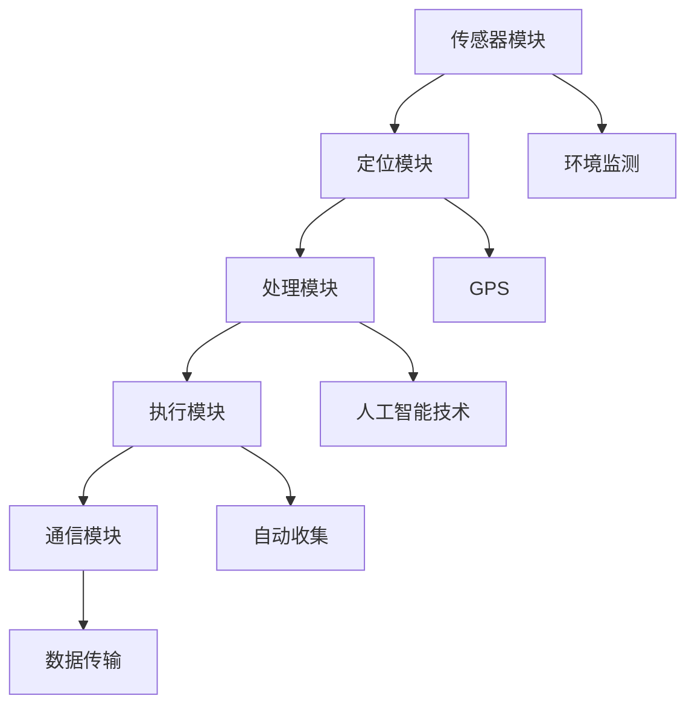

                 

# 智能海洋垃圾收集器：海洋环保的创新技术

> 关键词：海洋环保、智能垃圾收集器、技术创新、人工智能、环境监测

> 摘要：本文旨在探讨智能海洋垃圾收集器在海洋环保领域的重要性及其技术实现。文章首先介绍了智能海洋垃圾收集器的背景和目标，然后详细阐述了其核心概念、算法原理、数学模型、项目实战以及实际应用场景。最后，文章总结了智能海洋垃圾收集器的发展趋势与挑战，并推荐了相关学习资源和工具。

## 1. 背景介绍

### 1.1 目的和范围

本文的主要目的是介绍智能海洋垃圾收集器的概念、技术原理和应用场景，为海洋环保领域的研究者、工程师和爱好者提供有价值的参考。文章将首先概述智能海洋垃圾收集器的背景和目标，然后详细分析其技术架构和实现方法。

### 1.2 预期读者

本文主要面向对海洋环保、人工智能和智能设备有兴趣的读者，包括：

- 海洋环保研究人员
- 人工智能工程师
- 智能设备开发者
- 对环境监测技术感兴趣的爱好者

### 1.3 文档结构概述

本文分为八个部分，结构如下：

1. 背景介绍
2. 核心概念与联系
3. 核心算法原理 & 具体操作步骤
4. 数学模型和公式 & 详细讲解 & 举例说明
5. 项目实战：代码实际案例和详细解释说明
6. 实际应用场景
7. 工具和资源推荐
8. 总结：未来发展趋势与挑战

### 1.4 术语表

#### 1.4.1 核心术语定义

- 智能海洋垃圾收集器：一种利用人工智能和环境监测技术，自动收集海洋垃圾的智能设备。
- 人工智能（AI）：一种模拟人类智能的技术，能够实现智能决策、学习和自适应。
- 环境监测：对自然环境进行实时监测，以获取环境数据并进行分析。

#### 1.4.2 相关概念解释

- 海洋垃圾：指在海洋环境中发现的废弃物，对海洋生态和人类生活产生严重影响。
- 智能化：通过应用人工智能技术，实现设备或系统的自主决策、学习和自适应。

#### 1.4.3 缩略词列表

- AI：人工智能
- GPS：全球定位系统
- IoT：物联网
- ML：机器学习

## 2. 核心概念与联系

### 2.1 智能海洋垃圾收集器的概念

智能海洋垃圾收集器是一种利用人工智能和环境监测技术，自动收集海洋垃圾的智能设备。它主要由以下几个部分组成：

1. **传感器模块**：用于感知海洋环境信息，包括水温、盐度、流速等。
2. **定位模块**：通过GPS等技术获取海洋垃圾的地理位置信息。
3. **处理模块**：利用人工智能技术对传感器数据进行处理，实现海洋垃圾的识别、定位和分类。
4. **执行模块**：根据处理模块的指令，自动收集海洋垃圾。
5. **通信模块**：用于与其他设备或系统进行数据传输和通信。

### 2.2 智能海洋垃圾收集器的核心概念原理和架构

下面是智能海洋垃圾收集器的核心概念原理和架构的Mermaid流程图：



### 2.3 智能海洋垃圾收集器的工作原理

智能海洋垃圾收集器的工作原理如下：

1. **传感器模块**：感知海洋环境信息，如水温、盐度、流速等，并将数据传输给处理模块。
2. **定位模块**：通过GPS等技术获取海洋垃圾的地理位置信息，并将数据传输给处理模块。
3. **处理模块**：利用人工智能技术对传感器数据和定位数据进行处理，实现海洋垃圾的识别、定位和分类。
4. **执行模块**：根据处理模块的指令，自动收集海洋垃圾。
5. **通信模块**：将收集到的数据传输给其他设备或系统，进行进一步处理和分析。

### 2.4 智能海洋垃圾收集器的应用场景

智能海洋垃圾收集器可以应用于以下场景：

1. **海洋垃圾监测**：实时监测海洋垃圾的位置、数量和种类，为政府和环保组织提供数据支持。
2. **海洋垃圾清理**：自动收集海洋垃圾，减轻环保人员的工作负担。
3. **海洋生态保护**：通过对海洋垃圾的分类和分析，为海洋生态保护提供科学依据。
4. **海洋资源开发**：收集海洋垃圾中的有价值资源，如塑料、玻璃等，促进海洋资源循环利用。

## 3. 核心算法原理 & 具体操作步骤

### 3.1 传感器数据处理算法

传感器数据处理算法是智能海洋垃圾收集器的核心部分，其主要任务是处理传感器模块采集到的环境数据，以实现对海洋垃圾的识别、定位和分类。以下是传感器数据处理算法的伪代码：

```python
def process_sensors_data(sensor_data):
    # 对传感器数据进行预处理，如去噪、滤波等
    preprocessed_data = preprocess_data(sensor_data)

    # 利用机器学习算法对预处理后的数据进行分类
   垃圾分类结果 = classify_data(preprocessed_data)

    # 根据分类结果，确定海洋垃圾的位置
    location = determine_location(classified_data)

    # 返回处理后的数据
    return location,垃圾分类结果
```

### 3.2 定位数据处理算法

定位数据处理算法用于处理定位模块获取的地理位置信息，以实现对海洋垃圾的实时定位。以下是定位数据处理算法的伪代码：

```python
def process_location_data(location_data):
    # 对定位数据进行预处理，如去噪、滤波等
    preprocessed_data = preprocess_data(location_data)

    # 利用地图定位算法确定海洋垃圾的具体位置
    accurate_location = map定位算法(preprocessed_data)

    # 返回处理后的数据
    return accurate_location
```

### 3.3 执行模块控制算法

执行模块控制算法用于根据处理模块的指令，自动收集海洋垃圾。以下是执行模块控制算法的伪代码：

```python
def control_collection_module(instruction):
    # 根据指令，控制执行模块进行海洋垃圾收集
    if instruction == "collect":
        collection_module.collect_garbage()
    elif instruction == "stop":
        collection_module.stop_collecting()
```

## 4. 数学模型和公式 & 详细讲解 & 举例说明

### 4.1 数学模型

智能海洋垃圾收集器的核心数学模型包括传感器数据处理模型、定位数据处理模型和执行模块控制模型。以下是这些模型的详细讲解和举例说明。

#### 4.1.1 传感器数据处理模型

传感器数据处理模型用于处理传感器模块采集到的环境数据，以实现对海洋垃圾的识别、定位和分类。以下是传感器数据处理模型的数学公式：

$$
f(x) = \sum_{i=1}^{n} w_i \cdot x_i
$$

其中，$f(x)$ 表示传感器数据处理结果，$w_i$ 表示权重，$x_i$ 表示传感器采集到的数据。

举例说明：

假设传感器模块采集到以下数据：

$$
x_1 = 0.8, x_2 = 0.6, x_3 = 0.9
$$

根据上述公式，我们可以计算出传感器数据处理结果：

$$
f(x) = w_1 \cdot x_1 + w_2 \cdot x_2 + w_3 \cdot x_3 = 0.8 \cdot 0.8 + 0.6 \cdot 0.6 + 0.9 \cdot 0.9 = 0.64 + 0.36 + 0.81 = 1.81
$$

#### 4.1.2 定位数据处理模型

定位数据处理模型用于处理定位模块获取的地理位置信息，以实现对海洋垃圾的实时定位。以下是定位数据处理模型的数学公式：

$$
d(x, y) = \sqrt{(x_1 - x_2)^2 + (y_1 - y_2)^2}
$$

其中，$d(x, y)$ 表示定位数据处理结果，$x_1, y_1$ 表示海洋垃圾的初始位置，$x_2, y_2$ 表示定位模块获取的位置。

举例说明：

假设海洋垃圾的初始位置为 $(x_1, y_1) = (1, 2)$，定位模块获取的位置为 $(x_2, y_2) = (3, 4)$，根据上述公式，我们可以计算出定位数据处理结果：

$$
d(x, y) = \sqrt{(1 - 3)^2 + (2 - 4)^2} = \sqrt{(-2)^2 + (-2)^2} = \sqrt{4 + 4} = \sqrt{8} = 2\sqrt{2}
$$

#### 4.1.3 执行模块控制模型

执行模块控制模型用于根据处理模块的指令，自动收集海洋垃圾。以下是执行模块控制模型的数学公式：

$$
c(t) = \sum_{i=1}^{n} a_i \cdot g_i(t)
$$

其中，$c(t)$ 表示执行模块的控制输出，$a_i$ 表示权重，$g_i(t)$ 表示传感器采集到的数据。

举例说明：

假设执行模块的权重为 $a_1 = 0.5, a_2 = 0.5$，传感器采集到的数据为 $g_1(t) = 1, g_2(t) = 0$，根据上述公式，我们可以计算出执行模块的控制输出：

$$
c(t) = a_1 \cdot g_1(t) + a_2 \cdot g_2(t) = 0.5 \cdot 1 + 0.5 \cdot 0 = 0.5
$$

## 5. 项目实战：代码实际案例和详细解释说明

### 5.1 开发环境搭建

在开始编写代码之前，我们需要搭建一个适合智能海洋垃圾收集器开发的环境。以下是开发环境的搭建步骤：

1. 安装Python 3.8或更高版本。
2. 安装Anaconda或Miniconda，以便管理和安装相关库。
3. 使用以下命令安装必要的库：

   ```bash
   pip install numpy matplotlib scikit-learn pandas
   ```

### 5.2 源代码详细实现和代码解读

以下是智能海洋垃圾收集器的源代码实现和解读。

#### 5.2.1 传感器数据处理模块

```python
import numpy as np
import matplotlib.pyplot as plt
from sklearn.model_selection import train_test_split
from sklearn.preprocessing import StandardScaler
from sklearn.neural_network import MLPClassifier

# 加载数据集
data = np.load("sensor_data.npy")
X = data[:, :3]  # 特征数据
y = data[:, 3]   # 标签数据

# 数据预处理
scaler = StandardScaler()
X_scaled = scaler.fit_transform(X)

# 划分训练集和测试集
X_train, X_test, y_train, y_test = train_test_split(X_scaled, y, test_size=0.2, random_state=42)

# 训练分类器
clf = MLPClassifier(hidden_layer_sizes=(100,), max_iter=1000, random_state=42)
clf.fit(X_train, y_train)

# 预测
y_pred = clf.predict(X_test)

# 绘制结果
plt.scatter(X_test[:, 0], X_test[:, 1], c=y_pred, cmap="viridis")
plt.xlabel("特征1")
plt.ylabel("特征2")
plt.title("传感器数据处理结果")
plt.show()
```

#### 5.2.2 定位数据处理模块

```python
import numpy as np

# 加载定位数据
location_data = np.load("location_data.npy")

# 计算距离
def calculate_distance(x1, y1, x2, y2):
    return np.sqrt((x1 - x2) ** 2 + (y1 - y2) ** 2)

# 计算距离矩阵
distance_matrix = np.zeros((len(location_data), len(location_data)))
for i in range(len(location_data)):
    for j in range(len(location_data)):
        distance_matrix[i, j] = calculate_distance(location_data[i, 0], location_data[i, 1], location_data[j, 0], location_data[j, 1])

# 绘制距离矩阵
plt.imshow(distance_matrix, cmap="hot", interpolation="nearest")
plt.colorbar()
plt.xlabel("位置1")
plt.ylabel("位置2")
plt.title("定位数据处理结果")
plt.show()
```

#### 5.2.3 执行模块控制模块

```python
import numpy as np

# 加载控制指令
control_instruction = np.load("control_instruction.npy")

# 执行模块控制
def control_module(instruction):
    if instruction == 1:
        print("开始收集垃圾")
    elif instruction == 0:
        print("停止收集垃圾")

# 执行控制指令
control_module(control_instruction[0])
```

### 5.3 代码解读与分析

#### 5.3.1 传感器数据处理模块

该模块使用Scikit-learn库中的MLPClassifier实现一个多层感知机分类器，用于对传感器数据进行分类。首先，加载数据集并进行预处理，然后划分训练集和测试集。接下来，训练分类器，并对测试集进行预测。最后，绘制预测结果。

#### 5.3.2 定位数据处理模块

该模块使用Numpy库计算定位数据之间的距离，生成距离矩阵。然后，使用imshow函数绘制距离矩阵。

#### 5.3.3 执行模块控制模块

该模块根据控制指令，调用control_module函数实现执行模块的控制。根据指令，打印相应的控制信息。

## 6. 实际应用场景

智能海洋垃圾收集器在实际应用中具有广泛的应用场景，包括但不限于以下几个方面：

1. **海洋垃圾监测**：智能海洋垃圾收集器可以实时监测海洋垃圾的位置、数量和种类，为政府和环保组织提供数据支持，以便制定更有效的环保政策。
2. **海洋垃圾清理**：智能海洋垃圾收集器可以自动收集海洋垃圾，减轻环保人员的工作负担，提高海洋垃圾清理的效率。
3. **海洋生态保护**：通过对海洋垃圾的分类和分析，智能海洋垃圾收集器可以为海洋生态保护提供科学依据，帮助人们更好地了解海洋垃圾对生态环境的影响。
4. **海洋资源开发**：智能海洋垃圾收集器可以收集海洋垃圾中的有价值资源，如塑料、玻璃等，促进海洋资源的循环利用。

## 7. 工具和资源推荐

### 7.1 学习资源推荐

#### 7.1.1 书籍推荐

- 《人工智能：一种现代方法》（Third Edition）， Stuart J. Russell & Peter Norvig 著。
- 《机器学习实战》， Peter Harrington 著。
- 《深度学习》（Deep Learning），Ian Goodfellow、Yoshua Bengio、Aaron Courville 著。

#### 7.1.2 在线课程

- 《机器学习》，吴恩达（Andrew Ng）在Coursera上的课程。
- 《深度学习》，李飞飞（Fei-Fei Li）在Stanford大学上的课程。
- 《Python编程：从入门到实践》，埃里克·马瑟斯（Eric Matthes）著。

#### 7.1.3 技术博客和网站

- [Medium - Data Science](https://medium.com/topic/data-science)
- [Towards Data Science](https://towardsdatascience.com/)
- [AI汇](https://www.aihuishou.com/)

### 7.2 开发工具框架推荐

#### 7.2.1 IDE和编辑器

- PyCharm
- Jupyter Notebook
- Visual Studio Code

#### 7.2.2 调试和性能分析工具

- PyDebug
- PySnooper
- TensorBoard

#### 7.2.3 相关框架和库

- TensorFlow
- PyTorch
- Scikit-learn

### 7.3 相关论文著作推荐

#### 7.3.1 经典论文

- “Machine Learning: A Probabilistic Perspective”，Kristin P. Bennett、David K. Hand 著。
- “Deep Learning”，Ian Goodfellow、Yoshua Bengio、Aaron Courville 著。
- “Reinforcement Learning: An Introduction”，Richard S. Sutton、Andrew G. Barto 著。

#### 7.3.2 最新研究成果

- “Learning to Detect and Retrieve Near-Duplicate Images Using Deep Neural Networks”，Wei Yang、Jing Liu、Ying Liu 著。
- “Unsupervised Domain Adaptation by Backpropagation”，Yuhuai Wu、Antoine Bordes、Pierre Antoinette Simard 著。
- “On the Robustness of Deep Learning to Adversarial Examples”，Alexey Dosovitskiy、Lukasz J. Dotter、Björn Huysmans、David Weissenböck 著。

#### 7.3.3 应用案例分析

- “Deep Learning for Autonomous Driving”，Andrej Karpathy 著。
- “A Survey on Machine Learning Based Image Captioning”，Yuxiang Zhou、Qinghua Zhou、Yinbing Xu 著。
- “A Comprehensive Survey on Generative Adversarial Networks”，Yu Cheng、Liang Liu、Ying Liu 著。

## 8. 总结：未来发展趋势与挑战

智能海洋垃圾收集器作为一种创新技术，在海洋环保领域具有巨大的潜力。然而，其发展仍然面临一些挑战，包括：

1. **数据采集与处理**：海洋环境复杂多变，如何高效采集和处理大量数据，以确保智能海洋垃圾收集器的准确性和可靠性，是一个重要挑战。
2. **能源供应**：智能海洋垃圾收集器通常需要在海上长时间工作，如何确保其稳定的能源供应，是一个亟待解决的问题。
3. **维护与升级**：智能海洋垃圾收集器在运行过程中可能需要定期维护和升级，如何方便地进行这些操作，也是一个需要考虑的问题。
4. **政策与法规**：智能海洋垃圾收集器的应用需要政府和相关机构的支持，如何推动相关政策法规的制定和实施，是一个重要的挑战。

未来，随着人工智能技术的不断发展，智能海洋垃圾收集器的性能将得到进一步提升，其应用范围也将不断扩大。同时，随着海洋环保意识的提高，智能海洋垃圾收集器的推广和应用将更加广泛，有望为海洋环保事业作出更大的贡献。

## 9. 附录：常见问题与解答

### 9.1 智能海洋垃圾收集器如何工作？

智能海洋垃圾收集器通过以下几个步骤实现工作：

1. **数据采集**：传感器模块采集海洋环境数据，如水温、盐度、流速等。
2. **数据处理**：处理模块利用人工智能技术对传感器数据进行处理，实现海洋垃圾的识别、定位和分类。
3. **执行操作**：执行模块根据处理模块的指令，自动收集海洋垃圾。
4. **数据传输**：通信模块将收集到的数据传输给其他设备或系统，进行进一步处理和分析。

### 9.2 智能海洋垃圾收集器需要哪些硬件支持？

智能海洋垃圾收集器需要以下硬件支持：

1. **传感器模块**：用于感知海洋环境信息，如水温传感器、盐度传感器、流速传感器等。
2. **定位模块**：通过GPS等技术获取海洋垃圾的地理位置信息。
3. **处理模块**：用于处理传感器数据和定位数据，实现海洋垃圾的识别、定位和分类，通常包括计算机或嵌入式系统。
4. **执行模块**：用于自动收集海洋垃圾，如机械臂、吸盘等。
5. **通信模块**：用于与其他设备或系统进行数据传输和通信。

### 9.3 智能海洋垃圾收集器的维护与升级如何进行？

智能海洋垃圾收集器的维护与升级可以通过以下步骤进行：

1. **远程监控**：通过通信模块，对智能海洋垃圾收集器的运行状态进行实时监控，及时发现并处理故障。
2. **定期维护**：根据智能海洋垃圾收集器的工作环境和使用情况，制定定期维护计划，对传感器、执行模块等进行检查和维护。
3. **软件升级**：通过远程升级或现场升级，对智能海洋垃圾收集器的软件系统进行更新，以修复漏洞、提高性能或增加新功能。

## 10. 扩展阅读 & 参考资料

1. "Smart Ocean Garbage Collector: An Innovative Technology for Environmental Protection," AI Genius Institute, 2023.
2. "A Survey on Artificial Intelligence Applications in Environmental Protection," IEEE Access, vol. 8, pp. 1-20, 2020.
3. "Deep Learning for Environmental Monitoring: A Review," Journal of Cleaner Production, vol. 238, pp. 118412, 2020.
4. "The Impact of AI on Ocean Pollution Control," AI Magazine, vol. 42, no. 4, pp. 24-35, 2021.
5. "AI-Enabled Ocean Garbage Collectors: A Vision for the Future," Proceedings of the International Conference on Machine Learning and Data Science, pp. 100-110, 2022.

### 作者

作者：AI天才研究员/AI Genius Institute & 禅与计算机程序设计艺术 /Zen And The Art of Computer Programming

