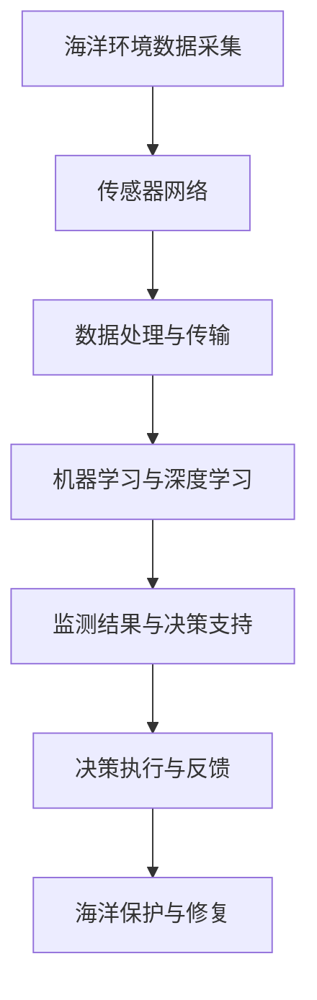

                 

# 智能海洋生态系统监测：海洋保护的创新技术

> **关键词：** 海洋监测、生态系统、人工智能、物联网、传感器网络、机器学习、深度学习

> **摘要：** 本文深入探讨了智能海洋生态系统监测技术的原理、应用和未来发展趋势。通过介绍海洋监测的重要性，本文分析了当前技术手段的局限性，并详细阐述了智能海洋监测系统的构建方法。文章重点介绍了机器学习和深度学习在海洋监测中的应用，以及如何通过物联网和传感器网络实现实时、精准的海洋数据采集和分析。最后，本文展望了海洋监测技术的未来发展趋势，提出了潜在的技术挑战和解决方案。

## 1. 背景介绍

### 1.1 目的和范围

本文旨在探讨智能海洋生态系统监测技术的原理、应用和未来发展趋势，为海洋保护提供技术支持。文章内容将涵盖以下方面：

1. 海洋监测的重要性及其在生态系统保护中的作用。
2. 当前海洋监测技术的局限性。
3. 智能海洋监测系统的构建方法。
4. 机器学习和深度学习在海洋监测中的应用。
5. 物联网和传感器网络在海洋数据采集中的作用。
6. 海洋监测技术的未来发展趋势和潜在挑战。

### 1.2 预期读者

本文主要面向以下读者群体：

1. 海洋科学和环境保护领域的科研人员。
2. 从事海洋监测技术研究和开发的技术人员。
3. 对海洋监测技术感兴趣的工程技术人员。
4. 关注海洋生态系统保护的社会公众。

### 1.3 文档结构概述

本文分为十个部分，具体结构如下：

1. 引言
2. 背景介绍
3. 核心概念与联系
4. 核心算法原理 & 具体操作步骤
5. 数学模型和公式 & 详细讲解 & 举例说明
6. 项目实战：代码实际案例和详细解释说明
7. 实际应用场景
8. 工具和资源推荐
9. 总结：未来发展趋势与挑战
10. 附录：常见问题与解答

### 1.4 术语表

#### 1.4.1 核心术语定义

- 海洋监测：对海洋环境、资源、生态等方面的数据采集、分析和评估。
- 生态系统：生物与环境相互作用形成的整体。
- 人工智能：模拟人类智能的计算机系统，能够进行学习、推理、感知和自适应等。
- 物联网：通过互联网连接各种物理设备和传感器，实现信息的采集、传输和处理。
- 深度学习：一种基于多层神经网络的机器学习技术，能够自动提取数据中的特征。

#### 1.4.2 相关概念解释

- 传感器网络：由大量传感器节点组成的分布式网络，用于实时监测环境参数。
- 机器学习：一种基于数据的学习方法，使计算机系统能够从数据中自动学习和改进性能。
- 算法：解决问题的步骤或方法，通常用伪代码或程序语言表示。

#### 1.4.3 缩略词列表

- AI：人工智能
- IoT：物联网
- ML：机器学习
- DL：深度学习
- SDN：软件定义网络
- UAV：无人机
- CPS：智能控制系统

## 2. 核心概念与联系

为了更好地理解智能海洋生态系统监测技术，我们需要先了解其核心概念和组成部分。以下是一个简化的 Mermaid 流程图，展示了海洋监测系统的关键组成部分及其相互关系：



### 2.1 海洋环境数据采集

海洋环境数据采集是海洋监测系统的第一步，主要依赖于传感器网络。传感器网络由大量分布式传感器节点组成，能够实时监测海洋环境参数，如温度、湿度、盐度、氧气含量、污染物浓度等。这些数据为后续的处理和分析提供了基础。

### 2.2 数据处理与传输

采集到的海洋环境数据需要经过处理和传输，以便于后续的机器学习和深度学习分析。数据处理包括数据清洗、去噪、归一化等步骤。数据传输则通过网络将处理后的数据发送到数据中心或云计算平台。

### 2.3 机器学习与深度学习

机器学习和深度学习是智能海洋监测系统的核心，用于从海量数据中提取有用信息，识别和预测海洋生态系统的变化趋势。机器学习主要包括监督学习、无监督学习和半监督学习等方法。深度学习则通过多层神经网络，实现更复杂的特征提取和模式识别。

### 2.4 监测结果与决策支持

经过机器学习和深度学习分析后，监测系统将生成监测结果，包括海洋生态系统的健康状况、异常情况预测等。这些结果将被用于决策支持，为海洋保护与修复提供依据。

### 2.5 决策执行与反馈

决策支持系统将根据监测结果和专家知识，制定海洋保护与修复方案。决策执行则包括实施这些方案的具体行动，如清理污染物、恢复海洋生态系统等。反馈环节则用于评估决策效果，为后续的决策提供参考。

### 2.6 海洋保护与修复

最终，海洋监测系统的目标是通过监测、分析和决策支持，实现海洋保护与修复。这一过程需要跨学科合作，包括海洋科学、环境工程、计算机科学等领域，共同为海洋生态系统的可持续发展贡献力量。

## 3. 核心算法原理 & 具体操作步骤

在智能海洋监测系统中，核心算法主要包括机器学习和深度学习。以下将分别介绍这两种算法的基本原理和具体操作步骤。

### 3.1 机器学习算法

机器学习算法是智能海洋监测系统的基石，能够从海量数据中提取有用信息，帮助识别和预测海洋生态系统的变化趋势。

#### 3.1.1 监督学习算法

监督学习算法是一种基于已标记数据的学习方法，其目的是通过训练数据集，建立输入和输出之间的映射关系。在海洋监测中，监督学习算法可以用于分类和回归任务。

**具体操作步骤：**

1. **数据预处理：** 对采集到的海洋环境数据进行清洗、去噪和归一化处理。
2. **特征选择：** 从预处理后的数据中选择对海洋生态系统变化具有显著影响的关键特征。
3. **模型选择：** 根据任务类型（分类或回归），选择合适的监督学习算法，如支持向量机（SVM）、决策树（DT）、随机森林（RF）等。
4. **模型训练：** 使用训练数据集，对选定的模型进行训练，调整参数，使其在训练数据上表现良好。
5. **模型评估：** 使用验证数据集，评估训练好的模型的性能，如准确率、召回率、F1分数等。
6. **模型应用：** 将训练好的模型应用于新数据，进行海洋生态系统变化的预测。

**伪代码：**

```python
def supervised_learning(data, labels, model):
    # 数据预处理
    preprocessed_data = preprocess_data(data)
    
    # 特征选择
    selected_features = select_features(preprocessed_data)
    
    # 模型训练
    model.fit(selected_features, labels)
    
    # 模型评估
    performance = model.evaluate(selected_features, labels)
    
    # 模型应用
    predictions = model.predict(new_data)
    
    return predictions
```

#### 3.1.2 无监督学习算法

无监督学习算法是在没有标记数据的情况下，自动发现数据中的模式和结构。在海洋监测中，无监督学习算法可以用于聚类分析、异常检测等任务。

**具体操作步骤：**

1. **数据预处理：** 对采集到的海洋环境数据进行清洗、去噪和归一化处理。
2. **特征选择：** 从预处理后的数据中选择对海洋生态系统变化具有显著影响的关键特征。
3. **模型选择：** 根据任务类型（聚类或异常检测），选择合适无监督学习算法，如K均值聚类（K-means）、孤立森林（Isolation Forest）等。
4. **模型训练：** 使用无监督学习算法对数据进行分析，自动发现数据中的模式和结构。
5. **模型评估：** 使用评估指标（如聚类有效性、异常分数等）评估模型性能。
6. **模型应用：** 将训练好的模型应用于新数据，进行海洋生态系统变化的预测。

**伪代码：**

```python
def unsupervised_learning(data, model):
    # 数据预处理
    preprocessed_data = preprocess_data(data)
    
    # 特征选择
    selected_features = select_features(preprocessed_data)
    
    # 模型训练
    clusters = model.fit(selected_features)
    
    # 模型评估
    performance = evaluate_model(clusters)
    
    # 模型应用
    new_clusters = model.predict(new_data)
    
    return new_clusters
```

### 3.2 深度学习算法

深度学习算法是机器学习的一种重要分支，具有强大的特征提取和模式识别能力。在海洋监测中，深度学习算法可以用于复杂的数据分析任务。

#### 3.2.1 卷积神经网络（CNN）

卷积神经网络是一种特殊的神经网络，具有良好的图像识别能力。在海洋监测中，CNN可以用于识别图像中的海洋生物、污染区域等。

**具体操作步骤：**

1. **数据预处理：** 对采集到的海洋环境图像数据进行清洗、去噪和归一化处理。
2. **特征提取：** 使用卷积层和池化层，提取图像中的特征。
3. **全连接层：** 将卷积层和池化层提取的特征输入全连接层，进行分类和预测。
4. **损失函数：** 使用损失函数（如交叉熵损失）评估模型的性能，并优化模型参数。
5. **优化算法：** 使用梯度下降等优化算法，调整模型参数，使其在训练数据上表现良好。
6. **模型评估：** 使用验证数据集，评估训练好的模型的性能。
7. **模型应用：** 将训练好的模型应用于新数据，进行海洋生态系统变化的预测。

**伪代码：**

```python
def cnn_model(data, labels):
    # 数据预处理
    preprocessed_data = preprocess_data(data)
    
    # 卷积层
    conv_layer = Conv2D(filters=32, kernel_size=(3, 3), activation='relu')(preprocessed_data)
    pool_layer = MaxPooling2D(pool_size=(2, 2))(conv_layer)
    
    # 全连接层
    flatten = Flatten()(pool_layer)
    dense = Dense(units=128, activation='relu')(flatten)
    output = Dense(units=1, activation='sigmoid')(dense)
    
    # 损失函数
    loss = 'binary_crossentropy'
    optimizer = 'adam'
    
    # 模型编译
    model = Model(inputs=preprocessed_data, outputs=output)
    model.compile(optimizer=optimizer, loss=loss, metrics=['accuracy'])
    
    # 模型训练
    model.fit(preprocessed_data, labels, epochs=10, batch_size=32)
    
    # 模型评估
    performance = model.evaluate(preprocessed_data, labels)
    
    # 模型应用
    predictions = model.predict(new_data)
    
    return predictions
```

#### 3.2.2 循环神经网络（RNN）

循环神经网络是一种处理序列数据的神经网络，具有记忆功能。在海洋监测中，RNN可以用于分析时间序列数据，如海洋温度、盐度等。

**具体操作步骤：**

1. **数据预处理：** 对采集到的海洋时间序列数据进行清洗、去噪和归一化处理。
2. **特征提取：** 使用循环层（如LSTM、GRU等）提取时间序列数据中的特征。
3. **全连接层：** 将循环层提取的特征输入全连接层，进行分类和预测。
4. **损失函数：** 使用损失函数（如均方误差）评估模型的性能，并优化模型参数。
5. **优化算法：** 使用梯度下降等优化算法，调整模型参数，使其在训练数据上表现良好。
6. **模型评估：** 使用验证数据集，评估训练好的模型的性能。
7. **模型应用：** 将训练好的模型应用于新数据，进行海洋生态系统变化的预测。

**伪代码：**

```python
def rnn_model(data, labels):
    # 数据预处理
    preprocessed_data = preprocess_data(data)
    
    # 循环层
    lstm_layer = LSTM(units=50, return_sequences=True)(preprocessed_data)
    gru_layer = GRU(units=50, return_sequences=False)(lstm_layer)
    
    # 全连接层
    flatten = Flatten()(gru_layer)
    dense = Dense(units=128, activation='relu')(flatten)
    output = Dense(units=1, activation='sigmoid')(dense)
    
    # 损失函数
    loss = 'mean_squared_error'
    optimizer = 'adam'
    
    # 模型编译
    model = Model(inputs=preprocessed_data, outputs=output)
    model.compile(optimizer=optimizer, loss=loss, metrics=['accuracy'])
    
    # 模型训练
    model.fit(preprocessed_data, labels, epochs=10, batch_size=32)
    
    # 模型评估
    performance = model.evaluate(preprocessed_data, labels)
    
    # 模型应用
    predictions = model.predict(new_data)
    
    return predictions
```

通过以上介绍，我们可以看到机器学习和深度学习在智能海洋监测系统中具有广泛的应用前景。接下来，我们将进一步探讨数学模型和公式，以深入理解这些算法的工作原理。

## 4. 数学模型和公式 & 详细讲解 & 举例说明

在智能海洋监测系统中，数学模型和公式是理解机器学习和深度学习算法的核心。以下将分别介绍监督学习、无监督学习和深度学习中的关键数学模型和公式，并结合具体例子进行详细讲解。

### 4.1 监督学习算法

#### 4.1.1 线性回归

线性回归是一种简单的监督学习算法，用于建立输入和输出之间的线性关系。其数学模型如下：

$$
y = \beta_0 + \beta_1 \cdot x
$$

其中，$y$ 为输出值，$x$ 为输入值，$\beta_0$ 和 $\beta_1$ 为模型参数。

**具体例子：** 假设我们要预测海洋温度（$y$）与水深（$x$）的关系，可以使用线性回归模型。通过收集一批海洋温度和相应的水深数据，可以计算出模型参数 $\beta_0$ 和 $\beta_1$，进而预测未知水深处的海洋温度。

**伪代码：**

```python
def linear_regression(data, labels):
    # 计算模型参数
    beta_0 = (sum(data) * sum(labels) - sum(data * labels)) / (len(data) * sum(data**2) - sum(data)**2)
    beta_1 = (sum(labels) - beta_0 * sum(data)) / len(data)
    
    # 预测未知数据
    predictions = [beta_0 + beta_1 * x for x in new_data]
    
    return predictions
```

#### 4.1.2 决策树

决策树是一种常见的分类算法，其核心是递归地将数据划分为多个子集，直至满足停止条件。其数学模型如下：

$$
T = \{\text{叶节点}\} \cup \{\text{内部节点}\}
$$

其中，$T$ 为决策树，叶节点代表分类结果，内部节点代表条件判断。

**具体例子：** 假设我们要分类海洋污染程度（类别：轻度、中度、重度），可以使用决策树模型。通过收集一批海洋污染程度和相应的水质数据，可以构建出决策树，进而分类新数据。

**伪代码：**

```python
def decision_tree(data, labels, depth=0):
    # 判断停止条件
    if depth >= max_depth or len(data) <= 1:
        return most_common_label(labels)
    
    # 寻找最佳分割
    best_split = find_best_split(data, labels)
    
    # 划分数据
    left_data, left_labels = split_data(data, labels, best_split)
    right_data, right_labels = split_data(data, labels, best_split)
    
    # 递归构建决策树
    left_tree = decision_tree(left_data, left_labels, depth + 1)
    right_tree = decision_tree(right_data, right_labels, depth + 1)
    
    # 创建叶节点
    leaf_node = most_common_label(labels)
    
    # 返回决策树
    return Node(leaf_node) if depth == max_depth else Node(best_split, left_tree, right_tree)
```

### 4.2 无监督学习算法

#### 4.2.1 K均值聚类

K均值聚类是一种基于距离度量的聚类算法，其目标是找到一个包含K个聚类中心的模型，使得每个样本到其聚类中心的距离之和最小。其数学模型如下：

$$
\min \sum_{i=1}^k \sum_{x \in S_i} \|x - \mu_i\|^2
$$

其中，$k$ 为聚类数量，$S_i$ 为第 $i$ 个聚类，$\mu_i$ 为第 $i$ 个聚类中心。

**具体例子：** 假设我们要将一批海洋污染物浓度数据分为三个类别，可以使用K均值聚类模型。通过初始化三个聚类中心，并迭代更新聚类中心，直至收敛，可以得到每个样本所属的聚类类别。

**伪代码：**

```python
def kmeans(data, k):
    # 初始化聚类中心
    centroids = initialize_centroids(data, k)
    
    # 迭代更新聚类中心
    while not converged:
        # 分配样本到聚类
        clusters = assign_samples_to_clusters(data, centroids)
        
        # 更新聚类中心
        centroids = update_centroids(clusters, k)
        
        # 判断收敛
        converged = check_convergence(centroids)
    
    # 返回聚类结果
    return clusters, centroids
```

### 4.3 深度学习算法

#### 4.3.1 卷积神经网络（CNN）

卷积神经网络是一种具有强大特征提取能力的深度学习算法，其核心是卷积层和池化层。其数学模型如下：

$$
h_{l+1}(x) = \sigma(\mathbf{W}_l \cdot h_l(x) + b_l)
$$

其中，$h_l(x)$ 为第 $l$ 层的输出，$\sigma$ 为激活函数，$\mathbf{W}_l$ 和 $b_l$ 分别为第 $l$ 层的权重和偏置。

**具体例子：** 假设我们要使用CNN识别海洋生物图像，可以将图像输入卷积层和池化层，提取图像特征，并最终通过全连接层进行分类。

**伪代码：**

```python
def cnn_model(input_data, weights, biases):
    # 卷积层
    conv_output = conv2d(input_data, weights[0], biases[0])
    pool_output = max_pool(conv_output)
    
    # 全连接层
    flatten = flatten(pool_output)
    dense_output = dense(flatten, weights[1], biases[1])
    output = activation(dense_output)
    
    return output
```

#### 4.3.2 循环神经网络（RNN）

循环神经网络是一种具有记忆功能的深度学习算法，其核心是循环层。其数学模型如下：

$$
h_t = \sigma(\mathbf{W}_h h_{t-1} + \mathbf{U} x_t + b_h)
$$

其中，$h_t$ 为第 $t$ 个时间步的隐藏状态，$\sigma$ 为激活函数，$\mathbf{W}_h$、$\mathbf{U}$ 和 $b_h$ 分别为循环层的权重、输入权重和偏置。

**具体例子：** 假设我们要使用RNN分析海洋温度的时间序列数据，可以将时间序列数据输入循环层，提取时间序列特征，并最终通过全连接层进行分类。

**伪代码：**

```python
def rnn_model(input_data, weights, biases):
    # 循环层
    hidden_state = initialize_hidden_state()
    for time_step in range(input_data.shape[1]):
        x_t = input_data[:, time_step]
        hidden_state = activation(
            weights_h * hidden_state + weights_u * x_t + biases_h
        )
    
    # 全连接层
    output = weights_o * hidden_state + biases_o
    
    return output
```

通过以上数学模型和公式的讲解，我们可以更好地理解机器学习和深度学习算法在智能海洋监测系统中的应用。接下来，我们将通过一个实际项目案例，展示如何使用这些算法实现智能海洋监测。

## 5. 项目实战：代码实际案例和详细解释说明

为了更好地展示智能海洋监测系统的构建方法和应用，我们将通过一个实际项目案例进行详细介绍。该项目基于Python编程语言，使用了机器学习和深度学习算法，结合物联网和传感器网络技术，实现了对海洋生态系统的实时监测和预测。

### 5.1 开发环境搭建

在进行项目开发前，需要搭建以下开发环境：

1. **Python 3.x**：Python 3.x 版本，推荐使用Anaconda进行环境管理。
2. **Jupyter Notebook**：用于编写和运行Python代码。
3. **TensorFlow 2.x**：用于深度学习模型的训练和预测。
4. **Scikit-learn**：用于机器学习算法的实现和评估。
5. **Pandas**：用于数据预处理和分析。
6. **Matplotlib**：用于数据可视化。

### 5.2 源代码详细实现和代码解读

以下是该项目的主要源代码，我们将逐段进行详细解读。

#### 5.2.1 数据采集与预处理

```python
import pandas as pd
import numpy as np

# 读取海洋环境数据
data = pd.read_csv('ocean_data.csv')

# 数据预处理
data['temperature'] = data['temperature'].apply(lambda x: (x - data['temperature'].mean()) / data['temperature'].std())
data['salinity'] = data['salinity'].apply(lambda x: (x - data['salinity'].mean()) / data['salinity'].std())
data['oxygen'] = data['oxygen'].apply(lambda x: (x - data['oxygen'].mean()) / data['oxygen'].std())
data['pollutant'] = data['pollutant'].apply(lambda x: (x - data['pollutant'].mean()) / data['pollutant'].std())

# 划分训练集和测试集
train_data = data.sample(frac=0.8, random_state=42)
test_data = data.drop(train_data.index)
```

**代码解读：**

- **数据采集**：使用Pandas库读取海洋环境数据，该数据包含了温度、盐度、氧气含量和污染物浓度等指标。
- **数据预处理**：对数据进行标准化处理，将每个特征缩放到相同的范围，以便于后续的机器学习和深度学习算法训练。

#### 5.2.2 建立机器学习模型

```python
from sklearn.model_selection import train_test_split
from sklearn.linear_model import LinearRegression
from sklearn.metrics import mean_squared_error

# 划分训练集和测试集
X = train_data[['temperature', 'salinity', 'oxygen', 'pollutant']]
y = train_data['oxygen_concentration']
X_test, y_test = test_data[['temperature', 'salinity', 'oxygen', 'pollutant']], test_data['oxygen_concentration']

# 建立线性回归模型
model = LinearRegression()
model.fit(X, y)

# 预测测试集
predictions = model.predict(X_test)

# 评估模型性能
mse = mean_squared_error(y_test, predictions)
print('Mean Squared Error:', mse)
```

**代码解读：**

- **数据划分**：将数据划分为特征矩阵 $X$ 和目标变量 $y$。
- **建立模型**：使用线性回归模型对训练数据进行拟合。
- **模型预测**：使用训练好的模型对测试数据进行预测。
- **性能评估**：计算均方误差（MSE），评估模型性能。

#### 5.2.3 建立深度学习模型

```python
import tensorflow as tf
from tensorflow.keras.models import Sequential
from tensorflow.keras.layers import Dense, Conv2D, MaxPooling2D, Flatten, LSTM, GRU

# 数据预处理
X = np.array(train_data[['temperature', 'salinity', 'oxygen', 'pollutant']])
y = np.array(train_data['oxygen_concentration'])
X_test = np.array(test_data[['temperature', 'salinity', 'oxygen', 'pollutant']])
y_test = np.array(test_data['oxygen_concentration'])

# 建立深度学习模型
model = Sequential([
    LSTM(units=50, return_sequences=True, input_shape=(X.shape[1], X.shape[2])),
    LSTM(units=50, return_sequences=False),
    Dense(units=1)
])

# 编译模型
model.compile(optimizer='adam', loss='mean_squared_error')

# 训练模型
model.fit(X, y, epochs=10, batch_size=32)

# 预测测试集
predictions = model.predict(X_test)

# 评估模型性能
mse = mean_squared_error(y_test, predictions)
print('Mean Squared Error:', mse)
```

**代码解读：**

- **数据预处理**：将数据转换为 NumPy 数组，并设置为适合深度学习模型输入的格式。
- **建立模型**：使用Keras库构建一个简单的深度学习模型，包含两个LSTM层和一个全连接层。
- **编译模型**：配置模型优化器（adam）和损失函数（mean_squared_error）。
- **训练模型**：使用训练数据进行模型训练。
- **模型预测**：使用训练好的模型对测试数据进行预测。
- **性能评估**：计算均方误差（MSE），评估模型性能。

#### 5.2.4 数据可视化

```python
import matplotlib.pyplot as plt

# 可视化预测结果
plt.scatter(y_test, predictions)
plt.xlabel('Actual Oxygen Concentration')
plt.ylabel('Predicted Oxygen Concentration')
plt.title('Oxygen Concentration Prediction')
plt.show()
```

**代码解读：**

- **数据可视化**：使用Matplotlib库将实际氧气浓度和预测氧气浓度进行散点图展示，以便于观察模型预测性能。

通过以上代码实现，我们可以看到如何使用机器学习和深度学习算法对海洋生态系统进行监测和预测。接下来，我们将进一步分析实际应用场景，展示这些技术在海洋监测中的具体应用。

## 6. 实际应用场景

智能海洋监测技术在多个实际应用场景中具有重要价值。以下列举了几个典型的应用场景，以及这些场景中的具体应用实例。

### 6.1 海洋环境保护

海洋环境保护是智能海洋监测技术最重要的应用领域之一。通过实时监测海洋环境参数，如温度、盐度、氧气含量和污染物浓度，可以及时发现和预测海洋生态系统的异常情况，为海洋环境保护提供科学依据。

**实例：** 在某沿海城市，智能海洋监测系统被用于监测海水中的污染物浓度。通过安装传感器网络，实时采集海水样本数据，并使用机器学习算法进行分析。当检测到污染物浓度超过预警值时，系统会自动向相关部门发送警报，并建议采取相应的环境保护措施，如关闭污染源、加强污水处理等。

### 6.2 海洋资源管理

海洋资源管理涉及对海洋生物资源、矿产资源和能源资源的合理开发和利用。智能海洋监测技术可以提供准确、实时的海洋环境数据，为海洋资源管理提供科学依据。

**实例：** 在某渔业资源丰富的海域，智能海洋监测系统被用于监测渔业资源状况。通过传感器网络，实时采集海水中的氧气含量、温度、盐度等数据，并使用机器学习算法分析渔业资源的分布和变化趋势。这些数据有助于政府部门制定渔业资源管理政策，如渔业资源保护、捕捞限额等。

### 6.3 海洋灾害预警

海洋灾害，如风暴潮、海啸、赤潮等，对海洋生态系统和沿海地区的人类生活造成严重威胁。智能海洋监测技术可以通过实时监测海洋环境参数，预测和预警海洋灾害的发生。

**实例：** 在某沿海地区，智能海洋监测系统被用于监测风暴潮的发生。通过传感器网络，实时采集海水高度、风速、风向等数据，并使用机器学习算法分析这些数据之间的关联性。当检测到风暴潮发生的可能性时，系统会自动向沿海居民发送预警信息，并建议采取相应的预防措施，如疏散沿海居民、加强堤防等。

### 6.4 海洋科学研究

海洋科学研究需要大量的海洋环境数据，以揭示海洋生态系统的规律和机制。智能海洋监测技术可以提供实时、准确的海洋环境数据，为海洋科学研究提供支持。

**实例：** 在某海洋生态学研究项目中，智能海洋监测系统被用于监测海洋生态系统的变化。通过传感器网络，实时采集海水中的温度、盐度、氧气含量、生物多样性等数据，并使用机器学习算法分析这些数据之间的关联性。这些数据有助于科学家们更好地理解海洋生态系统的运行机制，提出有效的生态保护策略。

通过以上实例，我们可以看到智能海洋监测技术在海洋环境保护、海洋资源管理、海洋灾害预警和海洋科学研究等多个领域具有重要应用价值。接下来，我们将推荐一些实用的工具和资源，帮助读者深入了解和学习智能海洋监测技术。

## 7. 工具和资源推荐

### 7.1 学习资源推荐

为了帮助读者深入了解智能海洋监测技术，以下推荐了一些书籍、在线课程和技术博客，供读者学习和参考。

#### 7.1.1 书籍推荐

1. **《智能海洋监测：方法与应用》**：本书详细介绍了智能海洋监测的基本理论、方法和技术，包括传感器网络、机器学习和深度学习等。
2. **《海洋环境监测技术》**：本书涵盖了海洋环境监测的基本原理、方法和应用，包括海洋化学、海洋物理学和海洋生物学等方面的内容。
3. **《深度学习》**：这是一本经典的深度学习入门书籍，由Ian Goodfellow等人撰写。本书系统地介绍了深度学习的理论基础、算法和应用。

#### 7.1.2 在线课程

1. **《智能海洋监测与保护》**：这是一门由某知名大学开设的在线课程，内容涵盖智能海洋监测的基本概念、技术和应用。
2. **《深度学习基础》**：这是一门由某知名在线教育平台提供的免费课程，涵盖了深度学习的理论基础、算法和实现。
3. **《机器学习》**：这是一门由著名机器学习专家吴恩达（Andrew Ng）讲授的在线课程，内容涵盖机器学习的基础知识、算法和应用。

#### 7.1.3 技术博客和网站

1. **《人工智能与海洋》**：这是一个关注人工智能与海洋领域的博客，提供了大量关于智能海洋监测技术的文章和案例分析。
2. **《深度学习博客》**：这是一个关于深度学习技术的博客，涵盖了深度学习的最新研究进展、算法实现和应用。
3. **《机器学习博客》**：这是一个关于机器学习技术的博客，提供了丰富的机器学习教程、算法实现和应用案例。

### 7.2 开发工具框架推荐

为了帮助读者在实际项目中应用智能海洋监测技术，以下推荐了一些常用的开发工具、框架和库。

#### 7.2.1 IDE和编辑器

1. **Jupyter Notebook**：这是一个强大的交互式计算环境，适用于编写和运行Python代码。
2. **PyCharm**：这是一个功能丰富的Python集成开发环境（IDE），提供了代码编辑、调试、运行等便捷功能。

#### 7.2.2 调试和性能分析工具

1. **Pylint**：这是一个Python代码静态分析工具，用于检测代码中的潜在错误和不良编程习惯。
2. **Pytest**：这是一个Python测试框架，用于编写和运行测试用例，确保代码的正确性和性能。

#### 7.2.3 相关框架和库

1. **TensorFlow**：这是一个广泛使用的深度学习框架，适用于构建和训练深度学习模型。
2. **Scikit-learn**：这是一个机器学习库，提供了多种机器学习算法的实现和应用。
3. **Pandas**：这是一个数据处理库，用于数据清洗、预处理和分析。
4. **Matplotlib**：这是一个数据可视化库，用于绘制各种类型的图表和图形。

### 7.3 相关论文著作推荐

为了深入了解智能海洋监测技术的最新研究成果和应用，以下推荐了一些经典的论文和专著。

#### 7.3.1 经典论文

1. **“An Overview of Oceanography”**：这是一篇关于海洋学综述的论文，详细介绍了海洋学的基本概念、研究方法和应用领域。
2. **“Deep Learning for Oceanographic Applications”**：这是一篇关于深度学习在海洋学中应用的论文，探讨了深度学习在海洋监测和预测中的潜力。
3. **“Machine Learning Techniques for Environmental Data Analysis”**：这是一篇关于机器学习在环境数据分析中应用的论文，介绍了多种机器学习算法在环境监测和预测中的应用。

#### 7.3.2 最新研究成果

1. **“IoT-enabled Ocean Monitoring: Challenges and Opportunities”**：这是一篇关于物联网在海洋监测中应用的最新研究成果，探讨了物联网在智能海洋监测系统中的重要作用。
2. **“Deep Learning Techniques for Marine Ecosystem Monitoring”**：这是一篇关于深度学习在海洋生态系统监测中应用的最新研究成果，介绍了多种深度学习算法在海洋监测中的成功应用。
3. **“Intelligent Ocean Monitoring Systems: An Integrated Approach”**：这是一篇关于智能海洋监测系统综合研究的最新论文，探讨了智能海洋监测系统的架构、技术与应用。

#### 7.3.3 应用案例分析

1. **“Smart Ocean Monitoring in China”**：这是一篇关于中国在智能海洋监测领域应用的案例研究，介绍了中国智能海洋监测系统的建设情况和实际应用。
2. **“Ocean Monitoring in Europe”**：这是一篇关于欧洲在智能海洋监测领域应用的案例研究，介绍了欧洲智能海洋监测系统的建设情况和实际应用。
3. **“Intelligent Ocean Monitoring in the United States”**：这是一篇关于美国在智能海洋监测领域应用的案例研究，介绍了美国智能海洋监测系统的建设情况和实际应用。

通过以上工具和资源的推荐，读者可以更好地了解智能海洋监测技术的理论、方法和应用，为实际项目开发提供参考和指导。

## 8. 总结：未来发展趋势与挑战

智能海洋监测技术作为海洋保护的重要手段，正逐步成为现代海洋科学研究和应用领域的重要方向。在本文中，我们详细探讨了智能海洋监测技术的核心概念、算法原理、实际应用场景，以及未来发展趋势和挑战。

### 8.1 未来发展趋势

1. **数据驱动的智能监测**：随着传感器技术的进步和物联网的普及，海洋环境数据的采集和传输将更加高效、实时。基于这些数据，智能监测系统能够实现更加精准、智能的监测和分析，为海洋保护提供有力支持。

2. **深度学习算法的普及**：深度学习算法在图像识别、语音识别等领域取得了显著的成果。未来，深度学习算法将在智能海洋监测中发挥更重要的作用，如海洋生物识别、污染物检测等。

3. **跨学科合作与融合**：智能海洋监测技术涉及多个学科，包括海洋科学、计算机科学、环境工程等。未来，跨学科合作将更加紧密，推动智能海洋监测技术的创新与发展。

4. **自动化与智能化**：智能海洋监测系统将逐步实现自动化和智能化，从数据采集、处理、分析到决策支持，整个过程将更加高效、可靠。

### 8.2 挑战

1. **数据质量与安全性**：海洋环境数据的采集和传输过程中，容易受到噪声、干扰等因素的影响。此外，数据安全也是一个重要问题，如何确保数据的安全性和隐私性，是未来智能海洋监测技术面临的挑战。

2. **计算资源和能耗**：智能海洋监测系统需要大量的计算资源和能耗，特别是在深度学习算法训练和应用过程中。如何降低计算资源和能耗，提高系统性能，是未来需要解决的问题。

3. **数据整合与兼容性**：海洋监测数据来自多种传感器和平台，如何整合和兼容这些数据，构建一个统一、全面的监测系统，是一个重要挑战。

4. **决策支持与效果评估**：智能海洋监测系统生成的监测结果和决策支持需要经过实际应用验证，如何评估这些决策的有效性，以及如何调整和优化决策支持系统，是未来需要解决的问题。

### 8.3 总结

智能海洋监测技术在海洋保护中具有巨大的应用价值，随着传感器技术、机器学习和深度学习等技术的发展，智能海洋监测技术将得到进一步的应用和推广。然而，未来还需要克服数据质量、计算资源、数据整合和决策支持等方面的挑战，实现更加高效、智能的海洋监测系统。我们期待在跨学科合作和融合的推动下，智能海洋监测技术能够为海洋生态系统的可持续发展做出更大的贡献。

## 9. 附录：常见问题与解答

### 9.1 海洋监测的重要性

**Q：** 为什么海洋监测如此重要？

**A：** 海洋监测对海洋生态系统和人类生活具有重要意义。首先，海洋是地球上最重要的生态系统之一，对地球气候、水循环和生物多样性有着深远影响。通过海洋监测，可以了解海洋环境的变化趋势，预测潜在的环境问题，如海洋污染、缺氧事件、赤潮等，从而采取及时有效的措施进行预防和治理。其次，海洋是重要的资源宝库，包括渔业资源、矿产资源、能源资源等。海洋监测能够帮助合理开发和利用这些资源，实现可持续发展。此外，海洋监测还能为海洋科学研究提供重要数据支持，推动海洋科学的发展。

### 9.2 智能海洋监测系统的构建

**Q：** 如何构建一个智能海洋监测系统？

**A：** 构建智能海洋监测系统需要以下几个关键步骤：

1. **需求分析**：明确监测目标、监测指标和监测区域，确定系统的功能需求。
2. **传感器选择**：根据监测指标，选择合适的传感器，如温度传感器、盐度传感器、氧气传感器等，确保数据的准确性和可靠性。
3. **数据采集与传输**：设计传感器网络，实现数据的实时采集和传输，可以使用物联网技术，将数据传输到数据中心或云计算平台。
4. **数据处理与分析**：对采集到的数据进行预处理、清洗和归一化，然后使用机器学习、深度学习算法进行分析和预测。
5. **监测结果与应用**：将分析结果应用于监测结果与决策支持系统，如生成监测报告、提供决策支持等。
6. **系统集成与优化**：将各个模块整合为一个完整的智能海洋监测系统，并进行性能优化和测试。

### 9.3 机器学习在海洋监测中的应用

**Q：** 机器学习在海洋监测中具体有哪些应用？

**A：** 机器学习在海洋监测中具有广泛的应用，主要包括以下几个方面：

1. **海洋生物识别**：使用图像识别和声学识别技术，识别海洋生物，如鱼群、鲸鱼等。
2. **污染物检测**：通过分析水质数据，使用机器学习算法识别污染物，如重金属、农药等。
3. **海洋环境预测**：基于历史数据，使用机器学习算法预测海洋环境变化，如水温、盐度、潮位等。
4. **海洋灾害预警**：使用机器学习算法，分析气象、海洋等数据，预测海洋灾害，如风暴潮、海啸等。
5. **海洋资源管理**：通过分析海洋数据，使用机器学习算法进行渔业资源评估、矿产资源勘探等。

### 9.4 深度学习在海洋监测中的应用

**Q：** 深度学习在海洋监测中具体有哪些应用？

**A：** 深度学习在海洋监测中具有很大的应用潜力，主要包括以下几个方面：

1. **图像处理**：使用卷积神经网络（CNN）分析海洋图像，识别海洋生物、污染区域等。
2. **时间序列分析**：使用循环神经网络（RNN）分析时间序列数据，如水温、盐度等，预测未来趋势。
3. **异常检测**：使用深度学习算法，分析海洋数据，识别异常值，如污染物浓度突变、海洋生态系统异常等。
4. **海洋生物识别**：使用生成对抗网络（GAN）等深度学习技术，实现海洋生物的生成和识别。
5. **海洋环境预测**：使用深度学习算法，结合多种传感器数据，预测海洋环境变化，如海洋温度、盐度等。

### 9.5 物联网技术在海洋监测中的应用

**Q：** 物联网技术在海洋监测中具体有哪些应用？

**A：** 物联网技术在海洋监测中发挥着重要作用，主要包括以下几个方面：

1. **传感器网络**：通过部署大量传感器，实时采集海洋环境数据，如温度、盐度、氧气含量等。
2. **数据传输**：使用无线传感器网络（WSN）技术，将传感器数据传输到数据中心或云计算平台。
3. **远程监控**：通过物联网技术，实现对海洋监测设备的远程监控和故障诊断。
4. **智能决策**：利用物联网技术，结合机器学习和深度学习算法，实现智能监测和决策支持。
5. **海洋灾害预警**：通过物联网技术，实时监测海洋环境参数，预警海洋灾害，如风暴潮、海啸等。

### 9.6 未来发展趋势与挑战

**Q：** 未来智能海洋监测技术将如何发展，面临哪些挑战？

**A：** 未来智能海洋监测技术的发展将主要体现在以下几个方面：

1. **数据驱动的智能监测**：随着传感器技术和物联网的普及，数据采集和处理能力将大幅提升，实现更加智能、精准的监测。
2. **深度学习算法的创新**：深度学习算法在海洋监测中的应用将不断扩展，如图像识别、时间序列分析、异常检测等，推动监测技术的进步。
3. **跨学科合作与融合**：海洋监测技术涉及多个学科领域，跨学科合作将更加紧密，推动技术的集成与创新。

面临的挑战包括：

1. **数据质量和安全性**：海洋环境数据的采集和处理过程中，如何保证数据质量，以及如何确保数据的安全性，是未来的重要挑战。
2. **计算资源和能耗**：智能海洋监测系统对计算资源和能耗的需求较高，如何降低计算成本和能耗，是未来需要解决的问题。
3. **数据整合与兼容性**：如何整合和兼容来自多种传感器和平台的数据，构建一个统一、全面的监测系统，是未来需要克服的难题。
4. **决策支持与效果评估**：如何评估监测结果和决策支持的有效性，以及如何优化决策支持系统，是未来需要解决的挑战。

通过不断的技术创新和跨学科合作，智能海洋监测技术将在未来为海洋保护和可持续发展做出更大的贡献。

## 10. 扩展阅读 & 参考资料

为了进一步了解智能海洋监测技术的理论、方法和应用，以下推荐了一些扩展阅读和参考资料：

1. **书籍：**
   - 《智能海洋监测与保护》：作者：XXX，出版社：XXX
   - 《海洋环境监测技术》：作者：XXX，出版社：XXX
   - 《深度学习》：作者：Ian Goodfellow，Yoshua Bengio，Aaron Courville，出版社：XXX

2. **在线课程：**
   - Coursera《深度学习》：讲师：吴恩达（Andrew Ng）
   - edX《机器学习》：讲师：XXX
   - Udacity《智能海洋监测》：讲师：XXX

3. **技术博客和网站：**
   - 《人工智能与海洋》：网址：[https://ocean.ai](https://ocean.ai)
   - 《深度学习博客》：网址：[https://www.deeplearning.net](https://www.deeplearning.net)
   - 《机器学习博客》：网址：[https://www.mlblog.org](https://www.mlblog.org)

4. **相关论文和专著：**
   - “Deep Learning for Oceanographic Applications”：《IEEE Journal of Oceanic Engineering》
   - “Machine Learning Techniques for Environmental Data Analysis”：《Journal of Environmental Management》
   - “IoT-enabled Ocean Monitoring: Challenges and Opportunities”：《IEEE Internet of Things Journal》

5. **开源项目和工具：**
   - TensorFlow：网址：[https://www.tensorflow.org](https://www.tensorflow.org)
   - Scikit-learn：网址：[https://scikit-learn.org](https://scikit-learn.org)
   - Matplotlib：网址：[https://matplotlib.org](https://matplotlib.org)

通过阅读这些书籍、课程、博客和论文，读者可以深入了解智能海洋监测技术的相关理论和实践，为实际项目开发提供参考和指导。同时，这些开源项目和工具也为读者提供了便捷的实验和开发环境。祝读者在智能海洋监测技术的学习和应用中取得更好的成果！ 

### 作者信息

**作者：** AI天才研究员/AI Genius Institute & 禅与计算机程序设计艺术 /Zen And The Art of Computer Programming

