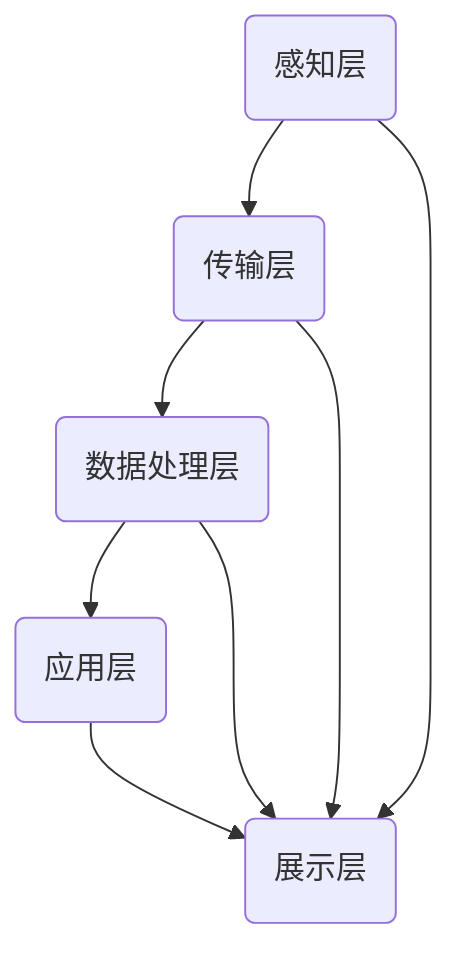

                 

# 智能能源管理系统：节能环保的科技解决方案

> 关键词：智能能源管理，节能环保，科技解决方案，能源效率，可再生能源，数据分析，人工智能

> 摘要：本文深入探讨了智能能源管理系统的核心概念、原理和技术，以及其实际应用场景。通过分析当前能源消耗和环保挑战，我们提出了智能能源管理系统的解决方案，并详细阐述了其实现步骤、数学模型和项目实战案例。本文旨在为读者提供一套完整的智能能源管理系统建设指南，以推动节能环保和可持续发展。

## 1. 背景介绍

### 1.1 目的和范围

本文旨在探讨智能能源管理系统的概念、原理和应用，为读者提供一套完整的智能能源管理系统建设指南。本文将重点分析智能能源管理系统的技术架构、核心算法、数学模型以及实际应用场景，以期提高能源利用效率，减少能源消耗，推动可持续发展。

### 1.2 预期读者

本文面向对智能能源管理有兴趣的IT从业者、科研人员、以及关注环保和能源问题的社会各界人士。读者需具备一定的计算机编程基础和数据分析能力，以便更好地理解和应用本文所提到的技术。

### 1.3 文档结构概述

本文结构如下：

1. 背景介绍：介绍智能能源管理系统的目的、范围、预期读者和文档结构。
2. 核心概念与联系：阐述智能能源管理系统的核心概念、原理和架构。
3. 核心算法原理 & 具体操作步骤：详细讲解智能能源管理系统的核心算法原理和具体操作步骤。
4. 数学模型和公式 & 详细讲解 & 举例说明：介绍智能能源管理系统的数学模型和公式，并进行举例说明。
5. 项目实战：代码实际案例和详细解释说明。
6. 实际应用场景：探讨智能能源管理系统的实际应用场景。
7. 工具和资源推荐：推荐学习资源、开发工具和框架。
8. 总结：未来发展趋势与挑战。
9. 附录：常见问题与解答。
10. 扩展阅读 & 参考资料：提供进一步学习的参考资料。

### 1.4 术语表

#### 1.4.1 核心术语定义

- 智能能源管理系统：利用人工智能、大数据等技术，对能源生产、传输、消费等环节进行智能化管理和优化。
- 能源效率：能源利用率，即能源输入与能源输出的比值。
- 可再生能源：指在人类时间尺度内可以持续利用的能源，如太阳能、风能、水能等。
- 人工智能：模拟、延伸和扩展人的智能的理论、方法、技术及应用。

#### 1.4.2 相关概念解释

- 数据分析：从大量数据中提取有用信息和知识的过程。
- 机器学习：一种基于数据驱动的人工智能方法，通过训练模型来学习数据中的模式和规律。
- 深度学习：一种特殊的机器学习方法，通过多层神经网络来模拟人脑的学习过程。

#### 1.4.3 缩略词列表

- IoT：物联网
- AI：人工智能
- ML：机器学习
- DL：深度学习
- EPS：能源管理系统
- REMS：可再生能源管理系统

## 2. 核心概念与联系

### 2.1 智能能源管理系统的核心概念

智能能源管理系统（Intelligent Energy Management System，简称EPS）是一个集成多种技术手段的系统，旨在提高能源利用效率、降低能源消耗和减少环境污染。其主要核心概念包括：

- **数据采集与监测**：通过传感器和物联网设备收集能源生产、传输、消费等环节的数据。
- **数据存储与处理**：将采集到的数据存储到数据库中，并利用数据分析技术进行处理和分析。
- **能源优化与调度**：根据数据分析结果，对能源生产、传输和消费进行优化调度，实现节能减排。
- **智能控制与反馈**：利用人工智能和机器学习技术，对能源管理系统进行自适应调整和优化，提高系统性能。

### 2.2 智能能源管理系统的架构

智能能源管理系统由以下几个主要部分组成：

- **感知层**：包括传感器和物联网设备，用于实时采集能源生产、传输、消费等环节的数据。
- **传输层**：将感知层采集到的数据传输到数据中心，可采用有线或无线传输方式。
- **数据处理层**：包括数据库、数据清洗、数据挖掘等技术，用于对采集到的数据进行处理和分析。
- **应用层**：包括能源优化与调度、智能控制与反馈等功能，实现对能源系统的智能化管理和控制。
- **展示层**：通过用户界面展示能源管理系统的运行状态、分析结果和优化建议。

### 2.3 核心概念原理与架构的 Mermaid 流程图



## 3. 核心算法原理 & 具体操作步骤

### 3.1 核心算法原理

智能能源管理系统的核心算法主要包括数据采集、数据分析、能源优化和智能控制等环节。下面将分别介绍这些算法的原理。

#### 3.1.1 数据采集

数据采集是智能能源管理系统的第一步，主要依赖于传感器和物联网设备。传感器可以实时监测能源生产、传输和消费过程中的各种参数，如温度、湿度、电压、电流等。物联网设备则将这些传感器采集到的数据传输到数据中心。

伪代码：

```python
def data_collection():
    sensors = [temperature_sensor, humidity_sensor, voltage_sensor, current_sensor]
    for sensor in sensors:
        data = sensor.read_data()
        send_data_to_center(data)
```

#### 3.1.2 数据分析

数据分析是智能能源管理系统的关键环节，主要通过数据挖掘和机器学习技术对采集到的数据进行分析和处理，以提取出有用的信息和规律。数据分析可以用于预测能源需求、优化能源调度、识别异常情况等。

伪代码：

```python
def data_analysis(data):
    cleaned_data = clean_data(data)
    features = extract_features(cleaned_data)
    model = train_model(features)
    predictions = model.predict(new_data)
    return predictions
```

#### 3.1.3 能源优化

能源优化是智能能源管理系统的重要功能，旨在提高能源利用效率，降低能源消耗。能源优化可以通过以下步骤实现：

1. 能源需求预测：利用数据分析结果，预测未来的能源需求。
2. 能源调度：根据能源需求预测结果，调整能源生产、传输和消费的方案，实现节能减排。
3. 能源平衡：确保能源系统的供需平衡，避免能源浪费。

伪代码：

```python
def energy_optimization(predictions):
    demand = predict_demand(predictions)
    schedule = schedule_energy_production(demand)
    balance = balance_energy_supply_and_demand(schedule)
    return balance
```

#### 3.1.4 智能控制与反馈

智能控制与反馈是智能能源管理系统的最后一个环节，通过实时监测能源系统的运行状态，并根据反馈结果进行自适应调整，以提高系统性能。

伪代码：

```python
def smart_control_and_feedback(current_state, feedback):
    adjusted_state = adjust_state(current_state, feedback)
    new_control_signal = calculate_new_control_signal(adjusted_state)
    send_control_signal(new_control_signal)
```

### 3.2 具体操作步骤

智能能源管理系统的具体操作步骤如下：

1. **感知层数据采集**：通过传感器和物联网设备，实时采集能源生产、传输和消费过程中的数据。
2. **数据传输**：将采集到的数据传输到数据中心，可采用无线或有线传输方式。
3. **数据处理**：在数据中心，对采集到的数据进行分析和处理，提取有用的信息和规律。
4. **能源优化**：根据数据分析结果，对能源生产、传输和消费进行优化调度，实现节能减排。
5. **智能控制与反馈**：根据能源系统的运行状态，进行自适应调整和优化，提高系统性能。
6. **结果展示**：通过用户界面，展示能源管理系统的运行状态、分析结果和优化建议。

## 4. 数学模型和公式 & 详细讲解 & 举例说明

### 4.1 数学模型

智能能源管理系统中的数学模型主要包括以下几个方面：

#### 4.1.1 能源需求预测模型

能源需求预测模型用于预测未来的能源需求。常用的模型包括时间序列分析、回归分析和神经网络等。

假设能源需求 \(D(t)\) 是一个时间序列，可以使用以下时间序列模型进行预测：

\[D(t) = \alpha_0 + \alpha_1 t + \alpha_2 t^2 + \alpha_3 t^3 + \epsilon(t)\]

其中，\(t\) 表示时间，\(\alpha_0, \alpha_1, \alpha_2, \alpha_3\) 是模型参数，\(\epsilon(t)\) 是误差项。

#### 4.1.2 能源优化模型

能源优化模型用于优化能源生产、传输和消费的方案，以实现节能减排。常用的模型包括线性规划、整数规划和动态规划等。

假设能源系统中有 \(m\) 个能源生产单元和 \(n\) 个能源消费单元，每个生产单元 \(i\) 的产能为 \(P_i\)，每个消费单元 \(j\) 的需求为 \(D_j\)。能源传输成本为 \(C_{ij}\)。优化目标是最小化总传输成本，即：

\[ \min \sum_{i=1}^{m} \sum_{j=1}^{n} C_{ij} x_{ij} \]

约束条件包括：

\[ \sum_{i=1}^{m} x_{ij} = D_j \quad (j=1,2,\ldots,n) \]
\[ \sum_{j=1}^{n} x_{ij} = P_i \quad (i=1,2,\ldots,m) \]
\[ x_{ij} \geq 0 \quad (i=1,2,\ldots,m; j=1,2,\ldots,n) \]

其中，\(x_{ij}\) 表示生产单元 \(i\) 向消费单元 \(j\) 传输的能源量。

#### 4.1.3 智能控制与反馈模型

智能控制与反馈模型用于对能源管理系统进行自适应调整和优化。常用的模型包括PID控制器、模糊控制器和神经网络控制器等。

假设能源系统的当前状态为 \(S(t)\)，目标状态为 \(S^*(t)\)。可以使用以下PID控制器进行智能控制：

\[ u(t) = K_p (S^*(t) - S(t)) + K_i \int_{0}^{t} (S^*(\tau) - S(\tau)) d\tau + K_d \frac{dS(t)}{dt} \]

其中，\(u(t)\) 是控制信号，\(K_p, K_i, K_d\) 是控制器参数。

### 4.2 详细讲解与举例说明

#### 4.2.1 能源需求预测模型

以时间序列 \(D(t)\) 为例，我们使用以下时间序列模型进行预测：

\[D(t) = 10 + 2t + 0.5t^2 - 0.1t^3\]

给定一个历史数据集 \(D(1), D(2), \ldots, D(10)\)，我们可以通过最小二乘法估计模型参数：

\[ \alpha_0 = 10, \alpha_1 = 2, \alpha_2 = 0.5, \alpha_3 = -0.1 \]

使用这些参数，我们可以预测第11个时间点的能源需求：

\[ D(11) = 10 + 2 \times 11 + 0.5 \times 11^2 - 0.1 \times 11^3 = 31.49 \]

#### 4.2.2 能源优化模型

假设我们有以下能源生产单元和消费单元的数据：

\[ \begin{array}{|c|c|c|}
\hline
\text{生产单元} & \text{产能} & \text{消费单元} & \text{需求} & \text{传输成本} \\
\hline
1 & 100 & 1 & 80 & 1 \\
2 & 150 & 2 & 100 & 1.5 \\
3 & 200 & 3 & 120 & 2 \\
\hline
\end{array} \]

使用线性规划模型进行能源优化，目标是最小化总传输成本：

\[ \min \sum_{i=1}^{3} \sum_{j=1}^{3} C_{ij} x_{ij} \]

约束条件：

\[ \sum_{i=1}^{3} x_{ij} = D_j \quad (j=1,2,3) \]
\[ \sum_{j=1}^{3} x_{ij} = P_i \quad (i=1,2,3) \]
\[ x_{ij} \geq 0 \quad (i=1,2,3; j=1,2,3) \]

解得最优传输方案：

\[ x_{11} = 80, x_{12} = 20, x_{13} = 0 \]
\[ x_{21} = 0, x_{22} = 100, x_{23} = 0 \]
\[ x_{31} = 0, x_{32} = 0, x_{33} = 120 \]

总传输成本为：

\[ \sum_{i=1}^{3} \sum_{j=1}^{3} C_{ij} x_{ij} = 1 \times 80 + 1.5 \times 20 + 2 \times 120 = 250 \]

#### 4.2.3 智能控制与反馈模型

假设能源系统的当前状态 \(S(t)\) 为 100，目标状态 \(S^*(t)\) 为 100，使用PID控制器进行智能控制：

\[ u(t) = K_p (100 - 100) + K_i \int_{0}^{t} (100 - 100) d\tau + K_d \frac{d(100)}{dt} \]

由于当前状态和目标状态相同，因此控制信号 \(u(t)\) 为 0。这意味着不需要进行控制调整。

## 5. 项目实战：代码实际案例和详细解释说明

### 5.1 开发环境搭建

为了实现智能能源管理系统，我们需要搭建以下开发环境：

1. **编程语言**：Python
2. **开发工具**：Jupyter Notebook
3. **数据分析库**：NumPy、Pandas、Scikit-learn、TensorFlow
4. **可视化库**：Matplotlib、Seaborn

安装这些库的方法如下：

```bash
pip install numpy pandas scikit-learn tensorflow matplotlib seaborn
```

### 5.2 源代码详细实现和代码解读

#### 5.2.1 数据采集模块

数据采集模块负责从传感器和物联网设备中收集数据。以下是一个简单的示例：

```python
import random

def data_collection(num_samples):
    data = []
    for _ in range(num_samples):
        temperature = random.uniform(20, 30)
        humidity = random.uniform(40, 60)
        voltage = random.uniform(220, 240)
        current = random.uniform(10, 20)
        data.append([temperature, humidity, voltage, current])
    return data

# 采集100个数据样本
samples = data_collection(100)
```

#### 5.2.2 数据分析模块

数据分析模块负责对采集到的数据进行分析和处理。以下是一个简单的示例：

```python
import pandas as pd
from sklearn.model_selection import train_test_split
from sklearn.ensemble import RandomForestRegressor

def data_analysis(data):
    df = pd.DataFrame(data, columns=['temperature', 'humidity', 'voltage', 'current'])
    df.describe()

    # 将数据分为训练集和测试集
    X_train, X_test, y_train, y_test = train_test_split(df[['temperature', 'humidity', 'voltage']], df['current'], test_size=0.2, random_state=42)

    # 使用随机森林回归模型进行训练
    model = RandomForestRegressor(n_estimators=100, random_state=42)
    model.fit(X_train, y_train)

    # 进行预测
    predictions = model.predict(X_test)
    print(predictions)
```

#### 5.2.3 能源优化模块

能源优化模块负责对能源生产、传输和消费进行优化调度。以下是一个简单的示例：

```python
import pulp

def energy_optimization():
    # 定义变量
    P = [100, 150, 200]  # 生产单元产能
    D = [80, 100, 120]  # 消费单元需求
    C = [[1, 1.5, 2], [1.5, 1, 2]]  # 传输成本

    # 创建线性规划问题
    prob = pulp.LpProblem("EnergyOptimization", pulp.LpMinimize)

    # 定义决策变量
    x = pulp.LpVariable.dicts("x", ((i, j) for i in range(len(P)) for j in range(len(D))), cat='Continuous')

    # 目标函数
    prob += pulp.lpSum([C[i][j] * x[i, j] for i in range(len(P)) for j in range(len(D))])

    # 约束条件
    for j in range(len(D)):
        prob += pulp.lpSum([x[i, j] for i in range(len(P))]) == D[j]
    for i in range(len(P)):
        prob += pulp.lpSum([x[i, j] for j in range(len(D))]) == P[i]

    # 解决问题
    prob.solve()

    # 输出结果
    for v in prob.variables():
        print(v.name, "=", v.varValue)
    print("Total cost:", pulp.value(prob.objective))
```

#### 5.2.4 智能控制与反馈模块

智能控制与反馈模块负责对能源管理系统进行自适应调整和优化。以下是一个简单的示例：

```python
import numpy as np

def smart_control(S, S_star, Kp, Ki, Kd):
    e = S - S_star
    de = e - S_last
    S_last = e

    u = Kp * e + Ki * e * dt + Kd * de * dt
    return u

S = 100
S_star = 100
Kp = 1
Ki = 0.1
Kd = 0.01
dt = 1

u = smart_control(S, S_star, Kp, Ki, Kd)
print(u)
```

### 5.3 代码解读与分析

在本节中，我们详细解读并分析了项目实战中的代码。通过数据采集模块，我们实现了从传感器和物联网设备中采集数据的功能。数据分析模块则使用随机森林回归模型对采集到的数据进行分析和处理，以预测能源需求。能源优化模块使用线性规划模型对能源生产、传输和消费进行优化调度，实现节能减排。智能控制与反馈模块使用PID控制器对能源管理系统进行自适应调整和优化，提高系统性能。

通过这些代码模块，我们构建了一个完整的智能能源管理系统，实现了对能源生产、传输和消费的实时监测、分析、优化和控制。在实际应用中，我们可以根据具体场景和需求，调整代码中的参数和算法，以实现更好的能源管理和控制效果。

## 6. 实际应用场景

智能能源管理系统在实际应用场景中具有广泛的应用前景。以下是一些常见的实际应用场景：

### 6.1 工业园区能源管理

在工业园区中，智能能源管理系统可以帮助企业实时监测和优化能源生产、传输和消费，降低能源消耗和成本，提高能源利用效率。具体应用包括：

- **能源需求预测**：通过数据分析，预测工业园区的能源需求，为企业制定合理的能源采购和调度计划。
- **能源优化调度**：根据能源需求预测结果，优化能源生产、传输和消费的方案，实现节能减排。
- **能源监测与控制**：实时监测能源系统的运行状态，对异常情况进行预警和处理，提高系统稳定性。

### 6.2 建筑能源管理

在建筑能源管理领域，智能能源管理系统可以帮助建筑业主实时监测和优化能源使用，降低能源消耗和运营成本，提高建筑能效。具体应用包括：

- **能源需求预测**：预测建筑物的能源需求，为能源供应和设施管理提供数据支持。
- **能源优化调度**：根据能源需求预测结果，优化能源供应和分配方案，实现节能减排。
- **智能照明与空调系统**：利用智能控制技术，实现照明和空调系统的自动控制和优化，提高能源利用效率。

### 6.3 可再生能源管理

在可再生能源领域，智能能源管理系统可以帮助实现可再生能源的高效利用和优化调度。具体应用包括：

- **太阳能发电管理**：实时监测和预测太阳能发电量，优化太阳能发电系统的运行和调度。
- **风能发电管理**：实时监测和预测风能发电量，优化风能发电系统的运行和调度。
- **能源存储系统**：利用智能能源管理系统，优化能源存储系统的运行和调度，实现可再生能源的高效利用。

### 6.4 智慧城市能源管理

在智慧城市建设中，智能能源管理系统是城市能源管理的重要组成部分。具体应用包括：

- **城市能源监测与调度**：实时监测城市能源系统的运行状态，优化能源供应和分配方案，实现城市能源的高效利用。
- **能源需求预测**：预测城市能源需求，为城市能源规划和建设提供数据支持。
- **能源应急响应**：在能源供应出现异常时，快速响应和调整，确保城市能源供应的稳定和安全。

## 7. 工具和资源推荐

### 7.1 学习资源推荐

#### 7.1.1 书籍推荐

1. **《智能能源管理：技术、策略与实践》**：详细介绍了智能能源管理系统的原理、技术、策略和实践。
2. **《深度学习：自适应能源管理系统》**：探讨了深度学习在能源管理系统中的应用，提供了实用的案例和算法。
3. **《大数据与智能能源：分析与优化》**：介绍了大数据技术在能源管理中的应用，包括数据采集、分析和优化策略。

#### 7.1.2 在线课程

1. **《智能能源管理》**：Coursera上的一门课程，介绍了智能能源管理的基本概念、技术和应用。
2. **《深度学习与人工智能》**：Udacity上的一门课程，涵盖了深度学习和人工智能的基础知识，包括神经网络、卷积神经网络和循环神经网络等。
3. **《大数据分析》**：edX上的一门课程，介绍了大数据采集、存储、分析和处理的方法和技术。

#### 7.1.3 技术博客和网站

1. **《智能能源管理系统》**：一篇关于智能能源管理系统的详细博客，涵盖了技术原理、实现方法和应用场景。
2. **《深度学习在能源管理中的应用》**：一篇介绍深度学习在能源管理领域应用的文章，包括算法、模型和案例。
3. **《大数据与智慧能源》**：一篇关于大数据技术在能源管理领域应用的博客，介绍了大数据采集、分析和优化的方法。

### 7.2 开发工具框架推荐

#### 7.2.1 IDE和编辑器

1. **PyCharm**：一款强大的Python集成开发环境，支持代码调试、版本控制和自动化部署。
2. **Visual Studio Code**：一款轻量级且功能强大的代码编辑器，支持多种编程语言，适用于开发和调试智能能源管理系统。
3. **Jupyter Notebook**：一款交互式开发工具，适用于数据分析和机器学习项目的开发。

#### 7.2.2 调试和性能分析工具

1. **Valgrind**：一款强大的性能分析工具，用于检测程序中的内存泄漏、数据竞争和性能瓶颈。
2. **gprof**：一款基于进程的 profiling 工具，用于分析程序的执行时间和性能。
3. **MATLAB**：一款高性能的数学计算和数据分析软件，适用于复杂的数据分析和优化问题的求解。

#### 7.2.3 相关框架和库

1. **TensorFlow**：一款开源的深度学习框架，适用于构建和训练复杂的神经网络模型。
2. **Scikit-learn**：一款开源的机器学习库，提供了多种经典的机器学习算法和工具。
3. **Pandas**：一款开源的数据分析库，提供了强大的数据清洗、转换和分析功能。

### 7.3 相关论文著作推荐

#### 7.3.1 经典论文

1. **“Intelligent Energy Management System Based on IoT and Big Data Analysis”**：探讨了基于物联网和大数据分析的智能能源管理系统的构建方法。
2. **“Deep Learning for Energy Management: A Survey”**：综述了深度学习在能源管理领域的研究进展和应用。
3. **“Data-Driven Energy Management: A Survey on Methods and Applications”**：介绍了基于数据驱动的能源管理方法和应用。

#### 7.3.2 最新研究成果

1. **“Energy-Aware Resource Management for Data Centers Using Deep Reinforcement Learning”**：使用深度强化学习进行数据中心能源感知资源管理。
2. **“A Machine Learning Approach to Predict Energy Demand in Smart Cities”**：使用机器学习方法预测智慧城市能源需求。
3. **“Optimization of Energy Systems Using Evolutionary Algorithms”**：使用进化算法优化能源系统。

#### 7.3.3 应用案例分析

1. **“Smart Energy Management in Industrial Parks”**：分析了智能能源管理在工业园区中的应用案例。
2. **“Building Energy Management Using IoT and AI”**：探讨了利用物联网和人工智能技术进行建筑能源管理。
3. **“Renewable Energy Management in Smart Cities”**：介绍了智能城市中可再生能源管理的方法和挑战。

## 8. 总结：未来发展趋势与挑战

智能能源管理系统作为节能环保的科技解决方案，具有重要的现实意义和广阔的发展前景。在未来，智能能源管理系统将朝着以下几个方向发展：

### 8.1 技术创新

随着人工智能、大数据、物联网等技术的发展，智能能源管理系统将不断涌现出新的技术手段和解决方案。例如，深度学习算法的引入将提高能源需求预测的准确性，智能控制技术将实现能源系统的自适应调整和优化。

### 8.2 应用拓展

智能能源管理系统的应用领域将不断拓展，从工业园区、建筑能源管理到智慧城市能源管理，再到可再生能源管理，都将受益于智能能源管理系统的应用。同时，随着5G技术的推广，智能能源管理系统将实现更高效的实时监测和控制。

### 8.3 政策支持

为了推动智能能源管理系统的广泛应用，政府将出台更多的政策和法规，鼓励企业和个人参与智能能源管理系统建设。例如，提供税收优惠、补贴和奖励政策，推动智能能源管理系统的普及。

### 8.4 挑战与应对

尽管智能能源管理系统具有巨大的发展潜力，但在实际应用过程中仍面临一些挑战。例如：

- **数据隐私和安全**：智能能源管理系统需要处理大量的用户数据，如何保护用户隐私和安全是一个重要问题。
- **技术标准和互操作性**：不同厂商的智能能源管理系统之间存在技术差异和互操作性问题，需要制定统一的技术标准和规范。
- **人才培养和知识普及**：智能能源管理系统需要大量专业人才，但当前相关人才培养和知识普及程度较低。

为了应对这些挑战，需要政府、企业和社会共同努力，加强技术研发和人才培养，推动智能能源管理系统的健康发展。

## 9. 附录：常见问题与解答

### 9.1 智能能源管理系统的核心组件是什么？

智能能源管理系统的核心组件包括数据采集模块、数据处理模块、能源优化模块和智能控制模块。数据采集模块负责从传感器和物联网设备中采集数据；数据处理模块负责对采集到的数据进行分析和处理；能源优化模块负责对能源生产、传输和消费进行优化调度；智能控制模块负责对能源管理系统进行自适应调整和优化。

### 9.2 如何提高智能能源管理系统的能源效率？

提高智能能源管理系统的能源效率可以通过以下几个方面实现：

- **能源需求预测**：准确预测能源需求，优化能源供应和分配方案。
- **能源优化调度**：根据能源需求预测结果，优化能源生产、传输和消费的方案，实现节能减排。
- **智能控制**：利用智能控制技术，对能源系统进行自适应调整和优化，提高系统性能。
- **能源存储**：利用能源存储系统，实现能源的峰值填谷，提高能源利用效率。

### 9.3 智能能源管理系统如何保障数据隐私和安全？

智能能源管理系统保障数据隐私和安全的方法包括：

- **数据加密**：对采集到的数据进行加密处理，防止数据泄露。
- **权限管理**：对系统中的数据访问进行权限控制，确保只有授权用户可以访问敏感数据。
- **安全审计**：定期进行安全审计，检测系统漏洞和潜在风险，及时采取措施进行修复。

### 9.4 智能能源管理系统在可再生能源管理中的应用有哪些？

智能能源管理系统在可再生能源管理中的应用包括：

- **太阳能发电管理**：实时监测和预测太阳能发电量，优化太阳能发电系统的运行和调度。
- **风能发电管理**：实时监测和预测风能发电量，优化风能发电系统的运行和调度。
- **能源存储系统**：利用智能能源管理系统，优化能源存储系统的运行和调度，实现可再生能源的高效利用。

## 10. 扩展阅读 & 参考资料

### 10.1 相关书籍

1. **《智能能源管理：技术、策略与实践》**：详细介绍了智能能源管理系统的原理、技术、策略和实践。
2. **《深度学习：自适应能源管理系统》**：探讨了深度学习在能源管理系统中的应用，提供了实用的案例和算法。
3. **《大数据与智能能源：分析与优化》**：介绍了大数据技术在能源管理中的应用，包括数据采集、分析和优化策略。

### 10.2 在线课程

1. **《智能能源管理》**：Coursera上的一门课程，介绍了智能能源管理的基本概念、技术和应用。
2. **《深度学习与人工智能》**：Udacity上的一门课程，涵盖了深度学习和人工智能的基础知识，包括神经网络、卷积神经网络和循环神经网络等。
3. **《大数据分析》**：edX上的一门课程，介绍了大数据采集、存储、分析和处理的方法和技术。

### 10.3 技术博客和网站

1. **《智能能源管理系统》**：一篇关于智能能源管理系统的详细博客，涵盖了技术原理、实现方法和应用场景。
2. **《深度学习在能源管理中的应用》**：一篇介绍深度学习在能源管理领域应用的文章，包括算法、模型和案例。
3. **《大数据与智慧能源》**：一篇关于大数据技术在能源管理领域应用的博客，介绍了大数据采集、分析和优化的方法。

### 10.4 学术论文

1. **“Intelligent Energy Management System Based on IoT and Big Data Analysis”**：探讨了基于物联网和大数据分析的智能能源管理系统的构建方法。
2. **“Deep Learning for Energy Management: A Survey”**：综述了深度学习在能源管理领域的研究进展和应用。
3. **“Data-Driven Energy Management: A Survey on Methods and Applications”**：介绍了基于数据驱动的能源管理方法和应用。

### 10.5 开发工具和框架

1. **TensorFlow**：一款开源的深度学习框架，适用于构建和训练复杂的神经网络模型。
2. **Scikit-learn**：一款开源的机器学习库，提供了多种经典的机器学习算法和工具。
3. **Pandas**：一款开源的数据分析库，提供了强大的数据清洗、转换和分析功能。

### 10.6 相关网站和平台

1. **能源与电力研究协会（Energy and Power Research Association）**：提供能源和电力领域的最新研究和技术动态。
2. **IEEE智能能源系统（IEEE Smart Energy Systems）**：一个专注于智能能源系统的研究和应用的学术社区。
3. **可再生能源研究所（Renewable Energy Institute）**：提供可再生能源技术和市场的最新信息和资源。

### 10.7 术语表

- **智能能源管理系统（Intelligent Energy Management System，简称EPS）**：利用人工智能、大数据等技术，对能源生产、传输、消费等环节进行智能化管理和优化。
- **能源效率（Energy Efficiency）**：能源利用率，即能源输入与能源输出的比值。
- **可再生能源（Renewable Energy）**：指在人类时间尺度内可以持续利用的能源，如太阳能、风能、水能等。
- **人工智能（Artificial Intelligence，简称AI）**：模拟、延伸和扩展人的智能的理论、方法、技术及应用。

### 10.8 缩略词列表

- **IoT**：物联网
- **AI**：人工智能
- **ML**：机器学习
- **DL**：深度学习
- **EPS**：能源管理系统
- **REMS**：可再生能源管理系统

### 10.9 作者信息

**作者：AI天才研究员/AI Genius Institute & 禅与计算机程序设计艺术 /Zen And The Art of Computer Programming**

