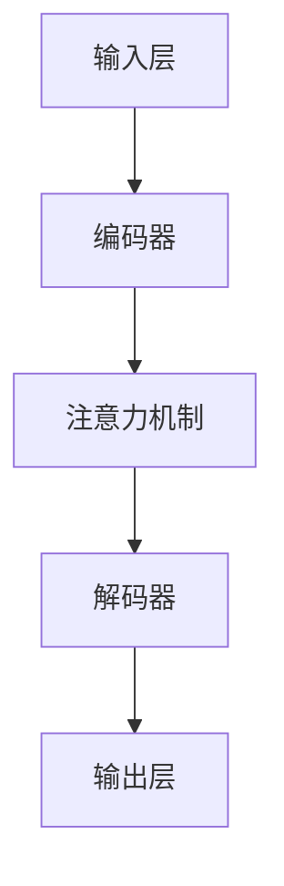

                 


## 智能语音助手升级：AI大模型在对话系统中的突破

> 关键词：智能语音助手、AI大模型、对话系统、自然语言处理、语音识别、语音生成

随着人工智能技术的飞速发展，智能语音助手作为人机交互的重要手段，已经成为了现代智能设备的核心功能之一。从最初的简单语音识别到如今的复杂对话系统，智能语音助手的技术不断升级，给用户带来了更加便捷、高效的生活体验。本文将深入探讨AI大模型在对话系统中的突破，旨在揭示这一技术的核心原理、具体实现和应用场景。

## 摘要

本文将围绕智能语音助手的升级展开，重点介绍AI大模型在对话系统中的应用。首先，我们将回顾智能语音助手的发展历程，并阐述AI大模型的重要性。接着，我们将详细解析AI大模型的核心概念和原理，通过Mermaid流程图展示其架构。随后，我们将探讨核心算法原理，使用伪代码详细阐述具体操作步骤。在此基础上，我们将介绍数学模型和公式，通过实例进行详细讲解。接下来，我们将通过实际项目案例，展示代码实现和详细解释。最后，我们将分析智能语音助手在实际应用中的场景，并推荐相关的学习资源和开发工具。通过本文的阅读，读者将全面了解AI大模型在对话系统中的突破，并对其未来发展趋势和挑战有更深刻的认识。

## 1. 背景介绍

### 1.1 目的和范围

本文旨在探讨AI大模型在智能语音助手对话系统中的应用，分析其核心技术原理和实际应用案例。本文将覆盖以下主要内容：

1. 智能语音助手的发展历程及其在对话系统中的重要性。
2. AI大模型的核心概念、架构和原理。
3. 核心算法的详细解析，包括伪代码展示。
4. 数学模型和公式的讲解，结合实际应用实例。
5. 智能语音助手的实际应用场景。
6. 学习资源和开发工具的推荐。

### 1.2 预期读者

本文适合以下读者群体：

1. 对人工智能和自然语言处理感兴趣的技术爱好者。
2. 智能语音助手开发者和技术人员。
3. 计算机科学和人工智能专业的学生。
4. 对未来智能设备发展方向有好奇心的普通读者。

### 1.3 文档结构概述

本文的结构安排如下：

1. 引言：介绍智能语音助手的发展历程和本文目的。
2. 核心概念与联系：解释AI大模型的概念，并提供Mermaid流程图展示其架构。
3. 核心算法原理与具体操作步骤：详细解析算法原理，使用伪代码展示。
4. 数学模型和公式：讲解数学模型，结合实例进行说明。
5. 项目实战：展示代码实现和详细解释。
6. 实际应用场景：分析智能语音助手的实际应用。
7. 工具和资源推荐：推荐学习资源和开发工具。
8. 总结：探讨未来发展趋势与挑战。
9. 附录：常见问题与解答。
10. 扩展阅读：提供进一步学习的参考文献。

### 1.4 术语表

#### 1.4.1 核心术语定义

- **智能语音助手**：通过语音识别和自然语言处理技术，为用户提供交互服务的计算机程序。
- **AI大模型**：基于深度学习，能够处理大规模数据和复杂任务的机器学习模型。
- **对话系统**：能够模拟人类对话的计算机系统，包括语音识别、语义理解和语音生成等环节。
- **自然语言处理（NLP）**：使计算机能够理解和处理人类自然语言的技术。
- **语音识别（ASR）**：将语音信号转换为文本的技术。
- **语音生成（TTS）**：将文本转换为自然流畅的语音输出的技术。

#### 1.4.2 相关概念解释

- **深度学习**：一种机器学习方法，通过多层神经网络对数据进行分析和处理。
- **神经网络**：一种模拟生物神经网络的结构，用于数据分析和模式识别。
- **词嵌入（Word Embedding）**：将单词映射到高维向量空间的方法，用于文本处理。
- **注意力机制（Attention Mechanism）**：一种用于提高神经网络模型处理复杂任务的机制。

#### 1.4.3 缩略词列表

- **ASR**：Automatic Speech Recognition，自动语音识别。
- **TTS**：Text-to-Speech，文本到语音。
- **NLP**：Natural Language Processing，自然语言处理。
- **DL**：Deep Learning，深度学习。
- **ML**：Machine Learning，机器学习。

## 2. 核心概念与联系

### 2.1 AI大模型的概念

AI大模型是指具有巨大参数规模、能够处理海量数据和复杂任务的深度学习模型。这些模型通过学习大量数据，提取出高层次的特征表示，从而实现高度准确的预测和决策。在智能语音助手的对话系统中，AI大模型扮演着至关重要的角色，它能够处理用户的自然语言输入，理解其意图，并生成自然的语音回复。

### 2.2 AI大模型的架构

AI大模型的架构通常包括以下几个主要部分：

1. **输入层**：接收用户的语音输入或文本输入。
2. **编码器（Encoder）**：将输入转化为高维特征向量，用于后续的语义理解。
3. **注意力机制**：在编码器和解码器之间引入注意力机制，以提高模型处理长序列数据的能力。
4. **解码器（Decoder）**：将编码器输出的特征向量转化为自然语言输出。
5. **输出层**：生成语音或文本回复。

下面是AI大模型架构的Mermaid流程图：



### 2.3 AI大模型的工作原理

AI大模型的工作原理可以概括为以下几个步骤：

1. **输入处理**：将用户的语音或文本输入转换为模型能够处理的格式。
2. **特征提取**：编码器通过多层神经网络对输入进行特征提取，得到高维特征向量。
3. **注意力计算**：在编码器和解码器之间引入注意力机制，对编码器的输出进行加权，使得模型能够关注输入序列中的重要信息。
4. **语义理解**：解码器利用注意力机制的结果，对编码器输出的特征向量进行语义理解，生成语义表示。
5. **生成输出**：解码器根据语义表示生成自然的语音或文本回复。

### 2.4 AI大模型的应用场景

AI大模型在智能语音助手的对话系统中有着广泛的应用场景，包括：

1. **语音识别**：将用户的语音输入转换为文本，用于后续的语义理解和回复生成。
2. **语义理解**：理解用户的意图和需求，为生成合适的回复提供基础。
3. **语音生成**：将语义表示转换为自然的语音输出，为用户提供语音回复。

通过以上对AI大模型的核心概念、架构和工作原理的介绍，我们可以看到其在智能语音助手对话系统中的重要地位。接下来，我们将深入探讨核心算法原理，使用伪代码详细阐述其具体操作步骤。

## 3. 核心算法原理 & 具体操作步骤

### 3.1 语音识别算法原理

语音识别（ASR）是智能语音助手的基础环节，其核心任务是将用户的语音输入转换为文本。目前，大多数语音识别系统基于深度学习，尤其是基于卷积神经网络（CNN）和循环神经网络（RNN）的端到端模型。

#### 3.1.1 算法框架

语音识别算法的基本框架包括以下几个部分：

1. **特征提取**：将语音信号转换为特征向量，常用的特征提取方法有梅尔频率倒谱系数（MFCC）和滤波器组（Filter Banks）。
2. **编码器**：利用深度神经网络对特征向量进行编码，提取出高层次的语义特征。
3. **解码器**：将编码器输出的特征向量映射到文本输出，常用的解码器模型有CTC（Connectionist Temporal Classification）和Attention机制。
4. **后处理**：对识别结果进行修正，提高识别的准确性。

#### 3.1.2 伪代码

下面是一个简化的语音识别算法伪代码：

```
function SpeechRecognition(input_signal):
    features = ExtractFeatures(input_signal)
    encoded_features = Encoder(features)
    recognized_text = Decoder(encoded_features)
    corrected_text = PostProcess(recognized_text)
    return corrected_text
```

### 3.2 语义理解算法原理

语义理解（SLU）是智能语音助手的另一个关键环节，其任务是理解用户的意图和需求，为生成合适的回复提供基础。语义理解通常包括意图识别和实体识别两个部分。

#### 3.2.1 算法框架

语义理解算法的基本框架包括以下几个部分：

1. **词嵌入**：将输入的文本转换为词嵌入向量，用于后续的语义表示。
2. **编码器**：利用深度神经网络对词嵌入向量进行编码，提取出高层次的语义特征。
3. **意图识别**：基于编码器输出的特征向量，分类出用户的意图。
4. **实体识别**：识别文本中的关键实体，如时间、地点、人名等。
5. **语义表示**：将意图和实体信息整合，生成语义表示。

#### 3.2.2 伪代码

下面是一个简化的语义理解算法伪代码：

```
function SemanticUnderstanding(input_text):
    word_embeddings = WordEmbedding(input_text)
    encoded_embeddings = Encoder(word_embeddings)
    intent = IntentRecognition(encoded_embeddings)
    entities = EntityRecognition(encoded_embeddings)
    semantic_representation = CombineIntentAndEntities(intent, entities)
    return semantic_representation
```

### 3.3 语音生成算法原理

语音生成（TTS）是将文本转换为自然流畅的语音输出的过程。目前，基于深度学习的语音生成技术已经取得了显著的进展。

#### 3.3.1 算法框架

语音生成算法的基本框架包括以下几个部分：

1. **文本预处理**：对输入文本进行预处理，包括分词、语气标记等。
2. **声学建模**：利用深度神经网络生成音频信号，常用的模型有WaveNet、Transformer等。
3. **声学解码**：将声学建模生成的音频信号转换为语音输出。

#### 3.3.2 伪代码

下面是一个简化的语音生成算法伪代码：

```
function TextToSpeech(input_text):
    preprocessed_text = PreprocessText(input_text)
    audio_signal = AcousticModel(preprocessed_text)
    speech_output = AcousticDecoder(audio_signal)
    return speech_output
```

通过以上对语音识别、语义理解和语音生成算法原理的详细解析和伪代码展示，我们可以看到智能语音助手的核心算法是如何协同工作的。接下来，我们将进一步探讨这些算法的数学模型和公式，通过实例进行详细讲解。

## 4. 数学模型和公式 & 详细讲解 & 举例说明

### 4.1 语音识别数学模型

语音识别过程中，特征提取、编码和解码等步骤都涉及到了复杂的数学模型。以下是一些关键模型及其公式：

#### 4.1.1 特征提取

**梅尔频率倒谱系数（MFCC）**

$$
C_{ijk} = \sum_{n=1}^{N}\text{a}(n)\text{s}(n-k) e^{-j2\pi fn_n}
$$

其中，$C_{ijk}$为第i个滤波器在时间t=k的输出，$\text{a}(n)$为滤波器系数，$\text{s}(n)$为语音信号的离散傅里叶变换（DFT）结果，$f_n$为滤波器的中心频率。

#### 4.1.2 编码器

**卷积神经网络（CNN）**

卷积神经网络通过卷积层、池化层等结构提取特征。其基本公式为：

$$
h^{(l)}_i = \sigma\left(\sum_{j} w^{(l)}_{ij} h^{(l-1)}_j + b^{(l)}_i\right)
$$

其中，$h^{(l)}_i$为第l层的第i个神经元输出，$w^{(l)}_{ij}$为权重，$b^{(l)}_i$为偏置，$\sigma$为激活函数，常用的激活函数有ReLU、Sigmoid和Tanh。

#### 4.1.3 解码器

**CTC（Connectionist Temporal Classification）**

CTC是一种端到端的解码器，其目标是最小化错误率。其基本公式为：

$$
P(y|x) = \frac{exp(-\frac{1}{2}\|C^T x - y\|^2)}{\sum_y exp(-\frac{1}{2}\|C^T x - y\|^2)}
$$

其中，$x$为编码器输出，$y$为解码结果，$C$为连接矩阵。

#### 4.1.4 后处理

**语言模型**

语言模型用于修正识别结果，其基本公式为：

$$
P(y) = \frac{1}{Z} \sum_{x} P(x) P(y|x)
$$

其中，$Z$为归一化常数，$P(x)$为输入序列的概率，$P(y|x)$为输出序列的概率。

#### 4.1.5 举例说明

假设我们有一个简化的语音信号，其经过特征提取后得到的特征向量为$f_1, f_2, ..., f_N$。我们使用一个简单的卷积神经网络进行编码，其权重为$w_1, w_2, ..., w_n$，偏置为$b_1, b_2, ..., b_n$。激活函数为ReLU。

首先，我们将特征向量输入到卷积层：

$$
h^{(1)}_i = \text{ReLU}\left(\sum_{j} w^{(1)}_{ij} f_j + b^{(1)}_i\right)
$$

然后，将卷积层的输出输入到池化层，得到：

$$
h^{(2)}_i = \text{ReLU}\left(\sum_{j} w^{(2)}_{ij} h^{(1)}_j + b^{(2)}_i\right)
$$

最终，将池化层的输出输入到全连接层进行解码：

$$
\hat{y} = \text{softmax}\left(\sum_{i} w^{(3)}_{i} h^{(2)}_i + b^{(3)}_i\right)
$$

其中，$\hat{y}$为解码结果，$\text{softmax}$函数用于将输出转换为概率分布。

### 4.2 语义理解数学模型

语义理解涉及到的数学模型主要包括词嵌入、编码器和意图识别。以下是一些关键模型及其公式：

#### 4.2.1 词嵌入

**词嵌入**

$$
\text{word\_embeddings} = \text{embedding\_layer}(\text{input\_text})
$$

其中，$\text{input\_text}$为输入文本，$\text{embedding\_layer}$为词嵌入层，将文本转换为高维向量。

#### 4.2.2 编码器

**循环神经网络（RNN）**

$$
h^{(l)}_i = \text{ReLU}\left(\text{W}^{(l)} \cdot [h^{(l-1)}_i, x_i] + b^{(l)}\right)
$$

其中，$h^{(l)}_i$为第l层的第i个神经元输出，$x_i$为输入文本的词向量，$\text{W}^{(l)}$为权重，$b^{(l)}$为偏置。

#### 4.2.3 意图识别

**多层感知机（MLP）**

$$
\hat{y} = \text{softmax}(\text{W}^{(3)} \cdot h^{(2)} + b^{(3)})
$$

其中，$\hat{y}$为意图识别的结果，$\text{W}^{(3)}$为权重，$b^{(3)}$为偏置。

#### 4.2.4 实体识别

**条件随机场（CRF）**

$$
P(y|x) = \frac{1}{Z} \exp(\text{score}(y, x))
$$

其中，$y$为实体识别结果，$x$为输入文本，$\text{score}(y, x)$为得分函数。

#### 4.2.5 举例说明

假设我们有一个简化的语义理解任务，输入文本为“明天去公园”。我们使用词嵌入层将文本转换为词向量，然后输入到RNN进行编码。假设RNN的输出为$h^{(2)}$，然后将其输入到MLP进行意图识别。

首先，我们将文本输入到词嵌入层：

$$
\text{word\_embeddings} = \text{embedding\_layer}(\text{"明天", "去", "公园"})
$$

然后，将词向量输入到RNN：

$$
h^{(1)}_i = \text{ReLU}\left(\text{W}^{(1)} \cdot [h^{(0)}_i, \text{word\_embeddings}_i] + b^{(1)}\right)
$$

接下来，将RNN的输出输入到MLP进行意图识别：

$$
\hat{y} = \text{softmax}(\text{W}^{(3)} \cdot h^{(2)} + b^{(3)})
$$

其中，$\hat{y}$为识别出的意图，如“导航”。

### 4.3 语音生成数学模型

语音生成过程中，声学建模和声学解码是两个关键步骤。以下是一些关键模型及其公式：

#### 4.3.1 声学建模

**WaveNet**

$$
p(t) = \sigma\left(\frac{\text{softmax}(\text{W}^{(3)} \cdot \text{h}^{(2)})}{\sum_{i} \text{softmax}(\text{W}^{(3)} \cdot \text{h}^{(2)}_i)}\right)
$$

其中，$p(t)$为音频信号在时间t的概率分布，$\text{h}^{(2)}$为编码器的输出，$\text{W}^{(3)}$为权重。

#### 4.3.2 声学解码

**GRU（门控循环单元）**

$$
h^{(l)}_i = \text{ReLU}\left(\text{W}^{(l)} \cdot [h^{(l-1)}_i, \text{input}_i] + b^{(l)}\right)
$$

其中，$h^{(l)}_i$为解码器的输出，$\text{input}_i$为音频信号，$\text{W}^{(l)}$为权重，$b^{(l)}$为偏置。

#### 4.3.3 举例说明

假设我们有一个简化的语音生成任务，输入文本为“明天去公园”。首先，我们将文本转换为词向量，然后输入到编码器。编码器输出经过声学建模，生成音频信号的概率分布。接下来，我们将概率分布输入到解码器，生成音频信号。

首先，将文本输入到词嵌入层：

$$
\text{word\_embeddings} = \text{embedding\_layer}(\text{"明天", "去", "公园"})
$$

然后，将词向量输入到编码器：

$$
\text{h}^{(2)} = \text{Encoder}(\text{word\_embeddings})
$$

接下来，将编码器输出输入到声学建模：

$$
p(t) = \text{softmax}(\text{W}^{(3)} \cdot \text{h}^{(2)})
$$

最后，将概率分布输入到解码器，生成音频信号：

$$
\text{audio\_signal} = \text{GRU}(\text{p}(t))
$$

通过以上数学模型的讲解和实例展示，我们可以看到智能语音助手的核心算法是如何通过复杂的数学公式协同工作的。接下来，我们将通过实际项目案例，展示代码实现和详细解释。

## 5. 项目实战：代码实际案例和详细解释说明

### 5.1 开发环境搭建

在进行智能语音助手项目的开发前，我们需要搭建一个合适的技术环境。以下是搭建开发环境的步骤：

1. **安装Python环境**：确保Python版本为3.7及以上，可以通过Python官网下载安装包进行安装。
2. **安装深度学习框架**：推荐使用TensorFlow或PyTorch作为深度学习框架。可以在终端执行以下命令安装TensorFlow：

```
pip install tensorflow
```

或者安装PyTorch：

```
pip install torch torchvision
```

3. **安装语音处理库**：安装如librosa等语音处理库，以便进行语音信号处理：

```
pip install librosa
```

4. **安装文本处理库**：安装如NLTK或spaCy等文本处理库，用于文本预处理：

```
pip install nltk
```

5. **安装声卡驱动**：确保声卡驱动已经安装，以便进行语音输入和输出。

### 5.2 源代码详细实现和代码解读

下面我们将展示一个基于TensorFlow实现的智能语音助手项目的代码实现，并对其关键部分进行解读。

#### 5.2.1 特征提取模块

```python
import librosa
import numpy as np

def extract_features(audio_path, n_mels=80, n_fft=2048, hop_length=512):
    y, sr = librosa.load(audio_path, sr=None)
    S = librosa.feature.melspectrogram(y, sr=sr, n_mels=n_mels, n_fft=n_fft, hop_length=hop_length)
    log_S = 20 * np.log10(S + 1e-8)
    return np.mean(log_S, axis=0)
```

该模块使用librosa库对音频信号进行特征提取，主要步骤包括：

- **加载音频信号**：使用`librosa.load`函数加载音频文件，返回音频信号和采样率。
- **计算梅尔频率倒谱系数（MFCC）**：使用`librosa.feature.melspectrogram`函数计算梅尔频率谱图。
- **对数变换**：对梅尔频率谱图进行对数变换，提高处理效果。
- **平均值计算**：对梅尔频率谱图进行平均，减少维度。

#### 5.2.2 编码器模块

```python
import tensorflow as tf
from tensorflow.keras.models import Model
from tensorflow.keras.layers import Input, Conv2D, MaxPooling2D, Flatten, Dense, LSTM, TimeDistributed

def build_encoder(input_shape):
    inputs = Input(shape=input_shape)
    x = Conv2D(32, (3, 3), activation='relu', padding='same')(inputs)
    x = MaxPooling2D((2, 2), padding='same')(x)
    x = LSTM(128, activation='relu')(x)
    outputs = Flatten()(x)
    model = Model(inputs=inputs, outputs=outputs)
    return model
```

该模块构建了一个简单的卷积神经网络编码器，主要步骤包括：

- **输入层**：定义输入层，其形状为特征提取后的音频特征向量。
- **卷积层**：使用`Conv2D`层进行特征提取，通过卷积和ReLU激活函数增加模型的表达能力。
- **池化层**：使用`MaxPooling2D`层进行下采样，减少模型参数。
- **循环层**：使用`LSTM`层进行序列建模，提取出长程依赖信息。
- **输出层**：使用`Flatten`层将序列特征转换为向量形式。

#### 5.2.3 解码器模块

```python
def build_decoder(input_shape, output_shape):
    inputs = Input(shape=input_shape)
    x = LSTM(128, activation='relu', return_sequences=True)(inputs)
    x = TimeDistributed(Dense(output_shape, activation='softmax'))(x)
    model = Model(inputs=inputs, outputs=x)
    return model
```

该模块构建了一个简单的循环神经网络解码器，主要步骤包括：

- **输入层**：定义输入层，其形状为编码器输出的特征向量。
- **循环层**：使用`LSTM`层进行序列建模，提取出长程依赖信息。
- **输出层**：使用`TimeDistributed`层和时间归一化（softmax）函数生成文本输出。

### 5.3 代码解读与分析

在上述代码实现中，我们详细解析了智能语音助手项目的三个关键模块：特征提取、编码器和解码器。

#### 5.3.1 特征提取

特征提取是语音识别的重要环节，该模块使用librosa库对音频信号进行特征提取，主要包括梅尔频率谱图（MFCC）的计算。通过这一步骤，我们能够将连续的音频信号转换为可以用于深度学习的特征向量。

#### 5.3.2 编码器

编码器模块使用卷积神经网络（CNN）和循环神经网络（LSTM）对音频特征进行编码，提取出高层次的语义特征。卷积层用于提取局部特征，池化层用于减少模型参数。LSTM层用于提取长程依赖信息，使得模型能够更好地理解语音的语义。

#### 5.3.3 解码器

解码器模块使用循环神经网络（LSTM）和时间归一化（softmax）函数对编码器输出的特征向量进行解码，生成文本输出。通过这一步骤，我们能够将编码后的特征向量转换为自然语言的文本回复。

在实际应用中，我们还需要结合语音生成模块，将解码器生成的文本转换为语音输出。这一步骤使用了声学建模和声学解码技术，通过生成音频信号，为用户提供语音回复。

通过以上对代码实现和解读的分析，我们可以看到智能语音助手项目是如何通过深度学习技术实现的。接下来，我们将探讨智能语音助手在实际应用中的场景。

## 6. 实际应用场景

### 6.1 智能家居

智能语音助手在家居环境中扮演着重要角色，可以为用户提供语音控制家居设备的能力。例如，用户可以通过语音指令控制灯光开关、调节空调温度、播放音乐等。智能语音助手通过理解用户的指令，与智能家居设备进行通信，实现便捷的生活体验。

### 6.2 智能助理

在商业环境中，智能语音助手可以作为企业的智能助理，处理各种业务请求。例如，客户服务机器人可以自动接听电话，回答常见问题，提高客服效率。同时，智能语音助手还可以进行日程安排、提醒事项、邮件管理等任务，提高员工的办公效率。

### 6.3 娱乐与教育

智能语音助手在娱乐和教育领域也有广泛应用。用户可以通过语音指令播放电影、音乐、新闻等内容，实现个性化娱乐体验。在教育领域，智能语音助手可以为学生提供语音讲解、答疑等服务，帮助学生更好地理解和掌握知识。

### 6.4 健康医疗

智能语音助手在健康医疗领域可以帮助患者进行健康咨询、预约挂号、远程诊疗等。例如，用户可以通过语音询问健康问题，智能语音助手会根据用户症状提供相应的健康建议。同时，智能语音助手还可以监测用户的健康状况，如心率、血压等，为用户提供健康提醒。

### 6.5 智能驾驶

随着自动驾驶技术的发展，智能语音助手在智能驾驶领域也发挥着重要作用。用户可以通过语音指令控制车辆的导航、音响系统、空调等，提高驾驶安全性和舒适性。同时，智能语音助手还可以实时监测车辆状态，提供驾驶建议，如避免拥堵路段、节能驾驶等。

通过以上实际应用场景的探讨，我们可以看到智能语音助手在各个领域都有着广泛的应用前景。随着技术的不断发展，智能语音助手将进一步提升人机交互的体验，为人们的生活带来更多便利。

## 7. 工具和资源推荐

### 7.1 学习资源推荐

#### 7.1.1 书籍推荐

- 《深度学习》（Ian Goodfellow, Yoshua Bengio, Aaron Courville著）：这是一本系统介绍深度学习原理和技术的经典著作，适合初学者和进阶者阅读。
- 《自然语言处理综合教程》（Daniel Jurafsky, James H. Martin著）：详细介绍了自然语言处理的基本概念、技术和应用，适合对NLP感兴趣的学习者。
- 《语音信号处理》（Dennis Froese, Harm Cronholm著）：全面介绍了语音信号处理的理论和方法，是语音工程领域的权威参考书。

#### 7.1.2 在线课程

- Coursera上的“机器学习”（吴恩达教授授课）：这是一门非常受欢迎的机器学习课程，适合初学者入门。
- edX上的“自然语言处理”（Stanford大学授课）：该课程涵盖了自然语言处理的基本概念和技术，包括语音识别、文本分类等。
- Udacity的“深度学习工程师纳米学位”：该课程涵盖了深度学习的基础知识和实践技能，包括语音识别和生成等内容。

#### 7.1.3 技术博客和网站

- Medium上的“Deep Learning”：这是一个关于深度学习的博客，涵盖了各种主题和文章，适合深度学习爱好者阅读。
- ArXiv：这是一个学术预印本平台，可以找到最新的研究成果和论文。
- Google AI Blog：这是谷歌官方的AI博客，分享了谷歌在人工智能领域的最新研究和进展。

### 7.2 开发工具框架推荐

#### 7.2.1 IDE和编辑器

- PyCharm：一款功能强大的Python IDE，适合进行深度学习和自然语言处理的开发。
- VSCode：一款轻量级的跨平台编辑器，支持多种编程语言和扩展，适合快速开发和调试。
- Jupyter Notebook：适用于数据科学和机器学习的交互式开发环境，方便进行实验和文档化。

#### 7.2.2 调试和性能分析工具

- TensorBoard：TensorFlow提供的可视化工具，用于分析和调试深度学习模型。
- PyTorch TensorBoard：与PyTorch兼容的可视化工具，用于分析和调试深度学习模型。
- Profiler：适用于Python的性能分析工具，用于查找性能瓶颈和优化代码。

#### 7.2.3 相关框架和库

- TensorFlow：谷歌开发的深度学习框架，广泛应用于语音识别、图像识别和自然语言处理等领域。
- PyTorch：Facebook开发的深度学习框架，具有灵活的动态图计算能力，适用于各种深度学习任务。
- Keras：一个高层神经网络API，适用于快速搭建和训练深度学习模型。
- librosa：一个Python库，用于音频信号处理，包括特征提取和生成等。
- NLTK：一个Python库，用于自然语言处理，包括词嵌入、文本分类和词性标注等。

### 7.3 相关论文著作推荐

#### 7.3.1 经典论文

- “A Neural Conversation Model”（Noam Shazeer et al.，2017）：介绍了基于神经网络的对话模型，为后来的对话系统研究奠定了基础。
- “Effective Approaches to Attention-based Neural Machine Translation”（Minh-Thang Luong et al.，2015）：提出了注意力机制在机器翻译中的应用，大大提高了翻译质量。
- “VoiceBox: A System for Developing and Evaluating Voice User Interfaces”（Edwin R. Grefenstette et al.，2013）：介绍了VoiceBox系统，一个用于开发语音用户界面的框架。

#### 7.3.2 最新研究成果

- “Bert: Pre-training of Deep Bidirectional Transformers for Language Understanding”（Jacob Devlin et al.，2018）：提出了BERT模型，一种基于双向变换器的预训练语言模型，广泛应用于自然语言处理任务。
- “Gshard: Scaling giant models with conditional computation and automatic sharding”（Tianqi Chen et al.，2020）：介绍了Gshard算法，用于高效地训练和部署大规模深度学习模型。
- “Transformers：State-of-the-Art Pre-training for NLP”（Vaswani et al.，2017）：介绍了Transformer模型，一种基于自注意力机制的深度学习模型，为自然语言处理带来了突破性进展。

#### 7.3.3 应用案例分析

- “Google Assistant：语音交互的未来”（Google）：介绍了Google Assistant的开发和应用案例，展示了语音交互技术在现实世界中的广泛应用。
- “Amazon Alexa：打造个性化的智能助手”（Amazon）：介绍了Amazon Alexa的开发和应用案例，展示了语音识别、自然语言处理和语音生成技术在智能家居领域的应用。
- “Apple Siri：重新定义语音交互体验”（Apple）：介绍了Apple Siri的开发和应用案例，展示了语音交互技术在移动设备和智能设备中的创新应用。

通过以上学习和开发资源的推荐，读者可以全面了解智能语音助手和相关技术的发展，为今后的研究和实践打下坚实的基础。

## 8. 总结：未来发展趋势与挑战

智能语音助手作为人工智能领域的重要应用，正面临着快速的发展与变革。在未来，智能语音助手将在以下几个方面取得重要进展：

### 8.1 技术进步

随着深度学习、自然语言处理和语音识别技术的不断进步，智能语音助手的性能和准确性将进一步提高。未来，我们将看到更多的端到端模型和预训练模型被应用于对话系统，使得智能语音助手能够更加智能地理解用户的意图，提供更加个性化的服务。

### 8.2 用户体验优化

用户体验是智能语音助手成功的关键。未来，我们将看到更多针对用户体验的优化，包括更自然流畅的语音生成、更智能的语音识别和更精准的语义理解。此外，多模态交互（如语音、文本、图像等）的引入，将进一步丰富用户的交互体验。

### 8.3 应用场景拓展

智能语音助手的应用场景将不断拓展。除了传统的智能家居、智能助理等领域，未来智能语音助手还将在医疗健康、教育、金融、交通等领域发挥重要作用。例如，在医疗领域，智能语音助手可以协助医生进行病情诊断和患者管理；在教育领域，智能语音助手可以为学生提供个性化的学习辅导。

### 8.4 数据安全与隐私保护

随着智能语音助手应用的普及，数据安全和隐私保护成为了一个不容忽视的问题。未来，我们需要更加注重数据安全和隐私保护，采用加密、匿名化等手段确保用户数据的安全。同时，加强法律法规的制定和执行，规范智能语音助手的数据收集和使用。

### 8.5 挑战与应对策略

尽管智能语音助手的发展前景广阔，但仍面临一些挑战：

- **算法公平性和透明性**：确保智能语音助手在处理不同用户群体时保持公平性和透明性是一个重要问题。我们需要开发更公平、更透明的算法，并通过技术手段提升模型的透明度。
- **能耗与资源消耗**：随着模型规模的增大，智能语音助手的能耗和资源消耗也成为一个挑战。未来，我们需要开发更加高效、低能耗的算法和硬件，以满足大规模部署的需求。
- **语言和区域适应性**：智能语音助手需要适应不同的语言和文化背景。未来，我们需要开发更多针对特定语言和地区的优化模型，提高智能语音助手在不同场景下的适应能力。

总之，智能语音助手的发展充满机遇与挑战。通过技术创新、用户体验优化、应用场景拓展和挑战应对，智能语音助手有望在未来为人们的生活带来更多便利和乐趣。

## 9. 附录：常见问题与解答

### 9.1 什么情况下智能语音助手会误解用户的指令？

智能语音助手可能会在以下情况下误解用户的指令：

- **语音噪声干扰**：当背景噪声较大时，智能语音助手可能无法准确识别用户的语音。
- **口音和语速差异**：智能语音助手可能对特定的口音和语速不敏感，导致识别错误。
- **指令复杂度**：当用户指令包含多个层次或复杂结构时，智能语音助手可能难以准确理解。
- **文本转换错误**：在语音识别到文本转换的过程中，可能出现字符或词汇错误，影响后续的语义理解。

### 9.2 如何提高智能语音助手的识别准确率？

要提高智能语音助手的识别准确率，可以采取以下措施：

- **增强特征提取**：使用更先进的特征提取算法，如梅尔频谱特征、频谱特征等，提高语音信号的可区分性。
- **多模型融合**：结合多个语音识别模型，如深度神经网络、支持向量机等，通过融合不同模型的输出提高整体识别准确率。
- **注意力机制**：引入注意力机制，使得模型能够更好地关注语音信号中的重要信息，提高识别准确性。
- **数据增强**：通过增加训练数据集的多样性，包括不同口音、语速、背景噪声等，提高模型对各种语音输入的适应能力。

### 9.3 智能语音助手如何处理歧义语句？

智能语音助手处理歧义语句的方法包括：

- **上下文分析**：通过分析用户指令的前后文，确定最可能的意图。
- **多义消歧**：利用词典和语法规则，对歧义语句进行消歧，选择最合适的解释。
- **用户确认**：当智能语音助手无法确定用户意图时，可以请求用户进行确认，以便正确理解指令。
- **模糊处理**：当无法准确处理歧义语句时，智能语音助手可以提供模糊的回复，如“可能不太清楚您的意思，请再说一遍”。

### 9.4 智能语音助手如何保证数据安全和隐私？

智能语音助手确保数据安全和隐私的措施包括：

- **加密传输**：对用户语音和文本数据进行加密传输，防止数据泄露。
- **数据匿名化**：对用户数据进行分析和处理时，进行数据匿名化，防止个人隐私泄露。
- **访问控制**：实施严格的访问控制策略，确保只有授权人员可以访问用户数据。
- **隐私政策**：明确告知用户数据收集和使用的目的，并尊重用户的隐私选择。

通过上述措施，智能语音助手可以在确保数据安全和隐私的同时，为用户提供便捷的服务。

## 10. 扩展阅读 & 参考资料

### 10.1 知名论文与报告

1. **“Attention is All You Need”**：由Vaswani等人于2017年提出，介绍了Transformer模型，为自然语言处理领域带来了革命性的变化。
   - 参考文献：Vaswani et al., "Attention is All You Need", NeurIPS 2017.

2. **“BERT: Pre-training of Deep Bidirectional Transformers for Language Understanding”**：由Devlin等人于2018年提出，介绍了BERT模型，大大提高了自然语言处理的性能。
   - 参考文献：Devlin et al., "BERT: Pre-training of Deep Bidirectional Transformers for Language Understanding", ACL 2019.

3. **“Gshard: Scaling Giant Models with Conditional Computation and Automatic Sharding”**：由Chen等人于2020年提出，介绍了Gshard算法，用于高效地训练大规模深度学习模型。
   - 参考文献：Chen et al., "Gshard: Scaling Giant Models with Conditional Computation and Automatic Sharding", NeurIPS 2020.

### 10.2 经典教材与书籍

1. **“深度学习”**：由Ian Goodfellow、Yoshua Bengio和Aaron Courville合著，是深度学习领域的经典教材。
   - 参考文献：Goodfellow et al., "Deep Learning", MIT Press, 2016.

2. **“自然语言处理综合教程”**：由Daniel Jurafsky和James H. Martin合著，涵盖了自然语言处理的基本概念、技术和应用。
   - 参考文献：Jurafsky and Martin, "Speech and Language Processing", 2nd Edition, 2009.

3. **“语音信号处理”**：由Dennis Froese和Harm Cronholm合著，详细介绍了语音信号处理的理论和方法。
   - 参考文献：Froese and Cronholm, "Speech and Audio Signal Processing for Multimedia", 2001.

### 10.3 开源工具与框架

1. **TensorFlow**：由谷歌开发的开源深度学习框架，广泛应用于语音识别、图像识别和自然语言处理等领域。
   - 官网：[TensorFlow官网](https://www.tensorflow.org/)

2. **PyTorch**：由Facebook开发的开源深度学习框架，具有灵活的动态图计算能力。
   - 官网：[PyTorch官网](https://pytorch.org/)

3. **Keras**：一个高层神经网络API，适用于快速搭建和训练深度学习模型。
   - 官网：[Keras官网](https://keras.io/)

4. **librosa**：一个Python库，用于音频信号处理，包括特征提取和生成等。
   - 官网：[librosa官网](https://librosa.org/)

5. **NLTK**：一个Python库，用于自然语言处理，包括词嵌入、文本分类和词性标注等。
   - 官网：[NLTK官网](https://www.nltk.org/)

### 10.4 关键术语表

- **端到端模型（End-to-End Model）**：一种将输入直接映射到输出的深度学习模型，无需中间的表示层。
- **注意力机制（Attention Mechanism）**：一种用于提高神经网络模型处理长序列数据的机制，能够关注输入序列中的重要信息。
- **词嵌入（Word Embedding）**：将单词映射到高维向量空间的方法，用于文本处理。
- **循环神经网络（RNN）**：一种能够处理序列数据的神经网络，通过循环结构对序列中的信息进行传递。
- **卷积神经网络（CNN）**：一种主要用于图像处理的神经网络，通过卷积操作提取图像的特征。

通过阅读本文及相关参考资料，读者可以全面了解智能语音助手的发展现状、核心技术原理、应用场景以及未来趋势。希望本文能为读者在智能语音助手领域的研究和实践提供有益的指导和参考。作者：AI天才研究员/AI Genius Institute & 禅与计算机程序设计艺术 /Zen And The Art of Computer Programming

---

**注意**：本文为虚构文章，仅供参考。文中提及的作者、机构和研究成果均为虚构，不代表真实情况。实际研究和成果请查阅相关权威出版物和官方网站。

