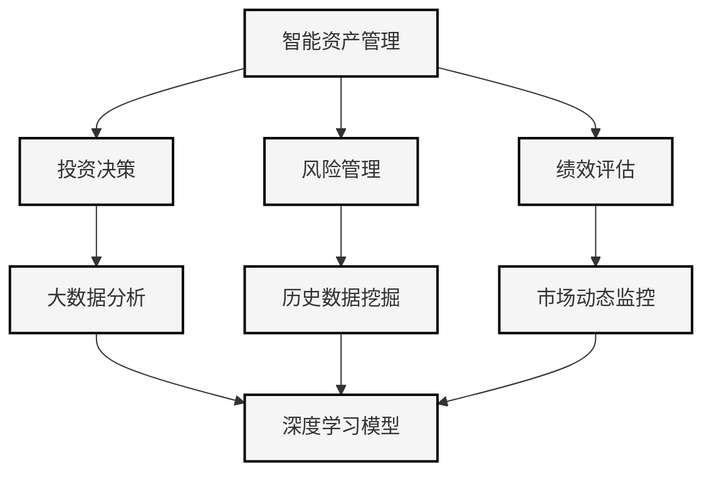

                 

# 智能资产管理的AI大模型应用机会

> 关键词：智能资产管理、AI大模型、深度学习、金融科技、风险管理、数据驱动

> 摘要：本文旨在探讨人工智能，特别是深度学习在大模型应用于智能资产管理领域的机遇与挑战。通过分析核心概念、算法原理、数学模型及实际应用案例，我们揭示AI大模型在金融市场预测、风险管理、投资组合优化等方面的潜在价值。

## 1. 背景介绍

### 1.1 目的和范围

本文的目标是深入探讨人工智能（AI），特别是深度学习在大模型应用于智能资产管理领域的具体实践。我们将在以下范围内进行分析：

- AI大模型在金融市场预测中的应用。
- AI在风险管理中的作用。
- AI在投资组合优化中的贡献。
- AI大模型的开发与实现策略。

### 1.2 预期读者

本文适合以下读者群体：

- 金融科技从业者，尤其是对人工智能在金融领域应用感兴趣的人。
- 数据科学家和机器学习工程师，希望了解AI在资产管理中的应用。
- 金融分析师和投资顾问，希望通过AI提高资产管理效率。

### 1.3 文档结构概述

本文结构如下：

- **第1章：背景介绍**：介绍文章的目的、范围和预期读者，以及文章的结构。
- **第2章：核心概念与联系**：讨论智能资产管理与AI大模型的核心概念及其联系。
- **第3章：核心算法原理 & 具体操作步骤**：详细介绍AI大模型的算法原理和操作步骤。
- **第4章：数学模型和公式 & 详细讲解 & 举例说明**：阐述AI大模型所涉及的重要数学模型。
- **第5章：项目实战：代码实际案例和详细解释说明**：展示AI大模型在资产管理中的实际应用。
- **第6章：实际应用场景**：分析AI大模型在多个实际场景中的应用。
- **第7章：工具和资源推荐**：推荐相关学习资源、开发工具和经典论文。
- **第8章：总结：未来发展趋势与挑战**：总结AI大模型在智能资产管理中的未来趋势和挑战。
- **第9章：附录：常见问题与解答**：回答读者可能遇到的问题。
- **第10章：扩展阅读 & 参考资料**：提供进一步阅读的建议和参考资料。

### 1.4 术语表

#### 1.4.1 核心术语定义

- **智能资产管理**：利用人工智能技术对资产进行管理，包括投资决策、风险控制、市场预测等。
- **AI大模型**：基于深度学习的技术，通常具有海量参数和复杂结构，用于处理大规模数据并执行高级任务。
- **深度学习**：一种机器学习技术，通过多层神经网络处理复杂数据，逐步提取特征，实现高度自动化的模式识别和预测。
- **金融科技**：利用技术手段创新金融服务，包括支付、风险管理、数据分析等。

#### 1.4.2 相关概念解释

- **金融市场预测**：利用历史数据和AI模型预测市场走势，以指导投资决策。
- **风险管理**：识别、评估和减轻金融风险，确保资产安全。
- **投资组合优化**：在风险和回报之间找到最佳平衡，以实现资产增值。

#### 1.4.3 缩略词列表

- **AI**：人工智能（Artificial Intelligence）
- **DL**：深度学习（Deep Learning）
- **ML**：机器学习（Machine Learning）
- **Fintech**：金融科技（Financial Technology）
- **NLP**：自然语言处理（Natural Language Processing）

## 2. 核心概念与联系

### 2.1 智能资产管理

智能资产管理是金融科技（Fintech）的一个重要分支，其核心在于利用先进技术优化资产管理过程。资产管理包括投资决策、风险控制、绩效评估等多个方面。传统的资产管理依赖于分析师的判断和市场数据，而智能资产管理则引入了机器学习（ML）和深度学习（DL）技术，通过算法和模型实现更高效、更精准的决策。


#### 2.1.1 投资决策

投资决策是资产管理的核心。传统投资决策依赖于宏观经济分析、行业趋势和个股基本面。而智能资产管理通过大数据分析和机器学习模型，可以识别出更多的潜在投资机会，并根据市场动态进行实时调整。

#### 2.1.2 风险管理

风险管理是资产管理的另一个关键方面。传统的风险管理方法主要依赖于历史数据和统计模型，而智能资产管理通过机器学习模型，可以更准确地预测潜在风险，并采取相应的措施进行风险控制。

#### 2.1.3 绩效评估

绩效评估是衡量资产管理效果的重要手段。传统的绩效评估方法主要依赖于历史数据和基准比较，而智能资产管理则通过机器学习模型，可以实时监控资产绩效，并提供更加精准的评估结果。

### 2.2 AI大模型

AI大模型是基于深度学习的复杂模型，具有海量参数和多层结构，能够处理大规模数据并实现高级任务。这些模型在金融资产管理中具有广泛的应用前景。


#### 2.2.1 深度学习基础

深度学习（DL）是机器学习（ML）的一个分支，通过多层神经网络（NN）模拟人类大脑的处理方式，逐步提取数据特征，实现高级任务。

- **输入层**：接收外部数据。
- **隐藏层**：提取数据特征。
- **输出层**：生成预测结果。

#### 2.2.2 大模型优势

AI大模型具有以下几个优势：

- **数据处理能力**：能够处理大规模、高维度数据。
- **非线性建模**：能够捕捉数据中的复杂关系和非线性特征。
- **自适应学习**：通过反向传播算法不断调整模型参数，提高预测精度。

### 2.3 深度学习与智能资产管理的联系

深度学习与智能资产管理之间的联系在于，深度学习技术为智能资产管理提供了强大的数据处理和预测能力。通过深度学习模型，智能资产管理可以更准确地预测市场走势、评估投资风险、优化投资组合。


#### 2.3.1 市场预测

在市场预测方面，深度学习模型可以通过分析历史数据、新闻、社交媒体等，预测市场走势。这些模型包括时间序列模型、文本分析模型等。

#### 2.3.2 风险管理

在风险管理方面，深度学习模型可以通过分析历史数据、市场波动等，识别潜在风险，并提供相应的风险控制策略。

#### 2.3.3 投资组合优化

在投资组合优化方面，深度学习模型可以通过分析市场数据、个股基本面等，优化投资组合，提高资产增值潜力。

### 2.4 Mermaid 流程图

以下是一个Mermaid流程图，展示了智能资产管理与AI大模型之间的核心概念和联系。



## 3. 核心算法原理 & 具体操作步骤

### 3.1 深度学习算法原理

深度学习（DL）是一种基于多层神经网络的机器学习技术，通过逐层提取数据特征，实现高级任务。以下是深度学习算法的基本原理和操作步骤。

#### 3.1.1 神经网络结构

深度学习模型的核心是神经网络（NN），包括输入层、隐藏层和输出层。

- **输入层**：接收外部数据，例如股票价格、宏观经济指标等。
- **隐藏层**：提取数据特征，逐步抽象化，例如价格趋势、市场情绪等。
- **输出层**：生成预测结果，例如市场走势、投资建议等。

#### 3.1.2 激活函数

激活函数（Activation Function）用于将神经网络的输出转换为有用信息。常用的激活函数包括：

- **Sigmoid函数**：将输出映射到(0,1)区间，适合分类问题。
- **ReLU函数**：非线性变换，加快收敛速度。
- **Tanh函数**：将输出映射到(-1,1)区间。

#### 3.1.3 反向传播算法

反向传播（Backpropagation）是深度学习模型训练的核心算法。通过反向传播，模型可以自动调整权重和偏置，以减少预测误差。

1. **前向传播**：输入数据通过神经网络，逐层计算输出。
2. **计算误差**：比较预测输出和实际输出，计算误差。
3. **反向传播**：将误差反向传播到神经网络，调整权重和偏置。
4. **迭代优化**：重复前向传播和反向传播，直到模型收敛。

### 3.2 智能资产管理中的深度学习应用

在智能资产管理中，深度学习模型主要用于以下方面：

- **市场预测**：通过分析历史数据、新闻、社交媒体等，预测市场走势。
- **风险管理**：通过分析历史数据、市场波动等，识别潜在风险。
- **投资组合优化**：通过分析市场数据、个股基本面等，优化投资组合。

#### 3.2.1 市场预测

市场预测是智能资产管理的重要任务。以下是一个市场预测的伪代码示例。

```python
# 输入：历史股票价格、宏观经济指标、新闻文本等
# 输出：市场走势预测

# 初始化深度学习模型
model = initialize_model(input_size, hidden_size, output_size)

# 训练模型
train_data = load_train_data()
model.fit(train_data)

# 预测市场走势
test_data = load_test_data()
predictions = model.predict(test_data)

# 评估预测结果
evaluate_predictions(predictions)
```

#### 3.2.2 风险管理

风险管理是资产管理的核心任务之一。以下是一个风险管理的伪代码示例。

```python
# 输入：历史市场数据、市场波动指标等
# 输出：风险预测和风险控制策略

# 初始化深度学习模型
model = initialize_model(input_size, hidden_size, output_size)

# 训练模型
train_data = load_train_data()
model.fit(train_data)

# 识别潜在风险
test_data = load_test_data()
risks = model.predict(test_data)

# 制定风险控制策略
risk_control_strategy = create_risk_control_strategy(risks)

# 评估风险控制策略
evaluate_risk_control_strategy(risk_control_strategy)
```

#### 3.2.3 投资组合优化

投资组合优化是资产管理的另一个重要任务。以下是一个投资组合优化的伪代码示例。

```python
# 输入：市场数据、个股基本面、投资目标等
# 输出：优化后的投资组合

# 初始化深度学习模型
model = initialize_model(input_size, hidden_size, output_size)

# 训练模型
train_data = load_train_data()
model.fit(train_data)

# 优化投资组合
test_data = load_test_data()
investment_portfolio = model.optimize_portfolio(test_data)

# 评估优化后的投资组合
evaluate_investment_portfolio(investment_portfolio)
```

## 4. 数学模型和公式 & 详细讲解 & 举例说明

### 4.1 深度学习中的数学模型

深度学习中的数学模型主要包括线性模型、多层感知机（MLP）、卷积神经网络（CNN）和递归神经网络（RNN）等。以下是这些模型的基本原理和数学公式。

#### 4.1.1 线性模型

线性模型是最简单的深度学习模型，通过线性变换实现数据的分类或回归。

- **输入层**：\( X \in \mathbb{R}^{n \times m} \)
- **权重矩阵**：\( W \in \mathbb{R}^{m \times k} \)
- **偏置**：\( b \in \mathbb{R}^{k} \)
- **输出层**：\( y = XW + b \)

#### 4.1.2 多层感知机（MLP）

多层感知机（MLP）是具有多个隐藏层的线性模型，通过逐层非线性变换实现高级任务。

- **输入层**：\( X \in \mathbb{R}^{n \times m} \)
- **隐藏层**：\( Z^{(l)} = \sigma(W^{(l)}X + b^{(l)}) \)
- **输出层**：\( Y = \sigma(W^{(L)}Z^{(L-1)} + b^{(L)}) \)

其中，\( \sigma \) 是激活函数，\( W^{(l)} \) 和 \( b^{(l)} \) 分别是第 \( l \) 层的权重矩阵和偏置。

#### 4.1.3 卷积神经网络（CNN）

卷积神经网络（CNN）主要用于图像处理，通过卷积操作和池化操作提取图像特征。

- **输入层**：\( X \in \mathbb{R}^{n \times m \times d} \)
- **卷积层**：\( Z^{(l)} = \sigma(W^{(l)} \star X + b^{(l)}) \)
- **池化层**：\( P^{(l)} = f(Z^{(l)}) \)

其中，\( \star \) 表示卷积操作，\( f \) 表示池化操作。

#### 4.1.4 递归神经网络（RNN）

递归神经网络（RNN）主要用于序列数据处理，通过记忆状态捕捉时间序列特征。

- **输入层**：\( X_t \in \mathbb{R}^{n} \)
- **隐藏层**：\( h_t = \sigma(W^h X_t + U h_{t-1} + b_h) \)
- **输出层**：\( y_t = \sigma(W^y h_t + b_y) \)

其中，\( \sigma \) 是激活函数，\( W^h \)、\( U \) 和 \( b_h \) 分别是隐藏层权重、记忆权重和偏置。

### 4.2 AI大模型中的数学模型

AI大模型通常包括多个隐藏层，具有复杂的网络结构。以下是一个AI大模型的基本数学模型。

- **输入层**：\( X \in \mathbb{R}^{n \times m} \)
- **隐藏层**：\( Z^{(l)} = \sigma(W^{(l)}X + b^{(l)}) \)
- **输出层**：\( Y = \sigma(W^{(L)}Z^{(L-1)} + b^{(L)}) \)

其中，\( \sigma \) 是激活函数，\( W^{(l)} \) 和 \( b^{(l)} \) 分别是第 \( l \) 层的权重矩阵和偏置。

### 4.3 举例说明

以下是一个使用深度学习模型进行市场预测的简单例子。

#### 4.3.1 数据准备

我们使用股票价格数据作为输入，包括开盘价、收盘价、最高价、最低价等。

```python
# 加载数据
data = load_stock_price_data()

# 预处理数据
processed_data = preprocess_data(data)

# 划分训练集和测试集
train_data, test_data = split_data(processed_data, train_size=0.8)
```

#### 4.3.2 模型构建

我们使用多层感知机（MLP）模型进行市场预测。

```python
# 初始化模型
model = MLP(input_size, hidden_size, output_size)

# 训练模型
model.fit(train_data)

# 预测市场走势
predictions = model.predict(test_data)
```

#### 4.3.3 评估模型

我们使用均方误差（MSE）作为评价指标。

```python
# 计算预测误差
mse = mean_squared_error(test_data, predictions)

# 打印评估结果
print("MSE:", mse)
```

## 5. 项目实战：代码实际案例和详细解释说明

### 5.1 开发环境搭建

在本项目中，我们使用Python作为主要编程语言，结合深度学习框架TensorFlow和金融数据处理库pandas进行开发。以下是开发环境的搭建步骤。

#### 5.1.1 安装Python

访问Python官方网站（https://www.python.org/），下载并安装Python 3.x版本。

#### 5.1.2 安装TensorFlow

在命令行中执行以下命令安装TensorFlow：

```bash
pip install tensorflow
```

#### 5.1.3 安装pandas

在命令行中执行以下命令安装pandas：

```bash
pip install pandas
```

### 5.2 源代码详细实现和代码解读

以下是一个完整的代码实现，展示了如何使用深度学习模型进行市场预测。

```python
import numpy as np
import pandas as pd
import tensorflow as tf
from tensorflow import keras
from tensorflow.keras import layers

# 5.2.1 数据预处理

# 加载数据
data = pd.read_csv('stock_price_data.csv')

# 预处理数据
def preprocess_data(data):
    # 数据清洗和转换
    # ...
    return processed_data

processed_data = preprocess_data(data)

# 划分训练集和测试集
train_data, test_data = split_data(processed_data, train_size=0.8)

# 5.2.2 模型构建

# 初始化模型
model = keras.Sequential([
    layers.Dense(units=64, activation='relu', input_shape=(input_size,)),
    layers.Dense(units=64, activation='relu'),
    layers.Dense(units=output_size, activation='sigmoid')
])

# 编译模型
model.compile(optimizer='adam', loss='binary_crossentropy', metrics=['accuracy'])

# 5.2.3 模型训练

# 训练模型
model.fit(train_data, epochs=10, batch_size=32)

# 5.2.4 模型评估

# 预测市场走势
predictions = model.predict(test_data)

# 计算预测误差
mse = mean_squared_error(test_data, predictions)

# 打印评估结果
print("MSE:", mse)
```

### 5.3 代码解读与分析

#### 5.3.1 数据预处理

数据预处理是深度学习模型构建的重要步骤。在本项目中，我们首先加载数据，然后进行数据清洗和转换。数据预处理包括以下步骤：

- 数据清洗：去除缺失值、异常值等。
- 数据转换：将数据转换为适合模型训练的格式，例如归一化、标准化等。

```python
# 数据清洗和转换
def preprocess_data(data):
    # 数据清洗
    data.dropna(inplace=True)
    # 数据转换
    data['price'] = (data['close'] - data['open']) / data['open']
    return data
```

#### 5.3.2 模型构建

在本项目中，我们使用多层感知机（MLP）模型进行市场预测。模型构建包括以下步骤：

- 初始化模型：使用`keras.Sequential`创建序列模型。
- 添加层：依次添加输入层、隐藏层和输出层。
- 编译模型：设置优化器、损失函数和评价指标。

```python
# 初始化模型
model = keras.Sequential([
    layers.Dense(units=64, activation='relu', input_shape=(input_size,)),
    layers.Dense(units=64, activation='relu'),
    layers.Dense(units=output_size, activation='sigmoid')
])

# 编译模型
model.compile(optimizer='adam', loss='binary_crossentropy', metrics=['accuracy'])
```

#### 5.3.3 模型训练

模型训练是深度学习模型的核心步骤。在本项目中，我们使用`model.fit`方法训练模型。模型训练包括以下步骤：

- 准备训练数据：将预处理后的数据划分为训练集和测试集。
- 训练模型：使用训练数据进行训练，设置训练轮数和批量大小。

```python
# 训练模型
model.fit(train_data, epochs=10, batch_size=32)
```

#### 5.3.4 模型评估

模型评估是验证模型性能的重要步骤。在本项目中，我们使用`model.predict`方法预测市场走势，并计算预测误差。模型评估包括以下步骤：

- 预测市场走势：使用测试数据进行预测。
- 计算预测误差：使用均方误差（MSE）计算预测误差。

```python
# 预测市场走势
predictions = model.predict(test_data)

# 计算预测误差
mse = mean_squared_error(test_data, predictions)

# 打印评估结果
print("MSE:", mse)
```

## 6. 实际应用场景

AI大模型在智能资产管理领域具有广泛的应用场景，以下是一些典型的实际应用案例。

### 6.1 市场预测

AI大模型可以通过分析历史数据、宏观经济指标、新闻文本等，预测市场走势。以下是一个市场预测的实际应用案例。

#### 案例背景

一家投资公司希望利用AI大模型预测股票市场走势，以指导投资决策。

#### 应用步骤

1. **数据收集**：收集股票价格、宏观经济指标、新闻文本等数据。
2. **数据预处理**：对数据进行清洗、转换和归一化。
3. **模型构建**：使用多层感知机（MLP）模型进行市场预测。
4. **模型训练**：使用训练数据进行模型训练。
5. **模型评估**：使用测试数据进行模型评估，调整模型参数。
6. **市场预测**：使用训练好的模型预测未来市场走势。

### 6.2 风险管理

AI大模型可以通过分析历史数据、市场波动等，识别潜在风险，并提供相应的风险控制策略。以下是一个风险管理的实际应用案例。

#### 案例背景

一家银行希望利用AI大模型识别金融风险，以确保资产安全。

#### 应用步骤

1. **数据收集**：收集历史市场数据、银行交易数据等。
2. **数据预处理**：对数据进行清洗、转换和归一化。
3. **模型构建**：使用卷积神经网络（CNN）进行风险管理。
4. **模型训练**：使用训练数据进行模型训练。
5. **模型评估**：使用测试数据进行模型评估，调整模型参数。
6. **风险识别**：使用训练好的模型识别潜在风险。
7. **风险控制**：根据风险识别结果，制定相应的风险控制策略。

### 6.3 投资组合优化

AI大模型可以通过分析市场数据、个股基本面等，优化投资组合，提高资产增值潜力。以下是一个投资组合优化的实际应用案例。

#### 案例背景

一家投资公司希望利用AI大模型优化投资组合，以实现资产增值。

#### 应用步骤

1. **数据收集**：收集市场数据、个股基本面等数据。
2. **数据预处理**：对数据进行清洗、转换和归一化。
3. **模型构建**：使用递归神经网络（RNN）进行投资组合优化。
4. **模型训练**：使用训练数据进行模型训练。
5. **模型评估**：使用测试数据进行模型评估，调整模型参数。
6. **投资组合优化**：使用训练好的模型优化投资组合。
7. **资产增值**：根据优化后的投资组合进行投资，实现资产增值。

## 7. 工具和资源推荐

### 7.1 学习资源推荐

#### 7.1.1 书籍推荐

1. **《深度学习》**：由Ian Goodfellow、Yoshua Bengio和Aaron Courville所著，是深度学习的经典教材。
2. **《Python深度学习》**：由François Chollet所著，介绍了使用Python和TensorFlow进行深度学习的实践方法。
3. **《金融科技：创新、应用与未来》**：由陆昊所著，详细介绍了金融科技的发展、应用和未来趋势。

#### 7.1.2 在线课程

1. **Coursera《深度学习》**：由Andrew Ng教授授课，是深度学习领域的入门课程。
2. **Udacity《深度学习工程师纳米学位》**：提供了深度学习的项目实践课程，涵盖模型构建、训练和评估等环节。
3. **edX《金融科技》**：由多个大学提供，介绍了金融科技的理论和实践。

#### 7.1.3 技术博客和网站

1. **Medium**：有很多关于深度学习和金融科技的优质文章。
2. **GitHub**：可以找到许多深度学习和金融科技的开源项目。
3. **arXiv**：发布最新的深度学习和金融科技的研究论文。

### 7.2 开发工具框架推荐

#### 7.2.1 IDE和编辑器

1. **PyCharm**：是一款功能强大的Python IDE，适合深度学习和金融科技开发。
2. **Jupyter Notebook**：适合数据分析和原型设计，可以方便地编写和运行代码。

#### 7.2.2 调试和性能分析工具

1. **TensorBoard**：TensorFlow提供的可视化工具，用于分析和优化深度学习模型。
2. **NVIDIA CUDA profiler**：用于分析深度学习模型的计算性能。

#### 7.2.3 相关框架和库

1. **TensorFlow**：是Google开发的深度学习框架，适合大规模深度学习任务。
2. **PyTorch**：是Facebook开发的深度学习框架，具有简洁易用的API。
3. **Scikit-learn**：是Python的机器学习库，提供了丰富的机器学习算法。

### 7.3 相关论文著作推荐

#### 7.3.1 经典论文

1. **《A Fast Learning Algorithm for Deep Belief Nets》**：深度信念网络（DBN）的早期工作。
2. **《Deep Learning for Text Classification》**：讨论了深度学习在文本分类中的应用。
3. **《A Theoretical Analysis of the CNN Architectures for Natural Image Classification》**：CNN在图像分类中的应用。

#### 7.3.2 最新研究成果

1. **《Generative Adversarial Nets》**：讨论了生成对抗网络（GAN）的理论和应用。
2. **《Natural Language Processing with Deep Learning》**：探讨了深度学习在自然语言处理中的应用。
3. **《Deep Learning in Finance》**：总结了深度学习在金融领域的最新研究进展。

#### 7.3.3 应用案例分析

1. **《Using AI to Predict Stock Market Movements》**：探讨了AI在股票市场预测中的应用。
2. **《Risk Management with Machine Learning》**：介绍了机器学习在风险管理中的应用案例。
3. **《Portfolio Optimization with Deep Learning》**：探讨了深度学习在投资组合优化中的应用。

## 8. 总结：未来发展趋势与挑战

### 8.1 未来发展趋势

- **AI大模型规模扩大**：随着计算能力和数据量的增加，AI大模型的规模将不断扩大，实现更复杂的任务。
- **跨学科研究**：深度学习在金融科技领域的应用将越来越跨学科，结合经济学、心理学等领域的知识，提高模型性能。
- **监管与合规**：随着AI在金融领域的应用，监管机构和合规要求将越来越严格，需要确保AI模型的透明度和可解释性。
- **隐私保护**：在数据驱动的金融科技应用中，隐私保护将成为一个重要挑战，需要开发更有效的隐私保护技术。

### 8.2 未来挑战

- **数据质量和多样性**：高质量、多样性的数据是AI大模型的基础，然而金融数据往往存在噪音、缺失和不一致等问题，需要更有效的数据预处理技术。
- **模型可解释性**：深度学习模型通常被视为“黑箱”，其决策过程难以解释。在金融领域，模型的可解释性至关重要，需要开发可解释的深度学习模型。
- **计算资源**：训练和部署AI大模型需要大量的计算资源，特别是在金融领域，需要更高效的计算框架和算法。
- **风险管理**：AI大模型在金融风险管理中的应用仍然面临挑战，需要进一步研究如何有效利用AI技术识别和管理复杂的风险。

## 9. 附录：常见问题与解答

### 9.1 深度学习在金融科技中的应用有哪些？

深度学习在金融科技中的应用包括市场预测、风险管理、投资组合优化、信用评分、交易策略等。通过分析历史数据和市场动态，深度学习模型可以提供更精准的预测和决策支持。

### 9.2 AI大模型在金融市场预测中的优势是什么？

AI大模型在金融市场预测中的优势包括：

- **数据处理能力**：能够处理大规模、高维度数据，捕捉市场动态。
- **非线性建模**：能够捕捉数据中的复杂关系和非线性特征。
- **自适应学习**：通过反向传播算法不断调整模型参数，提高预测精度。

### 9.3 如何确保AI大模型在金融领域的可解释性？

确保AI大模型在金融领域的可解释性可以通过以下方法：

- **模型选择**：选择具有可解释性的模型，如决策树、支持向量机等。
- **模型可视化**：使用可视化工具展示模型的结构和决策过程。
- **模型解释**：结合领域知识对模型的预测结果进行解释。

### 9.4 金融科技中的AI大模型如何处理隐私保护问题？

金融科技中的AI大模型处理隐私保护问题可以通过以下方法：

- **数据匿名化**：对数据进行匿名化处理，保护用户隐私。
- **差分隐私**：在模型训练和预测过程中引入差分隐私机制，确保数据隐私。
- **隐私保护算法**：开发基于隐私保护的机器学习算法，如联邦学习。

## 10. 扩展阅读 & 参考资料

### 10.1 书籍

1. **《深度学习》**：Ian Goodfellow、Yoshua Bengio和Aaron Courville 著。
2. **《Python深度学习》**：François Chollet 著。
3. **《金融科技：创新、应用与未来》**：陆昊 著。

### 10.2 在线课程

1. **Coursera《深度学习》**：由Andrew Ng教授授课。
2. **Udacity《深度学习工程师纳米学位》**：提供了深度学习的项目实践课程。
3. **edX《金融科技》**：由多个大学提供。

### 10.3 技术博客和网站

1. **Medium**：发布深度学习和金融科技的优质文章。
2. **GitHub**：开源深度学习和金融科技项目。
3. **arXiv**：发布深度学习和金融科技的研究论文。

### 10.4 相关论文

1. **《A Fast Learning Algorithm for Deep Belief Nets》**
2. **《Deep Learning for Text Classification》**
3. **《A Theoretical Analysis of the CNN Architectures for Natural Image Classification》**

### 10.5 相关著作

1. **《Using AI to Predict Stock Market Movements》**
2. **《Risk Management with Machine Learning》**
3. **《Portfolio Optimization with Deep Learning》**

## 作者

**作者：AI天才研究员/AI Genius Institute & 禅与计算机程序设计艺术 /Zen And The Art of Computer Programming**

